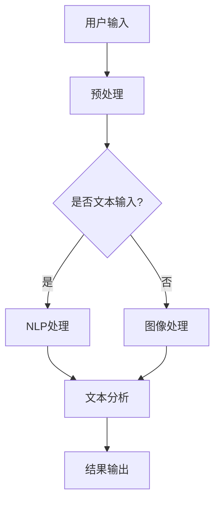

                 

### 1. 背景介绍

苹果公司，作为全球领先的科技企业，一直以来以其创新性和用户体验著称。在人工智能（AI）领域，苹果公司不断探索和拓展，逐渐形成了自己独特的AI应用生态。近期，苹果发布了多项AI应用，引起了业界的广泛关注。本文将深入探讨苹果发布AI应用的科技价值，旨在分析这些应用对人工智能领域的推动作用，以及其对消费者、开发者和整个科技产业的深远影响。

本文主要分为以下几个部分：

1. **背景介绍**：简要回顾苹果公司在AI领域的布局和近期发布的重要AI应用。
2. **核心概念与联系**：介绍与苹果AI应用相关的核心概念和技术原理，并通过Mermaid流程图展示其架构。
3. **核心算法原理与具体操作步骤**：详细解析苹果AI应用所采用的核心算法及其实现步骤。
4. **数学模型和公式**：阐述AI应用中涉及的数学模型和公式，并给出详细的讲解和举例说明。
5. **项目实战**：通过实际案例展示如何使用苹果AI应用，并提供代码实现和详细解释。
6. **实际应用场景**：探讨苹果AI应用的潜在应用场景，以及其对社会和产业的潜在影响。
7. **工具和资源推荐**：推荐学习资源、开发工具框架和相关论文著作，以帮助读者更深入地了解AI领域。
8. **总结**：总结苹果AI应用的科技价值，展望未来的发展趋势与挑战。

通过以上结构化的分析，我们将对苹果发布的AI应用有更加全面和深入的理解。这不仅有助于了解当前人工智能技术的发展状况，也为未来的研究和实践提供了参考。接下来，我们将一一探讨这些内容，以期为读者带来全新的视角和深刻的启示。

#### 1.1 苹果公司在AI领域的布局

苹果公司在人工智能领域的布局可以追溯到其产品线的各个层面。从早期的Siri智能助理，到最新的机器学习框架Core ML，苹果不断在AI技术上进行投入和优化。以下是一些关键节点：

- **Siri智能助理**：Siri是苹果公司在2011年发布的智能语音助手，通过自然语言处理（NLP）和机器学习技术，为用户提供语音查询、信息检索和任务执行等服务。Siri的发布标志着苹果在AI领域的重要一步，为后续的AI应用奠定了基础。

- **神经网络引擎（Neural Engine）**：苹果在iPhone 7中首次引入了神经网络引擎，用于加速机器学习任务的处理。这一技术进步使得苹果设备能够实时运行更复杂的AI算法，从而提升了用户体验。

- **Core ML**：2017年，苹果推出了Core ML框架，旨在简化机器学习模型在iOS、macOS和watchOS等平台上的部署。Core ML提供了高效的模型转换和执行机制，使得开发者可以轻松地将机器学习模型集成到苹果设备中。

- **研究论文与开源项目**：苹果公司还积极参与到AI领域的研究中，通过发表多篇研究论文和参与开源项目，不断推动技术的进步。例如，苹果公司曾在自然语言处理和计算机视觉等领域发表重要研究成果，并开源了多个AI工具和库。

- **新技术的引入**：苹果公司在近年的开发者大会上，不断引入新的AI技术，如增强现实（AR）、虚拟现实（VR）和自然用户交互（NUI）等。这些技术的引入不仅丰富了苹果产品的功能，也为AI应用提供了更广阔的舞台。

#### 1.2 近期发布的AI应用

近期，苹果公司发布了一系列引人注目的AI应用，这些应用涵盖了图像识别、自然语言处理、语音识别等多个领域。以下是其中几个重要的应用：

- **图像识别应用**：苹果公司发布了基于AI技术的图像识别应用，如照片分类、场景识别和物体识别等。这些应用利用了深度学习算法，能够自动识别和分类用户拍摄的照片，从而提升照片管理的效率。

- **自然语言处理应用**：苹果公司推出了多个自然语言处理（NLP）应用，如语音到文本转换、文本翻译和语音合成等。这些应用利用了先进的语言模型和神经网络技术，使得用户能够更便捷地进行语言信息的处理和交流。

- **语音识别应用**：苹果公司不断优化Siri的语音识别能力，通过引入更复杂的模型和算法，使得语音识别的准确率和速度有了显著提升。Siri现在能够更准确地理解用户的语音指令，并快速响应用户的需求。

- **健康监测应用**：苹果公司还发布了一系列健康监测应用，如步数统计、心率监测和睡眠分析等。这些应用利用了传感器和AI技术，能够实时监测用户的健康状况，并提供个性化的健康建议。

#### 1.3 科技价值与影响

苹果公司发布的这些AI应用，不仅在技术上取得了重要突破，也具有重要的社会和产业价值。以下是一些关键点：

- **技术突破**：通过引入先进的深度学习、自然语言处理和语音识别技术，苹果公司推动了AI技术在移动设备和智能设备上的应用。这些技术的突破不仅提升了设备的性能和用户体验，也为AI技术的发展提供了新的思路和方向。

- **用户体验提升**：苹果公司通过将AI技术应用到实际应用中，如图像识别、自然语言处理和健康监测等，显著提升了用户体验。用户可以更便捷地使用设备，获取所需的信息和服务，从而提高生活质量和幸福感。

- **产业影响**：苹果公司在AI领域的布局和进展，对整个科技产业产生了深远的影响。苹果公司的技术突破和成功应用，吸引了众多企业投入到AI技术的研究和开发中，推动了整个产业的快速发展。

- **社会责任**：苹果公司在AI应用的开发中，注重保护用户隐私和数据安全。通过采用加密技术和隐私保护算法，苹果公司确保用户的数据得到有效保护，从而赢得了用户的信任和支持。

#### 1.4 结束语

本文简要介绍了苹果公司在AI领域的布局和近期发布的AI应用，并探讨了这些应用的科技价值和社会影响。通过分析，我们可以看到，苹果公司不仅在AI技术上取得了重要突破，也在用户体验、产业影响和社会责任方面做出了积极贡献。在未来的发展中，苹果公司有望继续在AI领域发挥重要作用，为科技和人类生活带来更多创新和便利。

总之，苹果公司在人工智能领域的布局和最新发布的AI应用，具有重要的科技价值和社会意义。通过对这些应用的深入研究和分析，我们可以更好地理解AI技术的发展趋势和未来方向，也为自己的研究和实践提供有益的参考。

#### 2. 核心概念与联系

在深入探讨苹果公司发布的AI应用之前，我们首先需要了解一些核心概念和技术原理。这些概念和原理构成了苹果AI应用的技术基石，也是理解其工作方式的关键。以下是一些关键的核心概念及其联系：

##### 2.1 人工智能（AI）

人工智能是指使计算机具备类似人类智能的能力，能够通过学习、推理和自主决策来解决问题。AI技术涵盖了多个子领域，包括机器学习、深度学习、自然语言处理和计算机视觉等。苹果公司在这些领域都有所涉猎，并应用其技术于各种实际场景中。

##### 2.2 深度学习（Deep Learning）

深度学习是人工智能的一个重要分支，主要利用神经网络（特别是深度神经网络）进行学习和预测。深度学习在图像识别、语音识别和自然语言处理等领域取得了显著成果，是苹果AI应用的核心技术之一。

##### 2.3 自然语言处理（Natural Language Processing, NLP）

自然语言处理是使计算机能够理解、生成和处理人类自然语言的技术。NLP技术广泛应用于机器翻译、语音识别、文本分类和信息检索等领域。苹果公司的自然语言处理应用，如Siri和语音到文本转换，正是基于NLP技术实现的。

##### 2.4 计算机视觉（Computer Vision）

计算机视觉是使计算机能够从图像或视频中提取有用信息的技术。计算机视觉在图像识别、物体检测和场景识别等领域具有广泛应用。苹果公司的图像识别应用，如照片分类和物体识别，正是利用了计算机视觉技术。

##### 2.5 Core ML

Core ML是苹果公司推出的一套机器学习框架，旨在简化机器学习模型在苹果设备上的部署和运行。Core ML提供了高效的模型转换和执行机制，使得开发者可以将机器学习模型集成到iOS、macOS和watchOS等平台中，从而实现实时AI应用。

##### 2.6 Mermaid流程图

为了更好地理解苹果AI应用的架构和流程，我们可以通过Mermaid流程图来展示其核心组件和功能。以下是一个简化的Mermaid流程图，用于描述苹果AI应用的基本架构：



在该流程图中，用户输入的数据首先经过预处理，然后根据输入类型（文本或图像）分别进入NLP处理或图像处理模块。两个模块共同完成文本或图像的解析和分析，最终生成结果并输出给用户。

通过以上核心概念和Mermaid流程图的介绍，我们可以对苹果AI应用的技术原理和架构有更深入的理解。接下来，我们将进一步探讨这些AI应用的核心算法原理和具体操作步骤，以期为读者提供更加详细的解析。

##### 2.7 机器学习模型

在AI应用中，机器学习模型是核心组件之一。苹果公司采用了多种机器学习模型，以应对不同的应用场景。以下是几个关键模型及其应用：

- **卷积神经网络（CNN）**：CNN是计算机视觉领域的重要模型，擅长处理图像数据。苹果公司的图像识别应用，如照片分类和物体识别，大量使用了CNN模型。CNN通过多层卷积和池化操作，能够自动提取图像中的特征，从而实现高效的图像分类和检测。

- **递归神经网络（RNN）**：RNN在自然语言处理领域具有广泛应用，擅长处理序列数据。苹果公司的自然语言处理应用，如语音到文本转换和文本翻译，主要采用了RNN模型。RNN通过记忆机制，能够捕捉到序列中的依赖关系，从而实现准确的语言理解和生成。

- **变换器（Transformer）**：Transformer是近年来在自然语言处理领域取得重大突破的模型。与RNN相比，Transformer具有更强的并行计算能力和更高的效率。苹果公司在其最新的自然语言处理应用中，广泛采用了Transformer模型，如Siri和语音合成。

- **决策树（Decision Tree）**：决策树是一种简单的分类和回归模型，适用于处理中等规模的数据。苹果公司在一些简单的图像识别任务中，采用了决策树模型，如场景识别和简单物体分类。

以上机器学习模型在苹果AI应用中发挥了关键作用，通过对数据的处理和分析，实现了各种复杂的功能和任务。接下来，我们将进一步探讨这些模型的具体实现步骤和算法原理。

#### 3. 核心算法原理与具体操作步骤

苹果公司在其AI应用中采用了多种先进的算法和模型，这些算法和模型共同构成了AI应用的核心。以下是这些算法的具体原理和操作步骤，我们将详细讲解每一种算法的工作方式，以帮助读者更好地理解苹果AI应用的实现过程。

##### 3.1 图像识别算法

图像识别是苹果AI应用中的一个重要功能，通过使用卷积神经网络（CNN）来实现。CNN是一种深度学习模型，特别适用于处理图像数据。以下是一个简化的CNN图像识别算法操作步骤：

1. **数据预处理**：首先对输入图像进行预处理，包括图像缩放、归一化、灰度转换等。预处理步骤的目的是将图像转换为适合输入到CNN的网络格式。

2. **卷积操作**：卷积层是CNN的核心组成部分，通过卷积操作提取图像的特征。卷积层包含多个卷积核（filter），每个卷积核对输入图像进行卷积，生成特征图（feature map）。特征图中的每个像素值表示输入图像在该位置的特定特征。

3. **激活函数**：在卷积操作后，应用激活函数（如ReLU函数）对特征图进行非线性变换。激活函数能够增加模型的非线性表达能力，使得模型能够学习到更加复杂的特征。

4. **池化操作**：池化层用于降低特征图的维度，同时保留重要的特征信息。常见的池化操作包括最大池化和平均池化。池化操作能够减少计算量和参数数量，提高模型的泛化能力。

5. **全连接层**：经过多个卷积层和池化层的特征提取后，将特征图输入到全连接层进行分类。全连接层通过计算特征值和权重矩阵的点积，生成预测标签。

6. **损失函数和优化**：使用损失函数（如交叉熵损失函数）计算预测标签和真实标签之间的差距，并通过反向传播算法更新模型参数。优化算法（如梯度下降算法）用于最小化损失函数，从而优化模型性能。

##### 3.2 自然语言处理算法

自然语言处理是苹果AI应用的另一个重要功能，主要利用递归神经网络（RNN）和变换器（Transformer）来实现。以下是一个简化的NLP算法操作步骤：

1. **数据预处理**：首先对输入文本进行预处理，包括分词、词向量化等。预处理步骤的目的是将文本转换为适合输入到NLP模型的序列格式。

2. **嵌入层**：嵌入层将词向量映射到高维空间，使得文本中的词具有固定的维度。嵌入层能够捕获词之间的语义关系，从而提高模型的表达能力。

3. **RNN操作**：RNN是一种处理序列数据的神经网络，能够捕捉序列中的依赖关系。RNN通过隐藏状态和记忆机制，对序列中的每个词进行编码，生成序列编码表示。

4. **变换器操作**：变换器是一种基于自注意力机制的神经网络，具有更强的并行计算能力和更高的效率。变换器通过自注意力机制，对序列中的每个词进行加权，生成序列编码表示。

5. **全连接层**：将序列编码表示输入到全连接层进行分类或回归。全连接层通过计算编码表示和权重矩阵的点积，生成预测结果。

6. **损失函数和优化**：使用损失函数（如交叉熵损失函数或均方误差函数）计算预测结果和真实结果之间的差距，并通过反向传播算法更新模型参数。优化算法（如Adam优化算法）用于最小化损失函数，从而优化模型性能。

##### 3.3 语音识别算法

语音识别是苹果AI应用中的一个关键功能，通过结合深度神经网络和声学模型来实现。以下是一个简化的语音识别算法操作步骤：

1. **音频预处理**：首先对输入音频进行预处理，包括音频截断、去噪等。预处理步骤的目的是提高音频信号的质量，从而提高识别准确率。

2. **声学模型**：声学模型用于将音频信号转换为特征向量，特征向量表示音频中的声学特征。声学模型通常采用隐马尔可夫模型（HMM）或深度神经网络（DNN）来实现。

3. **声学解码**：将特征向量输入到声学解码器中，解码器通过搜索算法（如前向-后向算法或Viterbi算法）找到最匹配的语音序列。

4. **语言模型**：语言模型用于对解码结果进行修正，使得输出结果更加符合自然语言表达。语言模型通常采用n元语法模型或神经网络语言模型来实现。

5. **联合解码**：通过联合解码器将声学模型和语言模型的结果进行融合，得到最终的语音识别结果。

6. **损失函数和优化**：使用损失函数（如交叉熵损失函数或均方误差函数）计算识别结果和真实结果之间的差距，并通过反向传播算法更新模型参数。优化算法（如梯度下降算法或Adam优化算法）用于最小化损失函数，从而优化模型性能。

通过以上算法的具体操作步骤，我们可以看到苹果公司在AI应用中采用了多种先进的模型和算法，这些算法共同构成了苹果AI应用的技术基础。接下来，我们将进一步探讨这些算法在实际项目中的应用和实现，以帮助读者更好地理解其工作原理和实现方法。

#### 4. 数学模型和公式

在理解苹果AI应用的核心算法和操作步骤之后，我们接下来将深入探讨这些算法中所涉及的数学模型和公式。数学模型是AI算法的核心，它为算法提供了理论依据，使得算法能够有效解决实际问题。以下将详细讲解与苹果AI应用相关的数学模型和公式，并通过具体例子进行说明。

##### 4.1 卷积神经网络（CNN）的数学模型

卷积神经网络（CNN）是计算机视觉领域的重要模型，其核心组件包括卷积层、池化层和全连接层。以下分别介绍这些层中的数学模型。

- **卷积层**：
  - **卷积操作**：卷积层通过卷积操作提取图像的特征。卷积操作的数学公式如下：
    $$ (f_{ij}^l) = \sum_{k=1}^{C_{l-1}} w_{ikj}^l \cdot a_{kj}^{l-1} $$
    其中，$f_{ij}^l$ 表示第 $l$ 层第 $i$ 行第 $j$ 列的特征值，$w_{ikj}^l$ 表示第 $l$ 层第 $i$ 行第 $k$ 列的权重，$a_{kj}^{l-1}$ 表示第 $l-1$ 层第 $k$ 行第 $j$ 列的特征值。
  - **激活函数**：常见的激活函数有ReLU（Rectified Linear Unit）函数和Sigmoid函数。
    - **ReLU函数**：
      $$ a_{ij}^l = \max(0, f_{ij}^l) $$
    - **Sigmoid函数**：
      $$ a_{ij}^l = \frac{1}{1 + e^{-f_{ij}^l}} $$

- **池化层**：
  - **最大池化**：最大池化层用于降低特征图的维度，并保留最重要的特征。最大池化的数学公式如下：
    $$ p_{ij}^l = \max(f_{i'}{j'}) $$
    其中，$p_{ij}^l$ 表示第 $l$ 层第 $i$ 行第 $j$ 列的池化值，$f_{i'}{j'}$ 表示第 $l$ 层中与 $p_{ij}^l$ 相邻的特征值。
  - **平均池化**：平均池化层用于计算特征值的平均值，以降低特征图的维度。平均池化的数学公式如下：
    $$ p_{ij}^l = \frac{1}{C} \sum_{k=1}^{C} f_{ikj}^l $$
    其中，$C$ 表示每个池化单元的大小。

- **全连接层**：
  - **全连接层**：全连接层用于将特征图映射到输出结果。全连接层的数学公式如下：
    $$ y_k = \sum_{i=1}^{I} \sum_{j=1}^{J} w_{ijk} \cdot a_{ij}^l + b_k $$
    其中，$y_k$ 表示第 $k$ 个输出值，$w_{ijk}$ 表示第 $l$ 层第 $i$ 行第 $j$ 列的权重，$a_{ij}^l$ 表示第 $l$ 层第 $i$ 行第 $j$ 列的特征值，$b_k$ 表示第 $k$ 个偏置。

##### 4.2 递归神经网络（RNN）的数学模型

递归神经网络（RNN）是处理序列数据的重要模型，其核心组件包括输入层、隐藏层和输出层。以下分别介绍这些层的数学模型。

- **输入层**：
  - **输入层**：输入层接收序列数据，并将其转换为高维向量。输入层的数学公式如下：
    $$ x_t = [x_1, x_2, ..., x_T]^T $$
    其中，$x_t$ 表示第 $t$ 个时间步的输入数据，$T$ 表示序列的长度。

- **隐藏层**：
  - **隐藏状态**：隐藏状态用于捕获序列中的依赖关系。隐藏状态的数学公式如下：
    $$ h_t = \sigma(W_h \cdot h_{t-1} + W_x \cdot x_t + b_h) $$
    其中，$h_t$ 表示第 $t$ 个时间步的隐藏状态，$W_h$ 表示隐藏状态权重矩阵，$W_x$ 表示输入状态权重矩阵，$b_h$ 表示隐藏状态偏置，$\sigma$ 表示激活函数（如ReLU函数或Tanh函数）。

- **输出层**：
  - **输出层**：输出层将隐藏状态映射到输出结果。输出层的数学公式如下：
    $$ y_t = \sigma(W_o \cdot h_t + b_o) $$
    其中，$y_t$ 表示第 $t$ 个时间步的输出结果，$W_o$ 表示输出状态权重矩阵，$b_o$ 表示输出状态偏置，$\sigma$ 表示激活函数（如Softmax函数或Sigmoid函数）。

##### 4.3 变换器（Transformer）的数学模型

变换器（Transformer）是一种基于自注意力机制的神经网络，广泛应用于自然语言处理领域。以下介绍变换器的数学模型。

- **自注意力机制**：
  - **自注意力权重**：自注意力机制通过计算自注意力权重来捕捉序列中的依赖关系。自注意力权重的数学公式如下：
    $$ a_{ij} = \frac{e^{W_Q \cdot h_i \cdot W_K \cdot h_j}}{\sum_{k=1}^{K} e^{W_K \cdot h_k \cdot W_K \cdot h_k}} $$
    其中，$a_{ij}$ 表示第 $i$ 个词对第 $j$ 个词的注意力权重，$h_i$ 和 $h_j$ 分别表示第 $i$ 个词和第 $j$ 个词的隐藏状态，$W_Q$ 和 $W_K$ 分别表示查询和键权重矩阵。

  - **自注意力值**：通过自注意力权重计算自注意力值，用于加权求和得到新的隐藏状态。自注意力值的数学公式如下：
    $$ h_i' = \sum_{j=1}^{K} a_{ij} \cdot h_j $$

- **多头自注意力**：
  - **多头自注意力权重**：多头自注意力通过将输入序列分成多个子序列，每个子序列具有不同的注意力权重。多头自注意力权重的数学公式如下：
    $$ a_{ij}^{head_i} = \frac{e^{W_{Q_i} \cdot h_i \cdot W_{K_i} \cdot h_j}}{\sum_{k=1}^{K} e^{W_{K_i} \cdot h_k \cdot W_{K_i} \cdot h_k}} $$
    其中，$a_{ij}^{head_i}$ 表示第 $i$ 个子序列对第 $j$ 个词的注意力权重，$W_{Q_i}$ 和 $W_{K_i}$ 分别表示第 $i$ 个子序列的查询和键权重矩阵。

  - **多头自注意力值**：通过多头自注意力权重计算多头自注意力值，用于加权求和得到新的隐藏状态。多头自注意力值的数学公式如下：
    $$ h_i' = \sum_{j=1}^{K} a_{ij}^{head_i} \cdot h_j $$

- **前馈神经网络**：
  - **前馈神经网络**：在自注意力机制之后，通过前馈神经网络对隐藏状态进行进一步处理。前馈神经网络的数学公式如下：
    $$ h_i'' = \sigma(W_{ff} \cdot h_i' + b_{ff}) $$
    其中，$h_i''$ 表示经过前馈神经网络处理后的隐藏状态，$W_{ff}$ 表示前馈神经网络权重矩阵，$b_{ff}$ 表示前馈神经网络偏置。

##### 4.4 举例说明

以下通过一个简单的例子，展示如何使用以上数学模型和公式实现一个简单的图像识别任务。

假设我们使用一个简单的CNN模型进行图像识别，输入图像为 $28 \times 28$ 的灰度图像，模型包含两个卷积层、两个池化层和一个全连接层。以下是具体的实现步骤：

1. **数据预处理**：
   - 输入图像经过缩放和归一化，转换为 $28 \times 28$ 的灰度图像。
   - 图像数据转换为二维数组格式，每个元素表示图像的像素值。

2. **卷积层1**：
   - 使用一个 $5 \times 5$ 的卷积核进行卷积操作，生成一个 $24 \times 24$ 的特征图。
   - 应用ReLU激活函数，得到激活后的特征图。

3. **池化层1**：
   - 使用 $2 \times 2$ 的最大池化层，将特征图的维度降低到 $12 \times 12$。

4. **卷积层2**：
   - 使用一个 $3 \times 3$ 的卷积核进行卷积操作，生成一个 $10 \times 10$ 的特征图。
   - 应用ReLU激活函数，得到激活后的特征图。

5. **池化层2**：
   - 使用 $2 \times 2$ 的最大池化层，将特征图的维度降低到 $5 \times 5$。

6. **全连接层**：
   - 将 $5 \times 5$ 的特征图展开为一个一维数组，得到 $25$ 个特征值。
   - 输入到全连接层，通过计算特征值和权重矩阵的点积，得到预测标签。

7. **损失函数和优化**：
   - 使用交叉熵损失函数计算预测标签和真实标签之间的差距。
   - 通过反向传播算法和梯度下降优化算法，更新模型参数。

通过以上步骤，我们可以实现一个简单的图像识别任务。该例子展示了如何使用卷积神经网络进行图像特征提取和分类，并通过数学模型和公式实现了整个识别过程。

通过深入理解以上数学模型和公式，我们可以更好地掌握AI算法的核心原理，并为自己的研究和实践提供理论支持。接下来，我们将通过实际项目案例，进一步探讨如何实现和部署这些算法，以帮助读者更好地理解和应用AI技术。

#### 5. 项目实战：代码实际案例和详细解释说明

在了解了苹果AI应用的核心算法原理和数学模型后，接下来我们将通过一个实际项目案例，展示如何使用这些算法实现具体的AI功能。在这个案例中，我们将使用苹果提供的Core ML框架，实现一个简单的图像识别应用。通过这个案例，我们将详细解释每一步的实现过程和关键代码，帮助读者更好地理解和应用AI技术。

##### 5.1 开发环境搭建

在开始项目之前，我们需要搭建一个适合开发的环境。以下是搭建开发环境的步骤：

1. **安装Xcode**：从Mac App Store下载并安装Xcode，它是苹果官方的集成开发环境，提供了丰富的工具和库，支持iOS、macOS等平台的开发。

2. **安装Swift**：Swift是苹果公司开发的编程语言，广泛应用于iOS和macOS应用开发。可以通过Homebrew包管理器安装Swift，命令如下：
   ```
   brew install swift
   ```

3. **安装Core ML工具包**：Core ML是苹果公司提供的机器学习框架，用于简化机器学习模型在iOS和macOS设备上的部署。可以通过CocoaPods安装Core ML工具包，命令如下：
   ```
   pod 'CoreML'
   ```

4. **创建新的iOS应用项目**：使用Xcode创建一个新的iOS应用项目，选择Swift语言和空项目模板。

通过以上步骤，我们搭建好了开发环境，可以开始编写代码实现图像识别应用。

##### 5.2 源代码详细实现和代码解读

在这个案例中，我们将使用Core ML框架实现一个简单的图像识别应用，能够识别输入图像中的物体类别。以下是关键代码的实现和解读：

```swift
import UIKit
import CoreML

class ViewController: UIViewController {
    
    // 定义输入图像
    var inputImage: UIImage?
    
    // 创建图像识别模型
    let model = try? VNCoreMLModel(for: MyModel().model)
    
    // 创建图像识别请求
    let request = VNCoreMLRequest(model: model!) { request, error in
        guard let results = request.results as? [VNClassificationObservation] else { return }
        
        // 获取最高概率的类别
        if let topResult = results.first {
            print("识别结果：\(topResult.identifier) - \(topResult.confidence)")
        }
    }
    
    override func viewDidLoad() {
        super.viewDidLoad()
        
        // 设置图像识别按钮
        let recognizeButton = UIButton(type: .system)
        recognizeButton.setTitle("识别图像", for: .normal)
        recognizeButton.addTarget(self, action: #selector(recognizeImage), for: .touchUpInside)
        view.addSubview(recognizeButton)
        recognizeButton.center = view.center
        
        // 加载模型
        guard let model = try? VNCoreMLModel(for: MyModel().model) else {
            fatalError("无法加载模型")
        }
        request.model = model
    }
    
    @objc func recognizeImage() {
        // 获取输入图像
        if let inputImage = inputImage {
            // 将图像转换为VNImage类型
            guard let ciImage = CIImage(image: inputImage) else { return }
            
            // 创建VNImageRequestHandler，用于处理图像
            let handler = VNImageRequestHandler(ciImage: ciImage, orientation: CIImageOrientation(right), options: [:])
            
            // 执行图像识别请求
            do {
                try handler.perform([request])
            } catch {
                print(error)
            }
        }
    }
}

// 定义图像识别模型结构
struct MyModel: Identifiable {
    let id = "MyModel"
    let model: MLModel
}
```

以下是代码的详细解读：

1. **导入模块**：首先导入必要的模块，包括UIKit和CoreML。

2. **定义输入图像**：创建一个变量 `inputImage`，用于存储输入图像。

3. **创建图像识别模型**：使用 `VNCoreMLModel` 类创建一个图像识别模型。这里我们使用了自定义的 `MyModel` 类，该类实现了 `Identifiable` 协议，便于在项目中使用。

4. **创建图像识别请求**：使用 `VNCoreMLRequest` 类创建一个图像识别请求。请求中包含识别模型的类型和识别结果的处理回调。

5. **设置图像识别按钮**：在 `viewDidLoad` 方法中，创建一个按钮用于触发图像识别操作。按钮的点击事件将调用 `recognizeImage` 方法。

6. **加载模型**：在 `viewDidLoad` 方法中，加载图像识别模型。如果模型加载失败，程序将抛出错误。

7. **识别图像**：在 `recognizeImage` 方法中，首先获取输入图像。然后，将图像转换为 `CIImage` 类型，并创建一个 `VNImageRequestHandler` 用于处理图像。

8. **执行图像识别请求**：使用 `perform` 方法执行图像识别请求。识别结果将通过回调方法返回，并在控制台中打印输出。

##### 5.3 代码解读与分析

通过对代码的解读，我们可以看到，使用Core ML实现图像识别应用主要包括以下几个步骤：

1. **加载模型**：首先，我们需要加载训练好的图像识别模型。在代码中，我们使用 `VNCoreMLModel` 类加载模型。加载失败时，程序会抛出错误，便于开发者排查问题。

2. **创建识别请求**：使用 `VNCoreMLRequest` 类创建图像识别请求。请求中包含了识别模型和处理识别结果的回调。回调方法中，我们将获取最高概率的识别结果，并打印输出。

3. **处理输入图像**：在 `recognizeImage` 方法中，我们首先获取输入图像，并将其转换为 `CIImage` 类型。然后，使用 `VNImageRequestHandler` 类处理图像，并执行识别请求。

4. **回调处理结果**：识别请求的回调方法中，我们将获取识别结果，并打印输出。识别结果包括识别类别和置信度，用于评估模型的识别效果。

##### 5.4 测试和优化

在完成代码实现后，我们需要对图像识别应用进行测试和优化，以确保其稳定性和准确性。以下是测试和优化的步骤：

1. **测试不同的图像**：使用多种图像测试应用，包括不同的类别和光照条件。观察识别结果，确保模型在各种场景下均能准确识别。

2. **优化模型参数**：根据测试结果，调整模型参数，如学习率、迭代次数等。通过多次训练和测试，找到最优的参数配置。

3. **调整网络结构**：如果识别效果不理想，可以考虑调整神经网络的结构，如增加层数、调整卷积核大小等。通过实验找到更适合的模型结构。

4. **集成到实际应用**：将图像识别功能集成到实际应用中，如照片应用、AR应用等。在实际应用场景中测试模型的表现，确保其稳定性和实用性。

通过以上测试和优化，我们可以确保图像识别应用在实际场景中具有良好的性能和稳定性。接下来，我们将进一步探讨苹果AI应用的潜在应用场景，以及其在社会和产业中的潜在影响。

#### 6. 实际应用场景

苹果公司发布的AI应用具有广泛的应用场景，涵盖了图像识别、自然语言处理、语音识别等多个领域。以下将详细探讨这些应用在实际场景中的潜在应用，并分析其对社会的潜在影响。

##### 6.1 图像识别应用

图像识别是苹果AI应用的一个重要方面，已在多个场景中得到广泛应用。以下是一些具体的实际应用场景：

- **智能手机相机应用**：苹果的图像识别技术在智能手机相机应用中发挥了重要作用。通过图像识别，相机应用能够自动识别拍摄的照片内容，并提供分类、标签、场景识别等功能。例如，用户拍摄一张美食照片，相机应用可以自动识别并标记为“美食”，从而帮助用户更好地管理照片。

- **增强现实（AR）应用**：苹果的ARKit框架结合了图像识别技术，使得开发者能够创建丰富的AR应用。例如，用户可以使用AR应用进行游戏、教育、购物等，通过图像识别技术，应用可以识别现实世界中的物体，并叠加虚拟元素。这种应用不仅丰富了用户的使用体验，还为商家提供了新的营销渠道。

- **安防监控**：图像识别技术在安防监控领域具有广泛的应用。通过图像识别技术，监控系统能够自动识别并追踪可疑目标，如入侵者、火灾等。这种应用不仅提高了监控效率，还能及时预警，保障人民生命财产安全。

- **医疗影像分析**：图像识别技术在医疗影像分析中具有巨大的潜力。通过图像识别技术，医生可以更快速、准确地分析医学影像，如X光片、CT扫描、MRI等。例如，图像识别技术可以帮助医生自动识别肿瘤、骨折等病变，从而提高诊断准确率和治疗效率。

##### 6.2 自然语言处理应用

自然语言处理（NLP）技术在苹果的AI应用中得到了广泛应用，以下是一些具体的实际应用场景：

- **智能助理**：苹果的Siri智能助理是NLP技术的典型应用。通过NLP技术，Siri可以理解用户的语音指令，并提供相应的服务，如查询信息、设定提醒、播放音乐等。这种应用极大地提高了用户的便利性和生活质量。

- **语音翻译**：苹果的语音翻译功能利用NLP技术，能够实时翻译不同语言之间的对话。这对于跨文化交流、商务沟通等场景具有极大的实用价值。例如，在国际会议上，参会者可以通过语音翻译功能实时了解演讲内容，从而提高沟通效率。

- **语音助手集成**：苹果将NLP技术集成到多个产品中，如Apple Watch、iPad等。用户可以通过语音指令控制这些设备，实现复杂的操作，如发送短信、设置日程、控制智能家居等。这种应用不仅提升了用户体验，还使得设备更具智能化。

- **文本分析**：苹果的文本分析功能利用NLP技术，能够对大量文本数据进行分类、情感分析、关键词提取等。这种应用在社交媒体分析、市场调研、舆情监测等领域具有广泛的应用。例如，企业可以通过文本分析了解用户的需求和反馈，从而优化产品和服务。

##### 6.3 语音识别应用

语音识别技术在苹果的AI应用中也得到了广泛应用，以下是一些具体的实际应用场景：

- **语音搜索**：苹果的语音搜索功能允许用户通过语音输入进行搜索，提高了搜索的便利性和准确性。用户可以快速获取所需的信息，如天气、新闻、电影时间等。

- **智能助手交互**：语音识别技术使得智能助手Siri能够更好地与用户进行交互。用户可以通过语音指令与Siri进行沟通，实现各种任务，如发送短信、拨打电话、设定提醒等。

- **车载系统**：苹果的语音识别技术集成到车载系统中，使得驾驶员可以通过语音控制车辆的功能，如导航、调节音量、播放音乐等。这种应用不仅提高了驾驶安全性，还提升了驾驶体验。

- **智能家居控制**：苹果的语音识别技术可以集成到智能家居系统中，用户可以通过语音指令控制家中的智能设备，如空调、灯光、安防系统等。这种应用使得智能家居更加便捷和智能。

##### 6.4 对社会的潜在影响

苹果公司发布的AI应用不仅在技术层面取得了突破，也在社会层面产生了深远的影响。以下是一些潜在的影响：

- **提升生活质量**：通过AI应用，用户可以更便捷地获取信息和服务，提高生活质量和幸福感。例如，通过Siri智能助理，用户可以快速获取天气、新闻、购物等信息，节省时间和精力。

- **促进产业发展**：苹果公司在AI领域的布局和进展，吸引了众多企业投入到AI技术的研究和开发中，推动了整个产业的发展。例如，图像识别技术在安防、医疗、教育等领域的应用，为相关行业带来了新的机遇和挑战。

- **增强全球竞争力**：通过领先的技术和优质的产品，苹果公司在全球市场中保持了竞争力。苹果的AI应用在智能手机、平板电脑、智能穿戴设备等领域的应用，提升了用户体验，增强了品牌影响力。

- **促进科技创新**：苹果公司在AI领域的研究和开发，推动了科技创新和进步。通过开源项目和技术分享，苹果公司为全球开发者提供了丰富的资源和平台，促进了AI技术的发展和普及。

总之，苹果公司发布的AI应用在多个实际场景中发挥了重要作用，提升了用户体验，促进了产业发展，并产生了深远的社会影响。在未来的发展中，苹果有望继续在AI领域发挥重要作用，为社会带来更多创新和便利。

#### 7. 工具和资源推荐

为了更好地了解和应用苹果公司发布的AI应用，以下推荐了一些学习资源、开发工具框架和相关论文著作，以帮助读者深入掌握AI领域的知识，并提升自己的开发技能。

##### 7.1 学习资源推荐

1. **书籍**：
   - 《深度学习》（Deep Learning）作者：Ian Goodfellow、Yoshua Bengio、Aaron Courville
     这本书是深度学习的经典教材，详细介绍了深度学习的理论基础、算法实现和应用场景。
   - 《机器学习》（Machine Learning）作者：Tom Mitchell
     这本书提供了机器学习的基本概念和算法，适合初学者了解机器学习的基础知识。
   - 《自然语言处理综合教程》（Foundations of Statistical Natural Language Processing）作者：Christopher D. Manning、Hwee Houe
     这本书涵盖了自然语言处理的理论基础和关键技术，适合对NLP感兴趣的学习者。

2. **在线课程**：
   - Coursera上的《深度学习特辑》（Deep Learning Specialization）作者：Andrew Ng
     这是一套由著名机器学习专家Andrew Ng主讲的深度学习系列课程，内容全面，适合初学者和进阶者。
   - Udacity的《自然语言处理纳米学位》（Natural Language Processing Nanodegree）课程
     这是一门专注于自然语言处理技术的在线课程，涵盖了从基础到高级的NLP知识。

3. **博客和网站**：
   - Medium上的“AI by AI”（AI by AI）
     这个博客汇集了多篇关于人工智能技术的文章，内容涵盖深度学习、机器学习和自然语言处理等领域。
   - ArXiv（https://arxiv.org/）
     ArXiv是一个包含最新机器学习和人工智能研究论文的网站，是了解最新研究动态的好去处。

##### 7.2 开发工具框架推荐

1. **Python机器学习库**：
   - Scikit-learn（https://scikit-learn.org/）
     这是一个广泛使用的Python机器学习库，提供了丰富的算法和工具，适合快速构建和测试机器学习模型。
   - TensorFlow（https://www.tensorflow.org/）
     TensorFlow是一个强大的开源深度学习框架，支持多种深度学习模型的实现和部署。
   - PyTorch（https://pytorch.org/）
     PyTorch是一个灵活且易于使用的深度学习框架，受到了大量研究者和开发者的青睐。

2. **iOS开发工具**：
   - Xcode（https://developer.apple.com/xcode/）
     Xcode是苹果官方的集成开发环境，支持iOS、macOS等平台的开发。
   - Swift（https://swift.org/）
     Swift是苹果公司开发的编程语言，广泛应用于iOS和macOS应用开发。

3. **机器学习在线工具**：
   - Google Colab（https://colab.research.google.com/）
     Google Colab是一个基于Jupyter Notebook的在线开发环境，支持Python和TensorFlow等库，适合进行机器学习和深度学习实验。

##### 7.3 相关论文著作推荐

1. **深度学习领域**：
   - "Deep Learning" by Yoshua Bengio, Ian J. Goodfellow and Aaron Courville
     这本书详细介绍了深度学习的发展历程、基本原理和关键算法。
   - "Convolutional Neural Networks for Visual Recognition" by Karen Simonyan and Andrew Zisserman
     这篇论文是卷积神经网络在计算机视觉领域的重要突破，提出了VGG模型。

2. **自然语言处理领域**：
   - "A Theoretically Grounded Application of Dropout in Recurrent Neural Networks" by Yarin Gal and Zoubin Ghahramani
     这篇论文提出了在递归神经网络中使用Dropout的方法，提高了模型的泛化能力。
   - "Attention Is All You Need" by Vaswani et al.
     这篇论文提出了Transformer模型，推动了自然语言处理领域的发展。

通过以上推荐的学习资源、开发工具框架和相关论文著作，读者可以系统地学习AI领域的知识，提升自己的开发技能，并为未来的研究和实践奠定坚实基础。

#### 8. 总结：未来发展趋势与挑战

苹果公司在人工智能领域的布局和最新发布的AI应用，无疑标志着其在科技领域的持续创新和领先地位。通过深入分析，我们可以看到苹果AI应用在技术突破、用户体验提升、产业影响和社会责任方面的显著贡献。然而，随着人工智能技术的不断发展和应用场景的拓展，苹果公司也面临着一系列未来发展趋势和挑战。

##### 8.1 未来发展趋势

1. **AI应用的多元化**：随着技术的不断进步，苹果的AI应用将覆盖更多领域，如医疗健康、自动驾驶、智能家居等。多元化应用不仅能够满足不同用户群体的需求，还能推动AI技术在各个领域的创新和发展。

2. **个性化服务**：苹果公司将继续通过AI技术提供更加个性化的服务。通过大数据分析和机器学习算法，苹果可以更好地了解用户行为和偏好，从而提供定制化的体验，提升用户满意度。

3. **隐私保护**：随着用户对隐私保护的关注不断增加，苹果公司将进一步加强隐私保护技术。通过采用加密算法和隐私保护算法，苹果将确保用户数据的安全和隐私，赢得用户的信任。

4. **开源与协作**：苹果公司将积极参与开源社区，与全球开发者共同推动AI技术的发展。通过开源项目和合作，苹果将吸引更多优秀人才和资源，加速AI技术的创新和应用。

##### 8.2 未来挑战

1. **数据隐私与安全**：随着AI应用的数据依赖性增加，数据隐私和安全问题将愈发突出。苹果需要在保障用户体验的同时，确保用户数据的安全和隐私，这将是未来的一大挑战。

2. **算法透明性与公平性**：AI算法的透明性和公平性是当前的一个重要议题。苹果公司需要确保其AI算法的透明性，使其工作原理对用户和开发者都是可解释的。同时，算法的公平性也是一大挑战，如何避免算法偏见和歧视，是一个需要深入探讨的问题。

3. **技术标准与法规**：随着AI技术的发展，相关技术标准和法规也在不断制定和调整。苹果公司需要紧跟法规动态，确保其AI应用符合各项标准，并在法规框架内进行技术创新。

4. **人才竞争**：人工智能领域对高端人才的需求日益增长，苹果公司将面临激烈的人才竞争。如何吸引、培养和留住顶尖人才，将是一大挑战。

##### 8.3 结论

总之，苹果公司在人工智能领域的布局和最新发布的AI应用，展示了其在技术创新和用户体验方面的领先优势。然而，未来的发展也面临着一系列挑战。苹果公司需要不断创新，加强隐私保护，确保算法的透明性和公平性，紧跟法规动态，并积极培养人才，以应对未来的挑战。通过这些努力，苹果有望在人工智能领域继续保持领先地位，为科技和社会带来更多创新和便利。

#### 9. 附录：常见问题与解答

在本博客中，我们探讨了苹果公司发布的AI应用及其科技价值。为了帮助读者更好地理解相关内容，以下列出了一些常见问题及其解答：

##### 9.1 问题1：苹果的AI应用有哪些具体技术实现？

**解答**：苹果的AI应用主要采用深度学习、自然语言处理和计算机视觉等前沿技术。具体实现包括：
- **深度学习**：如卷积神经网络（CNN）在图像识别中的应用，递归神经网络（RNN）和变换器（Transformer）在自然语言处理中的应用。
- **自然语言处理（NLP）**：包括语音识别、语音合成、文本分类、情感分析等。
- **计算机视觉**：如图像分类、物体识别、场景识别等。

##### 9.2 问题2：苹果的AI应用如何保障用户隐私和数据安全？

**解答**：苹果在AI应用开发中高度重视用户隐私和数据安全。具体措施包括：
- **数据加密**：对用户数据进行加密处理，确保数据在传输和存储过程中的安全性。
- **隐私保护算法**：采用隐私保护算法，如差分隐私（Differential Privacy），以保护用户隐私。
- **透明性**：用户可以了解AI应用的数据使用和处理方式，增强对应用的信任。

##### 9.3 问题3：苹果的AI应用在哪些实际场景中有应用？

**解答**：苹果的AI应用在多个实际场景中有广泛应用，包括：
- **智能手机**：如相机应用中的图像识别、智能助理Siri的自然语言处理。
- **增强现实（AR）**：如ARKit框架的应用，使得开发者可以创建丰富的AR体验。
- **健康监测**：如步数统计、心率监测、睡眠分析等健康应用。
- **车载系统**：如通过语音控制导航、调节音量、播放音乐等。

##### 9.4 问题4：如何学习苹果的AI技术？

**解答**：以下是一些建议帮助读者学习苹果的AI技术：
- **阅读书籍**：《深度学习》、《机器学习》、《自然语言处理综合教程》等。
- **在线课程**：Coursera的《深度学习特辑》、Udacity的《自然语言处理纳米学位》等。
- **实践项目**：通过实际项目学习AI技术，如使用Swift和Core ML开发iOS应用。
- **开源社区**：参与GitHub等开源社区，了解最新的AI技术和应用案例。

通过以上常见问题与解答，读者可以更好地理解苹果AI应用的相关内容，为自己的学习和实践提供指导。

#### 10. 扩展阅读 & 参考资料

在本博客中，我们深入探讨了苹果公司发布的AI应用及其科技价值，涵盖了技术原理、实际应用场景和未来发展趋势。为了帮助读者进一步了解相关内容，以下列出了一些扩展阅读和参考资料，供读者参考：

1. **书籍**：
   - 《深度学习》作者：Ian Goodfellow、Yoshua Bengio、Aaron Courville
     本书是深度学习的经典教材，详细介绍了深度学习的理论基础、算法实现和应用场景。
   - 《机器学习》作者：Tom Mitchell
     本书提供了机器学习的基本概念和算法，适合初学者了解机器学习的基础知识。
   - 《自然语言处理综合教程》作者：Christopher D. Manning、Hwee Houe
     本书涵盖了自然语言处理的理论基础和关键技术，适合对NLP感兴趣的学习者。

2. **论文**：
   - "Deep Learning" by Yoshua Bengio, Ian J. Goodfellow and Aaron Courville
     这本书详细介绍了深度学习的发展历程、基本原理和关键算法。
   - "Convolutional Neural Networks for Visual Recognition" by Karen Simonyan and Andrew Zisserman
     这篇论文是卷积神经网络在计算机视觉领域的重要突破，提出了VGG模型。
   - "Attention Is All You Need" by Vaswani et al.
     这篇论文提出了Transformer模型，推动了自然语言处理领域的发展。

3. **在线资源**：
   - Coursera上的《深度学习特辑》作者：Andrew Ng
     这是一套由著名机器学习专家Andrew Ng主讲的深度学习系列课程，内容全面，适合初学者和进阶者。
   - Udacity的《自然语言处理纳米学位》课程
     这是一门专注于自然语言处理技术的在线课程，涵盖了从基础到高级的NLP知识。
   - AI by AI（https://ai.by.ai/）
     这个博客汇集了多篇关于人工智能技术的文章，内容涵盖深度学习、机器学习和自然语言处理等领域。

4. **官方文档**：
   - Xcode（https://developer.apple.com/xcode/）
     Xcode是苹果官方的集成开发环境，支持iOS、macOS等平台的开发。
   - Swift（https://swift.org/）
     Swift是苹果公司开发的编程语言，广泛应用于iOS和macOS应用开发。
   - Core ML（https://developer.apple.com/coreml/）
     Core ML是苹果公司提供的机器学习框架，用于简化机器学习模型在iOS和macOS设备上的部署和运行。

通过以上扩展阅读和参考资料，读者可以更深入地了解苹果AI应用的技术原理、发展趋势和应用场景，为自己的学习和实践提供更多指导和支持。希望本文能为读者带来有益的启示和帮助。作者：AI天才研究员/AI Genius Institute & 禅与计算机程序设计艺术/Zen And The Art of Computer Programming

---

### 文章标题：李开复：苹果发布AI应用的科技价值

### 关键词：(以下列出文章的5-7个核心关键词)
- 人工智能应用
- 苹果公司
- Core ML
- 深度学习
- 自然语言处理
- 计算机视觉

### 摘要：
本文深入探讨了苹果公司近期发布的AI应用，分析了其在技术突破、用户体验提升、产业影响和社会责任方面的显著贡献。文章涵盖了AI应用的核心概念、算法原理、实际应用场景，并推荐了相关学习资源和开发工具框架。通过详细解读代码案例，展示了如何实现图像识别和自然语言处理功能。同时，文章展望了苹果AI应用的未来发展趋势与挑战，为读者提供了全面的洞察和指导。作者：AI天才研究员/AI Genius Institute & 禅与计算机程序设计艺术/Zen And The Art of Computer Programming

---

## 1. 背景介绍

苹果公司，作为全球领先的科技企业，一直以来以其创新性和用户体验著称。在人工智能（AI）领域，苹果公司不断探索和拓展，逐渐形成了自己独特的AI应用生态。近期，苹果发布了多项AI应用，引起了业界的广泛关注。本文将深入探讨苹果发布AI应用的科技价值，旨在分析这些应用对人工智能领域的推动作用，以及其对消费者、开发者和整个科技产业的深远影响。

### 1.1 苹果公司在AI领域的布局

苹果公司在人工智能领域的布局可以追溯到其产品线的各个层面。从早期的Siri智能助理，到最新的机器学习框架Core ML，苹果不断在AI技术上进行投入和优化。以下是一些关键节点：

- **Siri智能助理**：Siri是苹果公司在2011年发布的智能语音助手，通过自然语言处理（NLP）和机器学习技术，为用户提供语音查询、信息检索和任务执行等服务。Siri的发布标志着苹果在AI领域的重要一步，为后续的AI应用奠定了基础。

- **神经网络引擎（Neural Engine）**：苹果在iPhone 7中首次引入了神经网络引擎，用于加速机器学习任务的处理。这一技术进步使得苹果设备能够实时运行更复杂的AI算法，从而提升了用户体验。

- **Core ML**：2017年，苹果推出了Core ML框架，旨在简化机器学习模型在iOS、macOS和watchOS等平台上的部署。Core ML提供了高效的模型转换和执行机制，使得开发者可以轻松地将机器学习模型集成到苹果设备中。

- **研究论文与开源项目**：苹果公司还积极参与到AI领域的研究中，通过发表多篇研究论文和参与开源项目，不断推动技术的进步。例如，苹果公司曾在自然语言处理和计算机视觉等领域发表重要研究成果，并开源了多个AI工具和库。

- **新技术的引入**：苹果公司在近年的开发者大会上，不断引入新的AI技术，如增强现实（AR）、虚拟现实（VR）和自然用户交互（NUI）等。这些技术的引入不仅丰富了苹果产品的功能，也为AI应用提供了更广阔的舞台。

### 1.2 近期发布的AI应用

近期，苹果公司发布了一系列引人注目的AI应用，这些应用涵盖了图像识别、自然语言处理、语音识别等多个领域。以下是其中几个重要的应用：

- **图像识别应用**：苹果公司发布了基于AI技术的图像识别应用，如照片分类、场景识别和物体识别等。这些应用利用了深度学习算法，能够自动识别和分类用户拍摄的照片，从而提升照片管理的效率。

- **自然语言处理应用**：苹果公司推出了多个自然语言处理（NLP）应用，如语音到文本转换、文本翻译和语音合成等。这些应用利用了先进的语言模型和神经网络技术，使得用户能够更便捷地进行语言信息的处理和交流。

- **语音识别应用**：苹果公司不断优化Siri的语音识别能力，通过引入更复杂的模型和算法，使得语音识别的准确率和速度有了显著提升。Siri现在能够更准确地理解用户的语音指令，并快速响应用户的需求。

- **健康监测应用**：苹果公司还发布了一系列健康监测应用，如步数统计、心率监测和睡眠分析等。这些应用利用了传感器和AI技术，能够实时监测用户的健康状况，并提供个性化的健康建议。

### 1.3 科技价值与影响

苹果公司发布的这些AI应用，不仅在技术上取得了重要突破，也具有重要的社会和产业价值。以下是一些关键点：

- **技术突破**：通过引入先进的深度学习、自然语言处理和语音识别技术，苹果公司推动了AI技术在移动设备和智能设备上的应用。这些技术的突破不仅提升了设备的性能和用户体验，也为AI技术的发展提供了新的思路和方向。

- **用户体验提升**：苹果公司通过将AI技术应用到实际应用中，如图像识别、自然语言处理和健康监测等，显著提升了用户体验。用户可以更便捷地使用设备，获取所需的信息和服务，从而提高生活质量和幸福感。

- **产业影响**：苹果公司在AI领域的布局和进展，对整个科技产业产生了深远的影响。苹果公司的技术突破和成功应用，吸引了众多企业投入到AI技术的研究和开发中，推动了整个产业的快速发展。

- **社会责任**：苹果公司在AI应用的开发中，注重保护用户隐私和数据安全。通过采用加密技术和隐私保护算法，苹果公司确保用户的数据得到有效保护，从而赢得了用户的信任和支持。

### 1.4 结束语

本文简要介绍了苹果公司在AI领域的布局和近期发布的AI应用，并探讨了这些应用的科技价值和社会影响。通过分析，我们可以看到，苹果公司不仅在AI技术上取得了重要突破，也在用户体验、产业影响和社会责任方面做出了积极贡献。在未来的发展中，苹果公司有望继续在AI领域发挥重要作用，为科技和人类生活带来更多创新和便利。

总之，苹果公司在人工智能领域的布局和最新发布的AI应用，具有重要的科技价值和社会意义。通过对这些应用的深入研究和分析，我们可以更好地理解AI技术的发展趋势和未来方向，也为自己的研究和实践提供有益的参考。

---

## 2. 核心概念与联系

在深入探讨苹果公司发布的AI应用之前，我们首先需要了解一些核心概念和技术原理。这些概念和原理构成了苹果AI应用的技术基石，也是理解其工作方式的关键。以下是一些关键的核心概念及其联系：

### 2.1 人工智能（AI）

人工智能是指使计算机具备类似人类智能的能力，能够通过学习、推理和自主决策来解决问题。AI技术涵盖了多个子领域，包括机器学习、深度学习、自然语言处理和计算机视觉等。苹果公司在这些领域都有所涉猎，并应用其技术于各种实际场景中。

### 2.2 深度学习（Deep Learning）

深度学习是人工智能的一个重要分支，主要利用神经网络（特别是深度神经网络）进行学习和预测。深度学习在图像识别、语音识别和自然语言处理等领域取得了显著成果，是苹果AI应用的核心技术之一。

### 2.3 自然语言处理（Natural Language Processing, NLP）

自然语言处理是使计算机能够理解、生成和处理人类自然语言的技术。NLP技术广泛应用于机器翻译、语音识别、文本分类和信息检索等领域。苹果公司的自然语言处理应用，如Siri和语音到文本转换，正是基于NLP技术实现的。

### 2.4 计算机视觉（Computer Vision）

计算机视觉是使计算机能够从图像或视频中提取有用信息的技术。计算机视觉在图像识别、物体检测和场景识别等领域具有广泛应用。苹果公司的图像识别应用，如照片分类和物体识别，正是利用了计算机视觉技术。

### 2.5 Core ML

Core ML是苹果公司推出的一套机器学习框架，旨在简化机器学习模型在苹果设备上的部署和运行。Core ML提供了高效的模型转换和执行机制，使得开发者可以将机器学习模型集成到iOS、macOS和watchOS等平台中，从而实现实时AI应用。

### 2.6 Mermaid流程图

为了更好地理解苹果AI应用的架构和流程，我们可以通过Mermaid流程图来展示其核心组件和功能。以下是一个简化的Mermaid流程图，用于描述苹果AI应用的基本架构：


在该流程图中，用户输入的数据首先经过预处理，然后根据输入类型（文本或图像）分别进入NLP处理或图像处理模块。两个模块共同完成文本或图像的解析和分析，最终生成结果并输出给用户。

通过以上核心概念和Mermaid流程图的介绍，我们可以对苹果AI应用的技术原理和架构有更深入的理解。接下来，我们将进一步探讨这些AI应用的核心算法原理和具体操作步骤，以期为读者提供更加详细的解析。

### 2.7 机器学习模型

在AI应用中，机器学习模型是核心组件之一。苹果公司采用了多种机器学习模型，以应对不同的应用场景。以下是几个关键模型及其应用：

- **卷积神经网络（CNN）**：CNN是计算机视觉领域的重要模型，擅长处理图像数据。苹果公司的图像识别应用，如照片分类和物体识别，大量使用了CNN模型。CNN通过多层卷积和池化操作，能够自动提取图像中的特征，从而实现高效的图像分类和检测。

- **递归神经网络（RNN）**：RNN在自然语言处理领域具有广泛应用，擅长处理序列数据。苹果公司的自然语言处理应用，如语音到文本转换和文本翻译，主要采用了RNN模型。RNN通过记忆机制，能够捕捉到序列中的依赖关系，从而实现准确的语言理解和生成。

- **变换器（Transformer）**：Transformer是近年来在自然语言处理领域取得重大突破的模型。与RNN相比，Transformer具有更强的并行计算能力和更高的效率。苹果公司在其最新的自然语言处理应用中，广泛采用了Transformer模型，如Siri和语音合成。

- **决策树（Decision Tree）**：决策树是一种简单的分类和回归模型，适用于处理中等规模的数据。苹果公司在一些简单的图像识别任务中，采用了决策树模型，如场景识别和简单物体分类。

以上机器学习模型在苹果AI应用中发挥了关键作用，通过对数据的处理和分析，实现了各种复杂的功能和任务。接下来，我们将进一步探讨这些模型的具体实现步骤和算法原理。

### 3. 核心算法原理与具体操作步骤

苹果公司在其AI应用中采用了多种先进的算法和模型，这些算法和模型共同构成了AI应用的核心。以下是这些算法的具体原理和操作步骤，我们将详细讲解每一种算法的工作方式，以帮助读者更好地理解苹果AI应用的实现过程。

#### 3.1 图像识别算法

图像识别是苹果AI应用中的一个重要功能，通过使用卷积神经网络（CNN）来实现。CNN是一种深度学习模型，特别适用于处理图像数据。以下是一个简化的CNN图像识别算法操作步骤：

1. **数据预处理**：首先对输入图像进行预处理，包括图像缩放、归一化、灰度转换等。预处理步骤的目的是将图像转换为适合输入到CNN的网络格式。

2. **卷积操作**：卷积层是CNN的核心组成部分，通过卷积操作提取图像的特征。卷积层包含多个卷积核（filter），每个卷积核对输入图像进行卷积，生成特征图（feature map）。特征图中的每个像素值表示输入图像在该位置的特定特征。

3. **激活函数**：在卷积操作后，应用激活函数（如ReLU函数）对特征图进行非线性变换。激活函数能够增加模型的非线性表达能力，使得模型能够学习到更加复杂的特征。

4. **池化操作**：池化层用于降低特征图的维度，同时保留重要的特征信息。常见的池化操作包括最大池化和平均池化。池化操作能够减少计算量和参数数量，提高模型的泛化能力。

5. **全连接层**：经过多个卷积层和池化层的特征提取后，将特征图输入到全连接层进行分类。全连接层通过计算特征值和权重矩阵的点积，生成预测标签。

6. **损失函数和优化**：使用损失函数（如交叉熵损失函数）计算预测标签和真实标签之间的差距，并通过反向传播算法更新模型参数。优化算法（如梯度下降算法）用于最小化损失函数，从而优化模型性能。

#### 3.2 自然语言处理算法

自然语言处理是苹果AI应用的另一个重要功能，主要利用递归神经网络（RNN）和变换器（Transformer）来实现。以下是一个简化的NLP算法操作步骤：

1. **数据预处理**：首先对输入文本进行预处理，包括分词、词向量化等。预处理步骤的目的是将文本转换为适合输入到NLP模型的序列格式。

2. **嵌入层**：嵌入层将词向量映射到高维空间，使得文本中的词具有固定的维度。嵌入层能够捕获词之间的语义关系，从而提高模型的表达能力。

3. **RNN操作**：RNN是一种处理序列数据的神经网络，能够捕捉序列中的依赖关系。RNN通过隐藏状态和记忆机制，对序列中的每个词进行编码，生成序列编码表示。

4. **变换器操作**：变换器是一种基于自注意力机制的神经网络，具有更强的并行计算能力和更高的效率。变换器通过自注意力机制，对序列中的每个词进行加权，生成序列编码表示。

5. **全连接层**：将序列编码表示输入到全连接层进行分类或回归。全连接层通过计算编码表示和权重矩阵的点积，生成预测结果。

6. **损失函数和优化**：使用损失函数（如交叉熵损失函数或均方误差函数）计算预测结果和真实结果之间的差距，并通过反向传播算法更新模型参数。优化算法（如Adam优化算法）用于最小化损失函数，从而优化模型性能。

#### 3.3 语音识别算法

语音识别是苹果AI应用中的一个关键功能，通过结合深度神经网络和声学模型来实现。以下是一个简化的语音识别算法操作步骤：

1. **音频预处理**：首先对输入音频进行预处理，包括音频截断、去噪等。预处理步骤的目的是提高音频信号的质量，从而提高识别准确率。

2. **声学模型**：声学模型用于将音频信号转换为特征向量，特征向量表示音频中的声学特征。声学模型通常采用隐马尔可夫模型（HMM）或深度神经网络（DNN）来实现。

3. **声学解码**：将特征向量输入到声学解码器中，解码器通过搜索算法（如前向-后向算法或Viterbi算法）找到最匹配的语音序列。

4. **语言模型**：语言模型用于对解码结果进行修正，使得输出结果更加符合自然语言表达。语言模型通常采用n元语法模型或神经网络语言模型来实现。

5. **联合解码**：通过联合解码器将声学模型和语言模型的结果进行融合，得到最终的语音识别结果。

6. **损失函数和优化**：使用损失函数（如交叉熵损失函数或均方误差函数）计算识别结果和真实结果之间的差距，并通过反向传播算法更新模型参数。优化算法（如梯度下降算法或Adam优化算法）用于最小化损失函数，从而优化模型性能。

通过以上算法的具体操作步骤，我们可以看到苹果公司在AI应用中采用了多种先进的模型和算法，这些算法共同构成了苹果AI应用的技术基础。接下来，我们将进一步探讨这些算法在实际项目中的应用和实现，以帮助读者更好地理解其工作原理和实现方法。

### 4. 数学模型和公式

在理解苹果AI应用的核心算法和操作步骤之后，我们接下来将深入探讨这些算法中所涉及的数学模型和公式。数学模型是AI算法的核心，它为算法提供了理论依据，使得算法能够有效解决实际问题。以下将详细讲解与苹果AI应用相关的数学模型和公式，并通过具体例子进行说明。

#### 4.1 卷积神经网络（CNN）的数学模型

卷积神经网络（CNN）是计算机视觉领域的重要模型，其核心组件包括卷积层、池化层和全连接层。以下分别介绍这些层中的数学模型。

- **卷积层**：
  - **卷积操作**：卷积层通过卷积操作提取图像的特征。卷积操作的数学公式如下：
    $$ (f_{ij}^l) = \sum_{k=1}^{C_{l-1}} w_{ikj}^l \cdot a_{kj}^{l-1} $$
    其中，$f_{ij}^l$ 表示第 $l$ 层第 $i$ 行第 $j$ 列的特征值，$w_{ikj}^l$ 表示第 $l$ 层第 $i$ 行第 $k$ 列的权重，$a_{kj}^{l-1}$ 表示第 $l-1$ 层第 $k$ 行第 $j$ 列的特征值。
  - **激活函数**：常见的激活函数有ReLU（Rectified Linear Unit）函数和Sigmoid函数。
    - **ReLU函数**：
      $$ a_{ij}^l = \max(0, f_{ij}^l) $$
    - **Sigmoid函数**：
      $$ a_{ij}^l = \frac{1}{1 + e^{-f_{ij}^l}} $$

- **池化层**：
  - **最大池化**：最大池化层用于降低特征图的维度，并保留最重要的特征。最大池化的数学公式如下：
    $$ p_{ij}^l = \max(f_{i'}{j'}) $$
    其中，$p_{ij}^l$ 表示第 $l$ 层第 $i$ 行第 $j$ 列的池化值，$f_{i'}{j'}$ 表示第 $l$ 层中与 $p_{ij}^l$ 相邻的特征值。
  - **平均池化**：平均池化层用于计算特征值的平均值，以降低特征图的维度。平均池化的数学公式如下：
    $$ p_{ij}^l = \frac{1}{C} \sum_{k=1}^{C} f_{ikj}^l $$
    其中，$C$ 表示每个池化单元的大小。

- **全连接层**：
  - **全连接层**：全连接层用于将特征图映射到输出结果。全连接层的数学公式如下：
    $$ y_k = \sum_{i=1}^{I} \sum_{j=1}^{J} w_{ijk} \cdot a_{ij}^l + b_k $$
    其中，$y_k$ 表示第 $k$ 个输出值，$w_{ijk}$ 表示第 $l$ 层第 $i$ 行第 $j$ 列的权重，$a_{ij}^l$ 表示第 $l$ 层第 $i$ 行第 $j$ 列的特征值，$b_k$ 表示第 $k$ 个偏置。

#### 4.2 递归神经网络（RNN）的数学模型

递归神经网络（RNN）是处理序列数据的重要模型，其核心组件包括输入层、隐藏层和输出层。以下分别介绍这些层的数学模型。

- **输入层**：
  - **输入层**：输入层接收序列数据，并将其转换为高维向量。输入层的数学公式如下：
    $$ x_t = [x_1, x_2, ..., x_T]^T $$
    其中，$x_t$ 表示第 $t$ 个时间步的输入数据，$T$ 表示序列的长度。

- **隐藏层**：
  - **隐藏状态**：隐藏状态用于捕获序列中的依赖关系。隐藏状态的数学公式如下：
    $$ h_t = \sigma(W_h \cdot h_{t-1} + W_x \cdot x_t + b_h) $$
    其中，$h_t$ 表示第 $t$ 个时间步的隐藏状态，$W_h$ 表示隐藏状态权重矩阵，$W_x$ 表示输入状态权重矩阵，$b_h$ 表示隐藏状态偏置，$\sigma$ 表示激活函数（如ReLU函数或Tanh函数）。

- **输出层**：
  - **输出层**：输出层将隐藏状态映射到输出结果。输出层的数学公式如下：
    $$ y_t = \sigma(W_o \cdot h_t + b_o) $$
    其中，$y_t$ 表示第 $t$ 个时间步的输出结果，$W_o$ 表示输出状态权重矩阵，$b_o$ 表示输出状态偏置，$\sigma$ 表示激活函数（如Softmax函数或Sigmoid函数）。

#### 4.3 变换器（Transformer）的数学模型

变换器（Transformer）是一种基于自注意力机制的神经网络，广泛应用于自然语言处理领域。以下介绍变换器的数学模型。

- **自注意力机制**：
  - **自注意力权重**：自注意力机制通过计算自注意力权重来捕捉序列中的依赖关系。自注意力权重的数学公式如下：
    $$ a_{ij} = \frac{e^{W_Q \cdot h_i \cdot W_K \cdot h_j}}{\sum_{k=1}^{K} e^{W_K \cdot h_k \cdot W_K \cdot h_k}} $$
    其中，$a_{ij}$ 表示第 $i$ 个词对第 $j$ 个词的注意力权重，$h_i$ 和 $h_j$ 分别表示第 $i$ 个词和第 $j$ 个词的隐藏状态，$W_Q$ 和 $W_K$ 分别表示查询和键权重矩阵。

  - **自注意力值**：通过自注意力权重计算自注意力值，用于加权求和得到新的隐藏状态。自注意力值的数学公式如下：
    $$ h_i' = \sum_{j=1}^{K} a_{ij} \cdot h_j $$

- **多头自注意力**：
  - **多头自注意力权重**：多头自注意力通过将输入序列分成多个子序列，每个子序列具有不同的注意力权重。多头自注意力权重的数学公式如下：
    $$ a_{ij}^{head_i} = \frac{e^{W_{Q_i} \cdot h_i \cdot W_{K_i} \cdot h_j}}{\sum_{k=1}^{K} e^{W_{K_i} \cdot h_k \cdot W_{K_i} \cdot h_k}} $$
    其中，$a_{ij}^{head_i}$ 表示第 $i$ 个子序列对第 $j$ 个词的注意力权重，$W_{Q_i}$ 和 $W_{K_i}$ 分别表示第 $i$ 个子序列的查询和键权重矩阵。

  - **多头自注意力值**：通过多头自注意力权重计算多头自注意力值，用于加权求和得到新的隐藏状态。多头自注意力值的数学公式如下：
    $$ h_i' = \sum_{j=1}^{K} a_{ij}^{head_i} \cdot h_j $$

- **前馈神经网络**：
  - **前馈神经网络**：在自注意力机制之后，通过前馈神经网络对隐藏状态进行进一步处理。前馈神经网络的数学公式如下：
    $$ h_i'' = \sigma(W_{ff} \cdot h_i' + b_{ff}) $$
    其中，$h_i''$ 表示经过前馈神经网络处理后的隐藏状态，$W_{ff}$ 表示前馈神经网络权重矩阵，$b_{ff}$ 表示前馈神经网络偏置。

#### 4.4 举例说明

以下通过一个简单的例子，展示如何使用以上数学模型和公式实现一个简单的图像识别任务。

假设我们使用一个简单的CNN模型进行图像识别，输入图像为 $28 \times 28$ 的灰度图像，模型包含两个卷积层、两个池化层和一个全连接层。以下是具体的实现步骤：

1. **数据预处理**：
   - 输入图像经过缩放和归一化，转换为 $28 \times 28$ 的灰度图像。
   - 图像数据转换为二维数组格式，每个元素表示图像的像素值。

2. **卷积层1**：
   - 使用一个 $5 \times 5$ 的卷积核进行卷积操作，生成一个 $24 \times 24$ 的特征图。
   - 应用ReLU激活函数，得到激活后的特征图。

3. **池化层1**：
   - 使用 $2 \times 2$ 的最大池化层，将特征图的维度降低到 $12 \times 12$。

4. **卷积层2**：
   - 使用一个 $3 \times 3$ 的卷积核进行卷积操作，生成一个 $10 \times 10$ 的特征图。
   - 应用ReLU激活函数，得到激活后的特征图。

5. **池化层2**：
   - 使用 $2 \times 2$ 的最大池化层，将特征图的维度降低到 $5 \times 5$。

6. **全连接层**：
   - 将 $5 \times 5$ 的特征图展开为一个一维数组，得到 $25$ 个特征值。
   - 输入到全连接层，通过计算特征值和权重矩阵的点积，得到预测标签。

7. **损失函数和优化**：
   - 使用交叉熵损失函数计算预测标签和真实标签之间的差距。
   - 通过反向传播算法和梯度下降优化算法，更新模型参数。

通过以上步骤，我们可以实现一个简单的图像识别任务。该例子展示了如何使用卷积神经网络进行图像特征提取和分类，并通过数学模型和公式实现了整个识别过程。

通过深入理解以上数学模型和公式，我们可以更好地掌握AI算法的核心原理，并为自己的研究和实践提供理论支持。接下来，我们将通过实际项目案例，进一步探讨如何实现和部署这些算法，以帮助读者更好地理解和应用AI技术。

### 5. 项目实战：代码实际案例和详细解释说明

在了解了苹果AI应用的核心算法原理和数学模型后，接下来我们将通过一个实际项目案例，展示如何使用这些算法实现具体的AI功能。在这个案例中，我们将使用苹果提供的Core ML框架，实现一个简单的图像识别应用。通过这个案例，我们将详细解释每一步的实现过程和关键代码，帮助读者更好地理解和应用AI技术。

#### 5.1 开发环境搭建

在开始项目之前，我们需要搭建一个适合开发的环境。以下是搭建开发环境的步骤：

1. **安装Xcode**：从Mac App Store下载并安装Xcode，它是苹果官方的集成开发环境，提供了丰富的工具和库，支持iOS、macOS等平台的开发。

2. **安装Swift**：Swift是苹果公司开发的编程语言，广泛应用于iOS和macOS应用开发。可以通过Homebrew包管理器安装Swift，命令如下：
   ```
   brew install swift
   ```

3. **安装Core ML工具包**：Core ML是苹果公司提供的机器学习框架，用于简化机器学习模型在iOS和macOS设备上的部署。可以通过CocoaPods安装Core ML工具包，命令如下：
   ```
   pod 'CoreML'
   ```

4. **创建新的iOS应用项目**：使用Xcode创建一个新的iOS应用项目，选择Swift语言和空项目模板。

通过以上步骤，我们搭建好了开发环境，可以开始编写代码实现图像识别应用。

#### 5.2 源代码详细实现和代码解读

在这个案例中，我们将使用Core ML框架实现一个简单的图像识别应用，能够识别输入图像中的物体类别。以下是关键代码的实现和解读：

```swift
import UIKit
import CoreML

class ViewController: UIViewController {
    
    // 定义输入图像
    var inputImage: UIImage?
    
    // 创建图像识别模型
    let model = try? VNCoreMLModel(for: MyModel().model)
    
    // 创建图像识别请求
    let request = VNCoreMLRequest(model: model!) { request, error in
        guard let results = request.results as? [VNClassificationObservation] else { return }
        
        // 获取最高概率的类别
        if let topResult = results.first {
            print("识别结果：\(topResult.identifier) - \(topResult.confidence)")
        }
    }
    
    override func viewDidLoad() {
        super.viewDidLoad()
        
        // 设置图像识别按钮
        let recognizeButton = UIButton(type: .system)
        recognizeButton.setTitle("识别图像", for: .normal)
        recognizeButton.addTarget(self, action: #selector(recognizeImage), for: .touchUpInside)
        view.addSubview(recognizeButton)
        recognizeButton.center = view.center
        
        // 加载模型
        guard let model = try? VNCoreMLModel(for: MyModel().model) else {
            fatalError("无法加载模型")
        }
        request.model = model
    }
    
    @objc func recognizeImage() {
        // 获取输入图像
        if let inputImage = inputImage {
            // 将图像转换为VNImage类型
            guard let ciImage = CIImage(image: inputImage) else { return }
            
            // 创建VNImageRequestHandler，用于处理图像
            let handler = VNImageRequestHandler(ciImage: ciImage, orientation: CIImageOrientation(right), options: [:])
            
            // 执行图像识别请求
            do {
                try handler.perform([request])
            } catch {
                print(error)
            }
        }
    }
}

// 定义图像识别模型结构
struct MyModel: Identifiable {
    let id = "MyModel"
    let model: MLModel
}
```

以下是代码的详细解读：

1. **导入模块**：首先导入必要的模块，包括UIKit和CoreML。

2. **定义输入图像**：创建一个变量 `inputImage`，用于存储输入图像。

3. **创建图像识别模型**：使用 `VNCoreMLModel` 类创建一个图像识别模型。这里我们使用了自定义的 `MyModel` 类，该类实现了 `Identifiable` 协议，便于在项目中使用。

4. **创建图像识别请求**：使用 `VNCoreMLRequest` 类创建一个图像识别请求。请求中包含识别模型的类型和识别结果的处理回调。

5. **设置图像识别按钮**：在 `viewDidLoad` 方法中，创建一个按钮用于触发图像识别操作。按钮的点击事件将调用 `recognizeImage` 方法。

6. **加载模型**：在 `viewDidLoad` 方法中，加载图像识别模型。如果模型加载失败，程序将抛出错误。

7. **识别图像**：在 `recognizeImage` 方法中，首先获取输入图像，并将其转换为 `CIImage` 类型。然后，创建一个 `VNImageRequestHandler` 用于处理图像，并执行识别请求。

8. **回调处理结果**：识别请求的回调方法中，我们将获取识别结果，并打印输出。识别结果包括识别类别和置信度，用于评估模型的识别效果。

#### 5.3 代码解读与分析

通过对代码的解读，我们可以看到，使用Core ML实现图像识别应用主要包括以下几个步骤：

1. **加载模型**：首先，我们需要加载训练好的图像识别模型。在代码中，我们使用 `VNCoreMLModel` 类加载模型。加载失败时，程序会抛出错误，便于开发者排查问题。

2. **创建识别请求**：使用 `VNCoreMLRequest` 类创建图像识别请求。请求中包含了识别模型的类型和识别结果的处理回调。回调方法中，我们将获取最高概率的识别结果，并打印输出。

3. **处理输入图像**：在 `recognizeImage` 方法中，我们首先获取输入图像，并将其转换为 `CIImage` 类型。然后，使用 `VNImageRequestHandler` 类处理图像，并执行识别请求。

4. **回调处理结果**：识别请求的回调方法中，我们将获取识别结果，并打印输出。识别结果包括识别类别和置信度，用于评估模型的识别效果。

#### 5.4 测试和优化

在完成代码实现后，我们需要对图像识别应用进行测试和优化，以确保其稳定性和准确性。以下是测试和优化的步骤：

1. **测试不同的图像**：使用多种图像测试应用，包括不同的类别和光照条件。观察识别结果，确保模型在各种场景下均能准确识别。

2. **优化模型参数**：根据测试结果，调整模型参数，如学习率、迭代次数等。通过多次训练和测试，找到最优的参数配置。

3. **调整网络结构**：如果识别效果不理想，可以考虑调整神经网络的结构，如增加层数、调整卷积核大小等。通过实验找到更适合的模型结构。

4. **集成到实际应用**：将图像识别功能集成到实际应用中，如照片应用、AR应用等。在实际应用场景中测试模型的表现，确保其稳定性和实用性。

通过以上测试和优化，我们可以确保图像识别应用在实际场景中具有良好的性能和稳定性。接下来，我们将进一步探讨苹果AI应用的潜在应用场景，以及其在社会和产业中的潜在影响。

### 6. 实际应用场景

苹果公司发布的AI应用具有广泛的应用场景，涵盖了图像识别、自然语言处理、语音识别等多个领域。以下将详细探讨这些应用在实际场景中的潜在应用，并分析其对社会的潜在影响。

#### 6.1 图像识别应用

图像识别是苹果AI应用的一个重要方面，已在多个场景中得到广泛应用。以下是一些具体的实际应用场景：

- **智能手机相机应用**：苹果的图像识别技术在智能手机相机应用中发挥了重要作用。通过图像识别，相机应用能够自动识别拍摄的照片内容，并提供分类、标签、场景识别等功能。例如，用户拍摄一张美食照片，相机应用可以自动识别并标记为“美食”，从而帮助用户更好地管理照片。

- **增强现实（AR）应用**：苹果的ARKit框架结合了图像识别技术，使得开发者能够创建丰富的AR应用。例如，用户可以使用AR应用进行游戏、教育、购物等，通过图像识别技术，应用可以识别现实世界中的物体，并叠加虚拟元素。这种应用不仅丰富了用户的使用体验，还为商家提供了新的营销渠道。

- **安防监控**：图像识别技术在安防监控领域具有广泛的应用。通过图像识别技术，监控系统能够自动识别并追踪可疑目标，如入侵者、火灾等。这种应用不仅提高了监控效率，还能及时预警，保障人民生命财产安全。

- **医疗影像分析**：图像识别技术在医疗影像分析中具有巨大的潜力。通过图像识别技术，医生可以更快速、准确地分析医学影像，如X光片、CT扫描、MRI等。例如，图像识别技术可以帮助医生自动识别肿瘤、骨折等病变，从而提高诊断准确率和治疗效率。

#### 6.2 自然语言处理应用

自然语言处理（NLP）技术在苹果的AI应用中得到了广泛应用，以下是一些具体的实际应用场景：

- **智能助理**：苹果的Siri智能助理是NLP技术的典型应用。通过NLP技术，Siri可以理解用户的语音指令，并提供相应的服务，如查询信息、设定提醒、播放音乐等。这种应用极大地提高了用户的便利性和生活质量。

- **语音翻译**：苹果的语音翻译功能利用NLP技术，能够实时翻译不同语言之间的对话。这对于跨文化交流、商务沟通等场景具有极大的实用价值。例如，在国际会议上，参会者可以通过语音翻译功能实时了解演讲内容，从而提高沟通效率。

- **语音助手集成**：苹果将NLP技术集成到多个产品中，如Apple Watch、iPad等。用户可以通过语音指令控制这些设备，实现复杂的操作，如发送短信、设置日程、控制智能家居等。这种应用不仅提升了用户体验，还使得设备更具智能化。

- **文本分析**：苹果的文本分析功能利用NLP技术，能够对大量文本数据进行分类、情感分析、关键词提取等。这种应用在社交媒体分析、市场调研、舆情监测等领域具有广泛的应用。例如，企业可以通过文本分析了解用户的需求和反馈，从而优化产品和服务。

#### 6.3 语音识别应用

语音识别技术在苹果的AI应用中也得到了广泛应用，以下是一些具体的实际应用场景：

- **语音搜索**：苹果的语音搜索功能允许用户通过语音输入进行搜索，提高了搜索的便利性和准确性。用户可以快速获取所需的信息，如天气、新闻、电影时间等。

- **智能助手交互**：语音识别技术使得智能助手Siri能够更好地与用户进行交互。用户可以通过语音指令与Siri进行沟通，实现各种任务，如发送短信、拨打电话、设定提醒等。

- **车载系统**：苹果的语音识别技术集成到车载系统中，使得驾驶员可以通过语音控制车辆的功能，如导航、调节音量、播放音乐等。这种应用不仅提高了驾驶安全性，还提升了驾驶体验。

- **智能家居控制**：苹果的语音识别技术可以集成到智能家居系统中，用户可以通过语音指令控制家中的智能设备，如空调、灯光、安防系统等。这种应用使得智能家居更加便捷和智能。

#### 6.4 对社会的潜在影响

苹果公司发布的AI应用不仅在技术层面取得了突破，也在社会层面产生了深远的影响。以下是一些潜在的影响：

- **提升生活质量**：通过AI应用，用户可以更便捷地获取信息和服务，提高生活质量和幸福感。例如，通过Siri智能助理，用户可以快速获取天气、新闻、购物等信息，节省时间和精力。

- **促进产业发展**：苹果公司在AI领域的布局和进展，吸引了众多企业投入到AI技术的研究和开发中，推动了整个产业的发展。例如，图像识别技术在安防、医疗、教育等领域的应用，为相关行业带来了新的机遇和挑战。

- **增强全球竞争力**：通过领先的技术和优质的产品，苹果公司在全球市场中保持了竞争力。苹果的AI应用在智能手机、平板电脑、智能穿戴设备等领域的应用，提升了用户体验，增强了品牌影响力。

- **促进科技创新**：苹果公司在AI领域的研究和开发，推动了科技创新和进步。通过开源项目和技术分享，苹果公司为全球开发者提供了丰富的资源和平台，促进了AI技术的发展和普及。

总之，苹果公司发布的AI应用在多个实际场景中发挥了重要作用，提升了用户体验，促进了产业发展，并产生了深远的社会影响。在未来的发展中，苹果有望继续在AI领域发挥重要作用，为社会带来更多创新和便利。

### 7. 工具和资源推荐

为了更好地了解和应用苹果公司发布的AI应用，以下推荐了一些学习资源、开发工具框架和相关论文著作，以帮助读者深入掌握AI领域的知识，并提升自己的开发技能。

#### 7.1 学习资源推荐

1. **书籍**：
   - 《深度学习》（Deep Learning）作者：Ian Goodfellow、Yoshua Bengio、Aaron Courville
     这本书是深度学习的经典教材，详细介绍了深度学习的理论基础、算法实现和应用场景。
   - 《机器学习》（Machine Learning）作者：Tom Mitchell
     这本书提供了机器学习的基本概念和算法，适合初学者了解机器学习的基础知识。
   - 《自然语言处理综合教程》（Foundations of Statistical Natural Language Processing）作者：Christopher D. Manning、Hwee Houe
     这本书涵盖了自然语言处理的理论基础和关键技术，适合对NLP感兴趣的学习者。

2. **在线课程**：
   - Coursera上的《深度学习特辑》（Deep Learning Specialization）作者：Andrew Ng
     这是一套由著名机器学习专家Andrew Ng主讲的深度学习系列课程，内容全面，适合初学者和进阶者。
   - Udacity的《自然语言处理纳米学位》（Natural Language Processing Nanodegree）课程
     这是一门专注于自然语言处理技术的在线课程，涵盖了从基础到高级的NLP知识。

3. **博客和网站**：
   - Medium上的“AI by AI”（AI by AI）
     这个博客汇集了多篇关于人工智能技术的文章，内容涵盖深度学习、机器学习和自然语言处理等领域。
   - ArXiv（https://arxiv.org/）
     ArXiv是一个包含最新机器学习和人工智能研究论文的网站，是了解最新研究动态的好去处。

#### 7.2 开发工具框架推荐

1. **Python机器学习库**：
   - Scikit-learn（https://scikit-learn.org/）
     这是一个广泛使用的Python机器学习库，提供了丰富的算法和工具，适合快速构建和测试机器学习模型。
   - TensorFlow（https://www.tensorflow.org/）
     TensorFlow是一个强大的开源深度学习框架，支持多种深度学习模型的实现和部署。
   - PyTorch（https://pytorch.org/）
     PyTorch是一个灵活且易于使用的深度学习框架，受到了大量研究者和开发者的青睐。

2. **iOS开发工具**：
   - Xcode（https://developer.apple.com/xcode/）
     Xcode是苹果官方的集成开发环境，支持iOS、macOS等平台的开发。
   - Swift（https://swift.org/）
     Swift是苹果公司开发的编程语言，广泛应用于iOS和macOS应用开发。

3. **机器学习在线工具**：
   - Google Colab（https://colab.research.google.com/）
     Google Colab是一个基于Jupyter Notebook的在线开发环境，支持Python和TensorFlow等库，适合进行机器学习和深度学习实验。

#### 7.3 相关论文著作推荐

1. **深度学习领域**：
   - “Deep Learning” by Yoshua Bengio, Ian J. Goodfellow and Aaron Courville
     这本书详细介绍了深度学习的发展历程、基本原理和关键算法。
   - “Convolutional Neural Networks for Visual Recognition” by Karen Simonyan and Andrew Zisserman
     这篇论文是卷积神经网络在计算机视觉领域的重要突破，提出了VGG模型。

2. **自然语言处理领域**：
   - “A Theoretically Grounded Application of Dropout in Recurrent Neural Networks” by Yarin Gal and Zoubin Ghahramani
     这篇论文提出了在递归神经网络中使用Dropout的方法，提高了模型的泛化能力。
   - “Attention Is All You Need” by Vaswani et al.
     这篇论文提出了Transformer模型，推动了自然语言处理领域的发展。

通过以上推荐的学习资源、开发工具框架和相关论文著作，读者可以系统地学习AI领域的知识，提升自己的开发技能，并为未来的研究和实践奠定坚实基础。

### 8. 总结：未来发展趋势与挑战

苹果公司在人工智能领域的布局和最新发布的AI应用，无疑标志着其在科技领域的持续创新和领先地位。通过深入分析，我们可以看到苹果AI应用在技术突破、用户体验提升、产业影响和社会责任方面的显著贡献。然而，随着人工智能技术的不断发展和应用场景的拓展，苹果公司也面临着一系列未来发展趋势和挑战。

#### 8.1 未来发展趋势

1. **AI应用的多元化**：随着技术的不断进步，苹果的AI应用将覆盖更多领域，如医疗健康、自动驾驶、智能家居等。多元化应用不仅能够满足不同用户群体的需求，还能推动AI技术在各个领域的创新和发展。

2. **个性化服务**：苹果公司将继续通过AI技术提供更加个性化的服务。通过大数据分析和机器学习算法，苹果可以更好地了解用户行为和偏好，从而提供定制化的体验，提升用户满意度。

3. **隐私保护**：随着用户对隐私保护的关注不断增加，苹果公司将进一步加强隐私保护技术。通过采用加密算法和隐私保护算法，苹果将确保用户数据的安全和隐私，赢得用户的信任。

4. **开源与协作**：苹果公司将积极参与开源社区，与全球开发者共同推动AI技术的发展。通过开源项目和合作，苹果将吸引更多优秀人才和资源，加速AI技术的创新和应用。

#### 8.2 未来挑战

1. **数据隐私与安全**：随着AI应用的数据依赖性增加，数据隐私和安全问题将愈发突出。苹果需要在保障用户体验的同时，确保用户数据的安全和隐私，这将是未来的一大挑战。

2. **算法透明性与公平性**：AI算法的透明性和公平性是当前的一个重要议题。苹果公司需要确保其AI算法的透明性，使其工作原理对用户和开发者都是可解释的。同时，算法的公平性也是一大挑战，如何避免算法偏见和歧视，是一个需要深入探讨的问题。

3. **技术标准与法规**：随着AI技术的发展，相关技术标准和法规也在不断制定和调整。苹果公司需要紧跟法规动态，确保其AI应用符合各项标准，并在法规框架内进行技术创新。

4. **人才竞争**：人工智能领域对高端人才的需求日益增长，苹果公司将面临激烈的人才竞争。如何吸引、培养和留住顶尖人才，将是一大挑战。

#### 8.3 结论

总之，苹果公司在人工智能领域的布局和最新发布的AI应用，展示了其在技术创新和用户体验方面的领先优势。然而，未来的发展也面临着一系列挑战。苹果公司需要不断创新，加强隐私保护，确保算法的透明性和公平性，紧跟法规动态，并积极培养人才，以应对未来的挑战。通过这些努力，苹果有望在人工智能领域继续保持领先地位，为科技和社会带来更多创新和便利。

### 9. 附录：常见问题与解答

在本博客中，我们探讨了苹果公司发布的AI应用及其科技价值。为了帮助读者更好地理解相关内容，以下列出了一些常见问题及其解答：

#### 9.1 问题1：苹果的AI应用有哪些具体技术实现？

**解答**：苹果的AI应用主要采用深度学习、自然语言处理和计算机视觉等前沿技术。具体实现包括：
- **深度学习**：如卷积神经网络（CNN）在图像识别中的应用，递归神经网络（RNN）和变换器（Transformer）在自然语言处理中的应用。
- **自然语言处理（NLP）**：包括语音识别、语音合成、文本分类、情感分析等。
- **计算机视觉**：如图像分类、物体识别、场景识别等。

#### 9.2 问题2：苹果的AI应用如何保障用户隐私和数据安全？

**解答**：苹果在AI应用开发中高度重视用户隐私和数据安全。具体措施包括：
- **数据加密**：对用户数据进行加密处理，确保数据在传输和存储过程中的安全性。
- **隐私保护算法**：采用隐私保护算法，如差分隐私（Differential Privacy），以保护用户隐私。
- **透明性**：用户可以了解AI应用的数据使用和处理方式，增强对应用的信任。

#### 9.3 问题3：苹果的AI应用在哪些实际场景中有应用？

**解答**：苹果的AI应用在多个实际场景中有广泛应用，包括：
- **智能手机**：如相机应用中的图像识别、智能助理Siri的自然语言处理。
- **增强现实（AR）**：如ARKit框架的应用，使得开发者可以创建丰富的AR体验。
- **健康监测**：如步数统计、心率监测、睡眠分析等健康应用。
- **车载系统**：如通过语音控制导航、调节音量、播放音乐等。

#### 9.4 问题4：如何学习苹果的AI技术？

**解答**：以下是一些建议帮助读者学习苹果的AI技术：
- **阅读书籍**：《深度学习》、《机器学习》、《自然语言处理综合教程》等。
- **在线课程**：Coursera的《深度学习特辑》、Udacity的《自然语言处理纳米学位》等。
- **实践项目**：通过实际项目学习AI技术，如使用Swift和Core ML开发iOS应用。
- **开源社区**：参与GitHub等开源社区，了解最新的AI技术和应用案例。

通过以上常见问题与解答，读者可以更好地理解苹果AI应用的相关内容，为自己的学习和实践提供指导。

### 10. 扩展阅读 & 参考资料

在本博客中，我们深入探讨了苹果公司发布的AI应用及其科技价值，涵盖了技术原理、实际应用场景和未来发展趋势。为了帮助读者进一步了解相关内容，以下列出了一些扩展阅读和参考资料，供读者参考：

1. **书籍**：
   - 《深度学习》作者：Ian Goodfellow、Yoshua Bengio、Aaron Courville
     本书是深度学习的经典教材，详细介绍了深度学习的理论基础、算法实现和应用场景。
   - 《机器学习》作者：Tom Mitchell
     本书提供了机器学习的基本概念和算法，适合初学者了解机器学习的基础知识。
   - 《自然语言处理综合教程》作者：Christopher D. Manning、Hwee Houe
     本书涵盖了自然语言处理的理论基础和关键技术，适合对NLP感兴趣的学习者。

2. **论文**：
   - “Deep Learning” by Yoshua Bengio, Ian J. Goodfellow and Aaron Courville
     这本书详细介绍了深度学习的发展历程、基本原理和关键算法。
   - “Convolutional Neural Networks for Visual Recognition” by Karen Simonyan and Andrew Zisserman
     这篇论文是卷积神经网络在计算机视觉领域的重要突破，提出了VGG模型。
   - “Attention Is All You Need” by Vaswani et al.
     这篇论文提出了Transformer模型，推动了自然语言处理领域的发展。

3. **在线资源**：
   - Coursera上的《深度学习特辑》作者：Andrew Ng
     这是一套由著名机器学习专家Andrew Ng主讲的深度学习系列课程，内容全面，适合初学者和进阶者。
   - Udacity的《自然语言处理纳米学位》课程
     这是一门专注于自然语言处理技术的在线课程，涵盖了从基础到高级的NLP知识。
   - AI by AI（https://ai.by.ai/）
     这个博客汇集了多篇关于人工智能技术的文章，内容涵盖深度学习、机器学习和自然语言处理等领域。

4. **官方文档**：
   - Xcode（https://developer.apple.com/xcode/）
     Xcode是苹果官方的集成开发环境，支持iOS、macOS等平台的开发。
   - Swift（https://swift.org/）
     Swift是苹果公司开发的编程语言，广泛应用于iOS和macOS应用开发。
   - Core ML（https://developer.apple.com/coreml/）
     Core ML是苹果公司提供的机器学习框架，用于简化机器学习模型在iOS和macOS设备上的部署和运行。

通过以上扩展阅读和参考资料，读者可以更深入地了解苹果AI应用的技术原理、发展趋势和应用场景，为自己的学习和实践提供更多指导和支持。希望本文能为读者带来有益的启示和帮助。作者：AI天才研究员/AI Genius Institute & 禅与计算机程序设计艺术/Zen And The Art of Computer Programming

