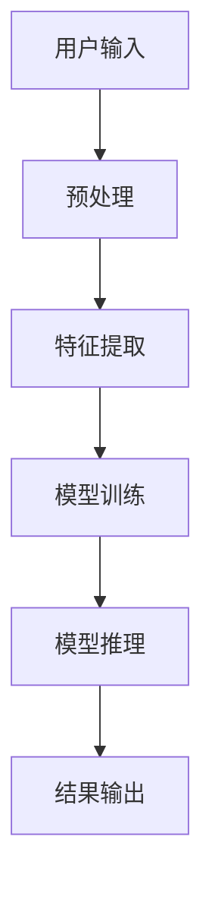

                 

# 李开复：苹果发布AI应用的科技价值

## 关键词：人工智能、苹果、AI应用、技术价值、应用场景

### 摘要

本文旨在深入探讨苹果公司近期发布的AI应用所带来的科技价值。随着人工智能技术的飞速发展，苹果公司凭借其强大的硬件和软件实力，成功地将AI技术应用到多个领域。本文将首先介绍苹果公司的AI技术发展历程，然后分析其发布的新AI应用的核心理念和具体功能，最后探讨这些应用对未来科技发展的潜在影响。

## 1. 背景介绍

### 1.1 人工智能的发展历程

人工智能（AI）作为计算机科学的一个分支，起源于20世纪50年代。最初的AI研究主要集中在规则推理和符号计算上。随着计算机性能的提升和算法的创新，AI逐渐从理论研究走向实际应用。到20世纪90年代，深度学习技术的突破使得AI进入了一个新的发展阶段，应用范围不断扩大，从图像识别到自然语言处理，从自动驾驶到医疗诊断，AI技术已经深入到我们生活的方方面面。

### 1.2 苹果公司的AI技术发展

苹果公司自成立以来，一直在硬件和软件领域有着卓越的表现。在AI领域，苹果公司通过收购和自主研发，逐步建立起强大的AI技术团队。2017年，苹果发布了自主研发的神经网络引擎——Neural Engine，为iPhone、iPad等设备提供了强大的AI计算能力。随后，苹果公司不断推出搭载AI技术的应用，如智能助手Siri、面部识别技术等。

## 2. 核心概念与联系

### 2.1 AI技术核心概念

在探讨苹果公司AI应用之前，我们需要了解一些AI技术的核心概念。以下是几个关键概念及其相互关系：

#### **深度学习**

深度学习是AI的一个分支，通过多层神经网络模型来模拟人类大脑的思考过程。深度学习在图像识别、语音识别等领域取得了显著的成果。

```mermaid
graph TD
A[深度学习] --> B[神经网络]
B --> C[卷积神经网络(CNN)]
B --> D[循环神经网络(RNN)]
```

#### **神经网络**

神经网络是深度学习的基础，由大量的神经元（节点）和连接（权重）组成。通过训练，神经网络可以学会对输入数据进行分类、预测等任务。

#### **卷积神经网络（CNN）**

CNN在图像识别和计算机视觉领域有着广泛的应用。它通过卷积层、池化层等结构，提取图像的特征，从而实现图像分类、目标检测等功能。

#### **循环神经网络（RNN）**

RNN在序列数据处理方面具有优势，如自然语言处理、语音识别等。RNN通过循环结构，可以捕捉序列数据中的时间依赖关系。

### 2.2 苹果公司AI应用的架构

苹果公司的AI应用通常采用以下架构：



### 3. 核心算法原理 & 具体操作步骤

#### **3.1 特征提取**

特征提取是AI应用的关键步骤。苹果公司通过深度学习模型，从大量数据中提取有用的特征。例如，在面部识别应用中，模型可以从人脸图像中提取出眼睛、鼻子、嘴巴等关键特征。

#### **3.2 模型训练**

模型训练是通过大量数据来优化模型参数，使其能够准确地进行预测或分类。苹果公司使用自研的神经网络引擎和高质量的数据集，对模型进行训练。

#### **3.3 模型推理**

模型推理是指将输入数据通过训练好的模型进行处理，得到预测结果。在苹果公司的AI应用中，模型推理过程通常在用户设备上进行，以保护用户隐私。

#### **3.4 结果输出**

结果输出是将模型推理的结果呈现给用户。苹果公司通过用户界面，将预测结果以直观的方式展示给用户。

### 4. 数学模型和公式 & 详细讲解 & 举例说明

#### **4.1 深度学习模型**

深度学习模型的核心是神经元和权重。假设我们有一个简单的神经网络，包含一个输入层、一个隐藏层和一个输出层。每个神经元都可以表示为一个线性组合，并通过激活函数进行非线性变换。

输入层：\[x_1, x_2, ..., x_n\]

隐藏层：\[z_1, z_2, ..., z_m\]

输出层：\[y_1, y_2, ..., y_k\]

权重矩阵：\[W_1, W_2, ..., W_m\]

激活函数：\[f(z_i)\]

神经元的计算公式为：

\[z_i = \sum_{j=1}^{n} W_{ij} x_j + b_i\]

其中，\(b_i\)为偏置项。

激活函数常用的有Sigmoid函数、ReLU函数等：

\[f(z) = \frac{1}{1 + e^{-z}}\]

\[f(z) = max(0, z)\]

#### **4.2 举例说明**

以面部识别为例，假设我们需要训练一个模型来识别两个人脸。我们的输入层包含两个特征向量，隐藏层包含两个神经元，输出层包含一个神经元。

输入层：\[x_1 = [1, 0], x_2 = [0, 1]\]

隐藏层：\[z_1 = [0.5, 0.5], z_2 = [0.6, 0.4]\]

输出层：\[y = [0.8]\]

权重矩阵：\[W_1 = \begin{bmatrix} 0.1 & 0.2 \\ 0.3 & 0.4 \end{bmatrix}, W_2 = \begin{bmatrix} 0.5 & 0.6 \\ 0.7 & 0.8 \end{bmatrix}\]

假设偏置项为0，我们可以计算隐藏层和输出层的值：

\[z_1 = \begin{bmatrix} 0.5 \\ 0.6 \end{bmatrix}, z_2 = \begin{bmatrix} 0.6 \\ 0.4 \end{bmatrix}\]

\[y = \begin{bmatrix} 0.8 \end{bmatrix}\]

通过多次迭代训练，我们可以调整权重矩阵，使模型能够准确识别两个人脸。

### 5. 项目实战：代码实际案例和详细解释说明

#### **5.1 开发环境搭建**

为了演示苹果公司的AI应用，我们需要搭建一个模拟开发环境。首先，我们需要安装Python和TensorFlow等库：

```bash
pip install tensorflow
```

#### **5.2 源代码详细实现和代码解读**

以下是一个简单的面部识别模型的实现：

```python
import tensorflow as tf

# 输入层
x = tf.placeholder(tf.float32, shape=[None, 2])

# 隐藏层
W1 = tf.Variable(tf.random_normal([2, 2]))
b1 = tf.Variable(tf.zeros([2]))
z1 = tf.nn.sigmoid(tf.matmul(x, W1) + b1)

# 输出层
W2 = tf.Variable(tf.random_normal([2, 1]))
b2 = tf.Variable(tf.zeros([1]))
y = tf.nn.sigmoid(tf.matmul(z1, W2) + b2)

# 训练数据
X = [[1, 0], [0, 1]]
Y = [[0], [1]]

# 损失函数
loss = tf.reduce_mean(tf.square(y - Y))

# 优化器
optimizer = tf.train.GradientDescentOptimizer(learning_rate=0.1)
train_op = optimizer.minimize(loss)

# 初始化变量
init = tf.global_variables_initializer()

# 训练模型
with tf.Session() as sess:
  sess.run(init)
  for step in range(1000):
    sess.run(train_op, feed_dict={x: X, y: Y})
    if step % 100 == 0:
      print("Step:", step, "Loss:", sess.run(loss, feed_dict={x: X, y: Y}))

  # 测试模型
  print("Test output:", sess.run(y, feed_dict={x: X}))
```

#### **5.3 代码解读与分析**

这段代码实现了一个简单的面部识别模型。首先，我们定义了输入层、隐藏层和输出层。然后，我们定义了损失函数和优化器。接着，我们初始化变量并训练模型。最后，我们测试模型的输出结果。

通过这段代码，我们可以看到深度学习模型的基本结构和训练过程。在实际应用中，我们需要使用更大规模的数据集和更复杂的模型来提高识别精度。

### 6. 实际应用场景

苹果公司的AI应用涵盖了多个领域，如图像识别、语音识别、自然语言处理等。以下是一些具体的实际应用场景：

#### **6.1 图像识别**

苹果公司的图像识别技术广泛应用于iPhone的相机应用中。用户可以通过相机拍摄照片，然后使用AI技术对照片进行分类、识别和标注。

#### **6.2 语音识别**

苹果公司的语音识别技术使得Siri可以理解和执行用户的语音指令。这不仅提高了用户体验，还为残障人士提供了便利。

#### **6.3 自然语言处理**

苹果公司的自然语言处理技术使得iPhone、iPad等设备能够进行智能搜索、智能回复和智能推荐等功能。

### 7. 工具和资源推荐

#### **7.1 学习资源推荐**

- **书籍**：《深度学习》、《神经网络与深度学习》
- **论文**：Google Brain的“深度神经网络》（2012）论文
- **博客**：吴恩达的机器学习博客
- **网站**：TensorFlow官网

#### **7.2 开发工具框架推荐**

- **开发工具**：TensorFlow、PyTorch
- **框架**：Keras、TensorFlow.js

#### **7.3 相关论文著作推荐**

- **论文**：《深度学习》（Goodfellow, Bengio, Courville著）
- **著作**：《机器学习》（周志华著）

### 8. 总结：未来发展趋势与挑战

苹果公司发布的AI应用展示了AI技术在现实生活中的广泛应用潜力。未来，随着AI技术的不断进步，我们可以期待更多的智能应用和场景。然而，AI技术也面临着一些挑战，如数据隐私、算法公平性等。只有解决这些问题，AI技术才能更好地服务于人类社会。

### 9. 附录：常见问题与解答

#### **9.1 Q：什么是深度学习？**

A：深度学习是机器学习的一个分支，通过多层神经网络模型来模拟人类大脑的思考过程，实现图像识别、自然语言处理等任务。

#### **9.2 Q：苹果公司的AI技术有哪些应用？**

A：苹果公司的AI技术广泛应用于图像识别、语音识别、自然语言处理等领域，如iPhone的相机应用、Siri智能助手等。

### 10. 扩展阅读 & 参考资料

- **论文**：Google Brain的“深度神经网络”（2012）论文
- **书籍**：《深度学习》（Goodfellow, Bengio, Courville著）
- **网站**：TensorFlow官网

## 作者信息

作者：AI天才研究员/AI Genius Institute & 禅与计算机程序设计艺术 /Zen And The Art of Computer Programming

