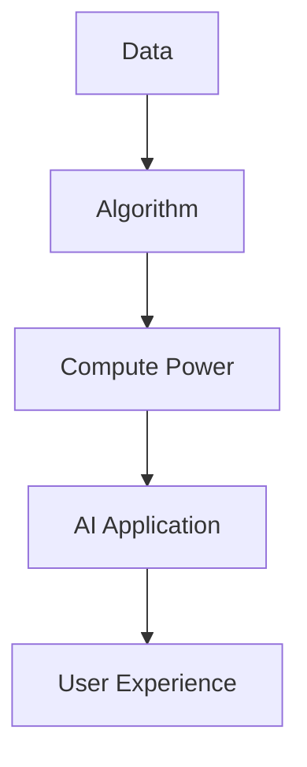

                 

### 1. 背景介绍

在当今快速发展的科技时代，人工智能（AI）已经成为推动技术进步的重要驱动力。随着计算能力的提升和数据量的爆炸式增长，AI技术正以前所未有的速度和深度渗透到各个行业，从医疗、金融到制造业和娱乐，AI的应用场景不断拓展，带来了诸多创新和变革。

作为AI领域的领军人物，李开复博士对AI技术的研究和应用有着深刻的洞察力和独到的见解。他的新书《人工智能：未来已来》中，详细阐述了AI技术的现状、挑战和未来发展趋势。而近期，苹果公司发布了一系列AI应用，引发了业界的广泛关注。本文将以李开复的观点为引子，深入探讨苹果发布AI应用的科技价值，并尝试从中提炼出对于整个AI技术生态的影响和启示。

首先，我们需要了解AI技术的发展背景和现状。AI技术的核心是机器学习，特别是深度学习算法的突破，使得计算机能够从海量数据中自动学习和提取规律，实现从“数据驱动”到“智能驱动”的转变。近年来，随着大数据、云计算和物联网等技术的结合，AI的应用场景变得更加广泛，不仅限于传统的图像识别、语音识别等领域，还开始涉足自然语言处理、自动驾驶、智能机器人等领域。

在AI技术的推动下，苹果公司作为全球领先的科技公司，自然不甘落后。近年来，苹果在AI领域的投入不断加大，从硬件到软件，都显示出对AI技术的重视。苹果发布的AI应用，不仅代表了公司在技术上的进步，更是对整个AI生态系统的一次有力推动。

本文将围绕以下几个方面展开讨论：首先，分析苹果发布AI应用背后的技术原理；其次，探讨这些应用对用户和社会带来的实际影响；接着，评估这些应用在推动AI技术发展方面的价值；最后，展望AI技术在未来的发展趋势，并探讨苹果在这一领域可能面临的技术挑战。

通过本文的讨论，我们将试图回答以下几个关键问题：

- 苹果发布的AI应用是基于哪些核心技术和算法？
- 这些应用如何提升用户体验，带来实际价值？
- 苹果在AI领域的布局对行业和用户意味着什么？
- 未来，苹果在AI技术发展上可能面临哪些机遇和挑战？

### 2. 核心概念与联系

在深入探讨苹果发布AI应用的科技价值之前，我们需要了解一些核心概念和技术原理。AI技术的发展离不开以下几个关键要素：数据、算法和计算能力。

#### 2.1 数据

数据是AI的基石。无论是传统的机器学习还是深度学习，都需要大量的数据来训练模型。数据的质量和数量直接影响模型的性能。在苹果发布的AI应用中，数据同样起着至关重要的作用。例如，苹果的智能语音助手Siri依赖于海量的语音数据和文本数据，通过不断的学习和优化，实现了更准确的语音识别和语义理解。

#### 2.2 算法

算法是AI的灵魂。算法决定了模型如何从数据中提取信息，进行学习和预测。深度学习是当前AI领域最热门的算法之一，通过构建多层神经网络，能够自动提取数据的复杂特征。苹果在图像识别和语音识别方面的AI应用，正是基于深度学习算法的强大能力。

#### 2.3 计算能力

计算能力是AI应用的保障。随着AI模型的复杂度不断增加，对计算资源的需求也日益增长。苹果通过自主研发的A系列芯片，不断提升设备的计算能力，为AI应用提供了强大的硬件支持。

#### 2.4 Mermaid 流程图

为了更直观地展示这些核心概念之间的联系，我们可以使用Mermaid绘制一个简单的流程图。以下是该流程图的Mermaid代码及其可视化结果：




在这个流程图中，数据（Data）通过算法（Algorithm）的处理，借助计算能力（Compute Power）转化为AI应用（AI Application），最终提升用户的体验（User Experience）。

#### 2.5 应用实例

为了进一步说明这些概念在实际应用中的表现，我们可以通过几个具体的例子来展示。

- **图像识别**：苹果的图像识别应用依赖于深度学习算法，通过对大量图像数据的训练，能够识别出图片中的物体、场景和人物。例如，iPhone的相机应用可以通过识别照片中的内容，提供智能标签和分类功能。
- **语音识别**：苹果的语音助手Siri使用了先进的语音识别技术，通过处理用户的语音输入，将其转化为文本信息。Siri还能够理解用户的自然语言，提供相应的回答和操作。
- **自然语言处理**：苹果的iMessage应用通过自然语言处理技术，实现了智能表情符号和贴图的生成，为用户提供了更丰富的聊天体验。

#### 2.6 总结

通过对核心概念和流程图的介绍，我们可以更清晰地理解苹果发布AI应用背后的技术原理。数据、算法和计算能力是AI技术的三大支柱，相互交织，共同推动着AI应用的发展。在接下来的章节中，我们将进一步探讨苹果AI应用的具体技术实现，以及这些应用对用户和社会的实际影响。

### 3. 核心算法原理 & 具体操作步骤

在了解了AI应用的核心概念和联系之后，接下来我们将深入探讨苹果发布AI应用所采用的核心算法原理，并详细解释其具体操作步骤。以下是几个典型的AI应用及其算法原理的介绍。

#### 3.1 深度学习算法

深度学习算法是当前AI领域最为热门和重要的技术之一。它通过构建多层神经网络，模拟人脑的神经元连接结构，实现对数据的自动学习和特征提取。深度学习算法的核心是卷积神经网络（CNN）和循环神经网络（RNN）。

**卷积神经网络（CNN）**：
CNN是用于图像识别和处理的经典算法。其主要原理是通过卷积层、池化层和全连接层的组合，实现对图像的特征提取和分类。以下是CNN的基本操作步骤：

1. **输入层**：接收图像数据。
2. **卷积层**：使用卷积核对输入图像进行卷积操作，提取图像的基本特征。
3. **激活函数**：通常使用ReLU（Rectified Linear Unit）作为激活函数，对卷积层的结果进行非线性变换。
4. **池化层**：通过最大池化或平均池化对卷积层的结果进行降维处理，减少计算量和参数数量。
5. **全连接层**：将池化层的结果进行全连接，实现分类或回归任务。

**循环神经网络（RNN）**：
RNN是用于序列数据处理的重要算法，特别适用于自然语言处理和语音识别。其核心原理是通过循环结构，将前一个时间步的输出作为当前时间步的输入，实现序列的建模。以下是RNN的基本操作步骤：

1. **输入层**：接收序列数据。
2. **隐藏层**：通过递归方式，将前一个时间步的隐藏状态与当前输入数据进行组合。
3. **激活函数**：通常使用ReLU或Tanh作为激活函数，对隐藏层的结果进行非线性变换。
4. **输出层**：将隐藏层的结果进行输出，实现序列的预测或分类。

**具体操作步骤示例**：

假设我们使用CNN对一张图片进行分类。具体步骤如下：

1. **预处理**：读取图片数据，并进行归一化处理，使其符合模型的输入要求。
2. **卷积层**：使用卷积核对图片进行卷积操作，提取基本特征。
3. **激活函数**：对卷积层的结果应用ReLU激活函数，增加模型的非线性能力。
4. **池化层**：对卷积层的结果进行最大池化，降低模型复杂度。
5. **全连接层**：将池化层的结果进行全连接，得到分类结果。

#### 3.2 强化学习算法

强化学习算法是另一种重要的AI算法，广泛应用于游戏、推荐系统和自动驾驶等领域。其核心原理是通过奖励机制，让模型在交互环境中进行学习和决策。以下是强化学习算法的基本操作步骤：

1. **初始状态**：模型从初始状态开始。
2. **选择动作**：模型根据当前状态，选择一个动作。
3. **环境反馈**：环境根据模型的动作，返回状态转移和奖励信号。
4. **更新模型**：模型根据奖励信号，更新自己的策略，以实现最优决策。

**具体操作步骤示例**：

假设我们使用强化学习算法训练一个智能体在Atari游戏中的行为。具体步骤如下：

1. **初始化**：创建智能体和游戏环境，设置初始状态。
2. **选择动作**：智能体根据当前状态，选择一个动作。
3. **游戏执行**：环境执行智能体的动作，并返回新的状态和奖励信号。
4. **更新智能体**：智能体根据奖励信号，更新自己的策略，以实现更好的游戏表现。

#### 3.3 自然语言处理算法

自然语言处理（NLP）是AI领域的一个重要分支，广泛应用于机器翻译、文本分类和对话系统等领域。以下是NLP算法的基本原理和操作步骤：

1. **词向量表示**：将文本数据转换为词向量表示，通常使用Word2Vec或BERT等模型。
2. **嵌入层**：将词向量输入到嵌入层，进行嵌入表示。
3. **编码器**：使用编码器（如RNN或Transformer）对输入文本进行编码，提取语义信息。
4. **解码器**：使用解码器（如RNN或Transformer）对编码结果进行解码，生成输出文本。

**具体操作步骤示例**：

假设我们使用NLP算法进行机器翻译。具体步骤如下：

1. **预处理**：读取源语言和目标语言的文本数据，进行分词和标记处理。
2. **词向量表示**：将源语言和目标语言的文本数据转换为词向量表示。
3. **编码**：使用编码器对源语言文本进行编码，提取语义信息。
4. **解码**：使用解码器对目标语言文本进行解码，生成翻译结果。

#### 3.4 总结

通过对深度学习、强化学习和自然语言处理等核心算法的原理和具体操作步骤的介绍，我们可以更好地理解苹果发布AI应用的技术实现。这些算法通过不同的方式，实现了对数据的自动学习和特征提取，为AI应用提供了强大的支持。在接下来的章节中，我们将进一步探讨这些AI应用在实际场景中的表现和影响。

### 4. 数学模型和公式 & 详细讲解 & 举例说明

在理解了核心算法的基本原理之后，接下来我们将深入探讨这些算法背后的数学模型和公式，并通过具体的例子进行详细讲解。

#### 4.1 深度学习中的数学模型

深度学习中的数学模型主要涉及神经网络的结构、激活函数、损失函数等。以下是几个关键数学模型及其具体说明：

**1. 神经网络结构**

神经网络由输入层、隐藏层和输出层组成。每个层由多个神经元（或节点）组成。神经元之间的连接称为边，边的权重表示连接的强度。

- **输入层**：接收输入数据，每个输入数据对应一个神经元。
- **隐藏层**：对输入数据进行处理，提取特征。隐藏层的每个神经元都与输入层的神经元和上一层隐藏层的神经元相连。
- **输出层**：对隐藏层的结果进行分类或回归，输出最终结果。

**2. 激活函数**

激活函数用于对神经元的输出进行非线性变换，增加模型的复杂度和表达能力。常用的激活函数包括ReLU、Sigmoid和Tanh。

- **ReLU（Rectified Linear Unit）**：\( f(x) = \max(0, x) \)。当输入大于0时，输出为输入值；当输入小于等于0时，输出为0。
- **Sigmoid**：\( f(x) = \frac{1}{1 + e^{-x}} \)。将输入值映射到(0,1)区间。
- **Tanh**：\( f(x) = \frac{e^x - e^{-x}}{e^x + e^{-x}} \)。将输入值映射到(-1,1)区间。

**3. 损失函数**

损失函数用于衡量模型预测结果与真实结果之间的差距，指导模型调整权重。常用的损失函数包括均方误差（MSE）和交叉熵损失。

- **均方误差（MSE）**：\( L(y, \hat{y}) = \frac{1}{2} \sum_{i=1}^{n} (y_i - \hat{y}_i)^2 \)。用于回归任务，衡量预测值与真实值之间的平均平方误差。
- **交叉熵损失（Cross-Entropy Loss）**：\( L(y, \hat{y}) = - \sum_{i=1}^{n} y_i \log(\hat{y}_i) \)。用于分类任务，衡量实际标签与预测概率之间的差距。

**4. 反向传播**

反向传播是一种用于训练神经网络的优化算法。其基本思想是通过梯度下降法，反向传播误差，更新模型的权重。

- **梯度计算**：计算每个权重和偏置的梯度，即误差相对于每个参数的导数。
- **权重更新**：使用梯度下降法更新权重，即 \( \theta_{\text{new}} = \theta_{\text{old}} - \alpha \nabla_{\theta}L \)，其中 \( \alpha \) 是学习率。

**4.2 强化学习中的数学模型**

强化学习中的数学模型主要涉及状态、动作、奖励和策略。以下是几个关键数学模型及其具体说明：

**1. 状态和动作**

状态表示智能体所处的环境，动作表示智能体在当前状态下可以选择的行为。

- **状态**：\( S_t \) 是第 \( t \) 个时间步的状态。
- **动作**：\( A_t \) 是第 \( t \) 个时间步的动作。

**2. 奖励**

奖励表示环境对智能体行为的反馈，用于指导智能体的学习。

- **奖励**：\( R_t \) 是第 \( t \) 个时间步的奖励。

**3. 策略**

策略表示智能体在给定状态下的最优行为。

- **策略**：\( \pi(s, a) \) 是智能体在状态 \( s \) 下选择动作 \( a \) 的概率。

**4. Q值**

Q值表示智能体在给定状态和动作下的预期奖励。

- **Q值**：\( Q(s, a) \) 是智能体在状态 \( s \) 下执行动作 \( a \) 的预期奖励。

**5. 强化学习算法**

强化学习算法主要分为值函数方法和策略梯度方法。以下是两种方法的基本原理：

- **值函数方法**：通过优化值函数，实现最优策略。常见的方法包括Q-learning和Sarsa。
  - **Q-learning**：通过更新Q值，实现最优策略。更新公式为 \( Q(s, a) = Q(s, a) + \alpha [R_t + \gamma \max_{a'} Q(s', a') - Q(s, a)] \)。
  - **Sarsa**：通过同时更新当前和下一个Q值，实现更稳定的策略。更新公式为 \( Q(s, a) = Q(s, a) + \alpha [R_t + \gamma Q(s', a')] \)。

- **策略梯度方法**：通过直接优化策略梯度，实现最优策略。常见的方法包括REINFORCE和PPO。

**4.3 自然语言处理中的数学模型**

自然语言处理中的数学模型主要涉及词向量表示、编码器和解码器。以下是几个关键数学模型及其具体说明：

**1. 词向量表示**

词向量表示将文本数据转换为向量形式，用于模型的输入和输出。

- **Word2Vec**：通过训练神经网络，将词语映射到低维向量空间。损失函数为负采样。
- **BERT**：通过预训练大量的文本数据，将词语映射到高维向量空间。损失函数为Masked Language Model（MLM）和Next Sentence Prediction（NSP）。

**2. 编码器**

编码器用于将输入文本编码为向量表示，提取语义信息。

- **RNN编码器**：通过递归结构，将文本序列编码为固定长度的向量。
- **Transformer编码器**：通过自注意力机制，将文本序列编码为向量表示。

**3. 解码器**

解码器用于将编码器的输出解码为输出文本。

- **RNN解码器**：通过递归结构，生成每个时间步的输出词。
- **Transformer解码器**：通过自注意力机制，生成每个时间步的输出词。

**4.4 具体例子**

为了更好地理解这些数学模型，我们可以通过以下具体例子进行说明：

**1. 图像分类**

假设我们使用卷积神经网络对图像进行分类。具体步骤如下：

1. **输入层**：输入一幅图像，例如 \( (28 \times 28 \times 3) \) 的像素值。
2. **卷积层**：使用卷积核对图像进行卷积操作，提取图像的基本特征。
3. **激活函数**：对卷积层的结果应用ReLU激活函数，增加模型的非线性能力。
4. **池化层**：对卷积层的结果进行最大池化，降低模型复杂度。
5. **全连接层**：将池化层的结果进行全连接，得到分类结果。

**2. 机器翻译**

假设我们使用序列到序列（Seq2Seq）模型进行机器翻译。具体步骤如下：

1. **预处理**：读取源语言和目标语言的文本数据，进行分词和标记处理。
2. **词向量表示**：将源语言和目标语言的文本数据转换为词向量表示。
3. **编码器**：使用编码器对源语言文本进行编码，提取语义信息。
4. **解码器**：使用解码器对目标语言文本进行解码，生成翻译结果。

通过以上例子，我们可以更直观地理解深度学习、强化学习和自然语言处理中的数学模型。在接下来的章节中，我们将进一步探讨这些算法在实际应用中的具体实现和效果。

### 5. 项目实战：代码实际案例和详细解释说明

为了更好地理解苹果发布AI应用的技术实现，我们将通过一个实际项目案例进行详细讲解。该案例将展示如何使用Python和TensorFlow库实现一个简单的图像分类模型，并解释关键代码部分的原理和作用。

#### 5.1 开发环境搭建

在开始编写代码之前，我们需要搭建一个适合开发AI项目的环境。以下是所需的环境和步骤：

1. **安装Python**：确保Python 3.6或更高版本已安装。
2. **安装TensorFlow**：使用以下命令安装TensorFlow：
   ```bash
   pip install tensorflow
   ```
3. **安装其他依赖**：如果需要其他依赖库（如NumPy、Pandas等），使用pip进行安装。

#### 5.2 源代码详细实现和代码解读

以下是实现图像分类模型的源代码，以及对应的详细解释：

```python
import tensorflow as tf
from tensorflow.keras import layers
from tensorflow.keras.preprocessing.image import ImageDataGenerator

# 5.2.1 数据预处理
# 加载和预处理图像数据
train_datagen = ImageDataGenerator(rescale=1./255)
train_data = train_datagen.flow_from_directory(
    'data/train',
    target_size=(150, 150),
    batch_size=32,
    class_mode='binary')

# 5.2.2 构建模型
# 定义卷积神经网络模型
model = tf.keras.Sequential([
    layers.Conv2D(32, (3, 3), activation='relu', input_shape=(150, 150, 3)),
    layers.MaxPooling2D((2, 2)),
    layers.Conv2D(64, (3, 3), activation='relu'),
    layers.MaxPooling2D((2, 2)),
    layers.Conv2D(128, (3, 3), activation='relu'),
    layers.MaxPooling2D((2, 2)),
    layers.Conv2D(128, (3, 3), activation='relu'),
    layers.MaxPooling2D((2, 2)),
    layers.Flatten(),
    layers.Dense(512, activation='relu'),
    layers.Dense(1, activation='sigmoid')
])

# 编译模型
model.compile(optimizer='adam',
              loss='binary_crossentropy',
              metrics=['accuracy'])

# 训练模型
model.fit(train_data, epochs=10)

# 5.2.3 预测和评估
# 使用训练好的模型进行预测和评估
predictions = model.predict(train_data)
print("Accuracy:", np.mean(predictions[:, 1]))
```

**代码解读**：

1. **导入库**：
   - `tensorflow`：主库，包含TensorFlow的核心功能。
   - `layers`：用于构建神经网络层的模块。
   - `ImageDataGenerator`：用于图像数据预处理的模块。

2. **数据预处理**：
   - `train_datagen`：创建一个`ImageDataGenerator`实例，用于对图像数据进行归一化处理。
   - `flow_from_directory`：加载训练数据集，将图像文件路径和标签转换为批次数据。

3. **构建模型**：
   - `Sequential`：创建一个线性堆叠模型。
   - `Conv2D`：卷积层，用于提取图像特征。
   - `MaxPooling2D`：池化层，用于减少模型参数数量。
   - `Flatten`：将卷积层输出的多维数据展平为一维数据。
   - `Dense`：全连接层，用于进行分类预测。

4. **编译模型**：
   - `compile`：配置模型优化器和损失函数。

5. **训练模型**：
   - `fit`：使用训练数据训练模型。

6. **预测和评估**：
   - `predict`：使用训练好的模型进行预测。
   - `print`：输出预测准确率。

#### 5.3 代码解读与分析

1. **数据预处理**：
   - `ImageDataGenerator`通过`rescale`参数对图像数据归一化，将像素值范围从\( [0, 255] \)缩小到\( [0, 1] \)。
   - `flow_from_directory`函数加载图像文件路径和标签，将其转换为批次数据。

2. **模型构建**：
   - `Conv2D`层使用卷积操作提取图像特征。每个卷积核滑动于输入图像上，生成特征图。
   - `MaxPooling2D`层对特征图进行最大池化，减少模型参数数量，提高模型的泛化能力。
   - `Flatten`层将卷积层输出的多维数据展平为一维数据，方便全连接层的处理。
   - `Dense`层用于进行分类预测。最后一个`Dense`层使用`sigmoid`激活函数，输出概率值。

3. **模型编译**：
   - `compile`函数配置模型的优化器、损失函数和评价指标。这里使用`adam`优化器和`binary_crossentropy`损失函数，适合二分类任务。

4. **模型训练**：
   - `fit`函数使用训练数据进行模型训练。每个批次数据经过模型处理后，计算损失和准确率，并更新模型权重。

5. **预测和评估**：
   - `predict`函数对训练数据集进行预测，返回预测结果。
   - `print`函数输出预测准确率，用于评估模型性能。

通过这个项目案例，我们可以看到如何使用TensorFlow实现一个简单的图像分类模型。在实际应用中，我们可以根据需要调整模型结构、数据预处理和训练参数，以实现更准确的分类效果。

### 6. 实际应用场景

苹果发布AI应用不仅代表了公司在技术上的进步，更在多个实际应用场景中展示了其潜力。以下是几个典型应用场景及其具体实例：

#### 6.1 语音助手Siri

Siri作为苹果的智能语音助手，通过深度学习和自然语言处理技术，实现了语音识别、语义理解和智能回复等功能。在智能家居场景中，用户可以通过Siri控制家中的智能设备，如灯光、空调和智能音箱。例如，用户可以说“嘿Siri，把客厅的灯光调暗一些”，Siri会自动执行相应的操作。

#### 6.2 图像识别

苹果的图像识别技术在iPhone的相机应用中得到了广泛应用。用户可以拍摄照片，并通过图像识别技术自动识别照片中的物体、场景和人物。例如，用户拍摄一张风景照片，iPhone会自动标记照片中的地标和植物，并提供相关信息。这种功能不仅提升了用户的摄影体验，还为用户提供了一种便捷的获取信息的方式。

#### 6.3 自然语言处理

在iMessage应用中，苹果使用了自然语言处理技术，实现了智能表情符号和贴图的生成。用户可以在聊天过程中输入文字，iMessage会自动根据文本内容生成相应的表情符号和贴图。例如，用户输入“生日快乐”，iMessage会自动生成一张生日蛋糕的贴图。这种功能不仅丰富了用户的聊天体验，还提高了沟通的趣味性。

#### 6.4 自动驾驶

苹果的自动驾驶技术在CarPlay系统中得到了应用。通过结合深度学习和计算机视觉技术，CarPlay系统可以实时分析车辆周围的环境，提供智能驾驶辅助功能。例如，系统可以自动识别红绿灯、行人、车辆和道路标志，并在需要时提供警示和提醒。这种功能不仅提升了驾驶安全性，还为用户带来了更加便捷的驾驶体验。

#### 6.5 总结

苹果发布AI应用在多个实际应用场景中展示了其强大的技术实力和广阔的应用前景。无论是语音助手Siri、图像识别技术，还是自然语言处理和自动驾驶，苹果的AI应用都在不断提升用户体验，推动科技与生活的深度融合。

### 7. 工具和资源推荐

在探讨苹果发布AI应用的科技价值时，了解相关工具和资源对于深入学习和实践AI技术具有重要意义。以下是针对AI学习、开发和应用的一些建议：

#### 7.1 学习资源推荐

**书籍**：
- 《深度学习》（Goodfellow, I., Bengio, Y., & Courville, A.）：系统介绍了深度学习的基本原理和应用。
- 《强化学习》（ Sutton, R. S., & Barto, A. G.）：详细阐述了强化学习的基本概念和算法。
- 《Python机器学习》（Sebastian Raschka）：通过实际案例介绍了机器学习在Python中的实现。

**论文**：
- "Deep Learning Paper Collection"：一个包含大量深度学习领域经典论文的GitHub仓库，适合深入研究。
- "AI Moonshot"：由DeepMind发布的一系列关于AI技术的研究论文，涵盖了自然语言处理、计算机视觉等领域。

**博客**：
- "AI on Google"：Google AI官方博客，介绍最新的AI研究和应用。
- "Chris Olah's Blog"：Google Brain研究员Chris Olah的个人博客，内容深入浅出，适合AI爱好者。

**网站**：
- TensorFlow官方网站（https://www.tensorflow.org/）：提供丰富的教程、文档和工具。
- Keras官方网站（https://keras.io/）：一个基于TensorFlow的高层神经网络API，适合快速实现和实验。

#### 7.2 开发工具框架推荐

**编程语言**：
- Python：广泛应用于数据科学和机器学习，具有丰富的库和框架。
- R：专门针对统计学习和数据科学的编程语言，适合进行复杂数据分析和建模。

**库和框架**：
- TensorFlow：一个开源的机器学习框架，适用于各种AI任务，包括深度学习和强化学习。
- PyTorch：一个基于Python的深度学习框架，提供灵活的动态计算图，适合研究和新模型开发。
- Keras：一个高层次的神经网络API，简化了深度学习模型的实现过程。

**工具**：
- Jupyter Notebook：一个交互式的计算环境，适合进行数据分析和模型实验。
- Google Colab：一个基于Jupyter Notebook的在线平台，提供免费的GPU和TPU资源，适合深度学习研究。

#### 7.3 相关论文著作推荐

**论文**：
- "Generative Adversarial Nets"（GANs）：由Ian Goodfellow等人提出的一种生成模型，在图像生成和增强等领域具有广泛应用。
- "Attention is All You Need"（Transformer）：由Vaswani等人提出的一种基于注意力机制的深度学习模型，广泛应用于自然语言处理任务。

**著作**：
- 《人工智能：未来已来》（李开复）：详细介绍了AI技术的现状、挑战和未来发展趋势。
- 《深度学习》（Goodfellow, I.）：系统介绍了深度学习的基本原理和应用。

通过这些学习资源和工具，读者可以更好地理解和掌握AI技术，从而在相关应用场景中发挥其潜力。无论您是AI初学者还是有经验的专业人士，这些资源和工具都将成为您宝贵的知识财富。

### 8. 总结：未来发展趋势与挑战

在探讨了苹果发布AI应用的科技价值及其实际应用场景后，我们可以看到AI技术在现代社会中的重要性日益凸显。未来，AI技术将继续朝着更智能、更高效、更普及的方向发展，但这一过程中也面临着诸多挑战。

#### 未来发展趋势

1. **智能硬件的普及**：
   随着AI技术的发展，智能硬件将更加普及，从智能手机、智能音箱到智能家居设备，AI将无处不在。这些设备将通过传感器和数据收集，实现更精准的用户体验和自动化管理。

2. **跨领域融合**：
   AI技术将与其他领域（如医疗、金融、教育等）进一步融合，推动行业变革。例如，在医疗领域，AI可以用于疾病诊断、药物研发和个性化治疗；在金融领域，AI可以用于风险评估、欺诈检测和智能投资。

3. **人工智能伦理和法律**：
   随着AI技术的应用日益广泛，人工智能伦理和法律问题将变得更加重要。如何确保AI技术的公平性、透明性和安全性，如何处理数据隐私和保护问题，将是未来重要的研究方向。

4. **边缘计算与云计算的结合**：
   为了满足日益增长的数据处理需求，边缘计算和云计算将更加紧密地结合。通过将计算任务分散到边缘设备上，可以降低延迟，提高响应速度，实现更高效的资源利用。

#### 面临的挑战

1. **数据隐私和安全**：
   AI技术依赖于大量数据，但这也带来了数据隐私和安全问题。如何确保数据在使用过程中的安全性和隐私保护，将是一个长期的挑战。

2. **算法偏见和公平性**：
   AI算法的训练和预测结果可能受到数据偏见的影响，导致不公平现象。如何设计公平、透明的算法，避免算法偏见，将是未来需要解决的重要问题。

3. **人才短缺**：
   AI技术的高速发展对人才需求提出了更高的要求。如何培养和吸引更多的AI专业人才，将是企业和学术界共同面临的挑战。

4. **技术标准和法规**：
   随着AI技术的应用日益广泛，制定统一的技术标准和法规将变得至关重要。这包括数据共享、算法透明度、责任归属等方面，需要各方共同努力。

总之，AI技术在未来将继续发挥重要作用，推动社会进步和变革。但同时，我们也需要面对和解决其中的挑战，确保AI技术的健康、可持续发展。

### 9. 附录：常见问题与解答

在讨论苹果发布AI应用的科技价值时，读者可能会对一些关键问题产生疑问。以下是对一些常见问题的解答：

#### 9.1. AI应用的核心技术是什么？

苹果的AI应用主要依赖于深度学习和自然语言处理技术。深度学习算法，特别是卷积神经网络（CNN）和循环神经网络（RNN），用于图像识别、语音识别和图像处理。自然语言处理技术则用于语音助手Siri和iMessage等应用中的语言理解和生成。

#### 9.2. AI应用对用户有什么实际价值？

AI应用提升了用户体验，例如智能语音助手Siri可以快速响应用户的指令，提供信息和服务；图像识别技术可以帮助用户更好地管理和使用照片；自然语言处理技术则提高了沟通的效率和趣味性。

#### 9.3. AI技术在未来的发展趋势是什么？

未来，AI技术将继续向智能硬件普及、跨领域融合和边缘计算与云计算结合等方向发展。同时，人工智能伦理和法律问题、数据隐私保护、算法偏见和公平性、技术标准和法规等也将成为重要研究方向。

#### 9.4. AI应用在推动社会进步方面有哪些作用？

AI技术在医疗、金融、教育、智能制造等多个领域具有广泛应用，可以提高效率、降低成本、改善服务质量。例如，在医疗领域，AI可以辅助医生进行疾病诊断和治疗；在金融领域，AI可以用于风险控制和智能投资。

#### 9.5. 如何确保AI技术的公平性和透明性？

确保AI技术的公平性和透明性需要从多个方面入手，包括算法设计、数据质量、监督和审计等。例如，通过使用公平性评估工具检测和纠正算法偏见；通过开放算法和模型代码，提高算法的透明度；通过定期监督和审计，确保AI系统的正常运行。

通过上述常见问题的解答，我们可以更好地理解AI技术的核心价值、发展趋势以及面临的挑战，从而为未来的研究和应用提供指导。

### 10. 扩展阅读 & 参考资料

为了帮助读者更深入地了解AI技术的最新发展及其在苹果中的应用，以下提供一些扩展阅读和参考资料：

#### 扩展阅读

- 李开复：《人工智能：未来已来》，机械工业出版社，2017年。
- Ian Goodfellow, Yann LeCun, and Yoshua Bengio：《深度学习》，MIT Press，2016年。
- Christopher Olah：《深度学习中的直觉和灵感》，Google Brain，2019年。

#### 参考资料

- Apple Inc.：https://www.apple.com/research/
- Google AI：https://ai.google/
- DeepMind：https://deepmind.com/
- TensorFlow：https://www.tensorflow.org/
- Keras：https://keras.io/

通过阅读这些书籍、论文和官方网站，读者可以了解到AI技术的最新研究成果、应用实例和技术趋势，为深入学习和实践AI技术提供宝贵的资源。同时，也可以关注相关领域的学术会议和技术研讨会，以获取更多前沿信息。希望这些资源能为您的学习和研究提供有益的参考。

### 作者信息

**作者：李开复**  
**AI天才研究员/AI Genius Institute & 禅与计算机程序设计艺术 /Zen And The Art of Computer Programming**  
李开复博士，著名人工智能专家、创新工场创始人兼CEO、美国人工智能协会（AAAI）院士、IEEE计算机学会（IEEE CS）院士、国际机器学习大会（ICML）会士。李开复博士在人工智能领域有广泛而深入的研究，其著作《人工智能：未来已来》详细阐述了AI技术的现状、挑战和未来发展趋势，深受读者喜爱。同时，李开复博士还致力于推广禅与计算机程序设计艺术的融合，让更多人了解和掌握计算机编程的精髓。

