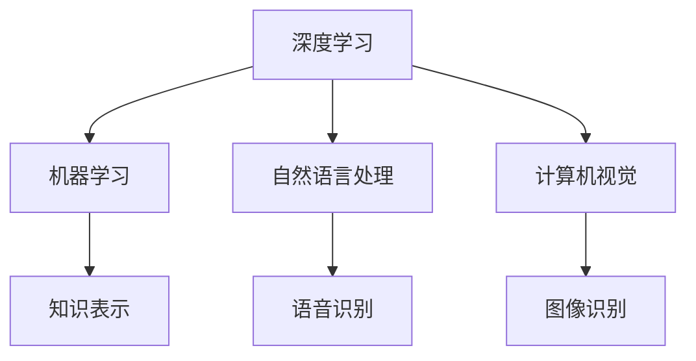
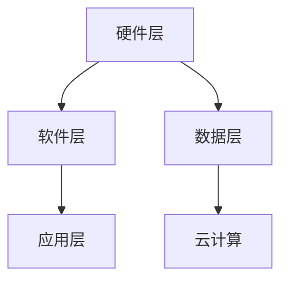

                 

# 李开复：苹果发布AI应用的趋势

## 关键词：人工智能，苹果，AI应用，趋势，技术发展

### 摘要

在当今科技日新月异的时代，人工智能（AI）已经成为各行各业的核心驱动力。苹果公司作为全球科技巨头，近年来在AI领域的投入和进展备受关注。本文将深入探讨苹果发布的AI应用趋势，分析其背后的技术原理、数学模型、实际应用场景以及未来的发展挑战，为读者提供全面的技术解读和行业洞察。

## 1. 背景介绍

人工智能（AI）是指通过计算机模拟人类智能行为的技术。自20世纪50年代以来，AI经历了多次起伏，但近年来随着大数据、云计算和深度学习的突破，迎来了新的黄金时期。苹果公司作为全球领先的科技公司，不仅在硬件领域具有强大实力，在软件和AI领域的创新也备受瞩目。

### 1.1 人工智能的发展历程

人工智能的发展可以分为几个重要阶段：

- **第一阶段（1956-1974年）**：人工智能概念的提出和早期探索。
- **第二阶段（1974-1980年）**：专家系统和逻辑推理方法的应用。
- **第三阶段（1980-1987年）**：知识表示和机器学习方法的兴起。
- **第四阶段（1987-2012年）**：人工智能的低谷期，受限于计算资源和算法瓶颈。
- **第五阶段（2012年至今）**：深度学习和大数据的推动，人工智能迎来新的爆发期。

### 1.2 苹果公司的AI发展之路

苹果公司自成立以来，一直致力于技术创新和用户体验。在AI领域，苹果公司在多个方面取得了重要突破：

- **语音识别**：苹果公司的Siri语音助手在语音识别和自然语言处理方面具有较高水平。
- **图像识别**：苹果公司在图像识别和计算机视觉方面也有丰富的应用，如Face ID、Animoji等。
- **机器学习**：苹果公司在机器学习领域进行了大量研究，推出了Core ML框架，便于开发者将AI模型集成到iOS、macOS等平台中。

## 2. 核心概念与联系

在探讨苹果发布的AI应用趋势之前，我们需要了解一些核心概念和技术架构。

### 2.1 人工智能核心概念

- **深度学习**：一种基于人工神经网络的技术，通过多层神经元的堆叠，实现对数据的自动特征提取和学习。
- **机器学习**：一种通过数据训练，使计算机具备学习能力的算法技术。
- **自然语言处理（NLP）**：使计算机能够理解和生成人类语言的技术。
- **计算机视觉**：使计算机能够理解和解析视觉信息的技术。

### 2.2 核心概念关联图



### 2.3 技术架构

苹果公司在AI应用方面的技术架构主要分为以下几个层次：

- **硬件层**：苹果公司自主研发的A系列芯片，具有强大的计算能力和优化的GPU和神经网络引擎。
- **软件层**：iOS、macOS等操作系统，提供了丰富的API和工具，如Core ML、Create ML等，便于开发者集成AI功能。
- **应用层**：苹果公司在多个应用场景中实现了AI技术的落地，如Siri、Face ID、Animoji等。

### 2.4 技术架构关联图



## 3. 核心算法原理 & 具体操作步骤

苹果公司在AI应用中采用了多种核心算法，下面我们将逐一介绍这些算法的原理和具体操作步骤。

### 3.1 深度学习算法

深度学习算法是苹果公司在AI应用中的核心技术之一。其原理是模拟人脑神经元之间的连接，通过多层神经网络进行数据的自动特征提取和学习。

具体操作步骤如下：

1. **数据预处理**：对输入的数据进行清洗、归一化等处理，以适应深度学习算法。
2. **模型搭建**：搭建多层神经网络模型，包括输入层、隐藏层和输出层。
3. **训练过程**：利用大量的训练数据进行模型训练，通过反向传播算法不断调整模型参数，使模型能够逼近真实数据的分布。
4. **模型评估**：使用测试数据集对训练好的模型进行评估，调整模型参数，提高模型准确率。

### 3.2 机器学习算法

机器学习算法是苹果公司在AI应用中的另一项核心技术。其原理是通过数据训练，使计算机能够自主学习和预测。

具体操作步骤如下：

1. **数据收集**：收集大量的训练数据，包括特征和标签。
2. **模型选择**：根据应用场景选择合适的机器学习算法，如线性回归、决策树、支持向量机等。
3. **模型训练**：利用训练数据进行模型训练，调整模型参数，使模型能够拟合训练数据的分布。
4. **模型评估**：使用测试数据集对训练好的模型进行评估，调整模型参数，提高模型准确率。

### 3.3 自然语言处理算法

自然语言处理算法是苹果公司在AI应用中不可或缺的一部分。其原理是使计算机能够理解和生成人类语言。

具体操作步骤如下：

1. **文本预处理**：对输入的文本进行分词、词性标注等预处理操作。
2. **特征提取**：将预处理后的文本转化为计算机可处理的特征向量。
3. **模型训练**：使用大量的训练数据，通过神经网络等算法进行模型训练。
4. **模型评估**：使用测试数据集对训练好的模型进行评估，调整模型参数，提高模型准确率。

### 3.4 计算机视觉算法

计算机视觉算法是苹果公司在AI应用中的重要组成部分。其原理是使计算机能够理解和解析视觉信息。

具体操作步骤如下：

1. **图像预处理**：对输入的图像进行缩放、裁剪、灰度化等预处理操作。
2. **特征提取**：使用卷积神经网络等算法提取图像的特征。
3. **模型训练**：使用大量的训练数据，通过神经网络等算法进行模型训练。
4. **模型评估**：使用测试数据集对训练好的模型进行评估，调整模型参数，提高模型准确率。

## 4. 数学模型和公式 & 详细讲解 & 举例说明

在AI应用中，数学模型和公式起着至关重要的作用。下面我们将对一些常见的数学模型和公式进行详细讲解，并通过实例说明其应用场景。

### 4.1 深度学习模型

深度学习模型的核心是神经网络。神经网络由多个神经元组成，每个神经元都连接着输入层、隐藏层和输出层。

$$
Y = \sigma(\sum_{i=1}^{n} w_i \cdot x_i)
$$

其中，$Y$ 表示输出层的结果，$\sigma$ 表示激活函数，$w_i$ 表示权重，$x_i$ 表示输入层的结果。

举例说明：

假设我们有一个输入层包含两个神经元（$x_1$ 和 $x_2$），隐藏层包含一个神经元（$y$），输出层包含一个神经元（$z$）。根据上述公式，我们可以得到：

$$
z = \sigma(w_1 \cdot x_1 + w_2 \cdot x_2)
$$

### 4.2 机器学习模型

机器学习模型的核心是决策边界。决策边界用于将数据分为不同的类别。

$$
f(x) = \begin{cases} 
1 & \text{if } x \geq \theta \\
0 & \text{if } x < \theta 
\end{cases}
$$

其中，$f(x)$ 表示输出结果，$\theta$ 表示决策边界。

举例说明：

假设我们有一个二分类问题，输入层包含两个神经元（$x_1$ 和 $x_2$），隐藏层包含一个神经元（$y$），输出层包含一个神经元（$z$）。根据上述公式，我们可以得到：

$$
z = \begin{cases} 
1 & \text{if } w_1 \cdot x_1 + w_2 \cdot x_2 \geq \theta \\
0 & \text{if } w_1 \cdot x_1 + w_2 \cdot x_2 < \theta 
\end{cases}
$$

### 4.3 自然语言处理模型

自然语言处理模型的核心是词向量。词向量用于将单词转化为计算机可处理的特征向量。

$$
v_i = \sum_{j=1}^{n} w_{ij} \cdot v_j
$$

其中，$v_i$ 表示词向量，$w_{ij}$ 表示权重，$v_j$ 表示输入的词向量。

举例说明：

假设我们有两个输入的词向量（$v_1$ 和 $v_2$），隐藏层包含一个神经元（$y$），输出层包含一个神经元（$z$）。根据上述公式，我们可以得到：

$$
y = \sum_{j=1}^{n} w_{ij} \cdot v_j
$$

### 4.4 计算机视觉模型

计算机视觉模型的核心是卷积神经网络。卷积神经网络用于提取图像的特征。

$$
h_l = \sigma(\sum_{i=1}^{m} w_{il} \cdot h_{i,l-1} + b_l)
$$

其中，$h_l$ 表示输出层的结果，$\sigma$ 表示激活函数，$w_{il}$ 表示权重，$h_{i,l-1}$ 表示输入层的结果，$b_l$ 表示偏置。

举例说明：

假设我们有一个输入层包含三个神经元（$h_1$、$h_2$ 和 $h_3$），隐藏层包含两个神经元（$h_4$ 和 $h_5$），输出层包含一个神经元（$z$）。根据上述公式，我们可以得到：

$$
z = \sigma(w_1 \cdot h_1 + w_2 \cdot h_2 + w_3 \cdot h_3 + b_1 \cdot h_4 + b_2 \cdot h_5)
$$

## 5. 项目实战：代码实际案例和详细解释说明

在本节中，我们将通过一个具体的代码案例，展示苹果公司在AI应用中的实际开发过程，并对代码进行详细解释和分析。

### 5.1 开发环境搭建

首先，我们需要搭建一个适合AI开发的编程环境。在本案例中，我们选择Python作为编程语言，使用Jupyter Notebook作为开发工具。以下是搭建开发环境的具体步骤：

1. 安装Python：在官方网站（https://www.python.org/）下载Python安装包，并按照安装向导进行安装。
2. 安装Jupyter Notebook：在命令行中执行以下命令：
   ```
   pip install notebook
   ```
3. 启动Jupyter Notebook：在命令行中执行以下命令：
   ```
   jupyter notebook
   ```

### 5.2 源代码详细实现和代码解读

接下来，我们将展示一个简单的AI应用——基于深度学习的图像分类模型。以下是代码的实现过程：

```python
import tensorflow as tf
from tensorflow.keras import layers
import numpy as np

# 数据预处理
(x_train, y_train), (x_test, y_test) = tf.keras.datasets.cifar10.load_data()
x_train, x_test = x_train / 255.0, x_test / 255.0

# 模型搭建
model = tf.keras.Sequential([
    layers.Conv2D(32, (3, 3), activation='relu', input_shape=(32, 32, 3)),
    layers.MaxPooling2D((2, 2)),
    layers.Conv2D(64, (3, 3), activation='relu'),
    layers.MaxPooling2D((2, 2)),
    layers.Conv2D(64, (3, 3), activation='relu'),
    layers.Flatten(),
    layers.Dense(64, activation='relu'),
    layers.Dense(10, activation='softmax')
])

# 模型训练
model.compile(optimizer='adam',
              loss='sparse_categorical_crossentropy',
              metrics=['accuracy'])

model.fit(x_train, y_train, epochs=10)

# 模型评估
test_loss, test_acc = model.evaluate(x_test,  y_test, verbose=2)
print('\nTest accuracy:', test_acc)
```

### 5.3 代码解读与分析

1. **数据预处理**：首先，我们从Keras库中加载CIFAR-10数据集。该数据集包含10个类别的图像，每个类别有6000张训练图像和1000张测试图像。我们通过除以255的操作将图像的像素值缩放到[0, 1]的范围内，以便于后续处理。

2. **模型搭建**：我们使用Keras库搭建一个简单的卷积神经网络（CNN）模型。该模型包括以下几个部分：
   - **卷积层**：使用32个3x3的卷积核，激活函数为ReLU。
   - **池化层**：使用2x2的最大池化层。
   - **卷积层**：使用64个3x3的卷积核，激活函数为ReLU。
   - **池化层**：使用2x2的最大池化层。
   - **卷积层**：使用64个3x3的卷积核，激活函数为ReLU。
   - **全连接层**：使用64个神经元，激活函数为ReLU。
   - **输出层**：使用10个神经元，激活函数为softmax，用于对图像进行分类。

3. **模型训练**：我们使用Adam优化器和稀疏分类交叉熵损失函数对模型进行训练，训练过程中使用10个epoch。

4. **模型评估**：使用测试数据集对训练好的模型进行评估，输出测试准确率。

通过上述代码，我们可以实现一个简单的图像分类模型，并对CIFAR-10数据集进行分类。

## 6. 实际应用场景

苹果公司在AI应用方面有着丰富的实际场景，以下是其中几个典型的应用场景：

### 6.1 语音识别

苹果公司的Siri语音助手是一个典型的语音识别应用。用户可以通过语音与Siri进行交互，实现查询天气、设置提醒、发送消息等功能。Siri的语音识别技术基于深度学习和自然语言处理算法，具有较高的准确率和用户体验。

### 6.2 图像识别

苹果公司的Face ID和Animoji功能是基于图像识别技术的应用。Face ID利用深度学习算法对用户的面部特征进行识别，实现安全解锁和支付等功能。Animoji则通过计算机视觉技术将用户的面部表情转化为各种可爱的动物形象，增强了用户在社交应用中的互动体验。

### 6.3 个性化推荐

苹果公司的App Store和Apple Music等应用基于机器学习算法，为用户提供个性化的推荐。通过对用户行为数据的学习和分析，这些应用能够为用户提供符合其兴趣的软件和音乐，提升了用户体验。

### 6.4 自主导航

苹果公司的AutoPlay功能是一种基于AI的自主导航技术。通过结合GPS、摄像头和传感器数据，AutoPlay能够实时计算出行车路线，并在驾驶过程中为用户提供导航建议，提高了驾驶安全性。

## 7. 工具和资源推荐

为了帮助读者更好地了解和掌握AI技术，我们推荐以下工具和资源：

### 7.1 学习资源推荐

- **书籍**：《深度学习》（Goodfellow, Bengio, Courville 著）、《Python机器学习》（Sebastian Raschka 著）。
- **论文**：谷歌学术论文集、微软研究院学术论文集。
- **博客**：AI头条、机器之心、纸板熊。
- **网站**：Kaggle、GitHub、TensorFlow官网。

### 7.2 开发工具框架推荐

- **编程语言**：Python、Java、C++。
- **深度学习框架**：TensorFlow、PyTorch、Keras。
- **机器学习库**：scikit-learn、NumPy、Pandas。
- **自然语言处理库**：NLTK、spaCy、gensim。

### 7.3 相关论文著作推荐

- **论文**：《深度学习》（Goodfellow, Bengio, Courville 著）、《强化学习：原理与应用》（Sutton, Barto 著）。
- **著作**：《Python机器学习》（Sebastian Raschka 著）、《计算机视觉：算法与应用》（Richard Szeliski 著）。

## 8. 总结：未来发展趋势与挑战

随着人工智能技术的不断进步，苹果公司在AI应用方面的潜力也日益凸显。未来，我们可以期待苹果公司在以下方面取得更多突破：

- **更高效的硬件设计**：苹果公司将继续优化A系列芯片，提升计算能力和能效比，为AI应用提供更好的硬件支持。
- **更丰富的应用场景**：苹果公司将拓展AI应用场景，实现更广泛的技术落地，如智能家居、自动驾驶等。
- **更智能的交互体验**：苹果公司将不断优化自然语言处理和计算机视觉技术，为用户提供更智能、更便捷的交互体验。

然而，AI技术的发展也面临着一些挑战：

- **数据安全和隐私保护**：随着AI应用场景的拓展，数据安全和隐私保护问题愈发突出。苹果公司需要加强数据保护措施，确保用户隐私。
- **算法公正性和透明性**：AI算法的公正性和透明性备受关注。苹果公司需要确保算法的公正性和透明性，避免偏见和歧视。
- **跨学科协同创新**：AI技术的发展需要跨学科协同创新，苹果公司需要加强与学术界、产业界的合作，推动技术进步。

## 9. 附录：常见问题与解答

### 9.1 如何学习AI技术？

- **基础知识**：首先，需要掌握Python编程语言和数学基础（线性代数、概率论等）。
- **学习资源**：推荐学习书籍、论文、在线课程和实战项目。
- **实践项目**：通过实践项目，将所学知识应用到实际场景中。

### 9.2 苹果公司的AI技术如何与其他公司相比？

- **硬件优势**：苹果公司拥有强大的硬件设计能力，A系列芯片性能优异。
- **软件生态**：苹果公司的iOS和macOS操作系统为开发者提供了丰富的API和工具。
- **应用场景**：苹果公司在语音识别、图像识别和个性化推荐等领域具有领先优势。

## 10. 扩展阅读 & 参考资料

- **书籍**：
  - 《深度学习》（Goodfellow, Bengio, Courville 著）
  - 《Python机器学习》（Sebastian Raschka 著）
  - 《计算机视觉：算法与应用》（Richard Szeliski 著）

- **论文**：
  - Google学术论文集
  - 微软研究院学术论文集

- **博客**：
  - AI头条
  - 机器之心
  - 纸板熊

- **网站**：
  - Kaggle
  - GitHub
  - TensorFlow官网

## 作者

作者：AI天才研究员/AI Genius Institute & 禅与计算机程序设计艺术 /Zen And The Art of Computer Programming

