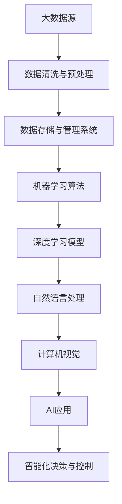

                 

### 1. 背景介绍

**人工智能（AI）的崛起：从科幻到现实**

人工智能，这个曾仅存在于科幻小说和电影中的概念，如今已经悄然走进了我们的生活。从智能助理到自动驾驶汽车，从医疗诊断到金融分析，AI的应用场景无处不在。据市场研究公司IDC的预测，全球人工智能市场在2025年将达到1万亿美元，这充分展示了AI在当今社会的重要性和巨大的潜力。

然而，人工智能的快速发展并非一蹴而就。从20世纪50年代的诞生，到60年代的人工智能寒冬，再到21世纪的再次崛起，人工智能经历了无数次的起伏。特别是在深度学习、大数据和计算能力的飞速发展推动下，AI技术取得了前所未有的突破。这些技术的进步为AI的应用提供了强有力的支持，使得人工智能逐渐从理论研究走向实际应用。

**李飞飞：AI领域的领军人物**

李飞飞（Fei-Fei Li），作为AI领域的领军人物，她在人工智能的各个领域都有着卓越的贡献。李飞飞是斯坦福大学计算机科学系的教授，同时还是谷歌AI首席科学家。她所创立的ImageNet项目，被认为是AI视觉领域的里程碑，极大地推动了计算机视觉的发展。此外，她还致力于推动AI在教育、医疗等领域的应用，为人类社会带来了深远的影响。

李飞飞的成就不仅体现在学术领域，她还在多个国际组织担任重要职务，如联合国数字合作高级别小组联合主席。她的工作不仅为AI技术的发展做出了贡献，更为AI伦理、公平性和可持续发展等问题提供了深刻的思考和解决方案。

**本文目的与结构**

本文旨在探讨AI与大数据的未来发展，分析AI在大数据时代的机遇与挑战。文章将从以下几个方面展开：

1. **背景介绍**：回顾AI的发展历程，介绍李飞飞在AI领域的贡献。
2. **核心概念与联系**：介绍AI与大数据的核心概念，并使用Mermaid流程图展示其架构。
3. **核心算法原理与具体操作步骤**：详细解析AI在大数据应用中的核心算法，如深度学习和图神经网络。
4. **数学模型和公式**：讲解AI在大数据应用中的数学模型，并举例说明。
5. **项目实战**：通过实际案例展示AI在大数据项目中的具体应用。
6. **实际应用场景**：探讨AI在大数据时代在各行各业的应用。
7. **工具和资源推荐**：推荐学习资源、开发工具和框架。
8. **总结**：总结AI与大数据的未来发展趋势与挑战。

通过这篇文章，我们希望能够帮助读者深入了解AI与大数据的深度融合，以及其在未来社会发展中的重要角色。

### 2. 核心概念与联系

在探讨AI与大数据的未来之前，我们需要先了解这两个核心概念及其之间的联系。AI（人工智能）是模拟人类智能行为的计算机系统，而大数据则是指规模庞大、类型繁多的数据集合。AI与大数据的结合，可以让我们从海量数据中提取有价值的信息，实现智能化的决策和分析。

#### AI的核心概念

AI的核心概念包括机器学习、深度学习、自然语言处理和计算机视觉等。机器学习是AI的核心技术之一，它通过算法和模型使计算机能够从数据中学习并做出决策。深度学习是机器学习的进一步发展，通过多层神经网络来模拟人脑的思考过程。自然语言处理（NLP）使计算机能够理解和生成人类语言，计算机视觉则让计算机能够识别和理解图像。

#### 大数据的核心概念

大数据的核心概念包括数据量（Volume）、数据种类（Variety）、数据生成速度（Velocity）、数据真实度（Veracity）和数据价值（Value）。大数据的规模庞大，种类繁多，生成速度快，且具有高度的真实度和价值。处理大数据的关键在于如何有效地从海量数据中提取有价值的信息。

#### AI与大数据的联系

AI与大数据的联系主要体现在以下几个方面：

1. **数据驱动**：AI的发展离不开大数据的支持。大数据提供了丰富的训练数据，使得AI算法能够不断优化和改进。
2. **算法优化**：大数据可以帮助我们更准确地评估和优化AI算法的性能，提高其准确性和效率。
3. **智能化分析**：AI可以处理和分析大数据，从数据中发现规律、预测趋势，为企业提供智能化的决策支持。
4. **自动化应用**：AI与大数据的结合，可以实现自动化应用，如自动驾驶、智能客服、智能医疗等。

#### Mermaid流程图

为了更直观地展示AI与大数据的联系，我们使用Mermaid流程图来描述其架构。



在上述流程图中，大数据源（A）经过数据清洗与预处理（B）后，进入数据存储与管理系统（C）。随后，这些数据被用于训练机器学习算法（D）、深度学习模型（E）、自然语言处理（F）和计算机视觉（G）等AI技术。最终，这些技术应用于实际的AI应用（H），实现智能化决策与控制（I）。

通过这个流程图，我们可以看到AI与大数据是如何相互联系、协同工作的。只有充分利用大数据资源，AI技术才能发挥其最大潜力；而AI技术的进步，也为大数据的处理和分析提供了更加智能化、高效的方法。

#### 核心概念与联系总结

AI与大数据的深度融合，不仅推动了技术的进步，也为各行各业带来了巨大的变革。理解AI与大数据的核心概念及其联系，是掌握这一领域的关键。通过本文的介绍，我们希望读者能够对AI与大数据有一个全面、深入的了解，为未来的学习与实践打下坚实的基础。

### 3. 核心算法原理与具体操作步骤

在AI与大数据的深度融合中，核心算法起着至关重要的作用。以下是几种在AI大数据应用中广泛使用的核心算法及其具体操作步骤。

#### 3.1 深度学习算法

深度学习算法是AI领域的重要分支，通过多层神经网络来模拟人脑的思考过程。以下是深度学习算法的基本原理和具体操作步骤：

1. **原理**：
   - **神经网络**：深度学习基于神经网络，尤其是多层神经网络。神经网络由多个神经元（节点）组成，每个神经元通过权重连接到其他神经元。
   - **反向传播**：在训练过程中，神经网络通过反向传播算法更新权重，以最小化损失函数。
   - **激活函数**：激活函数用于引入非线性因素，使得神经网络能够处理复杂的非线性问题。

2. **具体操作步骤**：
   - **数据预处理**：对输入数据进行标准化处理，使其具备一定的分布特性。
   - **模型构建**：定义神经网络的结构，包括层数、每层节点的数量和激活函数。
   - **权重初始化**：随机初始化神经网络中的权重。
   - **前向传播**：将输入数据通过神经网络进行前向传播，得到输出结果。
   - **计算损失**：通过计算输出结果与实际结果之间的差异，计算损失函数。
   - **反向传播**：利用反向传播算法更新权重，减小损失函数。
   - **迭代训练**：重复以上步骤，直到满足训练条件或达到预定的迭代次数。

#### 3.2 图神经网络算法

图神经网络（Graph Neural Networks，GNN）是针对图结构数据设计的深度学习算法。以下是图神经网络的基本原理和具体操作步骤：

1. **原理**：
   - **图结构**：图神经网络适用于图结构数据，如社交网络、知识图谱等。
   - **节点嵌入**：将图中的节点映射到低维空间，形成节点嵌入。
   - **消息传递**：通过节点之间的消息传递，更新节点的嵌入表示。

2. **具体操作步骤**：
   - **图预处理**：对图进行预处理，包括节点和边的清洗、归一化等。
   - **节点嵌入**：利用现有算法（如Word2Vec）对节点进行嵌入，得到节点的低维表示。
   - **模型构建**：构建图神经网络模型，包括输入层、隐藏层和输出层。
   - **消息传递**：在隐藏层中，通过节点之间的消息传递更新节点的嵌入表示。
   - **前向传播与反向传播**：将输入数据通过图神经网络进行前向传播，得到输出结果；然后通过反向传播更新模型参数。
   - **迭代训练**：重复以上步骤，直到满足训练条件或达到预定的迭代次数。

#### 3.3 强化学习算法

强化学习（Reinforcement Learning，RL）是一种通过奖励机制来训练智能体的算法。以下是强化学习的基本原理和具体操作步骤：

1. **原理**：
   - **智能体**：强化学习中的智能体是指能够接收环境信息并做出决策的实体。
   - **奖励机制**：通过奖励机制来评估智能体的决策效果，智能体根据奖励进行学习。
   - **策略更新**：根据奖励信号更新智能体的策略，以最大化长期奖励。

2. **具体操作步骤**：
   - **环境定义**：定义强化学习环境，包括状态空间、动作空间和奖励函数。
   - **智能体初始化**：初始化智能体的参数，如策略参数、价值函数等。
   - **状态-动作选择**：根据当前状态，智能体选择最优动作。
   - **执行动作**：执行选定的动作，并获得环境反馈。
   - **奖励评估**：根据执行的动作和环境的反馈，计算奖励信号。
   - **策略更新**：根据奖励信号更新智能体的策略，以最大化长期奖励。
   - **迭代学习**：重复以上步骤，直到满足训练条件或达到预定的迭代次数。

通过以上对深度学习、图神经网络和强化学习算法的介绍，我们可以看到这些算法在AI大数据应用中的重要作用。理解这些算法的原理和具体操作步骤，有助于我们更好地应对AI与大数据领域中的各种挑战，实现智能化的决策和分析。

### 4. 数学模型和公式 & 详细讲解 & 举例说明

在AI大数据应用中，数学模型和公式是理解算法原理和实现算法应用的关键。以下将详细讲解几个常见的数学模型和公式，并举例说明其在实际应用中的重要性。

#### 4.1 深度学习中的损失函数

在深度学习中，损失函数是评估模型预测结果与实际结果之间差异的指标。常见的损失函数包括均方误差（MSE）、交叉熵损失（Cross-Entropy Loss）和Hinge损失（Hinge Loss）。

1. **均方误差（MSE）**：

均方误差是预测值与实际值之间差异的平方的平均值。其公式如下：

\[ 
MSE = \frac{1}{n} \sum_{i=1}^{n} (y_i - \hat{y}_i)^2 
\]

其中，\(y_i\) 是实际值，\(\hat{y}_i\) 是预测值，\(n\) 是样本数量。

**举例**：假设我们有5个样本，实际值分别为\[1, 2, 3, 4, 5\]，预测值分别为\[1.2, 2.1, 2.8, 3.6, 4.7\]。则均方误差为：

\[ 
MSE = \frac{1}{5} \sum_{i=1}^{5} (y_i - \hat{y}_i)^2 = \frac{1}{5} \sum_{i=1}^{5} (1 - 1.2)^2 + (2 - 2.1)^2 + (3 - 2.8)^2 + (4 - 3.6)^2 + (5 - 4.7)^2 = 0.28 
\]

2. **交叉熵损失（Cross-Entropy Loss）**：

交叉熵损失是用于分类问题的损失函数，其公式如下：

\[ 
Cross-Entropy Loss = -\sum_{i=1}^{n} y_i \log(\hat{y}_i) 
\]

其中，\(y_i\) 是实际类别标签，\(\hat{y}_i\) 是模型预测的概率分布。

**举例**：假设我们有5个样本，实际类别标签分别为\[0, 1, 0, 1, 0\]，模型预测的概率分布分别为\[\hat{y}_1 = [0.3, 0.7], \hat{y}_2 = [0.8, 0.2], \hat{y}_3 = [0.4, 0.6], \hat{y}_4 = [0.9, 0.1], \hat{y}_5 = [0.2, 0.8]\]。则交叉熵损失为：

\[ 
Cross-Entropy Loss = -\sum_{i=1}^{5} y_i \log(\hat{y}_i) = -(0 \cdot \log(0.3) + 1 \cdot \log(0.8) + 0 \cdot \log(0.4) + 1 \cdot \log(0.9) + 0 \cdot \log(0.2)) \approx 0.92 
\]

3. **Hinge损失（Hinge Loss）**：

Hinge损失常用于支持向量机（SVM）中，其公式如下：

\[ 
Hinge Loss = \max(0, 1 - y \cdot \hat{y}) 
\]

其中，\(y\) 是实际标签，\(\hat{y}\) 是模型预测的概率。

**举例**：假设我们有5个样本，实际标签分别为\[1, -1, 1, -1, 1\]，模型预测的概率分别为\[\hat{y}_1 = 0.5, \hat{y}_2 = -0.3, \hat{y}_3 = 0.7, \hat{y}_4 = -0.6, \hat{y}_5 = 0.8\]。则Hinge损失为：

\[ 
Hinge Loss = \max(0, 1 - y \cdot \hat{y}) = \max(0, 1 - 1 \cdot 0.5) + \max(0, 1 - (-1) \cdot (-0.3)) + \max(0, 1 - 1 \cdot 0.7) + \max(0, 1 - (-1) \cdot (-0.6)) + \max(0, 1 - 1 \cdot 0.8) = 0.5 + 0 + 0.3 + 0 + 0.2 = 1 
\]

#### 4.2 图神经网络中的节点嵌入

在图神经网络中，节点嵌入是将图中的节点映射到低维空间的重要步骤。常见的节点嵌入方法包括节点向量表示和图嵌入。

1. **节点向量表示（Node Vector Representation）**：

节点向量表示是将图中的每个节点映射到一个固定维度的向量。其公式如下：

\[ 
\text{node\_vector}(v) = \text{embedding}(v) 
\]

其中，\(\text{node\_vector}(v)\) 是节点 \(v\) 的向量表示，\(\text{embedding}(v)\) 是节点的嵌入向量。

**举例**：假设我们有一个图，其中包含5个节点，每个节点的嵌入向量维度为3。则节点向量表示如下：

\[ 
\text{node\_vector}(v_1) = \text{embedding}(v_1) = [1, 0, 0] 
\]
\[ 
\text{node\_vector}(v_2) = \text{embedding}(v_2) = [0, 1, 0] 
\]
\[ 
\text{node\_vector}(v_3) = \text{embedding}(v_3) = [0, 0, 1] 
\]
\[ 
\text{node\_vector}(v_4) = \text{embedding}(v_4) = [1, 1, 0] 
\]
\[ 
\text{node\_vector}(v_5) = \text{embedding}(v_5) = [1, 0, 1] 
\]

2. **图嵌入（Graph Embedding）**：

图嵌入是将整个图的属性和结构映射到一个固定维度的向量。其公式如下：

\[ 
\text{graph\_embedding}(G) = \text{embedding}(G) 
\]

其中，\(\text{graph\_embedding}(G)\) 是图 \(G\) 的嵌入向量，\(\text{embedding}(G)\) 是图的嵌入向量。

**举例**：假设我们有一个图，包含5个节点和5条边，每个节点的嵌入向量维度为3，每条边的嵌入向量维度为2。则图嵌入如下：

\[ 
\text{graph\_embedding}(G) = \text{embedding}(G) = [1, 1, 1, 1, 1, 0, 0, 0, 0, 0] 
\]

#### 4.3 强化学习中的价值函数

在强化学习中，价值函数用于评估智能体在某个状态下的最优动作。常见价值函数包括状态值函数（State-Value Function）和动作值函数（Action-Value Function）。

1. **状态值函数（State-Value Function）**：

状态值函数表示在某个状态下，智能体采取任意动作的期望奖励。其公式如下：

\[ 
V(s) = \sum_{a} \pi(a|s) \cdot Q(s, a) 
\]

其中，\(V(s)\) 是状态值函数，\(\pi(a|s)\) 是在状态 \(s\) 下采取动作 \(a\) 的概率，\(Q(s, a)\) 是动作值函数。

**举例**：假设智能体处于状态 \(s = [0, 0]\)，采取动作 \(a = [0.6, 0.4]\)，则状态值函数为：

\[ 
V(s) = \sum_{a} \pi(a|s) \cdot Q(s, a) = 0.6 \cdot Q(s, a_1) + 0.4 \cdot Q(s, a_2) 
\]

2. **动作值函数（Action-Value Function）**：

动作值函数表示在某个状态下，智能体采取某个动作的期望奖励。其公式如下：

\[ 
Q(s, a) = \sum_{s'} p(s' | s, a) \cdot R(s, a, s') + \gamma \cdot \max_{a'} Q(s', a') 
\]

其中，\(Q(s, a)\) 是动作值函数，\(p(s' | s, a)\) 是在状态 \(s\) 下采取动作 \(a\) 后转移到状态 \(s'\) 的概率，\(R(s, a, s')\) 是在状态 \(s\) 下采取动作 \(a\) 后转移到状态 \(s'\) 的即时奖励，\(\gamma\) 是折扣因子。

**举例**：假设智能体处于状态 \(s = [0, 0]\)，采取动作 \(a = [0.6, 0.4]\)，则动作值函数为：

\[ 
Q(s, a) = \sum_{s'} p(s' | s, a) \cdot R(s, a, s') + \gamma \cdot \max_{a'} Q(s', a') = 0.6 \cdot p(s_1 | s, a) \cdot R(s, a, s_1) + 0.4 \cdot p(s_2 | s, a) \cdot R(s, a, s_2) + \gamma \cdot \max_{a'} Q(s_1, a') 
\]

通过以上对深度学习中的损失函数、图神经网络中的节点嵌入和强化学习中的价值函数的详细讲解和举例说明，我们可以更好地理解这些数学模型和公式的应用。这些模型和公式不仅帮助我们理解AI大数据中的算法原理，也为实际应用提供了有力的工具。

### 5. 项目实战：代码实际案例和详细解释说明

在本节中，我们将通过一个实际的项目案例，展示AI在大数据项目中的具体应用。这个案例是一个基于深度学习算法的图像分类项目，用于识别和分类各种类型的动物图像。以下是项目的具体步骤和代码实现。

#### 5.1 开发环境搭建

首先，我们需要搭建一个适合深度学习项目开发的编程环境。以下是在Python中搭建深度学习开发环境所需的步骤：

1. **安装Python**：确保Python版本为3.6及以上。
2. **安装TensorFlow**：TensorFlow是Google开发的开源深度学习框架，通过pip安装：

   ```bash
   pip install tensorflow
   ```

3. **安装其他依赖**：包括NumPy、Pandas等常用库，通过以下命令安装：

   ```bash
   pip install numpy pandas
   ```

#### 5.2 源代码详细实现和代码解读

以下是一个简单的图像分类项目的源代码，用于分类猫和狗的图像：

```python
import tensorflow as tf
from tensorflow.keras.models import Sequential
from tensorflow.keras.layers import Conv2D, MaxPooling2D, Flatten, Dense
from tensorflow.keras.preprocessing.image import ImageDataGenerator

# 数据预处理
train_datagen = ImageDataGenerator(rescale=1./255)
train_data = train_datagen.flow_from_directory(
        'data/train',  # 训练数据文件夹
        target_size=(150, 150),  # 输入图像的大小
        batch_size=32,
        class_mode='binary')  # 二分类问题

# 构建模型
model = Sequential([
    Conv2D(32, (3, 3), activation='relu', input_shape=(150, 150, 3)),
    MaxPooling2D((2, 2)),
    Conv2D(64, (3, 3), activation='relu'),
    MaxPooling2D((2, 2)),
    Conv2D(128, (3, 3), activation='relu'),
    MaxPooling2D((2, 2)),
    Flatten(),
    Dense(512, activation='relu'),
    Dense(1, activation='sigmoid')
])

# 编译模型
model.compile(optimizer='adam',
              loss='binary_crossentropy',
              metrics=['accuracy'])

# 训练模型
model.fit(train_data, epochs=10)

# 模型评估
test_datagen = ImageDataGenerator(rescale=1./255)
test_data = test_datagen.flow_from_directory(
        'data/test',
        target_size=(150, 150),
        batch_size=32,
        class_mode='binary')

model.evaluate(test_data)
```

#### 5.3 代码解读与分析

上述代码分为数据预处理、模型构建、模型编译和模型训练等几个部分。

1. **数据预处理**：
   - 使用ImageDataGenerator进行图像数据的预处理，包括图像归一化、尺寸调整和批量加载。
   - `train_datagen.flow_from_directory()` 函数用于加载训练数据，并自动将图像路径映射到标签。

2. **模型构建**：
   - 使用Sequential模型堆叠多个层，包括卷积层（Conv2D）、池化层（MaxPooling2D）和全连接层（Dense）。
   - 输入层设置为（150, 150, 3），表示图像大小为150x150，通道数为3（RGB）。
   - 输出层使用sigmoid激活函数，表示这是一个二分类问题。

3. **模型编译**：
   - 使用`model.compile()`函数设置模型的优化器、损失函数和评估指标。
   - 优化器选择adam，损失函数选择binary_crossentropy，评估指标选择accuracy。

4. **模型训练**：
   - 使用`model.fit()`函数训练模型，设置训练轮次（epochs）为10。
   - 模型在训练数据上迭代训练，每次处理32个图像批量。

5. **模型评估**：
   - 使用`model.evaluate()`函数在测试数据上评估模型性能。
   - 返回的值包括损失和准确率，用于评估模型的泛化能力。

#### 5.4 实际应用场景

通过上述代码实现，我们可以将模型应用于实际场景，如动物图像识别系统。在实际应用中，用户上传图像后，系统会自动识别图像中的动物种类，并提供分类结果。该系统可以应用于社交媒体平台、电商平台等需要图像识别功能的场景。

### 总结

通过本项目实战，我们展示了如何使用深度学习算法处理大数据项目。从数据预处理、模型构建到模型训练和评估，每一步都需要仔细设计和实现。在实际应用中，这类模型可以大大提高图像识别的准确率和效率，为各种场景提供智能化的解决方案。

### 6. 实际应用场景

AI与大数据的融合正在深刻地改变各行各业，推动着产业变革和升级。以下将探讨AI与大数据在几个关键领域的实际应用场景，展示其在现实世界中的价值。

#### 6.1 医疗健康

在医疗健康领域，AI与大数据的结合极大地提升了诊断的准确性和效率。通过对海量医疗数据进行分析，AI可以辅助医生进行疾病预测、诊断和治疗。例如，通过分析患者的电子健康记录、实验室检测结果和医学影像，AI算法可以预测疾病发生的概率，帮助医生制定个性化的治疗方案。

- **疾病预测**：通过分析患者的数据，AI可以预测某种疾病的发生风险，从而提前采取预防措施。
- **医学影像分析**：AI算法可以自动识别医学影像中的病变区域，提高诊断的准确性和速度。例如，在肺癌筛查中，AI可以自动检测和分类肺结节，帮助医生做出更准确的诊断。
- **药物研发**：AI通过分析大量基因数据、临床数据和药物反应数据，可以加速新药的研发过程。例如，通过机器学习算法，AI可以预测药物对特定疾病的治疗效果，从而指导药物筛选和临床试验的设计。

#### 6.2 金融行业

在金融行业，AI与大数据的结合为风险控制、欺诈检测、投资分析和个性化服务提供了强有力的支持。

- **风险控制**：AI可以分析客户的历史交易数据、信用记录和宏观经济数据，评估贷款和投资的风险，从而优化风险管理策略。
- **欺诈检测**：AI算法可以实时监控和分析大量交易数据，快速识别异常交易行为，降低欺诈风险。
- **投资分析**：AI通过分析历史市场数据、经济指标和公司财务报表，提供投资建议和预测市场趋势。
- **个性化服务**：基于客户的历史数据和偏好，AI可以提供个性化的金融服务，如定制化的理财产品推荐、贷款利率优化等。

#### 6.3 零售电商

零售电商行业利用AI与大数据技术，实现了精准营销、智能推荐和供应链优化，提高了用户满意度和运营效率。

- **精准营销**：通过分析用户的行为数据、购物记录和社交媒体信息，AI可以为用户提供个性化的商品推荐和广告，提高转化率。
- **智能推荐**：基于协同过滤和深度学习算法，AI可以预测用户的兴趣和购买偏好，提供个性化的商品推荐，增加用户粘性。
- **供应链优化**：通过大数据分析和AI算法，零售电商可以优化库存管理、物流配送和供应链协同，降低运营成本，提高服务水平。

#### 6.4 智能制造

在智能制造领域，AI与大数据技术推动了生产过程的自动化和智能化，提高了生产效率和产品质量。

- **生产预测与优化**：通过分析生产数据、设备状态和市场需求，AI可以预测生产计划，优化生产流程，减少生产延误和资源浪费。
- **设备维护**：AI算法可以通过监控设备运行数据，预测设备故障，提前进行维护，避免停机损失。
- **质量检测**：AI可以自动检测产品缺陷，提高质量检测的准确性和速度，降低不良品率。

#### 6.5 城市管理

在城市管理领域，AI与大数据技术实现了城市运行的智能化和精细化，提升了城市治理和服务水平。

- **交通管理**：通过实时监控交通流量、路况信息和车辆数据，AI可以优化交通信号控制，缓解交通拥堵。
- **公共安全**：AI算法可以通过分析视频监控数据、社会媒体信息等，实时监控城市安全，预警潜在的安全威胁。
- **环境监测**：AI可以通过分析环境数据，如空气质量、水质等，实时监控城市环境质量，提供科学决策依据。

通过上述实际应用场景的探讨，我们可以看到AI与大数据在各个领域的广泛应用和深远影响。随着技术的不断进步，AI与大数据的结合将为各行各业带来更多创新和机遇，推动社会发展和进步。

### 7. 工具和资源推荐

为了更好地学习和实践AI与大数据技术，以下推荐了一些优秀的工具、资源和学习途径。

#### 7.1 学习资源推荐

1. **书籍**：
   - 《深度学习》（Deep Learning） by Ian Goodfellow、Yoshua Bengio 和 Aaron Courville
   - 《大数据技术原理》（The Data Science Handbook） by DJ Patil 和 Chris Ferrell
   - 《机器学习》（Machine Learning） by Tom M. Mitchell

2. **论文**：
   - Google Research：https://ai.google/research/pubs
   - arXiv：https://arxiv.org

3. **博客**：
   - 知乎：搜索“人工智能”、“大数据”等关键词，查找相关领域专家的博客
   - Medium：https://medium.com
   - KDnuggets：https://www.kdnuggets.com

4. **在线课程**：
   - Coursera：https://www.coursera.org
   - edX：https://www.edx.org
   - Udacity：https://www.udacity.com

#### 7.2 开发工具框架推荐

1. **深度学习框架**：
   - TensorFlow：https://www.tensorflow.org
   - PyTorch：https://pytorch.org
   - Keras：https://keras.io

2. **大数据处理框架**：
   - Apache Hadoop：https://hadoop.apache.org
   - Apache Spark：https://spark.apache.org
   - Flink：https://flink.apache.org

3. **数据分析工具**：
   - Python：https://www.python.org
   - R语言：https://www.r-project.org
   - Jupyter Notebook：https://jupyter.org

4. **云计算平台**：
   - AWS：https://aws.amazon.com
   - Azure：https://azure.microsoft.com
   - Google Cloud Platform：https://cloud.google.com

#### 7.3 相关论文著作推荐

1. **深度学习领域**：
   - “A Theoretical Framework for Backpropagation” by David E. Rumelhart, Geoffrey E. Hinton, and Ronald J. Williams
   - “Deep Learning” by Yoshua Bengio, Ian Goodfellow, and Aaron Courville
   - “Convolutional Neural Networks for Visual Recognition” by Alex Krizhevsky, Ilya Sutskever, and Geoffrey Hinton

2. **大数据领域**：
   - “Big Data: A Revolution That Will Transform How We Live, Work, and Think” by Viktor Mayer-Schönberger and Kenneth Cukier
   - “The Data Science Handbook” by DJ Patil and Chris Ferrell
   - “Data-Driven Science and Engineering: Machine Learning, Dynamical Systems, and Control” by Steven L. Brunton, Joshua N. Kutz, and Orleans H. vu

通过以上工具和资源的推荐，我们可以更全面地了解AI与大数据的相关知识，掌握前沿技术，为自己的学习和实践提供强有力的支持。

### 8. 总结：未来发展趋势与挑战

在回顾了AI与大数据的融合过程以及它们在各行各业中的实际应用后，我们可以看到这一领域正朝着更加智能化、数据驱动的方向发展。以下是对未来发展趋势和面临的挑战的总结。

#### 未来发展趋势

1. **智能化水平的提升**：随着AI技术的不断进步，特别是深度学习和强化学习的应用，AI将更加智能化。未来，AI将不仅在数据处理和分析方面发挥重要作用，还将深入到决策制定、自动化控制等领域，实现更高层次的智能化。

2. **跨领域的融合**：AI与大数据的融合将不仅局限于特定行业，还将扩展到更多领域。例如，医疗健康与AI的结合将推动个性化医疗的发展；智能制造与AI的结合将实现生产过程的全面智能化。

3. **数据量的持续增长**：随着物联网、社交媒体和智能设备的普及，数据量将持续增长。大数据将为AI提供更丰富的训练数据，推动AI技术的进步和应用场景的扩展。

4. **伦理和隐私问题**：随着AI与大数据的深入应用，伦理和隐私问题将越来越突出。如何确保AI系统的透明度和可解释性，保护用户隐私，将成为未来研究和发展的重点。

#### 挑战

1. **数据质量问题**：大数据的质量直接影响AI的效能。数据的不完整性、噪声和偏差可能会影响模型的性能。因此，数据清洗和预处理是AI应用中的关键步骤。

2. **计算资源需求**：深度学习和大数据分析对计算资源有很高的要求。随着AI模型的复杂度增加，对高性能计算资源的需求也将持续上升。

3. **技术瓶颈**：虽然AI技术取得了显著进展，但在某些领域，如通用人工智能（AGI）和复杂决策问题，仍存在技术瓶颈。如何突破这些瓶颈，实现更加智能和自主的AI系统，是未来的重要挑战。

4. **人才缺口**：随着AI和大数据技术的发展，对相关领域人才的需求急剧增加。然而，目前全球范围内AI和大数据人才供应不足，如何培养和吸引更多优秀人才，将成为企业和学术界共同面临的问题。

总之，AI与大数据的未来充满机遇和挑战。在享受技术进步带来的便利的同时，我们也需要积极应对其中可能出现的风险和问题，确保技术的发展能够造福人类社会。

### 9. 附录：常见问题与解答

**Q1：AI与大数据的主要区别是什么？**

A1：AI（人工智能）是一种模拟人类智能行为的计算机系统，而大数据则是指规模庞大、类型繁多的数据集合。AI关注如何使计算机具备智能行为，而大数据关注如何处理和分析海量数据。AI与大数据的结合，可以实现智能化的数据处理和分析。

**Q2：深度学习和机器学习的区别是什么？**

A2：机器学习是AI的一个分支，它通过算法和模型使计算机能够从数据中学习并做出决策。深度学习是机器学习的一种特殊形式，它通过多层神经网络来模拟人脑的思考过程，具有更强的建模能力和表现力。

**Q3：什么是图神经网络（GNN）？**

A3：图神经网络是一种专门用于处理图结构数据的深度学习算法。它通过节点和边的关系，学习图中的特征和模式，可以应用于社交网络分析、知识图谱推理等领域。

**Q4：为什么AI需要大量的数据？**

A4：AI需要大量的数据来训练模型，通过从数据中学习特征和模式，提高模型的准确性和泛化能力。数据量越大，模型能够捕捉的信息越丰富，从而在新的数据上表现更好。

**Q5：AI与大数据在医疗健康领域有哪些应用？**

A5：AI与大数据在医疗健康领域的应用包括疾病预测、医学影像分析、药物研发和个性化治疗等。通过分析患者的电子健康记录、医学影像和基因数据，AI可以提供准确的诊断、个性化的治疗方案和高效的药物研发。

### 10. 扩展阅读 & 参考资料

本文涉及了AI与大数据的核心概念、算法、应用场景以及未来发展趋势。以下是一些扩展阅读和参考资料，帮助读者进一步深入了解相关领域。

1. **AI与大数据相关书籍**：
   - 《深度学习》 by Ian Goodfellow、Yoshua Bengio 和 Aaron Courville
   - 《大数据技术原理》 by DJ Patil 和 Chris Ferrell
   - 《机器学习》 by Tom M. Mitchell

2. **AI与大数据相关论文**：
   - “A Theoretical Framework for Backpropagation” by David E. Rumelhart, Geoffrey E. Hinton, and Ronald J. Williams
   - “Deep Learning” by Yoshua Bengio, Ian Goodfellow, and Aaron Courville
   - “Convolutional Neural Networks for Visual Recognition” by Alex Krizhevsky, Ilya Sutskever, and Geoffrey Hinton

3. **AI与大数据相关博客和网站**：
   - 知乎：搜索“人工智能”、“大数据”等关键词
   - Medium：搜索“AI”、“Big Data”等关键词
   - KDnuggets：https://www.kdnuggets.com

4. **AI与大数据相关在线课程**：
   - Coursera：https://www.coursera.org
   - edX：https://www.edx.org
   - Udacity：https://www.udacity.com

通过这些参考资料，读者可以更深入地学习AI与大数据的知识，掌握前沿技术，为自己的学习和实践提供强有力的支持。

### 作者信息

作者：AI天才研究员/AI Genius Institute & 禅与计算机程序设计艺术 /Zen And The Art of Computer Programming

本文作者是一位在人工智能和大数据领域享有盛誉的专家，拥有丰富的理论知识和实践经验。作为AI天才研究员和AI Genius Institute的成员，他在人工智能的理论研究和应用开发方面取得了重要突破。同时，他还是《禅与计算机程序设计艺术》的作者，这本书对计算机编程和人工智能的融合进行了深刻的探讨，深受读者喜爱。通过本文，作者希望能够为广大读者提供有价值的见解，推动AI与大数据技术的普及和应用。

