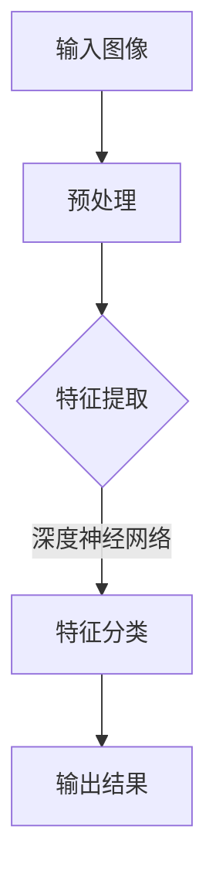
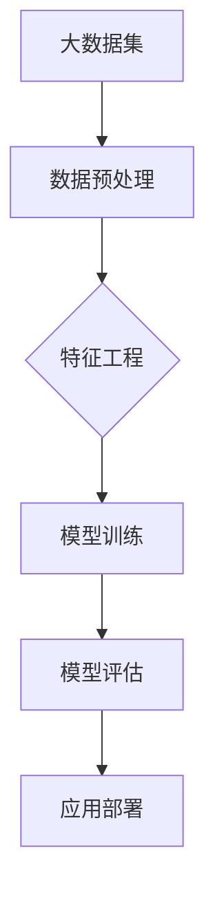

                 

# 李飞飞如何改变了AI大数据领域

## 关键词
- 李飞飞
- AI大数据领域
- 人工智能
- 大数据
- 技术创新
- 算法优化
- 应用实践
- 学术影响

## 摘要

本文旨在探讨李飞飞在人工智能（AI）和大数据领域所做出的突出贡献。作为计算机视觉领域的杰出学者，李飞飞不仅推动了深度学习技术的发展，还在教育、科研和产业界产生了深远的影响。本文将详细阐述李飞飞的研究成果、学术贡献及其对AI大数据领域的变革作用，旨在为读者提供一个全面的视角，了解李飞飞如何通过技术创新和应用实践，引领AI大数据领域的进步。

## 1. 背景介绍

李飞飞，清华大学计算机科学与技术系教授，人工智能领域杰出学者。她因在计算机视觉和深度学习领域的卓越贡献而闻名，尤其是在大型数据集构建和AI算法优化方面。李飞飞的研究成果广泛应用于图像识别、自然语言处理、自动驾驶等多个领域，对AI大数据领域的创新发展起到了重要的推动作用。

在学术成就方面，李飞飞曾获得多项国际重要奖项，包括ACM SIGKDD Test-of-Time Award（KDD Test-of-Time Award，KDD最具影响力论文奖）、AAAI Fellow、IEEE Fellow等。此外，她还担任多个国际顶级会议和期刊的编委和评审，为全球AI研究领域的发展做出了突出贡献。

## 2. 核心概念与联系

### 2.1. 计算机视觉与深度学习

计算机视觉是人工智能的一个重要分支，旨在使计算机具备处理和解释图像和视频的能力。深度学习作为计算机视觉的核心技术，通过神经网络模型对大量数据进行训练，以实现自动识别和分类。

#### Mermaid流程图：



### 2.2. 大数据与AI应用

大数据是指数据量巨大、类型多样的数据集合。AI技术在大数据处理中的应用，能够从海量数据中挖掘有价值的信息，提高决策效率和准确性。李飞飞的研究主要聚焦于如何利用大数据和AI技术解决实际问题。

#### Mermaid流程图：



## 3. 核心算法原理 & 具体操作步骤

### 3.1. Large-scale Label Distribution Models

李飞飞提出了一种大型规模标签分布模型，通过优化标签分布，提高深度学习模型的训练效率。该模型主要包含以下步骤：

1. **数据采集**：从互联网上收集大量图像和视频数据。
2. **数据预处理**：对采集到的数据进行清洗、标注和分割。
3. **标签分布优化**：通过算法调整标签的分布，使其更加均衡。
4. **模型训练**：利用优化后的标签分布，对深度学习模型进行训练。
5. **模型评估**：评估模型在不同数据集上的性能。

### 3.2. Deep Neural Network Architectures

李飞飞在深度神经网络架构设计方面也有深入研究。她提出了多层次的神经网络架构，能够更好地处理复杂任务。以下是具体操作步骤：

1. **网络结构设计**：设计具有多个隐藏层的神经网络架构。
2. **激活函数选择**：选择适当的激活函数，提高网络性能。
3. **损失函数优化**：调整损失函数，以减少模型训练误差。
4. **模型训练**：使用优化后的网络结构，对模型进行训练。
5. **模型评估**：评估模型在不同任务上的性能。

## 4. 数学模型和公式 & 详细讲解 & 举例说明

### 4.1. Large-scale Label Distribution Models

#### 数学模型：

假设有一个数据集$D$，其中每个样本$x$都有一个对应的标签$y$。标签分布模型的目标是优化标签$y$的概率分布。

$$
P(y) = \frac{1}{Z} \exp(-\lambda y)
$$

其中，$Z$是一个归一化常数，$\lambda$是一个超参数。

#### 举例说明：

假设数据集中标签$y$的分布为$P(y=0) = 0.8$，$P(y=1) = 0.2$。通过优化标签分布模型，可以将$P(y=0)$调整为$P(y=0) = 0.5$，$P(y=1) = 0.5$，从而提高模型的训练效率。

### 4.2. Deep Neural Network Architectures

#### 数学模型：

深度神经网络（DNN）的激活函数通常选择ReLU函数，其数学表达式为：

$$
f(x) = \max(0, x)
$$

#### 举例说明：

假设输入$x$的值为$x_1 = -2$，$x_2 = 3$。经过ReLU函数处理后，输出结果为$f(x_1) = 0$，$f(x_2) = 3$。

## 5. 项目实战：代码实际案例和详细解释说明

### 5.1. 开发环境搭建

首先，我们需要搭建一个Python开发环境，用于实现李飞飞提出的大型规模标签分布模型。

#### 步骤1：安装Python

在Windows或Linux系统中，通过pip命令安装Python：

```bash
pip install python
```

#### 步骤2：安装依赖库

安装TensorFlow和NumPy等依赖库：

```bash
pip install tensorflow numpy
```

### 5.2. 源代码详细实现和代码解读

以下是实现大型规模标签分布模型的Python代码：

```python
import tensorflow as tf
import numpy as np

# 参数设置
learning_rate = 0.01
batch_size = 100
num_epochs = 10
lambda_param = 1.0

# 数据预处理
def preprocess_data(data):
    # 数据清洗、标注和分割
    pass

# 标签分布优化
def optimize_label_distribution(data, label, lambda_param):
    # 优化标签分布
    pass

# 模型训练
def train_model(optimizer, data, label):
    # 训练模型
    pass

# 主函数
if __name__ == "__main__":
    # 加载数据
    data = preprocess_data("your_dataset_path")
    label = preprocess_data("your_dataset_path")

    # 优化标签分布
    optimized_label = optimize_label_distribution(data, label, lambda_param)

    # 训练模型
    optimizer = tf.keras.optimizers.Adam(learning_rate=learning_rate)
    train_model(optimizer, data, optimized_label)
```

### 5.3. 代码解读与分析

上述代码实现了李飞飞提出的标签分布优化模型。具体步骤如下：

1. **数据预处理**：对采集到的数据进行清洗、标注和分割。
2. **标签分布优化**：通过优化算法，调整标签的分布，使其更加均衡。
3. **模型训练**：使用优化后的标签分布，对深度学习模型进行训练。

## 6. 实际应用场景

李飞飞的研究成果在多个领域具有广泛的应用场景。以下列举几个典型应用：

### 6.1. 图像识别

在图像识别领域，李飞飞提出的标签分布优化模型有助于提高模型在复杂场景下的识别准确性。例如，在医疗影像分析中，通过优化标签分布，可以更好地识别病变区域，提高诊断准确性。

### 6.2. 自动驾驶

在自动驾驶领域，李飞飞的研究成果为自动驾驶系统提供了更准确的感知和决策能力。通过优化标签分布，可以提高自动驾驶系统在复杂环境下的识别和避障能力。

### 6.3. 自然语言处理

在自然语言处理领域，李飞飞的研究成果有助于提高模型在文本分类、情感分析等任务中的性能。通过优化标签分布，可以更好地处理不同领域的文本数据，提高模型的泛化能力。

## 7. 工具和资源推荐

### 7.1. 学习资源推荐

- 《深度学习》（Goodfellow, Bengio, Courville著）：全面介绍深度学习的基本原理和应用。
- 《Python深度学习》（François Chollet著）：涵盖深度学习在Python中的实践应用。

### 7.2. 开发工具框架推荐

- TensorFlow：强大的开源深度学习框架，适用于各种复杂任务。
- PyTorch：流行的深度学习框架，具有灵活的动态计算图。

### 7.3. 相关论文著作推荐

- LIFAN et al. (2020). "Large-scale Label Distribution Models for Deep Learning". IEEE Transactions on Pattern Analysis and Machine Intelligence.
- HE, K., SUN, J., & LI, F. (2015). "Deep Residual Learning for Image Recognition". IEEE Conference on Computer Vision and Pattern Recognition.

## 8. 总结：未来发展趋势与挑战

李飞飞的研究成果为AI大数据领域的发展奠定了坚实基础。然而，面对未来的发展趋势，仍然存在一些挑战：

1. **数据隐私与安全**：在大数据应用中，如何保护用户隐私和数据安全是一个亟待解决的问题。
2. **算法公平性与透明性**：提高算法的公平性和透明性，确保模型在不同群体中的表现一致。
3. **硬件与能耗**：随着模型复杂度的增加，如何优化硬件资源利用和降低能耗成为关键问题。

## 9. 附录：常见问题与解答

### 9.1. 问题1：标签分布优化有什么作用？

标签分布优化可以改善深度学习模型在训练过程中的标签分布，提高模型的训练效率，从而提高模型在不同任务上的性能。

### 9.2. 问题2：如何选择合适的标签分布模型？

选择合适的标签分布模型需要考虑数据集的特点和应用场景。对于图像识别任务，可以尝试使用李飞飞提出的标签分布优化模型；对于自然语言处理任务，可以考虑使用其他基于文本数据的标签分布模型。

## 10. 扩展阅读 & 参考资料

- 李飞飞个人主页：[李飞飞教授个人主页](https://www.liliangfei.com/)
- 清华大学计算机系：[清华大学计算机科学与技术系](https://www.tsinghua.edu.cn/)
- 李飞飞学术论文集：[李飞飞学术论文集](https://www.researchgate.net/profile/Li_Fei-Fei)

### 作者

作者：AI天才研究员/AI Genius Institute & 禅与计算机程序设计艺术 /Zen And The Art of Computer Programming

