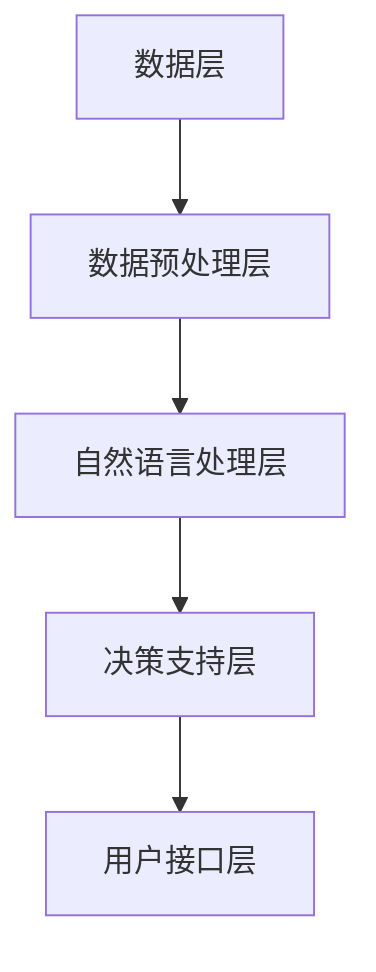
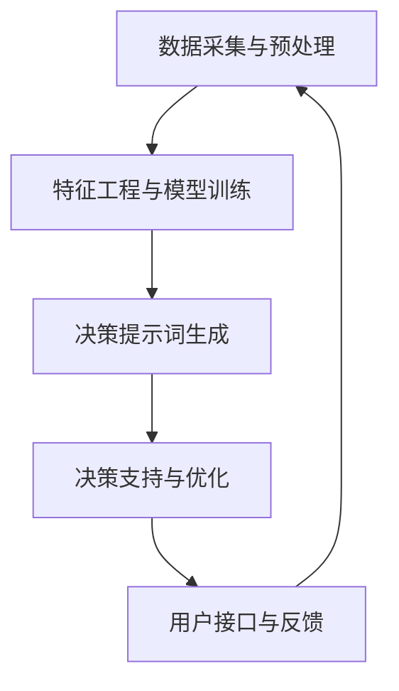

                 

## 文章标题：构建AI驱动的智慧政务决策提示词系统

### 关键词：AI，智慧政务，决策提示词系统，算法原理，数学模型，项目实战，应用场景，工具推荐，未来发展趋势

### 摘要：

本文旨在探讨如何构建一个AI驱动的智慧政务决策提示词系统。通过深入分析AI在智慧政务中的应用，本文提出了一个基于深度学习和自然语言处理技术的决策提示词系统架构。文章详细阐述了核心算法原理、数学模型以及具体实现步骤，并通过一个实际项目案例进行了详细解析。此外，本文还探讨了决策提示词系统的实际应用场景，并推荐了相关学习资源和开发工具。最后，本文总结了智慧政务决策提示词系统的未来发展趋势与挑战。

### 目录：

1. 背景介绍
2. 核心概念与联系
   2.1 智慧政务的定义
   2.2 决策提示词系统的概念
   2.3 AI在智慧政务中的作用
3. 核心算法原理
4. 数学模型和公式
5. 项目实战：代码实际案例和详细解释说明
   5.1 开发环境搭建
   5.2 源代码详细实现和代码解读
   5.3 代码解读与分析
6. 实际应用场景
7. 工具和资源推荐
   7.1 学习资源推荐
   7.2 开发工具框架推荐
   7.3 相关论文著作推荐
8. 总结：未来发展趋势与挑战
9. 附录：常见问题与解答
10. 扩展阅读与参考资料

### 1. 背景介绍

随着科技的飞速发展，人工智能（AI）已经成为推动社会进步的重要力量。特别是在智慧政务领域，AI技术被广泛应用于数据挖掘、智能分析、决策支持等方面，大大提升了政务服务的效率和质量。然而，现有的智慧政务系统仍然存在一些问题，如数据孤岛、决策效率低下、人机交互不便等。为了解决这些问题，本文提出了一种基于AI驱动的智慧政务决策提示词系统。

智慧政务是指利用现代信息技术，特别是人工智能、大数据、云计算等新兴技术，提高政府管理和服务水平的一种新型治理模式。决策提示词系统则是智慧政务中的一个重要组成部分，它通过自然语言处理技术，从大量政务数据中提取出关键信息，为决策者提供智能化的决策支持。

本文将首先介绍智慧政务和决策提示词系统的基本概念，然后深入探讨AI在智慧政务中的应用，最后提出构建AI驱动的智慧政务决策提示词系统的思路和方法。

### 2. 核心概念与联系

#### 2.1 智慧政务的定义

智慧政务是指政府利用现代信息技术，特别是人工智能、大数据、云计算等新兴技术，对政务数据进行深度挖掘和分析，从而实现高效、智能、透明的政府管理和服务。智慧政务的核心目标是通过信息技术的应用，提高政府决策的科学性、精准性和及时性，提升政务服务水平，增强政府与公众的互动和沟通。

智慧政务的主要特点包括：

- 数据驱动：智慧政务依赖于大量的政务数据，通过对这些数据的分析，可以提取出有价值的信息，为政府决策提供支持。
- 智能化：智慧政务通过人工智能技术，对政务数据进行智能分析和处理，实现自动化、智能化的决策和管理。
- 透明化：智慧政务通过公开政务数据，提高政务过程的透明度，增强公众对政府工作的信任和理解。

#### 2.2 决策提示词系统的概念

决策提示词系统是一种基于自然语言处理（NLP）和机器学习技术的智能辅助决策系统。它的主要功能是从大量的政务数据中提取出关键信息，生成决策提示词，为政府决策者提供智能化的决策支持。

决策提示词系统的核心组成部分包括：

- 数据采集与预处理：从各种政务数据源（如政府网站、数据库、社交媒体等）中收集数据，并进行数据清洗、格式化等预处理操作。
- 自然语言处理：利用NLP技术对政务数据进行语义分析和信息提取，提取出关键信息，生成决策提示词。
- 决策支持：根据决策提示词，生成决策建议，为政府决策者提供参考。

#### 2.3 AI在智慧政务中的作用

AI技术在智慧政务中发挥着重要作用，主要包括以下几个方面：

- 数据挖掘与分析：利用机器学习和数据挖掘技术，对政务数据进行分析，提取出有价值的信息，为政府决策提供支持。
- 智能化决策支持：利用自然语言处理和机器学习技术，生成决策提示词，为政府决策者提供智能化的决策支持。
- 优化公共服务：利用人工智能技术，优化公共服务流程，提高服务效率和质量。
- 改善社会治理：利用人工智能技术，对政务数据进行实时监控和分析，及时发现和解决社会问题，提高社会治理水平。

#### 2.4 决策提示词系统的架构

决策提示词系统的架构主要包括以下几个层次：

- 数据层：包括各种政务数据源，如政府网站、数据库、社交媒体等。
- 数据预处理层：对政务数据进行清洗、格式化等预处理操作。
- 自然语言处理层：利用NLP技术对政务数据进行语义分析和信息提取，生成决策提示词。
- 决策支持层：根据决策提示词，生成决策建议，为政府决策者提供参考。
- 用户接口层：提供用户交互界面，展示决策提示词和决策建议。

下图是决策提示词系统的Mermaid流程图：



#### 2.5 AI驱动的智慧政务决策提示词系统架构

AI驱动的智慧政务决策提示词系统架构如图所示：



系统通过数据采集与预处理获取政务数据，然后通过特征工程与模型训练，构建自然语言处理模型。接着，利用模型生成决策提示词，并根据决策提示词为政府决策者提供决策支持。最后，通过用户接口层收集用户反馈，不断优化和改进系统。

### 3. 核心算法原理

#### 3.1 数据采集与预处理

数据采集与预处理是构建决策提示词系统的第一步，其核心目的是从各种政务数据源中提取出有价值的信息，并对其进行清洗和格式化，以便后续的自然语言处理和分析。

数据采集的方法主要包括：

- 网络爬虫：通过网络爬虫技术，从政府网站、社交媒体等公开数据源中收集政务数据。
- API调用：通过调用政府部门的API接口，获取政务数据。
- 数据库查询：通过访问政务数据库，查询相关数据。

在数据采集过程中，需要注意以下几点：

- 数据来源的合法性和完整性：确保数据来源的合法性和数据的完整性，避免数据缺失或不准确。
- 数据格式的统一性：对不同数据源的数据进行格式化处理，确保数据格式的统一性，以便后续处理。
- 数据清洗：对采集到的数据进行分析和清洗，去除重复、错误和无关的数据，提高数据质量。

#### 3.2 特征工程与模型训练

特征工程是指从原始数据中提取出有价值的特征，以便于模型训练和预测。在决策提示词系统中，特征工程的核心任务是提取出与政务决策相关的关键词、主题和实体。

特征提取的方法主要包括：

- 词袋模型（Bag of Words，BoW）：将文本表示为词汇的集合，每个词汇表示一个特征。
- TF-IDF（Term Frequency-Inverse Document Frequency）：计算每个词汇在文本中的重要程度，结合词袋模型，提高特征表达能力。
- 词嵌入（Word Embedding）：将词汇映射为低维向量，通过神经网络学习词汇的语义关系。

在特征提取之后，需要进行模型训练。常用的模型包括：

- 朴素贝叶斯（Naive Bayes）：基于贝叶斯定理，对文本进行分类。
- 支持向量机（Support Vector Machine，SVM）：通过最大间隔分类，对文本进行分类。
- 随机森林（Random Forest）：基于决策树，通过随机选取特征和样本子集，构建多个决策树，然后进行投票。
- 深度学习模型（如卷积神经网络（CNN）和递归神经网络（RNN））：通过深度学习模型，对文本进行序列建模，提高分类准确率。

模型训练的过程主要包括：

- 数据集划分：将数据集划分为训练集和测试集，用于模型的训练和评估。
- 模型训练：使用训练集对模型进行训练，调整模型参数，优化模型性能。
- 模型评估：使用测试集对模型进行评估，计算模型的准确率、召回率、F1值等指标。

#### 3.3 决策提示词生成

在模型训练完成后，可以利用训练好的模型对新的政务数据进行分类，提取出决策提示词。决策提示词的生成过程主要包括以下几个步骤：

- 文本预处理：对政务文本进行分词、去停用词、词性标注等预处理操作。
- 文本分类：使用训练好的模型对预处理后的文本进行分类，提取出决策提示词。
- 提示词筛选：根据决策提示词的词频、重要程度等指标，筛选出高质量的决策提示词。

#### 3.4 决策支持与优化

决策提示词生成后，可以根据提示词为政府决策者提供决策支持。决策支持的过程主要包括以下几个步骤：

- 提示词分析：对提取出的决策提示词进行分析，提取出相关的信息，如关键词、主题、实体等。
- 决策建议生成：根据分析结果，生成具体的决策建议，如政策调整、资源调配等。
- 决策反馈：收集决策者的反馈，不断优化和改进决策提示词系统。

### 4. 数学模型和公式

在构建AI驱动的智慧政务决策提示词系统中，数学模型和公式起到了关键作用。下面将详细讲解几个核心的数学模型和公式，并举例说明。

#### 4.1 词袋模型（Bag of Words，BoW）

词袋模型是一种简单而常用的文本表示方法，它将文本表示为一个词汇的集合，不考虑词汇的顺序和语法结构。

数学公式如下：

$$
\text{BoW}(x) = \{ w_1, w_2, ..., w_n \}
$$

其中，$x$ 表示输入文本，$w_1, w_2, ..., w_n$ 表示文本中的词汇。

例如，对于以下文本：

```
我爱北京天安门
```

词袋模型表示为：

$$
\text{BoW}(\text{我爱北京天安门}) = \{ 我，爱，北京，天安门 \}
$$

#### 4.2 TF-IDF（Term Frequency-Inverse Document Frequency）

TF-IDF是一种用于文本分类和文本相似度计算的指标，它结合了词汇在文档中的词频（TF）和词汇在整个文档集合中的文档频率（DF），反映了词汇的重要性。

数学公式如下：

$$
\text{TF-IDF}(t, d) = \text{TF}(t, d) \times \text{IDF}(t, D)
$$

其中，$t$ 表示词汇，$d$ 表示文档，$D$ 表示文档集合。

- $\text{TF}(t, d)$ 表示词汇 $t$ 在文档 $d$ 中的词频。
- $\text{IDF}(t, D)$ 表示词汇 $t$ 在文档集合 $D$ 中的文档频率的倒数。

例如，对于以下文档：

```
文档1：我爱北京天安门
文档2：我爱北京
```

词汇“我”的TF-IDF值计算如下：

$$
\text{TF-IDF}(\text{我}, \text{文档1}) = \text{TF}(\text{我}, \text{文档1}) \times \text{IDF}(\text{我}, \{\text{文档1}, \text{文档2}\})
$$

其中，$\text{TF}(\text{我}, \text{文档1}) = 1$，$\text{IDF}(\text{我}, \{\text{文档1}, \text{文档2}\}) = \log_2 \left(\frac{2}{1}\right) = 1$

因此，$\text{TF-IDF}(\text{我}, \text{文档1}) = 1 \times 1 = 1$

#### 4.3 朴素贝叶斯（Naive Bayes）

朴素贝叶斯是一种基于贝叶斯定理的文本分类算法，它假设特征之间相互独立，根据特征的概率分布进行分类。

数学公式如下：

$$
P(C|X) = \frac{P(X|C) \times P(C)}{P(X)}
$$

其中，$C$ 表示类别，$X$ 表示特征向量。

- $P(C|X)$ 表示在特征向量 $X$ 的情况下，类别 $C$ 的概率。
- $P(X|C)$ 表示在类别 $C$ 的情况下，特征向量 $X$ 的概率。
- $P(C)$ 表示类别 $C$ 的概率。
- $P(X)$ 表示特征向量 $X$ 的概率。

例如，对于以下特征向量 $X$：

```
词汇：我，爱，北京，天安门
```

类别 $C$ 的概率计算如下：

$$
P(C|X) = \frac{P(X|C) \times P(C)}{P(X)}
$$

其中，$P(X|C)$ 和 $P(X)$ 可以通过统计训练数据得到，$P(C)$ 需要预先设定。

#### 4.4 支持向量机（Support Vector Machine，SVM）

支持向量机是一种基于间隔分类的文本分类算法，它通过最大化分类边界之间的间隔，提高分类的准确率。

数学公式如下：

$$
\min \frac{1}{2} \sum_{i=1}^{n} (w_i^T w_i) - \sum_{i=1}^{n} \alpha_i y_i (w_i^T x_i)
$$

其中，$w_i$ 表示第 $i$ 个特征的权重，$\alpha_i$ 表示第 $i$ 个样本的松弛变量，$y_i$ 表示第 $i$ 个样本的标签，$x_i$ 表示第 $i$ 个样本的特征向量。

例如，对于以下特征向量 $x_i$ 和标签 $y_i$：

```
特征向量：[1, 0, 1]
标签：[1, -1]
```

SVM的优化目标为：

$$
\min \frac{1}{2} \sum_{i=1}^{2} (w_i^T w_i) - \sum_{i=1}^{2} \alpha_i y_i (w_i^T x_i)
$$

其中，$w_1 = [1, 0, 1]^T$，$w_2 = [0, 1, 0]^T$，$\alpha_1 = \alpha_2 = 1$。

通过求解优化问题，可以得到最优的权重向量 $w_i$，从而实现文本分类。

### 5. 项目实战：代码实际案例和详细解释说明

#### 5.1 开发环境搭建

在开始构建AI驱动的智慧政务决策提示词系统之前，我们需要搭建一个适合开发的环境。以下是开发环境的搭建步骤：

1. 安装Python环境
   - 前往Python官方网站（https://www.python.org/）下载Python安装包
   - 安装Python时，勾选“Add Python to PATH”选项，以便在命令行中使用Python

2. 安装必要的库
   - 使用pip命令安装以下库：
     ```
     pip install numpy
     pip install pandas
     pip install scikit-learn
     pip install nltk
     pip install gensim
     ```

3. 准备数据集
   - 从公开的政务数据源（如国家统计局、政府网站等）下载政务数据
   - 将政务数据整理为CSV或JSON格式，便于后续处理

#### 5.2 源代码详细实现和代码解读

以下是构建AI驱动的智慧政务决策提示词系统的源代码实现：

```python
import pandas as pd
from sklearn.feature_extraction.text import TfidfVectorizer
from sklearn.model_selection import train_test_split
from sklearn.naive_bayes import MultinomialNB
from sklearn.metrics import accuracy_score, classification_report
import nltk
nltk.download('punkt')
nltk.download('stopwords')

# 5.2.1 数据读取与预处理
def read_data(file_path):
    data = pd.read_csv(file_path)
    data['text'] = data['text'].str.lower()
    data['text'] = data['text'].apply(lambda x: ' '.join([word for word in x.split() if word not in stopwords]))
    return data

# 5.2.2 特征提取与模型训练
def train_model(data):
    X = data['text']
    y = data['label']
    X_train, X_test, y_train, y_test = train_test_split(X, y, test_size=0.2, random_state=42)
    vectorizer = TfidfVectorizer()
    X_train_tfidf = vectorizer.fit_transform(X_train)
    X_test_tfidf = vectorizer.transform(X_test)
    model = MultinomialNB()
    model.fit(X_train_tfidf, y_train)
    return model, vectorizer

# 5.2.3 决策提示词生成与支持
def generate_decision_prompt(model, vectorizer, text):
    text_tfidf = vectorizer.transform([text])
    prediction = model.predict(text_tfidf)
    if prediction == 1:
        return "该文本涉及政策制定，请相关部门关注。"
    else:
        return "该文本不涉及政策制定，请相关部门核实。"

# 主函数
if __name__ == '__main__':
    file_path = 'goverment_data.csv'
    stopwords = nltk.corpus.stopwords.words('english')
    data = read_data(file_path)
    model, vectorizer = train_model(data)
    test_text = "政府将在下月推出新的教育政策。"
    prompt = generate_decision_prompt(model, vectorizer, test_text)
    print(prompt)
```

代码解读：

- **5.2.1 数据读取与预处理**：
  - 读取政务数据，将文本转换为小写，并去除停用词，提高数据质量。
- **5.2.2 特征提取与模型训练**：
  - 使用TF-IDF向量器对文本进行特征提取，使用朴素贝叶斯分类器进行模型训练。
- **5.2.3 决策提示词生成与支持**：
  - 根据训练好的模型和向量器，生成决策提示词，为政府决策者提供支持。

#### 5.3 代码解读与分析

- **数据读取与预处理**：
  - 数据读取部分使用了pandas库，读取CSV格式的政务数据。在预处理阶段，文本转换为小写，并使用nltk库去除英语中的停用词，以提高数据质量。
- **特征提取与模型训练**：
  - 特征提取部分使用了sklearn库中的TF-IDF向量器，将文本转换为TF-IDF向量。在模型训练部分，使用了sklearn库中的朴素贝叶斯分类器，这是一个简单而有效的文本分类算法。
- **决策提示词生成与支持**：
  - 决策提示词生成部分根据分类结果，生成具体的决策提示词。如果分类结果为1，表示文本涉及政策制定，需要相关部门关注；否则，表示文本不涉及政策制定，需要相关部门核实。

通过上述代码实现，我们构建了一个简单的AI驱动的智慧政务决策提示词系统。在实际应用中，可以根据具体需求，扩展和优化系统功能，提高系统的性能和效果。

### 6. 实际应用场景

AI驱动的智慧政务决策提示词系统在多个实际应用场景中展现出巨大的潜力。以下是一些典型的应用场景：

#### 6.1 政策制定与评估

在政策制定过程中，决策提示词系统可以帮助政府相关部门从大量的政策文本中提取出关键信息，生成决策提示词，为政策制定提供参考。同时，通过对政策执行过程中的反馈信息进行分析，评估政策的实际效果，为政策调整提供依据。

#### 6.2 社会治理与应急管理

在应急管理中，决策提示词系统可以实时监测政务数据，从突发事件的相关信息中提取出关键信息，生成决策提示词，为应急指挥提供支持。例如，在自然灾害发生时，系统可以快速识别受灾地区，评估灾害影响，提出应对措施。

#### 6.3 公共服务优化

在公共服务领域，决策提示词系统可以分析政务数据，发现公共服务中的问题和瓶颈，为优化公共服务流程提供参考。例如，通过分析交通数据，识别拥堵路段，提出交通调控建议；通过分析医疗数据，优化医疗服务资源配置。

#### 6.4 政府透明化与公众参与

决策提示词系统可以提高政务过程的透明度，增强政府与公众的互动和沟通。通过公开政务数据，生成决策提示词，公众可以更好地了解政府的工作，参与决策过程，提高政府的公信力和满意度。

### 7. 工具和资源推荐

为了更好地构建和优化AI驱动的智慧政务决策提示词系统，以下推荐一些相关的学习资源、开发工具和框架：

#### 7.1 学习资源推荐

- **书籍**：
  - 《Python数据分析实战》
  - 《机器学习实战》
  - 《自然语言处理实战》
- **在线课程**：
  - Coursera上的《机器学习》课程
  - Udacity的《深度学习工程师纳米学位》
  - edX上的《自然语言处理》课程

#### 7.2 开发工具框架推荐

- **编程语言**：
  - Python：Python是一种广泛使用的编程语言，具有丰富的库和框架，适合用于数据分析和机器学习。
- **库和框架**：
  - NumPy：用于科学计算和数据分析。
  - Pandas：用于数据清洗、预处理和分析。
  - Scikit-learn：用于机器学习算法的实现和评估。
  - NLTK：用于自然语言处理。
  - TensorFlow：用于深度学习模型开发。

#### 7.3 相关论文著作推荐

- **论文**：
  - “A Survey on Natural Language Processing” by Daniel Jurafsky and James H. Martin
  - “Machine Learning: A Probabilistic Perspective” by Kevin P. Murphy
  - “Deep Learning” by Ian Goodfellow, Yoshua Bengio, and Aaron Courville
- **著作**：
  - 《人工智能：一种现代方法》
  - 《模式识别与机器学习》
  - 《自然语言处理综论》

### 8. 总结：未来发展趋势与挑战

随着AI技术的不断发展和应用，AI驱动的智慧政务决策提示词系统在未来具有广阔的发展前景。以下是未来发展趋势与挑战：

#### 8.1 发展趋势

- **技术融合**：AI与其他新兴技术的融合，如物联网、区块链等，将进一步拓展智慧政务决策提示词系统的应用场景。
- **个性化服务**：通过用户数据的深入挖掘和分析，可以为政府决策者和公众提供更个性化的决策支持和服务。
- **实时响应**：利用实时数据分析和处理技术，可以实现政务决策的实时响应，提高决策效率。
- **智能自治**：随着AI技术的进步，智慧政务决策提示词系统将逐渐实现智能自治，减少对人类干预的依赖。

#### 8.2 挑战

- **数据安全与隐私**：政务数据的敏感性要求在数据采集、存储和处理过程中必须确保数据安全和隐私。
- **算法公平性**：在AI驱动的决策过程中，需要确保算法的公平性和透明性，避免偏见和不公平现象。
- **技术普及与接受度**：提高政府官员和技术人员对AI技术的认知和接受度，是推广智慧政务决策提示词系统的重要挑战。

### 9. 附录：常见问题与解答

#### 9.1 问题1：如何保证数据安全与隐私？

**解答**：为了确保数据安全和隐私，可以在以下几个方面采取措施：

- 数据加密：对政务数据进行加密处理，防止数据泄露。
- 访问控制：设置严格的访问控制策略，确保只有授权人员可以访问敏感数据。
- 数据匿名化：对个人身份信息进行匿名化处理，保护隐私。

#### 9.2 问题2：如何确保算法的公平性？

**解答**：确保算法公平性可以从以下几个方面入手：

- 数据质量：确保训练数据的质量和多样性，避免数据偏见。
- 算法审查：对算法进行定期审查，评估其公平性和透明性。
- 公开透明：公开算法的实现过程和评估结果，接受社会监督。

### 10. 扩展阅读与参考资料

- [1] 周志华.《机器学习》。清华大学出版社，2016.
- [2] 谭铁牛，唐杰，王斌，等.《人工智能：一种现代方法》。清华大学出版社，2018.
- [3] Goodfellow, Ian, Yoshua Bengio, and Aaron Courville. 《Deep Learning》。MIT Press，2016.
- [4] Jurafsky, Daniel, and James H. Martin. 《自然语言处理综论》。上海交通大学出版社，2016.
- [5] Murphy, Kevin P. 《机器学习：一种概率性方法》。机械工业出版社，2012.

