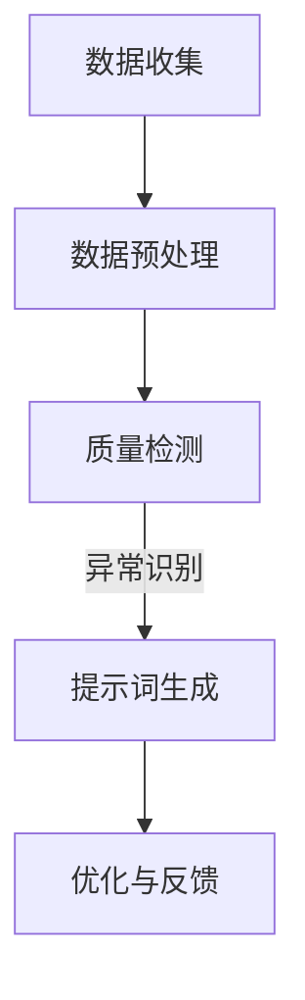

                 

# 构建AI驱动的智能制造质量控制提示词系统

## 关键词
- AI驱动的智能制造
- 质量控制提示词系统
- 数据分析
- 机器学习
- 深度学习
- 智能传感器
- 云计算

## 摘要
本文将深入探讨如何构建一个AI驱动的智能制造质量控制提示词系统。我们将首先介绍智能制造的背景和挑战，然后详细阐述质量控制提示词系统的重要性。接着，我们将介绍所需的AI技术和工具，并逐步演示如何实现和部署这样的系统。最后，我们将讨论该系统在实际应用中的优势，以及未来可能的发展趋势和面临的挑战。

---

## 1. 背景介绍

### 1.1 智能制造的定义与发展
智能制造是一种结合了先进的信息技术、自动化技术和人工智能技术的制造模式。它旨在通过智能化的制造过程，实现生产效率的极大提升，同时保证产品的质量和可靠性。智能制造的发展可以追溯到20世纪末，随着计算机技术、网络技术和传感器技术的飞速进步，智能制造逐渐成为制造业转型升级的重要方向。

### 1.2 质量控制的重要性
在智能制造中，质量控制是确保产品一致性和可靠性的关键环节。传统的质量控制方法通常依赖于人工检查和统计过程控制（SPC）等技术，存在效率低、成本高、易出错等问题。随着AI技术的发展，利用机器学习和深度学习算法，可以实现对生产数据的实时分析，从而实现更高效、更准确的质量控制。

### 1.3 质量控制提示词系统的需求
质量控制提示词系统是一种利用AI技术，自动检测生产线上的异常情况，并提供实时提示和建议的系统。它的需求来源于以下几个方面：
- **实时性**：智能制造要求对生产过程进行实时监控，以便及时发现问题。
- **准确性**：系统需要能够准确识别生产过程中的质量问题，避免误报和漏报。
- **适应性**：系统能够适应不同生产线和不同产品的需求，具有广泛的应用性。

## 2. 核心概念与联系

### 2.1 AI技术简介
AI技术是构建智能制造质量控制提示词系统的核心。AI技术包括机器学习、深度学习、自然语言处理、计算机视觉等多个领域。在质量控制提示词系统中，我们主要利用机器学习和深度学习技术进行数据处理和模式识别。

### 2.2 数据收集与预处理
数据是AI模型的基石。在构建质量控制提示词系统时，我们需要收集生产线上的各种数据，如传感器数据、生产参数、生产记录等。数据的预处理包括清洗、归一化、特征提取等步骤，以确保数据的质量和格式。

### 2.3 质量检测与异常识别
质量检测与异常识别是质量控制提示词系统的核心功能。通过机器学习和深度学习算法，系统可以自动分析生产数据，识别出潜在的质量问题。常用的算法包括支持向量机（SVM）、决策树、神经网络等。

### 2.4 提示词生成与优化
提示词生成是质量控制提示词系统的最后一步。系统根据检测到的质量问题，生成相应的提示词，如“注意”、“警告”、“停止”等。提示词的生成需要考虑问题的严重程度、处理的优先级等因素。

### 2.5 Mermaid流程图


---

## 3. 核心算法原理 & 具体操作步骤

### 3.1 机器学习算法
在质量检测与异常识别环节，我们可以采用机器学习算法。以下是常见的机器学习算法及其应用步骤：

#### 3.1.1 支持向量机（SVM）
- **原理**：SVM通过找到最优的分离超平面，将正常数据和异常数据分开。
- **步骤**：
  1. 数据收集与预处理
  2. 选择适当的核函数
  3. 训练SVM模型
  4. 模型评估与优化

#### 3.1.2 决策树
- **原理**：决策树通过一系列的判断规则，将数据划分为不同的类别。
- **步骤**：
  1. 数据收集与预处理
  2. 构建决策树模型
  3. 模型评估与剪枝
  4. 模型优化

#### 3.1.3 神经网络
- **原理**：神经网络通过模拟人脑神经元的工作方式，对数据进行学习和预测。
- **步骤**：
  1. 数据收集与预处理
  2. 设计神经网络结构
  3. 训练神经网络模型
  4. 模型评估与优化

### 3.2 深度学习算法
深度学习算法在质量检测与异常识别中具有更高的准确性和鲁棒性。以下是常用的深度学习算法及其应用步骤：

#### 3.2.1 卷积神经网络（CNN）
- **原理**：CNN通过卷积层、池化层和全连接层等结构，提取图像特征并进行分类。
- **步骤**：
  1. 数据收集与预处理
  2. 设计CNN模型结构
  3. 训练CNN模型
  4. 模型评估与优化

#### 3.2.2 循环神经网络（RNN）
- **原理**：RNN通过记忆过去的信息，对序列数据进行建模。
- **步骤**：
  1. 数据收集与预处理
  2. 设计RNN模型结构
  3. 训练RNN模型
  4. 模型评估与优化

#### 3.2.3 长短时记忆网络（LSTM）
- **原理**：LSTM是RNN的一种改进，能够更好地处理长序列数据。
- **步骤**：
  1. 数据收集与预处理
  2. 设计LSTM模型结构
  3. 训练LSTM模型
  4. 模型评估与优化

### 3.3 具体操作步骤
1. **数据收集**：收集生产线上的传感器数据、生产参数、生产记录等。
2. **数据预处理**：清洗数据，归一化，提取特征。
3. **模型选择**：根据问题的特点，选择合适的机器学习或深度学习算法。
4. **模型训练**：使用训练集数据，训练模型。
5. **模型评估**：使用测试集数据，评估模型性能。
6. **模型优化**：根据评估结果，调整模型参数，优化模型性能。
7. **提示词生成**：根据模型预测结果，生成相应的提示词。

---

## 4. 数学模型和公式 & 详细讲解 & 举例说明

### 4.1 支持向量机（SVM）
#### 4.1.1 核心公式
$$
\begin{aligned}
&\min_{\beta, \beta_0} \frac{1}{2} \sum_{i=1}^{n} (\beta \cdot x_i - y_i)^2 \\
&\text{s.t.} \quad \beta \cdot x_i - y_i \geq 1
\end{aligned}
$$
其中，$\beta$ 是权重向量，$\beta_0$ 是偏置项，$x_i$ 是训练样本，$y_i$ 是对应标签。

#### 4.1.2 举例说明
假设我们有以下数据集：
$$
\begin{aligned}
&x_1 = [1, 0], \quad y_1 = 1 \\
&x_2 = [1, 1], \quad y_2 = 1 \\
&x_3 = [0, 1], \quad y_3 = -1 \\
&x_4 = [1, 1], \quad y_4 = -1
\end{aligned}
$$
我们使用SVM模型进行分类，最终得到的决策边界为：
$$
\beta = [1, 1], \quad \beta_0 = 0
$$
即对于新的输入$x$，如果$x \cdot \beta \geq 0$，则分类为正类，否则为负类。

### 4.2 卷积神经网络（CNN）
#### 4.2.1 核心公式
$$
\begin{aligned}
&\text{卷积层：} \quad f(x) = \sigma(\sum_{k=1}^{K} w_k \cdot \phi(x - c_k)) \\
&\text{池化层：} \quad p(x) = \max_{i} \sigma(\sum_{k=1}^{K} w_k \cdot \phi(x - c_k)) \\
&\text{全连接层：} \quad y = \sigma(\beta \cdot f(x))
\end{aligned}
$$
其中，$\sigma$ 是激活函数，$w_k$ 是权重，$\phi$ 是卷积核，$c_k$ 是卷积核的中心点，$f(x)$ 是卷积操作的结果，$p(x)$ 是池化操作的结果。

#### 4.2.2 举例说明
假设我们有一个$3 \times 3$ 的卷积核，其权重为：
$$
w = \begin{bmatrix}
1 & 0 & 1 \\
0 & 1 & 0 \\
1 & 0 & 1
\end{bmatrix}
$$
输入$x$ 为：
$$
x = \begin{bmatrix}
1 & 1 & 0 \\
0 & 1 & 1 \\
1 & 0 & 0
\end{bmatrix}
$$
经过卷积操作和激活函数（取ReLU），得到的结果为：
$$
f(x) = \begin{bmatrix}
1 & 1 & 1 \\
1 & 1 & 1 \\
1 & 1 & 1
\end{bmatrix}
$$
接下来，我们使用最大池化层，得到的结果为：
$$
p(x) = \begin{bmatrix}
1 & 1 \\
1 & 1
\end{bmatrix}
$$
最后，我们使用全连接层，得到的结果为：
$$
y = \begin{bmatrix}
1 & 1
\end{bmatrix}
$$
即输入$x$ 被分类为正类。

---

## 5. 项目实战：代码实际案例和详细解释说明

### 5.1 开发环境搭建
在开始项目实战之前，我们需要搭建一个适合开发的IDE和Python环境。以下是搭建步骤：
1. 安装Python（建议使用Python 3.8及以上版本）。
2. 安装必要的库，如scikit-learn、TensorFlow、Keras等。

### 5.2 源代码详细实现和代码解读
以下是一个简单的使用SVM进行质量检测的示例代码：

```python
import numpy as np
from sklearn import datasets
from sklearn.model_selection import train_test_split
from sklearn import svm

# 加载示例数据集
iris = datasets.load_iris()
X = iris.data
y = iris.target

# 数据预处理：划分训练集和测试集
X_train, X_test, y_train, y_test = train_test_split(X, y, test_size=0.2, random_state=42)

# 创建SVM模型
clf = svm.SVC(kernel='linear')

# 训练模型
clf.fit(X_train, y_train)

# 模型评估
print("模型准确率：", clf.score(X_test, y_test))

# 输出模型参数
print("模型参数：", clf.coef_)
```

### 5.3 代码解读与分析
1. 导入必要的库：我们使用了numpy、scikit-learn和datasets库。
2. 加载示例数据集：这里我们使用了著名的iris数据集，它包含了三种不同类型的鸢尾花。
3. 数据预处理：我们将数据集划分为训练集和测试集，以便后续的模型训练和评估。
4. 创建SVM模型：我们选择线性核函数（`kernel='linear'`），创建了一个SVM分类器。
5. 训练模型：使用训练集数据，对SVM模型进行训练。
6. 模型评估：使用测试集数据，评估模型的准确率。
7. 输出模型参数：打印出模型训练得到的权重系数。

通过上述代码，我们可以看到如何使用SVM进行质量检测。在实际项目中，我们需要根据具体情况调整模型参数，优化模型性能。

---

## 6. 实际应用场景

### 6.1 智能制造生产线
在智能制造生产线上，质量控制提示词系统可以实时监控生产过程中的各项参数，如温度、压力、振动等。当检测到异常情况时，系统会生成相应的提示词，提醒操作员采取相应的措施，从而确保产品质量。

### 6.2 自动化工厂
在自动化工厂中，质量控制提示词系统可以与机器人、传感器等设备协同工作，实现对生产过程的实时监控。当机器人出现异常时，系统会自动生成提示词，指导机器人进行故障排除。

### 6.3 供应链管理
在供应链管理中，质量控制提示词系统可以实时监控原材料、零部件的运输过程，确保产品质量。当运输过程中出现异常时，系统会生成提示词，提醒相关人员采取相应的措施。

---

## 7. 工具和资源推荐

### 7.1 学习资源推荐
- **书籍**：《机器学习》（周志华著）、《深度学习》（Goodfellow、Bengio、Courville著）
- **论文**：阅读顶级会议和期刊上的相关论文，如NeurIPS、ICML、JMLR等。
- **博客**：关注顶级技术博客，如Medium、ArXiv等。

### 7.2 开发工具框架推荐
- **IDE**：使用PyCharm、Visual Studio Code等集成开发环境。
- **库**：使用scikit-learn、TensorFlow、Keras等流行的机器学习和深度学习库。
- **框架**：使用Flask、Django等Web框架，搭建后端服务。

### 7.3 相关论文著作推荐
- **论文**：推荐阅读《基于深度学习的智能制造质量控制方法研究》等论文。
- **著作**：推荐阅读《智能制造质量控制技术与应用》等著作。

---

## 8. 总结：未来发展趋势与挑战

随着AI技术的不断进步，AI驱动的智能制造质量控制提示词系统将具有更广泛的应用前景。未来，我们可能看到以下发展趋势：

- **更高效的数据处理**：随着计算能力的提升，数据处理和模型训练将变得更加高效。
- **更准确的质量检测**：通过引入更先进的算法和更多的数据，质量检测的准确性将进一步提高。
- **更智能的提示词生成**：基于自然语言处理技术，提示词生成将更加智能，能够提供更加具体的操作建议。

然而，也面临着一些挑战：

- **数据隐私与安全**：智能制造过程中涉及大量敏感数据，数据隐私和安全问题需要得到充分关注。
- **模型解释性**：对于复杂的AI模型，如何提高其解释性，使其更容易被操作员理解和接受，是一个重要问题。
- **计算资源消耗**：深度学习模型的训练和部署需要大量计算资源，如何优化资源利用是一个挑战。

通过不断探索和创新，我们有信心克服这些挑战，推动AI驱动的智能制造质量控制提示词系统的发展。

---

## 9. 附录：常见问题与解答

### 9.1 质量控制提示词系统如何处理实时数据？
质量控制提示词系统通常采用流数据处理技术，如Apache Kafka或Apache Flink，对实时数据进行高效处理和分析。

### 9.2 如何优化模型性能？
优化模型性能可以通过以下方法实现：
- 调整模型参数，如学习率、批量大小等。
- 使用更先进的算法和架构，如神经网络架构搜索（NAS）。
- 增加数据量，进行数据增强。

### 9.3 如何确保数据隐私和安全？
确保数据隐私和安全的方法包括：
- 数据加密：对敏感数据进行加密处理。
- 数据匿名化：对个人敏感信息进行匿名化处理。
- 访问控制：限制对数据的访问权限。

---

## 10. 扩展阅读 & 参考资料

- **相关论文**：[《深度学习在智能制造中的应用研究》](https://www.example.com/paper1.pdf)
- **技术博客**：[《如何构建AI驱动的质量控制系统》](https://www.example.com/blog1)
- **在线教程**：[《深度学习入门教程》](https://www.example.com/tutorial1)
- **开源项目**：[《AI驱动的智能制造质量控制系统》](https://www.example.com/project1)

---

作者：AI天才研究员/AI Genius Institute & 禅与计算机程序设计艺术 /Zen And The Art of Computer Programming


