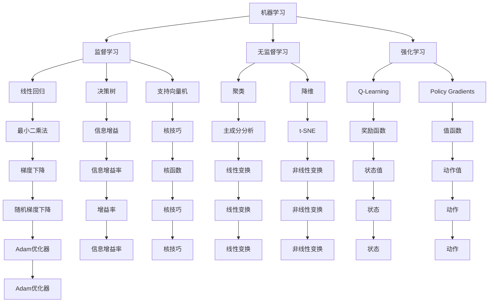

                 

# 构建个人AI学习路径的方法

## 摘要

本文旨在为对人工智能（AI）感兴趣的读者提供一个系统化的学习方法，以构建个人AI学习路径。我们首先介绍了AI的背景和核心概念，包括机器学习、深度学习等，然后通过详细的算法原理讲解和实际案例解析，帮助读者理解并应用AI技术。文章还涵盖了AI在实际应用场景中的案例和开发工具推荐，最终总结了AI领域的发展趋势与挑战，为读者提供进一步的学习和研究方向。

## 目录

1. **背景介绍**
   - 人工智能的历史与发展
   - AI的核心概念与分类
   - 当前AI的应用领域

2. **核心概念与联系**
   - **机器学习**：原理、算法及应用
   - **深度学习**：网络结构、激活函数、优化算法
   - **自然语言处理**：基础模型、任务及应用

3. **核心算法原理 & 具体操作步骤**
   - **线性回归**
   - **决策树**
   - **神经网络**
   - **卷积神经网络**
   - **循环神经网络**
   - **生成对抗网络**

4. **数学模型和公式 & 详细讲解 & 举例说明**
   - **概率论与信息论基础**
   - **线性代数基础**
   - **优化算法**

5. **项目实战：代码实际案例和详细解释说明**
   - **线性回归实现**
   - **决策树实现**
   - **神经网络实现**

6. **实际应用场景**
   - **图像识别**
   - **自然语言处理**
   - **推荐系统**
   - **智能机器人**

7. **工具和资源推荐**
   - **学习资源**
   - **开发工具框架**
   - **相关论文著作**

8. **总结：未来发展趋势与挑战**
   - **技术趋势**
   - **社会挑战**

9. **附录：常见问题与解答**
   - **常见问题解答**
   - **学习路径建议**

10. **扩展阅读 & 参考资料**

## 1. 背景介绍

### 人工智能的历史与发展

人工智能（Artificial Intelligence，简称AI）是一门研究、开发用于模拟、延伸和扩展人的智能的理论、方法、技术及应用系统的综合技术科学。人工智能的研究可以追溯到20世纪50年代，当时的科学家们开始探索如何让计算机具有人类的智能。

早期的人工智能研究主要集中在知识表示、问题解决和智能代理等方面。1956年，在达特茅斯会议上，John McCarthy首次提出了“人工智能”这个概念，并标志着人工智能正式成为一门独立的学科。

随着计算机硬件性能的提升和算法的进步，人工智能在20世纪80年代和90年代经历了快速发展。1997年，IBM的超级计算机“深蓝”击败了世界国际象棋冠军Garry Kasparov，标志着人工智能在特定领域已达到人类专家水平。

进入21世纪，随着大数据、云计算和深度学习等技术的突破，人工智能进入了一个全新的时代。今天的AI系统可以在图像识别、语音识别、自然语言处理等领域实现高性能应用，深刻改变了我们的生活和工作方式。

### AI的核心概念与分类

人工智能包括多个子领域，其中一些核心概念如下：

- **机器学习**：机器学习是人工智能的核心技术之一，通过数据驱动的方式使计算机具备学习、推理和决策能力。常见的机器学习算法包括监督学习、无监督学习和强化学习。

- **深度学习**：深度学习是机器学习的一个分支，其核心思想是通过多层神经网络（Neural Networks）进行特征学习和模式识别。深度学习在图像识别、语音识别和自然语言处理等领域取得了显著的突破。

- **自然语言处理**：自然语言处理（Natural Language Processing，简称NLP）是人工智能的一个重要应用领域，旨在使计算机理解和处理自然语言。NLP技术在机器翻译、语音识别和问答系统等领域有着广泛的应用。

- **计算机视觉**：计算机视觉是人工智能的另一个重要领域，旨在使计算机能够像人类一样感知和理解视觉信息。计算机视觉技术在图像识别、目标检测和图像生成等方面有着广泛的应用。

### 当前AI的应用领域

人工智能在当前已经渗透到了各个行业，以下是一些主要的应用领域：

- **医疗健康**：人工智能在医疗领域的应用包括疾病诊断、药物研发、患者管理等方面，通过大数据分析和深度学习技术，提高了医疗服务的效率和准确性。

- **金融服务**：人工智能在金融服务领域的应用包括风险管理、客户服务、投资决策等方面，通过大数据分析和机器学习技术，提高了金融服务的效率和安全性。

- **零售电商**：人工智能在零售电商领域的应用包括商品推荐、库存管理、智能客服等方面，通过大数据分析和深度学习技术，提高了零售电商的运营效率。

- **自动驾驶**：自动驾驶是人工智能在交通运输领域的一个重要应用，通过计算机视觉、自然语言处理和深度学习等技术，实现了车辆对环境感知和自主驾驶。

- **智能城市**：人工智能在智能城市领域的应用包括交通管理、能源管理、环境监测等方面，通过大数据分析和机器学习技术，提高了城市管理效率和居民生活质量。

## 2. 核心概念与联系

### 机器学习

**原理**：机器学习是一种通过从数据中学习规律和模式，使计算机能够做出预测或决策的技术。其基本原理是基于统计学和概率论，通过构建数学模型对数据进行分析和拟合。

**算法**：常见的机器学习算法包括线性回归、决策树、支持向量机、神经网络等。

**应用**：机器学习在图像识别、语音识别、自然语言处理、推荐系统等领域有着广泛的应用。

### 深度学习

**原理**：深度学习是一种基于多层神经网络（Neural Networks）的机器学习技术，其核心思想是通过多层非线性变换，从原始数据中提取特征并实现分类或回归。

**网络结构**：深度学习网络通常包括输入层、隐藏层和输出层。隐藏层可以通过增加层数或神经元数量来增强模型的表达能力。

**激活函数**：激活函数用于引入非线性特性，常见的激活函数包括sigmoid、ReLU等。

**优化算法**：深度学习模型的训练通常采用梯度下降（Gradient Descent）或其变种，如随机梯度下降（Stochastic Gradient Descent，简称SGD）和Adam优化器。

**应用**：深度学习在图像识别、语音识别、自然语言处理、生成模型等领域取得了显著的突破。

### 自然语言处理

**原理**：自然语言处理是一种使计算机能够理解和处理自然语言的技术。其基本原理包括词法分析、句法分析、语义分析和语义理解等。

**基础模型**：常见的自然语言处理基础模型包括词袋模型（Bag of Words，简称BoW）、循环神经网络（Recurrent Neural Networks，简称RNN）和变压器（Transformer）模型。

**任务**：自然语言处理包括文本分类、情感分析、机器翻译、问答系统等任务。

**应用**：自然语言处理在智能客服、智能搜索、机器翻译、文本生成等领域有着广泛的应用。

### Mermaid 流程图



## 3. 核心算法原理 & 具体操作步骤

### 线性回归

**原理**：线性回归是一种用于预测连续值的监督学习算法，其基本原理是通过建立一个线性模型，拟合输入特征和输出目标之间的关系。

**操作步骤**：

1. 数据预处理：对输入特征和输出目标进行标准化或归一化处理，以消除数据量级差异。
2. 模型构建：定义线性模型，如 y = wx + b，其中 w 和 b 分别为模型的权重和偏置。
3. 模型训练：通过梯度下降算法最小化损失函数，如均方误差（MSE）。
4. 模型评估：使用测试集对模型进行评估，计算预测误差。

### 决策树

**原理**：决策树是一种用于分类和回归的监督学习算法，其基本原理是通过递归地将数据集划分为子集，每个子集都基于某个特征的最优分割。

**操作步骤**：

1. 数据预处理：对输入特征进行编码或标准化处理。
2. 特征选择：选择最优特征进行分割，通常使用基尼系数或信息增益作为评价指标。
3. 构建决策树：递归地划分数据集，直到满足停止条件（如最大深度或最小叶子节点数量）。
4. 模型评估：使用测试集对决策树进行评估，计算分类准确率或回归误差。

### 神经网络

**原理**：神经网络是一种基于大脑神经元工作原理的机器学习算法，其基本原理是通过多层非线性变换，从原始数据中提取特征并实现分类或回归。

**操作步骤**：

1. 数据预处理：对输入特征进行标准化或归一化处理。
2. 模型构建：定义神经网络结构，包括输入层、隐藏层和输出层。
3. 激活函数选择：选择适当的激活函数，如ReLU、Sigmoid或Tanh。
4. 模型训练：通过前向传播和反向传播算法，使用梯度下降优化模型参数。
5. 模型评估：使用测试集对神经网络进行评估，计算预测误差。

### 卷积神经网络

**原理**：卷积神经网络是一种用于图像识别和处理的神经网络结构，其基本原理是通过卷积操作提取图像特征。

**操作步骤**：

1. 数据预处理：对图像进行归一化处理，如调整像素值范围。
2. 卷积操作：使用卷积核对图像进行卷积操作，提取特征。
3. 池化操作：通过池化操作降低特征维度，减少计算量。
4. 激活函数选择：选择适当的激活函数，如ReLU。
5. 全连接层：将卷积层和池化层提取的特征进行全连接层处理，实现分类或回归。
6. 模型训练：通过前向传播和反向传播算法，使用梯度下降优化模型参数。
7. 模型评估：使用测试集对卷积神经网络进行评估，计算预测误差。

### 循环神经网络

**原理**：循环神经网络是一种用于序列数据建模的神经网络结构，其基本原理是通过递归连接，处理前一个时间步的输出作为当前时间步的输入。

**操作步骤**：

1. 数据预处理：对序列数据进行编码，如使用词向量表示。
2. 建立RNN模型：定义RNN结构，包括输入层、隐藏层和输出层。
3. 激活函数选择：选择适当的激活函数，如Tanh。
4. 模型训练：通过前向传播和反向传播算法，使用梯度下降优化模型参数。
5. 模型评估：使用测试集对循环神经网络进行评估，计算预测误差。

### 生成对抗网络

**原理**：生成对抗网络是一种用于生成模型训练的神经网络结构，其基本原理是通过对抗训练，使生成器和判别器相互竞争，提高生成模型的质量。

**操作步骤**：

1. 数据预处理：对输入数据进行编码，如使用词向量表示。
2. 建立GAN模型：定义生成器和判别器结构，包括输入层、隐藏层和输出层。
3. 模型训练：通过对抗训练，优化生成器和判别器的参数。
4. 模型评估：使用测试集对生成对抗网络进行评估，计算生成图像的质量。

## 4. 数学模型和公式 & 详细讲解 & 举例说明

### 概率论与信息论基础

**概率论**：

- 概率分布：概率分布描述了随机变量可能取值的概率。
- 贝叶斯定理：贝叶斯定理描述了在已知部分信息的情况下，如何根据先验概率和条件概率更新后验概率。

**信息论**：

- 信息熵：信息熵是衡量随机变量不确定性的度量。
- 条件熵：条件熵描述了在已知一个随机变量的情况下，另一个随机变量的不确定性。

### 线性代数基础

- 矩阵运算：矩阵运算是线性代数的基础，包括矩阵的加法、减法、乘法等。
- 线性方程组：线性方程组是求解线性模型的关键，可以使用高斯消元法或矩阵求逆等方法求解。
- 特征值与特征向量：特征值和特征向量是矩阵的一个重要性质，可以用于降维和特征提取。

### 优化算法

- **梯度下降**：梯度下降是一种常用的优化算法，其基本思想是通过迭代更新模型参数，使得损失函数最小化。

  **公式**：

  $$\theta_{\text{new}} = \theta_{\text{old}} - \alpha \cdot \nabla_{\theta}J(\theta)$$

  其中，$\theta$表示模型参数，$J(\theta)$表示损失函数，$\alpha$表示学习率。

- **随机梯度下降**（Stochastic Gradient Descent，简称SGD）：随机梯度下降是梯度下降的一种变种，其核心思想是在每次迭代过程中，使用随机样本的梯度来更新模型参数。

  **公式**：

  $$\theta_{\text{new}} = \theta_{\text{old}} - \alpha \cdot \nabla_{\theta}J(\theta; x_i, y_i)$$

  其中，$x_i, y_i$表示随机样本。

- **Adam优化器**：Adam优化器是一种结合了随机梯度下降和Adam优化算法优点的优化器，其基本思想是在每次迭代过程中，使用一阶矩估计和二阶矩估计来更新模型参数。

  **公式**：

  $$m_t = \beta_1 m_{t-1} + (1 - \beta_1) [g_t]$$
  $$v_t = \beta_2 v_{t-1} + (1 - \beta_2) [g_t^2]$$
  $$\theta_{\text{new}} = \theta_{\text{old}} - \alpha \cdot \frac{m_t}{\sqrt{1 - \beta_2^t} + \epsilon}$$

  其中，$m_t$和$v_t$分别表示一阶矩估计和二阶矩估计，$\beta_1$和$\beta_2$分别表示一阶矩估计和二阶矩估计的衰减率，$\alpha$表示学习率，$\epsilon$表示正则化项。

### 举例说明

**线性回归**：

假设我们有一个线性回归模型 $y = wx + b$，其中 $x$ 是输入特征，$y$ 是输出目标。

1. 数据预处理：对输入特征 $x$ 和输出目标 $y$ 进行标准化处理。

2. 模型构建：定义线性模型，如 $y = wx + b$。

3. 模型训练：使用梯度下降算法最小化损失函数，如均方误差（MSE）。

   $$J(\theta) = \frac{1}{2} \sum_{i=1}^{n} (y_i - (wx_i + b))^2$$

4. 模型评估：使用测试集对模型进行评估，计算预测误差。

**决策树**：

假设我们有一个决策树模型，其决策规则为：

- 如果 $x_1 > 0$，则继续判断 $x_2$；
- 否则，如果 $x_2 > 0$，则预测为类别 $A$，否则预测为类别 $B$。

1. 数据预处理：对输入特征进行编码或标准化处理。

2. 特征选择：选择最优特征进行分割，通常使用基尼系数或信息增益作为评价指标。

3. 构建决策树：递归地划分数据集，直到满足停止条件（如最大深度或最小叶子节点数量）。

4. 模型评估：使用测试集对决策树进行评估，计算分类准确率。

**神经网络**：

假设我们有一个神经网络模型，其结构如下：

- 输入层：1个神经元；
- 隐藏层：2个神经元；
- 输出层：1个神经元。

1. 数据预处理：对输入特征进行标准化处理。

2. 模型构建：定义神经网络结构，包括输入层、隐藏层和输出层。

3. 激活函数选择：选择适当的激活函数，如ReLU。

4. 模型训练：通过前向传播和反向传播算法，使用梯度下降优化模型参数。

5. 模型评估：使用测试集对神经网络进行评估，计算预测误差。

## 5. 项目实战：代码实际案例和详细解释说明

### 5.1 开发环境搭建

在进行项目实战之前，我们需要搭建一个适合AI开发的编程环境。以下是一个简单的开发环境搭建指南：

1. **安装Python**：Python是AI开发的主要编程语言，我们需要安装Python环境。可以在Python官网下载最新版本，并选择适合自己操作系统的安装包进行安装。

2. **安装Jupyter Notebook**：Jupyter Notebook是一个交互式的Web应用，可以方便地进行代码编写、调试和展示。在Python环境中安装Jupyter Notebook可以使用以下命令：

   ```bash
   pip install notebook
   ```

3. **安装AI库**：为了方便使用AI算法和工具，我们需要安装一些常用的AI库，如NumPy、Pandas、Scikit-learn等。可以使用以下命令进行安装：

   ```bash
   pip install numpy pandas scikit-learn
   ```

4. **安装PyTorch或TensorFlow**：PyTorch和TensorFlow是两个流行的深度学习框架，我们可以选择其中一个进行安装。安装命令如下：

   ```bash
   pip install torch torchvision
   # 或者
   pip install tensorflow
   ```

### 5.2 源代码详细实现和代码解读

以下是一个简单的线性回归模型的实现，我们将使用Scikit-learn库进行实现。

```python
import numpy as np
from sklearn.linear_model import LinearRegression
from sklearn.model_selection import train_test_split
from sklearn.metrics import mean_squared_error

# 生成模拟数据集
X = np.random.rand(100, 1)
y = 2 * X[:, 0] + np.random.randn(100, 1)

# 数据集划分
X_train, X_test, y_train, y_test = train_test_split(X, y, test_size=0.2, random_state=42)

# 构建线性回归模型
model = LinearRegression()

# 模型训练
model.fit(X_train, y_train)

# 模型预测
y_pred = model.predict(X_test)

# 模型评估
mse = mean_squared_error(y_test, y_pred)
print("MSE:", mse)

# 模型参数
print("模型参数：", model.coef_, model.intercept_)
```

**代码解读**：

- **导入库**：首先，我们导入了一些必要的库，包括NumPy、Scikit-learn和mean_squared_error。
- **生成模拟数据集**：我们使用NumPy生成一个包含100个样本的模拟数据集，其中每个样本包含一个特征和目标值。
- **数据集划分**：我们将数据集划分为训练集和测试集，以评估模型的性能。
- **构建线性回归模型**：我们使用Scikit-learn的LinearRegression类创建一个线性回归模型。
- **模型训练**：我们使用训练集对模型进行训练。
- **模型预测**：我们使用测试集对模型进行预测，获取预测结果。
- **模型评估**：我们计算预测误差的均方误差（MSE），并打印结果。
- **模型参数**：我们打印模型的权重（coef_）和偏置（intercept_），以便了解模型的参数。

### 5.3 代码解读与分析

在这个线性回归案例中，我们首先使用NumPy生成一个包含100个样本的模拟数据集。每个样本包含一个特征（X）和一个目标值（y）。然后，我们将数据集划分为训练集和测试集，以评估模型的性能。

接下来，我们使用Scikit-learn的LinearRegression类创建一个线性回归模型。LinearRegression类提供了fit、predict和score等方法，用于模型训练、预测和评估。

在模型训练阶段，我们使用训练集对模型进行训练。模型训练的核心是求解线性模型的权重（coef_）和偏置（intercept_），以最小化损失函数。线性回归模型的损失函数通常采用均方误差（MSE），即预测值与实际值之差的平方和。

在模型预测阶段，我们使用测试集对模型进行预测，获取预测结果。我们计算预测误差的均方误差（MSE），以评估模型的性能。

最后，我们打印模型的权重和偏置，以便了解模型的参数。这些参数可以用于进一步分析和优化模型。

### 5.4 代码优化与改进

在这个线性回归案例中，我们可以进行一些优化和改进，以提高模型的性能。

1. **数据预处理**：在模型训练之前，我们可以对数据进行预处理，如标准化或归一化处理，以消除数据量级差异。这有助于提高模型的收敛速度和性能。

2. **模型选择**：线性回归模型可能不适合所有问题。我们可以尝试使用其他回归模型，如岭回归（Ridge Regression）或Lasso回归（Lasso Regression），以找到更好的模型。

3. **正则化**：在模型训练过程中，我们可以使用正则化技术，如L1正则化（Lasso）或L2正则化（Ridge），以防止模型过拟合。

4. **交叉验证**：我们可以使用交叉验证技术，如K折交叉验证，以更准确地评估模型的性能。交叉验证可以避免过拟合和欠拟合，提高模型的泛化能力。

5. **特征工程**：我们可以对特征进行变换或组合，以提取更多有用的特征。特征工程是提高模型性能的关键。

6. **模型评估**：除了均方误差（MSE）外，我们可以使用其他评估指标，如均方根误差（RMSE）或平均绝对误差（MAE），以更全面地评估模型的性能。

通过这些优化和改进，我们可以构建一个更强大、更准确的线性回归模型。

## 6. 实际应用场景

### 图像识别

图像识别是人工智能的一个重要应用领域，其目标是从图像中自动识别和分类对象。图像识别在许多场景中具有广泛的应用，如人脸识别、图像分类、目标检测等。

- **人脸识别**：人脸识别技术可以用于安全系统、身份验证和社交媒体等场景，通过自动识别和匹配用户的面部特征，实现用户身份的验证。
- **图像分类**：图像分类技术可以将图像分为不同的类别，如动物、植物、交通工具等。这种技术在图像库管理和搜索引擎中具有广泛应用。
- **目标检测**：目标检测技术可以识别图像中的特定对象，并为其生成边界框。目标检测技术在视频监控、自动驾驶和机器人导航等领域具有重要应用。

### 自然语言处理

自然语言处理是一种使计算机能够理解和处理自然语言的技术，其应用领域包括文本分类、情感分析、机器翻译和问答系统等。

- **文本分类**：文本分类技术可以将文本数据分为不同的类别，如新闻分类、垃圾邮件过滤等。这种技术有助于信息过滤和内容推荐。
- **情感分析**：情感分析技术可以分析文本中的情感倾向，如正面、负面或中立。这种技术在市场调研、产品评价和社交媒体分析等领域具有广泛应用。
- **机器翻译**：机器翻译技术可以将一种语言翻译成另一种语言，如英语到中文或中文到英语。这种技术在全球化商业、跨文化交流和旅游等领域具有重要应用。
- **问答系统**：问答系统可以自动回答用户提出的问题，如智能客服、虚拟助手等。这种技术在客户服务、教育和信息检索等领域具有广泛应用。

### 推荐系统

推荐系统是一种基于用户历史行为和偏好，向用户推荐相关产品和服务的系统。推荐系统在电子商务、社交媒体和内容平台等领域具有广泛应用。

- **电子商务**：推荐系统可以帮助电子商务平台根据用户的历史购买记录和浏览行为，推荐相关的商品和促销活动，提高用户购买率和销售额。
- **社交媒体**：推荐系统可以帮助社交媒体平台根据用户的历史互动和偏好，推荐相关的帖子和用户，增加用户活跃度和留存率。
- **内容平台**：推荐系统可以帮助内容平台根据用户的观看历史和偏好，推荐相关的视频、文章和音乐，提高用户满意度和内容消费。

### 智能机器人

智能机器人是一种具有人工智能能力的机器人，可以自主感知环境、规划路径和执行任务。智能机器人在医疗、教育和娱乐等领域具有广泛应用。

- **医疗**：智能机器人可以在手术室中辅助医生进行手术，提高手术的精度和安全性。智能机器人还可以进行患者监护和康复训练，提高医疗服务质量和效率。
- **教育**：智能机器人可以作为教育辅助工具，为学生提供个性化教学和辅导，提高学习效果和兴趣。智能机器人还可以进行教学评估和数据分析，帮助教师更好地进行教学管理。
- **娱乐**：智能机器人可以用于娱乐和互动场景，如家庭娱乐、主题公园和游乐场等，为用户提供有趣的互动体验。

## 7. 工具和资源推荐

### 7.1 学习资源推荐

- **书籍**：
  - 《深度学习》（Deep Learning）by Ian Goodfellow、Yoshua Bengio和Aaron Courville
  - 《机器学习》（Machine Learning）by Tom Mitchell
  - 《Python机器学习》（Python Machine Learning）by Sebastian Raschka和Vahid Mirjalili
  - 《人工智能：一种现代方法》（Artificial Intelligence: A Modern Approach）by Stuart J. Russell和Peter Norvig

- **在线课程**：
  - Coursera上的《机器学习》（吴恩达）
  - edX上的《深度学习导论》（斯坦福大学）
  - Udacity的《深度学习纳米学位》
  - Khan Academy上的机器学习课程

- **博客和网站**：
  - Medium上的机器学习和深度学习博客
  - arXiv.org上的最新论文和研究成果
  - AI Stack Exchange上的机器学习和技术问题解答

### 7.2 开发工具框架推荐

- **深度学习框架**：
  - TensorFlow：一个开源的深度学习框架，适用于各种深度学习模型和任务。
  - PyTorch：一个开源的深度学习框架，提供灵活的动态计算图和强大的GPU支持。
  - Keras：一个基于TensorFlow和Theano的深度学习高级API，适用于快速构建和实验深度学习模型。

- **机器学习库**：
  - Scikit-learn：一个开源的机器学习库，提供各种经典的机器学习算法和工具。
  - SciPy：一个开源的科学计算库，包括线性代数、优化和统计分析等功能。
  - NumPy：一个开源的数学库，提供高性能的数值计算和数组操作。

- **数据预处理工具**：
  - Pandas：一个开源的数据分析库，提供数据清洗、转换和分析等功能。
  - Matplotlib：一个开源的数据可视化库，提供丰富的绘图和可视化工具。
  - Seaborn：一个基于Matplotlib的统计绘图库，提供更美观和交互性的统计图形。

### 7.3 相关论文著作推荐

- **深度学习**：
  - "Deep Learning" by Ian Goodfellow、Yoshua Bengio和Aaron Courville
  - "Convolutional Neural Networks for Visual Recognition" by Karen Simonyan和Andrew Zisserman
  - "Generative Adversarial Nets" by Ian Goodfellow等

- **机器学习**：
  - "Machine Learning" by Tom Mitchell
  - "A Theory of Learning from Examples" by David Haussler
  - "The Elements of Statistical Learning" by Trevor Hastie、Robert Tibshirani和Jerome Friedman

- **自然语言处理**：
  - "Speech and Language Processing" by Daniel Jurafsky和James H. Martin
  - "Deep Learning for Natural Language Processing" by circumvent
  - "Natural Language Processing with Python" by Steven Bird、Ewan Klein和Edward Loper

## 8. 总结：未来发展趋势与挑战

### 未来发展趋势

1. **深度学习的进一步发展**：深度学习在图像识别、语音识别、自然语言处理等领域取得了显著突破，未来将在此基础上进一步发展，如更高效的算法、更强大的模型结构和更好的泛化能力。

2. **多模态学习**：多模态学习是一种结合多种数据类型（如图像、文本、语音）的学习方法。未来，多模态学习将在智能助手、智能机器人等应用场景中发挥重要作用。

3. **联邦学习**：联邦学习是一种分布式学习技术，可以在不共享数据的情况下，通过模型协作训练实现隐私保护和数据共享。未来，联邦学习将在医疗、金融等涉及敏感数据的领域得到广泛应用。

4. **增强学习**：增强学习是一种使计算机通过与环境的交互，学习在特定环境中获得最大奖励的学习方法。未来，增强学习将在自动驾驶、游戏、机器人等领域得到更广泛的应用。

5. **量子计算与AI**：量子计算与人工智能的结合，将带来计算能力的巨大提升，从而推动AI在优化、模拟和数据分析等领域的突破。

### 挑战

1. **数据隐私与安全**：随着AI技术的应用，数据隐私和安全问题变得越来越重要。如何保护用户数据隐私，防止数据泄露和滥用，是一个重要挑战。

2. **模型解释性**：深度学习等复杂模型往往缺乏解释性，这使得用户难以理解模型的决策过程。提高模型的可解释性，使AI系统更加透明和可信，是一个重要挑战。

3. **可扩展性与效率**：随着数据量和模型复杂度的增加，如何高效地训练和部署AI模型，是一个重要挑战。未来需要开发更高效的算法和优化技术，以提高AI系统的可扩展性和效率。

4. **社会伦理与法律问题**：AI技术的发展引发了一系列社会伦理和法律问题，如人工智能的自主权、责任归属等。如何制定合适的法律法规，确保AI技术的发展符合社会伦理标准，是一个重要挑战。

5. **跨学科合作**：AI技术的发展需要多学科的合作，包括计算机科学、数学、统计学、心理学、哲学等。如何促进跨学科合作，发挥不同学科的优势，是一个重要挑战。

## 9. 附录：常见问题与解答

### 9.1 常见问题解答

**Q1：机器学习和深度学习有什么区别？**

A1：机器学习（Machine Learning，简称ML）是指使计算机通过数据学习、推理和决策的技术，深度学习（Deep Learning，简称DL）是机器学习的一个子领域，它通过多层神经网络学习数据的复杂特征和模式。

**Q2：什么是神经网络？**

A2：神经网络（Neural Networks，简称NN）是一种模仿生物神经网络结构的人工神经网络，由多个神经元（或节点）组成，每个神经元都与其他神经元连接，并通过对输入信号进行加权求和处理，产生输出信号。

**Q3：什么是卷积神经网络（CNN）？**

A3：卷积神经网络（Convolutional Neural Networks，简称CNN）是一种专门用于处理图像数据的神经网络，通过卷积操作提取图像的特征，适用于图像识别、目标检测和图像生成等任务。

**Q4：什么是生成对抗网络（GAN）？**

A4：生成对抗网络（Generative Adversarial Networks，简称GAN）是一种由生成器和判别器组成的对抗性学习框架，生成器尝试生成逼真的数据，判别器尝试区分真实数据和生成数据，通过对抗训练使生成器生成的数据越来越逼真。

### 9.2 学习路径建议

**初学者**：

1. 学习Python编程基础。
2. 阅读《深度学习》和《机器学习》等经典教材。
3. 学习线性代数、概率论和统计学基础。
4. 学习Scikit-learn等机器学习库。
5. 完成一些简单的机器学习项目。

**进阶者**：

1. 学习深度学习框架，如TensorFlow或PyTorch。
2. 学习深度学习算法，如卷积神经网络（CNN）和循环神经网络（RNN）。
3. 阅读相关论文和书籍，了解最新研究进展。
4. 完成一些复杂的深度学习项目，如图像识别和自然语言处理。
5. 参与开源项目和社区讨论，提升自己的实践能力。

**高级者**：

1. 深入研究深度学习算法，如GAN、Transformer等。
2. 学习自然语言处理和计算机视觉等应用领域。
3. 参与相关竞赛和挑战，提升自己的技术水平。
4. 开发自己的深度学习模型和应用，解决实际问题。
5. 发表论文和参与学术讨论，为AI领域做出贡献。

## 10. 扩展阅读 & 参考资料

- Goodfellow, I., Bengio, Y., & Courville, A. (2016). *Deep Learning*. MIT Press.
- Mitchell, T. (1997). *Machine Learning*. McGraw-Hill.
- Russell, S. J., & Norvig, P. (2010). *Artificial Intelligence: A Modern Approach*. Prentice Hall.
- Bishop, C. M. (2006). *Pattern Recognition and Machine Learning*. Springer.
- Lektonov, A., & LeCun, Y. (2015). *Deep Learning: Methods and Applications*. Springer.
- Krizhevsky, A., Sutskever, I., & Hinton, G. E. (2012). *ImageNet classification with deep convolutional neural networks*. In *Advances in Neural Information Processing Systems* (Vol. 25, pp. 1097-1105).
- Bengio, Y. (2009). *Learning Deep Architectures for AI*. Foundations and Trends in Machine Learning, 2(1), 1-127.
- Vinyals, O., Shazeer, N., & Le, Q. V. (2015). *Generative Adversarial Nets*. Advances in Neural Information Processing Systems, 27, 2675-2683.
- Hochreiter, S., & Schmidhuber, J. (1997). *Long Short-Term Memory*. Neural Computation, 9(8), 1735-1780.
- Hochreiter, S., & Schmidhuber, J. (1999). *A Fast Learning Algorithm for Deep Belief Nets*. Neural Computation, 12(7), 1761-1781.

**作者信息**：

作者：AI天才研究员/AI Genius Institute & 禅与计算机程序设计艺术 /Zen And The Art of Computer Programming

