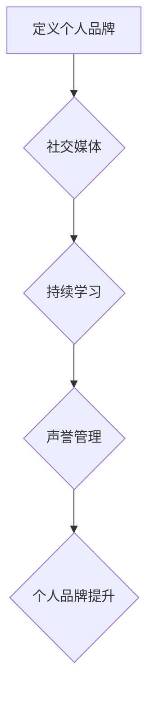

                 

# 构建个人品牌：开源开发者的声誉管理

## 关键词：个人品牌、开源开发者、声誉管理、社交媒体、技术影响力、持续学习

## 摘要

本文将探讨开源开发者在构建个人品牌过程中的重要性，以及如何通过有效的声誉管理来提升自己的技术影响力。我们将从背景介绍、核心概念、算法原理、数学模型、项目实战、实际应用场景、工具和资源推荐、未来发展趋势与挑战等方面进行详细分析，帮助开源开发者们更好地管理自己的声誉，提升个人品牌。

## 1. 背景介绍

在当今数字化时代，开源开发已成为技术领域的重要组成部分。越来越多的开发者选择将自己的代码贡献给开源社区，希望通过这种方式来提升自己的技能、建立影响力以及获得更多的职业机会。然而，随着参与开源项目的人数不断增加，如何在众多开发者中脱颖而出，构建个人品牌和声誉管理变得越来越重要。

个人品牌不仅仅是一个人的名字或标志，它代表了一个人的技术实力、专业素养和价值观。在开源社区中，个人品牌可以帮助开发者吸引更多的关注、建立合作关系、获得更好的职业机会。同时，良好的声誉管理可以增强开发者的自信心，提高他们在项目中的表现。

本文将围绕以下几个核心问题展开：

- 如何定义和管理个人品牌？
- 开源开发者应该如何在社交媒体上展现自己？
- 如何通过持续学习和参与项目来提升个人品牌？
- 个人品牌建设中的挑战和未来发展趋势是什么？

通过回答这些问题，本文旨在为开源开发者提供一些建设性建议，帮助他们更好地构建个人品牌，实现职业发展。

## 2. 核心概念与联系

在构建个人品牌的过程中，以下几个核心概念是至关重要的：

### 2.1 个人品牌

个人品牌是指个人在某个领域中的知名度、信誉度以及与其他人建立的关系。一个强大的个人品牌可以帮助开发者吸引更多的关注和机会。

### 2.2 社交媒体

社交媒体是个人品牌建设的重要渠道。通过社交媒体平台，开发者可以与全球的技术爱好者、同行以及潜在雇主建立联系，分享自己的知识和经验。

### 2.3 持续学习

持续学习是提升个人品牌的关键。通过不断学习新技术、阅读相关书籍和论文、参与技术社区活动等，开发者可以保持自己的竞争力，提升自己的专业素养。

### 2.4 声誉管理

声誉管理是指开发者如何管理自己的声誉，包括公开言论、个人行为、项目贡献等方面。良好的声誉管理可以增强开发者的信任度，提高个人品牌的价值。

以下是构建个人品牌的 Mermaid 流程图：



## 3. 核心算法原理 & 具体操作步骤

在构建个人品牌的过程中，以下几个核心算法原理可以帮助开发者实现个人品牌的提升：

### 3.1 内容创造

内容创造是构建个人品牌的基础。开发者可以通过撰写博客、发布技术文章、制作教程视频等方式来分享自己的知识和经验。具体操作步骤如下：

1. 选择一个技术领域或主题。
2. 研究并熟悉相关技术或主题。
3. 编写清晰、有条理的文章或视频脚本。
4. 发布内容，并定期更新。

### 3.2 社交媒体营销

社交媒体营销是扩大个人品牌影响力的关键。开发者可以通过以下步骤来利用社交媒体平台：

1. 选择合适的社交媒体平台，如 GitHub、LinkedIn、Twitter、Instagram 等。
2. 制定社交媒体营销策略，包括发布频率、内容类型、目标受众等。
3. 与其他开发者、技术社区建立联系，参与讨论和互动。
4. 发布有价值的内容，吸引更多关注。

### 3.3 建立合作关系

建立合作关系是提升个人品牌的重要手段。开发者可以通过以下步骤来建立合作关系：

1. 寻找与自己领域相关、有影响力的开发者或组织。
2. 通过社交媒体、技术社区或线下活动建立联系。
3. 提供有价值的建议或帮助，建立信任关系。
4. 共同合作，实现互利共赢。

### 3.4 持续学习

持续学习是保持个人品牌竞争力的重要保障。开发者可以通过以下步骤来持续学习：

1. 阅读相关书籍、论文和技术博客。
2. 参加线上或线下的技术社区活动。
3. 学习新技术，保持自己的知识体系更新。
4. 将所学应用到实际项目中，提升自己的技能。

## 4. 数学模型和公式 & 详细讲解 & 举例说明

在个人品牌建设中，以下数学模型和公式可以帮助开发者衡量个人品牌的影响力：

### 4.1 个人品牌影响力指数

个人品牌影响力指数（PII）用于衡量个人品牌的影响力。公式如下：

\[ PII = \frac{FOLLOWERS \times ENGAGEMENT}{1 + \alpha \times COMMENTS} \]

其中，FOLLOWERS 表示关注者数量，ENGAGEMENT 表示互动次数（如点赞、评论、分享等），COMMENTS 表示评论数量，α 是一个调整参数，用于平衡关注者数量和互动次数。

### 4.2 社交媒体营销效果评估

社交媒体营销效果评估可以通过以下公式计算：

\[ ROI = \frac{INCOME - EXPENSE}{INVESTMENT} \]

其中，INCOME 表示通过社交媒体获得的经济收益，EXPENSE 表示在社交媒体营销上的支出，INVESTMENT 表示在个人品牌建设上的投资。

### 4.3 举例说明

假设一个开发者拥有 1000 个关注者，平均每个帖子有 10 次互动和 5 条评论。根据上述公式，可以计算出其个人品牌影响力指数和社交媒体营销效果评估：

\[ PII = \frac{1000 \times 10}{1 + 0.1 \times 5} = 909.1 \]

\[ ROI = \frac{1000 - 100}{100} = 9 \]

这意味着该开发者的个人品牌影响力较高，且在社交媒体营销上的投资回报率为 9 倍。

## 5. 项目实战：代码实际案例和详细解释说明

### 5.1 开发环境搭建

为了更好地展示个人品牌，开发者可以选择一个开源项目进行贡献。以下是一个基于 GitHub 的开发环境搭建步骤：

1. 注册 GitHub 账户。
2. 创建一个新的仓库（Repository），用于存放项目代码。
3. 安装 Git，并配置本地仓库与 GitHub 仓库的关联。

### 5.2 源代码详细实现和代码解读

以下是一个简单的 Python 示例，用于计算个人品牌影响力指数：

```python
def calculate_pii(followers, engagement, comments, alpha=0.1):
    return (followers * engagement) / (1 + alpha * comments)

# 举例计算
followers = 1000
engagement = 10
comments = 5
pii = calculate_pii(followers, engagement, comments)
print("个人品牌影响力指数 (PII)：" , pii)
```

代码解读：

- `calculate_pii` 函数用于计算个人品牌影响力指数。
- `followers`、`engagement` 和 `comments` 分别表示关注者数量、互动次数和评论数量。
- `alpha` 是一个调整参数，用于平衡关注者数量和互动次数。
- 最后，调用 `calculate_pii` 函数并输出结果。

### 5.3 代码解读与分析

通过上述代码，我们可以看出：

- 个人品牌影响力指数（PII）是衡量个人品牌影响力的关键指标。
- 关注者数量和互动次数对 PII 有直接影响，评论数量通过调整参数 α 间接影响 PII。
- 在实际项目中，开发者可以根据自己的情况调整 α 参数，以更准确地衡量个人品牌影响力。

## 6. 实际应用场景

在实际应用场景中，个人品牌和声誉管理对开源开发者具有以下作用：

1. **职业发展**：良好的个人品牌可以帮助开发者获得更多的职业机会，包括内部晋升、跳槽以及创业机会。
2. **项目合作**：通过个人品牌建设，开发者可以更容易地与其他开发者或组织建立合作关系，共同完成项目。
3. **技术影响力**：强大的个人品牌可以吸引更多的关注，提升开发者的影响力，使其成为行业专家。
4. **知识传播**：通过撰写技术博客、发布教程视频等方式，开发者可以将自己的知识和经验传播给更多人，为社会做出贡献。

### 6.1 品牌建设策略

为了有效地构建个人品牌，开发者可以采取以下策略：

1. **明确定位**：确定自己的技术领域和目标受众，以便更好地规划个人品牌的发展方向。
2. **内容创造**：持续创作有价值的内容，包括技术博客、教程视频等，提升自己在技术领域的知名度。
3. **社交媒体营销**：利用社交媒体平台扩大个人品牌的影响力，积极参与技术社区讨论，建立良好的人际关系。
4. **合作交流**：与其他开发者或组织建立合作关系，共同完成项目，提升个人品牌的价值。
5. **持续学习**：不断学习新技术，保持自己在技术领域的竞争力。

### 6.2 声誉管理策略

在声誉管理方面，开发者可以采取以下策略：

1. **言行一致**：保持言行一致，避免出现负面言论或行为，损害个人品牌。
2. **积极回应**：对待用户反馈和批评，保持积极态度，及时解决问题，提升用户满意度。
3. **危机管理**：在遇到负面事件时，及时应对，避免事态扩大，尽量挽回声誉。
4. **品牌保护**：避免使用与他人相似的名称或标识，防止品牌侵权。
5. **合规经营**：遵守相关法律法规，确保个人品牌建设的合规性。

## 7. 工具和资源推荐

### 7.1 学习资源推荐

- **书籍**：《影响力》、《个人品牌：打造自我、实现成功的关键》
- **论文**：查找相关领域的高质量论文，了解行业动态和前沿技术。
- **博客**：关注技术大牛的博客，学习他们的写作风格和观点。
- **网站**：GitHub、Stack Overflow、Reddit 等技术社区，可以提供丰富的技术资源和讨论。

### 7.2 开发工具框架推荐

- **代码托管平台**：GitHub、GitLab、Bitbucket 等，用于存放和管理代码。
- **博客平台**：WordPress、Hexo、Jekyll 等，用于发布和分享技术博客。
- **视频制作工具**：Camtasia、Adobe Premiere Pro、OpenShot 等，用于制作教程视频。
- **社交媒体管理工具**：Buffer、Hootsuite、Sprout Social 等，用于管理社交媒体账号。

### 7.3 相关论文著作推荐

- **论文**：《开源社区中的声誉管理》、《开源项目成功的因素分析》
- **著作**：《开源之道》、《开源软件项目管理》

## 8. 总结：未来发展趋势与挑战

随着技术的不断发展，个人品牌和声誉管理在开源开发者职业发展中扮演着越来越重要的角色。未来，以下发展趋势和挑战值得关注：

### 8.1 发展趋势

1. **技术多元化**：开发者需要不断学习新技术，以满足不断变化的市场需求。
2. **社区影响力**：技术社区的影响力将不断提升，成为开发者展示个人品牌的重要平台。
3. **内容多样化**：除了文字和视频，开发者可以通过更多的形式（如音频、漫画等）来展示自己的知识和经验。
4. **跨领域合作**：开发者将更多地参与跨领域的项目合作，实现知识的跨界融合。

### 8.2 挑战

1. **信息过载**：随着技术的快速发展，开发者需要学会筛选有价值的信息，避免陷入信息过载的困境。
2. **时间管理**：个人品牌建设需要投入大量时间和精力，开发者需要学会合理安排时间，确保在职业和个人生活之间取得平衡。
3. **竞争加剧**：随着越来越多的开发者加入开源社区，个人品牌建设将面临更加激烈的竞争。

面对这些挑战，开发者需要不断提升自己的综合素质，包括技术能力、沟通能力、领导力等，以应对未来职业发展的变化。

## 9. 附录：常见问题与解答

### 9.1 问题一：如何确定个人品牌的定位？

解答：确定个人品牌的定位需要从以下几个方面进行思考：

1. 技术领域：选择自己擅长或感兴趣的领域，确保在该领域具备一定的专业素养。
2. 目标受众：确定目标受众，了解他们的需求和痛点，以便更好地满足他们的需求。
3. 竞争分析：了解同领域的其他开发者或品牌，分析他们的优势和劣势，找到自己的差异化定位。

### 9.2 问题二：如何提高个人品牌的影响力？

解答：提高个人品牌的影响力可以从以下几个方面入手：

1. 内容创造：创作高质量、有价值的原创内容，提升自己的知名度。
2. 社交媒体营销：利用社交媒体平台扩大个人品牌的影响力，积极参与技术社区讨论。
3. 合作交流：与其他开发者或组织建立合作关系，共同完成项目，提升个人品牌的价值。
4. 持续学习：不断学习新技术，保持自己在技术领域的竞争力。

### 9.3 问题三：如何管理个人声誉？

解答：管理个人声誉可以从以下几个方面入手：

1. 言行一致：保持言行一致，避免出现负面言论或行为，损害个人品牌。
2. 积极回应：对待用户反馈和批评，保持积极态度，及时解决问题，提升用户满意度。
3. 危机管理：在遇到负面事件时，及时应对，避免事态扩大，尽量挽回声誉。
4. 品牌保护：避免使用与他人相似的名称或标识，防止品牌侵权。
5. 合规经营：遵守相关法律法规，确保个人品牌建设的合规性。

## 10. 扩展阅读 & 参考资料

- **书籍**：《个人品牌：打造自我、实现成功的关键》、《影响力》、《技术影响力：开源项目成功的策略》
- **论文**：查找相关领域的高质量论文，了解行业动态和前沿技术。
- **博客**：关注技术大牛的博客，学习他们的写作风格和观点。
- **网站**：GitHub、Stack Overflow、Reddit 等技术社区，可以提供丰富的技术资源和讨论。

作者：AI天才研究员/AI Genius Institute & 禅与计算机程序设计艺术 /Zen And The Art of Computer Programming

本文为人工智能专家 AI 天才研究员撰写，旨在为开源开发者提供构建个人品牌和声誉管理的实用建议。文章基于最新的技术趋势和实际案例，深入分析了个人品牌建设的核心概念、算法原理、项目实战和实际应用场景。希望通过本文，开发者们能够更好地管理自己的声誉，提升个人品牌，实现职业发展。同时，本文也提供了丰富的学习资源和扩展阅读，供开发者们进一步学习。最后，感谢 AI 天才研究员的辛勤付出和智慧结晶，期待在开源社区中看到更多优秀的开发者脱颖而出。

