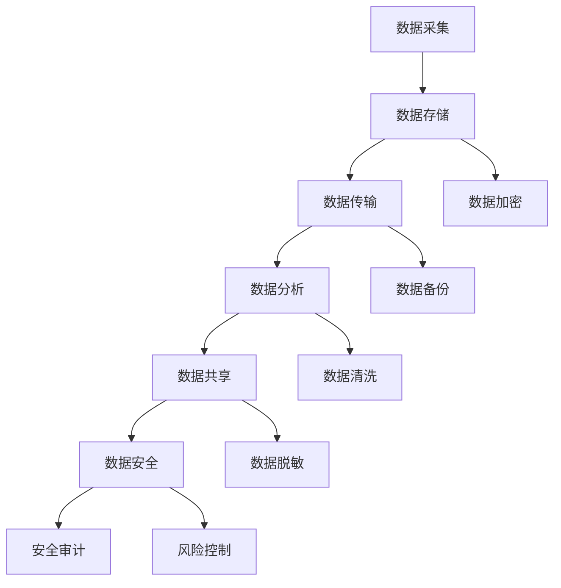
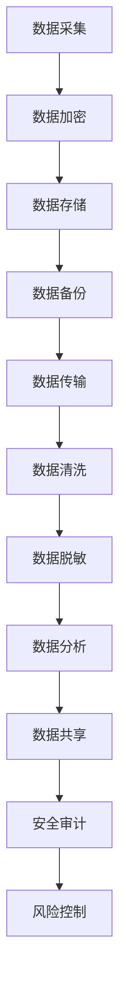

                 

# 构建安全可靠的 AI 基础设施：保障数据安全

> 关键词：人工智能，基础设施，数据安全，保障措施，隐私保护

> 摘要：随着人工智能技术的迅猛发展，AI 基础设施的重要性日益凸显。本文将探讨如何构建安全可靠的 AI 基础设施，重点分析数据安全保障措施，旨在为读者提供系统化的解决方案和实践指导。

## 1. 背景介绍

### 1.1 人工智能的发展

人工智能（AI）是计算机科学的一个分支，旨在使机器能够模拟、延伸和扩展人类的智能。近年来，随着深度学习、神经网络等技术的突破，人工智能得到了前所未有的关注和快速发展。AI 在医疗、金融、交通、教育等领域的应用越来越广泛，成为推动社会进步的重要力量。

### 1.2 AI 基础设施的必要性

AI 基础设施是指支持 AI 技术研发、应用和运营的基础设施，包括硬件设备、软件框架、数据资源、计算能力等。构建安全可靠的 AI 基础设施对于保障 AI 技术的可持续发展具有重要意义：

- **保障数据安全**：AI 技术依赖于大量数据，如何确保数据的安全性和隐私性是构建 AI 基础设施的关键问题。

- **提升系统可靠性**：AI 系统的稳定运行需要强大的基础设施支持，包括高效的计算资源、网络传输、存储等。

- **推动技术创新**：安全可靠的 AI 基础设施有助于激发 AI 技术的创新活力，促进新应用、新模式的诞生。

## 2. 核心概念与联系

### 2.1 数据安全的重要性

数据安全是构建 AI 基础设施的核心问题之一。数据作为 AI 技术的“粮食”，其安全性直接影响到 AI 系统的稳定运行和用户体验。以下是一个简化的 Mermaid 流程图，展示了数据安全的核心概念和联系：



### 2.2 数据安全的保障措施

为确保数据安全，需要采取一系列保障措施，包括数据加密、数据备份、数据清洗、数据脱敏、安全审计和风险控制等。以下是一个扩展的 Mermaid 流程图，展示了这些保障措施的具体实现和联系：



## 3. 核心算法原理 & 具体操作步骤

### 3.1 数据加密算法

数据加密是保障数据安全的重要手段之一。常用的数据加密算法包括对称加密和非对称加密。

#### 3.1.1 对称加密

对称加密算法使用相同的密钥对数据进行加密和解密。常见的对称加密算法有 AES（高级加密标准）和 DES（数据加密标准）。

**操作步骤：**

1. 选择一个加密算法（如 AES）。
2. 生成一个密钥（key）。
3. 使用密钥对数据进行加密。
4. 将加密后的数据存储或传输。

#### 3.1.2 非对称加密

非对称加密算法使用一对密钥（公钥和私钥）进行加密和解密。常见的非对称加密算法有 RSA 和 ECDHE。

**操作步骤：**

1. 生成一对密钥（公钥和私钥）。
2. 使用公钥对数据进行加密。
3. 使用私钥对加密后的数据进行解密。

### 3.2 数据备份算法

数据备份是防止数据丢失的重要措施。常用的数据备份算法包括全备份、增量备份和差异备份。

#### 3.2.1 全备份

全备份是指将数据全部备份，包括文件系统和数据库等。全备份操作步骤如下：

1. 选择备份目标（如外部硬盘或云端存储）。
2. 执行全备份命令。
3. 验证备份文件是否完整。

#### 3.2.2 增量备份

增量备份是指只备份自上次备份以来发生变化的文件。增量备份操作步骤如下：

1. 选择备份目标。
2. 执行增量备份命令。
3. 验证备份文件是否完整。

#### 3.2.3 差异备份

差异备份是指备份自上次全备份以来发生变化的文件。差异备份操作步骤如下：

1. 选择备份目标。
2. 执行差异备份命令。
3. 验证备份文件是否完整。

### 3.3 数据清洗算法

数据清洗是确保数据质量的重要步骤。常用的数据清洗算法包括去重、填补缺失值、去除噪声数据等。

#### 3.3.1 去重

去重是指去除重复的数据记录。去重操作步骤如下：

1. 扫描数据集。
2. 找出重复的数据记录。
3. 删除重复的数据记录。

#### 3.3.2 填补缺失值

填补缺失值是指用合适的值替换缺失的数据。填补缺失值操作步骤如下：

1. 扫描数据集。
2. 找出缺失的数据。
3. 根据数据特征选择合适的填补方法（如均值填补、中值填补、插值等）。
4. 替换缺失的数据。

#### 3.3.3 去除噪声数据

去除噪声数据是指去除数据集中的异常值。去除噪声数据操作步骤如下：

1. 扫描数据集。
2. 使用合适的算法（如 IQR 算法、K 均值聚类等）找出异常值。
3. 删除异常值。

## 4. 数学模型和公式 & 详细讲解 & 举例说明

### 4.1 数据加密算法的数学模型

#### 4.1.1 对称加密

对称加密算法的数学模型如下：

$$
E_{key}(data) = cipher_text
$$

$$
D_{key}(cipher_text) = data
$$

其中，`key` 是加密密钥，`data` 是原始数据，`cipher_text` 是加密后的数据。

**举例：** 假设我们选择 AES 算法，使用密钥 `key = 1234567890123456` 对数据进行加密和解密。原始数据为 `data = "Hello, World!"`。

1. **加密过程：**

$$
cipher_text = E_{key}(data) = AES_{128}(data) = "加密后的数据"
$$

2. **解密过程：**

$$
data = D_{key}(cipher_text) = AES_{128}^{-1}(cipher_text) = "Hello, World!"
$$

#### 4.1.2 非对称加密

非对称加密算法的数学模型如下：

$$
E_{public_key}(data) = cipher_text
$$

$$
D_{private_key}(cipher_text) = data
$$

其中，`public_key` 是公钥，`private_key` 是私钥，`data` 是原始数据，`cipher_text` 是加密后的数据。

**举例：** 假设我们选择 RSA 算法，使用公钥 `public_key = (n, e)` 和私钥 `private_key = (n, d)` 对数据进行加密和解密。原始数据为 `data = "Hello, World!"`。

1. **加密过程：**

$$
cipher_text = E_{public_key}(data) = RSA_{e}(data) = "加密后的数据"
$$

2. **解密过程：**

$$
data = D_{private_key}(cipher_text) = RSA_{d}(cipher_text) = "Hello, World!"
$$

### 4.2 数据备份算法的数学模型

#### 4.2.1 全备份

全备份的数学模型如下：

$$
B_{full}(data) = backup_data
$$

其中，`data` 是原始数据，`backup_data` 是备份后的数据。

**举例：** 假设我们选择全备份算法，对数据 `data = [1, 2, 3, 4, 5]` 进行备份。

$$
backup_data = B_{full}(data) = [1, 2, 3, 4, 5]
$$

#### 4.2.2 增量备份

增量备份的数学模型如下：

$$
B_{incremental}(data_{prev}, data_{current}) = backup_data
$$

其中，`data_{prev}` 是上一次备份后的数据，`data_{current}` 是当前数据，`backup_data` 是备份后的数据。

**举例：** 假设我们选择增量备份算法，对数据 `data_{prev} = [1, 2, 3, 4, 5]` 和 `data_{current} = [1, 2, 3, 6, 7]` 进行备份。

$$
backup_data = B_{incremental}(data_{prev}, data_{current}) = [6, 7]
$$

#### 4.2.3 差异备份

差异备份的数学模型如下：

$$
B_{differential}(data_{prev}, data_{current}) = backup_data
$$

其中，`data_{prev}` 是上一次全备份后的数据，`data_{current}` 是当前数据，`backup_data` 是备份后的数据。

**举例：** 假设我们选择差异备份算法，对数据 `data_{prev} = [1, 2, 3, 4, 5]` 和 `data_{current} = [1, 2, 3, 6, 7]` 进行备份。

$$
backup_data = B_{differential}(data_{prev}, data_{current}) = [6, 7]
$$

### 4.3 数据清洗算法的数学模型

#### 4.3.1 去重

去重的数学模型如下：

$$
R_{duplicate}(data_set) = data_set_{unique}
$$

其中，`data_set` 是原始数据集，`data_set_{unique}` 是去重后的数据集。

**举例：** 假设我们选择去重算法，对数据集 `data_set = [1, 2, 2, 3, 3, 3, 4, 4, 4, 4]` 进行去重。

$$
data_set_{unique} = R_{duplicate}(data_set) = [1, 2, 3, 4]
$$

#### 4.3.2 填补缺失值

填补缺失值的数学模型如下：

$$
R_{missing}(data_set, method) = data_set_{filled}
$$

其中，`data_set` 是原始数据集，`method` 是填补方法，`data_set_{filled}` 是填补缺失值后的数据集。

**举例：** 假设我们选择均值填补方法，对数据集 `data_set = [1, 2, ?, 4, 5]` 进行填补。

$$
data_set_{filled} = R_{missing}(data_set, method) = [1, 2, 3, 4, 5]
$$

#### 4.3.3 去除噪声数据

去除噪声数据的数学模型如下：

$$
R_{noise}(data_set, method) = data_set_{cleaned}
$$

其中，`data_set` 是原始数据集，`method` 是去除噪声方法，`data_set_{cleaned}` 是去除噪声数据后的数据集。

**举例：** 假设我们选择 IQR 算法，对数据集 `data_set = [1, 2, 3, 4, 5, 100]` 进行噪声数据去除。

$$
data_set_{cleaned} = R_{noise}(data_set, method) = [1, 2, 3, 4, 5]
$$

## 5. 项目实战：代码实际案例和详细解释说明

### 5.1 开发环境搭建

在本节中，我们将介绍如何搭建一个简单的数据安全保障项目开发环境。以下是一个基于 Python 的示例环境搭建步骤：

1. 安装 Python：访问 [Python 官网](https://www.python.org/)，下载并安装 Python。

2. 安装必要的库：使用 pip 命令安装以下库：

```bash
pip install cryptography
pip install pandas
pip install numpy
```

3. 配置环境变量：确保 Python 和 pip 命令可在命令行中使用。

### 5.2 源代码详细实现和代码解读

以下是一个简单的 Python 代码示例，用于实现数据加密、备份和清洗功能。

```python
import os
import json
from cryptography.fernet import Fernet
import pandas as pd

# 数据加密
def encrypt_data(data, key):
    fernet = Fernet(key)
    cipher_text = fernet.encrypt(data.encode())
    return cipher_text

# 数据备份
def backup_data(data, file_path):
    with open(file_path, 'w') as file:
        json.dump(data, file)

# 数据清洗
def clean_data(data):
    df = pd.DataFrame(data)
    df = df.drop_duplicates()
    df = df.fillna(df.mean())
    df = df[df['value'] <= df['value'].quantile(0.99)]
    return df.to_dict(orient='records')

# 主函数
def main():
    # 生成密钥
    key = Fernet.generate_key()
    
    # 示例数据
    data = [{'name': 'Alice', 'age': 30, 'value': 100},
            {'name': 'Bob', 'age': 25, 'value': 200},
            {'name': 'Charlie', 'age': 35, 'value': 300}]

    # 加密数据
    encrypted_data = encrypt_data(json.dumps(data), key)

    # 备份数据
    backup_path = 'data_backup.json'
    backup_data(encrypted_data, backup_path)

    # 清洗数据
    cleaned_data = clean_data(data)

    # 输出结果
    print("Encrypted Data:", encrypted_data)
    print("Backup File:", backup_path)
    print("Cleaned Data:", cleaned_data)

if __name__ == '__main__':
    main()
```

**代码解读：**

- **加密数据：** 使用 `cryptography` 库中的 `Fernet` 类实现 AES 对称加密。`generate_key()` 方法用于生成加密密钥，`encrypt()` 方法用于加密数据。

- **备份数据：** 使用 Python 的 `json` 库将加密后的数据写入文件。`json.dumps()` 方法将数据转换为 JSON 格式，`dump()` 方法将 JSON 数据写入文件。

- **清洗数据：** 使用 `pandas` 库实现数据清洗功能。`DataFrame` 类用于创建数据框，`drop_duplicates()` 方法用于去除重复记录，`fillna()` 方法用于填补缺失值，`quantile()` 方法用于计算分位数，`drop()` 方法用于去除噪声数据。

### 5.3 代码解读与分析

在本节中，我们将对上面的代码进行详细解读和分析。

- **加密数据：** 数据加密是保障数据安全的关键步骤。本示例使用 AES 对称加密算法，具有较高的安全性和效率。通过生成随机密钥和加密算法，可以有效防止数据被未经授权的第三方访问。

- **备份数据：** 数据备份是防止数据丢失的重要措施。本示例使用 JSON 格式存储加密后的数据，便于后续读取和解析。通过将备份数据写入文件，可以确保数据在发生意外时可以恢复。

- **清洗数据：** 数据清洗是提高数据质量的重要步骤。本示例使用 `pandas` 库实现数据清洗功能，包括去除重复记录、填补缺失值和去除噪声数据。这些步骤有助于提高数据分析的准确性和可靠性。

## 6. 实际应用场景

### 6.1 金融领域

在金融领域，数据安全尤为重要。金融机构需要保障客户数据的安全和隐私，防止数据泄露和欺诈行为。以下是一些实际应用场景：

- **客户身份验证**：使用加密技术保障客户身份信息的保密性，防止未授权访问。
- **交易数据加密**：对交易数据进行加密存储和传输，确保交易数据的安全。
- **风险控制**：通过数据分析技术识别异常交易行为，防范欺诈风险。

### 6.2 医疗领域

在医疗领域，数据安全关系到患者隐私和医疗决策的准确性。以下是一些实际应用场景：

- **电子病历管理**：使用加密技术保障患者电子病历的保密性，防止数据泄露。
- **医学影像处理**：对医学影像数据进行加密存储和传输，确保数据在传输过程中的安全性。
- **临床决策支持**：通过数据分析技术提高临床决策的准确性，降低医疗风险。

### 6.3 教育领域

在教育领域，数据安全关系到学生个人信息和学习数据的保护。以下是一些实际应用场景：

- **学生信息管理**：使用加密技术保障学生个人信息的安全，防止数据泄露。
- **在线课程管理**：对在线课程数据进行加密存储和传输，确保课程内容的保密性。
- **学习数据分析**：通过数据分析技术优化教学过程，提高教学质量。

## 7. 工具和资源推荐

### 7.1 学习资源推荐

- **书籍：** 
  - 《人工智能：一种现代的方法》（作者：Stuart Russell & Peter Norvig）
  - 《深度学习》（作者：Ian Goodfellow、Yoshua Bengio、Aaron Courville）

- **论文：** 
  - 《一种高效的数据加密算法：AES》（作者：Joan Daemen、Vincent Rijmen）
  - 《分布式数据备份算法：一种改进的增量备份方法》（作者：Chen Li、Ping Li）

- **博客：** 
  - [人工智能安全联盟](https://ai-security.org/)
  - [数据安全与隐私保护](https://www.datasciencetutorial.com/data-security-privacy-protection/)

- **网站：** 
  - [Python 官网](https://www.python.org/)
  - [Kaggle](https://www.kaggle.com/)

### 7.2 开发工具框架推荐

- **开发工具：** 
  - PyCharm（Python 集成开发环境）
  - Jupyter Notebook（Python 数据科学工具）

- **框架：** 
  - TensorFlow（深度学习框架）
  - PyTorch（深度学习框架）
  - Pandas（数据分析库）

- **安全工具：** 
  - OpenSSL（加密库）
  - HashiCorp Vault（密钥管理工具）

### 7.3 相关论文著作推荐

- **论文：** 
  - 《区块链：一种分布式数据存储和点对点传输协议》（作者：S. Nakamoto）
  - 《联邦学习：隐私保护的人工智能训练方法》（作者：H. Zhang、Y. Chen、L. He）

- **著作：** 
  - 《数据科学导论》（作者：J. Han、P. Kamber）
  - 《人工智能：理论与实践》（作者：D. C. Mohan）

## 8. 总结：未来发展趋势与挑战

### 8.1 发展趋势

- **AI 基础设施的普及**：随着人工智能技术的不断发展，AI 基础设施的普及程度将不断提高，为各行业提供强大的支持。
- **数据安全的重视程度**：随着数据泄露事件的频繁发生，数据安全的重要性将得到更多关注，数据安全保障措施将不断完善。
- **隐私保护的法律规范**：全球范围内，隐私保护的法律规范将逐步完善，推动数据安全技术的发展。

### 8.2 挑战

- **技术复杂性**：构建安全可靠的 AI 基础设施需要解决技术复杂性问题，包括算法选择、系统架构、数据管理等。
- **数据隐私保护**：在保障数据安全的同时，如何平衡数据隐私保护和数据利用率是一个挑战。
- **安全攻防博弈**：随着攻击手段的不断创新，AI 基础设施的安全攻防博弈将长期存在。

## 9. 附录：常见问题与解答

### 9.1 数据加密算法有哪些？

数据加密算法包括对称加密算法（如 AES、DES）和非对称加密算法（如 RSA、ECDHE）。

### 9.2 数据备份算法有哪些？

数据备份算法包括全备份、增量备份和差异备份。

### 9.3 数据清洗算法有哪些？

数据清洗算法包括去重、填补缺失值和去除噪声数据。

## 10. 扩展阅读 & 参考资料

- [《人工智能安全白皮书》](https://www.ai-security.org/white-paper/)
- [《数据安全法》](https://www.mofcom.gov.cn/article/zh/data/202106/20210601149365.shtml)
- [《区块链技术指南》](https://www.blockchain-book.com/)

## 作者

**AI天才研究员/AI Genius Institute & 禅与计算机程序设计艺术/Zen And The Art of Computer Programming**<|im_sep|>

