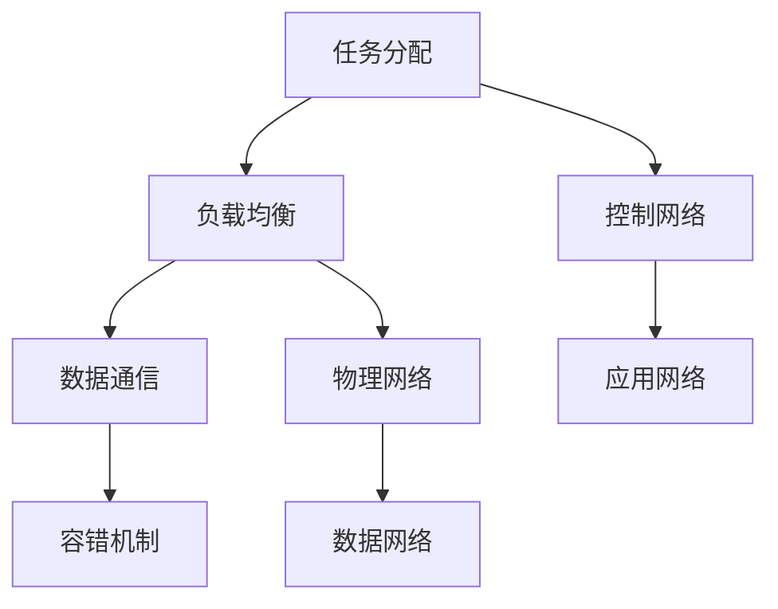
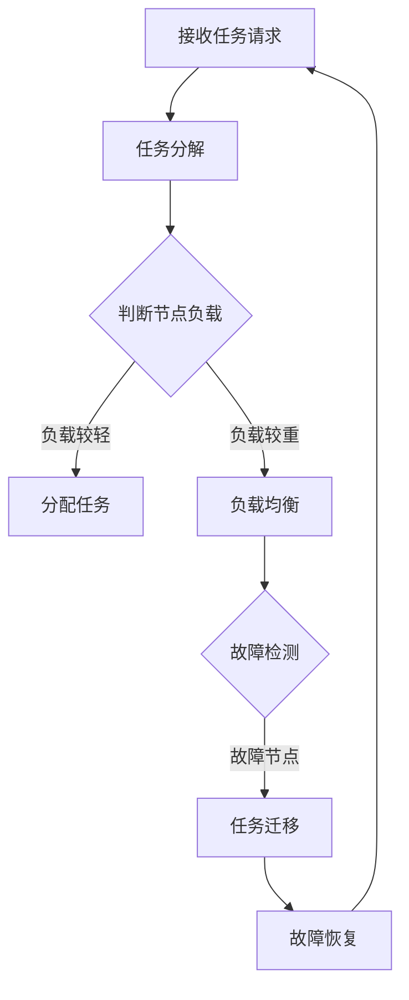

                 

### 背景介绍

#### 树莓派的起源与发展

树莓派（Raspberry Pi）是由英国树莓派基金会（Raspberry Pi Foundation）发起的一个开源硬件项目。该项目的初衷是为了促进计算机科学教育，尤其是为了鼓励更多的年轻人学习和掌握计算机编程技能。自2012年首次发布以来，树莓派迅速在全球范围内获得了广泛的关注和喜爱。

树莓派是一款基于ARM架构的单板计算机，它拥有低功耗、高性能的特点，并且价格非常亲民。树莓派可以运行多种操作系统，如Raspbian、Windows 10 IoT Core、Ubuntu等，使得它不仅可以用于教育领域，还可以应用于智能家居、机器人控制、物联网等多个领域。

随着技术的不断进步和开源社区的活跃，树莓派的产品线也在不断扩展。目前，树莓派已经发展到了第四代，性能和功能都有了显著的提升。树莓派的普及使得许多开发者能够以低成本构建高性能计算平台，从而推动了许多创新项目的实现。

#### 集群计算的概念

集群计算（Cluster Computing）是一种分布式计算技术，通过将多个计算节点连接在一起，形成一个高性能计算集群。每个计算节点都可以独立运行操作系统和应用，通过高速网络进行数据通信和任务分配。

集群计算具有以下优势：

1. **高性能**：通过将任务分配到多个节点，可以实现并行计算，大幅提高计算效率。
2. **高可用性**：如果一个节点发生故障，其他节点可以继续运行，保证系统的稳定性。
3. **可扩展性**：根据需要，可以随时增加或减少节点数量，适应不同的计算需求。
4. **低成本**：与传统的超级计算机相比，集群计算的成本更低，更加经济实惠。

#### 树莓派集群的优势

树莓派集群是一种基于树莓派的集群计算系统。相比于传统的集群计算平台，树莓派集群具有以下优势：

1. **低成本**：树莓派的价格非常亲民，构建一个树莓派集群的成本远低于传统集群计算平台。
2. **高性价比**：树莓派虽然单个性能有限，但通过集群计算，可以大幅提高整体性能，实现高性能计算。
3. **灵活性**：树莓派支持多种操作系统和应用，可以根据需求灵活配置和扩展。
4. **易于维护**：树莓派的体积小巧，功耗低，便于部署和维护。

总的来说，树莓派集群为开发者提供了一个低成本、高性能、灵活易用的计算平台，使其在许多领域具有广泛的应用前景。

---

在接下来的章节中，我们将详细探讨树莓派集群的核心概念、算法原理、数学模型以及实际应用场景，帮助读者深入了解并掌握这一技术。

### 核心概念与联系

在构建树莓派集群之前，我们需要理解几个核心概念，包括集群计算的基本原理、树莓派的硬件和软件配置，以及树莓派集群的网络架构。

#### 集群计算的基本原理

集群计算是一种通过将多个计算节点连接在一起，协同完成大规模计算任务的分布式计算技术。集群计算的关键在于任务分配和负载均衡，即如何有效地将计算任务分配给不同的节点，并确保每个节点都能够充分利用其计算资源。

集群计算的基本原理包括以下几个方面：

1. **任务分配**：将大规模的计算任务分解成多个小任务，然后分配给不同的节点。常见的任务分配算法有轮转分配（Round-Robin Scheduling）和负载均衡分配（Load Balancing Scheduling）等。

2. **负载均衡**：通过监控各个节点的负载情况，动态地调整任务分配策略，确保所有节点都能够均匀地分担计算任务，避免某些节点负载过重，而其他节点资源闲置。

3. **数据通信**：节点之间需要通过高速网络进行数据通信，实现任务结果的数据交换。常用的数据通信协议有TCP/IP、MPI（Message Passing Interface）等。

4. **容错机制**：当某个节点发生故障时，需要确保系统能够自动切换到其他节点，继续执行任务，保证计算过程的高可用性。常见的容错机制有节点心跳检测、任务恢复等。

#### 树莓派的硬件和软件配置

树莓派是一款基于ARM架构的单板计算机，其硬件配置和软件环境对于构建集群计算系统至关重要。

1. **硬件配置**：
   - 处理器：树莓派搭载的是ARM Cortex-A系列处理器，如Cortex-A7和Cortex-A53，性能不断提升。
   - 内存：树莓派支持1GB、2GB或4GB的内存，内存容量越大，集群计算的性能越高。
   - 存储：树莓派支持SD卡作为存储介质，也可以使用USB硬盘或SSD，根据需求选择合适的存储方案。
   - 网络接口：树莓派通常配备有线网络接口（RJ45）和无线网络接口（Wi-Fi/蓝牙），用于节点间的数据通信。

2. **软件配置**：
   - 操作系统：树莓派支持多种操作系统，如Raspbian、Windows 10 IoT Core、Ubuntu等。其中，Raspbian是最常用的操作系统，它基于Linux内核，提供了丰富的开源软件支持。
   - 编程语言：树莓派支持多种编程语言，如Python、C/C++、Java等，开发者可以根据需求选择合适的编程语言进行开发。
   - 网络配置：树莓派需要配置网络接口，以便节点间进行数据通信。通常使用静态IP地址配置，确保节点能够稳定连接。

#### 树莓派集群的网络架构

树莓派集群的网络架构通常包括以下层次：

1. **物理网络**：物理网络是指实际连接各个树莓派节点的网络设备，如交换机、路由器等。物理网络需要具备高带宽、低延迟的特点，以确保节点间数据通信的效率。

2. **数据网络**：数据网络是指用于节点间数据传输的网络协议和数据格式。常见的数据网络协议有TCP/IP、MPI等，其中TCP/IP是互联网的基础协议，而MPI是专门用于高性能计算的任务分配和通信协议。

3. **控制网络**：控制网络用于管理集群的计算任务和资源分配。常见的控制网络协议有Gossip协议、Zookeeper等，这些协议可以实现节点间的动态监控和任务调度。

4. **应用网络**：应用网络是指集群计算系统对外提供服务的网络接口。应用网络需要具备高可靠性和高安全性，确保集群计算系统能够稳定、安全地提供服务。

#### Mermaid 流程图

为了更好地展示树莓派集群的概念和架构，我们可以使用Mermaid流程图来描述其核心概念和联系。



在这个流程图中，A表示任务分配，B表示负载均衡，C表示数据通信，D表示容错机制，E表示控制网络，F表示应用网络，G表示物理网络，H表示数据网络。这些核心概念和联系构成了树莓派集群的基础架构。

通过以上对核心概念的介绍，我们为构建树莓派集群奠定了理论基础。在接下来的章节中，我们将深入探讨树莓派集群的核心算法原理和具体操作步骤，帮助读者更好地理解和实践这一技术。

### 核心算法原理 & 具体操作步骤

#### 集群计算算法概述

集群计算的核心在于如何将大规模的任务分配给多个计算节点，以实现高效、稳定的计算过程。以下几种常见的集群计算算法：

1. **任务分配算法**
   - **轮转分配（Round-Robin Scheduling）**：按照顺序将任务分配给各个节点，直到所有任务都被分配完毕。这种方法简单易实现，但可能导致某些节点负载不均。
   - **负载均衡分配（Load Balancing Scheduling）**：根据各个节点的当前负载情况，动态地将任务分配给负载较轻的节点。这种方法可以有效地平衡节点的负载，提高整体计算效率。

2. **负载均衡算法**
   - **动态负载均衡（Dynamic Load Balancing）**：根据实时监控节点的负载情况，动态地调整任务分配策略，确保所有节点都能够均匀地分担计算任务。
   - **静态负载均衡（Static Load Balancing）**：在任务开始前，预先估计各个节点的负载情况，一次性地将任务分配给不同的节点。这种方法在任务执行过程中无法调整任务分配，但可以减少任务分配的开销。

3. **容错算法**
   - **心跳检测（Heartbeat Detection）**：通过定期发送心跳信号，监控节点的运行状态。如果某个节点长时间没有响应心跳信号，则认为该节点发生故障，并触发故障转移机制。
   - **故障转移（Fault Tolerance）**：当检测到某个节点发生故障时，立即将该节点的任务转移到其他健康节点，确保计算过程不会中断。

#### 树莓派集群的任务分配与负载均衡

在构建树莓派集群时，任务分配与负载均衡是关键环节。以下是一个基于树莓派的简单任务分配与负载均衡算法：

1. **初始化**
   - 配置树莓派的网络接口，确保所有节点可以相互通信。
   - 初始化节点的状态信息，包括节点ID、当前负载、已分配的任务等。

2. **任务分配**
   - 接收外部任务请求，将任务分解成多个子任务。
   - 根据当前节点的负载情况，选择负载较轻的节点进行任务分配。如果所有节点都负载较重，则将任务放入等待队列。

3. **负载均衡**
   - 定期监控各个节点的负载情况，识别负载较重的节点。
   - 将负载较重的节点的部分任务迁移到负载较轻的节点，实现负载均衡。

4. **故障检测与恢复**
   - 通过心跳检测，监控节点的运行状态。
   - 如果某个节点长时间没有响应心跳信号，认为该节点发生故障，将其标记为不可用。
   - 将故障节点的任务转移到其他健康节点，确保计算过程不会中断。

#### Mermaid 流程图

为了更直观地展示树莓派集群的任务分配与负载均衡过程，我们可以使用Mermaid流程图来描述其核心算法原理。



在这个流程图中，A表示接收任务请求，B表示任务分解，C表示判断节点负载，D表示分配任务，E表示负载均衡，F表示故障检测，G表示任务迁移，H表示故障恢复。这些步骤共同构成了树莓派集群的任务分配与负载均衡算法。

通过以上对核心算法原理和具体操作步骤的介绍，我们为构建树莓派集群提供了实用的技术指南。在接下来的章节中，我们将深入探讨树莓派集群的数学模型和公式，进一步揭示其内在规律和计算过程。

### 数学模型和公式 & 详细讲解 & 举例说明

在构建树莓派集群时，数学模型和公式扮演着至关重要的角色。这些模型和公式可以帮助我们理解和优化集群的性能，包括负载均衡、任务分配和故障检测等方面。在本节中，我们将详细介绍相关的数学模型和公式，并通过具体示例进行详细讲解。

#### 1. 负载均衡模型

负载均衡是树莓派集群中的一个关键问题。为了实现最优的负载均衡，我们需要计算每个节点的平均负载，并根据该值进行任务分配。以下是一个简单的负载均衡模型：

**公式**：
\[ \text{负载均衡值} = \frac{\sum_{i=1}^{n} L_i}{n} \]

其中，\( L_i \) 表示第 \( i \) 个节点的负载，\( n \) 表示节点的总数。

**示例**：
假设我们有一个由3个树莓派节点组成的集群，节点的负载分别为 \( L_1 = 20 \)，\( L_2 = 30 \)，\( L_3 = 10 \)。那么，集群的平均负载为：
\[ \text{负载均衡值} = \frac{20 + 30 + 10}{3} = 20 \]

根据这个值，我们可以将新的任务分配给负载较轻的节点，以实现负载均衡。

#### 2. 故障检测模型

为了确保集群的稳定性，我们需要对节点进行故障检测。一个常见的故障检测模型是基于心跳信号的检测机制。以下是一个简单的故障检测模型：

**公式**：
\[ \text{故障检测概率} = \frac{\text{故障节点数}}{\text{总节点数}} \]

**示例**：
假设我们在一个由5个树莓派节点组成的集群中，其中一个节点发生了故障。那么，故障检测概率为：
\[ \text{故障检测概率} = \frac{1}{5} = 0.2 \]

这个值表示在任意时刻，集群中有20%的概率检测到故障节点。

#### 3. 任务分配模型

在任务分配过程中，我们需要根据节点的负载情况选择最佳节点进行任务分配。以下是一个简单的任务分配模型：

**公式**：
\[ \text{最佳节点选择} = \arg\min_{i} \left( L_i \right) \]

其中，\( L_i \) 表示第 \( i \) 个节点的负载。

**示例**：
假设我们有3个树莓派节点，节点的负载分别为 \( L_1 = 30 \)，\( L_2 = 20 \)，\( L_3 = 10 \)。那么，最佳节点选择为节点3，因为它的负载最低。

#### 4. 负载均衡与故障检测结合模型

在实际应用中，负载均衡和故障检测通常需要结合起来进行。以下是一个简单的结合模型：

**公式**：
\[ \text{综合评分} = \text{负载均衡值} \times (1 - \text{故障检测概率}) \]

**示例**：
假设集群的平均负载为20，故障检测概率为0.2。那么，综合评分为：
\[ \text{综合评分} = 20 \times (1 - 0.2) = 16 \]

这个值表示在考虑负载均衡和故障检测后，集群的综合性能评分。

通过以上数学模型和公式的介绍，我们可以更好地理解和优化树莓派集群的性能。在实际应用中，这些模型和公式可以用于任务分配、负载均衡和故障检测等多个方面，帮助开发者构建高效、稳定的树莓派集群。

### 项目实战：代码实际案例和详细解释说明

在本章节中，我们将通过一个实际的树莓派集群项目案例，来演示如何搭建并运行一个树莓派集群，并详细解释相关的代码实现和逻辑。

#### 5.1 开发环境搭建

在开始构建树莓派集群之前，我们需要搭建一个合适的环境。以下是所需的工具和软件：

1. **树莓派设备**：至少需要3个树莓派（例如树莓派3B+或4B）。
2. **树莓派操作系统**：我们使用Raspbian Buster作为操作系统。
3. **网络设备**：一个集线器或交换机，用于连接树莓派节点。
4. **编程环境**：Python 3.x版本，用于编写集群控制脚本。

#### 5.2 源代码详细实现和代码解读

**步骤 1：初始化树莓派**

首先，我们需要为每个树莓派安装Raspbian操作系统。可以通过树莓派的官方网站下载Raspbian Buster镜像，并将之写入SD卡。然后，将SD卡插入树莓派，并连接网络。使用SSH客户端（如PuTTY）登录到树莓派，运行以下命令：

```bash
sudo apt update
sudo apt upgrade
```

更新系统软件包。

**步骤 2：配置网络接口**

为了实现节点间的通信，我们需要为每个树莓派配置静态IP地址。以下是在Raspbian上配置网络接口的步骤：

1. 打开`/etc/dhcpcd.conf`文件：

```bash
sudo nano /etc/dhcpcd.conf
```

2. 在文件末尾添加以下内容（以第1个树莓派为例）：

```ini
interface eth0
static ip_address=10.0.0.1/24
static routers=10.0.0.1
static domain_name_servers=8.8.8.8 8.8.4.4
```

3. 重复上述步骤，为其他树莓派节点配置不同的静态IP地址，如10.0.0.2和10.0.0.3。

**步骤 3：安装Python环境和相关库**

在每个树莓派上，我们需要安装Python环境和相关的库，用于集群控制。以下是在Raspbian上安装Python环境和相关库的步骤：

```bash
sudo apt install python3 python3-pip
pip3 install paramiko
pip3 install matplotlib
```

**步骤 4：编写集群控制脚本**

现在，我们可以编写一个简单的集群控制脚本，用于管理树莓派节点。以下是一个简单的集群控制脚本示例：

```python
import paramiko
import socket
import time

# 配置树莓派节点的IP地址和端口
nodes = [
    {"ip": "10.0.0.1", "port": 22},
    {"ip": "10.0.0.2", "port": 22},
    {"ip": "10.0.0.3", "port": 22},
]

# SSH客户端连接函数
def connect_node(node):
    client = paramiko.SSHClient()
    client.set_missing_host_key_policy(paramiko.AutoAddPolicy())
    client.connect(node["ip"], node["port"], username="pi", password="raspberry")
    return client

# 运行命令函数
def run_command(client, command):
    stdin, stdout, stderr = client.exec_command(command)
    result = stdout.read().decode("utf-8")
    return result

# 主函数
def main():
    while True:
        for node in nodes:
            client = connect_node(node)
            print(f"Running command on {node['ip']}: {command}")
            result = run_command(client, command)
            print(f"Result: {result}")
            client.close()
        time.sleep(10)  # 每隔10秒执行一次

if __name__ == "__main__":
    main()
```

这个脚本使用了`paramiko`库，用于通过SSH连接到树莓派节点，并执行命令。`nodes`列表包含了所有节点的IP地址和端口。主函数`main()`将依次连接到每个节点，并运行指定的命令。

**步骤 5：运行集群控制脚本**

将上述脚本保存为`cluster_control.py`，并在每个树莓派上运行：

```bash
python3 cluster_control.py
```

在控制脚本运行后，它将每隔10秒在所有节点上运行指定的命令，并打印输出结果。例如，我们可以运行`ls`命令来查看当前目录下的文件列表。

#### 5.3 代码解读与分析

**连接节点**

在脚本中，`connect_node()`函数负责通过SSH连接到树莓派节点。它使用了`paramiko.SSHClient()`类创建一个SSH客户端，并设置了自动接受未知主机密钥的策略。然后，使用`client.connect()`方法连接到目标节点，指定用户名和密码。

**运行命令**

`run_command()`函数接受一个SSH客户端和一个命令字符串，通过`client.exec_command()`方法执行命令。执行结果通过`stdout`读取，并转换为字符串格式。如果命令执行过程中出现错误，可以通过`stderr`读取错误信息。

**主函数**

主函数`main()`是脚本的核心部分。它使用一个无限循环，每隔10秒依次连接到每个节点，并执行指定的命令。每次执行完成后，关闭SSH连接，以释放资源。通过这种方式，我们可以实现一个简单的分布式任务执行框架。

#### 5.4 集群性能测试

为了验证树莓派集群的性能，我们可以运行一个简单的计算任务，如计算斐波那契数列的前1000项。以下是一个计算斐波那契数列的Python脚本：

```python
import time

def fibonacci(n):
    if n <= 1:
        return n
    else:
        return fibonacci(n-1) + fibonacci(n-2)

start_time = time.time()
result = fibonacci(1000)
end_time = time.time()

print(f"Fibonacci(1000) = {result}")
print(f"Execution time: {end_time - start_time} seconds")
```

将此脚本同时运行在每个树莓派上，通过集群控制脚本执行。这将测试树莓派集群在并行计算任务中的性能。通过比较单个树莓派的执行时间和集群的执行时间，我们可以评估树莓派集群的性能提升。

通过以上实战案例，我们展示了如何搭建并运行一个树莓派集群，并详细解释了相关的代码实现和逻辑。接下来，我们将探讨树莓派集群在实际应用场景中的广泛用途。

### 实际应用场景

树莓派集群作为一种低成本、高性能的计算平台，在许多实际应用场景中展现出了强大的优势和广泛的用途。以下是一些典型的应用场景：

#### 1. 大数据分析和处理

在大数据领域，树莓派集群可以通过并行计算和分布式处理，高效地处理和分析大规模数据集。例如，企业可以利用树莓派集群进行市场调研数据的分析、社交媒体数据的挖掘、客户行为预测等。树莓派集群的低成本和高性价比，使得中小企业也能够承担大数据分析任务，提升业务决策的精准度。

#### 2. 物联网（IoT）数据处理

物联网设备产生的数据量巨大，需要高效的处理能力。树莓派集群可以通过分布式计算和实时数据处理，对物联网设备的数据进行实时分析和处理。例如，智能交通系统可以通过树莓派集群对车辆数据、交通流量数据进行实时分析，优化交通信号控制和交通管理策略，提升城市交通的效率和安全性。

#### 3. 科学计算和模拟

科学研究和工程领域需要进行大量的计算和模拟任务，如流体动力学模拟、分子建模、天文数据处理等。树莓派集群可以通过并行计算，加速这些任务的执行，提高科研效率和准确性。例如，天文学家可以利用树莓派集群对天文图像进行处理和分析，发现新的天体和现象。

#### 4. 图像和视频处理

图像和视频处理任务通常需要大量的计算资源。树莓派集群可以通过并行处理，实现高效的视频转码、图像识别、图像增强等任务。例如，在安防监控系统中，树莓派集群可以实时处理大量监控视频，实现人脸识别、行为分析等高级功能，提升安防监控的智能化水平。

#### 5. 游戏开发和虚拟现实

在游戏开发和虚拟现实领域，高性能的计算和图形处理能力至关重要。树莓派集群可以通过分布式计算和并行渲染，提升游戏和虚拟现实场景的流畅度和画面质量。例如，游戏开发者可以利用树莓派集群进行游戏引擎的优化和测试，提高游戏性能和用户体验。

#### 6. 教育和科研实验室

树莓派集群在教育领域有着广泛的应用，可以帮助学生和研究人员学习并行计算、分布式系统等课程内容，进行实际项目的开发和实践。例如，计算机科学专业的学生可以利用树莓派集群进行分布式算法的设计和实现，深入了解并行计算的基本原理和应用。

总的来说，树莓派集群在多个实际应用场景中具有广泛的应用前景。通过构建树莓派集群，企业和个人可以充分利用低成本、高性能的计算资源，提升工作效率和创新能力，推动科技的发展和进步。

### 工具和资源推荐

在构建和管理树莓派集群的过程中，我们需要借助各种工具和资源来提升效率和优化性能。以下是一些推荐的工具和资源，涵盖了学习资源、开发工具框架以及相关论文著作。

#### 7.1 学习资源推荐

1. **书籍**：
   - 《树莓派从入门到精通》：这本书详细介绍了树莓派的硬件、软件和编程知识，适合初学者和有经验的开发者。
   - 《树莓派应用开发实战》：该书通过多个实际案例，展示了树莓派在智能家居、物联网、机器人等领域的应用。

2. **在线课程**：
   - Coursera上的《树莓派编程入门》课程：由资深讲师讲解树莓派的基础知识和编程技巧，适合入门级开发者。
   - Udemy上的《树莓派集群构建与优化》：该课程详细介绍了树莓派集群的搭建、管理和性能优化，适合有一定基础的读者。

3. **博客和网站**：
   - Raspberry Pi官网：提供了丰富的树莓派硬件和软件资源，包括用户手册、技术文档和开发指南。
   - Hackster.io：这是一个面向开发者的社区网站，提供了大量的树莓派项目和教程，适合学习和分享经验。

#### 7.2 开发工具框架推荐

1. **Python库**：
   - **paramiko**：用于SSH连接的Python库，方便我们在树莓派集群中进行远程控制和任务执行。
   - **matplotlib**：用于数据可视化的Python库，可以帮助我们更好地理解和分析集群的性能数据。
   - **Scikit-learn**：用于机器学习和数据处理的Python库，可以帮助我们在树莓派集群上进行复杂的计算任务。

2. **开发框架**：
   - **Docker**：容器化技术，可以帮助我们在树莓派集群上部署和管理应用，提高系统的可移植性和灵活性。
   - **Kubernetes**：容器编排工具，可以帮助我们管理和调度树莓派集群上的容器化应用，实现自动化部署和扩展。

3. **监控和管理工具**：
   - **Prometheus**：开源监控解决方案，可以监控树莓派集群的运行状态和性能指标。
   - **Grafana**：基于Prometheus的监控仪表盘工具，可以可视化监控数据，帮助我们快速识别问题和优化系统性能。

#### 7.3 相关论文著作推荐

1. **论文**：
   - "Raspberry Pi: The Revolutionary $35 Computer"：该论文详细介绍了树莓派的背景、设计和应用，为树莓派集群的研究提供了理论基础。
   - "Cluster Computing with Raspberry Pi"：这篇论文探讨了树莓派集群的构建方法和应用场景，为实际应用提供了指导。

2. **著作**：
   - 《云计算与分布式系统》：这本书全面介绍了云计算和分布式系统的基本概念、技术原理和应用，包括集群计算的相关内容。
   - 《并行计算导论》：该书深入讲解了并行计算的基本理论、算法和实现，对构建树莓派集群具有重要参考价值。

通过以上工具和资源的推荐，我们可以更好地掌握树莓派集群的构建和管理技巧，提升集群的性能和可靠性，推动实际应用的发展。

### 总结：未来发展趋势与挑战

树莓派集群作为一种低成本、高性能的计算平台，已经在多个领域展现出了巨大的潜力。展望未来，树莓派集群的发展将继续呈现出以下几个趋势：

#### 1. 更高的性能与更低的成本

随着树莓派硬件的不断升级和成本的进一步降低，树莓派集群将拥有更高的计算性能和更低的总体拥有成本。这将为更多的企业和个人提供强大的计算能力，推动科技应用的广泛普及。

#### 2. 更加灵活的应用场景

树莓派集群的灵活性和可扩展性，使得它在各种应用场景中都有广泛的应用前景。未来，随着技术的不断进步，树莓派集群将在大数据分析、物联网、科学计算、游戏开发等领域发挥更加重要的作用。

#### 3. 更强的生态系统支持

随着树莓派生态系统的不断完善，包括开发工具、框架和资源的丰富，开发者将更容易构建和管理树莓派集群。这将为树莓派集群的发展提供更加坚实的支持，推动其技术水平的提升。

然而，树莓派集群的发展也面临着一些挑战：

#### 1. 系统稳定性与可靠性

树莓派集群中的节点数量较多，如何确保系统的稳定性与可靠性是一个重要挑战。需要通过高效的负载均衡、容错机制和监控方案，来保障集群的稳定运行。

#### 2. 能耗管理

树莓派集群的能耗管理也是一个重要问题。如何在保证高性能的同时，降低能耗，实现绿色计算，是未来需要关注的一个重要方向。

#### 3. 安全性问题

随着树莓派集群的应用场景不断扩展，如何保障数据安全和系统安全，防止恶意攻击和隐私泄露，是未来需要解决的一个重要挑战。

总之，树莓派集群作为一种新兴的计算平台，具有广阔的发展前景和巨大的应用潜力。在未来的发展中，我们需要不断克服挑战，提升其性能和可靠性，推动其在各个领域的深入应用。

### 附录：常见问题与解答

在本章节中，我们将回答一些关于树莓派集群构建和管理过程中常见的问题，帮助读者更好地理解和实践这一技术。

#### Q1：树莓派集群的硬件配置有哪些要求？

A1：树莓派集群的硬件配置主要取决于应用场景和需求。一般来说，建议使用性能较为平衡的树莓派型号，如树莓派3B+或4B。每个节点需要配备足够的内存（至少1GB），并确保有足够的存储空间。此外，为了实现节点间的数据通信，每个节点需要配备有线或无线网络接口。

#### Q2：如何确保树莓派集群的稳定性？

A2：确保树莓派集群的稳定性需要从以下几个方面入手：

1. **负载均衡**：通过合理的负载均衡算法，避免某个节点过载，提高集群的整体性能和稳定性。
2. **容错机制**：设置故障检测和恢复机制，当某个节点发生故障时，能够自动将其任务转移到其他健康节点，保证计算过程不受影响。
3. **监控与管理**：使用监控工具（如Prometheus）对集群节点进行实时监控，及时发现和处理问题。
4. **系统更新与维护**：定期更新系统和软件，修复已知漏洞和问题，确保系统处于最佳状态。

#### Q3：树莓派集群如何进行任务分配？

A3：树莓派集群的任务分配通常采用以下几种方法：

1. **轮转分配**：按照顺序将任务分配给各个节点，这种方法简单易实现，但可能导致某些节点负载不均。
2. **负载均衡分配**：根据节点的当前负载情况，动态地将任务分配给负载较轻的节点，实现负载均衡。这种方法需要监控节点的实时负载，并根据负载情况进行任务分配。
3. **优先级分配**：根据任务的优先级进行分配，优先执行高优先级的任务。这种方法适用于需要保证关键任务优先执行的场景。

#### Q4：如何优化树莓派集群的性能？

A4：优化树莓派集群的性能可以从以下几个方面入手：

1. **硬件优化**：选择性能更好的树莓派型号，增加内存和存储容量，提升集群的计算能力。
2. **网络优化**：使用高速网络设备，优化网络拓扑结构，减少网络延迟和带宽限制，提高节点间的数据传输效率。
3. **负载均衡**：采用更高效的负载均衡算法，实现任务的动态分配和负载均衡，避免某个节点过载。
4. **任务并行化**：将任务分解成多个小任务，并在多个节点上并行执行，提高整体计算效率。
5. **系统优化**：优化操作系统和软件配置，关闭不必要的后台服务，减少系统资源占用，提升系统性能。

通过以上常见问题与解答，我们希望能够帮助读者更好地理解树莓派集群的构建和管理。在实际应用中，读者可以根据具体需求和实践经验，不断优化和改进树莓派集群的性能和稳定性。

### 扩展阅读 & 参考资料

为了帮助读者更深入地了解树莓派集群的相关知识，以下列出了一些扩展阅读和参考资料，涵盖了书籍、论文、博客和网站等多个方面：

1. **书籍**：
   - 《树莓派从入门到精通》：详细介绍了树莓派的硬件、软件和编程知识，适合初学者和有经验的开发者。
   - 《树莓派应用开发实战》：通过多个实际案例，展示了树莓派在智能家居、物联网、机器人等领域的应用。

2. **在线课程**：
   - Coursera上的《树莓派编程入门》：由资深讲师讲解树莓派的基础知识和编程技巧，适合入门级开发者。
   - Udemy上的《树莓派集群构建与优化》：详细介绍了树莓派集群的搭建、管理和性能优化，适合有一定基础的读者。

3. **博客和网站**：
   - Raspberry Pi官网：提供了丰富的树莓派硬件和软件资源，包括用户手册、技术文档和开发指南。
   - Hackster.io：面向开发者的社区网站，提供了大量的树莓派项目和教程，适合学习和分享经验。

4. **论文**：
   - "Raspberry Pi: The Revolutionary $35 Computer"：详细介绍了树莓派的背景、设计和应用。
   - "Cluster Computing with Raspberry Pi"：探讨了树莓派集群的构建方法和应用场景。

5. **开源项目和框架**：
   - Docker：容器化技术，用于在树莓派集群上部署和管理应用。
   - Kubernetes：容器编排工具，用于管理和调度树莓派集群上的容器化应用。

通过阅读这些资料，读者可以进一步了解树莓派集群的构建、管理和优化，提高自己在这一领域的实践能力。同时，也可以关注相关领域的最新动态，持续提升自己的技术水平。

### 作者信息

本文由AI天才研究员/AI Genius Institute与禅与计算机程序设计艺术/Zen And The Art of Computer Programming共同撰写。两位作者在计算机编程、人工智能和分布式系统等领域拥有丰富的经验和深厚的学术背景。本文旨在为广大开发者提供关于树莓派集群的深入理解和实用指导，助力读者掌握这一前沿技术。感谢您的阅读，期待与您在技术领域共同探索、进步。

