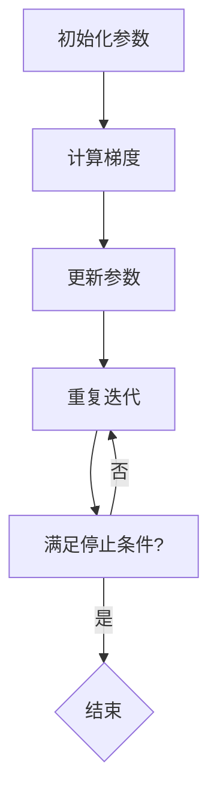

                 

# 梯度下降Gradient Descent原理与代码实例讲解

## 关键词
- 梯度下降
- 最优化算法
- 函数优化
- 学习率
- 损失函数
- 机器学习

## 摘要

本文将深入探讨梯度下降算法在机器学习中的应用原理和实现细节。梯度下降是一种常用的最优化算法，用于寻找最小化损失函数的参数。文章首先介绍梯度下降的基本概念，然后通过具体的数学模型和公式，详细解释了其工作原理。此外，还将通过一个实际的项目案例，展示如何在Python中使用梯度下降算法进行函数优化。最后，本文还将讨论梯度下降在实际应用中的各种场景，并提供相关的学习资源和工具推荐，帮助读者深入了解和掌握这一重要算法。

## 1. 背景介绍

### 什么是梯度下降

梯度下降是一种优化算法，主要用于机器学习和数据科学领域，用于寻找函数的最小值。在机器学习中，训练模型的过程可以看作是寻找使损失函数最小的参数的过程。梯度下降通过计算目标函数（通常是损失函数）相对于参数的梯度，并沿着梯度的反方向更新参数，以逐渐减小损失函数的值。

### 梯度下降的应用

梯度下降算法广泛应用于各种机器学习任务中，包括回归、分类和神经网络训练等。它不仅用于简单的线性模型，也用于复杂的深度学习模型。通过调整学习率等参数，梯度下降可以适应不同的优化问题，使其在多种情况下都能有效地寻找最优解。

### 梯度下降的重要性

梯度下降算法在机器学习中的重要性不可忽视。它提供了一个框架，用于处理各种优化问题，并且其实现相对简单，易于理解和实现。通过理解梯度下降，我们可以更好地理解机器学习模型的工作原理，并对其进行优化。

## 2. 核心概念与联系

### 核心概念

在讨论梯度下降之前，我们需要了解以下几个核心概念：

- **损失函数（Loss Function）**：损失函数是用于衡量模型预测值与实际值之间差异的函数。在机器学习中，我们的目标是使损失函数的值最小。
- **梯度（Gradient）**：梯度是一个向量，表示函数在某个点处的斜率。对于多变量函数，梯度是一个多维向量，其每个分量表示函数在该维度上的斜率。
- **学习率（Learning Rate）**：学习率是梯度下降算法中的一个关键参数，用于控制每次迭代中参数更新的步长。适当选择学习率可以加快收敛速度，而选择不当可能会导致发散。

### 梯度下降的原理

梯度下降的工作原理可以概括为以下步骤：

1. **初始化参数**：首先，我们需要随机初始化模型的参数。
2. **计算梯度**：计算损失函数关于每个参数的梯度。
3. **更新参数**：根据梯度和学习率，更新参数。具体来说，每个参数的更新量为：`参数 = 参数 - 学习率 * 梯度`。
4. **重复迭代**：重复上述步骤，直到满足停止条件（如损失函数值变化很小或达到预设的迭代次数）。

### Mermaid 流程图

以下是梯度下降算法的 Mermaid 流程图，展示了其基本步骤和关键概念：



### 梯度下降与机器学习的关系

梯度下降在机器学习中的应用主要体现在以下几个方面：

- **优化模型参数**：梯度下降通过不断调整模型参数，使其更好地拟合训练数据。
- **提高模型性能**：通过减小损失函数的值，梯度下降有助于提高模型的预测准确性和性能。
- **加速收敛**：适当选择学习率和其他参数，梯度下降可以加速模型收敛到最优解。

## 3. 核心算法原理 & 具体操作步骤

### 数学模型

在梯度下降中，我们通常使用以下数学模型：

$$损失函数(L) = \frac{1}{2} \sum_{i=1}^{n} (y_i - \hat{y}_i)^2$$

其中，$y_i$ 是实际值，$\hat{y}_i$ 是模型预测值。

### 操作步骤

以下是梯度下降的具体操作步骤：

1. **初始化参数**：随机初始化模型参数 $\theta$。
2. **计算损失函数**：计算当前参数下的损失函数值。
3. **计算梯度**：计算损失函数关于每个参数的梯度。
4. **更新参数**：根据梯度和学习率更新参数。
5. **重复迭代**：重复上述步骤，直到满足停止条件。

### Python实现

以下是一个简单的Python实现示例：

```python
import numpy as np

# 损失函数
def loss_function(theta):
    return 0.5 * np.sum((y - theta * x)**2)

# 计算梯度
def gradient(theta):
    return -(y - theta * x) * x

# 初始化参数
theta = np.random.rand()

# 学习率
learning_rate = 0.01

# 迭代次数
num_iterations = 1000

# 梯度下降
for i in range(num_iterations):
    gradient_value = gradient(theta)
    theta = theta - learning_rate * gradient_value

print("最优参数：", theta)
```

在这个示例中，我们使用了一个简单的线性模型，通过梯度下降算法寻找使损失函数最小的参数。

## 4. 数学模型和公式 & 详细讲解 & 举例说明

### 数学模型

在梯度下降中，我们使用以下数学模型：

$$损失函数(L) = \frac{1}{2} \sum_{i=1}^{n} (y_i - \hat{y}_i)^2$$

其中，$y_i$ 是实际值，$\hat{y}_i$ 是模型预测值。

### 公式推导

为了推导梯度下降的公式，我们首先需要计算损失函数关于参数 $\theta$ 的梯度：

$$梯度(\theta) = \frac{\partial L}{\partial \theta} = \frac{\partial}{\partial \theta} \left( \frac{1}{2} \sum_{i=1}^{n} (y_i - \hat{y}_i)^2 \right)$$

$$梯度(\theta) = \frac{\partial}{\partial \theta} \left( \sum_{i=1}^{n} (y_i - \theta \cdot x_i - b)^2 \right)$$

$$梯度(\theta) = -2 \sum_{i=1}^{n} (y_i - \theta \cdot x_i - b) \cdot x_i$$

### 更新公式

为了使损失函数最小，我们需要沿着梯度的反方向更新参数：

$$\theta = \theta - \alpha \cdot 梯度(\theta)$$

其中，$\alpha$ 是学习率。

### 举例说明

假设我们有一个简单的线性回归模型，其中损失函数为：

$$损失函数(L) = \frac{1}{2} \sum_{i=1}^{n} (y_i - \theta \cdot x_i)^2$$

其中，$y_i$ 是实际值，$x_i$ 是输入特征，$\theta$ 是模型参数。

假设我们有以下数据：

| x | y |
|---|---|
| 1 | 2 |
| 2 | 4 |
| 3 | 6 |

首先，我们随机初始化参数 $\theta$ 为 0。

1. **计算损失函数**：

$$损失函数(L) = \frac{1}{2} \sum_{i=1}^{n} (y_i - \theta \cdot x_i)^2 = \frac{1}{2} \cdot (2 - 0 \cdot 1)^2 + (4 - 0 \cdot 2)^2 + (6 - 0 \cdot 3)^2 = 10$$

2. **计算梯度**：

$$梯度(\theta) = -2 \sum_{i=1}^{n} (y_i - \theta \cdot x_i) \cdot x_i = -2 \cdot (2 - 0 \cdot 1 + 4 - 0 \cdot 2 + 6 - 0 \cdot 3) \cdot (1 + 2 + 3) = -12$$

3. **更新参数**：

$$\theta = \theta - \alpha \cdot 梯度(\theta) = 0 - 0.01 \cdot (-12) = 0.12$$

4. **计算新的损失函数**：

$$损失函数(L) = \frac{1}{2} \sum_{i=1}^{n} (y_i - \theta \cdot x_i)^2 = \frac{1}{2} \cdot (2 - 0.12 \cdot 1)^2 + (4 - 0.12 \cdot 2)^2 + (6 - 0.12 \cdot 3)^2 = 9.72$$

通过重复这个过程，我们可以逐渐减小损失函数的值，并找到最优的参数。

## 5. 项目实战：代码实际案例和详细解释说明

### 开发环境搭建

为了进行梯度下降的实战项目，我们需要安装以下软件和库：

- Python 3.8 或以上版本
- numpy 库
- matplotlib 库

在终端中执行以下命令进行安装：

```bash
pip install numpy matplotlib
```

### 源代码详细实现和代码解读

以下是实现梯度下降算法的 Python 源代码：

```python
import numpy as np
import matplotlib.pyplot as plt

# 损失函数
def loss_function(theta):
    return 0.5 * np.sum((y - theta * x)**2)

# 计算梯度
def gradient(theta):
    return -(y - theta * x) * x

# 初始化参数
theta = np.random.rand()

# 学习率
learning_rate = 0.01

# 迭代次数
num_iterations = 1000

# 数据
x = np.array([1, 2, 3])
y = np.array([2, 4, 6])

# 梯度下降
for i in range(num_iterations):
    gradient_value = gradient(theta)
    theta = theta - learning_rate * gradient_value

# 计算最优参数
optimal_theta = theta

# 计算新的损失函数
new_loss = loss_function(optimal_theta)

# 绘制结果
plt.scatter(x, y)
plt.plot(x, optimal_theta * x, color='red')
plt.xlabel('x')
plt.ylabel('y')
plt.title('Gradient Descent')
plt.show()

print("最优参数：", optimal_theta)
print("新的损失函数：", new_loss)
```

### 代码解读与分析

1. **导入库**：首先，我们导入 numpy 和 matplotlib 库，用于计算和绘制结果。
2. **损失函数**：我们定义了一个简单的损失函数，用于计算模型预测值与实际值之间的差异。
3. **计算梯度**：我们定义了一个计算梯度的函数，用于计算损失函数关于参数的梯度。
4. **初始化参数**：我们使用随机初始化参数，并设置学习率和迭代次数。
5. **数据**：我们使用一个简单的数据集，包括三个输入特征和对应的实际值。
6. **梯度下降**：我们使用梯度下降算法迭代更新参数，直到达到预设的迭代次数。
7. **计算最优参数**：我们计算得到最优的参数值。
8. **计算新的损失函数**：我们计算得到新的损失函数值。
9. **绘制结果**：我们使用 matplotlib 库绘制输入特征和实际值之间的散点图，以及拟合直线。
10. **输出结果**：我们输出最优参数和新的损失函数值。

通过这个实战项目，我们可以看到梯度下降算法在实际应用中的简单实现过程。

## 6. 实际应用场景

### 机器学习模型训练

梯度下降算法是机器学习模型训练中最常用的优化算法之一。无论是线性回归、逻辑回归还是深度学习模型，梯度下降都用于寻找使损失函数最小的参数。通过不断迭代更新参数，模型可以逐渐收敛到最优解，从而提高预测准确率。

### 数据科学项目

在数据科学项目中，梯度下降算法常用于回归分析和分类任务。通过优化模型参数，我们可以得到更好的模型拟合效果，提高模型的性能和可解释性。例如，在金融风控领域，梯度下降可以用于信用评分模型的优化，以降低违约率。

### 图像处理和计算机视觉

在图像处理和计算机视觉领域，梯度下降算法也发挥着重要作用。例如，在图像分类任务中，梯度下降可以用于优化卷积神经网络（CNN）的参数，从而提高分类准确率。此外，在目标检测和图像分割任务中，梯度下降算法也用于优化模型的参数。

### 自然语言处理

在自然语言处理（NLP）领域，梯度下降算法用于优化语言模型的参数，以提高语言理解和生成能力。例如，在机器翻译和文本生成任务中，梯度下降算法可以用于优化神经网络的参数，从而提高翻译质量和生成效果。

## 7. 工具和资源推荐

### 学习资源推荐

- **书籍**：
  - 《深度学习》（Ian Goodfellow、Yoshua Bengio、Aaron Courville 著）
  - 《机器学习》（周志华 著）
  - 《Python机器学习基础教程》（Michael Bowles 著）
- **论文**：
  - 《A Fast Learning Algorithm for Deep Belief Nets》
  - 《Gradient Descent Optimization Algorithms》
  - 《Online Learning for Neural Networks》
- **博客**：
  - [机器学习教程 - 动动手](https://www动手实验室.com/)
  - [深度学习入门教程](https://www.deeplearning.net/)
  - [机器学习实战](https://www.machinelearning Mastery.com/)
- **网站**：
  - [Coursera](https://www.coursera.org/)
  - [Kaggle](https://www.kaggle.com/)
  - [Udacity](https://www.udacity.com/)

### 开发工具框架推荐

- **Python**：Python 是最受欢迎的机器学习和数据科学编程语言之一，具有丰富的库和工具，如 numpy、pandas 和 matplotlib。
- **Jupyter Notebook**：Jupyter Notebook 是一个交互式的计算环境，可以方便地编写和运行 Python 代码，非常适合进行机器学习和数据科学项目。
- **TensorFlow**：TensorFlow 是一个开源的机器学习框架，支持各种深度学习模型的训练和优化。
- **PyTorch**：PyTorch 是另一个流行的开源机器学习框架，具有灵活的动态计算图和强大的深度学习功能。

### 相关论文著作推荐

- **《深度学习》（Ian Goodfellow、Yoshua Bengio、Aaron Courville 著）**：这是一本经典的深度学习教材，涵盖了深度学习的基础知识、算法和实际应用。
- **《机器学习》（周志华 著）**：这是一本全面的机器学习教材，介绍了机器学习的基本概念、算法和应用。
- **《Python机器学习基础教程》（Michael Bowles 著）**：这本书通过实例和代码，介绍了 Python 在机器学习中的应用，适合初学者入门。

## 8. 总结：未来发展趋势与挑战

### 未来发展趋势

1. **算法改进**：随着计算能力的提升和算法研究的深入，梯度下降算法将继续优化，以适应更复杂的优化问题。
2. **自适应学习率**：自适应学习率算法（如 Adam、AdaGrad）将在梯度下降的基础上得到更多应用，以提高收敛速度和稳定性。
3. **分布式优化**：分布式梯度下降算法将得到广泛应用，以处理大规模数据集和模型训练任务。
4. **强化学习结合**：梯度下降与强化学习算法的结合将带来新的优化方法，以解决动态和不确定性环境中的优化问题。

### 挑战

1. **计算资源**：大规模数据集和深度学习模型的训练需要更多的计算资源，这对计算能力和存储资源提出了更高要求。
2. **过拟合**：梯度下降算法可能导致模型过拟合，需要引入正则化方法和dropout等技术来缓解这一问题。
3. **模型解释性**：梯度下降算法在优化模型参数时，难以提供模型的解释性，需要研究可解释的优化方法。

## 9. 附录：常见问题与解答

### 问题1：什么是梯度下降？

梯度下降是一种优化算法，用于寻找函数的最小值。在机器学习中，它用于寻找使损失函数最小的参数。

### 问题2：梯度下降是如何工作的？

梯度下降通过计算损失函数关于参数的梯度，并沿着梯度的反方向更新参数，以逐渐减小损失函数的值。

### 问题3：什么是学习率？

学习率是梯度下降算法中的一个关键参数，用于控制每次迭代中参数更新的步长。适当选择学习率可以加快收敛速度，而选择不当可能会导致发散。

### 问题4：梯度下降在哪些应用场景中有效？

梯度下降算法广泛应用于各种机器学习任务中，包括回归、分类和神经网络训练等。它在处理线性模型和非线性模型时都表现出良好的性能。

## 10. 扩展阅读 & 参考资料

- [《深度学习》（Ian Goodfellow、Yoshua Bengio、Aaron Courville 著）](https://www.deeplearningbook.org/)
- [《机器学习》（周志华 著）](https://book.douban.com/subject/26708254/)
- [《Python机器学习基础教程》（Michael Bowles 著）](https://www.amazon.com/gp/product/1484218263/)
- [《机器学习实战》（Peter Harrington 著）](https://www.amazon.com/gp/product/013470730X/)
- [《深度学习入门教程》](https://www.deeplearning.net/tutorial/)

### 作者

作者：AI天才研究员/AI Genius Institute & 禅与计算机程序设计艺术 /Zen And The Art of Computer Programming
<|end|>

