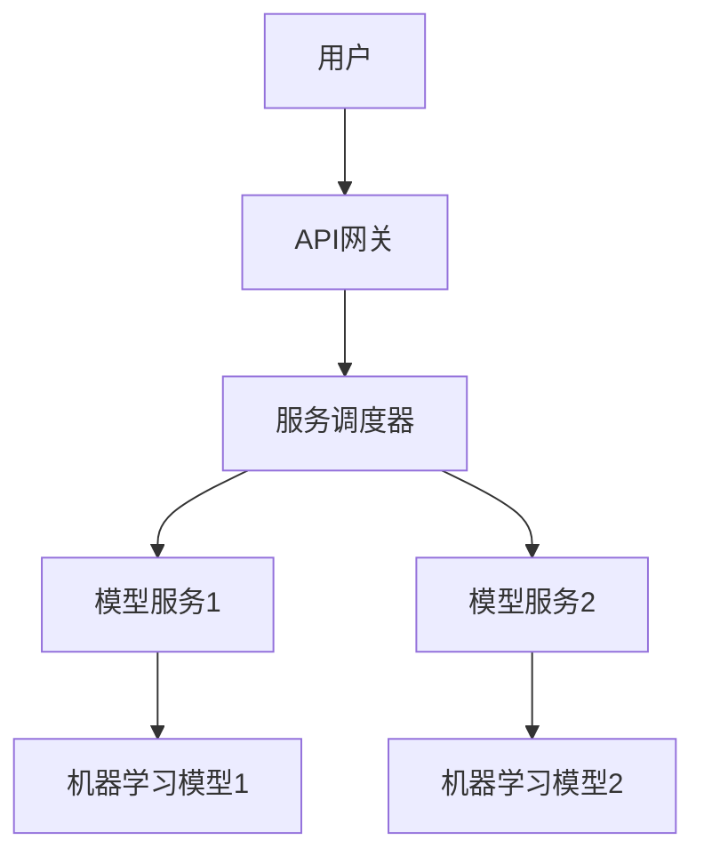

                 

# 模型服务化与API设计原理与代码实战案例讲解

## 关键词
- 模型服务化
- API设计
- 实战案例
- 编程技术
- 代码实战
- 算法原理

## 摘要
本文深入探讨了模型服务化与API设计的核心原理，通过具体案例讲解了服务化的实现步骤、API的设计要点及代码实战过程。文章旨在为开发者提供清晰的指导，帮助其在实际项目中高效应用模型服务化和API设计，提升软件系统的可扩展性和用户体验。

## 1. 背景介绍

### 1.1 模型服务化的概念
模型服务化是将机器学习模型的功能以服务的形式暴露给外部系统，使其能够通过API接口进行调用。这种做法使得模型可以独立部署、管理和扩展，同时也便于与前端应用、后台系统等进行集成。

### 1.2 API设计的意义
API（应用程序编程接口）是软件组件之间交互的接口规范。良好的API设计可以提高软件系统的可扩展性、可维护性和易用性，是现代软件开发中的重要一环。

### 1.3 当前应用趋势
随着大数据和人工智能技术的快速发展，模型服务化和API设计已成为构建智能化应用的基石。越来越多的企业将其模型和服务通过API的方式对外开放，形成了新型的商业模式和技术生态系统。

## 2. 核心概念与联系

### 2.1 模型服务化的架构

### 2.2 API设计的关键要素
- **接口定义**：明确API的输入参数、输出结果和数据格式。
- **安全性**：通过认证、授权等机制确保API的安全性。
- **性能**：确保API响应速度和并发处理能力。
- **文档**：提供详细的API文档，便于开发者使用。

### 2.3 服务化与API设计的关系
- **相互依赖**：模型服务化需要API设计来提供服务接口，而良好的API设计可以提高服务化的效率和用户体验。
- **协同发展**：服务化与API设计都需要持续迭代和优化，以满足不断变化的需求。

## 3. 核心算法原理 & 具体操作步骤

### 3.1 模型服务化的步骤
1. **模型训练与优化**：训练出高性能的机器学习模型。
2. **模型封装**：将模型封装为服务，实现模型与业务逻辑的分离。
3. **API接口设计**：定义API接口，包括URL、HTTP方法、参数和响应格式。
4. **服务部署**：将模型服务部署到服务器或云计算平台。
5. **服务监控与维护**：对服务进行监控和优化，确保其稳定运行。

### 3.2 API设计的步骤
1. **需求分析**：分析用户需求，确定API的功能和性能要求。
2. **接口设计**：设计API接口，包括URL、HTTP方法、参数和响应格式。
3. **文档编写**：编写详细的API文档，包括接口描述、请求示例和错误处理。
4. **测试与优化**：对API进行功能测试和性能测试，并进行优化。
5. **部署与监控**：部署API服务，并对其进行监控和维护。

## 4. 数学模型和公式 & 详细讲解 & 举例说明

### 4.1 模型服务化的数学模型
$$
\text{服务化效率} = \frac{\text{服务化后的性能}}{\text{未服务化的性能}} \times 100\%
$$

### 4.2 API设计的性能评估
$$
\text{API响应时间} = \frac{\text{API处理时间}}{\text{客户端请求时间}} \times 1000
$$

### 4.3 实际案例
假设一个机器学习模型的服务化前后性能对比如下：
- 未服务化时，模型处理1000次请求需要10分钟。
- 服务化后，模型处理1000次请求需要5分钟。

则模型服务化效率为：
$$
\text{服务化效率} = \frac{5}{10} \times 100\% = 50\%
$$

API的响应时间为：
$$
\text{API响应时间} = \frac{5}{1000} \times 1000 = 5 \text{ms}
$$

## 5. 项目实战：代码实际案例和详细解释说明

### 5.1 开发环境搭建

**工具与框架**：
- Python 3.8+
- Flask 1.1.2
- Scikit-learn 0.22.2
- Flask-Cors 3.0.8

**步骤**：
1. 安装Python和Flask。
2. 创建一个新的Flask应用。
3. 安装并导入Scikit-learn库。

### 5.2 源代码详细实现和代码解读

**代码实现**：
```python
from flask import Flask, request, jsonify
from sklearn.externals import joblib
import numpy as np

app = Flask(__name__)

# 加载机器学习模型
model = joblib.load('model.joblib')

@app.route('/predict', methods=['POST'])
def predict():
    data = request.get_json()
    features = np.array(data['features']).reshape(1, -1)
    prediction = model.predict(features)
    return jsonify({'prediction': prediction.tolist()})

if __name__ == '__main__':
    app.run(debug=True)
```

**代码解读**：
1. 导入所需的库。
2. 加载预先训练好的机器学习模型。
3. 定义一个预测的API接口，接收JSON格式的数据。
4. 将接收到的数据转换为numpy数组，进行预测。
5. 将预测结果以JSON格式返回。

### 5.3 代码解读与分析

**解读**：
- **Flask应用**：作为Web框架，用于创建和运行Web服务。
- **机器学习模型**：通过Scikit-learn库加载，实现预测功能。
- **API接口**：定义了一个`/predict`接口，接受POST请求，返回预测结果。

**分析**：
- **性能**：API的性能取决于模型的复杂度和响应时间。
- **安全性**：未进行任何安全性处理，实际应用中需要添加认证和授权机制。
- **可扩展性**：可以通过Flask扩展进行性能优化和功能扩展。

## 6. 实际应用场景

### 6.1 金融行业
- 模型服务化可以用于实时风险评估、欺诈检测等场景。
- API设计有助于金融产品的自动化决策和数据分析。

### 6.2 医疗健康
- 模型服务化可以用于疾病诊断、健康风险评估等。
- API设计便于医疗数据的共享和跨系统协作。

### 6.3 智能家居
- 模型服务化可以实现智能家居的智能控制和个性化推荐。
- API设计便于设备间的交互和数据共享。

## 7. 工具和资源推荐

### 7.1 学习资源推荐
- **书籍**：《机器学习API设计》、《RESTful API设计》
- **论文**：搜索相关领域的学术论文，了解最新研究进展。
- **博客**：技术博客如Medium、DZone等，提供实用的教程和经验分享。
- **网站**：相关技术社区如Stack Overflow、GitHub等，用于问题解决和代码交流。

### 7.2 开发工具框架推荐
- **Flask**：轻量级Web框架，适合快速开发API服务。
- **Django**：全栈Web框架，提供丰富的功能和安全性保障。
- **TensorFlow Serving**：用于部署和管理TensorFlow模型的框架。

### 7.3 相关论文著作推荐
- **论文**：《Service-oriented Machine Learning: APIs and Beyond》
- **著作**：《API Design for C++》

## 8. 总结：未来发展趋势与挑战

### 8.1 发展趋势
- **模型服务化**：将更加普及，推动AI应用的落地。
- **API设计**：将更加注重性能和安全，满足不同场景的需求。

### 8.2 挑战
- **性能优化**：如何提高模型服务化和API的性能。
- **安全性**：如何确保API的安全性和数据的隐私保护。
- **标准化**：如何制定统一的API规范和接口标准。

## 9. 附录：常见问题与解答

### 9.1 模型服务化相关问题
- **Q：如何优化模型服务化性能？**
  **A：可以通过模型压缩、量化、蒸馏等技术来提高服务化性能。**

### 9.2 API设计相关问题
- **Q：如何确保API的安全性？**
  **A：可以通过使用HTTPS、添加认证和授权机制、进行输入验证等方法来增强API的安全性。**

## 10. 扩展阅读 & 参考资料

- **扩展阅读**：《深度学习API实战》、《API设计实战指南》
- **参考资料**：[Flask官方文档](https://flask.palletsprojects.com/)|[Scikit-learn官方文档](https://scikit-learn.org/stable/)|[TensorFlow Serving官方文档](https://www.tensorflow.org/tfx/serving)

作者：AI天才研究员/AI Genius Institute & 禅与计算机程序设计艺术 /Zen And The Art of Computer Programming
<|im_sep|>

