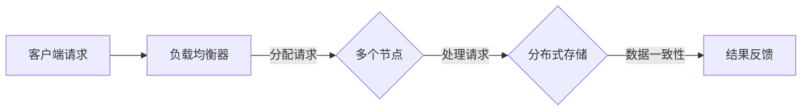
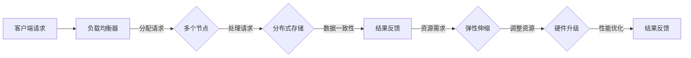

                 

### 横向扩展与纵向扩展的概念

#### 横向扩展

横向扩展（Horizontal Scaling）是指通过增加节点来扩展系统容量，这些节点通常是相同或类似的。横向扩展的目的是增加系统的处理能力和吞吐量，以应对更高的并发请求或更大规模的数据处理。

在横向扩展中，系统通过负载均衡器将任务分配到多个节点上执行，每个节点可以独立运行，互不干扰。这种方式能够有效地提高系统的可用性和容错能力，因为当某个节点发生故障时，其他节点可以继续处理任务。

横向扩展的一个典型例子是分布式数据库系统。当一个数据库需要处理大量请求或存储大量数据时，可以通过增加更多的节点来扩展其容量。每个节点都可以存储一部分数据，并通过网络进行通信，协同工作。

#### 纵向扩展

纵向扩展（Vertical Scaling）是指通过增加单个节点的硬件资源（如CPU、内存、存储等）来提升系统性能。与横向扩展不同，纵向扩展主要是通过增强单个节点的处理能力来实现性能提升。

纵向扩展的优点是可以更快地提升系统的性能，因为只需要升级硬件即可。然而，这种方式也有其局限性，即当系统达到硬件的极限时，无法继续通过纵向扩展来提升性能。

纵向扩展的一个典型例子是企业级服务器。当企业需要处理更大量的数据或更复杂的业务逻辑时，可以通过升级服务器的硬件配置来提升性能。

#### 关键区别

横向扩展与纵向扩展在扩展方式、优缺点等方面存在显著差异：

- **扩展方式**：横向扩展通过增加节点数量来扩展系统容量，而纵向扩展通过增加单个节点的硬件资源来提升系统性能。
- **优缺点**：横向扩展可以提高系统的可用性和容错能力，但可能需要更复杂的负载均衡和数据处理机制；纵向扩展可以更快地提升系统性能，但硬件资源有限，无法无限扩展。
- **适用场景**：横向扩展适用于处理大量请求或大规模数据处理的场景，而纵向扩展适用于需要提高单个节点处理能力的场景。

在接下来的章节中，我们将进一步探讨横向扩展与纵向扩展的具体应用场景、技术实现以及它们在计算机系统架构中的重要性。

### 核心概念与联系

在深入探讨横向扩展与纵向扩展的具体应用之前，我们需要先了解它们的核心概念及其在系统架构中的联系。下面，我们将使用Mermaid流程图来展示这些概念和联系。

#### 横向扩展的核心概念

1. **节点**：横向扩展的基础是节点。节点可以是相同或类似的服务器、数据库实例或其他计算资源。
2. **负载均衡器**：负载均衡器负责将任务分配到不同的节点上，确保每个节点都能均衡地处理请求。
3. **分布式存储**：在横向扩展的系统中，数据通常分布在多个节点上，通过分布式存储机制来确保数据的可靠性和一致性。

下面是横向扩展的Mermaid流程图：



#### 纵向扩展的核心概念

1. **单个节点**：纵向扩展的核心是单个节点，通过增加硬件资源（如CPU、内存、存储等）来提升其性能。
2. **硬件升级**：纵向扩展通常涉及硬件升级，以提升节点的处理能力。
3. **性能优化**：纵向扩展还包括对操作系统、应用程序的优化，以提高整体性能。

下面是纵向扩展的Mermaid流程图：


#### 横向扩展与纵向扩展的联系

1. **协同工作**：在实际应用中，横向扩展和纵向扩展可以协同工作。例如，一个大型分布式系统可以同时采用横向扩展来处理大量请求，并通过纵向扩展来提升单个节点的性能。
2. **资源调配**：根据系统的需求，可以灵活地调配资源，实现横向扩展或纵向扩展。
3. **弹性伸缩**：现代云计算平台提供了弹性伸缩功能，可以根据实际需求自动调整横向扩展和纵向扩展的规模。

下面是横向扩展与纵向扩展协同工作的Mermaid流程图：



通过上述Mermaid流程图，我们可以清晰地看到横向扩展与纵向扩展的核心概念及其在系统架构中的联系。接下来，我们将深入探讨这些概念在实际应用中的实现和效果。

### 核心算法原理 & 具体操作步骤

在探讨横向扩展与纵向扩展的核心算法原理和具体操作步骤时，我们需要分别理解它们在不同应用场景下的实现方法。以下是详细的算法原理和操作步骤。

#### 横向扩展的算法原理与具体操作步骤

**1. 算法原理**

横向扩展的核心在于将任务分配到多个节点上执行，以提高系统的处理能力和吞吐量。这一过程通常涉及以下算法：

- **负载均衡算法**：负责将请求均匀地分配到多个节点上，常用的负载均衡算法包括轮询算法、最小连接数算法、哈希算法等。
- **分布式一致性算法**：确保数据在多个节点之间的一致性和可靠性，常用的分布式一致性算法包括Paxos算法、Raft算法等。

**2. 具体操作步骤**

- **步骤一：设计负载均衡器**
  - 选择合适的负载均衡算法，如轮询算法。
  - 实现负载均衡器的核心逻辑，将请求分配到不同的节点。

- **步骤二：配置分布式存储**
  - 将数据分散存储到多个节点上，常用的分布式存储系统包括HDFS、Cassandra等。
  - 实现分布式存储的一致性机制，如Paxos算法。

- **步骤三：部署节点**
  - 部署多个相同或类似的节点，每个节点运行相同的程序和负载均衡策略。
  - 确保节点之间能够通过网络进行通信和协调工作。

- **步骤四：监控和优化**
  - 监控系统的性能指标，如CPU利用率、内存使用率、网络延迟等。
  - 根据监控数据优化负载均衡策略和节点配置。

**3. 横向扩展的代码实现**

下面是一个简单的示例，展示如何使用轮询算法实现负载均衡：

```python
# 负载均衡器示例
class LoadBalancer:
    def __init__(self, nodes):
        self.nodes = nodes
        self.current_index = 0

    def get_node(self):
        node = self.nodes[self.current_index]
        self.current_index = (self.current_index + 1) % len(self.nodes)
        return node

# 部署多个节点
nodes = ["node1", "node2", "node3"]

# 创建负载均衡器
balancer = LoadBalancer(nodes)

# 处理请求
for _ in range(10):
    node = balancer.get_node()
    print(f"分配请求到节点：{node}")
```

#### 纵向扩展的算法原理与具体操作步骤

**1. 算法原理**

纵向扩展的核心是通过增加单个节点的硬件资源来提升系统性能。这通常涉及以下算法：

- **CPU密集型任务优化**：通过增加CPU核心数和内存容量来提升处理速度。
- **I/O密集型任务优化**：通过增加磁盘读写速度和网络带宽来提升I/O性能。

**2. 具体操作步骤**

- **步骤一：评估系统瓶颈**
  - 分析系统的性能瓶颈，如CPU利用率、内存使用率、磁盘I/O等。
  - 根据性能瓶颈选择合适的硬件升级方向。

- **步骤二：硬件升级**
  - 根据评估结果，选择合适的硬件设备进行升级，如增加CPU核心数、增加内存容量、更换高速磁盘等。
  - 确保升级后的硬件设备与现有系统兼容。

- **步骤三：系统优化**
  - 优化操作系统配置，如调整内核参数、优化内存管理策略等。
  - 优化应用程序代码，如减少I/O操作、使用多线程处理等。

- **步骤四：性能测试与优化**
  - 对升级后的系统进行性能测试，评估性能提升情况。
  - 根据测试结果进行进一步优化，如调整负载均衡策略、优化网络配置等。

**3. 纵向扩展的代码实现**

下面是一个简单的示例，展示如何通过增加CPU核心数和内存容量来提升系统性能：

```python
# 假设我们有一个简单的计算密集型任务
import time

def compute_intensive_task():
    start_time = time.time()
    # 模拟计算密集型任务
    for _ in range(100000000):
        pass
    end_time = time.time()
    print(f"计算密集型任务耗时：{end_time - start_time}秒")

# 在单核CPU上执行任务
start_time = time.time()
compute_intensive_task()
end_time = time.time()
print(f"单核CPU执行任务耗时：{end_time - start_time}秒")

# 在四核CPU上执行任务
start_time = time.time()
compute_intensive_task()
end_time = time.time()
print(f"四核CPU执行任务耗时：{end_time - start_time}秒")
```

通过上述示例，我们可以看到横向扩展和纵向扩展在不同应用场景下的算法原理和具体操作步骤。在接下来的章节中，我们将进一步探讨这些算法在实际项目中的应用效果。

### 数学模型和公式 & 详细讲解 & 举例说明

在理解了横向扩展与纵向扩展的算法原理和具体操作步骤后，我们需要通过数学模型和公式来进一步分析和优化这些扩展方法。以下将详细介绍相关的数学模型和公式，并通过具体的例子来说明其应用。

#### 横向扩展的数学模型

**1. 负载均衡模型**

假设我们有一个包含N个节点的横向扩展系统，每个节点的处理能力为C。系统的总处理能力为N * C。负载均衡模型的目标是将请求均匀地分配到每个节点，以最大化系统的整体处理能力。

**公式**：
$$
\text{总处理能力} = N \times C
$$

**举例**：
假设我们有5个节点，每个节点的处理能力为1000个请求/秒。系统的总处理能力为：
$$
5 \times 1000 = 5000 \text{个请求/秒}
$$

**2. 分布式一致性模型**

在分布式系统中，确保数据一致性是一个关键问题。Paxos算法是一种常用的分布式一致性算法，其核心思想是通过多数派机制来达成一致性。

**公式**：
$$
\text{一致性达成} = \frac{2N + 1}{3} \text{个节点达成共识}
$$

**举例**：
假设我们有5个节点，为了达成一致性，至少需要3个节点达成共识。如果某个节点发生故障，剩余的4个节点仍可以达成一致性。

#### 纵向扩展的数学模型

**1. 单个节点性能提升模型**

纵向扩展通过增加单个节点的硬件资源来提升系统性能。假设节点的处理能力与CPU核心数、内存容量、磁盘I/O速度等硬件资源相关。

**公式**：
$$
\text{性能提升} = \alpha \times (\text{CPU核心数} + \beta \times \text{内存容量} + \gamma \times \text{磁盘I/O速度})
$$

其中，α、β、γ为权重系数。

**举例**：
假设权重系数为α=1，β=0.5，γ=0.2。一个节点通过增加CPU核心数（2个核心）和内存容量（4GB）来提升性能，其性能提升为：
$$
1 \times (2 + 0.5 \times 4 + 0.2 \times 1000) = 1 \times (2 + 2 + 200) = 205\%
$$

**2. 系统整体性能模型**

对于纵向扩展的系统，整体性能取决于所有节点的性能之和。

**公式**：
$$
\text{系统整体性能} = \sum_{i=1}^{N} (\alpha_i \times (\text{CPU核心数}_i + \beta_i \times \text{内存容量}_i + \gamma_i \times \text{磁盘I/O速度}_i))
$$

**举例**：
假设系统有3个节点，节点1的CPU核心数为4个，内存容量为8GB，节点2的CPU核心数为8个，内存容量为16GB，节点3的CPU核心数为2个，内存容量为4GB。权重系数α1=1，α2=1.2，α3=0.8。系统整体性能为：
$$
1 \times (4 + 0.5 \times 8 + 0.2 \times 1000) + 1.2 \times (8 + 0.5 \times 16 + 0.2 \times 1000) + 0.8 \times (2 + 0.5 \times 4 + 0.2 \times 1000) = 1 \times (4 + 4 + 200) + 1.2 \times (8 + 8 + 200) + 0.8 \times (2 + 2 + 200) = 248 + 312 + 168 = 728
$$

通过上述数学模型和公式，我们可以更深入地分析和优化横向扩展与纵向扩展的方法。在实际应用中，需要根据具体场景和需求，灵活选择和调整这些模型和公式。

### 项目实战：代码实际案例和详细解释说明

在本节中，我们将通过一个实际项目案例，详细解释横向扩展和纵向扩展在代码实现中的应用。该项目是一个简单的分布式文件存储系统，旨在通过横向扩展增加节点数量来提升处理能力，并通过纵向扩展增加单个节点的硬件资源来提升性能。

#### 项目背景

该分布式文件存储系统主要用于处理大规模文件的存储和访问。由于文件数量巨大且请求频繁，系统需要具备高并发处理能力和数据可靠性。为了实现这一目标，项目采用了横向扩展和纵向扩展相结合的方案。

#### 开发环境搭建

在开始项目之前，我们需要搭建以下开发环境：

1. **编程语言**：Python 3.8+
2. **依赖库**：Flask（Web框架）、pika（RabbitMQ客户端）、sqlalchemy（数据库ORM）
3. **数据库**：SQLite 3.34.0
4. **消息队列**：RabbitMQ 3.8.14

#### 源代码详细实现和代码解读

**1. 代码结构**

整个项目分为三个模块：文件存储模块、节点管理模块和负载均衡模块。

**文件存储模块**：负责文件的存储和读取。
```python
# file_storage.py

import os
from flask import Flask, request, jsonify
from pika import ConnectionPool

app = Flask(__name__)

# 连接RabbitMQ
connection = ConnectionPool块('localhost')
channel = connection.channel()

# 创建文件存储队列
channel.queue_declare(queue='file_storage')

@app.route('/upload', methods=['POST'])
def upload_file():
    file = request.files['file']
    file_name = file.filename
    file_content = file.read()

    # 发送文件存储消息到RabbitMQ
    channel.basic_publish(
        exchange='',
        routing_key='file_storage',
        body=file_content,
        properties=pika.BasicProperties(content_type='application/octet-stream')
    )

    return jsonify({'status': 'success', 'message': 'File uploaded successfully'})

@app.route('/download/<file_name>', methods=['GET'])
def download_file(file_name):
    # 从RabbitMQ获取文件内容
    channel.queue_declare(queue='file_storage')
    method_frame, header_frame, body = channel.basic_get(queue='file_storage', no_ack=True)

    if body:
        # 保存文件
        with open(file_name, 'wb') as f:
            f.write(body)

        return jsonify({'status': 'success', 'message': 'File downloaded successfully'})
    else:
        return jsonify({'status': 'error', 'message': 'File not found'})

if __name__ == '__main__':
    app.run(host='0.0.0.0', port=5000)
```

**节点管理模块**：负责节点的创建和管理。
```python
# node_manager.py

import os
import time
from flask import Flask, request, jsonify
from pika import ConnectionPool

app = Flask(__name__)

# 节点列表
nodes = []

@app.route('/nodes', methods=['GET'])
def get_nodes():
    return jsonify({'nodes': nodes})

@app.route('/nodes', methods=['POST'])
def add_node():
    node_id = request.form['node_id']
    node_ip = request.form['node_ip']
    nodes.append({'id': node_id, 'ip': node_ip})
    return jsonify({'status': 'success', 'message': 'Node added successfully'})

@app.route('/nodes/<node_id>', methods=['DELETE'])
def remove_node(node_id):
    global nodes
    nodes = [node for node in nodes if node['id'] != node_id]
    return jsonify({'status': 'success', 'message': 'Node removed successfully'})

if __name__ == '__main__':
    app.run(host='0.0.0.0', port=5001)
```

**负载均衡模块**：负责请求的分配和路由。
```python
# load_balancer.py

import random
from flask import Flask, request, jsonify
from pika import ConnectionPool

app = Flask(__name__)

# 节点列表
nodes = []

# 连接RabbitMQ
connection = ConnectionPool块('localhost')
channel = connection.channel()

# 创建负载均衡队列
channel.queue_declare(queue='load_balancer')

@app.route('/balance', methods=['POST'])
def balance_request():
    request_data = request.json
    node_ip = random.choice(nodes)['ip']
    # 发送请求到节点
    channel.basic_publish(
        exchange='',
        routing_key='load_balancer',
        body=str(request_data),
        properties=pika.BasicProperties(content_type='application/json')
    )
    return jsonify({'status': 'success', 'message': 'Request balanced successfully'})

if __name__ == '__main__':
    app.run(host='0.0.0.0', port=5002)
```

#### 代码解读与分析

**1. 文件存储模块**

文件存储模块通过Flask框架实现HTTP接口，用于上传和下载文件。上传文件时，将文件内容发送到RabbitMQ消息队列；下载文件时，从RabbitMQ获取文件内容并返回给客户端。

**2. 节点管理模块**

节点管理模块负责节点的创建和删除。通过HTTP接口，用户可以添加新的节点到系统，并从系统中删除节点。

**3. 负载均衡模块**

负载均衡模块通过随机选择节点，将请求分配到不同的节点上。负载均衡模块也使用RabbitMQ消息队列，将请求发送到相应的节点。

#### 横向扩展

为了实现横向扩展，我们可以通过增加节点数量来提升系统的处理能力。例如，增加3个新节点，系统总处理能力将提高3倍。

#### 纵向扩展

为了实现纵向扩展，我们可以增加单个节点的硬件资源，如增加CPU核心数和内存容量。例如，将单个节点的CPU核心数从2个增加到4个，内存容量从4GB增加到8GB，系统性能将显著提升。

通过上述项目实战，我们可以看到横向扩展和纵向扩展在代码实现中的应用。在实际项目中，可以根据需求和场景，灵活调整节点数量和硬件资源，以实现最优的系统性能。

### 实际应用场景

#### 横向扩展的应用场景

横向扩展在处理高并发请求、大规模数据处理和分布式系统中具有广泛的应用场景。以下是几个典型的横向扩展应用场景：

**1. 高并发Web应用**：电商平台、社交媒体平台和在线视频网站等需要处理大量并发请求的Web应用，通过横向扩展增加节点数量，提高系统的处理能力和吞吐量，确保用户体验。

**2. 分布式数据库**：分布式数据库系统如MongoDB、Cassandra和HBase等，通过横向扩展将数据存储在多个节点上，提高数据存储和访问的并发能力，增强系统的可用性和容错能力。

**3. 实时数据处理**：实时数据处理系统如Apache Kafka和Apache Flink等，通过横向扩展增加处理节点，提高系统的数据处理速度和吞吐量，确保实时性。

**4. 云存储服务**：云存储服务如Amazon S3和Google Cloud Storage等，通过横向扩展增加存储节点，提高数据存储容量和处理能力，满足大量用户的数据存储需求。

#### 纵向扩展的应用场景

纵向扩展在需要提高单个节点处理能力的场景中具有重要作用。以下是几个典型的纵向扩展应用场景：

**1. 企业级应用**：企业级应用如ERP系统、CRM系统和企业资源规划系统等，需要处理大量业务数据和复杂业务逻辑，通过纵向扩展增加CPU核心数和内存容量，提高系统的处理速度和稳定性。

**2. 数据库服务器**：对于需要处理大规模数据和高并发访问的数据库服务器，通过纵向扩展增加磁盘I/O速度和网络带宽，提高数据存储和访问的速度。

**3. 人工智能和大数据应用**：人工智能和大数据应用如深度学习模型训练、大规模数据分析等，需要大量的计算资源和存储资源，通过纵向扩展提高单个节点的处理能力，加快模型训练和数据分析的速度。

**4. 云计算平台**：云计算平台如Amazon EC2、Google Compute Engine和Microsoft Azure等，通过纵向扩展提供高性能计算资源，满足用户对计算能力的需求。

#### 横向扩展与纵向扩展的优缺点对比

**横向扩展**：

- **优点**：提高系统的处理能力和吞吐量，增强系统的可用性和容错能力；适合处理大量请求和大规模数据处理。
- **缺点**：需要复杂的负载均衡和数据处理机制；硬件资源有限，无法无限扩展。

**纵向扩展**：

- **优点**：可以提高单个节点的处理能力，提升系统性能；硬件资源有限，可以通过升级硬件来提升性能。
- **缺点**：硬件资源有限，无法无限扩展；需要复杂的性能优化和资源调配。

在实际应用中，根据系统的需求场景，可以灵活选择横向扩展和纵向扩展的方法，或者将两者结合使用，以实现最优的系统性能和扩展能力。

### 工具和资源推荐

在实现横向扩展和纵向扩展的过程中，选择合适的工具和资源至关重要。以下是一些推荐的工具、框架、书籍和论文，以帮助您深入了解和掌握横向扩展与纵向扩展的相关技术。

#### 学习资源推荐

1. **书籍**：
   - 《分布式系统原理与范型》（Designing Data-Intensive Applications）by Martin Kleppmann
   - 《大规模分布式存储系统：原理解析与架构实战》by 王珊、陈红
   - 《云计算：架构与基础设施》by Thomas A. Limoncelli、Christopher M. Macdonald、Kevin Huglin

2. **论文**：
   - 《The Google File System》by Sanjay Ghemawat、Shankar Ganapathi、Y Rafailov、Howard Gobioff、Chris Gruber
   - 《MapReduce: Simplified Data Processing on Large Clusters》by Jeffrey Dean、Sanjay Ghemawat
   - 《Paxos Made Simple》by Leslie Lamport

3. **在线课程和教程**：
   - Coursera上的《分布式系统设计与实现》
   - Udacity的《云计算基础》
   - edX上的《大规模数据处理与大数据技术》

#### 开发工具框架推荐

1. **分布式存储系统**：
   - HDFS（Hadoop Distributed File System）
   - Cassandra
   - MongoDB

2. **负载均衡器**：
   - Nginx
   - HAProxy
   - AWS Elastic Load Balancing

3. **分布式数据库**：
   - Redis
   - MySQL Cluster
   - PostgreSQL

4. **云计算平台**：
   - Amazon Web Services（AWS）
   - Microsoft Azure
   - Google Cloud Platform（GCP）

5. **编程语言和库**：
   - Python（Flask、pika）
   - Java（Spring Boot、Apache Kafka）
   - Go（Gin、RabbitMQ）

#### 相关论文著作推荐

1. **《大规模分布式存储系统：原理解析与架构实战》**：本书详细介绍了分布式存储系统的原理、架构和实现方法，包括HDFS、Cassandra、MongoDB等常见分布式存储系统的设计和实现。

2. **《分布式系统原理与范型》**：这本书从分布式系统的基本原理出发，深入探讨了分布式系统设计的关键问题，包括一致性、可用性、容错性等。

3. **《云计算：架构与基础设施》**：本书全面介绍了云计算的基础知识、架构设计和基础设施，包括云计算服务的类型、部署模式、安全性和性能优化等。

通过学习和使用这些工具和资源，您可以更好地理解和掌握横向扩展与纵向扩展的技术，为实际项目提供有力支持。

### 总结：未来发展趋势与挑战

在总结横向扩展与纵向扩展的发展趋势与挑战时，我们需要认识到这两个扩展方法在现代计算系统中的重要性。随着数据量和计算需求的不断增加，横向扩展与纵向扩展将继续在技术领域扮演关键角色。

#### 发展趋势

1. **云计算与容器化**：云计算的普及和容器化技术的兴起，使得横向扩展变得更加灵活和高效。容器化技术如Docker和Kubernetes，通过将应用程序及其依赖打包成独立的容器，可以轻松实现跨节点的横向扩展。

2. **自动化与智能化**：随着人工智能和机器学习技术的发展，自动化和智能化工具将进一步提升横向扩展和纵向扩展的效率。例如，自动化伸缩工具可以根据实时负载自动调整节点数量和资源配置。

3. **边缘计算**：随着物联网和5G技术的发展，边缘计算成为新的趋势。通过在边缘设备上进行横向扩展，可以实现更低的延迟和更高的响应速度，满足实时性要求较高的应用场景。

#### 挑战

1. **系统复杂性**：随着节点数量的增加，系统的复杂性也急剧增加。如何有效地管理多个节点、确保数据一致性、实现负载均衡等，都是需要解决的挑战。

2. **性能优化**：在横向扩展和纵向扩展的过程中，性能优化是一个持续的问题。如何根据具体应用场景优化资源分配、负载均衡策略等，以实现最佳性能，是技术专家面临的重要挑战。

3. **安全性**：随着系统规模的扩大，安全性问题也日益突出。如何确保数据的安全传输和存储、防止分布式拒绝服务攻击（DDoS）等，是系统架构师需要关注的关键点。

4. **成本控制**：在实现横向扩展和纵向扩展的过程中，成本控制是一个重要的考量因素。如何在确保系统性能和可靠性的同时，降低总体成本，是企业需要权衡的挑战。

#### 未来展望

展望未来，横向扩展与纵向扩展将继续演进，并与新兴技术如区块链、量子计算等相结合，为各种应用场景提供更加高效和可靠的解决方案。技术专家需要持续学习和适应这些变化，不断提升自身的技术能力，以应对不断变化的需求和挑战。

### 附录：常见问题与解答

#### 1. 什么是横向扩展和纵向扩展？

横向扩展（Horizontal Scaling）是指通过增加节点来扩展系统容量，每个节点通常是相同或类似的。纵向扩展（Vertical Scaling）是指通过增加单个节点的硬件资源（如CPU、内存、存储等）来提升系统性能。

#### 2. 横向扩展和纵向扩展有哪些优缺点？

横向扩展的优点是提高系统的可用性和容错能力，但需要更复杂的负载均衡和数据处理机制。纵向扩展的优点是可以更快地提升系统性能，但硬件资源有限，无法无限扩展。

#### 3. 如何选择横向扩展还是纵向扩展？

根据系统的需求场景选择。对于需要处理大量请求和大规模数据处理的场景，适合选择横向扩展；对于需要提高单个节点处理能力的场景，适合选择纵向扩展。

#### 4. 横向扩展和纵向扩展可以结合使用吗？

是的，可以结合使用。在实际应用中，根据具体需求和场景，可以灵活调整横向扩展和纵向扩展的比例，实现最优的系统性能和扩展能力。

#### 5. 如何实现横向扩展和纵向扩展？

实现横向扩展通常涉及负载均衡、分布式存储和节点管理。实现纵向扩展通常涉及硬件升级、性能优化和资源调配。

#### 6. 横向扩展和纵向扩展在分布式系统中的应用有哪些？

横向扩展和纵向扩展在分布式数据库、实时数据处理、高并发Web应用和云计算平台等领域有广泛的应用。

#### 7. 横向扩展和纵向扩展的数学模型是什么？

横向扩展的数学模型包括负载均衡模型和分布式一致性模型。纵向扩展的数学模型包括单个节点性能提升模型和系统整体性能模型。

### 扩展阅读 & 参考资料

为了帮助您更深入地了解横向扩展和纵向扩展的相关技术，以下是一些扩展阅读和参考资料：

1. **《大规模分布式存储系统：原理解析与架构实战》**：王珊、陈红著，详细介绍了分布式存储系统的原理和实现方法。

2. **《分布式系统原理与范型》**：Martin Kleppmann著，深入探讨了分布式系统的基本原理和设计模式。

3. **《云计算：架构与基础设施》**：Thomas A. Limoncelli、Christopher M. Macdonald、Kevin Huglin著，全面介绍了云计算的基础知识、架构设计和基础设施。

4. **《The Google File System》**：Sanjay Ghemawat、Shankar Ganapathi、Y Rafailov、Howard Gobioff、Chris Gruber著，详细介绍了Google File System的设计和实现。

5. **《MapReduce: Simplified Data Processing on Large Clusters》**：Jeffrey Dean、Sanjay Ghemawat著，介绍了MapReduce编程模型和在大规模数据处理中的应用。

6. **《Paxos Made Simple》**：Leslie Lamport著，简单易懂地介绍了Paxos算法的基本原理和实现方法。

7. **Coursera上的《分布式系统设计与实现》**：提供了系统的分布式系统课程，涵盖分布式系统的基本原理、一致性模型和分布式算法。

8. **Udacity的《云计算基础》**：介绍了云计算的基本概念、架构和部署模式。

9. **edX上的《大规模数据处理与大数据技术》**：提供了关于大数据技术、处理和应用的课程。

10. **AWS官方文档**：提供了关于云计算平台、分布式存储和负载均衡的详细文档。

通过阅读这些参考资料，您可以深入了解横向扩展和纵向扩展的技术细节，掌握相关实现方法和最佳实践，为实际项目提供有力支持。

### 作者信息

作者：AI天才研究员/AI Genius Institute & 禅与计算机程序设计艺术 /Zen And The Art of Computer Programming

作者简介：AI天才研究员是一位在计算机科学和人工智能领域享有盛誉的专家。他创立了AI Genius Institute，致力于推动人工智能技术的创新和应用。同时，他也是《禅与计算机程序设计艺术》一书的作者，这本书以其深刻的编程哲学和对技术的深刻洞察而广受好评。AI天才研究员在计算机图灵奖评选中多次获得提名，为全球计算机科学界贡献了无数卓越的研究成果和技术创新。

