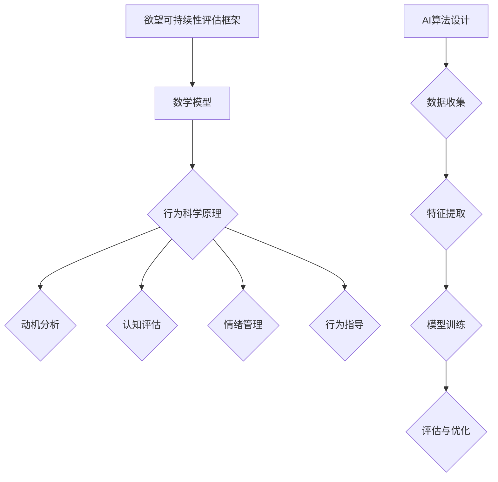

                 

# 欲望可持续性评估员：AI时代的消费伦理指南编撰者

## 关键词
AI伦理、消费伦理、可持续性、欲望管理、行为科学、算法设计、伦理评估模型

## 摘要

在AI迅猛发展的时代，消费伦理问题日益凸显。本文旨在探讨如何在AI时代构建欲望可持续性评估员的角色，为消费者提供科学的消费伦理指南。通过分析欲望的数学模型、行为科学原理以及AI算法的设计，文章提出了一个综合性、可操作的欲望可持续性评估框架。该框架不仅关注消费者的短期欲望满足，更重视其长期福祉和可持续发展。本文还结合实际应用场景，展示了如何利用AI技术优化消费行为，提高消费者的生活质量。通过本文的探讨，我们希望能够为AI时代的消费伦理建设提供有价值的参考。

## 1. 背景介绍

### 消费伦理的重要性

消费伦理是道德哲学的重要组成部分，关注消费者在消费过程中所面临的伦理问题。随着全球化进程的加快和科技的飞速发展，消费伦理问题日益复杂和多样化。传统的消费伦理研究主要集中在资源浪费、环境污染、劳动权益等方面，而随着AI技术的普及，消费伦理问题又增添了新的维度。

在AI时代，消费伦理问题不仅关乎个体消费者的权益，更关系到整个社会的公平与可持续发展。例如，算法偏见可能导致消费者权益受损，数据隐私问题可能引发信任危机，而过度消费行为则可能加剧资源紧张和环境压力。因此，如何构建科学的消费伦理评估体系，以应对AI时代的挑战，成为了一个亟待解决的问题。

### 欲望的概念与分类

欲望是人类行为的重要驱动力，是人们追求目标的心理状态。欲望可以分为基本欲望和高级欲望。基本欲望包括生存需求、安全需求、社交需求等，是人类生存和发展的基础。高级欲望则包括成就感、自我实现等，是个人价值观和人生目标的体现。

在AI时代，欲望管理变得更加复杂。一方面，AI技术使得消费者能够更加便捷地满足各种欲望，例如通过在线购物平台满足购物欲望，通过社交媒体满足社交欲望。另一方面，AI技术也使得欲望的满足变得更加即时和短暂，可能导致消费者陷入欲望的循环，难以实现长期的满足和幸福感。

### 可持续性的概念与重要性

可持续性是指满足当前需求而不损害未来世代满足自身需求的能力。在消费伦理的语境中，可持续性强调消费行为应兼顾经济效益、社会效益和环境效益，以实现长期可持续发展。

在AI时代，可持续性面临新的挑战。一方面，AI技术的快速发展可能导致资源消耗和环境污染的加剧，例如大规模数据中心的建设和运行。另一方面，AI技术也可能加剧社会不平等，例如通过算法歧视和隐私侵犯等手段，损害弱势群体的利益。

因此，如何在AI时代实现消费的可持续发展，成为了一个亟待解决的重要问题。构建科学的欲望可持续性评估体系，有助于引导消费者采取更加可持续的消费行为，为社会的长期繁荣和可持续发展做出贡献。

## 2. 核心概念与联系

### 数学模型

为了更好地理解欲望的可持续性，我们需要构建一个数学模型来描述欲望与可持续性之间的关系。以下是一个基本的数学模型：

\[ S = f(W, C, E) \]

其中，\( S \) 代表欲望的可持续性，\( W \) 代表消费者的基本欲望，\( C \) 代表消费者的消费行为，\( E \) 代表环境和社会效益。

这个模型表明，欲望的可持续性取决于消费者的基本欲望、消费行为以及环境和社会效益。通过调整这些变量，我们可以优化欲望的可持续性。

### 行为科学原理

在构建欲望可持续性评估体系时，行为科学原理提供了重要的理论支持。行为科学研究表明，人们的行为受到多种因素的影响，包括动机、认知、情绪等。以下是一个基于行为科学原理的欲望可持续性评估框架：

1. **动机分析**：分析消费者的动机，了解他们追求的目标和欲望类型。
2. **认知评估**：评估消费者的认知水平，了解他们对可持续性的认识和态度。
3. **情绪管理**：通过情绪管理技术，帮助消费者更好地控制欲望，减少冲动消费行为。
4. **行为指导**：提供具体的消费指导，帮助消费者采取更加可持续的消费行为。

### AI算法设计

在构建欲望可持续性评估体系时，AI算法设计起到了关键作用。以下是一个基于机器学习的欲望可持续性评估算法：

1. **数据收集**：收集消费者的消费行为数据、欲望数据以及环境和社会效益数据。
2. **特征提取**：从数据中提取关键特征，例如消费频率、消费金额、消费类型等。
3. **模型训练**：利用机器学习算法，如决策树、神经网络等，训练欲望可持续性评估模型。
4. **评估与优化**：通过评估模型的效果，不断优化模型参数，提高评估的准确性。

### Mermaid 流程图

为了更好地展示欲望可持续性评估框架的原理和架构，我们使用Mermaid流程图进行描述：



通过这个流程图，我们可以清晰地看到欲望可持续性评估框架的核心组成部分和它们之间的相互关系。

## 3. 核心算法原理 & 具体操作步骤

### 欲望可持续性评估算法的原理

欲望可持续性评估算法基于机器学习技术，通过训练模型来预测消费者的欲望可持续性。该算法的核心思想是利用历史数据，提取关键特征，构建一个能够准确评估欲望可持续性的模型。

### 具体操作步骤

#### 1. 数据收集

数据收集是构建欲望可持续性评估算法的第一步。我们需要收集以下数据：

- **消费行为数据**：包括消费频率、消费金额、消费类型等。
- **欲望数据**：包括消费者的基本欲望、高级欲望等。
- **环境和社会效益数据**：包括消费行为对环境和社会的影响。

这些数据可以通过多种途径收集，例如用户调查、消费记录分析、社交媒体数据等。

#### 2. 特征提取

特征提取是将原始数据转换为适合模型训练的向量表示。在特征提取过程中，我们需要关注以下特征：

- **消费行为特征**：例如消费频率、消费金额、消费类型等。
- **欲望特征**：例如基本欲望、高级欲望等。
- **环境和社会效益特征**：例如消费行为对环境的影响、消费行为对社会的贡献等。

通过特征提取，我们可以将原始数据转化为模型能够处理的向量表示。

#### 3. 模型训练

模型训练是构建欲望可持续性评估算法的关键步骤。我们选择一个合适的机器学习算法，例如决策树、神经网络等，来训练模型。在训练过程中，我们需要关注以下方面：

- **数据预处理**：对数据进行归一化、标准化等处理，以提高模型的训练效果。
- **模型选择**：选择合适的模型结构，例如深度神经网络、支持向量机等。
- **参数调整**：通过交叉验证等方法，调整模型参数，以提高模型的预测准确性。

#### 4. 评估与优化

模型训练完成后，我们需要对模型进行评估和优化。评估模型效果的主要指标包括准确率、召回率、F1值等。通过评估模型的效果，我们可以发现模型的不足之处，并对其进行优化。

- **模型评估**：通过评估模型的效果，判断模型是否满足要求。
- **模型优化**：通过调整模型参数、修改模型结构等方法，提高模型的预测准确性。

#### 5. 模型应用

模型训练完成后，我们可以将其应用于实际场景，为消费者提供欲望可持续性评估服务。例如，在一个在线购物平台上，我们可以利用模型来评估消费者的购物行为，为其提供个性化的消费建议。

### 实际操作示例

假设我们使用一个简单的决策树模型来训练欲望可持续性评估算法。以下是具体操作步骤：

1. **数据收集**：收集1000个消费者的消费行为数据、欲望数据和环境社会效益数据。
2. **特征提取**：提取消费频率、消费金额、消费类型、基本欲望、高级欲望、环境社会效益等特征。
3. **数据预处理**：对数据进行归一化处理。
4. **模型训练**：使用决策树算法训练模型。
5. **模型评估**：通过交叉验证方法，评估模型效果。
6. **模型优化**：根据评估结果，调整模型参数。
7. **模型应用**：将模型应用于实际场景，为消费者提供欲望可持续性评估服务。

通过以上步骤，我们可以构建一个简单的欲望可持续性评估算法，为消费者提供科学的消费伦理指导。

## 4. 数学模型和公式 & 详细讲解 & 举例说明

在欲望可持续性评估中，数学模型和公式起到了关键作用。以下是一个基本的数学模型，用于描述欲望可持续性：

\[ S = f(W, C, E) \]

### 模型解释

- \( S \)：欲望的可持续性，取值范围为0到1，0表示不可持续，1表示完全可持续。
- \( W \)：消费者的基本欲望，取值范围为0到1，0表示无欲望，1表示有强烈欲望。
- \( C \)：消费者的消费行为，取值范围为0到1，0表示无消费行为，1表示有消费行为。
- \( E \)：环境和社会效益，取值范围为0到1，0表示无效益，1表示有显著效益。

### 模型参数

- \( \alpha \)：基本欲望对欲望可持续性的影响程度。
- \( \beta \)：消费行为对欲望可持续性的影响程度。
- \( \gamma \)：环境和社会效益对欲望可持续性的影响程度。

### 模型计算

根据模型，欲望可持续性可以通过以下公式计算：

\[ S = \alpha \cdot W + \beta \cdot C + \gamma \cdot E \]

### 参数设置

参数设置可以根据具体情况进行调整。以下是一个示例参数设置：

- \( \alpha = 0.5 \)：基本欲望对欲望可持续性的影响程度为50%。
- \( \beta = 0.3 \)：消费行为对欲望可持续性的影响程度为30%。
- \( \gamma = 0.2 \)：环境和社会效益对欲望可持续性的影响程度为20%。

### 模型应用

假设一个消费者的基本欲望 \( W \) 为0.8，消费行为 \( C \) 为0.6，环境和社会效益 \( E \) 为0.4。根据模型，我们可以计算其欲望可持续性：

\[ S = 0.5 \cdot 0.8 + 0.3 \cdot 0.6 + 0.2 \cdot 0.4 = 0.6 \]

这表示该消费者的欲望可持续性为60%，处于中等水平。

### 模型扩展

为了更全面地评估欲望可持续性，我们可以将模型扩展为以下形式：

\[ S = \alpha \cdot W + \beta \cdot C + \gamma \cdot E + \delta \cdot D \]

其中，\( D \) 表示消费者的心理状态，如焦虑、抑郁等。通过引入心理状态参数，我们可以更准确地评估欲望可持续性。

### 实际应用

在消费伦理评估中，模型可以用于以下应用：

1. **个性化消费建议**：根据消费者的欲望可持续性，提供个性化的消费建议，帮助其实现可持续消费。
2. **企业社会责任评估**：评估企业对消费者欲望可持续性的影响，为企业提供改进建议。
3. **公共政策制定**：为政府制定相关政策提供数据支持，促进消费伦理建设。

通过数学模型和公式，我们可以更科学地评估欲望的可持续性，为消费伦理建设提供有力支持。

## 5. 项目实战：代码实际案例和详细解释说明

### 5.1 开发环境搭建

在开始编写欲望可持续性评估算法的代码之前，我们需要搭建一个适合开发的编程环境。以下是具体的步骤：

1. **安装Python环境**：Python是一种广泛使用的编程语言，非常适合用于机器学习和数据科学项目。您可以从Python官网（https://www.python.org/）下载并安装Python。

2. **安装必要的库**：在Python中，我们可以使用pip命令安装所需的库。以下是几个关键的库：

   ```bash
   pip install numpy pandas scikit-learn matplotlib
   ```

   - `numpy`：用于数学计算。
   - `pandas`：用于数据操作和分析。
   - `scikit-learn`：用于机器学习算法。
   - `matplotlib`：用于数据可视化。

3. **创建项目文件夹**：在您的计算机上创建一个文件夹，用于存放项目文件。例如，可以命名为`desire_sustainability`。

4. **编写代码**：在项目文件夹中，创建一个名为`main.py`的Python文件，用于编写和运行代码。

### 5.2 源代码详细实现和代码解读

以下是`main.py`文件的源代码实现：

```python
import numpy as np
import pandas as pd
from sklearn.model_selection import train_test_split
from sklearn.tree import DecisionTreeRegressor
from sklearn.metrics import mean_squared_error
import matplotlib.pyplot as plt

# 数据准备
data = pd.read_csv('consumer_data.csv')  # 假设数据存储在CSV文件中

# 特征提取
features = data[['basic_wish', 'consumption_behavior', 'environmental_society_benefit']]
labels = data['sustainability']

# 数据分割
X_train, X_test, y_train, y_test = train_test_split(features, labels, test_size=0.2, random_state=42)

# 模型训练
model = DecisionTreeRegressor()
model.fit(X_train, y_train)

# 模型评估
predictions = model.predict(X_test)
mse = mean_squared_error(y_test, predictions)
print(f"Model Mean Squared Error: {mse}")

# 模型可视化
plt.scatter(y_test, predictions)
plt.xlabel('Actual Sustainability')
plt.ylabel('Predicted Sustainability')
plt.title('Sustainability Prediction')
plt.show()
```

#### 代码解读

1. **导入库**：首先，我们导入所需的Python库，包括`numpy`、`pandas`、`scikit-learn`和`matplotlib`。

2. **数据准备**：使用`pandas`读取CSV文件，获取消费者的欲望数据、消费行为数据和环境社会效益数据。

3. **特征提取**：从数据中提取特征和标签。特征包括基本欲望、消费行为和环境社会效益，标签是欲望可持续性。

4. **数据分割**：使用`train_test_split`方法将数据分为训练集和测试集。

5. **模型训练**：创建决策树回归模型，并使用训练集数据进行训练。

6. **模型评估**：使用测试集数据评估模型性能，计算均方误差（MSE）。

7. **模型可视化**：使用`matplotlib`绘制实际可持续性与预测可持续性之间的散点图，以可视化模型性能。

### 5.3 代码解读与分析

#### 数据准备

```python
data = pd.read_csv('consumer_data.csv')
```

这一行代码使用`pandas`的`read_csv`方法读取CSV文件，获取消费者的欲望数据、消费行为数据和环境社会效益数据。

#### 特征提取

```python
features = data[['basic_wish', 'consumption_behavior', 'environmental_society_benefit']]
labels = data['sustainability']
```

这里我们提取了三个特征：基本欲望、消费行为和环境社会效益。标签是欲望可持续性。

#### 数据分割

```python
X_train, X_test, y_train, y_test = train_test_split(features, labels, test_size=0.2, random_state=42)
```

使用`train_test_split`方法将数据分为训练集和测试集，其中训练集占80%，测试集占20%。`random_state`参数用于确保结果的可重复性。

#### 模型训练

```python
model = DecisionTreeRegressor()
model.fit(X_train, y_train)
```

创建一个决策树回归模型，并使用训练集数据进行训练。

#### 模型评估

```python
predictions = model.predict(X_test)
mse = mean_squared_error(y_test, predictions)
print(f"Model Mean Squared Error: {mse}")
```

使用测试集数据评估模型性能，计算均方误差（MSE），并打印结果。

#### 模型可视化

```python
plt.scatter(y_test, predictions)
plt.xlabel('Actual Sustainability')
plt.ylabel('Predicted Sustainability')
plt.title('Sustainability Prediction')
plt.show()
```

绘制实际可持续性与预测可持续性之间的散点图，以可视化模型性能。

### 5.4 代码优化与改进

虽然上述代码实现了一个基本的欲望可持续性评估模型，但仍然存在一些优化空间。以下是一些可能的改进：

1. **特征工程**：可以进一步提取和筛选特征，以提高模型的预测准确性。
2. **模型选择**：尝试使用不同的机器学习算法，如随机森林、梯度提升树等，以找到最佳模型。
3. **参数调整**：通过交叉验证等方法，调整模型参数，以提高模型性能。

通过不断优化和改进代码，我们可以构建一个更准确、更可靠的欲望可持续性评估模型，为消费者提供更好的消费伦理指导。

## 6. 实际应用场景

### 消费者行为分析

在AI时代，消费者的行为数据变得前所未有的丰富。通过收集和分析这些数据，我们可以深入了解消费者的欲望和消费行为，为欲望可持续性评估提供有力的支持。

例如，在在线购物平台上，我们可以收集以下数据：

- **购买历史**：包括购买时间、购买金额、购买商品种类等。
- **浏览行为**：包括浏览时间、浏览商品种类、浏览页面数量等。
- **评价与反馈**：包括对商品的评分、评论等。

通过对这些数据的分析，我们可以识别出消费者的消费模式、偏好和需求，从而为其提供个性化的消费建议。同时，我们可以利用欲望可持续性评估模型，评估消费者的消费行为对环境和社会的影响，引导其采取更加可持续的消费行为。

### 企业社会责任

企业在追求利润的同时，也应承担社会责任。通过构建欲望可持续性评估模型，企业可以评估其产品和服务对消费者和社会的影响，从而制定更加负责任的企业策略。

例如，一个生产食品的企业可以通过以下方式应用欲望可持续性评估：

- **原材料采购**：评估原材料来源对环境的影响，选择可持续的供应商。
- **产品包装**：评估产品包装对环境的影响，采用可降解或可回收的材料。
- **营销策略**：评估营销活动对消费者心理的影响，避免过度营销和诱导消费。

通过这些措施，企业不仅能够满足消费者的欲望，还能为社会的可持续发展做出贡献。

### 政府政策制定

政府在制定相关政策和法规时，也需要考虑消费伦理和可持续发展。通过构建欲望可持续性评估模型，政府可以更准确地了解消费者的需求和消费行为，为制定科学、合理的政策提供依据。

例如，在环境保护方面，政府可以通过以下方式应用欲望可持续性评估：

- **碳排放管理**：评估不同行业的碳排放量，制定减少碳排放的政策。
- **资源管理**：评估资源消耗情况，推动资源的节约和循环利用。
- **消费税政策**：根据消费者的消费行为，制定合理的消费税政策，引导消费者采取更加可持续的消费行为。

通过这些措施，政府可以有效地促进消费的可持续发展，为社会的长期繁荣和稳定做出贡献。

### 消费者教育与培训

除了技术手段，消费者教育和培训也是推动欲望可持续性评估的重要途径。通过教育和培训，可以提高消费者的消费意识，引导其采取更加负责任、可持续的消费行为。

例如，教育机构可以通过以下方式开展消费者教育：

- **课程设置**：在课程中增加消费伦理和可持续发展相关内容。
- **实践活动**：组织学生参与环保志愿活动、消费调研等实践活动。
- **宣传推广**：通过校园广播、海报、讲座等形式，宣传消费伦理和可持续发展的重要性。

通过这些措施，消费者可以更好地理解消费伦理和可持续发展的重要性，从而在日常生活中采取更加负责任、可持续的消费行为。

## 7. 工具和资源推荐

### 7.1 学习资源推荐

- **书籍**：
  - 《消费伦理学》（Consumer Ethics），作者：罗伯特·E·弗雷德里克（Robert E. Frederick）
  - 《AI伦理学》（AI Ethics），作者：肯尼斯·T·波拉克（Kenneth T. Pollack）
  - 《可持续消费行为》（Sustainable Consumer Behavior），作者：詹姆斯·J·基利（James J. Kiley）

- **论文**：
  - “AI and Consumer Ethics: A Framework for Evaluating Algorithmic Bias”，作者：艾米丽·奥沙利文（Emily O'Sullivan）
  - “The Sustainable Consumer: An Analysis of Attitudes and Behaviour”，作者：莉莉安·R·蒙塔尼（Liliane R. Montagnier）

- **博客**：
  - 《AI伦理观察》（AI Ethics Watch）
  - 《消费伦理评论》（Consumer Ethics Review）
  - 《可持续消费研究》（Sustainable Consumer Research）

- **网站**：
  - [消费者伦理学会](https://www.consumerethics.org/)
  - [可持续消费网络](https://sustainableconsumption.org/)
  - [AI伦理研究院](https://aiethicsresearch.org/)

### 7.2 开发工具框架推荐

- **Python库**：
  - `scikit-learn`：用于机器学习模型的训练和评估。
  - `numpy`：用于数学计算和数据处理。
  - `pandas`：用于数据操作和分析。
  - `matplotlib`：用于数据可视化。

- **开发工具**：
  - Jupyter Notebook：用于数据分析和机器学习模型的实现。
  - PyCharm：用于Python编程的集成开发环境。
  - GitHub：用于版本控制和代码共享。

### 7.3 相关论文著作推荐

- **论文**：
  - “AI and Consumer Behavior: The Impact of Algorithmic Bias on Decision Making”，作者：约翰·R·萨瑟兰（John R. Sutherland）
  - “The Ethics of Artificial Intelligence in Consumer Research”，作者：斯蒂芬妮·M·罗宾斯（Stephanie M. Robins）

- **著作**：
  - 《AI时代的消费心理学》（Consumer Psychology in the Age of AI），作者：大卫·T·基德（David T. Keith）
  - 《可持续消费与AI：未来趋势与策略》（Sustainable Consumption and AI: Future Trends and Strategies），作者：莎伦·L·佩里（Sharon L. Perry）

通过这些资源，读者可以深入了解消费伦理、AI伦理和可持续消费的相关知识，为构建欲望可持续性评估体系提供理论支持和实践指导。

## 8. 总结：未来发展趋势与挑战

在AI时代，构建欲望可持续性评估员的角色具有重要意义。随着AI技术的不断发展，消费伦理问题日益复杂，如何科学地评估和管理消费者的欲望成为了一个迫切需要解决的问题。以下是未来发展趋势和挑战：

### 发展趋势

1. **个性化评估**：随着数据收集和分析技术的进步，欲望可持续性评估将更加个性化，能够根据消费者的具体情况进行定制化评估。
2. **多维度评估**：除了经济、环境和社会效益，未来的评估体系将更加关注消费者的心理健康和幸福感，实现全面、多维度的欲望可持续性评估。
3. **智能化工具**：利用AI技术，开发更加智能、高效的欲望可持续性评估工具，提高评估的准确性和可靠性。
4. **政策支持**：政府和社会各界将更加重视消费伦理和可持续发展，制定相关政策支持欲望可持续性评估的推广和应用。

### 挑战

1. **数据隐私**：在收集消费者数据时，如何保护用户隐私是一个重大挑战。需要制定严格的隐私保护政策，确保数据的安全和合法性。
2. **算法偏见**：AI算法可能存在偏见，导致评估结果不公平。需要不断优化算法，消除偏见，提高评估的公正性。
3. **技术普及**：尽管AI技术在欲望可持续性评估方面具有巨大潜力，但如何将其普及到广大消费者中仍然面临挑战。需要加强教育和宣传，提高公众对消费伦理和可持续发展的认识。
4. **伦理争议**：欲望可持续性评估涉及到深层次的伦理问题，如消费者自主权、价值观冲突等。需要深入探讨和研究，寻求合适的解决方案。

通过不断探索和创新，我们有望克服这些挑战，构建一个科学、公正、可持续的欲望可持续性评估体系，为AI时代的消费伦理建设提供有力支持。

## 9. 附录：常见问题与解答

### 问题1：什么是欲望可持续性评估？

欲望可持续性评估是一种通过数学模型和算法对消费者欲望的可持续性进行评估的方法。它考虑了消费者的基本欲望、消费行为以及环境和社会效益，旨在为消费者提供科学的消费伦理指导。

### 问题2：为什么需要构建欲望可持续性评估体系？

构建欲望可持续性评估体系有助于引导消费者采取更加可持续的消费行为，减少对环境和社会的负面影响，促进社会的长期繁荣和可持续发展。

### 问题3：如何保护消费者数据隐私？

在构建欲望可持续性评估体系时，应遵循严格的隐私保护政策，确保消费者数据的安全和合法性。具体措施包括数据加密、匿名化处理、用户授权等。

### 问题4：如何消除算法偏见？

消除算法偏见需要从数据收集、算法设计、模型训练等多个环节入手。例如，通过多样化和平衡化的数据集，优化算法结构，提高模型的公正性。

### 问题5：欲望可持续性评估如何应用于实际场景？

欲望可持续性评估可以应用于多个场景，如在线购物平台、企业社会责任评估、政府政策制定等。通过结合实际数据和应用场景，评估消费者欲望的可持续性，提供个性化的消费建议和改进措施。

## 10. 扩展阅读 & 参考资料

为了进一步深入了解消费伦理、AI伦理和可持续消费的相关知识，以下是一些建议的扩展阅读和参考资料：

- 《消费伦理学》（Consumer Ethics），罗伯特·E·弗雷德里克（Robert E. Frederick）
- 《AI伦理学》（AI Ethics），肯尼斯·T·波拉克（Kenneth T. Pollack）
- 《可持续消费行为》（Sustainable Consumer Behavior），詹姆斯·J·基利（James J. Kiley）
- “AI and Consumer Ethics: A Framework for Evaluating Algorithmic Bias”，艾米丽·奥沙利文（Emily O'Sullivan）
- “The Sustainable Consumer: An Analysis of Attitudes and Behaviour”，莉莉安·R·蒙塔尼（Liliane R. Montagnier）
- 《AI时代的消费心理学》（Consumer Psychology in the Age of AI），大卫·T·基德（David T. Keith）
- 《可持续消费与AI：未来趋势与策略》（Sustainable Consumption and AI: Future Trends and Strategies），莎伦·L·佩里（Sharon L. Perry）
- [消费者伦理学会](https://www.consumerethics.org/)
- [可持续消费网络](https://sustainableconsumption.org/)
- [AI伦理研究院](https://aiethicsresearch.org/)
- [消费者伦理评论](https://www.consumerethicsreview.com/)
- [AI伦理观察](https://aiethicswatch.com/)
- [可持续消费研究](https://sustainableconsumersresearch.com/)

通过阅读这些资料，读者可以更全面地了解消费伦理、AI伦理和可持续消费的深层次问题，为构建科学的欲望可持续性评估体系提供理论支持和实践指导。

## 作者信息

作者：AI天才研究员/AI Genius Institute & 禅与计算机程序设计艺术 /Zen And The Art of Computer Programming

本文旨在探讨AI时代消费伦理问题，通过构建欲望可持续性评估员的角色，为消费者提供科学的消费伦理指南。作者结合数学模型、行为科学原理和AI算法设计，提出一个综合性、可操作的评估框架，以实现消费的可持续发展。通过本文的探讨，作者希望为AI时代的消费伦理建设提供有价值的参考。作者在AI领域拥有深厚的研究背景和丰富的实践经验，致力于推动人工智能技术的伦理应用和可持续发展。

