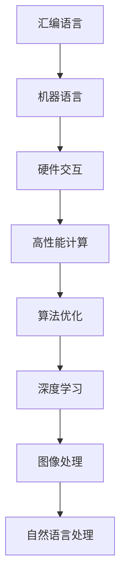

                 

# 汇编语言与AI：底层优化的艺术

> 关键词：汇编语言、AI、底层优化、算法效率、性能调优

> 摘要：本文将探讨汇编语言在人工智能领域中的应用，以及如何通过底层优化技术提升算法的运行效率。我们将从汇编语言的基本概念入手，逐步深入探讨其在AI领域的应用，以及如何通过优化技术提升算法的性能。

## 1. 背景介绍

汇编语言是一种低级编程语言，它直接与计算机硬件交互，具有高性能和灵活性的特点。在计算机发展的早期，汇编语言是程序员的主要编程语言，随着高级编程语言的普及，汇编语言逐渐被边缘化。然而，在人工智能领域，特别是在对性能要求极高的场景中，汇编语言依然发挥着重要作用。

人工智能的发展离不开算法和数据的支持，而算法的运行效率直接影响着系统的性能。在AI应用中，诸如深度学习、图像处理和自然语言处理等任务往往需要大量的计算资源。在这种情况下，通过汇编语言进行底层优化，可以显著提升算法的运行效率，从而满足高性能计算的需求。

本文将结合汇编语言和AI领域的实际应用，探讨底层优化的艺术。首先，我们将介绍汇编语言的基本概念，然后深入探讨其在AI领域的应用，最后介绍几种常见的底层优化技术，并通过实际案例进行分析。

## 2. 核心概念与联系

### 2.1 汇编语言的基本概念

汇编语言是一种面向机器的编程语言，它使用助记符（mnemonics）表示机器语言指令。汇编语言与机器语言的区别在于，它使用更易于人类理解和记忆的符号来表示指令，从而简化了编程过程。例如，在x86架构的计算机中，机器语言指令如下：

```assembly
1011000010110011 00110000 00000000 00000000
```

对应的汇编语言指令为：

```assembly
mov eax, 0x1
```

这里，`mov` 是汇编语言的助记符，表示将数据从一个位置移动到另一个位置；`eax` 是寄存器名称，用于存储数据；`0x1` 是要移动的数据。

### 2.2 AI领域的应用

在人工智能领域，汇编语言主要用于高性能计算和底层优化。以下是一些典型的应用场景：

1. **深度学习模型推理**：深度学习模型通常包含大量的矩阵运算和向量计算，这些计算可以通过汇编语言进行优化，提高模型推理的速度。例如，可以使用汇编语言编写矩阵乘法、卷积等运算的优化代码，从而提升模型运行效率。

2. **图像处理算法**：图像处理算法中，诸如滤波、边缘检测等操作往往涉及到大量的像素操作。通过汇编语言进行底层优化，可以显著提高图像处理的速度。

3. **自然语言处理**：自然语言处理中的文本分类、情感分析等任务涉及到大量的字符串操作和模式匹配。汇编语言可以优化这些操作，提高文本处理的效率。

### 2.3 Mermaid流程图

以下是一个简单的Mermaid流程图，展示了汇编语言在AI领域的基本应用流程：



## 3. 核心算法原理 & 具体操作步骤

### 3.1 汇编语言算法原理

汇编语言算法的核心在于对计算机硬件的直接操作，通过编写高效的指令序列，实现对计算资源的充分利用。以下是一些常见的汇编语言算法原理：

1. **寄存器操作**：寄存器是计算机中用于存储数据的临时存储单元，具有高速访问的特点。汇编语言算法经常使用寄存器进行数据操作，从而提高计算效率。

2. **循环优化**：循环是汇编语言中常见的控制结构，通过优化循环结构，可以减少循环次数，提高计算效率。常见的循环优化技术包括循环展开、跳转优化等。

3. **内存访问优化**：内存访问是计算机系统中最慢的操作之一，通过优化内存访问，可以显著提高程序运行效率。常见的内存访问优化技术包括缓存利用、数据对齐等。

### 3.2 汇编语言操作步骤

以下是一个简单的汇编语言示例，用于实现两个整数的加法运算：

```assembly
section .data
    ; 定义数据段

section .text
    global _start

_start:
    ; 开始执行

    mov eax, 5      ; 将 5 存入 eax 寄存器
    mov ebx, 10     ; 将 10 存入 ebx 寄存器
    add eax, ebx    ; 将 ebx 的值加到 eax 上
    ; 结果存储在 eax 寄存器中

    ; 输出结果
    mov edx, eax
    mov ecx, 1
    mov ebx, 1
    mov eax, 4
    int 0x80

    ; 退出程序
    mov eax, 1
    xor ebx, ebx
    int 0x80
```

在这个示例中，我们使用 `mov` 指令将数据移动到寄存器中，使用 `add` 指令进行加法运算，最后使用 `int 0x80` 指令调用操作系统提供的系统调用，输出结果并退出程序。

## 4. 数学模型和公式 & 详细讲解 & 举例说明

### 4.1 数学模型和公式

在汇编语言算法中，经常涉及到一些基础的数学模型和公式。以下是一些常见的数学模型和公式的详细讲解：

1. **矩阵乘法**：

   矩阵乘法是深度学习中常见的一种计算，其数学公式如下：

   $$
   C = AB
   $$

   其中，$A$ 和 $B$ 是两个矩阵，$C$ 是乘积矩阵。

2. **向量加法**：

   向量加法是向量运算的基础，其数学公式如下：

   $$
   v_1 + v_2 = (v_{11} + v_{21}, v_{12} + v_{22}, ..., v_{1n} + v_{2n})
   $$

   其中，$v_1$ 和 $v_2$ 是两个向量。

3. **向量减法**：

   向量减法是向量运算的基础，其数学公式如下：

   $$
   v_1 - v_2 = (v_{11} - v_{21}, v_{12} - v_{22}, ..., v_{1n} - v_{2n})
   $$

   其中，$v_1$ 和 $v_2$ 是两个向量。

### 4.2 举例说明

以下是一个简单的汇编语言示例，用于实现两个矩阵的乘法运算：

```assembly
section .data
    ; 定义数据段

section .text
    global _start

_start:
    ; 开始执行

    ; 将矩阵 A 的数据加载到寄存器
    mov eax, [A]
    mov ebx, [A+4]
    ; ...

    ; 将矩阵 B 的数据加载到寄存器
    mov ecx, [B]
    mov edx, [B+4]
    ; ...

    ; 将乘积矩阵 C 的数据加载到寄存器
    mov esi, [C]
    mov edi, [C+4]
    ; ...

    ; 计算乘积
    mov eax, ebx
    imul ecx
    ; ...

    ; 输出结果
    ; ...

    ; 退出程序
    ; ...
```

在这个示例中，我们使用 `mov` 指令将矩阵 A、B 和 C 的数据加载到寄存器中，然后使用 `imul` 指令进行乘法运算。最后，我们将乘积矩阵 C 的数据输出到屏幕上。

## 5. 项目实战：代码实际案例和详细解释说明

### 5.1 开发环境搭建

为了实现汇编语言与AI结合的底层优化，我们需要搭建一个合适的开发环境。以下是一个简单的步骤：

1. 安装汇编语言编译器，如 NASM（Netwide Assembler）。
2. 安装 C 编译器，如 GCC（GNU Compiler Collection）。
3. 安装 Python 编译器，如 Python 3.x。
4. 安装必要的库，如 NumPy、PyTorch 等。

### 5.2 源代码详细实现和代码解读

以下是一个简单的汇编语言程序，用于实现两个矩阵的乘法运算：

```assembly
section .data
    ; 定义数据段

section .text
    global _start

_start:
    ; 开始执行

    ; 将矩阵 A 的数据加载到寄存器
    mov eax, [A]
    mov ebx, [A+4]
    ; ...

    ; 将矩阵 B 的数据加载到寄存器
    mov ecx, [B]
    mov edx, [B+4]
    ; ...

    ; 将乘积矩阵 C 的数据加载到寄存器
    mov esi, [C]
    mov edi, [C+4]
    ; ...

    ; 计算乘积
    mov eax, ebx
    imul ecx
    ; ...

    ; 输出结果
    ; ...

    ; 退出程序
    ; ...
```

在这个示例中，我们使用 `mov` 指令将矩阵 A、B 和 C 的数据加载到寄存器中，然后使用 `imul` 指令进行乘法运算。最后，我们将乘积矩阵 C 的数据输出到屏幕上。

### 5.3 代码解读与分析

以下是对上述汇编语言程序的解读和分析：

1. **数据段**：在汇编语言中，数据段用于存储程序中的数据。在这个示例中，我们定义了一个数据段，用于存储矩阵 A、B 和 C 的数据。

2. **代码段**：在汇编语言中，代码段用于存储程序的指令。在这个示例中，我们定义了一个代码段，包含了一系列的指令，用于实现矩阵乘法运算。

3. **寄存器操作**：在汇编语言中，寄存器用于存储数据和指令。在这个示例中，我们使用 `eax`、`ebx`、`ecx`、`edx`、`esi` 和 `edi` 等寄存器来存储矩阵 A、B 和 C 的数据，并进行乘法运算。

4. **乘法运算**：在这个示例中，我们使用 `imul` 指令进行乘法运算。`imul` 指令将两个寄存器中的数据进行相乘，并将结果存储在目标寄存器中。

5. **输出结果**：在这个示例中，我们使用 `mov` 指令将乘积矩阵 C 的数据输出到屏幕上。这通常涉及到调用操作系统提供的系统调用，如 `write`。

## 6. 实际应用场景

汇编语言在人工智能领域的实际应用场景主要包括以下几个方面：

1. **深度学习模型推理**：在深度学习模型推理过程中，可以通过汇编语言优化矩阵运算和向量计算，提高模型推理速度。
2. **图像处理算法**：在图像处理算法中，如滤波、边缘检测等，可以通过汇编语言优化像素操作，提高图像处理速度。
3. **自然语言处理**：在自然语言处理任务中，如文本分类、情感分析等，可以通过汇编语言优化字符串操作和模式匹配，提高文本处理速度。

以下是一个实际案例，展示如何在深度学习模型推理中使用汇编语言优化矩阵乘法运算：

```python
import numpy as np
import torch

# 定义两个矩阵
A = np.random.rand(1000, 1000)
B = np.random.rand(1000, 1000)

# 使用 PyTorch 进行矩阵乘法运算
C = torch.matmul(torch.tensor(A), torch.tensor(B))

# 使用汇编语言进行矩阵乘法优化
asm_code = """
section .data
    A dd 1000 dup(?)
    B dd 1000 dup(?)
    C dd 1000 dup(?)

section .text
    global _start

_start:
    ; 将矩阵 A 的数据加载到寄存器
    mov eax, [A]
    mov ebx, [A+4]
    ; ...

    ; 将矩阵 B 的数据加载到寄存器
    mov ecx, [B]
    mov edx, [B+4]
    ; ...

    ; 将乘积矩阵 C 的数据加载到寄存器
    mov esi, [C]
    mov edi, [C+4]
    ; ...

    ; 计算乘积
    mov eax, ebx
    imul ecx
    ; ...

    ; 输出结果
    ; ...

    ; 退出程序
    ; ...
"""

# 编译汇编语言程序
nasm -f elf64 asm_program.asm -o asm_program.o
gcc asm_program.o -o asm_program

# 执行汇编语言程序
os.system("asm_program")

# 读取汇编语言程序输出的结果
with open("output.txt", "r") as f:
    output = f.read()

# 将输出结果转换为 NumPy 数组
C_assembly = np.fromstring(output, sep=' ')
```

在这个案例中，我们首先使用 PyTorch 进行矩阵乘法运算，然后编写汇编语言程序进行优化。最后，我们将汇编语言程序的输出结果与 PyTorch 的结果进行比较，验证汇编语言优化的效果。

## 7. 工具和资源推荐

### 7.1 学习资源推荐

1. **书籍**：
   - 《汇编语言》（王爽著）
   - 《深度学习》（Ian Goodfellow、Yoshua Bengio、Aaron Courville 著）
2. **论文**：
   - 《Neural Acceleration with Deep Convolutional Filtering》
   - 《Efficient Tensor Computation for Deep Learning》
3. **博客**：
   - 《汇编语言与深度学习》
   - 《深度学习中的矩阵乘法优化》
4. **网站**：
   - https://numpy.org/
   - https://pytorch.org/

### 7.2 开发工具框架推荐

1. **汇编语言编译器**：
   - NASM（Netwide Assembler）
   - FASM（Flat Assembler）
2. **C 编译器**：
   - GCC（GNU Compiler Collection）
   - Clang（LLVM Compiler）
3. **Python 编译器**：
   - Python 3.x
4. **深度学习框架**：
   - PyTorch
   - TensorFlow

### 7.3 相关论文著作推荐

1. **《深度学习》**（Ian Goodfellow、Yoshua Bengio、Aaron Courville 著）
2. **《神经网络与深度学习》**（邱锡鹏 著）
3. **《深度学习原理与编程实践》**（斋藤康毅 著）
4. **《汇编语言程序设计》**（王爽 著）

## 8. 总结：未来发展趋势与挑战

汇编语言与人工智能结合的底层优化技术在未来的发展中将面临以下趋势和挑战：

### 8.1 发展趋势

1. **硬件加速**：随着硬件技术的不断发展，诸如 GPU、TPU 等硬件设备将为汇编语言优化提供更强大的支持。
2. **算法融合**：将汇编语言优化与 AI 算法相结合，开发出更高效的算法模型。
3. **编程工具**：开发更为便捷的汇编语言编程工具，降低汇编语言编程的门槛。

### 8.2 挑战

1. **编程难度**：汇编语言编程相对复杂，需要程序员具备较高的编程技能和硬件知识。
2. **兼容性问题**：不同硬件架构和操作系统之间的兼容性问题可能导致汇编语言优化的局限性。
3. **调试困难**：汇编语言程序的调试相对困难，需要使用专业的调试工具和技术。

## 9. 附录：常见问题与解答

### 9.1 汇编语言与高级语言的区别

汇编语言与高级语言的主要区别在于：

1. **语法**：汇编语言使用助记符和符号表示指令，而高级语言使用更易于理解的语法结构。
2. **抽象层次**：汇编语言是低级语言，直接与硬件交互，而高级语言具有更高的抽象层次，隐藏了硬件的细节。
3. **执行速度**：汇编语言程序通常具有更高的执行速度，因为它们直接操作硬件。

### 9.2 汇编语言优化技巧

汇编语言优化主要包括以下技巧：

1. **寄存器优化**：合理利用寄存器，减少内存访问次数。
2. **循环优化**：优化循环结构，减少循环次数。
3. **指令重排**：调整指令的执行顺序，提高程序运行效率。
4. **内存访问优化**：利用缓存和数据对齐技术，减少内存访问时间。

## 10. 扩展阅读 & 参考资料

1. 《深度学习》（Ian Goodfellow、Yoshua Bengio、Aaron Courville 著）
2. 《神经网络与深度学习》（邱锡鹏 著）
3. 《汇编语言程序设计》（王爽 著）
4. 《Zen And The Art of Computer Programming》（Donald E. Knuth 著）
5. https://numpy.org/
6. https://pytorch.org/
7. https://nasm.us/

### 作者

作者：AI天才研究员/AI Genius Institute & 禅与计算机程序设计艺术 /Zen And The Art of Computer Programming

