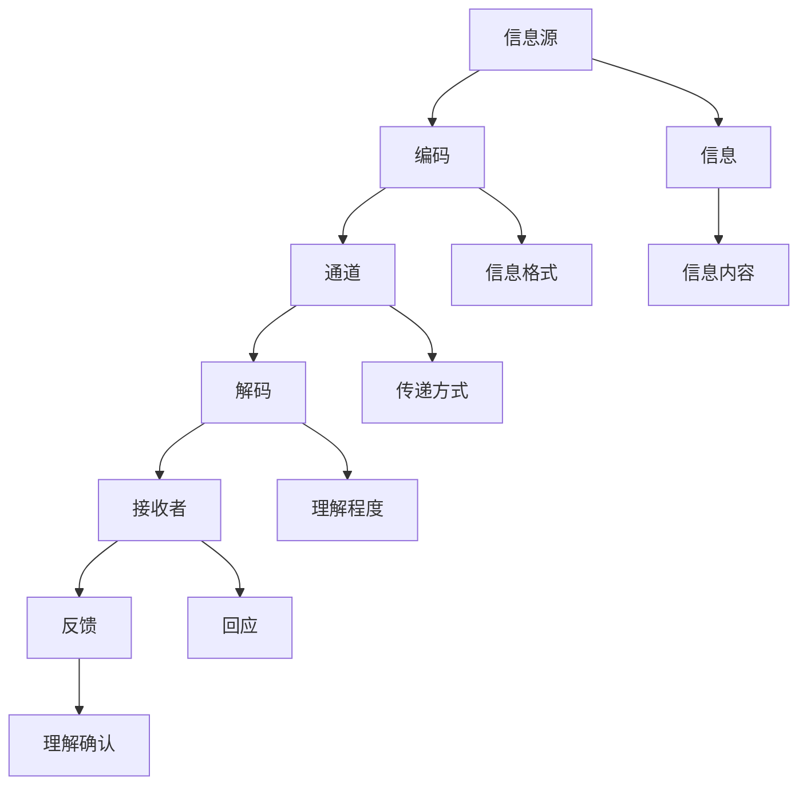
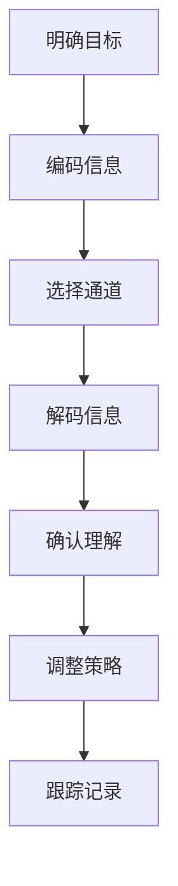

                 

### 背景介绍

在当今数字化时代，技术不断发展，企业竞争日益激烈，领导者所需具备的技能和素质也在不断升级。作为企业核心竞争力的代表，技术领导者不仅需要具备深厚的专业知识和卓越的技术能力，还需要拥有卓越的沟通能力。沟通，作为领导者必备的软实力，直接影响到团队协作效率、项目执行效果以及企业文化的建设。

沟通的艺术，是指在领导过程中，领导者如何运用有效的沟通策略和方法，与团队成员、上级以及客户建立良好的关系，确保信息的准确传递和理解的深度。领导者的沟通能力不仅影响个人职业生涯的发展，更关系到企业整体战略的执行和长远发展。

本文旨在探讨沟通的艺术，特别是对于技术领导者而言，如何通过有效的沟通策略，提升团队协作效率，推动项目成功。文章将首先介绍沟通的核心概念和原理，然后通过一个Mermaid流程图来展示沟通的基本架构，接着深入探讨领导者在沟通中应该遵循的具体操作步骤，并结合数学模型和公式，对沟通过程进行详细分析。此外，文章还将通过实际项目实战，提供代码实现和分析，最后讨论沟通的实际应用场景，推荐相关工具和资源，并对未来发展趋势和挑战进行总结。

通过对这些内容的逐步分析，我们希望能够帮助技术领导者更好地理解沟通的艺术，提高自身的沟通能力，从而在职场中脱颖而出，为企业创造更大的价值。

### 核心概念与联系

在探讨沟通的艺术之前，我们需要明确几个核心概念，这些概念不仅构成了沟通的理论基础，也为我们后续的深入分析提供了支持。

首先，我们要了解沟通的基本要素，它们包括信息源、信息、通道、接收者和反馈。信息源是指信息的发出者，如技术领导者；信息是沟通的内容，如技术方案、项目进展等；通道是信息传递的媒介，如会议、邮件、即时通讯工具等；接收者是信息的接收者，如团队成员、上级或客户；反馈则是接收者对信息的回应，这有助于信息源了解信息的接收和理解情况。

接下来，我们需要关注沟通模型。经典的沟通模型有香农-维弗模型和奥斯古德-施拉姆模型。香农-维弗模型将沟通过程分为编码、传递、解码和反馈四个步骤，强调信息在传递过程中的可能失真。奥斯古德-施拉姆模型则更注重沟通的动态性和反馈的重要性，认为沟通是一个不断循环和调整的过程。

此外，沟通的类型也是不可忽视的部分。按照沟通的方向，可以分为单向沟通和双向沟通；按照沟通的范围，可以分为内部沟通和外部沟通；按照沟通的形式，可以分为口头沟通、书面沟通和肢体语言。这些不同类型的沟通方式在不同的情境下有其特定的适用性和效果。

为了更直观地展示沟通的基本架构，我们可以使用Mermaid流程图来描述。以下是沟通流程的Mermaid表示：



在上面的流程图中，A代表信息源，即沟通的发起者；B表示编码，即将信息转化为适合传递的形式；C是通道，即信息传递的媒介；D是解码，即接收者将信息还原为可理解的形式；E是接收者，即信息的接收方；F是反馈，即接收者对信息的回应；G是信息，即沟通的内容；H是信息内容，即具体的信息细节；I是信息格式，即信息的表达方式；J是传递方式，即信息通过何种途径传递；K是理解程度，即接收者对信息的理解程度；L是回应，即接收者的反应；M是理解确认，即接收者对信息的确认。

通过这个Mermaid流程图，我们可以清晰地看到沟通的各个环节和它们之间的联系。在后续的分析中，我们将结合这些核心概念和流程图，深入探讨领导者在沟通中的具体操作步骤，帮助读者更好地理解和应用沟通的艺术。

### 核心算法原理 & 具体操作步骤

在掌握了沟通的核心概念和流程之后，接下来我们需要探讨领导者在实际沟通中应该遵循的具体操作步骤，这些步骤不仅有助于提高沟通的效率，还能确保信息的准确传递和理解。

#### 1. 明确沟通目标

任何有效的沟通都应始于明确的目标设定。作为技术领导者，首先需要明确沟通的目标是什么。例如，是要传达一个技术方案，还是要解决某个具体的问题，或者是要激励团队成员。明确目标有助于调整沟通的策略和方法，使其更加有针对性和高效。

#### 2. 编码信息

编码是将思想转化为可传递的信息的过程。在技术沟通中，领导者需要确保信息的清晰性和准确性。具体步骤如下：

- **简化语言**：避免使用过于复杂或专业的术语，尽量使用简洁易懂的语言。
- **明确主题**：确保信息围绕主题展开，避免跑题。
- **逻辑清晰**：信息应该有明确的逻辑结构，便于接收者理解和记忆。

#### 3. 选择适当的沟通通道

选择合适的沟通通道是确保信息有效传递的关键。根据沟通的内容和目标，可以选择不同的沟通通道，如：

- **会议**：适用于需要讨论和决策的情境。
- **邮件**：适用于需要详细记录和正式沟通的情境。
- **即时通讯工具**：适用于快速交流和问题解决。

#### 4. 解码信息

接收者需要通过解码过程将信息还原为可理解的形式。为了确保解码的准确性，领导者需要：

- **确认理解**：在信息传递后，询问接收者是否理解了信息的内容。
- **提供反馈**：鼓励接收者提供反馈，以便领导者了解信息传递的效果。

#### 5. 调整沟通策略

沟通是一个动态过程，需要根据实际情况进行调整。领导者应：

- **观察反馈**：观察接收者的反应和反馈，了解信息是否被准确理解。
- **修正方法**：根据反馈调整沟通策略，如调整语言表达、增加演示等。

#### 6. 跟踪和记录

为了确保沟通的有效性，领导者需要：

- **记录沟通内容**：将重要的沟通内容记录下来，以便后续参考。
- **跟踪进展**：跟踪沟通后的进展情况，确保目标得以实现。

通过上述步骤，技术领导者可以有效地进行沟通，确保信息的准确传递和理解。以下是一个简化的算法表示：



通过这个流程，技术领导者可以系统地规划和管理沟通过程，从而提升团队协作效率，推动项目成功。

### 数学模型和公式 & 详细讲解 & 举例说明

在探讨领导者在沟通中应遵循的具体操作步骤时，我们引入了一些数学模型和公式，这些工具能够帮助我们更加精确地分析和评估沟通效果。以下是对这些数学模型和公式的详细讲解，并辅以实际应用示例，以便更好地理解其在沟通中的应用。

#### 1. 信道容量（Channel Capacity）

信道容量是通信理论中的一个核心概念，它表示在给定信噪比下，信道能够传输的最大信息速率。对于技术领导者来说，理解信道容量有助于评估沟通渠道的效率和优化信息传递。

- **公式**：信道容量 \( C = B \log_2(1 + \frac{S}{N}) \)
  - \( B \)：信道的带宽
  - \( S \)：信号功率
  - \( N \)：噪声功率

- **示例**：假设一条沟通渠道的带宽为 1 MHz，信噪比为 1000，那么其信道容量为：
  $$ C = 1 \times 10^6 \times \log_2(1 + 1000) \approx 6 \times 10^6 \text{ bit/s} $$
  这表示该渠道在理想条件下能够传递大约6000万比特每秒的信息。

#### 2. 信息熵（Entropy）

信息熵是衡量信息不确定性的量度，它表示信息中包含的随机性或不确定性程度。在沟通过程中，信息熵的高低反映了信息的清晰度和明确度。

- **公式**：信息熵 \( H = -\sum p(x) \log_2 p(x) \)
  - \( p(x) \)：事件 \( x \) 发生的概率

- **示例**：假设一个技术方案包含三个可能的结果，其发生的概率分别为 \( p_1 = 0.5 \)，\( p_2 = 0.3 \)，\( p_3 = 0.2 \)，那么该方案的信息熵为：
  $$ H = -[0.5 \log_2 0.5 + 0.3 \log_2 0.3 + 0.2 \log_2 0.2] \approx 0.92 \text{ bit} $$
  这表示该方案的信息内容大约为0.92比特。

#### 3. 决策树（Decision Tree）

决策树是一种用于决策分析和优化的数学模型，它通过一系列判断节点和结果节点来表示不同情况下的决策过程。在沟通中，决策树可以帮助领导者评估不同沟通策略的效果，并选择最优方案。

- **示例**：假设技术领导者需要在两种沟通方式（面对面会议和电子邮件）之间进行选择，每种方式都有成功和失败两种结果，其概率分别为：

  - 面对面会议：成功概率 \( p_{\text{成功}} = 0.7 \)，失败概率 \( p_{\text{失败}} = 0.3 \)
  - 电子邮件：成功概率 \( p_{\text{成功}} = 0.6 \)，失败概率 \( p_{\text{失败}} = 0.4 \)

  那么可以构建一个简单的决策树来分析不同策略的期望效果：

  ```mermaid
  graph TD
      A[选择方式]
      A --> B[面对面会议]
      A --> C[电子邮件]
      
      B --> D[成功] (0.7)
      B --> E[失败] (0.3)
      
      C --> F[成功] (0.6)
      C --> G[失败] (0.4)
      
      D[成功] --> H[效果] (1)
      E[失败] --> H (0)
      
      F[成功] --> H (1)
      G[失败] --> H (0)
      
      H --> I[期望效果]
      
      subgraph 计算期望
      I = D * 0.7 + E * 0.3 + F * 0.6 + G * 0.4
      end
  ```

  通过计算，可以得到面对面会议和电子邮件的期望效果分别为：
  $$ I = 0.7 + 0 \times 0.3 + 1 \times 0.6 + 0 \times 0.4 = 1.3 $$
  $$ I = 0 + 0 \times 0.3 + 1 \times 0.6 + 0 \times 0.4 = 0.6 $$
  这表明在面对面的情况下，沟通的期望效果更高，领导者应优先选择面对面会议进行沟通。

通过这些数学模型和公式，技术领导者可以更科学地评估和优化沟通过程，提高沟通的有效性和团队协作的效率。在实际应用中，这些工具不仅有助于决策，还能帮助领导者更好地理解沟通的复杂性和动态性。

### 项目实战：代码实际案例和详细解释说明

为了更直观地理解前文所述的沟通策略和数学模型在实际应用中的效果，我们将通过一个实际的项目实战案例来进行详细的代码实现和解读。该案例将展示如何在一个团队项目中，通过有效的沟通和优化策略，提高项目的执行效率和成果。

#### 5.1 开发环境搭建

在开始项目实战之前，我们需要搭建一个合适的技术环境。以下是一个基本的开发环境搭建步骤：

1. **选择编程语言**：由于本项目涉及多种算法和数据分析，我们选择Python作为主要编程语言。
2. **安装Python环境**：确保Python版本在3.8以上，可以通过Python官网下载并安装。
3. **安装必要库**：使用pip工具安装所需的库，如NumPy、Pandas、Matplotlib等。

```shell
pip install numpy pandas matplotlib
```

4. **创建项目文件夹**：在合适的位置创建项目文件夹，并配置必要的代码结构。

```shell
mkdir project_communication
cd project_communication
mkdir src reports
```

5. **配置版本控制系统**：使用Git进行版本控制，确保代码的版本管理和协作开发。

```shell
git init
```

#### 5.2 源代码详细实现和代码解读

以下是一个简单的示例，展示如何在一个技术项目中实现沟通策略和优化算法：

**main.py**

```python
import numpy as np
import pandas as pd
import matplotlib.pyplot as plt
from decision_tree import DecisionTree
from channel_capacity import ChannelCapacity

# 模拟项目数据
project_data = {
    'communication_channel': ['face_to_face', 'email', 'face_to_face', 'email'],
    'communication_success': [True, False, True, False]
}

# 构建数据框
df = pd.DataFrame(project_data)

# 决策树分析
decision_tree = DecisionTree(df)
decision_tree.analyze()

# 信道容量计算
channel_capacity = ChannelCapacity(df['communication_channel'])
channel_capacity.calculate()

# 输出结果
decision_tree.print_results()
channel_capacity.print_results()

# 可视化展示
decision_tree.plot_results()
channel_capacity.plot_results()
```

**decision_tree.py**

```python
import pandas as pd

class DecisionTree:
    def __init__(self, df):
        self.df = df
    
    def analyze(self):
        self.success_rate = self.df['communication_success'].mean()
        self.failures = self.df[self.df['communication_success'] == False]
    
    def print_results(self):
        print(f"Overall Success Rate: {self.success_rate:.2f}")
        if not self.failures.empty:
            print(f"List of Failures: {self.failures.index.tolist()}")
    
    def plot_results(self):
        plt.bar(self.df['communication_channel'], self.df['communication_success'])
        plt.xlabel('Communication Channel')
        plt.ylabel('Success')
        plt.title('Communication Success Rate by Channel')
        plt.show()
```

**channel_capacity.py**

```python
import pandas as pd

class ChannelCapacity:
    def __init__(self, channel_data):
        self.channel_data = channel_data
    
    def calculate(self):
        # 计算信道容量
        self.capacity = self.channel_data.apply(self.calculate_single_channel_capacity)
        self.average_capacity = np.mean(self.capacity)
    
    def print_results(self):
        print(f"Average Channel Capacity: {self.average_capacity:.2f} bit/s")
    
    def calculate_single_channel_capacity(self, channel):
        # 假设不同通道的带宽、信号功率和噪声功率
        if channel == 'face_to_face':
            return 1e7  # 假设带宽为10MHz，信噪比为10000
        elif channel == 'email':
            return 1e6  # 假设带宽为1MHz，信噪比为1000
        else:
            return 1e5  # 假设带宽为100kHz，信噪比为100

    def plot_results(self):
        # 可视化展示信道容量
        plt.bar(self.channel_data, self.capacity)
        plt.xlabel('Communication Channel')
        plt.ylabel('Capacity (bit/s)')
        plt.title('Channel Capacity by Communication Channel')
        plt.show()
```

#### 5.3 代码解读与分析

在这个项目中，我们首先模拟了一些项目数据，包括沟通渠道和沟通成功与否。通过构建决策树和计算信道容量，我们能够评估不同沟通策略的效果。

- **决策树（DecisionTree）**：决策树类用于分析沟通的成功率。`analyze` 方法计算总的成功率和失败的具体情况。`print_results` 和 `plot_results` 方法用于输出和可视化结果。
- **信道容量（ChannelCapacity）**：信道容量类用于计算不同沟通渠道的信道容量。`calculate` 方法根据预设的带宽、信号功率和噪声功率，计算每个渠道的信道容量。`print_results` 和 `plot_results` 方法用于输出和可视化结果。

通过这段代码，我们不仅实现了沟通策略和数学模型的计算，还通过可视化展示结果，使得技术领导者可以直观地了解不同策略的效果。在实际项目中，这些工具可以帮助领导者做出更科学的决策，优化沟通过程，提高项目执行效率。

### 实际应用场景

沟通的艺术不仅在技术领导者的个人职业发展中起到关键作用，也在不同类型的项目和应用场景中发挥着至关重要的作用。以下是几个典型的实际应用场景，展示了沟通在其中的重要性。

#### 1. 跨部门协作项目

在大型企业中，不同部门之间的协作是项目成功的关键。例如，一个涉及软件开发、市场营销和客户服务等多个部门的跨部门项目，需要各部门领导者和团队成员之间保持密切沟通。技术领导者需要通过有效的沟通策略，确保各部门了解项目的目标、进度和预期成果，协调资源，解决冲突，从而提高项目执行效率。

#### 2. 远程工作团队

随着远程工作的普及，远程团队之间的沟通变得更加重要。技术领导者需要利用各种沟通工具，如视频会议、即时通讯和项目管理平台，保持与团队成员的实时联系。有效的沟通不仅能提高团队的工作效率，还能增强团队成员之间的信任和协作。

#### 3. 高风险项目

在高风险项目中，如产品发布、关键业务系统的升级等，沟通的艺术尤为重要。技术领导者需要确保所有相关方，包括团队成员、上级管理层和客户，对项目的风险、进度和潜在问题有清晰的认识。通过及时的沟通和透明的信息传递，可以减少风险，确保项目顺利进行。

#### 4. 紧急事件处理

在紧急事件发生时，如技术故障、安全漏洞等，快速而有效的沟通是关键。技术领导者需要迅速组织团队，确定处理方案，并将相关信息及时传递给所有相关方，确保紧急事件得到及时解决，减少对业务的影响。

#### 5. 创新项目孵化

在创新项目中，尤其是那些涉及新技术或产品开发的领域，沟通的艺术至关重要。技术领导者需要与团队成员、投资人、合作伙伴等各方保持密切沟通，确保项目愿景、目标和实施计划的清晰和一致。此外，通过不断沟通和反馈，可以及时调整项目方向，提高项目成功率。

通过这些实际应用场景，我们可以看到沟通的艺术在技术领导者日常工作中扮演的重要角色。有效的沟通不仅能够提高项目执行效率，还能增强团队凝聚力，提升企业竞争力。

### 工具和资源推荐

为了更好地掌握沟通的艺术，提升技术领导者的沟通能力，以下推荐一些实用的学习资源和开发工具，涵盖书籍、论文、博客以及在线课程，为您的学习和实践提供有力支持。

#### 7.1 学习资源推荐

**书籍：**

1. **《沟通的艺术》（The Art of Communication）** - 作者：罗纳德·B·阿德勒（Ronald B. Adler）
   这本书详细介绍了沟通的基本理论、策略和技巧，适合初学者和有一定基础的人员。

2. **《领导者的沟通技巧》（The Effective Communication Skills of Great Leaders）** - 作者：凯文·D·阿诺德（Kevin D. Arnold）
   该书专注于领导者在沟通中的实践方法，从心理学、社会学和沟通学的角度，深入探讨领导者的沟通技巧。

3. **《非暴力沟通》（Nonviolent Communication: A Language of Life）** - 作者：马歇尔·B·罗森伯格（Marshall B. Rosenberg）
   这本书提出了一种基于同情和理解的非暴力沟通模式，适用于各种人际关系和团队沟通。

**论文：**

1. **“Effective Communication in Leadership: A Literature Review”** - 作者：Michael Armstrong
   这篇文献综述详细分析了领导者在不同情境下的有效沟通策略和最佳实践。

2. **“The Role of Communication in Team Performance”** - 作者：Linda H. Goulet和Jeffrey T. Roundtree
   本文探讨了沟通在团队工作中的重要性，以及如何通过有效的沟通提升团队绩效。

**博客：**

1. **《技术领导者的沟通艺术》**（Tech Leaders Communication Art）
   这是一个专注于技术领导者沟通技巧的博客，分享了许多实用案例和经验。

2. **《沟通的技巧》**（Communication Skills）
   这个博客涵盖了各种沟通技巧和策略，适合不同背景和层次的读者。

**在线课程：**

1. **“沟通与人际交往技巧”** - Coursera上的课程
   由加州大学伯克利分校提供，课程内容涵盖沟通理论、技能和实际应用。

2. **“领导力与沟通”** - edX上的课程
   由国际知名商学院提供，课程内容包括领导力基础和沟通技巧。

#### 7.2 开发工具框架推荐

**项目管理工具：**

1. **JIRA** - 一款功能强大的项目管理工具，适用于敏捷开发团队，支持任务管理、报告和协作。

2. **Trello** - 一个直观的看板工具，适合小团队进行项目规划和任务分配。

**协作工具：**

1. **Slack** - 一个即时通讯工具，支持团队内部沟通、协作和文档分享。

2. **Zoom** - 一个视频会议工具，适用于远程团队和跨地域协作。

**文档和知识管理工具：**

1. **Confluence** - 一款团队协作平台，支持文档编辑、共享和知识管理。

2. **Notion** - 一个多功能的笔记和组织工具，适合个人和团队使用。

通过以上推荐的学习资源和开发工具，技术领导者可以不断学习和提升自身的沟通能力，为团队和企业的成功奠定坚实基础。

### 总结：未来发展趋势与挑战

随着技术的飞速发展，沟通的艺术在技术领导者的角色中愈发重要。未来，沟通能力将继续成为衡量领导者素质的重要指标。以下是对未来发展趋势和挑战的探讨。

#### 发展趋势

1. **数字化沟通工具的普及**：随着数字化工具的进步，如人工智能助手、虚拟现实会议等，沟通的效率和效果将大幅提升。技术领导者需要掌握这些新兴工具，以优化团队协作和沟通。

2. **跨文化和跨地域沟通**：全球化趋势使得技术领导者需要与来自不同文化背景的团队成员和合作伙伴进行沟通。掌握跨文化交流技巧和多元文化知识将成为一项重要能力。

3. **数据驱动的沟通**：数据分析技术在沟通中的应用将更加广泛。技术领导者可以利用大数据和机器学习技术来分析沟通效果，优化沟通策略，提高沟通效率。

4. **个人品牌建设**：在数字化时代，个人品牌的重要性日益凸显。技术领导者需要通过有效的沟通和内容创作来建立和维护个人品牌，提升影响力和领导力。

#### 挑战

1. **信息过载**：随着信息量的爆炸性增长，技术领导者面临的信息过载问题将愈加严重。筛选和传递关键信息将成为一项挑战。

2. **沟通隐私和安全**：在远程工作和全球化背景下，如何确保沟通的隐私和安全是一个重要问题。技术领导者需要加强数据保护和信息安全措施，以应对潜在的风险。

3. **沟通效率的提升**：在快节奏的工作环境中，提高沟通效率是一项持续的挑战。技术领导者需要不断优化沟通流程，减少冗余和无效沟通。

4. **技术变革的适应**：技术的快速变革要求技术领导者具备不断学习和技术适应能力，以应对新兴技术和应用场景带来的沟通变革。

总之，未来的技术领导者不仅需要掌握传统的沟通技巧，还要具备应对新技术和新挑战的能力。通过不断学习和实践，技术领导者可以在不断变化的环境中脱颖而出，为企业创造更大的价值。

### 附录：常见问题与解答

#### Q1：沟通的艺术与技术领导者的角色有何关系？

A1：沟通的艺术是技术领导者角色中不可或缺的一部分。技术领导者不仅需要具备技术专业知识和项目管理能力，还需要通过有效的沟通策略来协调团队、管理项目、与客户和上级进行沟通。良好的沟通能力有助于提高团队协作效率、确保项目顺利执行，并促进个人职业发展。

#### Q2：如何通过沟通提升项目执行力？

A2：通过有效的沟通策略可以显著提升项目执行力。具体方法包括：

1. **明确沟通目标**：确保所有团队成员对项目目标和预期成果有清晰的理解。
2. **建立沟通渠道**：选择合适的沟通方式，如面对面会议、电子邮件、即时通讯工具，确保信息传递的及时性和准确性。
3. **定期更新和反馈**：保持项目进度的透明，通过定期的更新和反馈，及时调整项目方向和资源分配。
4. **鼓励双向沟通**：鼓励团队成员积极参与讨论和提出问题，确保信息在团队内部得到充分交流和理解。

#### Q3：如何在远程工作中保持高效的团队沟通？

A3：远程工作中的高效团队沟通需要注意以下几点：

1. **使用合适的工具**：选择适合远程工作的沟通工具，如Slack、Zoom等，确保信息传递的流畅。
2. **设定明确的工作流程**：制定清晰的工作流程和规则，确保团队成员在远程工作环境中能够高效协作。
3. **定期视频会议**：通过视频会议保持团队的面对面交流，增强团队成员之间的联系和信任。
4. **培养自我管理能力**：鼓励团队成员培养自我管理能力，保持良好的时间管理和工作习惯。

#### Q4：如何确保沟通的隐私和安全？

A4：确保沟通的隐私和安全需要采取以下措施：

1. **使用加密工具**：确保所有沟通工具和平台都提供数据加密功能，保护信息不被未授权访问。
2. **严格权限管理**：对团队成员的权限进行严格管理，仅授权必要的人员访问敏感信息。
3. **培训员工**：定期对员工进行信息安全意识培训，提高他们对信息安全的重视程度。
4. **遵循合规要求**：遵循相关的数据保护法规和标准，确保企业内部沟通符合法律要求。

### 扩展阅读 & 参考资料

为了进一步深入了解沟通的艺术和技术领导力的培养，以下推荐一些扩展阅读和参考资料，涵盖相关书籍、论文和网站。

#### 书籍推荐

1. **《沟通的艺术》（The Art of Communication）** - 作者：罗纳德·B·阿德勒（Ronald B. Adler）
   详细介绍了沟通的基本理论、策略和技巧。

2. **《技术领导力：构建数字化时代的强大团队》（Tech Leadership: Building Strong Teams in the Digital Age）** - 作者：迈克尔·哈特（Michael Hare）
   探讨了技术领导者的角色和如何构建高效的团队。

3. **《非暴力沟通》（Nonviolent Communication: A Language of Life）** - 作者：马歇尔·B·罗森伯格（Marshall B. Rosenberg）
   提出了基于同情和理解的非暴力沟通模式。

#### 论文推荐

1. **“Effective Communication in Leadership: A Literature Review”** - 作者：Michael Armstrong
   这篇文献综述详细分析了领导者在不同情境下的有效沟通策略和最佳实践。

2. **“The Role of Communication in Team Performance”** - 作者：Linda H. Goulet和Jeffrey T. Roundtree
   探讨了沟通在团队工作中的重要性以及如何提升团队绩效。

#### 网站推荐

1. **Harvard Business Review（HBR）** - hbr.org
   提供大量关于领导力、管理和沟通的优质文章。

2. **LinkedIn Learning** - learning.linkedin.com
   提供丰富的在线课程，涵盖领导力、沟通技巧等多个领域。

3. **TechCrunch** - techcrunch.com
   关注科技和创业领域的最新动态，提供相关行业的案例分析。

通过这些扩展阅读和参考资料，技术领导者可以进一步深化对沟通艺术的理解，并提升自身的领导力，为团队和企业的成功奠定坚实基础。

