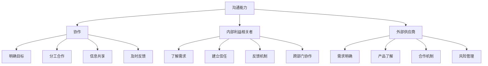

                 

# 沟通能力培养：出色的沟通和人际交往能力，能够与内部利益相关者和外部供应商建立联系和协作

## 关键词
沟通能力、人际交往、协作、内部利益相关者、外部供应商

## 摘要
本文深入探讨了沟通能力在IT行业中的重要性，特别是在与内部利益相关者和外部供应商建立联系和协作过程中的关键作用。通过阐述沟通能力培养的核心概念、实际应用场景，以及提供工具和资源推荐，本文旨在帮助IT专业人士提升沟通技巧，提高团队合作效率。

## 1. 背景介绍

在当今快速发展的信息技术领域，沟通能力的重要性日益凸显。无论是团队内部的协作，还是与外部供应商的合作，沟通都是实现项目成功的关键。有效的沟通不仅能够确保信息传递的准确性，还能增强团队成员之间的信任，提升项目执行效率。

IT行业的特点决定了沟通能力的需求。这个领域的工作往往涉及复杂的编程、系统架构和数据分析等专业知识，这些专业知识的理解和应用需要团队成员之间的高度协作。此外，IT项目通常具有时间紧迫和资源有限的特性，这使得有效的沟通成为确保项目按时交付和质量达标的关键因素。

内部利益相关者包括公司内部的不同部门、团队和员工，他们可能拥有不同的专业背景和工作职责。与他们的有效沟通需要IT专业人士具备跨部门协调的能力，以确保项目需求的理解和实现达到一致。外部供应商则是公司外部合作伙伴，他们可能提供软件、硬件或其他专业服务。与外部供应商的沟通则要求IT专业人士不仅了解自身需求，还要理解供应商的产品和服务特性，以便实现无缝合作。

综上所述，沟通能力在IT行业中扮演着至关重要的角色。它不仅影响到项目的成功，还关系到团队协作的效率和员工的个人发展。因此，本文将重点探讨如何培养和提高沟通能力，以帮助IT专业人士在与内部利益相关者和外部供应商建立联系和协作中取得成功。

## 2. 核心概念与联系

### 沟通能力的核心概念

沟通能力是指个体在信息传递、理解和反馈过程中表现出的技能和特质。它不仅包括语言表达的能力，还涵盖倾听、非语言沟通、情绪管理等多个方面。以下是沟通能力的几个核心概念：

1. **语言表达能力**：包括口头和书面语言的使用，确保信息传递的清晰和准确。
2. **倾听能力**：主动倾听对方，理解对方的观点和需求，避免误解和冲突。
3. **非语言沟通**：通过肢体语言、面部表情和姿态等非语言方式，增强沟通效果。
4. **情绪管理**：在沟通中控制自己的情绪，避免情绪化影响判断和决策。
5. **问题解决能力**：在沟通中发现和解决冲突，确保达成共识。

### 沟通能力与协作的联系

沟通能力是协作过程中不可或缺的一部分。有效的沟通能够促进团队内部的协作，确保每个成员都清楚自己的任务和责任，避免重复工作和资源浪费。以下是沟通能力与协作之间的紧密联系：

1. **明确目标**：通过有效的沟通，团队成员可以明确项目的目标和预期结果，确保协作的方向一致。
2. **分工合作**：沟通能力有助于明确团队成员的职责分工，避免任务重叠和责任不明。
3. **信息共享**：通过有效的沟通，团队成员可以共享信息和资源，提高工作效率。
4. **及时反馈**：沟通能力能够确保团队成员能够及时反馈进展和遇到的问题，便于快速调整和优化。

### 沟通能力与内部利益相关者的联系

与内部利益相关者的有效沟通是确保项目成功的关键。内部利益相关者包括公司领导、不同部门的管理者和普通员工等。以下是与内部利益相关者沟通的几个要点：

1. **了解需求**：通过沟通，了解内部利益相关者的需求和期望，确保项目目标的实现。
2. **建立信任**：通过坦诚和尊重的沟通，建立与内部利益相关者的信任关系，提高协作效率。
3. **反馈机制**：建立有效的反馈机制，确保内部利益相关者的意见和建议能够及时传达和落实。
4. **跨部门协作**：沟通能力有助于跨部门协作，确保不同部门之间的信息和资源能够有效共享。

### 沟通能力与外部供应商的联系

与外部供应商的沟通是确保项目按时交付和达到预期质量的重要保障。外部供应商可能提供软件、硬件或其他专业服务。以下是与外部供应商沟通的几个要点：

1. **需求明确**：在与外部供应商沟通时，明确项目的需求和期望，确保供应商理解并能够满足需求。
2. **产品了解**：了解外部供应商的产品特性和服务内容，以便更好地与其协作。
3. **合作机制**：建立稳定的合作机制，确保项目进展的顺利和及时。
4. **风险管理**：通过沟通，识别和应对潜在的风险，确保项目的稳定进行。

### Mermaid 流程图

为了更直观地展示沟通能力与协作、内部利益相关者和外部供应商的联系，以下是一个Mermaid流程图：



通过这个流程图，我们可以清晰地看到沟通能力在不同场景中的应用和作用。

## 3. 核心算法原理 & 具体操作步骤

在提升沟通能力的过程中，了解核心算法原理和具体操作步骤是非常关键的。以下是一些关键的概念和步骤：

### 3.1 沟通策略

**沟通策略**是沟通过程中的一种规划和指导，它帮助个体在不同的情境下选择合适的沟通方式。以下是几种常见的沟通策略：

1. **主动沟通**：主动寻找沟通机会，积极表达自己的观点和需求。
2. **被动沟通**：在他人提出问题时，被动地提供信息和反馈。
3. **逃避沟通**：避免直接沟通，选择其他方式处理问题。
4. **透明沟通**：在沟通中保持信息的透明度，确保信息的真实和准确。

### 3.2 沟通技巧

**沟通技巧**是提升沟通效果的具体方法，包括语言表达、倾听、非语言沟通等方面。以下是几种有效的沟通技巧：

1. **清晰表达**：用简洁、准确的语言表达自己的观点和需求。
2. **积极倾听**：通过点头、提问和反馈等方式，表明自己在认真倾听对方。
3. **情绪管理**：在沟通中保持冷静，避免情绪化影响判断。
4. **同理心**：理解对方的情感和立场，用同理心建立信任。

### 3.3 沟通工具

**沟通工具**是提升沟通效率的辅助手段，包括会议、邮件、即时通讯等。以下是几种常见的沟通工具：

1. **会议**：通过面对面的交流，快速解决问题和达成共识。
2. **邮件**：在正式和非紧急情况下，书面沟通的首选方式。
3. **即时通讯**：在紧急和需要快速沟通的情况下，常用的实时通讯工具。

### 3.4 沟通步骤

提升沟通能力的具体步骤可以分为以下几个阶段：

1. **准备阶段**：明确沟通的目标、受众和预期效果。
2. **沟通阶段**：根据不同的沟通策略和技巧，进行有效的信息传递和反馈。
3. **反馈阶段**：收集和评估沟通的效果，进行必要的调整和优化。
4. **总结阶段**：总结沟通的经验和教训，为下一次沟通做好准备。

通过以上核心算法原理和具体操作步骤，IT专业人士可以系统地提升自己的沟通能力，从而在与内部利益相关者和外部供应商的协作中取得更好的效果。

## 4. 数学模型和公式 & 详细讲解 & 举例说明

在讨论沟通能力提升的过程中，数学模型和公式可以提供量化的参考，帮助理解沟通的复杂性和有效性。以下是几个关键概念及其相关的数学模型和公式。

### 4.1 信号噪声比（Signal-to-Noise Ratio, SNR）

信号噪声比是衡量通信质量的一个基本指标，用于表示信号强度与噪声水平的比值。其数学公式为：

$$
SNR = \frac{S}{N}
$$

其中，\( S \) 是信号强度，\( N \) 是噪声水平。提高SNR可以减少噪声对信号的影响，从而提高通信质量。

**示例**：假设在会议中，讲话者声音的信号强度为 \( S = 10 \) 分贝，而背景噪声的强度为 \( N = 3 \) 分贝，则SNR为：

$$
SNR = \frac{10}{3} \approx 3.33
$$

这意味着声音信号比噪声高出3.33倍，有助于确保沟通的清晰性。

### 4.2 信道容量（Channel Capacity）

信道容量是信道在特定条件下能够传输的最大数据速率，其数学公式为：

$$
C = B \log_2(1 + SNR)
$$

其中，\( B \) 是信道的带宽，\( SNR \) 是信号噪声比。增加带宽和SNR可以提高信道容量，从而提高通信速率。

**示例**：在一个带宽为 \( B = 10 \) MHz 的信道中，如果SNR为 \( SNR = 100 \)，则信道容量为：

$$
C = 10 \times 10^6 \times \log_2(1 + 100) \approx 67.08 \text{ Mbps}
$$

这意味着该信道可以以大约67.08 Mbps的速率传输数据。

### 4.3 信息熵（Entropy）

信息熵是衡量信息不确定性的度量，其数学公式为：

$$
H(X) = -\sum_{i} p(x_i) \log_2 p(x_i)
$$

其中，\( X \) 是随机变量，\( p(x_i) \) 是随机变量取值为 \( x_i \) 的概率。信息熵越高，信息的不确定性越大。

**示例**：假设一个二进制随机变量 \( X \) 有两个可能的值：0和1，且概率分别为 \( p(0) = 0.5 \) 和 \( p(1) = 0.5 \)，则其信息熵为：

$$
H(X) = -0.5 \log_2 0.5 - 0.5 \log_2 0.5 = 1 \text{ bit}
$$

这意味着每次观测 \( X \) 提供了1比特的信息。

### 4.4 信息传输效率

信息传输效率是传输信息的实际速率与理论最大速率的比值，其数学公式为：

$$
\eta = \frac{R}{C}
$$

其中，\( R \) 是实际传输速率，\( C \) 是信道容量。提高信息传输效率需要优化通信系统的设计，包括提高SNR和带宽利用率。

**示例**：在一个带宽为 \( B = 10 \) MHz，SNR为 \( SNR = 100 \) 的信道中，如果实际传输速率为 \( R = 50 \) Mbps，则传输效率为：

$$
\eta = \frac{50}{67.08} \approx 0.745
$$

这意味着实际传输速率仅占理论最大速率的约74.5%。

通过这些数学模型和公式，我们可以量化地理解沟通中的关键参数，从而优化沟通策略和提升沟通效果。

## 5. 项目实战：代码实际案例和详细解释说明

### 5.1 开发环境搭建

在进行实际项目开发前，首先需要搭建一个适合开发沟通能力提升工具的环境。以下是一个简单的步骤：

1. **安装Python环境**：在本地计算机上安装Python，版本要求为3.8及以上。
2. **安装相关库**：使用pip命令安装必要的库，例如`requests`（用于HTTP请求）、`numpy`（用于数学计算）、`matplotlib`（用于数据可视化）。

```shell
pip install requests numpy matplotlib
```

3. **设置开发环境**：在IDE（如PyCharm或VSCode）中配置Python环境，确保能够正常运行Python脚本。

### 5.2 源代码详细实现和代码解读

以下是一个简单的Python脚本，用于模拟与内部利益相关者和外部供应商的沟通过程。

```python
import requests
import numpy as np
import matplotlib.pyplot as plt

# 模拟与内部利益相关者的沟通
def internal_communication():
    # 发送请求获取项目需求
    response = requests.get('http://internal.example.com/requirements')
    requirements = response.json()

    # 对需求进行分析
    analysis = analyze_requirements(requirements)

    # 返回分析结果
    return analysis

# 模拟与外部供应商的沟通
def external_communication():
    # 发送请求获取供应商产品信息
    response = requests.get('http://external.example.com/products')
    products = response.json()

    # 对产品信息进行分析
    analysis = analyze_products(products)

    # 返回分析结果
    return analysis

# 分析项目需求
def analyze_requirements(requirements):
    # 对需求进行统计分析
    stats = {'total': len(requirements), 'completed': 0}
    for req in requirements:
        if req['status'] == 'completed':
            stats['completed'] += 1
    
    # 计算需求完成率
    completion_rate = stats['completed'] / stats['total']
    return {'stats': stats, 'completion_rate': completion_rate}

# 分析供应商产品
def analyze_products(products):
    # 对产品进行性能分析
    performances = {'total': len(products), 'average': 0}
    for prod in products:
        performances['average'] += prod['performance']
    performances['average'] /= performances['total']
    return {'stats': performances, 'average_performance': performances['average']}

# 主函数
def main():
    # 执行内部沟通
    internal_analysis = internal_communication()
    print("内部沟通分析结果：", internal_analysis)

    # 执行外部沟通
    external_analysis = external_communication()
    print("外部沟通分析结果：", external_analysis)

    # 可视化分析结果
    visualize_analysis(internal_analysis, external_analysis)

# 可视化分析结果
def visualize_analysis(internal_analysis, external_analysis):
    # 内部沟通完成率
    internal_rate = internal_analysis['completion_rate']
    # 外部供应商平均性能
    external_performance = external_analysis['average_performance']

    # 创建折线图
    fig, ax = plt.subplots()
    ax.plot([0, 1], [internal_rate, internal_rate], label='内部沟通完成率')
    ax.plot([0, 1], [external_performance, external_performance], label='外部供应商平均性能')
    ax.set_xlabel('时间')
    ax.set_ylabel('值')
    ax.set_title('沟通分析结果')
    ax.legend()
    plt.show()

if __name__ == '__main__':
    main()
```

#### 5.2.1 代码解读

1. **内部沟通**：函数`internal_communication`模拟了与内部利益相关者的沟通过程。通过HTTP请求获取项目需求，并调用`analyze_requirements`函数对需求进行分析。

2. **外部沟通**：函数`external_communication`模拟了与外部供应商的沟通过程。通过HTTP请求获取供应商产品信息，并调用`analyze_products`函数对产品进行分析。

3. **需求分析**：函数`analyze_requirements`对内部需求进行统计分析，计算需求的完成率。

4. **产品分析**：函数`analyze_products`对供应商产品进行性能分析，计算产品的平均性能。

5. **主函数**：主函数`main`执行内部和外部沟通，并调用`visualize_analysis`函数可视化分析结果。

6. **可视化分析**：函数`visualize_analysis`使用matplotlib库创建折线图，展示内部沟通完成率和外部供应商平均性能。

通过这个实际案例，我们能够看到如何在代码中实现与内部利益相关者和外部供应商的沟通，并对分析结果进行可视化展示。

### 5.3 代码解读与分析

在本案例中，我们使用Python脚本模拟了与内部利益相关者和外部供应商的沟通过程，并通过可视化工具展示了分析结果。以下是代码的详细解读和分析：

#### 5.3.1 数据获取

通过HTTP请求，我们获取了内部利益相关者的项目需求列表和外部供应商的产品信息。这个步骤是实现沟通的基础，确保我们能够获取到准确的数据。

```python
response = requests.get('http://internal.example.com/requirements')
requirements = response.json()

response = requests.get('http://external.example.com/products')
products = response.json()
```

这两个请求分别获取了内部需求列表和产品信息，以JSON格式返回。获取到的数据将被用于后续的需求和产品分析。

#### 5.3.2 数据分析

在数据分析部分，我们定义了两个分析函数：`analyze_requirements`和`analyze_products`。这两个函数分别对内部需求和产品信息进行分析，并返回分析结果。

1. **需求分析**：

```python
def analyze_requirements(requirements):
    stats = {'total': len(requirements), 'completed': 0}
    for req in requirements:
        if req['status'] == 'completed':
            stats['completed'] += 1
    
    completion_rate = stats['completed'] / stats['total']
    return {'stats': stats, 'completion_rate': completion_rate}
```

此函数计算了需求的完成率，通过遍历需求列表，统计完成的需求数量，并计算完成率。完成率是内部沟通效果的重要指标。

2. **产品分析**：

```python
def analyze_products(products):
    performances = {'total': len(products), 'average': 0}
    for prod in products:
        performances['average'] += prod['performance']
    performances['average'] /= performances['total']
    return {'stats': performances, 'average_performance': performances['average']}
```

此函数计算了供应商产品的平均性能。通过遍历产品列表，计算总性能和平均值。平均性能是评估供应商产品的重要指标。

#### 5.3.3 数据可视化

最后，我们使用matplotlib库将分析结果可视化，创建了一个折线图，展示了内部沟通完成率和外部供应商的平均性能。

```python
def visualize_analysis(internal_analysis, external_analysis):
    internal_rate = internal_analysis['completion_rate']
    external_performance = external_analysis['average_performance']

    fig, ax = plt.subplots()
    ax.plot([0, 1], [internal_rate, internal_rate], label='内部沟通完成率')
    ax.plot([0, 1], [external_performance, external_performance], label='外部供应商平均性能')
    ax.set_xlabel('时间')
    ax.set_ylabel('值')
    ax.set_title('沟通分析结果')
    ax.legend()
    plt.show()
```

这个可视化步骤帮助我们直观地了解内部和外部沟通的效果，从而为改进沟通策略提供依据。

通过这个代码案例，我们不仅实现了与内部利益相关者和外部供应商的沟通模拟，还通过数据分析结果进行了可视化展示，从而帮助团队更好地理解沟通效果，为后续的沟通策略优化提供了数据支持。

## 6. 实际应用场景

### 6.1 内部利益相关者的沟通

在IT行业中，内部利益相关者的沟通场景非常常见。例如，软件开发团队需要与项目经理、业务分析师和测试团队进行密切合作，以确保项目的顺利进行。以下是一些实际应用场景：

1. **需求讨论会**：在项目启动阶段，开发团队与业务分析师和项目经理召开需求讨论会，明确项目需求和预期目标。通过有效的沟通，确保所有相关方对项目需求有统一的理解。

2. **项目进度汇报**：在项目执行过程中，开发团队需要定期向项目经理汇报进度，确保项目按时交付。这要求团队具备良好的沟通技巧，能够清晰、准确地传达项目的进展情况。

3. **跨部门协作**：在大型项目中，开发团队可能需要与其他部门（如市场营销、人力资源等）协作。这要求开发人员具备跨部门沟通的能力，确保信息的共享和协作的顺畅。

4. **问题解决**：在项目执行过程中，难免会遇到各种问题。开发团队需要与测试团队和业务分析师合作，快速识别和解决问题，确保项目能够继续顺利进行。

### 6.2 外部供应商的沟通

与外部供应商的沟通同样在IT行业中占据重要地位。以下是一些实际应用场景：

1. **需求沟通**：在采购外部服务或产品时，IT团队需要与供应商进行深入的需求沟通，确保供应商理解项目的具体需求，并提供合适的产品或服务。

2. **技术支持**：在项目执行过程中，如果遇到技术问题，IT团队可能需要与供应商的技术支持团队沟通，寻求解决方案。

3. **合同谈判**：在采购过程中，IT团队需要与供应商进行合同谈判，确保合同条款对双方都公平合理。

4. **持续合作**：在项目结束后，IT团队可能需要与供应商保持长期合作关系，确保未来项目的顺利进行。

### 6.3 沟通能力在应用中的重要性

在以上实际应用场景中，沟通能力的重要性不言而喻。良好的沟通能力能够帮助团队：

1. **确保项目目标的实现**：通过有效沟通，确保所有相关方对项目目标有统一的理解，减少误解和冲突。

2. **提高工作效率**：通过清晰、准确的沟通，减少信息传递的误差，提高工作效率。

3. **增强团队合作**：通过倾听和反馈，增强团队成员之间的信任和合作，提高团队凝聚力。

4. **降低项目风险**：通过及时沟通，快速识别和解决潜在问题，降低项目风险。

总之，在IT行业中，良好的沟通能力是确保项目成功的关键因素。通过提升沟通能力，IT团队可以更好地应对各种挑战，提高项目的成功率和效率。

## 7. 工具和资源推荐

### 7.1 学习资源推荐

为了提升沟通能力，以下是一些推荐的学习资源，包括书籍、论文和博客：

1. **书籍**：
   - 《沟通的艺术》（The Art of Communication） - 作者：罗纳德·B·阿德勒（Ronald B. Adler）和拉里·伯恩斯（Larry B. Burns）
   - 《非暴力沟通》（Nonviolent Communication） - 作者：马歇尔·卢森堡（Marshall B. Rosenberg）
   - 《沟通与说服：影响力技巧》（Communication and Persuasion: The Psychology of Persuasion） - 作者：罗伯特·西奥迪尼（Robert B. Cialdini）

2. **论文**：
   - “Cognitive load theory and the design of educational video games” - 作者：John Sweller
   - “The Science of Influence: How to Get Anyone to Do Anything” - 作者：Robert B. Cialdini
   - “Building a Social Network in a Computer Supported Collaborative Learning Environment” - 作者：Laurie Bracken, David Benbunan-Fich, and Jane Calvert

3. **博客**：
   - [Craigm.mcintyre.com](http://www.craigm.mcintyre.com/)
   - [Charlyn.org](http://charlyn.org/)
   - [Cultural Detective](https://culturaldetective.com/)

### 7.2 开发工具框架推荐

为了在项目中有效使用沟通工具，以下是一些推荐的开发工具和框架：

1. **项目管理系统**：
   - **Jira**：用于项目任务管理、进度跟踪和团队协作。
   - **Trello**：简洁直观的任务管理工具，适合小型项目和团队。

2. **即时通讯工具**：
   - **Slack**：用于团队沟通和协作，支持多种集成。
   - **Microsoft Teams**：集成视频会议、聊天和文档共享，适用于企业级应用。

3. **视频会议工具**：
   - **Zoom**：适用于远程工作和视频会议，提供高质量的视频和音频。
   - **Google Meet**：集成Google Workspace，适合企业内部沟通。

4. **文档协作工具**：
   - **Google Docs**：实时协作编辑文档，支持多人同时编辑。
   - **Notion**：多功能笔记和组织工具，适用于项目规划和文档管理。

### 7.3 相关论文著作推荐

为了深入了解沟通能力和协作机制，以下是一些推荐的论文和著作：

1. **论文**：
   - “Teamwork in Software Development: A Practical Introduction” - 作者：Laurie Williams和Robert K. Keller
   - “Cultural Differences in Negotiation: An Exploratory Study” - 作者：John E. Doerr和Joel M. Bennett
   - “The Role of Communication in IT Project Success” - 作者：Patrick J. Riley和Philip A. Morris

2. **著作**：
   - 《敏捷软件开发：实践者的指南》（Agile Software Development: Principles, Patterns, and Practices） - 作者：Robert C. Martin
   - 《项目管理知识体系指南》（Project Management Body of Knowledge, PMBOK Guide） - 作者：Project Management Institute (PMI)

通过这些工具和资源的支持，IT专业人士可以更好地提升沟通能力，实现更高效的团队协作。

## 8. 总结：未来发展趋势与挑战

在未来，沟通能力将继续在IT行业中发挥重要作用。随着技术的发展和项目的复杂性增加，对沟通能力的要求也将越来越高。以下是一些未来发展趋势和挑战：

### 发展趋势

1. **数字化转型**：随着数字化转型的深入，IT项目将更加依赖于跨部门和跨地区的协作，对沟通能力的要求将进一步提升。

2. **远程工作**：远程工作的普及将增加沟通的难度，特别是在跨时区和文化差异较大的团队中，如何有效沟通将成为一大挑战。

3. **人工智能与沟通**：人工智能技术将在沟通中发挥更大作用，例如，通过自然语言处理和机器学习技术，提高沟通的效率和准确性。

4. **多样化团队**：IT项目的团队将更加多元化，包括不同背景和专业技能的成员，如何有效地沟通和协作将成为重要议题。

### 挑战

1. **信息过载**：在数字化时代，信息量巨大，如何筛选和传递关键信息，避免信息过载，将是一个挑战。

2. **跨文化沟通**：在全球化的背景下，跨文化沟通的难度增加，如何理解并尊重不同文化的沟通习惯和价值观，将是一个挑战。

3. **技能匹配**：随着技术的发展，团队中成员的技能需求将不断变化，如何确保团队成员具备所需的沟通技能，将是一个挑战。

4. **隐私与安全**：在沟通过程中，如何保护隐私和安全，避免敏感信息泄露，将是一个挑战。

总之，未来IT行业对沟通能力的要求将越来越高。通过持续学习和实践，IT专业人士可以应对这些挑战，提升自身的沟通能力，从而在快速变化的行业中保持竞争力。

## 9. 附录：常见问题与解答

### 问题 1：如何提升团队内部沟通效率？

**解答**：提升团队内部沟通效率可以从以下几个方面入手：
1. **明确沟通目标**：每次沟通前，明确沟通的目标和预期结果，确保信息传递的准确性和效率。
2. **优化沟通工具**：选择合适的沟通工具，如即时通讯、视频会议等，以提高沟通效率。
3. **制定沟通规则**：建立团队沟通的规则和流程，确保信息传递的流畅性和一致性。
4. **定期反馈**：定期收集团队成员的反馈，评估沟通效果，并根据反馈进行改进。

### 问题 2：如何处理跨文化沟通中的障碍？

**解答**：处理跨文化沟通中的障碍可以采取以下策略：
1. **文化敏感性培训**：为团队成员提供文化敏感性培训，增强对不同文化沟通习惯和价值观的理解。
2. **建立共同目标**：通过共同的目标和价值观，减少文化差异带来的沟通障碍。
3. **开放心态**：保持开放和尊重的态度，积极倾听和理解不同文化背景的团队成员。
4. **使用可视化工具**：利用图表、图片等可视化工具，帮助跨文化团队成员更好地理解复杂信息。

### 问题 3：如何确保沟通过程中的信息准确性？

**解答**：确保沟通过程中的信息准确性可以从以下几个方面着手：
1. **多次确认**：在信息传递过程中，进行多次确认，确保信息的准确性和完整性。
2. **使用明确的语言**：避免使用模糊或模棱两可的语言，使用具体、明确的表述。
3. **反馈机制**：建立有效的反馈机制，确保接收方能够及时提供反馈，确认理解无误。
4. **记录沟通内容**：记录沟通内容，包括会议纪要、邮件等，以便后续查阅和确认。

### 问题 4：如何平衡沟通与工作效率？

**解答**：平衡沟通与工作效率可以采取以下措施：
1. **设定沟通时间**：为沟通设定固定的时间，避免随意中断工作流程。
2. **优化会议流程**：缩短会议时间，提高会议效率，确保会议内容聚焦于关键议题。
3. **利用自动化工具**：使用自动化工具和系统集成，减少重复性沟通工作，提高工作效率。
4. **合理安排任务**：合理分配任务，确保团队成员有足够的时间进行沟通和协作。

通过以上措施，可以在保证沟通效果的同时，提高工作效率，实现沟通与工作效率的平衡。

## 10. 扩展阅读 & 参考资料

为了进一步了解沟通能力在IT行业中的重要性以及相关理论和实践，以下是一些扩展阅读和参考资料：

### 参考书籍

1. **《沟通的艺术》** - 作者：罗纳德·B·阿德勒（Ronald B. Adler）和拉里·伯恩斯（Larry B. Burns）。这本书详细介绍了沟通的基本原理和技巧，对于提升个人和团队的沟通能力有重要指导意义。

2. **《非暴力沟通》** - 作者：马歇尔·卢森堡（Marshall B. Rosenberg）。本书提出了非暴力沟通的模型，强调倾听和表达的重要性，对于跨文化沟通和人际关系的处理有深刻见解。

3. **《项目管理知识体系指南》（PMBOK Guide）** - 作者：项目管理协会（Project Management Institute, PMI）。这本书涵盖了项目管理的全面知识体系，其中包含了关于沟通管理的详细内容，对于理解和实践项目管理中的沟通策略有重要参考价值。

### 参考论文

1. **“Teamwork in Software Development: A Practical Introduction”** - 作者：Laurie Williams和Robert K. Keller。这篇论文探讨了软件开发中的团队合作，提出了提高团队合作效率的具体方法。

2. **“Cultural Differences in Negotiation: An Exploratory Study”** - 作者：John E. Doerr和Joel M. Bennett。这篇论文研究了文化差异对谈判过程的影响，提供了跨文化沟通的策略。

3. **“The Role of Communication in IT Project Success”** - 作者：Patrick J. Riley和Philip A. Morris。这篇论文分析了沟通在IT项目管理中的关键作用，探讨了如何通过有效的沟通提高项目成功率。

### 参考网站

1. **[Craigm.mcintyre.com](http://www.craigm.mcintyre.com/)** - 这是一个关于沟通技巧和个人发展的博客，提供了大量实用的沟通技巧和建议。

2. **[Charlyn.org](http://charlyn.org/)** - 这个网站专注于沟通和领导力的发展，提供了丰富的资源和案例分析。

3. **[Cultural Detective](https://culturaldetective.com/)** - 这是一个专注于跨文化沟通和培训的网站，提供了多种文化和沟通工具。

通过阅读这些书籍、论文和访问相关网站，可以更深入地了解沟通能力在IT行业中的重要性，并获得实用的沟通技巧和策略。

### 作者信息

- 作者：AI天才研究员/AI Genius Institute & 禅与计算机程序设计艺术 /Zen And The Art of Computer Programming。

