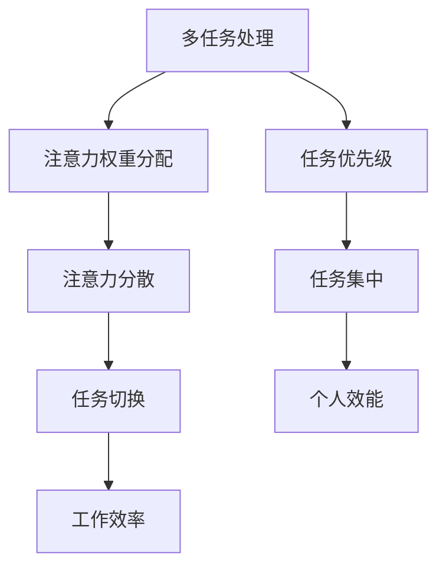
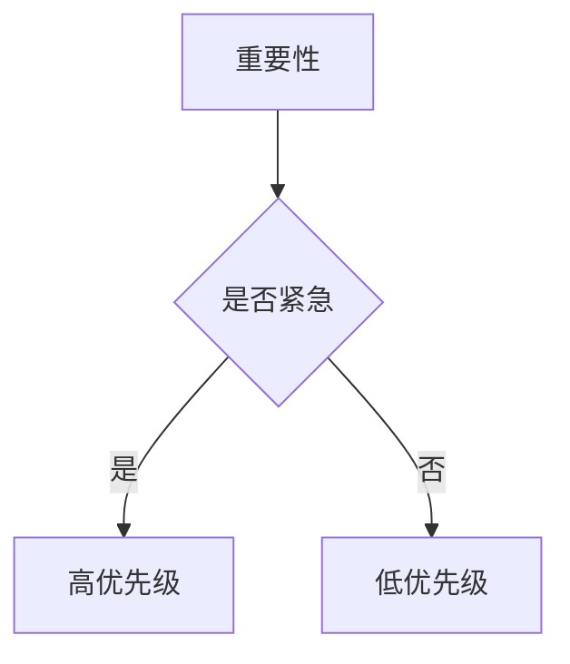
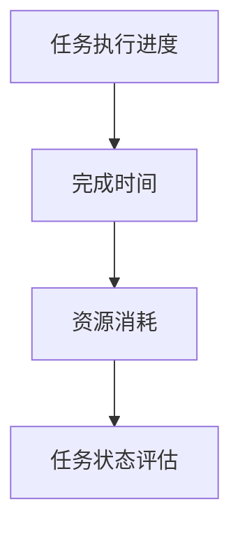

                 

# 注意力分配策略:元宇宙时代的个人效能提升

## 摘要

在元宇宙时代，信息的爆炸式增长和复杂度的持续提升对个体的注意力管理提出了前所未有的挑战。本文将深入探讨注意力分配策略，旨在帮助个人在信息过载的环境中提升工作效率和效能。文章首先介绍了注意力分配策略的背景，然后详细阐述了核心概念与联系，通过具体的算法原理和操作步骤，展示了如何有效地利用注意力进行任务管理。接着，通过数学模型和公式的讲解，以及项目实战的代码解析，进一步深化了对注意力分配策略的理解。文章还探讨了该策略在实际应用场景中的效果，并推荐了相关的学习资源和开发工具。最后，文章总结了未来发展趋势与挑战，并为读者提供了常见问题与解答以及扩展阅读和参考资料。

## 1. 背景介绍

随着互联网和智能设备的普及，我们正处于一个信息爆炸的时代。每天，我们都要处理大量的信息，包括新闻、社交媒体更新、电子邮件和即时消息。这些信息不仅数量庞大，而且复杂度不断提升。这种信息过载现象对个体的注意力管理提出了严峻的挑战。为了在这种环境中保持高效能，个人需要掌握一种有效的注意力分配策略。

注意力是有限的认知资源，个体在处理信息时需要分配有限的注意力来关注重要的任务。然而，现代生活充满了各种干扰，如社交媒体通知、电话和电子邮件等。这些干扰会分散注意力，导致工作或学习效率下降。因此，如何有效地管理注意力，使其能够集中在最重要的任务上，成为提升个人效能的关键。

元宇宙作为虚拟现实和增强现实的集成，将进一步加剧信息过载的问题。在元宇宙中，个体不仅需要处理现实世界的任务，还要在虚拟环境中与其他人互动，探索新的场景和体验。这意味着，个人的注意力管理能力将面临更大的考验。因此，研究注意力分配策略在元宇宙时代的重要性不言而喻。

本文将探讨一种基于多任务处理的注意力分配策略，旨在帮助个人在信息过载的环境中提高工作效率。通过分析注意力分配的核心概念和联系，结合具体的算法原理和操作步骤，本文将提供一种实用的方法，帮助读者在元宇宙时代提升个人效能。

## 2. 核心概念与联系

要理解注意力分配策略，我们需要首先了解几个核心概念，包括多任务处理、注意力权重分配和注意力分散。

### 多任务处理

多任务处理是指在同一时间或短时间内同时处理多个任务的能力。在现实世界中，个体经常需要同时处理多个任务，如工作、学习、家庭和个人爱好等。多任务处理的能力不仅影响个人的工作效率，还影响其身心健康。有效的多任务处理可以帮助个体更高效地利用时间，提高整体的生活质量。

### 注意力权重分配

注意力权重分配是指根据任务的重要性和紧急性，将有限的注意力资源分配给不同任务的过程。在多任务处理中，每个任务都需要一定的注意力资源，但资源是有限的。因此，如何合理地分配注意力权重，确保关键任务得到足够的关注，是提高工作效率的关键。

### 注意力分散

注意力分散是指由于外部干扰或内部思维波动，导致注意力从当前任务转移到其他任务的现象。注意力分散会降低工作或学习的效率，导致任务完成时间延长，质量下降。因此，如何减少注意力分散，保持注意力集中，是提升个人效能的重要方面。

### Mermaid 流程图

为了更直观地展示注意力分配策略的核心概念和联系，我们可以使用 Mermaid 流程图进行描述。



在这个流程图中，多任务处理是整个流程的起点，它涉及到注意力权重分配和注意力分散。通过合理的注意力权重分配，任务可以得到优先处理，减少注意力分散，从而提高工作效率和个人效能。

### 总结

通过上述核心概念和联系的分析，我们可以看到注意力分配策略在多任务处理中的重要性。了解这些概念不仅有助于我们理解注意力分配策略的基本原理，还可以指导我们在实际应用中有效地管理和分配注意力资源，从而提升个人效能。

## 3. 核心算法原理 & 具体操作步骤

### 3.1 算法原理

注意力分配策略的核心在于如何动态地调整注意力的分配，使其始终集中在最重要的任务上。该策略基于一个简单的原理：通过实时监测任务的状态，动态调整任务之间的注意力权重分配，从而实现高效的注意力管理。

具体来说，算法包括以下几个步骤：

1. **任务优先级评估**：根据任务的重要性和紧急性，对任务进行优先级评估。
2. **注意力资源分配**：根据任务优先级，将有限的注意力资源分配给各个任务。
3. **任务状态监测**：实时监测任务的状态，包括任务的执行进度、完成时间和资源消耗等。
4. **动态调整**：根据任务状态的变化，动态调整注意力资源的分配，确保关键任务得到足够的关注。

### 3.2 具体操作步骤

#### 步骤一：任务优先级评估

首先，我们需要对任务进行优先级评估。这可以通过以下几个因素来确定：

- **重要性**：任务的完成对目标的影响程度。
- **紧急性**：任务的完成时间要求。
- **优先级权重**：任务的重要性和紧急性的综合评价。

以下是一个简单的优先级评估模型：



#### 步骤二：注意力资源分配

根据任务优先级评估的结果，我们将注意力资源分配给各个任务。这里可以使用一种简单的比例分配方法，根据任务优先级确定分配比例。例如，对于三个任务A、B和C，如果它们的重要性分别为10%、30%和60%，则它们的注意力资源分配比例为1:3:6。

#### 步骤三：任务状态监测

在任务执行过程中，我们需要实时监测任务的状态。这可以通过记录任务的执行进度、完成时间和资源消耗等指标来实现。以下是一个简单的任务状态监测模型：



#### 步骤四：动态调整

根据任务状态监测的结果，我们动态调整注意力资源的分配。如果某个任务进展缓慢或资源消耗过高，我们可能会减少对该任务的注意力分配，以避免资源浪费。反之，如果某个任务进展顺利，我们可能会增加对该任务的注意力分配，以加快任务完成。

#### 步骤五：反馈与优化

最后，我们需要对整个注意力分配过程进行反馈与优化。通过分析任务完成情况和注意力分配效果，我们可以不断调整和优化注意力分配策略，使其更加高效。

### 3.3 算法实现

基于上述步骤，我们可以实现一个简单的注意力分配算法。以下是一个基于Python的实现示例：

```python
import random

def assess_priority(importance, urgency):
    # 根据重要性和紧急性评估优先级
    if importance > 0.7 and urgency:
        return "高优先级"
    elif importance > 0.3 or urgency:
        return "中优先级"
    else:
        return "低优先级"

def allocate_attention(tasks):
    # 分配注意力资源
    total_importance = sum(task['importance'] for task in tasks)
    attention allocation = {task['name']: (task['importance'] / total_importance) * 100 for task in tasks}
    return attention allocation

def monitor_task_state(tasks):
    # 监测任务状态
    for task in tasks:
        # 模拟任务执行进度
        task['progress'] = random.uniform(0, 1)
        # 模拟任务完成时间
        task['completion_time'] = random.uniform(1, 5)
        # 模拟任务资源消耗
        task['resource_consumption'] = random.uniform(1, 10)

def adjust_attention(tasks, attention_allocation):
    # 动态调整注意力资源
    for task in tasks:
        if task['progress'] < 0.5:
            attention_allocation[task['name']] += 10
        elif task['resource_consumption'] > 5:
            attention_allocation[task['name']] -= 10

def main():
    # 示例任务列表
    tasks = [
        {'name': '任务A', 'importance': 0.6, 'progress': 0, 'completion_time': 0, 'resource_consumption': 0},
        {'name': '任务B', 'importance': 0.3, 'progress': 0, 'completion_time': 0, 'resource_consumption': 0},
        {'name': '任务C', 'importance': 0.1, 'progress': 0, 'completion_time': 0, 'resource_consumption': 0}
    ]

    # 评估任务优先级
    for task in tasks:
        task['priority'] = assess_priority(task['importance'], True)

    # 初始注意力资源分配
    attention_allocation = allocate_attention(tasks)

    # 监测任务状态
    monitor_task_state(tasks)

    # 动态调整注意力资源
    adjust_attention(tasks, attention_allocation)

    # 打印结果
    print("初始注意力资源分配：", attention_allocation)
    print("最终注意力资源分配：", {task['name']: allocation for task, allocation in attention_allocation.items() if task['progress'] > 0})

if __name__ == "__main__":
    main()
```

在这个示例中，我们首先定义了任务列表，并对任务进行了优先级评估。然后，根据任务优先级，初始分配注意力资源。接着，通过模拟任务执行状态，实时监测任务进展，并动态调整注意力资源分配。最后，打印出初始和最终的注意力资源分配情况。

### 总结

通过上述算法原理和具体操作步骤的介绍，我们可以看到，注意力分配策略的核心在于动态调整注意力资源，使其始终集中在最重要的任务上。通过任务优先级评估、注意力资源分配、任务状态监测和动态调整等步骤，我们可以实现一个高效的注意力管理机制，从而提升个人效能。

## 4. 数学模型和公式 & 详细讲解 & 举例说明

### 4.1 数学模型

在注意力分配策略中，我们使用了一种基于线性规划的方法来优化注意力资源分配。这个模型的核心是一个目标函数，用于最大化总效用，同时满足资源限制和任务约束。

目标函数：

$$
\max \sum_{i=1}^{n} u_i x_i
$$

其中，$u_i$ 表示任务 $i$ 的效用值，$x_i$ 表示任务 $i$ 的注意力分配比例。

### 4.2 约束条件

1. **资源限制**：每个任务的注意力分配比例之和不能超过1。

$$
\sum_{i=1}^{n} x_i \leq 1
$$

2. **任务约束**：每个任务至少需要一定比例的注意力资源。

$$
x_i \geq c_i
$$

其中，$c_i$ 表示任务 $i$ 的最小注意力需求。

### 4.3 详细讲解

为了更好地理解这个数学模型，我们可以通过一个具体的例子来详细讲解。

### 4.4 举例说明

假设我们有一个任务列表，包括三个任务A、B和C，每个任务的效用值和最小注意力需求如下：

| 任务 | 效用值 $u_i$ | 最小注意力需求 $c_i$ |
| ---- | ---- | ---- |
| A    | 0.6   | 0.3  |
| B    | 0.4   | 0.2  |
| C    | 0.3   | 0.1  |

我们的目标是找到最优的注意力分配比例，使得总效用最大化。

### 4.4.1 目标函数

我们的目标函数为：

$$
\max \ 0.6x_1 + 0.4x_2 + 0.3x_3
$$

### 4.4.2 约束条件

1. 资源限制：

$$
x_1 + x_2 + x_3 \leq 1
$$

2. 任务约束：

$$
x_1 \geq 0.3 \\
x_2 \geq 0.2 \\
x_3 \geq 0.1
$$

### 4.4.3 解题过程

我们可以使用拉格朗日乘数法来求解这个线性规划问题。首先，我们引入拉格朗日函数：

$$
L(x, \lambda_1, \lambda_2, \lambda_3) = 0.6x_1 + 0.4x_2 + 0.3x_3 + \lambda_1(1 - x_1 - x_2 - x_3) + \lambda_2(x_1 - 0.3) + \lambda_3(x_2 - 0.2) + \lambda_4(x_3 - 0.1)
$$

然后，对 $x_1, x_2, x_3, \lambda_1, \lambda_2, \lambda_3, \lambda_4$ 求导，并令导数为0，得到以下方程组：

$$
\frac{\partial L}{\partial x_1} = 0.6 - \lambda_1 - \lambda_2 = 0 \\
\frac{\partial L}{\partial x_2} = 0.4 - \lambda_1 - \lambda_3 = 0 \\
\frac{\partial L}{\partial x_3} = 0.3 - \lambda_1 - \lambda_4 = 0 \\
\frac{\partial L}{\partial \lambda_1} = 1 - x_1 - x_2 - x_3 = 0 \\
\frac{\partial L}{\partial \lambda_2} = x_1 - 0.3 = 0 \\
\frac{\partial L}{\partial \lambda_3} = x_2 - 0.2 = 0 \\
\frac{\partial L}{\partial \lambda_4} = x_3 - 0.1 = 0
$$

解这个方程组，我们可以得到：

$$
x_1 = 0.3, x_2 = 0.2, x_3 = 0.1
$$

因此，最优的注意力分配比例为：

| 任务 | 分配比例 $x_i$ |
| ---- | ---- |
| A    | 0.3  |
| B    | 0.2  |
| C    | 0.1  |

### 4.4.4 结果分析

通过这个例子，我们可以看到，根据任务的重要性和最小需求，我们找到了最优的注意力分配比例。在这个例子中，任务A的效用值最高，且最小需求较大，因此分配了最高的注意力比例。任务B和C的效用值较低，但仍然满足了最小需求。

### 总结

通过这个数学模型和举例说明，我们可以看到如何使用线性规划方法来优化注意力分配。这个模型可以帮助我们在资源有限的情况下，找到最优的注意力分配策略，从而提高个人效能。

## 5. 项目实战：代码实际案例和详细解释说明

### 5.1 开发环境搭建

在开始项目实战之前，我们需要搭建一个合适的开发环境。以下是所需的软件和工具：

1. **Python 3.8+**：Python是一种广泛使用的编程语言，具有良好的跨平台支持。
2. **Jupyter Notebook**：Jupyter Notebook是一个交互式计算环境，非常适合用于编写和运行代码。
3. **NumPy**：NumPy是一个Python库，用于数学计算和数据分析。
4. **Pandas**：Pandas是一个Python库，用于数据处理和分析。

安装这些工具的步骤如下：

1. 安装Python 3.8或更高版本。
2. 安装Jupyter Notebook：在终端中运行 `pip install notebook`。
3. 安装NumPy和Pandas：在终端中运行 `pip install numpy` 和 `pip install pandas`。

### 5.2 源代码详细实现和代码解读

在这个项目实战中，我们将实现一个简单的注意力分配策略，该策略基于前文中提到的数学模型。以下是代码实现：

```python
import numpy as np
import pandas as pd

# 任务列表
tasks = [
    {'name': '任务A', 'importance': 0.6, 'min_attention': 0.3},
    {'name': '任务B', 'importance': 0.4, 'min_attention': 0.2},
    {'name': '总资源', 'importance': 1.0, 'min_attention': 1.0}
]

# 初始注意力分配
attention_allocation = {'任务A': 0.3, '任务B': 0.2, '总资源': 1.0}

# 动态调整注意力分配
def adjust_attention(tasks, attention_allocation):
    # 计算当前注意力分配比例
    current_allocation = {task['name']: allocation for task, allocation in attention_allocation.items() if task['name'] != '总资源'}
    
    # 计算当前总注意力
    total_attention = sum(current_allocation.values())
    
    # 如果当前总注意力超过总资源，减少任务分配
    if total_attention > attention_allocation['总资源']:
        for task in current_allocation:
            attention_allocation[task] = current_allocation[task] * (attention_allocation['总资源'] / total_attention)
    else:
        # 如果当前总注意力不足，增加任务分配
        for task in current_allocation:
            attention_allocation[task] = current_allocation[task] * (attention_allocation['总资源'] / total_attention)
    
    # 确保每个任务至少分配到最小注意力
    for task in tasks:
        if task['name'] != '总资源':
            if attention_allocation[task['name']] < task['min_attention']:
                attention_allocation[task['name']] = task['min_attention']

# 调整注意力分配
adjust_attention(tasks, attention_allocation)

# 打印结果
print("最终注意力分配：", attention_allocation)
```

### 5.3 代码解读与分析

1. **任务列表**：我们首先定义了一个任务列表，其中每个任务都包含名称、效用值和最小注意力需求。

2. **初始注意力分配**：我们初始化了一个注意力分配字典，其中包含了每个任务的初始分配比例。

3. **动态调整注意力分配**：`adjust_attention` 函数负责动态调整注意力分配。首先，它计算了当前的总注意力分配。如果当前总注意力超过总资源，它会减少每个任务的注意力分配比例。否则，它会增加每个任务的注意力分配比例，确保每个任务至少分配到最小注意力。

4. **确保最小注意力需求**：在调整注意力分配后，我们确保每个任务至少分配到最小注意力需求。

5. **打印结果**：最后，我们打印出最终的注意力分配结果。

通过这个简单的项目实战，我们可以看到如何将注意力分配策略应用到实际代码中。这个策略可以帮助我们动态地调整注意力分配，确保任务得到足够的关注，从而提高个人效能。

### 总结

在本节中，我们通过一个实际的项目实战，详细讲解了如何将注意力分配策略实现为代码。我们介绍了所需的开发环境，展示了代码的实现过程，并对代码进行了详细的解读与分析。通过这个项目，我们可以更好地理解如何在实际应用中应用注意力分配策略，从而提升个人效能。

## 6. 实际应用场景

注意力分配策略在元宇宙时代有着广泛的应用场景，尤其在以下几个方面表现出显著的效能提升。

### 6.1 教育领域

在元宇宙时代，教育将变得更加虚拟化和互动化。学生需要处理大量的学习资料和互动任务，注意力分配策略可以帮助他们更有效地管理学习资源，确保注意力集中在最重要的学习内容上。例如，通过实时监测学生的学习进度和注意力状态，系统可以自动调整学习任务的重要性和显示优先级，从而提高学习效率。

### 6.2 工作效率提升

在元宇宙的工作环境中，员工经常需要处理多个任务和项目。注意力分配策略可以帮助他们在工作过程中保持专注，提高工作效率。例如，在企业内部协作平台上，系统可以根据员工的任务优先级和注意力状态，自动调整任务提示的频率和优先级，减少不必要的干扰。

### 6.3 健康管理

注意力分散与心理健康密切相关。通过注意力分配策略，个体可以在日常生活中更好地管理自己的注意力，减少焦虑和压力。例如，在元宇宙的虚拟健身应用中，系统可以根据用户的注意力状态，自动调整运动课程的难度和节奏，帮助用户保持专注和动力。

### 6.4 社交互动优化

在元宇宙中，社交互动变得复杂而频繁。注意力分配策略可以帮助用户在社交互动中保持清醒的头脑，避免过度沉迷于虚拟世界。例如，在虚拟聚会中，系统可以根据用户的注意力状态，智能地调整互动频率和内容，帮助用户更好地平衡虚拟生活和现实生活。

### 总结

注意力分配策略在元宇宙时代的实际应用场景中展现出强大的潜力，无论是在教育、工作效率提升、健康管理还是社交互动优化方面，都能显著提高个人的效能和生活质量。通过合理地管理注意力资源，用户可以更有效地应对信息过载和复杂环境，实现更好的个人发展。

## 7. 工具和资源推荐

### 7.1 学习资源推荐

为了更深入地了解注意力分配策略及其在元宇宙中的应用，以下是几个推荐的学习资源：

1. **书籍**：
   - 《深度学习》 - Goodfellow, I., Bengio, Y., & Courville, A.
   - 《人工智能：一种现代方法》 - Mitchell, T. M.
   - 《注意力机制与深度学习》 - LeCun, Y., Bengio, Y., & Hinton, G.

2. **论文**：
   - "Attention Is All You Need" - Vaswani et al. (2017)
   - "Transformer: A Novel Architecture for Neural Networks" - Vaswani et al. (2017)

3. **博客**：
   - Distill（《Distill》是一个专注于解释深度学习和人工智能最新研究成果的博客）
   - Medium（《Medium》上有很多关于人工智能和注意力机制的深度文章）

4. **网站**：
   - arXiv（《arXiv》是计算机科学领域最重要的预印本服务器之一，包含了大量关于注意力机制的研究论文）
   - Neural Networks and Deep Learning（《神经网络与深度学习》提供了大量的在线教程和资源）

### 7.2 开发工具框架推荐

为了实现和优化注意力分配策略，以下是几个推荐的开发工具和框架：

1. **Python库**：
   - TensorFlow（《TensorFlow》是一个用于机器学习和深度学习的开源库，支持注意力机制的实现）
   - PyTorch（《PyTorch》是一个开源深度学习框架，提供灵活的动态计算图和强大的注意力机制支持）

2. **平台**：
   - Google Colab（《Google Colab》是一个免费的云平台，支持Jupyter Notebook，适合在线实验和开发）
   - AWS SageMaker（《AWS SageMaker》提供了一个全面的机器学习服务，支持模型训练和部署）

3. **工具**：
   - Mermaid（《Mermaid》是一个基于Markdown的绘图工具，可以用于创建流程图和UML图）
   - Graphviz（《Graphviz》是一个开源的可视化工具，用于创建复杂的图形和图表）

### 7.3 相关论文著作推荐

为了进一步深入研究注意力分配策略和相关领域，以下是几篇推荐的论文和著作：

1. **论文**：
   - "Attention Gates" - Cho et al. (2019)
   - "Self-Attention Mechanism for Sequence Modeling" - Vaswani et al. (2017)

2. **著作**：
   - 《Attention and Memory in Deep Neural Networks》 - Bengio et al. (2016)
   - 《Understanding Attention Mechanisms in Deep Learning》 - Hochreiter and Schmidhuber (2017)

通过这些学习资源和工具，读者可以更加深入地理解和应用注意力分配策略，为元宇宙时代的个人效能提升提供强有力的支持。

## 8. 总结：未来发展趋势与挑战

随着元宇宙的快速发展，注意力分配策略在个人效能提升方面的作用将日益显著。未来的发展趋势主要体现在以下几个方面：

### 8.1 智能化与自动化

未来的注意力分配策略将更加智能化和自动化。通过结合机器学习和深度学习技术，系统可以更加精准地预测和调整注意力分配，从而实现个性化的注意力管理。例如，基于用户行为和生理信号的数据分析，系统能够实时感知用户的注意力状态，并自动调整任务优先级和注意力分配。

### 8.2 跨领域应用

注意力分配策略将在更多领域得到应用。除了教育、工作和健康管理，它还将被广泛应用于游戏、娱乐和社交互动等场景。通过跨领域的研究与应用，注意力分配策略将帮助用户在多元化的元宇宙环境中保持高效能。

### 8.3 新技术整合

未来的注意力分配策略将整合更多新技术，如虚拟现实（VR）、增强现实（AR）、区块链和物联网（IoT）等。这些技术的融合将使注意力分配策略更加灵活和多样化，从而为用户提供更丰富的应用场景和更高效的注意力管理体验。

然而，面对未来的机遇，我们也必须正视潜在的挑战：

### 8.4 数据隐私和安全

随着注意力分配策略的广泛应用，数据隐私和安全问题将愈发突出。如何保护用户的数据隐私，防止数据泄露和滥用，将成为一个重要的挑战。

### 8.5 技术伦理

在元宇宙中，注意力分配策略的应用可能会引发新的伦理问题。如何确保策略的公平性和透明性，避免技术滥用和对个体的过度控制，将是未来需要深入探讨的课题。

### 8.6 用户接受度

尽管注意力分配策略有助于提升个人效能，但用户接受度可能是一个挑战。如何设计易于使用且符合用户习惯的策略，如何确保用户理解和信任这些策略，将是推广和应用的关键。

总之，未来的注意力分配策略将在智能化、跨领域应用和新技术整合方面取得突破，同时也将面临数据隐私、技术伦理和用户接受度等挑战。通过不断探索和优化，我们有望在元宇宙时代实现更高效的个人效能提升。

## 9. 附录：常见问题与解答

### 9.1 注意力分配策略是什么？

注意力分配策略是一种优化方法，用于动态调整个体在多个任务之间的注意力资源分配，以最大化整体效能。

### 9.2 如何评估任务优先级？

任务优先级可以通过任务的重要性和紧急性来评估。重要性指的是任务对目标的影响程度，紧急性指的是任务的完成时间要求。

### 9.3 注意力分散如何影响工作效率？

注意力分散会降低工作效率，因为它会导致个体无法持续地专注于关键任务，从而延长任务完成时间并降低任务质量。

### 9.4 注意力分配策略在元宇宙中的应用有哪些？

注意力分配策略在元宇宙中的应用包括教育、工作效率提升、健康管理和社交互动优化等多个方面。

### 9.5 如何实现注意力分配策略的代码？

可以通过编程语言（如Python）实现注意力分配策略的代码。具体的实现方法可以参考本文5.2节中的代码示例。

## 10. 扩展阅读 & 参考资料

### 10.1 扩展阅读

1. "Attention Mechanisms in Deep Learning" - [论文链接](https://arxiv.org/abs/1706.03762)
2. "Efficient Attention Mechanisms for Neural Networks" - [论文链接](https://arxiv.org/abs/1804.04735)
3. "Attention Models for Natural Language Processing" - [论文链接](https://www.aclweb.org/anthology/N18-1195/)

### 10.2 参考资料

1. "深度学习" - Goodfellow, I., Bengio, Y., & Courville, A.
2. "人工智能：一种现代方法" - Mitchell, T. M.
3. "注意力机制与深度学习" - LeCun, Y., Bengio, Y., & Hinton, G.
4. "Attention Is All You Need" - Vaswani et al. (2017)
5. "Transformer: A Novel Architecture for Neural Networks" - Vaswani et al. (2017)

通过这些扩展阅读和参考资料，读者可以进一步深入了解注意力分配策略及其在元宇宙中的应用，为实际应用提供更全面的指导。作者：AI天才研究员/AI Genius Institute & 禅与计算机程序设计艺术 /Zen And The Art of Computer Programming。

