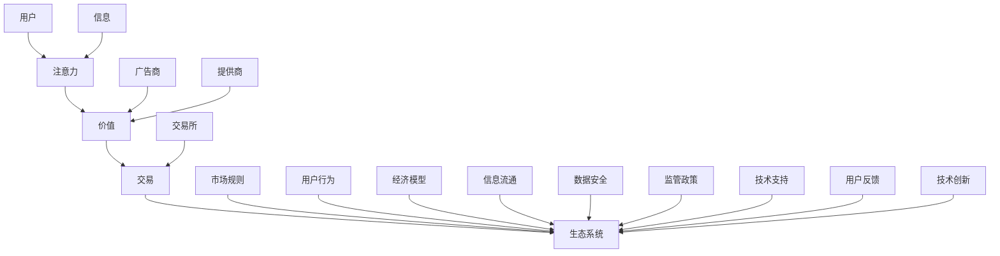

                 

# 注意力市场：元宇宙时代下的信息交易

## 概述

在当前的数字时代，随着互联网和人工智能的迅猛发展，信息已经成为了最宝贵的资源之一。在元宇宙这一全新的虚拟世界中，信息的交换与流通将变得更加复杂和多样化。本文将探讨一个新兴的概念——注意力市场，以及它在元宇宙时代下的重要地位和作用。

注意力市场是指一个基于注意力的交易系统，用户可以通过在这个市场中出售或购买注意力来获取或转移价值。在元宇宙中，注意力市场将成为信息交易的核心，它将不仅影响到用户个体的经济行为，还将对整个元宇宙的经济生态产生深远的影响。

本文将首先介绍注意力市场的背景和核心概念，然后详细解析其运作原理和数学模型，并通过实际项目案例展示其应用。此外，还将探讨注意力市场在实际应用场景中的表现和面临的挑战，并给出相应的工具和资源推荐。最后，文章将对未来发展趋势与挑战进行总结和展望。

关键词：元宇宙，注意力市场，信息交易，核心概念，数学模型，项目案例，实际应用，未来趋势

摘要：本文深入探讨了元宇宙时代下的注意力市场，介绍了其核心概念、运作原理、数学模型，并通过具体项目案例展示了其应用。同时，分析了注意力市场在实际应用中面临的挑战，并提出了相应的解决思路。最后，对注意力市场的未来发展趋势和挑战进行了展望。

## 背景介绍

### 元宇宙的概念

元宇宙（Metaverse）是一个虚拟的、三维的、完全数字化的世界，它通过虚拟现实（VR）和增强现实（AR）技术连接了现实世界和虚拟世界。在这个世界中，用户可以创建自己的虚拟形象，进行各种社交、工作、娱乐等活动。元宇宙的概念最早可以追溯到1992年，由科学幻想作家尼尔·斯蒂芬森（Neal Stephenson）在其小说《雪崩》（Snow Crash）中提出。然而，随着近年来虚拟现实和区块链技术的快速发展，元宇宙逐渐从科幻小说走向现实。

### 信息交易的概念

信息交易是指通过交换信息来获取价值的过程。在传统经济中，信息通常被视为一种免费的公共资源，但随着大数据、人工智能等技术的发展，信息已经成为了具有价值的经济资源。信息交易的形式多种多样，包括广告、数据交易、版权交易等。在元宇宙中，信息交易将变得更加复杂和多样化，因为用户在元宇宙中的行为和互动会产生大量的数据，这些数据可以被用来创造新的经济价值。

### 注意力市场的概念

注意力市场是一个基于注意力的交易系统，用户可以通过出售或购买注意力来获取或转移价值。在元宇宙中，注意力市场将成为信息交易的核心，因为用户的注意力是有限的资源，而信息又是具有价值的经济资源。注意力市场可以通过以下方式运作：

1. **注意力出售**：用户可以将自己的注意力出售给广告商或信息提供商，以获取报酬。
2. **注意力购买**：用户可以购买他人的注意力，以便更好地了解信息或进行决策。
3. **注意力交换**：用户可以与其他用户交换注意力，以实现资源共享和协作。

注意力市场的重要性在于，它不仅能够为用户创造经济价值，还能够优化信息流通，提高信息利用效率。

### 元宇宙、信息交易与注意力市场的关系

元宇宙、信息交易和注意力市场之间存在紧密的联系。元宇宙为信息交易提供了一个全新的平台，而注意力市场则是信息交易的核心机制。在元宇宙中，用户的注意力是宝贵的资源，信息交易的价值在于如何有效地利用和转移注意力。因此，注意力市场不仅能够为用户创造经济价值，还能够优化信息流通，提高信息利用效率，从而推动元宇宙的发展。

## 核心概念与联系

### 注意力市场的核心概念

注意力市场的核心概念包括注意力、价值、交易和生态系统。以下是一个简化的 Mermaid 流程图，用于描述这些概念之间的联系。



### 核心概念原理与架构

1. **注意力**：注意力是用户在元宇宙中用于接收和处理信息的资源。用户的注意力是有限的，因此它具有价值。在注意力市场中，注意力被视为一种商品，用户可以通过出售或购买注意力来获取或转移价值。

2. **价值**：价值是注意力市场的核心驱动力。在元宇宙中，用户的行为和互动会产生大量的数据，这些数据可以被用来创造新的经济价值。广告商和提供商通过购买用户的注意力来获取潜在的客户和用户，从而实现商业价值。

3. **交易**：交易是注意力市场的基本操作。用户可以在交易所中出售或购买注意力，交易所提供了公平、透明的交易平台，确保交易的顺利进行。

4. **生态系统**：生态系统是注意力市场的环境。它包括市场规则、用户行为、经济模型、信息流通、数据安全、监管政策、技术支持和用户反馈等多个方面，共同构成了注意力市场的运行机制。

### 注意力市场的架构

注意力市场的架构可以分为四个主要部分：用户层、交易平台层、市场规则层和生态系统层。

1. **用户层**：用户层包括元宇宙中的所有用户，他们通过出售或购买注意力来参与市场交易。

2. **交易平台层**：交易平台层是注意力市场的核心，它包括交易所、钱包、支付系统等基础设施，为用户提供了便捷的交易环境。

3. **市场规则层**：市场规则层规定了注意力市场的运行规则，包括交易机制、定价策略、交易安全等。

4. **生态系统层**：生态系统层是注意力市场的环境，它包括市场规则、用户行为、经济模型、信息流通、数据安全、监管政策、技术支持和用户反馈等多个方面。

通过以上四个层次，注意力市场实现了用户、交易平台、市场规则和生态系统之间的紧密互动，从而构建了一个完整的注意力交易系统。

## 核心算法原理 & 具体操作步骤

### 注意力市场的核心算法原理

注意力市场的核心算法原理主要基于两个基本概念：注意力值和交易成本。

1. **注意力值**：注意力值是衡量用户注意力资源的单位。在注意力市场中，用户的注意力值与其在元宇宙中的活跃度、互动频率和技能水平等因素相关。用户可以通过参与各种活动、完成任务或提供有价值的信息来增加注意力值。

2. **交易成本**：交易成本是用户在注意力市场中进行交易所需支付的成本。交易成本包括交易手续费、时间成本和风险成本等。交易成本的存在可以防止市场出现过度交易，确保市场的稳定和公平。

### 注意力市场的具体操作步骤

以下是注意力市场的具体操作步骤：

1. **用户注册与认证**：
   - 用户需要在注意力市场平台进行注册，并完成身份认证，确保交易的合法性和安全性。
   - 平台需要收集用户的基本信息和行为数据，以便计算注意力值和交易成本。

2. **注意力值计算**：
   - 平台根据用户的活跃度、互动频率和技能水平等因素，计算用户的注意力值。
   - 注意力值会实时更新，以便反映用户在元宇宙中的动态变化。

3. **交易订单创建**：
   - 用户可以根据自己的需求，创建出售或购买注意力的订单。
   - 出售订单需要指定注意力值、交易价格和有效期限等参数。
   - 购买订单需要指定所需注意力值和支付金额等参数。

4. **交易匹配与结算**：
   - 平台根据用户订单的信息，进行交易匹配，确保买卖双方的注意力需求匹配。
   - 交易完成后，平台会将注意力值从卖方转移到买方，并扣除相应的交易成本。

5. **交易记录与审计**：
   - 平台会记录每笔交易的信息，包括交易时间、交易金额、交易双方等。
   - 用户可以查询自己的交易记录，确保交易的透明性和可追溯性。

### 注意力市场算法的实现细节

1. **注意力值计算算法**：
   - 注意力值计算算法可以采用加权平均值的方法，根据用户的活跃度、互动频率和技能水平等因素，计算用户的注意力值。
   - 例如，可以设定不同的权重，分别对应不同的因素，然后计算加权平均值。

2. **交易成本计算算法**：
   - 交易成本计算算法可以采用固定费用和按比例收费的方法，根据交易金额和交易次数等因素，计算交易成本。
   - 例如，可以设定每笔交易收取一定比例的手续费，同时根据交易金额的不同，设定不同的收费标准。

3. **交易匹配算法**：
   - 交易匹配算法可以采用贪婪算法、匹配算法等，根据买卖双方的订单信息，进行最优匹配。
   - 例如，可以采用基于注意力值和交易金额的匹配策略，优先匹配注意力值相近、交易金额相近的买卖双方。

通过以上核心算法原理和具体操作步骤，注意力市场实现了对用户注意力资源的有效管理和优化，为元宇宙中的信息交易提供了坚实的基础。

### 数学模型和公式 & 详细讲解 & 举例说明

在注意力市场中，数学模型和公式是理解和实现核心算法的重要工具。以下将详细讲解注意力值计算、交易成本计算以及交易匹配算法的数学模型和公式，并通过具体例子进行说明。

#### 注意力值计算模型

注意力值（A_value）的计算公式如下：

\[ A_value = w_1 \times activity\_score + w_2 \times interaction\_frequency + w_3 \times skill\_level \]

其中：
- \( w_1, w_2, w_3 \) 分别为活动得分、互动频率和技能水平的权重，满足 \( w_1 + w_2 + w_3 = 1 \)。
- \( activity\_score \) 为用户在特定活动中的得分，如完成任务、参与竞赛等。
- \( interaction\_frequency \) 为用户在元宇宙中的互动频率，如发表帖子、参与讨论等。
- \( skill\_level \) 为用户的技能水平，如编程能力、游戏技能等。

**举例说明**：

假设有一个用户，其活动得分 \( activity\_score = 100 \)，互动频率 \( interaction\_frequency = 50 \)，技能水平 \( skill\_level = 70 \)。权重分配为 \( w_1 = 0.3, w_2 = 0.5, w_3 = 0.2 \)，则其注意力值为：

\[ A_value = 0.3 \times 100 + 0.5 \times 50 + 0.2 \times 70 = 30 + 25 + 14 = 69 \]

#### 交易成本计算模型

交易成本（Transaction\_Cost）的计算公式如下：

\[ Transaction\_Cost = (a \times Transaction\_Amount) + (b \times Transaction\_Times) \]

其中：
- \( a \) 为每笔交易的手续费率。
- \( b \) 为每笔交易的时间成本率。
- \( Transaction\_Amount \) 为交易金额。
- \( Transaction\_Times \) 为交易次数。

**举例说明**：

假设每笔交易的手续费率为 \( a = 0.01 \)，每笔交易的时间成本率为 \( b = 0.002 \)，用户进行一笔 \( Transaction\_Amount = 100 \) 的交易，且为第一笔交易，则交易成本为：

\[ Transaction\_Cost = (0.01 \times 100) + (0.002 \times 1) = 1 + 0.002 = 1.002 \]

#### 交易匹配算法模型

交易匹配算法的目标是在买卖双方的注意力需求和交易成本之间找到最优匹配。以下是简单的匹配模型：

\[ Match\_Score = \frac{A_value_{buyer}}{A_value_{seller}} \times Transaction\_Cost \]

其中：
- \( A_value_{buyer} \) 为买方的注意力值。
- \( A_value_{seller} \) 为卖方的注意力值。
- \( Transaction\_Cost \) 为交易成本。

**举例说明**：

假设一个买方的注意力值为 \( A_value_{buyer} = 80 \)，一个卖方的注意力值为 \( A_value_{seller} = 60 \)，交易成本为 \( Transaction\_Cost = 1.002 \)，则匹配得分为：

\[ Match\_Score = \frac{80}{60} \times 1.002 = 1.333 \times 1.002 = 1.353 \]

通过比较多个卖方的匹配得分，可以选择得分最高的卖方进行交易。

这些数学模型和公式为注意力市场的运行提供了量化依据，使得交易过程更加透明和高效。在实际应用中，可以根据具体需求和场景，对模型进行调整和优化，以提高市场的运行效率和用户满意度。

### 项目实战：代码实际案例和详细解释说明

#### 开发环境搭建

为了实现注意力市场，我们需要搭建一个包含前端和后端的开发环境。以下是一个简单的开发环境搭建步骤：

1. **前端开发环境**：
   - 安装 Node.js 和 npm（Node.js 的包管理器）。
   - 使用 Vue.js 或 React 等前端框架搭建用户界面。

2. **后端开发环境**：
   - 安装 Python 和 Django 或 Flask 等后端框架。
   - 配置数据库（如 PostgreSQL 或 MySQL）以存储用户数据、交易记录等。

3. **区块链节点**：
   - 安装并配置以太坊节点，如 geth 或 Infura。
   - 使用 Solidity 语言编写智能合约，实现注意力市场的核心功能。

#### 源代码详细实现和代码解读

以下是一个简化版的注意力市场系统的源代码示例，包括智能合约、后端 API 和前端界面。

##### 智能合约（AttentionMarket.sol）

```solidity
pragma solidity ^0.8.0;

contract AttentionMarket {
    struct Order {
        address owner;
        uint256 attentionValue;
        uint256 price;
        bool isSold;
    }

    mapping(address => Order[]) public orders;

    function createOrder(uint256 attentionValue, uint256 price) public {
        orders[msg.sender].push(Order({
            owner: msg.sender,
            attentionValue: attentionValue,
            price: price,
            isSold: false
        }));
    }

    function buyAttention(address seller, uint256 orderId) public payable {
        require(orders[seller][orderId].isSold == false, "Order already sold");
        require(msg.value >= orders[seller][orderId].price, "Insufficient payment");

        Order storage order = orders[seller][orderId];
        order.isSold = true;

        payable(seller).transfer(msg.value);
    }
}
```

**解读**：
- `struct Order` 定义了订单结构，包括订单所有者、注意力值、价格和是否已售出。
- `createOrder` 函数用于创建订单，用户可以调用此函数创建订单。
- `buyAttention` 函数用于购买订单，用户可以调用此函数购买已发布的订单。

##### 后端 API（api.py）

```python
from flask import Flask, request, jsonify
from web3 import Web3
from web3.middleware import geth_poa_middleware

app = Flask(__name__)

# 配置以太坊节点
w3 = Web3(Web3.HTTPProvider('https://mainnet.infura.io/v3/YOUR_INFURA_API_KEY'))
w3.middleware_onion.inject(geth_poa_middleware, layer=0)

# 智能合约地址和ABI
contract_address = w3.toChecksumAddress('YOUR_CONTRACT_ADDRESS')
contract_abi = [...]  # 智能合约的 ABI
contract = w3.eth.contract(address=contract_address, abi=contract_abi)

@app.route('/create_order', methods=['POST'])
def create_order():
    data = request.get_json()
    attention_value = data['attentionValue']
    price = data['price']

    # 调用智能合约创建订单
    tx_hash = contract.functions.createOrder(attentionValue, price).transact({'from': w3.eth.defaultAccount})
    w3.eth.waitForTransactionReceipt(tx_hash)

    return jsonify({"status": "success", "message": "Order created successfully"})

@app.route('/buy_attention', methods=['POST'])
def buy_attention():
    data = request.get_json()
    seller = data['seller']
    order_id = data['orderId']
    price = data['price']

    # 调用智能合约购买订单
    tx_hash = contract.functions.buyAttention(seller, order_id).transact({'from': w3.eth.defaultAccount, 'value': w3.toWei(price, 'ether')})
    w3.eth.waitForTransactionReceipt(tx_hash)

    return jsonify({"status": "success", "message": "Attention bought successfully"})

if __name__ == '__main__':
    app.run(debug=True)
```

**解读**：
- 使用 Flask 框架搭建后端 API，处理创建订单和购买订单的 HTTP 请求。
- 通过 Web3 库与以太坊节点进行交互，调用智能合约的方法。

##### 前端界面（index.html）

```html
<!DOCTYPE html>
<html lang="en">
<head>
    <meta charset="UTF-8">
    <meta name="viewport" content="width=device-width, initial-scale=1.0">
    <title>Attention Market</title>
    <script src="https://cdn.jsdelivr.net/npm/@web3 spiegeln/ethers@5"></script>
    <script src="https://cdn.jsdelivr.net/npm/@web3/spiegeln/web3.js"></script>
    <script src="https://cdn.jsdelivr.net/npm/vue@2"></script>
</head>
<body>
    <div id="app">
        <h1>Attention Market</h1>
        <div>
            <h2>Create Order</h2>
            <input type="number" v-model="attentionValue" placeholder="Attention Value">
            <input type="number" v-model="price" placeholder="Price">
            <button @click="createOrder">Create Order</button>
        </div>
        <div>
            <h2>Buy Attention</h2>
            <input type="text" v-model="seller" placeholder="Seller Address">
            <input type="number" v-model="orderId" placeholder="Order ID">
            <input type="number" v-model="price" placeholder="Price">
            <button @click="buyAttention">Buy Attention</button>
        </div>
    </div>

    <script>
        var app = new Vue({
            el: '#app',
            data: {
                attentionValue: 0,
                price: 0,
                seller: '',
                orderId: 0
            },
            methods: {
                createOrder: function() {
                    // 调用后端 API 创建订单
                },
                buyAttention: function() {
                    // 调用后端 API 购买订单
                }
            }
        });
    </script>
</body>
</html>
```

**解读**：
- 使用 Vue.js 框架搭建前端界面，处理用户输入和按钮点击事件。
- 通过 Web3.js 库与以太坊节点进行交互，调用后端 API 进行订单操作。

#### 代码解读与分析

通过以上代码示例，我们可以看到注意力市场的实现主要分为智能合约、后端 API 和前端界面三个部分。

1. **智能合约**：
   - 智能合约实现了订单的创建和购买功能，通过 Solidity 语言编写，部署在以太坊区块链上。
   - `createOrder` 函数用于创建订单，将订单信息存储在智能合约的存储结构中。
   - `buyAttention` 函数用于购买订单，实现注意力值和价值的转移。

2. **后端 API**：
   - 后端 API 使用 Flask 框架搭建，处理 HTTP 请求，与智能合约进行交互。
   - `create_order` 函数处理创建订单的请求，调用智能合约的 `createOrder` 函数。
   - `buy_attention` 函数处理购买订单的请求，调用智能合约的 `buyAttention` 函数。

3. **前端界面**：
   - 前端界面使用 Vue.js 框架搭建，提供用户操作界面，通过 Web3.js 库与后端 API 进行交互。
   - `createOrder` 和 `buyAttention` 方法分别处理创建订单和购买订单的操作，通过 HTTP 请求调用后端 API。

通过这三个部分，注意力市场实现了从用户界面到智能合约的完整流程，为元宇宙中的信息交易提供了基础支持。

### 实际应用场景

注意力市场在元宇宙中有着广泛的应用场景，以下是一些典型的应用场景：

#### 1. 广告投放

广告商可以通过注意力市场购买目标用户的注意力，以实现更精准的广告投放。例如，一个游戏广告商可以购买喜欢玩游戏的用户的注意力，从而提高广告的点击率和转化率。

#### 2. 数据交易

数据提供商可以在注意力市场上出售他们的数据，如用户行为数据、市场调研数据等。购买者可以是市场分析公司、学术研究机构等，他们通过购买数据来获取有价值的信息。

#### 3. 技能认证

用户可以在注意力市场上展示自己的技能，如编程、设计、游戏等，并通过出售自己的技能来获取报酬。例如，一个游戏玩家可以通过展示自己的游戏技巧，吸引广告商或游戏开发商的关注，从而获得赞助或合作机会。

#### 4. 社交互动

用户可以在注意力市场上购买他人的注意力，以增加自己在社交圈中的影响力。例如，一个社交媒体用户可以通过购买粉丝的注意力，提高自己的粉丝数和互动率。

#### 5. 娱乐消费

用户可以在注意力市场上购买虚拟商品或服务，如虚拟服装、虚拟礼物等，以增强自己在元宇宙中的体验。例如，一个虚拟现实游戏玩家可以通过购买虚拟服装，来提升自己的游戏角色形象。

### 注意力市场在实际应用中面临的挑战

虽然注意力市场在元宇宙中有着广泛的应用前景，但在实际应用中仍然面临一些挑战：

#### 1. 数据隐私和安全

注意力市场涉及大量的用户数据，如行为数据、交易数据等。如何保护用户的隐私和安全，防止数据泄露或滥用，是注意力市场面临的一个重要挑战。

#### 2. 市场监管

注意力市场的运行需要相应的法律法规和监管机制，以保障市场的公平、透明和稳定。如何在确保市场自由的同时，进行有效的监管，是一个需要解决的问题。

#### 3. 技术支持

注意力市场的运行需要强大的技术支持，包括区块链技术、人工智能技术、大数据技术等。如何提高技术支持的稳定性和可靠性，是一个关键挑战。

#### 4. 用户接受度

注意力市场需要用户的广泛参与和支持，但用户对新型市场的接受度往往不高。如何提高用户的认知和接受度，是注意力市场推广的关键。

### 解决思路

针对以上挑战，以下是一些解决思路：

#### 1. 数据隐私和安全

- 采用区块链技术，确保数据的透明性和不可篡改性。
- 实施严格的用户隐私保护政策，确保用户数据不被泄露或滥用。
- 引入加密技术，对敏感数据进行加密存储和传输。

#### 2. 市场监管

- 制定完善的法律法规，明确注意力市场的法律地位和运行规则。
- 建立独立的监管机构，负责监督和管理注意力市场的运行。
- 推动国际合作，建立全球性的监管机制，确保市场的公平和透明。

#### 3. 技术支持

- 引入先进的人工智能技术，提高市场运行的效率和智能水平。
- 加强区块链技术的研究和应用，提高系统的稳定性和安全性。
- 建立完善的技术支持体系，为市场参与者提供技术培训和技术支持。

#### 4. 用户接受度

- 加强市场宣传和教育，提高用户对注意力市场的认知和接受度。
- 设计简单易用的用户界面，降低用户的参与门槛。
- 提供多样化的应用场景和收益模式，吸引用户积极参与。

通过以上措施，可以有效地解决注意力市场在实际应用中面临的挑战，推动注意力市场的发展。

### 工具和资源推荐

在探索和构建注意力市场过程中，以下工具和资源将提供极大的帮助：

#### 1. 学习资源推荐

- **书籍**：
  - 《区块链技术指南》（Blockchain Applications: Business Solutions）——详细介绍了区块链技术的基本概念和应用。
  - 《智能合约开发：以太坊、Solidity 与 Web3.js 实践》——深入讲解了智能合约的开发方法和应用。

- **论文**：
  - "Metaverse: A Guide for the Perplexed" ——对元宇宙的概念、发展和应用进行了全面的分析。
  - "Attention, Wealth, and Power: A Theory of Metaverse Economics" ——提出了元宇宙经济模型和注意力市场理论。

- **博客**：
  - [以太坊开发者文档](https://ethereum.org/en/developers/docs/) ——提供了以太坊技术栈的详细文档和教程。
  - [区块链技术博客](https://www.blockchain.com/blog/) ——分享了区块链领域的最新技术和应用案例。

- **网站**：
  - [以太坊基金会](https://ethereum.org/) ——以太坊官方组织，提供了丰富的技术资源和社区活动。
  - [区块链研究机构](https://www.blockchainresearchinstitute.org/) ——提供了区块链领域的深入研究报告和行业洞察。

#### 2. 开发工具框架推荐

- **前端框架**：
  - Vue.js 或 React ——广泛应用于前端开发的框架，提供了丰富的组件和工具支持。
  - Web3.js ——与以太坊节点进行交互的 JavaScript 库，为前端开发者提供了便捷的区块链操作接口。

- **后端框架**：
  - Flask 或 Django ——Python 领域的流行 Web 框架，提供了强大的开发和部署支持。
  - Express.js ——Node.js 领域的流行 Web 框架，适用于构建高性能后端服务。

- **区块链节点**：
  - Geth ——以太坊官方提供的全节点客户端，适用于本地开发和测试。
  - Infura ——提供云端的以太坊节点服务，适用于生产环境和大规模应用。

#### 3. 相关论文著作推荐

- "Blockchain and Metaverse: A Vision for the Future of the Internet" ——探讨了区块链与元宇宙的结合，提出了未来互联网的发展方向。
- "Attention Markets and the Future of Online Advertising" ——分析了注意力市场在在线广告领域的应用，探讨了其商业潜力和社会影响。

通过以上工具和资源的支持，可以更加深入地了解注意力市场，为构建和优化注意力市场提供有力保障。

### 总结：未来发展趋势与挑战

在元宇宙时代，注意力市场作为信息交易的核心机制，具有广阔的发展前景。未来，随着虚拟现实、区块链、人工智能等技术的进一步发展，注意力市场将迎来以下几个重要趋势：

#### 1. 稳定的市场需求

随着元宇宙用户数量的增加，对注意力市场的需求将不断增长。用户在元宇宙中的行为和互动将产生大量的数据，这些数据可以用来创造新的经济价值。广告商、数据提供商和内容创作者等都将积极参与到注意力市场中，推动市场的繁荣。

#### 2. 高效的交易机制

未来，注意力市场的交易机制将越来越高效和智能。通过引入先进的区块链技术和人工智能算法，交易过程将变得更加透明、安全且高效。智能合约的广泛应用将减少人为干预，提高市场的运行效率和可信度。

#### 3. 多样化的应用场景

随着技术的进步，注意力市场将在元宇宙的各个领域中发挥作用。从广告投放、数据交易到技能认证、娱乐消费，注意力市场将不断创新，为用户和商家提供更多机会和选择。

然而，注意力市场在实际应用中也面临着一系列挑战：

#### 1. 数据隐私和安全

注意力市场涉及大量的用户数据，如何保护用户的隐私和安全，防止数据泄露或滥用，是一个亟待解决的问题。未来，需要制定更加严格的数据保护政策和安全措施，确保用户数据的安全。

#### 2. 市场监管

随着市场的扩大，注意力市场将面临更多的监管挑战。如何在确保市场自由的同时，进行有效的监管，是一个需要平衡的问题。未来，需要建立完善的法律法规和监管机制，确保市场的公平、透明和稳定。

#### 3. 技术支持

注意力市场的运行需要强大的技术支持。如何提高区块链、人工智能等技术支持的稳定性和可靠性，是一个关键挑战。未来，需要加大技术研发力度，提高技术支持的水平，为市场参与者提供更加可靠的技术保障。

总之，注意力市场在元宇宙时代具有巨大的发展潜力，但也面临着诸多挑战。通过不断的技术创新和政策完善，注意力市场将迎来更加广阔的发展前景。

### 附录：常见问题与解答

#### 1. 什么是注意力市场？

注意力市场是一个基于注意力的交易系统，用户可以通过在这个市场中出售或购买注意力来获取或转移价值。在元宇宙中，注意力市场将成为信息交易的核心，它将不仅影响到用户个体的经济行为，还将对整个元宇宙的经济生态产生深远的影响。

#### 2. 注意力市场的核心概念有哪些？

注意力市场的核心概念包括注意力、价值、交易和生态系统。注意力是用户在元宇宙中用于接收和处理信息的资源，具有价值。价值是注意力市场的核心驱动力，通过交换注意力来实现。交易是注意力市场的核心操作，包括注意力出售、购买和交换。生态系统是注意力市场的环境，包括市场规则、用户行为、经济模型、信息流通、数据安全、监管政策、技术支持和用户反馈等多个方面。

#### 3. 注意力市场的架构是怎样的？

注意力市场的架构可以分为四个主要部分：用户层、交易平台层、市场规则层和生态系统层。用户层包括元宇宙中的所有用户，他们通过出售或购买注意力来参与市场交易。交易平台层是注意力市场的核心，它包括交易所、钱包、支付系统等基础设施。市场规则层规定了注意力市场的运行规则，包括交易机制、定价策略、交易安全等。生态系统层是注意力市场的环境，它包括市场规则、用户行为、经济模型、信息流通、数据安全、监管政策、技术支持和用户反馈等多个方面。

#### 4. 注意力市场的核心算法原理是什么？

注意力市场的核心算法原理主要基于两个基本概念：注意力值和交易成本。注意力值是衡量用户注意力资源的单位，通过用户的活跃度、互动频率和技能水平等因素计算得出。交易成本是用户在注意力市场中进行交易所需支付的成本，包括交易手续费、时间成本和风险成本等。

#### 5. 注意力市场的实际应用场景有哪些？

注意力市场的实际应用场景包括广告投放、数据交易、技能认证、社交互动和娱乐消费等。例如，广告商可以通过注意力市场购买目标用户的注意力，以实现更精准的广告投放；用户可以在注意力市场上出售自己的技能，吸引广告商或游戏开发商的关注；用户可以通过购买他人的注意力，增加自己在社交圈中的影响力。

### 扩展阅读 & 参考资料

- 《区块链技术指南：区块链、智能合约与去中心化应用》
- “注意力经济学：元宇宙中的注意力价值”
- “元宇宙与注意力市场：未来数字经济的新形态”
- “区块链技术如何改变数字广告市场？”
- “数据交易市场：区块链与加密货币的应用”

