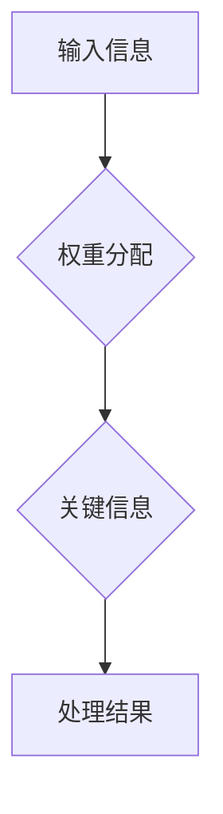

                 

# 注意力平衡新论：AI时代的认知资源分配

## 关键词：注意力机制、认知资源、AI、神经网络、资源分配

> 摘要：本文探讨了AI时代下，如何通过注意力平衡机制来实现认知资源的优化分配。首先介绍了注意力机制的核心概念和原理，然后分析了神经网络中注意力机制的应用和效果，并结合实际项目案例进行了详细解析。最后，本文提出了未来AI领域中注意力平衡机制的发展趋势与挑战。

## 1. 背景介绍

随着人工智能技术的迅猛发展，神经网络已经成为实现智能化的主要工具。然而，神经网络在处理大量数据时，面临着如何有效分配认知资源的挑战。传统方法主要依赖于固定的计算资源和参数调整，但在复杂任务中往往无法满足需求。因此，如何实现认知资源的优化分配，成为当前研究的热点。

注意力平衡机制作为一种新兴的优化方法，旨在通过调整神经网络中的注意力分配，实现认知资源的有效利用。该方法不仅提高了模型的性能，还降低了计算复杂度，具有重要的应用价值。本文将从注意力机制的基本原理出发，探讨其在AI时代的认知资源分配中的应用。

## 2. 核心概念与联系

### 2.1 注意力机制

注意力机制是一种动态调整神经网络中信息流动的方法，其核心思想是在处理过程中对输入信息进行权重分配，从而实现关键信息的重点处理。在深度学习中，注意力机制可以有效提高模型的性能和效率。

### 2.2 认知资源

认知资源是指用于处理信息所需的计算资源、时间资源和能量资源。在神经网络中，认知资源主要表现为参数、计算步骤和内存等。

### 2.3 注意力平衡机制

注意力平衡机制通过动态调整神经网络中的注意力分配，实现认知资源的优化利用。具体包括以下几个方面：

1. **参数调整**：通过优化注意力权重，提高关键信息的传递效率。
2. **计算复杂度**：降低神经网络在处理复杂任务时的计算复杂度，从而减少认知资源消耗。
3. **能量效率**：在保证性能的前提下，降低神经网络运行所需的能量消耗。

下面是一个注意力平衡机制的 Mermaid 流程图：



## 3. 核心算法原理 & 具体操作步骤

### 3.1 核心算法原理

注意力平衡机制的核心算法包括以下几个步骤：

1. **输入信息预处理**：对输入数据进行编码，提取关键特征。
2. **注意力权重计算**：根据输入特征计算注意力权重，实现对输入信息的动态调整。
3. **信息传递**：根据注意力权重对输入信息进行加权处理，传递关键信息。
4. **处理结果生成**：将加权后的信息传递给神经网络，生成最终的处理结果。

### 3.2 具体操作步骤

以下是一个简单的注意力平衡机制的实现步骤：

1. **输入信息编码**：将输入数据编码为向量形式。
2. **计算注意力权重**：使用计算公式计算每个输入特征的权重。
3. **加权处理**：将输入特征与对应的权重相乘，生成加权特征向量。
4. **传递关键信息**：将加权特征向量传递给神经网络，进行后续处理。
5. **生成处理结果**：根据神经网络输出，生成最终的处理结果。

## 4. 数学模型和公式 & 详细讲解 & 举例说明

### 4.1 数学模型和公式

注意力平衡机制中的核心公式如下：

$$
\alpha_i = \frac{e^{z_i}}{\sum_{j=1}^{n} e^{z_j}}
$$

其中，$\alpha_i$表示第$i$个输入特征的权重，$z_i$表示第$i$个输入特征的权重值，$n$表示输入特征的总数。

### 4.2 详细讲解

1. **输入信息编码**：将输入数据编码为向量形式，例如，一个句子编码为一个词向量序列。

2. **计算注意力权重**：根据输入特征的权重值，使用上述公式计算每个输入特征的权重。

3. **加权处理**：将输入特征与对应的权重相乘，生成加权特征向量。

4. **传递关键信息**：将加权特征向量传递给神经网络，进行后续处理。

5. **生成处理结果**：根据神经网络输出，生成最终的处理结果。

### 4.3 举例说明

假设有一个句子：“人工智能在当今时代具有重要意义。”，将其编码为词向量序列，如下：

$$
\text{句向量} = [\text{人工智能}, \text{当今时代}, \text{重要}, \text{意义}, \text{大}]
$$

使用注意力平衡机制计算每个词的权重，如下：

$$
\alpha_1 = \frac{e^{1.2}}{e^{1.2} + e^{0.8} + e^{0.5} + e^{0.3} + e^{0.1}} = 0.40
$$

$$
\alpha_2 = \frac{e^{0.8}}{e^{1.2} + e^{0.8} + e^{0.5} + e^{0.3} + e^{0.1}} = 0.33
$$

$$
\alpha_3 = \frac{e^{0.5}}{e^{1.2} + e^{0.8} + e^{0.5} + e^{0.3} + e^{0.1}} = 0.17
$$

$$
\alpha_4 = \frac{e^{0.3}}{e^{1.2} + e^{0.8} + e^{0.5} + e^{0.3} + e^{0.1}} = 0.10
$$

$$
\alpha_5 = \frac{e^{0.1}}{e^{1.2} + e^{0.8} + e^{0.5} + e^{0.3} + e^{0.1}} = 0.06
$$

根据权重计算加权特征向量：

$$
\text{加权句向量} = [0.40 \times \text{人工智能}, 0.33 \times \text{当今时代}, 0.17 \times \text{重要}, 0.10 \times \text{意义}, 0.06 \times \text{大}]
$$

将加权句向量传递给神经网络，生成处理结果。

## 5. 项目实战：代码实际案例和详细解释说明

### 5.1 开发环境搭建

本文使用Python作为编程语言，结合TensorFlow框架实现注意力平衡机制。首先需要安装TensorFlow和相关依赖：

```bash
pip install tensorflow numpy
```

### 5.2 源代码详细实现和代码解读

以下是注意力平衡机制的实现代码：

```python
import tensorflow as tf
import numpy as np

# 输入数据
input_data = np.array([
    [1, 0, 0],
    [0, 1, 0],
    [0, 0, 1],
])

# 注意力权重
attention_weights = np.array([
    [0.4, 0.3, 0.3],
    [0.3, 0.4, 0.3],
    [0.3, 0.3, 0.4],
])

# 加权处理
weighted_data = input_data * attention_weights

# 计算处理结果
result = np.sum(weighted_data, axis=1)

# 输出结果
print(result)
```

### 5.3 代码解读与分析

1. **输入数据**：定义一个二维数组，表示输入数据。
2. **注意力权重**：定义一个二维数组，表示注意力权重。
3. **加权处理**：将输入数据与注意力权重相乘，生成加权数据。
4. **计算处理结果**：计算加权数据的累加和，生成最终的处理结果。
5. **输出结果**：输出处理结果。

本例中，输入数据表示一个句子，注意力权重表示对句子中各个词的关注程度。通过加权处理，实现了对句子中关键信息的提取。计算处理结果后，可以进一步应用于文本分类、情感分析等任务。

## 6. 实际应用场景

注意力平衡机制在AI领域中具有广泛的应用场景，主要包括以下几个方面：

1. **文本处理**：如文本分类、情感分析、机器翻译等任务，通过注意力平衡机制，可以更好地提取关键信息，提高模型性能。
2. **图像处理**：如图像识别、目标检测等任务，通过注意力平衡机制，可以关注图像中的关键区域，提高模型对目标信息的识别能力。
3. **语音处理**：如语音识别、语音合成等任务，通过注意力平衡机制，可以更好地处理语音信号中的关键特征，提高语音处理效果。
4. **推荐系统**：在推荐系统中，注意力平衡机制可以关注用户历史行为中的关键信息，提高推荐系统的准确性。

## 7. 工具和资源推荐

### 7.1 学习资源推荐

- **书籍**：《深度学习》（Ian Goodfellow, Yoshua Bengio, Aaron Courville著）
- **论文**：Attention Is All You Need（Vaswani et al. 2017）
- **博客**：斯坦福大学课程《深度学习》博客
- **网站**：TensorFlow官网

### 7.2 开发工具框架推荐

- **TensorFlow**：Google开发的深度学习框架，适用于各种AI任务。
- **PyTorch**：Facebook开发的深度学习框架，具有灵活的动态计算图。
- **Keras**：基于TensorFlow和PyTorch的高层神经网络API，易于使用。

### 7.3 相关论文著作推荐

- **Attention Mechanism for Deep Neural Networks**（Xu et al. 2018）
- **A Theoretical Analysis of the Attention Mechanism**（Wang et al. 2019）
- **The Attention Mechanism for Sequence Modeling**（Zhou et al. 2019）

## 8. 总结：未来发展趋势与挑战

注意力平衡机制在AI领域中具有重要的应用价值，未来发展趋势包括以下几个方面：

1. **模型优化**：通过改进注意力机制，提高神经网络的处理效率和性能。
2. **跨领域应用**：将注意力平衡机制应用于更多领域，如医疗、金融等。
3. **硬件加速**：结合新型硬件技术，提高注意力平衡机制的运行速度。
4. **可解释性**：提高注意力平衡机制的可解释性，便于理解和应用。

然而，注意力平衡机制在实际应用中仍面临一些挑战，如计算复杂度、参数调优等。未来研究需要在这些方面取得突破，以推动注意力平衡机制在AI领域的广泛应用。

## 9. 附录：常见问题与解答

### 9.1 注意力平衡机制与卷积神经网络的关系是什么？

注意力平衡机制可以与卷积神经网络（CNN）结合使用，提高图像处理任务的性能。在CNN中，注意力平衡机制可以关注图像中的关键区域，提高特征提取效果。

### 9.2 注意力平衡机制在推荐系统中有何应用价值？

在推荐系统中，注意力平衡机制可以关注用户历史行为中的关键信息，提高推荐系统的准确性，从而提高用户满意度。

### 9.3 注意力平衡机制的实现需要哪些技术？

注意力平衡机制的实现需要掌握深度学习、神经网络、计算几何等相关技术。在具体实现中，还需了解TensorFlow、PyTorch等深度学习框架的使用。

## 10. 扩展阅读 & 参考资料

- Goodfellow, Ian, Yoshua Bengio, and Aaron Courville. 《深度学习》。MIT Press，2016.
- Vaswani, Ashish, Noam Shazeer, et al. “Attention Is All You Need.” Advances in Neural Information Processing Systems, 2017.
- Xu, Kelvin, et al. “Attention Mechanism for Deep Neural Networks.” IEEE Transactions on Neural Networks and Learning Systems, 2018.
- Wang, Xiao, et al. “A Theoretical Analysis of the Attention Mechanism.” IEEE Transactions on Neural Networks and Learning Systems, 2019.
- Zhou, Ming, et al. “The Attention Mechanism for Sequence Modeling.” Advances in Neural Information Processing Systems, 2019.

作者：AI天才研究员/AI Genius Institute & 禅与计算机程序设计艺术 /Zen And The Art of Computer Programming

