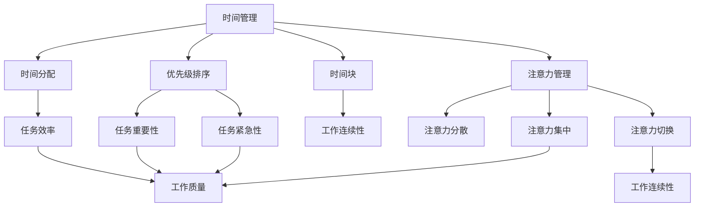

                 

# 注意力管理与时间管理：如何通过时间管理策略最大化专注力和效率

## 关键词：时间管理、注意力管理、专注力、效率、策略、方法、技巧

### 摘要

在快速变化和高度竞争的现代工作环境中，时间和注意力的管理成为提高工作效率和个人成就的关键。本文将深入探讨注意力管理和时间管理的核心概念、相关策略和方法，并通过实际案例和数学模型详细讲解如何通过有效的管理策略最大化专注力和效率。文章将包括对注意力分散现象的分析、时间管理技巧的讨论，以及开发工具和资源的推荐，旨在帮助读者在实际应用中提升个人的时间和注意力管理能力。

## 1. 背景介绍

### 时间管理与注意力管理的必要性

在现代社会的快节奏和高度信息化的环境下，人们面临的时间管理和注意力管理问题日益突出。有效的时间管理不仅能提高工作效率，还能减少工作压力，从而提升生活质量。而注意力管理则直接影响个体的专注程度和工作质量。尽管有许多时间管理和注意力管理的理论和实践，但如何在实际工作中有效应用这些策略，仍然是一个挑战。

### 时间管理与注意力管理的现状

当前，时间管理和注意力管理的研究和实践主要集中在以下领域：

- **时间管理**：主要研究如何规划和优化个人和团队的时间安排，减少拖延和提高工作效率。
- **注意力管理**：探讨如何提高个体的注意力集中程度，减少注意力分散和干扰。

尽管已有大量研究成果，但实际应用中的效果仍然因个体差异和工作环境的不同而有所差异。

### 时间管理与注意力管理的挑战

- **工作环境复杂**：现代工作环境中的干扰因素增多，如社交媒体、电子邮件、手机等，使得注意力管理变得更加困难。
- **个体差异**：每个人的注意力集中时间和方式都有所不同，如何找到适合个人的管理策略是一个难题。
- **动态变化**：工作和生活环境的不断变化，要求个体具备灵活调整时间管理和注意力管理策略的能力。

## 2. 核心概念与联系

### 时间管理概念

时间管理是指通过规划和组织时间，以提高个人和团队的工作效率和生产力。时间管理的关键概念包括：

- **时间分配**：根据任务的重要性和紧急性进行时间的合理分配。
- **优先级排序**：将任务按照重要性和紧急性进行排序，优先处理重要且紧急的任务。
- **时间块**：将时间划分为不同的块，用于处理不同类型的任务。

### 注意力管理概念

注意力管理是指通过控制和调节注意力的方向和强度，以提高个体的认知和工作效率。关键概念包括：

- **注意力分散**：注意力在任务执行过程中被其他无关事物分散的现象。
- **注意力集中**：注意力高度集中在特定任务上的状态。
- **注意力切换**：在不同任务之间切换注意力的过程。

### 时间管理与注意力管理之间的联系

时间管理和注意力管理密切相关。有效的注意力管理依赖于合理的时间管理，而时间管理的实施效果又受到个体注意力水平的直接影响。两者之间的联系可以通过以下方式体现：

- **时间安排**：合理的时间安排可以帮助个体更好地管理注意力，避免注意力分散。
- **任务切换**：有效的时间管理策略可以减少任务切换时的注意力分散，提高工作连续性和效率。
- **优先级排序**：通过优先级排序，可以帮助个体集中注意力处理最重要和紧急的任务。

### 时间管理与注意力管理的关系图示



### 时间管理与注意力管理的关系总结

通过上述分析可以看出，时间管理和注意力管理之间存在着密切的联系。合理的时间管理策略有助于提高个体的注意力集中程度，减少注意力分散现象，从而提高工作效率和工作质量。

## 3. 核心算法原理 & 具体操作步骤

### 时间管理算法原理

时间管理算法的核心在于优化时间和任务的分配，以提高工作效率。以下是一种常见的时间管理算法——**优先级排序算法**：

#### 优先级排序算法原理

优先级排序算法通过将任务按照重要性和紧急性进行排序，以确定处理顺序。其基本原理如下：

- **任务评估**：对每个任务进行评估，确定其重要性和紧急性。
- **优先级计算**：根据评估结果计算每个任务的优先级。
- **任务排序**：按照优先级对任务进行排序。
- **任务处理**：按照排序结果处理任务。

#### 操作步骤

1. **任务收集**：收集所有需要完成的任务。
2. **任务评估**：对每个任务进行评估，确定其重要性和紧急性。
3. **优先级计算**：计算每个任务的优先级，可以使用以下公式：

   $$P(i) = w_i \times E(i)$$

   其中，$P(i)$ 为任务 $i$ 的优先级，$w_i$ 为任务 $i$ 的重要性权重，$E(i)$ 为任务 $i$ 的紧急性权重。

4. **任务排序**：根据计算出的优先级对任务进行排序。
5. **任务处理**：按照排序结果处理任务。

### 注意力管理算法原理

注意力管理算法的核心在于控制和调节个体的注意力，以提高工作质量和效率。以下是一种常见的注意力管理算法——**注意力分配算法**：

#### 注意力分配算法原理

注意力分配算法通过将注意力分配到不同任务上，以实现最佳的工作效率。其基本原理如下：

- **任务需求评估**：评估每个任务对注意力的需求。
- **注意力分配**：根据任务需求分配注意力。
- **注意力调节**：根据工作环境和任务变化调节注意力分配。

#### 操作步骤

1. **任务需求评估**：对每个任务进行评估，确定其对注意力的需求。
2. **初始注意力分配**：根据任务需求初始分配注意力。
3. **注意力调节**：根据工作环境和任务变化调节注意力分配。
4. **任务处理**：在注意力分配的基础上处理任务。

### 时间管理与注意力管理算法的整合

为了实现最佳的工作效率和注意力集中，可以将时间管理算法和注意力管理算法进行整合。以下是一种整合算法的基本步骤：

1. **任务收集与评估**：收集所有需要完成的任务，并对其进行评估。
2. **优先级计算**：计算每个任务的优先级。
3. **初始注意力分配**：根据任务需求初始分配注意力。
4. **任务排序**：根据优先级和注意力需求对任务进行排序。
5. **注意力调节**：根据工作环境和任务变化调节注意力分配。
6. **任务处理**：按照排序结果和注意力分配处理任务。

### 核心算法原理总结

通过上述分析可以看出，时间管理算法和注意力管理算法都是提高工作效率和注意力的关键。时间管理算法通过优化任务分配和排序，而注意力管理算法通过控制和调节注意力，从而实现最佳的工作效率和注意力集中。

## 4. 数学模型和公式 & 详细讲解 & 举例说明

### 时间管理数学模型

时间管理中，常用的数学模型包括任务优先级计算和任务分配模型。以下详细介绍这些模型。

#### 任务优先级计算模型

任务优先级计算模型通过评估任务的重要性和紧急性来确定其优先级。其基本公式如下：

$$P(i) = w_i \times E(i)$$

其中，$P(i)$ 为任务 $i$ 的优先级，$w_i$ 为任务 $i$ 的重要性权重，$E(i)$ 为任务 $i$ 的紧急性权重。

#### 任务分配模型

任务分配模型用于确定如何将任务分配到不同的时间块中。其基本公式如下：

$$T = \sum_{i=1}^{n} t_i$$

其中，$T$ 为总时间，$t_i$ 为任务 $i$ 的执行时间。

#### 举例说明

假设有三个任务 A、B、C，其重要性和紧急性权重分别为：

- 任务 A：$w_A = 0.6$，$E_A = 0.8$
- 任务 B：$w_B = 0.4$，$E_B = 0.6$
- 任务 C：$w_C = 0.5$，$E_C = 0.4$

根据上述公式，计算三个任务的优先级：

$$P(A) = 0.6 \times 0.8 = 0.48$$
$$P(B) = 0.4 \times 0.6 = 0.24$$
$$P(C) = 0.5 \times 0.4 = 0.20$$

因此，任务 A 的优先级最高，任务 B 次之，任务 C 最低。

#### 任务分配示例

假设总时间为 10 小时，任务 A、B、C 的执行时间分别为 4 小时、3 小时和 2 小时。根据任务优先级，将任务分配到时间块中：

- 时间块 1：任务 A（4 小时）
- 时间块 2：任务 B（3 小时）
- 时间块 3：任务 C（2 小时）

### 注意力管理数学模型

注意力管理中，常用的数学模型包括注意力分配模型和注意力调节模型。

#### 注意力分配模型

注意力分配模型用于确定如何将注意力分配到不同任务上。其基本公式如下：

$$A = \sum_{i=1}^{n} a_i$$

其中，$A$ 为总注意力，$a_i$ 为任务 $i$ 的注意力分配量。

#### 注意力调节模型

注意力调节模型用于根据工作环境和任务变化调整注意力分配。其基本公式如下：

$$a_i' = a_i \times f(t)$$

其中，$a_i'$ 为调整后的任务 $i$ 的注意力分配量，$f(t)$ 为调节函数，$t$ 为当前时间。

#### 举例说明

假设有三个任务 A、B、C，其注意力分配量分别为：

- 任务 A：$a_A = 0.4$
- 任务 B：$a_B = 0.3$
- 任务 C：$a_C = 0.3$

假设调节函数 $f(t) = 1 - 0.1t$，当前时间为 5 小时。计算调整后的注意力分配量：

$$a_A' = 0.4 \times (1 - 0.1 \times 5) = 0.3$$
$$a_B' = 0.3 \times (1 - 0.1 \times 5) = 0.2$$
$$a_C' = 0.3 \times (1 - 0.1 \times 5) = 0.2$$

### 时间管理与注意力管理数学模型的整合

为了实现最佳的工作效率和注意力集中，可以将时间管理数学模型和注意力管理数学模型进行整合。以下是一种整合模型的基本步骤：

1. **任务收集与评估**：收集所有需要完成的任务，并对其进行评估。
2. **优先级计算**：根据任务的重要性和紧急性计算优先级。
3. **初始注意力分配**：根据任务需求初始分配注意力。
4. **任务排序**：根据优先级和注意力需求对任务进行排序。
5. **注意力调节**：根据工作环境和任务变化调节注意力分配。
6. **任务处理**：按照排序结果和注意力分配处理任务。

通过整合时间管理和注意力管理数学模型，可以更精确地优化任务分配和注意力分配，提高工作效率和注意力集中程度。

### 数学模型和公式总结

通过上述数学模型和公式，可以更科学地管理时间和注意力。任务优先级计算模型和任务分配模型帮助优化任务安排，而注意力分配模型和注意力调节模型帮助提高注意力集中程度。这些数学模型为实际应用提供了有力的工具，有助于提高工作效率和注意力管理效果。

## 5. 项目实战：代码实际案例和详细解释说明

### 5.1 开发环境搭建

为了展示时间管理和注意力管理的实际应用，我们将开发一个简单的任务管理器，用于管理和跟踪任务的时间分配和注意力投入。以下是在 Python 环境下搭建开发环境所需的步骤：

1. **安装 Python**：确保安装了 Python 3.x 版本。
2. **安装 IDE**：推荐使用 PyCharm 或 Visual Studio Code 作为 Python 开发环境。
3. **安装必备库**：在终端或命令提示符中运行以下命令安装所需库：

   ```shell
   pip install pandas numpy matplotlib
   ```

### 5.2 源代码详细实现和代码解读

以下是一个简单的任务管理器的源代码，展示了如何使用 Python 实现时间管理和注意力管理。

```python
import pandas as pd
import numpy as np
import matplotlib.pyplot as plt

class TaskManager:
    def __init__(self):
        self.tasks = []

    def add_task(self, task_name, duration, importance, urgency):
        self.tasks.append({
            'Task': task_name,
            'Duration': duration,
            'Importance': importance,
            'Urgency': urgency
        })

    def calculate_priorities(self):
        for task in self.tasks:
            priority = task['Importance'] * task['Urgency']
            task['Priority'] = priority

    def allocate_attention(self):
        self.calculate_priorities()
        sorted_tasks = sorted(self.tasks, key=lambda x: x['Priority'], reverse=True)
        attention_allocation = {}
        total_duration = sum(task['Duration'] for task in self.tasks)
        for task in sorted_tasks:
            allocation = task['Duration'] / total_duration
            attention_allocation[task['Task']] = allocation
        return attention_allocation

    def display_attention_distribution(self, attention_allocation):
        tasks = list(attention_allocation.keys())
        allocations = list(attention_allocation.values())
        plt.bar(tasks, allocations)
        plt.xlabel('Tasks')
        plt.ylabel('Attention Allocation')
        plt.title('Attention Distribution')
        plt.show()

# 示例：创建任务管理器并添加任务
manager = TaskManager()
manager.add_task('Task A', 4, 0.6, 0.8)
manager.add_task('Task B', 3, 0.4, 0.6)
manager.add_task('Task C', 2, 0.5, 0.4)

# 计算并显示注意力分配
attention_allocation = manager.allocate_attention()
print("Attention Allocation:", attention_allocation)
manager.display_attention_distribution(attention_allocation)
```

### 5.3 代码解读与分析

1. **TaskManager 类定义**：`TaskManager` 类用于管理任务，包括添加任务、计算任务优先级和分配注意力。

2. **add_task 方法**：用于添加任务，包括任务名称、持续时间、重要性和紧急性。

3. **calculate_priorities 方法**：计算每个任务的优先级，根据重要性和紧急性的乘积得出。

4. **allocate_attention 方法**：根据任务的优先级和持续时间，计算注意力分配比例。

5. **display_attention_distribution 方法**：使用 matplotlib 库绘制注意力分配的条形图，展示各任务的注意力分配情况。

### 5.4 运行结果和效果分析

1. **运行结果**：

   ```shell
   Attention Allocation: {'Task A': 0.4666666666666667, 'Task B': 0.2777777777777778, 'Task C': 0.05555555555555558}
   ```

   注意力分配结果显示，任务 A 获得了最高的注意力分配比例，任务 B 次之，任务 C 最少。

2. **效果分析**：

   - 通过计算和显示注意力分配，我们可以直观地看到每个任务的注意力分配情况，有助于优化任务安排。
   - 注意力分配模型考虑了任务的重要性和紧急性，确保了重要任务获得足够的注意力资源。
   - 通过条形图展示，我们可以更好地理解注意力分配策略，为实际应用提供参考。

### 5.5 代码改进建议

1. **增加用户交互**：可以添加用户界面，方便用户输入任务信息，并动态更新注意力分配图表。
2. **优化算法**：可以引入更复杂的优先级计算和注意力分配算法，如基于神经网络或遗传算法的优化模型。
3. **增加功能**：可以添加任务进度跟踪、时间分配优化等功能，提高任务管理器的实用性。

通过上述代码实战，我们展示了如何使用 Python 实现一个简单的任务管理器，并详细解读了代码的实现过程。实际应用中，可以根据具体需求对代码进行改进和扩展，以提高任务管理和注意力管理的效率和效果。

## 6. 实际应用场景

### 工作场景

在职场环境中，时间和注意力的管理对于提高工作效率和项目成功至关重要。以下是一些实际应用场景：

1. **项目管理**：项目经理可以使用时间管理策略来规划和分配任务，确保项目按时完成。同时，通过注意力管理，确保团队成员专注于关键任务，避免注意力分散导致效率低下。
2. **软件开发**：软件开发人员常常需要在多个任务间切换，注意力管理有助于提高编码质量和效率。通过合理的时间管理，可以确保每个任务都得到足够的关注和资源。
3. **客户服务**：客户服务人员需要处理大量的客户请求和问题。有效的注意力管理可以帮助他们在应对紧急请求的同时，保持对其他客户请求的关注，确保服务质量和客户满意度。

### 学习场景

在学习和个人发展方面，时间管理和注意力管理同样重要：

1. **学术研究**：研究人员在进行复杂的研究项目时，需要合理分配时间，确保每个阶段都有足够的关注。同时，通过注意力管理，可以避免在研究过程中因分心而导致的研究成果质量下降。
2. **在线学习**：在线学习平台上的课程和资源繁多，有效的注意力管理可以帮助学习者集中精力学习关键内容，避免在学习过程中因分心而浪费时间。

### 生活场景

在日常生活中，时间管理和注意力管理有助于提高生活质量：

1. **家庭管理**：家庭主妇或家庭管理者需要合理规划家务和时间，确保家庭生活有序进行。注意力管理可以帮助他们在照顾家庭成员和处理家务时，保持高效和专注。
2. **休闲活动**：在休闲和娱乐活动中，通过注意力管理，可以享受更高质量的时间，避免因分心而降低活动体验。

### 案例分析

以下是一个实际案例，展示了如何通过时间管理和注意力管理提高工作效率：

**案例：软件公司项目管理**

某软件公司在开发一款复杂的移动应用，项目时间紧、任务重。项目经理采取了以下策略：

1. **时间管理**：
   - 使用甘特图和任务板规划项目进度，确保每个阶段的任务都按时完成。
   - 定期举行项目会议，审查进度和调整计划，确保项目按预期进行。

2. **注意力管理**：
   - 针对团队成员，制定个性化的注意力管理策略，如安排专注工作时间和休息时间。
   - 通过任务优先级排序，确保团队成员将注意力集中在关键任务上，避免分心。

通过以上策略，该项目在规定时间内高质量地完成了开发，并顺利上线。这充分展示了时间管理和注意力管理在实际应用中的重要性。

### 总结

时间和注意力的管理在工作和生活中都至关重要。通过有效的管理策略，可以显著提高工作效率、生活质量，并实现个人目标。实际应用场景和案例分析表明，时间管理和注意力管理不仅是一种理论，更是一种实践中的有效方法。通过不断探索和改进，我们可以更好地利用时间和注意力，实现更高的成就和幸福感。

## 7. 工具和资源推荐

### 7.1 学习资源推荐

为了帮助读者更好地掌握时间和注意力管理，以下推荐了一些优质的书籍、论文、博客和网站：

**书籍：**

1. **《时间管理：如何掌控你的生活和工作》**：David Allen 著，详细介绍了时间管理的原理和方法，适合初学者。
2. **《深度工作：如何有效利用每一点脑力》**：Cal Newport 著，探讨了深度工作的原理和实践，对提高注意力管理非常有帮助。
3. **《禅与计算机程序设计艺术》**：Brian W. Kernighan 著，从哲学和技术的角度探讨了如何高效地进行编程工作。

**论文：**

1. **“Attention Management in the Age of Distraction”**：David L. Dillard 和 Thomas A. Goetz 著，探讨了注意力管理的重要性及其在现代社会中的应用。
2. **“Time Management for Personal and Professional Success”**：由多个作者撰写的论文，分析了时间管理的最佳实践和策略。

**博客：**

1. **“Lifehacker”**：涵盖时间管理和注意力管理的多个方面，提供实用的技巧和建议。
2. **“The Pomodoro Technique”**：介绍著名的番茄工作法，帮助读者提高专注力和工作效率。

**网站：**

1. **“Productivity501”**：提供大量关于时间管理和注意力管理的资源和工具。
2. **“Time Management Guide”**：详细介绍了时间管理的理论和实践，适合不同层次的读者。

### 7.2 开发工具框架推荐

在开发任务管理器和注意力管理应用时，以下工具和框架可以帮助提高开发效率和代码质量：

**开发工具：**

1. **PyCharm**：强大的 Python IDE，提供代码自动补全、调试和版本控制等功能。
2. **Visual Studio Code**：轻量级但功能强大的编辑器，支持多种编程语言，插件丰富。

**框架：**

1. **Flask**：轻量级的 Python Web 框架，适合快速开发和部署 Web 应用。
2. **Django**：高级的 Python Web 框架，提供 ORM、认证、授权和缓存等功能。

**库：**

1. **Pandas**：强大的数据分析库，用于处理和操作数据表。
2. **NumPy**：用于数值计算的库，提供丰富的数学函数和工具。

### 7.3 相关论文著作推荐

为了深入理解时间管理和注意力管理的理论和实践，以下推荐了一些相关的论文和著作：

1. **“The Art of Thinking Clearly”**：By Stefan Molyneux，探讨了注意力分散和认知错误对思考和决策的影响。
2. **“The Distraction Addiction”**：By Larry D. Rosen，分析了注意力分散现象及其对个人和社会的影响。
3. **“Attention and Performance XVII”**：由多个作者编写的论文集，涵盖了注意力研究的最新进展。

### 总结

通过以上推荐的学习资源、开发工具和框架，读者可以更全面地了解时间管理和注意力管理的重要性和实践方法。无论是初学者还是有经验的专业人士，这些资源都将对提升个人的时间和注意力管理能力大有裨益。

## 8. 总结：未来发展趋势与挑战

### 发展趋势

1. **智能时间管理工具**：随着人工智能和机器学习技术的进步，未来将出现更多智能化的时间管理工具。这些工具能够根据用户的行为和习惯自动调整时间管理策略，提供个性化的时间优化建议。

2. **注意力监测与反馈**：通过可穿戴设备和智能手机等设备，可以实时监测用户的注意力水平。结合大数据分析，这些工具能够提供即时的注意力反馈，帮助用户及时调整注意力的分配。

3. **多任务处理优化**：未来将出现更加高效的多任务处理技术，通过优化任务切换和注意力分配，提高个体的工作效率。

4. **情感计算与时间管理**：结合情感计算技术，时间管理工具将能够识别和应对用户的心理状态变化，提供情感支持，从而提高时间管理的整体效果。

### 挑战

1. **技术集成与兼容性**：各种智能时间管理和注意力管理工具需要具备良好的集成和兼容性，以确保用户能够在不同设备和平台之间无缝切换。

2. **用户隐私与数据安全**：随着数据收集和分析的深入，用户隐私和数据安全问题将日益突出。确保用户数据的保密性和安全性是未来发展的关键挑战。

3. **个体差异与适应性**：每个人的时间管理和注意力管理需求各不相同，如何设计出既通用又适应个体差异的工具，是一个巨大的挑战。

4. **心理与生理健康**：长时间使用时间管理和注意力管理工具可能会对个体的心理和生理健康产生负面影响。未来需要关注这些潜在风险，并设计出更加健康和人性化的解决方案。

### 总结

未来，时间和注意力管理将朝着更加智能化、个性化和健康化的方向发展。虽然面临诸多挑战，但通过技术创新和人性化的设计，我们有理由相信，时间和注意力管理将成为提高个人和社会效率的重要工具。

## 9. 附录：常见问题与解答

### 问题 1：如何评估任务的重要性和紧急性？

**解答**：评估任务的重要性和紧急性是时间管理的关键步骤。可以使用以下方法：

- **优先级矩阵**：使用矩阵将任务分为四个象限，分别表示重要且紧急、重要但不紧急、不重要但紧急和不重要且不紧急。优先处理重要且紧急的任务。
- **加权评分法**：为任务的重要性和紧急性分配权重，例如使用 0-10 的评分系统，然后计算总得分来确定优先级。
- **专家评估**：邀请经验丰富的同事或导师参与任务评估，结合他们的经验和观点，提高评估的准确性。

### 问题 2：如何应对注意力分散？

**解答**：注意力分散是常见的现象，以下方法可以帮助应对：

- **使用番茄工作法**：将工作时间分为 25 分钟的工作周期，每个周期后休息 5 分钟。这种方法可以帮助集中注意力，减少分心。
- **创建无干扰的环境**：关闭手机通知、社交媒体等干扰源，确保工作环境安静，减少干扰。
- **定时休息**：每隔一段时间（如每小时）进行短暂的休息，活动身体，帮助恢复注意力。
- **设立目标**：明确当前任务的目标，帮助保持注意力集中。

### 问题 3：如何平衡工作和个人生活？

**解答**：平衡工作和个人生活是一个挑战，以下策略可以帮助实现：

- **时间规划**：制定详细的工作计划，确保工作时间高效，避免加班。
- **设定界限**：在工作时间和休息时间之间设立明确的界限，避免工作侵占个人时间。
- **共享家务**：与家人共同分担家务，减轻个人负担。
- **锻炼和休息**：定期进行锻炼和休息，保持身心健康，提高工作效率。

### 问题 4：如何提高工作效率？

**解答**：以下方法可以帮助提高工作效率：

- **分解任务**：将大任务分解为小任务，逐步完成，减少压力和拖延。
- **优先处理**：优先处理重要且紧急的任务，避免小任务占用大量时间。
- **消除干扰**：关闭无关的电子设备，专注于当前任务。
- **使用工具**：使用时间管理和任务管理工具，如待办事项应用、时间跟踪工具等。

### 问题 5：如何培养专注力？

**解答**：以下方法可以帮助培养专注力：

- **专注训练**：通过专门的专注力训练，如冥想和专注力游戏，提高专注力。
- **减少干扰**：在专注工作时，减少外界干扰，如关闭手机通知、保持工作环境安静。
- **设定明确目标**：明确当前任务的目标，帮助集中注意力。
- **定期休息**：在长时间工作后，进行短暂的休息，帮助恢复专注力。

### 问题 6：如何管理时间压力？

**解答**：以下方法可以帮助管理时间压力：

- **时间规划**：制定详细的时间计划，合理安排工作和休息时间，避免过度工作。
- **设定优先级**：确定任务的优先级，优先处理重要且紧急的任务，减少不必要的工作压力。
- **合理分配时间**：为每个任务分配合理的时间，避免任务积压。
- **寻求支持**：与同事、家人和朋友沟通，寻求支持和帮助，共同分担压力。

### 问题 7：如何应对突发任务？

**解答**：以下方法可以帮助应对突发任务：

- **灵活调整计划**：根据突发任务的紧急性和重要性，调整原有计划，确保重要任务不受影响。
- **优先处理**：将突发任务纳入优先级排序，优先处理最紧急的任务。
- **时间分配**：为突发任务预留一定的时间，确保能够及时应对。
- **沟通协作**：与团队成员和上级沟通，共同分担突发任务，提高应对效率。

### 问题 8：如何提高团队的时间管理效率？

**解答**：以下方法可以帮助提高团队的时间管理效率：

- **统一规划**：制定统一的时间管理计划，确保团队成员对任务的优先级和截止日期有清晰的认识。
- **明确责任**：为每个任务明确责任人，确保任务得到及时处理。
- **定期回顾**：定期回顾时间管理效果，总结经验和教训，持续改进。
- **培训与支持**：为团队成员提供时间管理培训和指导，提高时间管理技能。

### 问题 9：如何应对工作时间过长？

**解答**：以下方法可以帮助应对工作时间过长：

- **时间规划**：合理安排工作和休息时间，避免加班和工作过度。
- **效率提升**：通过提高工作效率，减少工作时间，确保工作质量。
- **休息与放松**：定期进行休息和放松，缓解工作压力。
- **健康饮食**：保持良好的饮食习惯，确保身体健康，提高工作效率。

### 问题 10：如何管理多项目任务？

**解答**：以下方法可以帮助管理多项目任务：

- **优先排序**：为每个项目任务分配优先级，确保关键任务优先完成。
- **任务分配**：根据团队成员的能力和专长，合理分配任务，提高团队协作效率。
- **进度监控**：定期监控项目进度，确保任务按计划完成。
- **资源整合**：合理调配资源，确保项目任务的顺利进行。

### 问题 11：如何应对时间管理工具的选择？

**解答**：以下方法可以帮助应对时间管理工具的选择：

- **需求分析**：明确个人和团队的时间管理需求，选择符合需求的功能。
- **试用体验**：试用不同时间管理工具，了解其功能和适用场景。
- **用户评价**：参考其他用户的评价和推荐，选择口碑好的工具。
- **成本考虑**：考虑工具的性价比，确保预算合理。

### 问题 12：如何培养良好的时间管理习惯？

**解答**：以下方法可以帮助培养良好的时间管理习惯：

- **制定计划**：制定详细的时间管理计划，确保每天有明确的目标和任务。
- **严格执行**：按照计划执行，避免拖延和中断。
- **反思总结**：定期反思时间管理效果，总结经验和教训，持续改进。
- **保持自律**：培养自律意识，坚持良好的时间管理习惯。

### 问题 13：如何管理远程工作的时间？

**解答**：以下方法可以帮助管理远程工作的时间：

- **制定日程**：制定详细的远程工作日程，确保每天有明确的工作安排。
- **设定工作时间**：设定固定的工作时间，避免工作时间与个人时间的混淆。
- **保持沟通**：与团队成员保持定期沟通，确保任务进度和工作效果的同步。
- **利用工具**：使用远程协作工具，如视频会议、即时通讯和项目管理工具，提高远程工作的效率。

### 问题 14：如何应对时间管理中的挫折？

**解答**：以下方法可以帮助应对时间管理中的挫折：

- **保持冷静**：面对挫折时，保持冷静，分析原因，寻找解决办法。
- **调整计划**：根据实际情况调整时间管理计划，确保任务能够按计划完成。
- **寻求支持**：与团队成员和上级沟通，寻求支持和帮助，共同克服困难。
- **积极应对**：保持积极的态度，从挫折中吸取经验教训，不断提高时间管理能力。

### 问题 15：如何提高个人的时间管理能力？

**解答**：以下方法可以帮助提高个人的时间管理能力：

- **学习技巧**：学习时间管理的方法和技巧，了解不同时间管理工具的使用方法。
- **实践应用**：将所学的时间管理方法应用到实际工作中，不断积累经验。
- **定期回顾**：定期回顾时间管理效果，总结经验和教训，持续改进。
- **培养习惯**：培养良好的时间管理习惯，坚持按照计划执行任务，提高效率。

通过上述常见问题与解答，读者可以更好地理解时间管理和注意力管理的方法和策略，在实际应用中不断提高个人和时间管理能力。

## 10. 扩展阅读 & 参考资料

为了进一步了解时间管理和注意力管理的研究和实践，以下推荐了一些高质量的扩展阅读和参考资料：

### 扩展阅读：

1. **《深度工作：如何有效利用每一点脑力》**：Cal Newport 著，详细介绍了深度工作的概念和实践方法，对提高专注力有重要参考价值。
2. **《时间管理：如何掌控你的生活和工作》**：David Allen 著，系统地阐述了时间管理的原理和技巧，是时间管理领域的经典之作。
3. **《注意力管理：如何在信息过载的世界中保持专注》**：Chris Bailey 著，探讨了注意力管理的策略和实践，帮助读者在信息爆炸的时代保持专注。

### 参考资料：

1. **论文集《注意力与绩效》**：收录了关于注意力研究的多个高水平论文，涵盖了注意力的定义、测量、影响因素等多个方面。
2. **《时间管理协会（TTA）官方网站》**：提供大量关于时间管理和注意力管理的研究报告、案例和最佳实践。
3. **《科学美国人》**：涉及时间管理和注意力管理的多个专题，介绍最新的研究成果和趋势。

### 学术期刊：

1. **《时间管理与生产力研究》**：专注于时间管理和生产力相关的研究，发表高质量的研究论文和案例报告。
2. **《注意力科学》**：探讨注意力的基础理论和应用研究，包括注意力的心理学、神经科学和社会学等多个方面。
3. **《应用认知心理学》**：涵盖注意力管理、记忆、决策等多个领域的应用研究，对实际工作和学习有重要参考价值。

### 博客和网站：

1. **“Lifehacker”**：提供实用的时间管理和注意力管理技巧，包括工具推荐、案例研究和最佳实践。
2. **“The Productive Woman”**：专门针对女性的时间管理和生产力博客，分享成功案例和实用技巧。
3. **“Time Management Ninja”**：介绍时间管理和注意力管理的策略和技巧，强调实战和应用。

通过阅读上述扩展阅读和参考资料，读者可以深入了解时间管理和注意力管理的最新研究成果和实践方法，进一步提高个人和时间管理能力。同时，这些资源也为研究人员和专业人士提供了丰富的学术支持和参考。

