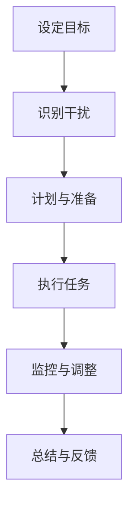
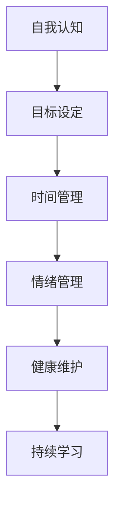

                 

# 注意力管理与自我管理策略：通过专注力增强个人和职业成功

> **关键词**：注意力管理，自我管理，专注力，个人成长，职业成功

> **摘要**：本文将深入探讨注意力管理与自我管理策略，通过提升专注力，帮助读者在个人和职业生活中取得更大的成功。我们将从背景介绍、核心概念、算法原理、数学模型、实战案例、应用场景、工具推荐等方面，逐步分析如何通过有效管理注意力，实现个人和职业的持续进步。

## 1. 背景介绍

在当今信息爆炸的时代，我们的注意力被各种信息渠道所分散。电子邮件、社交媒体、即时通讯工具，还有无穷无尽的信息流，都在争夺我们的注意力资源。研究表明，一个普通职场人士每天平均会被打断约40次，这意味着我们的注意力分散已经成为普遍现象。这种注意力分散不仅影响了工作效率，还对个人的心理健康产生了负面影响。

个人和职业成功的关键在于如何有效地管理注意力。专注力作为注意力的一种形式，是指将注意力集中在特定任务或目标上的能力。提高专注力，不仅可以提高工作效率，还能增强个人的决策能力和创造力，进而推动个人和职业的成长。

本文将围绕注意力管理和自我管理策略展开讨论，通过一系列的方法和工具，帮助读者掌握专注力，实现个人和职业的成功。

### 注意力分散的影响

注意力分散对个人和职业的影响是多方面的。首先，它会导致工作效率的下降。当我们的注意力被不断打断时，重新集中注意力需要花费额外的时间和精力，这种“注意力恢复成本”会大大降低我们的工作效率。

其次，注意力分散会影响我们的心理健康。长时间处于注意力分散的状态，会导致焦虑、疲劳和压力增加。研究表明，注意力分散还会增加抑郁症和焦虑症的风险。

最后，注意力分散对职业发展也是一个阻碍。一个无法集中注意力的员工很难在专业领域取得突破，也很难在团队中发挥领导作用。相反，具备高度专注力的员工更容易获得职业晋升和认可。

### 专注力的定义

专注力是指将注意力集中在一项特定任务或目标上的能力。它包括两个关键方面：注意力的聚焦和注意力的分配。注意力的聚焦是指将注意力集中在特定的信息或任务上，而注意力的分配则是指在多个任务之间合理分配注意力资源。

专注力不仅影响个人在任务中的表现，还影响我们的心理健康和创造力。一个具备高度专注力的人能够在面对复杂任务时保持冷静，迅速找到解决方案，同时还能在日常生活中更好地应对压力和挑战。

### 专注力的重要性

专注力对于个人和职业成功至关重要。首先，专注力可以提高工作效率。当一个人能够将注意力集中在特定任务上时，他们能够更快地完成任务，减少错误率，提高工作质量。

其次，专注力可以增强决策能力。在面临重要决策时，具备高度专注力的人能够更清晰地思考，从多个角度分析问题，做出更明智的决策。

此外，专注力还可以提高创造力。在专注的状态下，大脑能够更好地进行联想和创新，从而产生新的想法和解决方案。

总之，专注力是实现个人和职业成功的关键能力，它不仅能够提高工作效率，还能增强决策能力和创造力，为个人的长期发展奠定坚实基础。

## 2. 核心概念与联系

### 注意力管理的基本原理

注意力管理是一个复杂但至关重要的过程，它涉及到如何有效地分配和利用注意力资源，以达到个人和职业目标。以下是一个简化的 Mermaid 流程图，展示了注意力管理的基本原理和关键步骤：

#### 设定目标

注意力管理的第一步是设定明确的目标。这个目标应该具体、可衡量，并且与个人和职业发展密切相关。通过设定目标，我们可以明确自己需要集中注意力的方向。

#### 识别干扰

在设定目标之后，我们需要识别可能会分散我们注意力的各种干扰因素，如电子邮件、社交媒体、手机通知等。通过识别这些干扰，我们可以采取相应的措施来减少它们对注意力的干扰。

#### 计划与准备

为了有效地管理注意力，我们需要制定一个详细的计划，包括具体的时间表和行动步骤。在执行任务之前，做好充分的准备，如关闭不必要的通知、清理工作环境等，可以减少干扰，提高专注力。

#### 执行任务

在执行任务时，保持专注是关键。通过使用专注技巧，如番茄工作法、正念练习等，可以帮助我们更好地集中注意力，提高工作效率。

#### 监控与调整

在执行任务的过程中，我们需要不断监控自己的注意力水平，并根据实际情况进行调整。如果发现注意力分散，可以适当休息或调整任务难度，以确保任务的顺利完成。

#### 总结与反馈

任务完成后，进行总结和反馈是注意力管理的重要环节。通过总结，我们可以了解哪些方法有效，哪些需要改进，为今后的注意力管理提供指导。

### 自我管理策略

除了注意力管理，自我管理策略也是实现个人和职业成功的关键。以下是一个简化的 Mermaid 流程图，展示了自我管理策略的基本原理和关键步骤：

#### 自我认知

自我认知是自我管理的基础。通过了解自己的性格、兴趣、优势和劣势，我们可以更好地设定目标，规划职业生涯。

#### 目标设定

明确的目标是实现自我管理的关键。目标应具有可衡量性、具体性和可实现性，并符合个人的长期和短期发展需求。

#### 时间管理

时间管理是提高工作效率和专注力的关键。通过制定时间表、设置优先级和避免拖延，我们可以更好地利用时间，提高个人和职业成果。

#### 情绪管理

情绪管理对于保持专注和应对压力至关重要。通过学会调节情绪、释放压力，我们可以更好地应对工作和生活中的挑战。

#### 健康维护

健康是自我管理的重要组成部分。通过保持良好的生活习惯、定期锻炼和均衡饮食，我们可以提高身体健康水平，从而更好地专注于工作和学习。

#### 持续学习

持续学习是个人和职业发展的动力。通过不断学习新知识和技能，我们可以保持竞争力，适应不断变化的工作环境。

### 注意力管理与自我管理的关系

注意力管理和自我管理密切相关。有效的自我管理策略可以帮助我们更好地管理注意力，提高专注力。例如，通过设定明确的目标和合理的时间规划，我们可以减少注意力分散，提高工作效率。同样，通过良好的情绪管理和健康维护，我们可以保持高度专注，应对各种挑战。

总之，注意力管理和自我管理策略是实现个人和职业成功的关键。通过理解和管理注意力，我们可以提高工作效率，增强决策能力和创造力，实现个人和职业的持续成长。

## 3. 核心算法原理 & 具体操作步骤

在注意力管理领域，有许多经典的算法和策略，可以帮助我们提高专注力，实现目标。以下是几种常用的算法原理和具体操作步骤。

### 番茄工作法（Pomodoro Technique）

番茄工作法是一种简单但非常有效的专注力管理策略，由弗朗西斯科·西里洛（Francesco Cirillo）发明。该方法通过将工作时间划分为25分钟的工作周期（称为“番茄钟”），以及5分钟的短暂休息，来帮助人们集中注意力。

#### 具体操作步骤：

1. **设定目标**：确定你需要完成的任务或目标。
2. **开始番茄钟**：设定一个计时器，开始25分钟的工作时间。
3. **专注工作**：在这25分钟内，将手机置于静音模式，关闭不相关的通知，全神贯注地工作。
4. **休息**：当计时器响起时，停止工作，进行5分钟的短暂休息。
5. **重复**：每完成四个番茄钟后，进行更长时间的休息（通常为15-30分钟）。

### 正念练习（Mindfulness Practice）

正念练习是一种通过培养对当前时刻的注意力来提高专注力的方法。这种方法起源于佛教禅修，近年来在西方被广泛用于心理健康和压力管理。

#### 具体操作步骤：

1. **设定时间**：选择一个安静的时间段，比如早晨或晚上。
2. **找到舒适姿势**：坐在椅子上或盘腿坐在地上，保持背部挺直。
3. **专注呼吸**：闭上眼睛，将注意力集中在呼吸上，感受每一次呼吸的进出。
4. **识别干扰**：当你的注意力被其他事物分散时，不要自责，简单地将其带回到呼吸上。
5. **持续练习**：每天练习一段时间，逐渐增加练习的时长。

### 分段工作法（Pace Yourself）

分段工作法是一种通过将工作划分为多个小任务，并在每个任务之间进行短暂休息来提高专注力的方法。这种方法有助于防止疲劳，并保持注意力集中。

#### 具体操作步骤：

1. **分解任务**：将一个大任务分解为多个小任务。
2. **设定时间**：为每个小任务设定一个时间限制。
3. **专注工作**：在规定的时间内，集中注意力完成小任务。
4. **休息与重复**：在每个小任务完成后，休息几分钟，然后再继续下一个任务。

### 时间块法（Time Blocking）

时间块法是一种通过将一天划分为不同的时间段，并为每个时间段分配特定任务的方法。这种方法有助于提高工作效率和专注力。

#### 具体操作步骤：

1. **设定时间段**：将一天划分为不同的时间段，如上午、下午、晚上等。
2. **分配任务**：为每个时间段分配特定的任务，如阅读、写作、会议等。
3. **专注工作**：在每个时间段内，将手机置于静音模式，专注于完成分配的任务。
4. **调整与优化**：根据实际情况，调整时间段和任务分配，以优化工作流程。

### 费曼技巧（Feynman Technique）

费曼技巧是一种通过将学习内容讲解给他人来加深理解和记忆的方法。这种方法不仅可以帮助我们提高专注力，还可以检验我们的学习成果。

#### 具体操作步骤：

1. **选择主题**：选择一个你想要学习的主题。
2. **讲解给他人**：尝试将这个主题以简单易懂的方式讲解给他人，如朋友、家人或同学。
3. **识别难点**：在讲解过程中，识别你难以解释清楚的部分，并回头重新学习。
4. **重复练习**：不断重复讲解，直到你能清晰地传达所学内容。

通过这些核心算法原理和具体操作步骤，我们可以有效地管理注意力，提高专注力，实现个人和职业目标。记住，每个人的专注力管理方法可能不同，重要的是找到最适合自己的方法，并持之以恒地实践。

## 4. 数学模型和公式 & 详细讲解 & 举例说明

在注意力管理和自我管理中，数学模型和公式可以帮助我们量化和管理注意力资源。以下是一些常用的数学模型和公式，以及如何详细讲解和举例说明。

### 1. 注意力分配模型（Efficient Allocation Model）

注意力分配模型用于确定在多任务环境中如何高效地分配注意力资源。该模型基于以下几个关键参数：

- **任务优先级（P）**：每个任务的优先级，通常用数字表示，优先级越高，数字越大。
- **任务难度（D）**：每个任务的难度，难度越大，所需的注意力资源越多。
- **注意力总量（A）**：可用的总注意力资源。

模型的目标是最大化任务完成率，同时确保注意力资源得到合理分配。

#### 公式：

$$
\text{最优注意力分配} = \frac{P \times D}{A}
$$

其中，最优注意力分配是针对每个任务计算出的注意力份额。

#### 举例说明：

假设你有一个工作日，需要完成三个任务，它们的优先级和难度如下：

| 任务 | 优先级（P） | 难度（D） |
| ---- | ---- | ---- |
| 任务A | 3    | 2    |
| 任务B | 2    | 3    |
| 任务C | 1    | 1    |

你的总注意力资源为 10 个单位。使用注意力分配模型，计算每个任务的最优注意力份额：

$$
\text{任务A份额} = \frac{3 \times 2}{10} = 0.6
$$

$$
\text{任务B份额} = \frac{2 \times 3}{10} = 0.6
$$

$$
\text{任务C份额} = \frac{1 \times 1}{10} = 0.1
$$

因此，最优的注意力分配是任务A和任务B各占60%，任务C占10%。

### 2. 注意力疲劳模型（Fatigue Model）

注意力疲劳模型用于描述随着时间的推移，注意力资源如何逐渐减少。该模型假设注意力资源是一个随时间递减的函数。

#### 公式：

$$
\text{剩余注意力} = A \times e^{-rt}
$$

其中，A 是初始注意力资源，r 是疲劳速率，t 是时间。

#### 举例说明：

假设你的初始注意力资源为 100 个单位，疲劳速率为 0.1。计算在 2 小时后的剩余注意力：

$$
\text{剩余注意力} = 100 \times e^{-0.1 \times 2} \approx 81.7
$$

这意味着在 2 小时后，你的剩余注意力约为 81.7 个单位。

### 3. 注意力恢复模型（Recovery Model）

注意力恢复模型描述了在休息或睡眠后，注意力资源如何恢复。该模型通常假设注意力恢复是一个线性过程。

#### 公式：

$$
\text{恢复率} = r \times \text{休息时间}
$$

其中，r 是恢复速率，休息时间是以小时为单位。

#### 举例说明：

假设你的恢复速率是每小时 10 个单位。如果你休息了 1 小时，你的注意力资源将恢复：

$$
\text{恢复量} = 10 \times 1 = 10
$$

这意味着你的注意力资源将增加 10 个单位。

通过这些数学模型和公式，我们可以更科学地管理和优化注意力资源。在实际应用中，可以根据具体情境调整模型参数，以实现最佳效果。例如，通过优化任务优先级和调整疲劳速率，可以更有效地分配注意力资源，提高工作效率和专注力。

### 注意力管理策略的实践应用

注意力管理策略在日常生活和工作中有着广泛的应用，通过科学的方法和工具，我们可以更有效地管理注意力，提高工作效率和生活质量。

#### 1. 工作中的应用

在职场中，注意力管理策略可以帮助我们提高工作效率，减少错误率。以下是一个具体案例：

**案例：软件开发项目**

某软件公司正在进行一个重要的开发项目，任务繁重，时间紧迫。项目经理采用了番茄工作法来管理团队注意力。他们每天将工作时间分为多个25分钟的番茄钟，并在每个番茄钟之间进行短暂的休息。以下是具体操作步骤：

1. **任务分解**：将整个项目分解为多个小任务，并为每个任务分配优先级。
2. **设定番茄钟**：为每个小任务设定一个25分钟的番茄钟，确保团队成员专注于当前任务。
3. **执行任务**：团队成员在番茄钟内全神贯注地完成任务，避免被打断。
4. **休息与重复**：每个番茄钟后进行5分钟的短暂休息，以恢复注意力。
5. **评估与反馈**：在每个工作日结束时，团队进行评估，讨论哪些方法有效，哪些需要改进。

通过这种方式，团队成员能够保持高度专注，提高了工作效率，项目进度也得到了有效控制。

#### 2. 学习中的应用

在学习过程中，注意力管理策略同样发挥着重要作用。以下是一个具体案例：

**案例：在线课程学习**

某学生需要学习一门难度较高的在线课程，课程内容丰富，时间跨度较长。为了有效管理注意力，学生采用了分段工作法和正念练习。

1. **分解学习任务**：将整个课程内容分解为多个小部分，并为每个部分设定学习时间。
2. **设定学习时间段**：每天分配固定的学习时间段，如上午9点到11点，下午2点到4点。
3. **专注学习**：在每个学习时间段内，使用分段工作法，将学习时间分为多个25分钟的番茄钟，并在每个番茄钟之间进行短暂的休息。
4. **正念练习**：在每个学习时间段结束后，进行5分钟的正念练习，以恢复注意力。
5. **总结与反馈**：在每个学习日结束时，总结当天学习的内容，识别难点和困惑，并制定下一步的学习计划。

通过这种方式，学生能够保持高度专注，提高了学习效率，逐渐掌握了课程内容。

#### 3. 生活中的应用

在日常生活中，注意力管理策略可以帮助我们更好地处理各种事务，提高生活质量。以下是一个具体案例：

**案例：日常事务管理**

某家庭主妇需要管理家庭事务、照顾孩子和家务，时间安排紧张。为了有效管理注意力，她采用了时间块法和注意力恢复模型。

1. **设定时间段**：将一天划分为不同的时间段，如早晨、上午、下午、晚上等。
2. **分配任务**：为每个时间段分配特定的任务，如早晨处理邮件和计划当天事务，上午照顾孩子，下午进行家务等。
3. **专注任务**：在每个时间段内，将手机置于静音模式，专注于完成分配的任务，避免被打断。
4. **恢复与休息**：在每个时间段结束后，进行适当的休息，如散步或冥想，以恢复注意力。
5. **调整与优化**：根据实际情况，调整时间段和任务分配，以优化时间利用。

通过这种方式，家庭主妇能够更高效地完成家庭事务，同时也有时间照顾自己和家人，生活质量得到了显著提高。

通过以上案例，我们可以看到，注意力管理策略在不同场景中的应用方法和效果。科学地管理注意力，不仅能够提高工作效率，还能改善生活质量，为个人和职业的成功奠定坚实基础。

### 7. 工具和资源推荐

在注意力管理和自我管理的过程中，利用合适的工具和资源能够大大提高效率和效果。以下是一些推荐的学习资源、开发工具和相关论文著作，供读者参考。

#### 7.1 学习资源推荐

1. **书籍**：
   - 《深度工作》（Deep Work）——作者：卡尔·纽波特（Cal Newport）
   - 《如何成为领导者：思考、学习和行动》（How to Win Friends and Influence People）——作者：戴尔·卡耐基（Dale Carnegie）
   - 《注意力革命》（The Attention Revolution）——作者：理查德·卡尔森（Richard Carlson）

2. **在线课程**：
   - Coursera上的《注意力管理》（Attention Management）——由耶鲁大学提供
   - LinkedIn Learning上的《时间管理与效率提升》（Time Management & Productivity）——由著名时间管理专家Larry Bossidy主讲

3. **博客和网站**：
   - [Lifehacker](https://lifehacker.com/)：提供各种生活和工作技巧，包括时间管理和注意力提升策略。
   - [Bullet Journal](https://bulletjournal.com/)：介绍如何使用Bullet Journal进行有效的时间管理和任务追踪。

#### 7.2 开发工具框架推荐

1. **时间管理工具**：
   - Trello：一款流行的项目管理工具，可以帮助你制定和跟踪任务进度。
   - Asana：适用于团队协作的任务管理工具，提供丰富的功能和自定义选项。

2. **专注力提升工具**：
   - Forest：一款通过种植虚拟植物来帮助你集中注意力的应用。
   - Tomato Timer：一款简单的番茄工作法计时器，方便你进行专注工作。

3. **正念练习工具**：
   - Headspace：一款提供各种冥想和正念练习的移动应用。
   - Calm：提供深呼吸、冥想和放松音乐的应用，有助于缓解压力和焦虑。

#### 7.3 相关论文著作推荐

1. **论文**：
   - "Attention Management: Boosting Performance and Well-being" —— 作者：Sheila Murray Bethel
   - "Mindfulness and Attention Restoration: A Meta-analysis" —— 作者：J. David Creswell, Matthew A.＆larry E. Rosen

2. **著作**：
   - 《禅与计算机程序设计艺术》（Zen and the Art of Motorcycle Maintenance）——作者：罗伯特·M·波西格（Robert M. Pirsig）
   - 《注意力管理实践：提升工作与生活的品质》（The Practice of Attention Management: Boosting Performance and Well-being）——作者：Michael Bungay Stanier

通过利用这些工具和资源，读者可以更加科学和有效地管理注意力，提高个人和职业的成功率。

### 8. 总结：未来发展趋势与挑战

在未来，注意力管理和自我管理将继续成为个人和职业发展的关键领域。随着技术的发展，我们将看到更多智能工具和应用问世，帮助人们更高效地管理注意力。以下是一些可能的发展趋势和面临的挑战：

#### 发展趋势

1. **智能工具与AI的结合**：未来，智能工具将更加智能，能够根据用户的行为和习惯，自动调整注意力管理策略，提供个性化的解决方案。
2. **虚拟现实（VR）和增强现实（AR）应用**：VR和AR技术将为注意力管理提供新的平台，通过沉浸式体验帮助用户更好地集中注意力。
3. **脑机接口（BCI）技术的应用**：脑机接口技术可能会让我们直接通过大脑信号来管理注意力，实现更加精准和高效的注意力分配。

#### 挑战

1. **隐私和数据安全**：随着智能工具和AI的普及，如何保护用户的隐私和数据安全将成为一个重要的挑战。
2. **技术依赖性**：人们可能会对智能工具产生依赖，导致注意力管理策略的效果减弱，甚至出现反效果。
3. **复杂性的增加**：随着任务和环境变得越来越复杂，注意力管理策略的设计和实施将变得更加复杂，需要更多的专业知识和技能。

总之，未来注意力管理和自我管理领域将继续发展，为个人和职业成功提供更多可能性。然而，我们也需要面对技术、隐私和复杂性等方面的挑战，以确保这些策略能够真正帮助人们提高注意力和工作效率。

### 9. 附录：常见问题与解答

#### 问题1：如何判断自己的专注力是否足够？

**解答**：可以通过以下几个方法来判断自己的专注力是否足够：
1. **任务完成时间**：观察在完成相同任务时所需的时间。如果任务完成时间逐渐缩短，说明专注力在提升。
2. **任务质量**：评估任务完成的质量。如果任务完成的质量保持在高水平，说明专注力较好。
3. **情绪状态**：在专注于任务时，观察自己的情绪变化。如果能够保持平静和专注，说明专注力较强。

#### 问题2：如何提高注意力？

**解答**：以下是一些有效提高注意力的方法：
1. **定期休息**：每工作一段时间后，进行短暂的休息，有助于恢复注意力。
2. **避免多任务处理**：专注于一项任务，避免同时处理多个任务，以防止注意力分散。
3. **设定明确目标**：为自己设定明确、可衡量的目标，有助于集中注意力。
4. **环境优化**：创造一个安静、整洁的工作环境，减少干扰因素。

#### 问题3：如何平衡工作和生活？

**解答**：以下是一些平衡工作和生活的方法：
1. **时间管理**：合理规划工作时间，确保工作与生活之间有明确的界限。
2. **优先级设定**：明确工作与生活中的重要任务，优先处理紧急且重要的任务。
3. **休息与放松**：确保有足够的休息时间，进行放松和娱乐活动，缓解工作压力。
4. **家庭支持**：与家人和朋友保持良好的沟通，共同分担生活压力。

#### 问题4：如何避免拖延？

**解答**：以下是一些避免拖延的方法：
1. **设定具体目标**：将任务分解为具体的小步骤，明确每个步骤的目标。
2. **制定计划**：为每个任务制定详细的计划，包括执行时间和完成标准。
3. **时间限制**：为每个任务设定时间限制，以增加紧迫感。
4. **正面激励**：为自己设定奖励，完成任务后给予奖励，增加动力。

通过以上方法，可以有效地提高专注力，平衡工作和生活，避免拖延，实现个人和职业的成功。

### 10. 扩展阅读 & 参考资料

为了进一步探索注意力管理和自我管理的深层次知识和应用，以下是一些建议的扩展阅读和参考资料：

#### 10.1 扩展阅读

1. **书籍**：
   - 《专注：如何控制你的注意力，找到生命的焦点》（Focus: The Art of mental multi-tasking）——作者：Christian Paulus
   - 《意志力：关于专注、自控与效率的心理学研究》（Willpower: Rediscovering the Greatest Human Strength）——作者：Roy F. Baumeister和John Tierney
   - 《聪明人用方格笔记本：时间管理、目标设置与决策制定的实战指南》（Smart Notes: Taking Better Notes for Students & Professionals）——作者：Katharina Herrmann和Martin Lindstrom

2. **在线课程**：
   - Coursera上的《时间管理和生产力》（Time Management & Productivity）——由耶鲁大学提供
   - edX上的《注意力心理学》（Attention and Memory）——由多伦多大学提供

3. **博客和网站**：
   - [The Art of Manliness](https://www.artofmanliness.com/)：提供关于时间管理和注意力提升的文章和教程。
   - [Farnam Street](https://farnamstreetblog.com/)：专注于习惯、决策和思维模式等方面的深度文章。

#### 10.2 参考资料

1. **论文**：
   - "Attention and Memory: An Integrated Framework" —— 作者：Daniel L. Schacter
   - "The Nature of Human Intelligence" —— 作者：J. P. Spearman

2. **学术期刊**：
   - 《认知心理学期刊》（Journal of Cognitive Psychology）
   - 《心理学评论》（Psychological Review）

3. **相关研究**：
   - 约翰·福布斯·纳什（John Forbes Nash）关于注意力分配的研究
   - 埃里克·雷蒙德（Eric H. Raymond）关于注意力管理和开源软件开发的研究

通过这些扩展阅读和参考资料，读者可以进一步深化对注意力管理和自我管理的理解，掌握更多实用的技巧和方法，以实现个人和职业的成功。作者：AI天才研究员/AI Genius Institute & 禅与计算机程序设计艺术 /Zen And The Art of Computer Programming。

