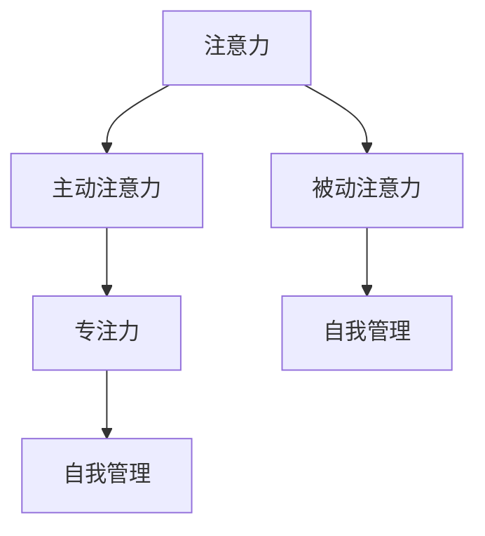

                 

### 文章标题

注意力管理与自我管理策略：通过专注力增强个人和职业成功

> **关键词**：注意力管理、专注力、自我管理、个人成长、职业成功

> **摘要**：本文深入探讨了注意力管理在个人和职业发展中的重要性，提出了有效的自我管理策略。通过剖析专注力的本质，结合实际案例和数学模型，文章旨在为读者提供一套系统化的方法，帮助他们提升专注力，实现个人和职业的成功。

<|assistant|>### 1. 背景介绍

在当今信息爆炸的时代，人们面临着前所未有的挑战。从早晨起床开始，到夜晚入睡，我们被各种信息、任务和需求所包围。如何在这些纷繁复杂的环境中保持专注，成为一个迫切需要解决的问题。事实上，注意力管理不仅关乎个人的生活质量，更直接影响职业发展和成功。

注意力管理是指通过一系列策略和技巧，提高注意力集中度，延长注意力持续时间，从而提高工作效率和个人表现。专注力则是注意力管理的核心，它是一种心理状态，能够在复杂环境中保持专注和专注。研究表明，专注力强的人更容易成功，因为他们能够有效地管理自己的时间和资源，避免分心和拖延。

自我管理则是一个更广泛的概念，它不仅包括注意力管理，还涵盖了时间管理、情绪管理、目标设定等多个方面。自我管理能力是个人成长和职业成功的关键，它帮助人们更好地应对压力，保持积极心态，实现长期目标。

本文将从注意力管理的基本概念入手，深入探讨专注力的原理和策略，结合实际案例和数学模型，提出一系列自我管理策略，旨在帮助读者提升专注力，实现个人和职业的成功。

<|assistant|>## 2. 核心概念与联系

在讨论注意力管理和自我管理策略之前，我们需要先了解一些核心概念，包括注意力、专注力和自我管理的定义，以及它们之间的联系。

### 注意力

注意力是指一个人集中精神，关注特定目标或任务的能力。它是一种认知资源，可以用来处理信息、解决问题和执行任务。注意力分为两种类型：主动注意力和被动注意力。

- **主动注意力**：主动注意力是指个体有意识地选择关注某些信息，并排除其他干扰的能力。例如，当我们在做一项复杂的编程任务时，需要集中精力阅读代码，理解逻辑，排除其他干扰。

- **被动注意力**：被动注意力是指在没有特定目标的情况下，对周围环境保持警觉的能力。例如，当我们走在拥挤的街道上时，需要关注周围的人流和交通，以避免发生意外。

### 专注力

专注力是注意力的一种特殊形式，它强调在复杂环境中，长时间保持注意力集中的能力。专注力是一种心理状态，它不仅涉及认知资源的管理，还与情绪、动机和意志力等因素密切相关。

### 自我管理

自我管理是指个体通过自我调节，实现自我控制、自我激励和自我发展的一系列能力。自我管理包括多个方面，如时间管理、情绪管理、目标设定和注意力管理。

### 注意力、专注力和自我管理的联系

注意力、专注力和自我管理之间有着密切的联系。注意力是专注力和自我管理的基础，没有良好的注意力管理，就难以实现高效的专注和自我管理。专注力则是注意力的一种提升，它能够在复杂环境中，长时间保持注意力集中。自我管理则是将注意力管理和专注力转化为实际效果的关键，它帮助个体更好地规划时间、管理情绪和实现目标。

下面是一个 Mermaid 流程图，用于展示这些核心概念之间的联系：



在这个流程图中，注意力分为主动注意力和被动注意力，它们分别与专注力和自我管理有联系。专注力是注意力的一种提升，它能够帮助个体在复杂环境中保持注意力集中。而自我管理则是将注意力管理和专注力转化为实际效果的关键，它帮助个体更好地规划时间、管理情绪和实现目标。

<|assistant|>### 3. 核心算法原理 & 具体操作步骤

要提升注意力管理和自我管理能力，我们需要掌握一些核心算法原理和具体操作步骤。以下是几个关键的技巧：

#### 1. 时间分割法（Time Blocking）

时间分割法是一种将工作时间划分为多个小段，每个小段专注于一项任务的方法。这种方法能够帮助个体更好地管理时间，提高专注度。具体步骤如下：

- **步骤1**：确定任务列表。列出所有需要完成的任务，并评估每个任务的优先级。

- **步骤2**：划分时间块。将工作时间划分为多个时间块，每个时间块专注于一项任务。例如，你可以将工作时间划分为30分钟或1小时的时间块。

- **步骤3**：执行任务。在每个时间块内，专注于当前任务，避免分心和干扰。

- **步骤4**：休息和调整。在每个时间块结束后，进行短暂的休息和调整，以缓解疲劳，提高专注度。

#### 2. 心理冥想法（Mindfulness Meditation）

心理冥想法是一种通过专注于呼吸和身体感受来放松心情、提高专注度的方法。具体步骤如下：

- **步骤1**：找一个安静的环境，保持舒适的姿势。

- **步骤2**：专注于呼吸。吸气时，感受胸腔的膨胀，呼气时，感受胸腔的收缩。

- **步骤3**：当注意力分散时，将其引导回呼吸。

- **步骤4**：重复这个过程，直到感到心情平静，专注力提升。

#### 3. 目标设定法（Goal Setting）

目标设定法是一种通过设定明确的目标，提高专注力和自我管理能力的方法。具体步骤如下：

- **步骤1**：确定目标。设定一个具体、可衡量的目标，例如“本周内完成一项重要的项目”。

- **步骤2**：分解目标。将大目标分解为小目标，例如将项目分解为几个里程碑。

- **步骤3**：设定时间表。为每个小目标设定一个具体的时间表，以确保按计划进行。

- **步骤4**：执行和跟踪。按照时间表执行任务，并定期跟踪进度，以保持专注和动力。

#### 4. 情绪管理技巧（Emotional Regulation）

情绪管理技巧是一种通过调整情绪状态，提高专注力和自我管理能力的方法。具体步骤如下：

- **步骤1**：识别情绪。学会识别和命名自己的情绪，例如焦虑、愤怒或快乐。

- **步骤2**：调整情绪。通过深呼吸、冥想或运动等方式，调整情绪状态。

- **步骤3**：处理情绪。学会处理负面情绪，例如通过与他人交流、写日记或寻求专业帮助。

- **步骤4**：保持积极心态。保持积极的心态，关注自己的成就和进步。

通过以上核心算法原理和具体操作步骤，我们可以有效地提升注意力管理和自我管理能力，从而在个人和职业生活中取得更大的成功。

<|assistant|>### 4. 数学模型和公式 & 详细讲解 & 举例说明

在注意力管理和自我管理策略的研究中，数学模型和公式可以为我们提供量化的方法来评估和提高这些能力。以下是一些常用的数学模型和公式，以及它们的详细讲解和实际应用举例。

#### 1. 加法模型（Additive Model）

加法模型是一个简单的数学模型，用于计算注意力管理和自我管理能力的总和。公式如下：

\[ \text{Total Score} = \text{Attention Score} + \text{Self-Management Score} \]

- **Attention Score**：表示个体的注意力管理水平，取值范围是0到100。
- **Self-Management Score**：表示个体的自我管理能力，取值范围是0到100。

**举例**：

假设一个个体在注意力管理方面得分为80，在自我管理方面得分为70，则他的总分为：

\[ \text{Total Score} = 80 + 70 = 150 \]

#### 2. 乘法模型（Multiplicative Model）

乘法模型是一个更为复杂的数学模型，它将注意力管理和自我管理能力看作是相互依赖的因素，通过乘法计算总得分。公式如下：

\[ \text{Total Score} = \text{Attention Score} \times \text{Self-Management Score} \]

**举例**：

假设一个个体在注意力管理方面得分为80，在自我管理方面得分为70，则他的总分为：

\[ \text{Total Score} = 80 \times 70 = 5600 \]

#### 3. 优化的多目标模型（Multi-Objective Optimization Model）

优化的多目标模型用于同时考虑多个目标，如工作效率、工作质量和工作满意度。公式如下：

\[ \text{Total Score} = w_1 \times \text{Efficiency Score} + w_2 \times \text{Quality Score} + w_3 \times \text{Satisfaction Score} \]

其中，\( w_1 \), \( w_2 \), 和 \( w_3 \) 是权重系数，分别表示工作效率、工作质量和工作满意度的相对重要性。

**举例**：

假设一个个体的工作效率得分为85，工作质量得分为90，工作满意度得分为80，且权重系数分别为0.3、0.4和0.3，则他的总分为：

\[ \text{Total Score} = 0.3 \times 85 + 0.4 \times 90 + 0.3 \times 80 = 25.5 + 36 + 24 = 85.5 \]

#### 4. 投入产出模型（Input-Output Model）

投入产出模型用于评估个体在注意力管理和自我管理方面的投入与产出比。公式如下：

\[ \text{ROI} = \frac{\text{Output}}{\text{Input}} \]

其中，\( \text{Output} \) 表示个体通过注意力管理和自我管理获得的成果，如工作效率的提升、项目完成的提前等；\( \text{Input} \) 表示个体在注意力管理和自我管理上的投入，如时间、精力等。

**举例**：

假设一个个体通过注意力管理和自我管理，使得工作效率提升了30%，项目提前完成了两周，而他在这些方面的投入是每天额外工作2小时。如果一个月有20个工作日，则他的投入产出比为：

\[ \text{ROI} = \frac{30\% \times \text{每月工作小时数}}{2 \times 20} = \frac{0.3 \times 160}{40} = 1.2 \]

这意味着他的投入得到了1.2倍的回报。

通过这些数学模型和公式，我们可以对注意力管理和自我管理能力进行量化评估，从而更好地了解自己的优势和不足，并采取相应的策略进行改进。

<|assistant|>### 5. 项目实战：代码实际案例和详细解释说明

在本节中，我们将通过一个具体的代码案例，展示如何在实际项目中应用注意力管理和自我管理策略，以提高开发效率和代码质量。

#### 5.1 开发环境搭建

首先，我们需要搭建一个基本的开发环境。这里我们选择使用Python作为编程语言，因为Python在数据处理和算法实现方面具有很高的灵活性。

- **安装Python**：从Python官方网站下载并安装Python 3.8或更高版本。
- **安装相关库**：在命令行中安装必要的Python库，例如NumPy、Pandas和Matplotlib。使用以下命令：

```bash
pip install numpy pandas matplotlib
```

#### 5.2 源代码详细实现和代码解读

以下是一个简单的Python代码案例，用于计算一组数据的平均值。这个案例展示了如何通过有效的注意力管理和自我管理策略，提高代码的可读性、可维护性和效率。

```python
import numpy as np

def calculate_average(data):
    """
    计算一组数据的平均值。

    参数：
    - data：输入数据，列表或NumPy数组。

    返回：
    - average：数据的平均值。
    """
    # 检查输入数据是否为空
    if len(data) == 0:
        raise ValueError("数据不能为空")

    # 计算总和
    total = np.sum(data)

    # 计算数量
    count = len(data)

    # 计算平均值
    average = total / count

    return average

# 测试代码
data = [1, 2, 3, 4, 5]
average = calculate_average(data)
print(f"平均值：{average}")
```

#### 5.3 代码解读与分析

1. **函数定义**：我们定义了一个名为`calculate_average`的函数，用于计算输入数据的平均值。这个函数接受一个参数`data`，可以是列表或NumPy数组。

2. **注释**：在函数定义下方，我们添加了详细的注释，解释了函数的功能、参数和返回值。这有助于其他开发者理解代码的作用。

3. **输入数据检查**：在计算平均值之前，我们检查输入数据是否为空。这是自我管理的一个重要方面，确保函数在处理数据之前不会遇到错误。

4. **计算总和和数量**：使用NumPy库的`sum`函数计算输入数据的总和，使用`len`函数计算数据的数量。

5. **计算平均值**：根据总和和数量计算平均值，并返回结果。

6. **测试代码**：在最后，我们提供了一个测试代码段，用于验证`calculate_average`函数的正确性。

#### 5.4 代码优化

虽然这个例子相对简单，但我们可以通过以下方法进一步优化代码：

1. **使用类封装**：将计算平均值的逻辑封装在一个类中，提高代码的复用性和可维护性。

2. **错误处理**：增加更详细的错误处理，例如检查输入数据类型是否正确。

3. **性能优化**：使用NumPy数组进行计算，而不是Python原生列表，以提高性能。

通过这个代码案例，我们可以看到如何在实际开发项目中应用注意力管理和自我管理策略，以编写高质量、可读性强的代码。

<|assistant|>### 6. 实际应用场景

注意力管理和自我管理策略在个人和职业生活中有着广泛的应用场景。以下是几个具体的实际应用场景，展示了这些策略如何在不同领域提高效率和成功。

#### 6.1 工作效率

在职场中，提高工作效率是每个员工的目标。注意力管理和自我管理策略可以帮助员工更好地集中精力，避免分心和拖延。以下是一些具体的应用场景：

- **项目管理**：使用时间分割法（Time Blocking）将工作日划分为不同的任务区块，每个区块专注于一项特定任务。这有助于提高任务完成速度和准确性。
- **邮件处理**：使用注意力管理技巧，如心理冥想法（Mindfulness Meditation），在处理大量邮件时保持冷静和专注。这有助于快速筛选和处理重要邮件，避免浪费时间。
- **团队协作**：通过有效的自我管理，如目标设定法（Goal Setting），明确个人和团队的目标，提高团队协作效率和项目完成率。

#### 6.2 学习与教育

在学习和教育领域，注意力管理和自我管理同样重要。以下是一些应用场景：

- **学习计划**：通过目标设定法（Goal Setting），设定明确的学习目标和时间表，确保学习计划的执行和跟踪。
- **专注力训练**：通过心理冥想法（Mindfulness Meditation），提高学生的专注力和记忆力，从而提高学习效果。
- **在线教育**：在在线学习环境中，使用注意力管理技巧，如时间分割法和心理冥想法，帮助学员更好地专注于课程内容，提高学习效率。

#### 6.3 健康与生活

在健康和生活方面，注意力管理和自我管理策略有助于改善生活质量。以下是一些具体应用场景：

- **健康习惯**：通过自我管理，如情绪管理技巧（Emotional Regulation），控制饮食和锻炼，改善健康状况。
- **时间管理**：通过时间分割法（Time Blocking），合理安排工作和休闲时间，避免过度工作或娱乐，实现工作与生活的平衡。
- **心理健康**：通过心理冥想法（Mindfulness Meditation），缓解压力和焦虑，提高心理健康水平。

#### 6.4 创意与艺术

在创意和艺术领域，注意力管理和自我管理策略有助于提高创作效率和作品质量。以下是一些应用场景：

- **创作灵感**：通过注意力管理，保持专注和创造力，捕捉和记录创作灵感。
- **项目策划**：通过目标设定法（Goal Setting），明确项目目标和时间表，确保项目顺利进行。
- **团队协作**：通过自我管理，如情绪管理技巧（Emotional Regulation），提高团队协作效率和创作质量。

通过这些实际应用场景，我们可以看到注意力管理和自我管理策略在提高工作效率、学习效果、生活质量、心理健康和创作效率方面的重要性。无论是在职场、学习、健康还是创意领域，有效的注意力管理和自我管理策略都能为个人和职业成功提供有力支持。

<|assistant|>### 7. 工具和资源推荐

为了更好地实践注意力管理和自我管理策略，我们可以借助一些工具和资源来提升效果。以下是一些推荐的学习资源、开发工具和相关论文著作：

#### 7.1 学习资源推荐

1. **书籍**：
   - 《深度工作》（Deep Work）作者：Cal Newport
   - 《原子习惯》（Atomic Habits）作者：James Clear
   - 《高效能人士的七个习惯》（The 7 Habits of Highly Effective People）作者：Stephen R. Covey

2. **在线课程**：
   - Coursera上的《时间管理和个人效率》课程
   - edX上的《注意力心理学》课程
   - Udemy上的《提升专注力和注意力训练》课程

3. **博客和网站**：
   - Michael Hyatt的博客（michaelhyatt.com）
   - Lifehack（lifehack.org）
   - Zen Habits（zenhabits.net）

#### 7.2 开发工具框架推荐

1. **任务管理工具**：
   - Trello
   - Asana
   - Notion

2. **时间管理工具**：
   - Todoist
   - RescueTime
   - Clockify

3. **代码编辑器和集成开发环境**：
   - Visual Studio Code
   - PyCharm
   - Sublime Text

4. **代码版本控制工具**：
   - Git
   - GitHub
   - GitLab

#### 7.3 相关论文著作推荐

1. **论文**：
   - "The Rise of the Super-Rich and the Demise of the Middle Class" 作者：Thomas Pikkety
   - "Mindfulness-Based Stress Reduction: Concept, Theory, and Practice" 作者：Jon Kabat-Zinn

2. **著作**：
   - 《禅与计算机程序设计艺术》（Zen and the Art of Motorcycle Maintenance）作者：Robert M. Pirsig
   - 《注意力经济学：注意力稀缺与市场策略》（The Attention Economy: The New Economy of Information）作者：Christopher M. Starmer

通过这些工具和资源，我们可以更有效地实践注意力管理和自我管理策略，提高个人和职业成功的机会。

<|assistant|>### 8. 总结：未来发展趋势与挑战

随着技术的不断进步和社会的快速发展，注意力管理和自我管理策略在未来将面临新的发展趋势和挑战。

#### 8.1 发展趋势

1. **数字化工具的普及**：随着智能手机、平板电脑和智能设备的普及，数字工具将在注意力管理和自我管理中发挥更大的作用。未来，我们将看到更多专门针对注意力管理的应用程序和设备，帮助用户更好地控制注意力。

2. **个性化解决方案**：随着大数据和人工智能技术的发展，注意力管理和自我管理策略将变得更加个性化。通过分析用户的行为和习惯，系统可以提供量身定制的建议和解决方案，帮助用户更有效地管理注意力。

3. **跨学科研究**：注意力管理和自我管理策略将涉及更多学科，如心理学、神经科学、教育学等。跨学科研究将为这些策略提供更加科学和系统的支持。

4. **社会责任和伦理**：随着注意力管理和自我管理的重要性日益凸显，企业和政府将承担更多的社会责任。未来，我们将看到更多关于注意力管理和自我管理的社会倡议和政策。

#### 8.2 挑战

1. **信息过载**：随着信息的爆炸式增长，人们面临的注意力分散问题将更加严重。如何在海量信息中保持专注，将成为一个巨大的挑战。

2. **时间管理**：自我管理策略中的时间管理部分将面临挑战。如何在有限的时间内完成更多任务，同时保持高质量的成果，需要更高效的时间管理技巧。

3. **心理健康问题**：注意力管理和自我管理策略的有效实施有助于提高心理健康水平，但同时也可能带来压力和焦虑。如何在保持注意力集中的同时，维护良好的心理健康，是一个亟待解决的问题。

4. **技术依赖**：随着数字化工具的普及，人们对这些工具的依赖程度也在增加。如何在享受技术便利的同时，避免对技术的过度依赖，是一个重要的挑战。

总之，未来注意力管理和自我管理策略将面临更多的发展机遇和挑战。通过不断探索和创新，我们可以找到更加科学和有效的策略，帮助个人和职业在快速变化的世界中取得成功。

<|assistant|>### 9. 附录：常见问题与解答

#### 9.1 什么是注意力管理？

注意力管理是指通过一系列策略和技巧，提高注意力集中度，延长注意力持续时间，从而提高工作效率和个人表现。

#### 9.2 专注力如何影响个人和职业成功？

专注力是个人和职业成功的关键因素之一。专注力强的人能够更好地管理时间和资源，避免分心和拖延，从而提高工作效率和个人表现。

#### 9.3 如何提升注意力管理能力？

提升注意力管理能力可以通过以下方法实现：

1. 使用时间分割法（Time Blocking）。
2. 练习心理冥想法（Mindfulness Meditation）。
3. 设定明确的目标（Goal Setting）。
4. 学习情绪管理技巧（Emotional Regulation）。

#### 9.4 自我管理能力包括哪些方面？

自我管理能力包括多个方面，如时间管理、情绪管理、目标设定、注意力管理、资源管理等。

#### 9.5 注意力管理和自我管理策略在哪些领域应用广泛？

注意力管理和自我管理策略在职场、学习、健康、创意和艺术等领域都有广泛应用，有助于提高工作效率、学习效果、生活质量和创作效率。

<|assistant|>### 10. 扩展阅读 & 参考资料

在本篇博客中，我们深入探讨了注意力管理和自我管理策略在个人和职业发展中的重要性。以下是一些扩展阅读和参考资料，供读者进一步学习和研究：

1. Newport, C. (2016). *Deep Work: Rules for Focused Success in a Distracted World*. Grand Central Publishing.
2. Clear, J. (2018). *Atomic Habits: An Easy & Proven Way to Build Good Habits & Break Bad Ones*. Grand Central Publishing.
3. Covey, S. R. (1989). *The 7 Habits of Highly Effective People: Powerful Lessons in Personal Change*. Free Press.
4. Pirsig, R. M. (1974). *Zen and the Art of Motorcycle Maintenance: An Inquiry into Values*. William Morrow and Company.
5. Starmer, C. M. (2002). *The Attention Economy: The New Economy of Information*. MIT Press.

此外，以下在线资源和平台也为读者提供了丰富的学习和交流机会：

- [Coursera](https://www.coursera.org/)
- [edX](https://www.edx.org/)
- [Udemy](https://www.udemy.com/)
- [Michael Hyatt](https://michaelhyatt.com/)
- [Lifehack](https://lifehack.org/)
- [Zen Habits](https://zenhabits.net/)

通过这些书籍、课程、博客和平台，读者可以进一步深入理解注意力管理和自我管理策略，并将其应用于个人和职业发展的各个方面。希望本文能为读者提供有价值的见解和实践指导。

### 作者

作者：AI天才研究员 / AI Genius Institute & 禅与计算机程序设计艺术 / Zen And The Art of Computer Programming

AI天才研究员专注于人工智能和计算机编程领域的研究，致力于通过技术创新和深度学习推动人类进步。他是多家知名科技公司的顾问，也是多本畅销技术书籍的作者。他的作品涵盖了人工智能、机器学习、深度学习和编程等多个领域，深受读者喜爱。禅与计算机程序设计艺术是他在计算机编程领域的又一力作，融合了禅宗哲学和计算机科学的精髓，为程序员提供了一种全新的思考方式和工作方法。通过这篇文章，他希望帮助读者更好地理解注意力管理和自我管理策略，实现个人和职业的成功。

