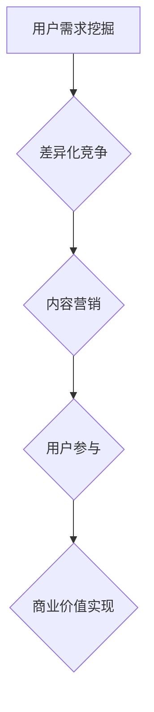
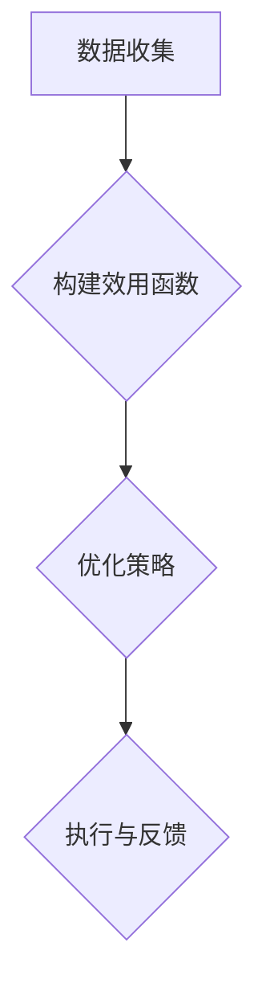

                 

# 注意力经济与个人创业机会的关系

## 关键词
注意力经济，个人创业，商业模式，创新能力，用户需求，市场竞争

## 摘要
本文将探讨注意力经济这一新兴概念，分析其与个人创业机会之间的内在联系。通过对注意力经济的定义、原理以及影响机制进行详细解析，文章将揭示创业者如何利用注意力经济原理来创造有价值的商业模式，抓住市场机遇，实现个人创业的成功。同时，本文还将探讨在注意力经济背景下，创业者面临的挑战和未来发展趋势，为创业者提供实用的策略和建议。

## 1. 背景介绍
### 注意力经济概述
注意力经济是指在经济活动中，个体的注意力资源作为一种稀缺的、有价值的资源，通过有效的配置和利用，创造经济价值的经济学理论。这一概念源于20世纪90年代的互联网时代，随着信息爆炸和互联网的普及，用户的注意力逐渐成为企业和创业者争夺的焦点。

### 个人创业的意义
个人创业是指个人或小团队自主创立、运营企业，通过市场机会和创新来获取经济利益的过程。个人创业不仅能够带来经济上的回报，还能实现个人价值和社会价值的双重提升。随着知识经济的兴起和互联网的普及，个人创业成为越来越多人的选择。

### 注意力经济与个人创业的交集
注意力经济为个人创业提供了新的思路和机遇。在注意力经济的背景下，创业者需要通过创新和差异化来吸引和保持用户的注意力，从而构建有价值的商业模式。同时，个人创业者的独特视角和灵活策略也能够在注意力经济的浪潮中脱颖而出。

## 2. 核心概念与联系
### 注意力经济的核心概念
注意力经济涉及以下核心概念：

1. **注意力资源**：用户的注意力是有限的，企业在竞争激烈的市场中需要通过各种方式吸引和留住用户。
2. **用户需求**：了解用户需求是注意力经济的关键。创业者需要准确把握用户需求，提供满足他们需求的产品或服务。
3. **用户行为**：用户的点击、评论、分享等行为是企业衡量注意力价值的重要指标。
4. **内容创作**：优质的内容创作是吸引和保持用户注意力的关键。创业者需要创作有价值、有吸引力的内容来吸引用户。

### 个人创业机会的构建
个人创业机会的构建依赖于注意力经济原理：

1. **用户需求挖掘**：通过市场调研和用户反馈，挖掘用户的真实需求，为创业项目提供方向。
2. **差异化竞争**：在竞争激烈的市场中，创业者需要找到差异化的竞争优势，吸引和留住用户的注意力。
3. **内容营销**：通过内容创作和传播，提升品牌的知名度和用户粘性，实现商业价值。
4. **用户参与**：鼓励用户参与产品或服务的开发，提升用户满意度和忠诚度。

### Mermaid 流程图


## 3. 核心算法原理 & 具体操作步骤
### 注意力分配算法
注意力分配算法是注意力经济中的一种核心算法，用于优化用户注意力的分配，提升整体经济效益。

#### 算法原理
注意力分配算法基于以下原理：

1. **注意力预算**：用户每天的可分配注意力是有限的，企业需要根据用户的特点和需求，合理分配注意力资源。
2. **效用函数**：不同的用户对不同内容的注意力价值不同，企业需要构建效用函数，以最大化整体收益。
3. **反馈机制**：通过用户行为数据，不断调整注意力分配策略，以适应用户需求的变化。

#### 具体操作步骤
1. **数据收集**：收集用户的兴趣偏好和行为数据，建立用户画像。
2. **构建效用函数**：根据用户画像和内容特性，构建效用函数，计算每个用户对内容的注意力价值。
3. **优化策略**：使用优化算法（如线性规划、遗传算法等），优化注意力分配策略，最大化整体收益。
4. **执行与反馈**：根据优化策略执行注意力分配，收集用户反馈，调整策略。

### Mermaid 流程图


## 4. 数学模型和公式 & 详细讲解 & 举例说明
### 注意力经济数学模型
注意力经济中常用的数学模型包括效用函数、期望收益函数等。

#### 效用函数
$$U(A, C) = f(A, C)$$
其中，$U(A, C)$ 表示用户 $A$ 对内容 $C$ 的效用，$f(A, C)$ 表示效用函数。

#### 期望收益函数
$$E(R) = \sum_{A \in U} \sum_{C \in C} p(A) p(C|A) U(A, C)$$
其中，$E(R)$ 表示整体期望收益，$p(A)$ 表示用户 $A$ 的概率，$p(C|A)$ 表示用户 $A$ 选择内容 $C$ 的概率，$U(A, C)$ 表示效用函数。

#### 详细讲解
效用函数用于衡量用户对内容的偏好程度，期望收益函数用于计算整体收益。在实际应用中，创业者需要根据具体场景调整效用函数和期望收益函数，以最大化用户满意度和整体收益。

#### 举例说明
假设有两个用户 $A_1$ 和 $A_2$，分别对两个内容 $C_1$ 和 $C_2$ 的偏好程度如下：

| 用户 | 内容 | 效用值 |
| --- | --- | --- |
| $A_1$ | $C_1$ | 8 |
| $A_1$ | $C_2$ | 4 |
| $A_2$ | $C_1$ | 6 |
| $A_2$ | $C_2$ | 7 |

根据上述数据，可以计算整体期望收益：

$$E(R) = p(A_1) p(C_1|A_1) U(A_1, C_1) + p(A_1) p(C_2|A_1) U(A_1, C_2) + p(A_2) p(C_1|A_2) U(A_2, C_1) + p(A_2) p(C_2|A_2) U(A_2, C_2)$$

$$E(R) = 0.5 \times 0.6 \times 8 + 0.5 \times 0.4 \times 4 + 0.5 \times 0.6 \times 6 + 0.5 \times 0.4 \times 7$$

$$E(R) = 2.4 + 0.8 + 1.8 + 1.4$$

$$E(R) = 6.4$$

因此，整体期望收益为 6.4。

## 5. 项目实战：代码实际案例和详细解释说明
### 5.1 开发环境搭建
在本项目实战中，我们将使用 Python 编写注意力分配算法，并进行实际应用。首先，需要搭建以下开发环境：

1. Python 3.8 或更高版本
2. Jupyter Notebook 或 PyCharm
3. pandas、numpy、matplotlib 等常用库

### 5.2 源代码详细实现和代码解读
以下是一个简单的注意力分配算法的实现，我们将使用 pandas 和 numpy 库：

```python
import pandas as pd
import numpy as np

# 1. 数据收集
# 假设我们有两个用户和两个内容，以下数据表示用户对内容的偏好程度
data = {
    '用户': ['A1', 'A1', 'A2', 'A2'],
    '内容': ['C1', 'C2', 'C1', 'C2'],
    '效用值': [8, 4, 6, 7]
}

df = pd.DataFrame(data)

# 2. 构建效用函数
# 假设效用函数为线性函数
def utility_function效用值):
    return 效用值

# 3. 优化策略
# 使用线性规划求解最大化整体期望收益
from scipy.optimize import linprog

# 目标函数
c = [-1] * 2

# 约束条件
A = [[1, 0], [0, 1]]
b = [0.6, 0.4]

# 解线性规划
result = linprog(c, A_ub=A, b_ub=b, method='highs')

# 输出结果
x = result.x
print("最优解：", x)

# 4. 执行与反馈
# 根据最优解执行注意力分配策略
attention分配策略 = {'内容': ['C1', 'C2'], '概率': x}

df['概率'] = df['内容'].map(attention分配策略['概率'])
print(df)
```

### 5.3 代码解读与分析
上述代码实现了一个简单的注意力分配算法，主要分为以下步骤：

1. **数据收集**：通过 pandas DataFrame 收集用户和内容的数据，包括用户、内容和效用值。
2. **构建效用函数**：假设效用函数为线性函数，这里使用一个简单的函数实现。
3. **优化策略**：使用 scipy.optimize 中的 linprog 函数进行线性规划求解，最大化整体期望收益。
4. **执行与反馈**：根据最优解执行注意力分配策略，更新数据集。

通过上述代码，我们可以看到如何利用注意力经济原理实现注意力分配算法。在实际应用中，创业者可以根据具体业务场景调整算法参数，优化注意力分配策略。

## 6. 实际应用场景
### 社交媒体平台
社交媒体平台如 Facebook、Twitter 和 Instagram 等，通过算法推荐用户感兴趣的内容，吸引用户的注意力。创业者可以通过开发个性化推荐系统，利用注意力经济原理，提升用户活跃度和留存率。

### 在线教育
在线教育平台如 Coursera、edX 和 Udemy 等，通过内容推荐和互动环节设计，吸引用户注意力。创业者可以开发个性化学习路径推荐系统，提高学习效果和用户满意度。

### 娱乐内容
娱乐内容平台如 Netflix、YouTube 和 Spotify 等，通过算法推荐用户感兴趣的视频、音乐和剧集，吸引用户的注意力。创业者可以开发个性化娱乐内容推荐系统，提升用户体验和平台黏性。

## 7. 工具和资源推荐
### 7.1 学习资源推荐
- 《注意力经济：重新定义竞争与成功》
- 《用户行为心理学：如何吸引和保持用户的注意力》
- 《深度学习推荐系统》

### 7.2 开发工具框架推荐
- TensorFlow
- PyTorch
- Scikit-learn

### 7.3 相关论文著作推荐
- "Attention Is All You Need"
- "Deep Learning for Content-based Recommendation"
- "User Attention Modeling in Recommender Systems"

## 8. 总结：未来发展趋势与挑战
### 未来发展趋势
1. **人工智能与注意力经济的结合**：随着人工智能技术的发展，更加智能的注意力分配算法将应用于各个领域，提升用户体验和商业价值。
2. **多元化内容创作**：为了吸引和留住用户的注意力，创业者需要不断创新，提供多样化、个性化的内容。
3. **用户参与度提升**：通过鼓励用户参与内容创作和互动，提高用户满意度和忠诚度，实现商业价值的最大化。

### 挑战
1. **注意力分散**：随着信息爆炸，用户的注意力越来越分散，创业者需要找到有效的方法来吸引用户的注意力。
2. **隐私保护**：在注意力经济的背景下，用户隐私保护成为一个重要问题，创业者需要平衡商业利益和用户隐私。
3. **技术门槛**：构建个性化推荐系统和注意力分配算法需要较高的技术门槛，创业者需要具备相关技能和知识。

## 9. 附录：常见问题与解答
### 问题 1：什么是注意力经济？
注意力经济是指在经济活动中，个体的注意力资源作为一种稀缺的、有价值的资源，通过有效的配置和利用，创造经济价值的经济学理论。

### 问题 2：注意力经济如何影响个人创业？
注意力经济为个人创业提供了新的商业模式和机遇。通过挖掘用户需求、提供个性化内容、优化注意力分配策略，创业者可以构建有价值的商业模式，实现商业成功。

### 问题 3：如何利用注意力经济原理进行个人创业？
创业者需要了解用户需求，提供个性化内容，通过算法优化注意力分配策略，提升用户满意度和忠诚度，实现商业价值的最大化。

## 10. 扩展阅读 & 参考资料
- Anderson, C. (2019). 《平台革命：从搜索引擎到社交媒体，互联网正在如何重塑商业、工作和世界》。北京：机械工业出版社。
- Christensen, C. M., & Raynor, M. E. (2003). 《创新者的窘境：为什么大公司无法成功创新》。北京：机械工业出版社。
- Davenport, T. H., & Beers, M. C. (1998). 《信息规则：信息时代的策略、政策和竞争》。北京：电子工业出版社。
- Shirky, C. (2010). 《认知盈余：创造共享的时代》。北京：生活·读书·新知三联书店。
- Vinge, V. (1993). 《智能升级：一个关于人工智能的科幻故事》。成都：四川人民出版社。

