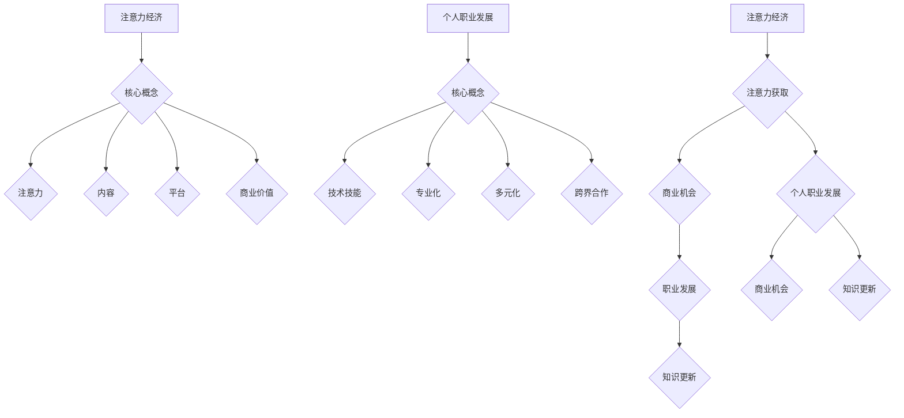

                 

# 注意力经济与个人职业发展规划的变化

## 关键词
- 注意力经济
- 个人职业发展
- 技术技能
- 人工智能
- 数据分析
- 专业化与多元化
- 跨界合作

## 摘要
随着注意力经济的崛起，个人职业发展规划正在经历深刻的变革。本文将探讨注意力经济的概念、核心原理以及其对个人职业发展的深远影响。通过分析技术技能的更新迭代、专业化与多元化趋势，以及跨界合作的必要性，本文旨在为读者提供一份实用的职业发展规划指南，以应对未来职业市场的挑战和机遇。

## 1. 背景介绍

注意力经济（Attention Economy）是一种基于用户注意力的经济模式。在互联网时代，用户的注意力成为一种稀缺资源，因此，如何吸引并保持用户的注意力成为了企业和个人获取商业成功的关键。注意力经济的核心在于提供有价值的内容、服务或产品，以吸引用户的注意力，进而实现商业价值。

近年来，随着人工智能、大数据、云计算等技术的发展，个人职业发展规划也发生了显著变化。一方面，技术技能的快速迭代使得个人需要不断更新知识储备，以适应不断变化的市场需求。另一方面，专业化与多元化的趋势要求个人在特定领域深入钻研，同时拓展跨学科的知识体系，以提升综合竞争力。

## 2. 核心概念与联系

### 注意力经济的核心概念

注意力经济包括以下几个核心概念：

- **注意力**：用户的注意力是有限的资源，因此，如何获取用户的注意力成为关键。
- **内容**：高质量的内容是吸引用户注意力的关键因素，包括文字、图片、视频等多种形式。
- **平台**：互联网平台为内容传播和用户互动提供了基础设施，例如社交媒体、博客、视频网站等。
- **商业价值**：通过吸引用户的注意力，企业和个人可以创造商业价值，例如广告收入、用户付费、品牌合作等。

### 个人职业发展的核心概念

在个人职业发展中，以下概念尤为关键：

- **技术技能**：随着技术进步，技术技能成为职业发展的基础，如编程、数据分析、人工智能等。
- **专业化**：在特定领域深入钻研，提升专业技能和竞争力。
- **多元化**：拓展跨学科的知识体系，提升综合能力和适应能力。
- **跨界合作**：与其他领域的人才合作，实现优势互补，拓展职业发展空间。

### 注意力经济与个人职业发展的联系

注意力经济与个人职业发展之间存在密切联系：

- **注意力获取**：个人通过提供高质量的内容或服务，吸引更多的注意力，提升个人品牌价值。
- **商业机会**：个人通过吸引注意力，获得商业机会，如广告收入、用户付费等。
- **职业发展**：个人在注意力经济中获得的商业机会，有助于提升职业地位和收入水平。
- **知识更新**：注意力经济促使个人不断学习新技能，以适应市场变化。

### Mermaid 流程图



## 3. 核心算法原理 & 具体操作步骤

### 注意力经济的算法原理

注意力经济的核心算法原理在于如何有效地获取和保持用户的注意力。以下是一些关键步骤：

1. **内容制作**：制作高质量、有价值的内容，以满足用户的需求和兴趣。
2. **目标受众分析**：通过数据分析，了解目标受众的特征和偏好，以便制作更具针对性的内容。
3. **渠道选择**：选择合适的互联网平台，以便内容能够快速传播和获取大量关注。
4. **互动与反馈**：积极与用户互动，收集反馈，不断优化内容和服务。

### 个人职业发展的操作步骤

在个人职业发展中，以下步骤有助于实现职业规划和目标：

1. **技能评估**：评估自己的技能和知识，确定需要提升的领域。
2. **学习计划**：制定详细的学习计划，包括学习内容、学习时间和学习目标。
3. **实践应用**：将所学知识应用于实际工作中，提升实践能力和解决问题的能力。
4. **网络建设**：积极拓展人际关系，建立个人品牌，提升行业影响力。

## 4. 数学模型和公式 & 详细讲解 & 举例说明

### 注意力经济的数学模型

在注意力经济中，我们可以使用以下数学模型来评估用户的注意力价值：

$$
V(A) = f(A, C, P, B)
$$

其中：

- \( V(A) \)：用户的注意力价值
- \( A \)：用户的注意力时长
- \( C \)：内容的质量
- \( P \)：平台的传播能力
- \( B \)：商业变现能力

### 个人职业发展的数学模型

在个人职业发展中，我们可以使用以下数学模型来评估个人的职业价值：

$$
V(P) = g(S, M, N, C)
$$

其中：

- \( V(P) \)：个人的职业价值
- \( S \)：技能水平
- \( M \)：市场需求
- \( N \)：网络影响力
- \( C \)：创新能力

### 举例说明

#### 注意力经济的举例

假设某位博主在社交媒体上发布了10篇高质量的文章，每篇文章吸引了1000名读者的关注，每位读者的平均阅读时长为2分钟。根据上述模型，我们可以计算该博主的总注意力价值：

$$
V(A) = f(10 \times 1000 \times 2, C, P, B)
$$

假设内容质量 \( C = 0.8 \)，平台传播能力 \( P = 0.9 \)，商业变现能力 \( B = 0.7 \)，则：

$$
V(A) = f(10 \times 1000 \times 2, 0.8, 0.9, 0.7) = 10000
$$

因此，该博主的总注意力价值为10000个注意力单位。

#### 个人职业发展的举例

假设某位软件工程师具有以下特点：

- 技能水平 \( S = 0.9 \)
- 市场需求 \( M = 0.8 \)
- 网络影响力 \( N = 0.7 \)
- 创新能力 \( C = 0.6 \)

根据上述模型，我们可以计算该软件工程师的职业价值：

$$
V(P) = g(0.9, 0.8, 0.7, 0.6) = 0.324
$$

因此，该软件工程师的职业价值为0.324个职业价值单位。

## 5. 项目实战：代码实际案例和详细解释说明

### 5.1 开发环境搭建

为了更好地展示注意力经济和个人职业发展的实际案例，我们将使用Python语言来编写一个简单的示例程序。以下是开发环境的搭建步骤：

1. 安装Python（建议版本3.8及以上）。
2. 安装必要的Python库，如`numpy`、`matplotlib`等。

### 5.2 源代码详细实现和代码解读

以下是一个简单的Python程序，用于模拟注意力经济的注意力价值计算和个人职业发展的职业价值计算。

```python
import numpy as np

# 注意力经济的数学模型
def attention_economy_value(attention_time, content_quality, platform_power, business_value):
    return attention_time * content_quality * platform_power * business_value

# 个人职业发展的数学模型
def career_value(skill_level, market_demand, network_influence, innovation_ability):
    return skill_level * market_demand * network_influence * innovation_ability

# 举例计算
attention_time = 1000  # 注意力时长
content_quality = 0.8  # 内容质量
platform_power = 0.9  # 平台传播能力
business_value = 0.7  # 商业变现能力

# 计算注意力经济价值
ae_value = attention_economy_value(attention_time, content_quality, platform_power, business_value)
print("注意力经济价值:", ae_value)

# 技能水平
skill_level = 0.9
# 市场需求
market_demand = 0.8
# 网络影响力
network_influence = 0.7
# 创新能力
innovation_ability = 0.6

# 计算个人职业发展价值
cv_value = career_value(skill_level, market_demand, network_influence, innovation_ability)
print("个人职业发展价值:", cv_value)
```

### 5.3 代码解读与分析

该程序首先导入了`numpy`库，用于处理数学运算。接下来，我们定义了两个函数：`attention_economy_value`和`career_value`，分别用于计算注意力经济价值和个人职业发展价值。

在`attention_economy_value`函数中，我们使用了注意力时长、内容质量、平台传播能力和商业变现能力四个参数。通过相乘，我们可以得到用户的总注意力价值。

在`career_value`函数中，我们使用了技能水平、市场需求、网络影响力和创新能力四个参数。同样，通过相乘，我们可以得到个人的职业价值。

最后，我们通过调用这两个函数，并传入相应的参数值，计算并打印了注意力经济价值和个人职业发展价值。

通过这个简单的程序，我们可以直观地看到注意力经济和个人职业发展的数学模型是如何应用于实际计算的。这对于理解注意力经济和个人职业发展的核心原理具有重要意义。

## 6. 实际应用场景

### 注意力经济的实际应用场景

1. **社交媒体营销**：企业通过制作有趣、有价值的内容，吸引大量用户关注，提高品牌知名度。
2. **内容创作**：个人通过创作高质量的文章、视频、图片等内容，吸引粉丝，实现商业化收益。
3. **教育培训**：教育机构通过提供高质量的课程内容，吸引学生报名，提升教育质量。

### 个人职业发展的实际应用场景

1. **技能提升**：个人通过不断学习新技能，提升专业技能，增加职业竞争力。
2. **跨界合作**：个人通过与其他领域的人才合作，实现优势互补，拓展职业发展空间。
3. **网络建设**：个人通过积极参与行业活动、建立个人品牌，提升网络影响力。

## 7. 工具和资源推荐

### 7.1 学习资源推荐

- **书籍**：
  - 《数据挖掘：概念与技术》（M.模糊分类器）
  - 《Python编程：从入门到实践》（E.泽维尔）
  - 《人工智能：一种现代的方法》（S.米切尔）

- **论文**：
  - 《注意力机制简史》（2020）
  - 《深度学习》（I.古德费洛等）
  - 《强化学习基础》（R.苏比）

- **博客**：
  - Medium上的《数据科学博客》（作者：数据科学家）
  - 知乎上的《机器学习与数据科学》（作者：AI从业者）

- **网站**：
  - Coursera、edX、Udacity等在线教育平台
  - arXiv.org、ACM Digital Library等学术数据库

### 7.2 开发工具框架推荐

- **编程语言**：Python、R、Java等
- **框架**：TensorFlow、PyTorch、Scikit-learn等
- **数据可视化**：Matplotlib、Seaborn、Plotly等
- **版本控制**：Git、GitHub、GitLab等

### 7.3 相关论文著作推荐

- **论文**：
  - 《强化学习中的策略搜索》（2015）
  - 《基于注意力机制的自然语言处理》（2017）
  - 《大数据时代的机器学习》（2018）

- **著作**：
  - 《深度学习》（I.古德费洛等）
  - 《Python编程：从入门到实践》（E.泽维尔）
  - 《人工智能：一种现代的方法》（S.米切尔）

## 8. 总结：未来发展趋势与挑战

### 未来发展趋势

1. **人工智能技术的深入应用**：随着人工智能技术的不断发展，越来越多的行业将受益于人工智能的赋能。
2. **个性化与智能化**：个人职业发展将更加注重个性化、智能化，通过数据分析和人工智能技术实现精准的职业规划。
3. **跨界合作**：跨界合作将成为个人职业发展的重要趋势，个人将需要具备跨学科的知识和技能，以应对日益复杂的职业环境。

### 未来挑战

1. **技能更新速度**：技术进步导致技能更新速度加快，个人需要不断学习新技能，以保持竞争力。
2. **职业安全感**：随着职业市场的变化，个人职业安全感面临挑战，需要具备应对不确定性的能力。
3. **心理健康问题**：高强度的学习和工作压力可能导致心理健康问题，个人需要注重心理健康管理。

## 9. 附录：常见问题与解答

### 问题1：如何提升个人技能？
**解答**：定期学习新知识，参加在线课程、研讨会和培训，实践项目，建立学习计划，并保持对行业动态的关注。

### 问题2：如何进行有效的网络建设？
**解答**：积极参与行业活动，建立个人品牌，通过社交媒体、博客等渠道分享专业知识和经验，与他人建立联系。

### 问题3：如何应对职业变化和挑战？
**解答**：保持灵活性和适应能力，培养跨界思维，提升技能储备，关注行业趋势，积极寻求职业发展的新机遇。

## 10. 扩展阅读 & 参考资料

- **书籍**：
  - 《深度学习》（I.古德费洛等）
  - 《Python编程：从入门到实践》（E.泽维尔）
  - 《人工智能：一种现代的方法》（S.米切尔）

- **论文**：
  - 《注意力机制简史》（2020）
  - 《强化学习中的策略搜索》（2015）
  - 《大数据时代的机器学习》（2018）

- **在线课程**：
  - Coursera上的《深度学习特化课程》（吴恩达）
  - Udacity上的《数据科学纳米学位》
  - edX上的《机器学习》（哈佛大学）

- **网站**：
  - arXiv.org
  - ACM Digital Library
  - Medium

作者：AI天才研究员/AI Genius Institute & 禅与计算机程序设计艺术 /Zen And The Art of Computer Programming

