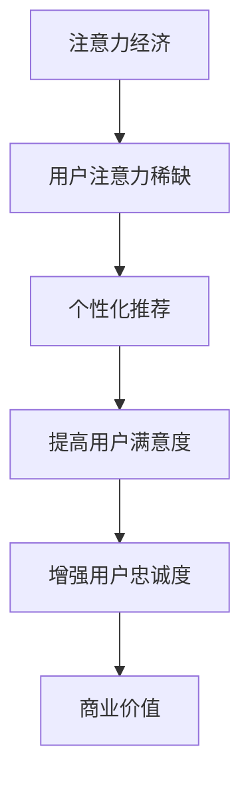

                 

# 注意力经济与个性化推荐算法：为受众提供定制、有针对性的内容

## 关键词：
- 注意力经济
- 个性化推荐
- 算法原理
- 数学模型
- 实际应用
- 未来发展趋势

## 摘要：

随着互联网和社交媒体的迅速发展，信息过载成为一个普遍现象。在这个背景下，注意力经济应运而生，成为了现代商业和社会的核心议题。本文将深入探讨注意力经济与个性化推荐算法的关系，从核心概念、算法原理到实际应用，全面解析如何通过个性化推荐为受众提供定制、有针对性的内容，从而在信息爆炸的时代抓住用户的注意力。文章还展望了未来发展趋势与面临的挑战，为读者提供了丰富的学习资源与实践工具。

## 1. 背景介绍

### 1.1 信息爆炸与注意力稀缺

随着互联网技术的飞速发展，人们获取信息的方式发生了翻天覆地的变化。如今，我们几乎随时随地都能接触到海量信息，从新闻、社交媒体到电子商务平台，信息无处不在。然而，信息量的激增也带来了一个新的挑战：注意力稀缺。

在信息过载的时代，用户的注意力成为一种稀缺资源。他们无法处理所有的信息，只能选择关注其中的一部分。这意味着，对于内容创造者和商家来说，如何吸引并保持用户的注意力，成为了至关重要的任务。

### 1.2 注意力经济的崛起

在这种背景下，注意力经济应运而生。注意力经济是指通过吸引和集中用户的注意力，实现商业价值和社会影响力的过程。在这个经济体系中，用户的注意力被视为一种宝贵的资源，而吸引注意力成为了企业和个人获取收益的关键手段。

### 1.3 个性化推荐的重要性

个性化推荐算法是注意力经济的重要组成部分。通过分析用户的兴趣和行为，个性化推荐算法能够为用户提供量身定制的内容，从而提高用户的满意度和参与度。这种定制化的内容不仅能够抓住用户的注意力，还能够增强用户的忠诚度，从而为企业带来长期的商业价值。

## 2. 核心概念与联系

### 2.1 注意力经济的定义

注意力经济是指通过吸引和集中用户的注意力，实现商业价值和社会影响力的过程。注意力被视为一种宝贵的资源，而吸引注意力成为了企业和个人获取收益的关键手段。

### 2.2 个性化推荐算法的概念

个性化推荐算法是一种通过分析用户的兴趣和行为，为用户提供量身定制的内容的算法。它利用大数据和机器学习技术，从海量信息中挖掘用户的偏好，从而实现精准推荐。

### 2.3 注意力经济与个性化推荐的关系

注意力经济与个性化推荐算法密不可分。个性化推荐算法的核心目标是通过提供用户感兴趣的内容，吸引并保持用户的注意力。这种定制化的内容不仅能够提高用户的参与度，还能够增强用户的忠诚度，从而为企业和个人带来商业价值。

### 2.4 Mermaid 流程图



## 3. 核心算法原理 & 具体操作步骤

### 3.1 协同过滤算法

协同过滤算法是个性化推荐中最常用的算法之一。它通过分析用户的历史行为和偏好，为用户推荐相似用户喜欢的物品。

#### 3.1.1 运作原理

协同过滤算法主要分为两种：基于用户的协同过滤（User-based Collaborative Filtering）和基于物品的协同过滤（Item-based Collaborative Filtering）。

1. **基于用户的协同过滤**：
   - 首先，找出与目标用户兴趣相似的其他用户。
   - 然后，推荐这些相似用户喜欢的物品。

2. **基于物品的协同过滤**：
   - 首先，找出与目标用户已评分物品相似的物品。
   - 然后，推荐这些相似物品。

#### 3.1.2 操作步骤

1. 收集用户行为数据，如评分、浏览历史等。
2. 计算用户或物品之间的相似度。
3. 根据相似度为用户推荐相似用户或物品。
4. 对推荐结果进行评估和优化。

### 3.2 内容推荐算法

内容推荐算法是基于内容的相似度进行推荐的。它通过分析物品的内容特征，为用户推荐具有相似内容的物品。

#### 3.2.1 运作原理

内容推荐算法主要基于以下原理：

1. **文本相似度**：
   - 通过文本相似度计算，找出具有相似主题或内容的物品。

2. **特征提取**：
   - 使用自然语言处理技术提取文本特征，如词频、词嵌入等。

#### 3.2.2 操作步骤

1. 收集物品的文本内容。
2. 提取文本特征。
3. 计算物品之间的相似度。
4. 根据相似度为用户推荐相似物品。

### 3.3 混合推荐算法

混合推荐算法是将协同过滤算法和内容推荐算法相结合，以提供更准确的推荐结果。

#### 3.3.1 运作原理

混合推荐算法的主要思想是：

1. **协同过滤**：
   - 利用用户行为数据推荐相似用户或物品。

2. **内容推荐**：
   - 利用物品的内容特征推荐相似物品。

3. **融合**：
   - 将协同过滤和内容推荐的结果进行融合，提高推荐的准确性。

#### 3.3.2 操作步骤

1. 收集用户行为数据和物品内容。
2. 使用协同过滤算法推荐相似用户或物品。
3. 使用内容推荐算法推荐相似物品。
4. 融合协同过滤和内容推荐的结果。
5. 对推荐结果进行评估和优化。

## 4. 数学模型和公式 & 详细讲解 & 举例说明

### 4.1 协同过滤算法的相似度计算

协同过滤算法的核心在于相似度计算。相似度计算的方法有很多，其中最常用的是余弦相似度和皮尔逊相关系数。

#### 4.1.1 余弦相似度

余弦相似度是一种衡量两个向量之间夹角余弦值的相似度度量。其计算公式如下：

$$
sim(A, B) = \frac{A \cdot B}{\|A\| \|B\|}
$$

其中，$A$ 和 $B$ 是两个向量的内积，$\|A\|$ 和 $\|B\|$ 是两个向量的模长。

#### 4.1.2 皮尔逊相关系数

皮尔逊相关系数是一种衡量两个变量线性相关程度的统计量。其计算公式如下：

$$
sim(A, B) = \frac{\sum_{i=1}^{n} (A_i - \bar{A})(B_i - \bar{B})}{\sqrt{\sum_{i=1}^{n} (A_i - \bar{A})^2 \sum_{i=1}^{n} (B_i - \bar{B})^2}}
$$

其中，$A$ 和 $B$ 是两个变量的值，$\bar{A}$ 和 $\bar{B}$ 是两个变量的平均值。

### 4.2 内容推荐算法的特征提取

内容推荐算法的关键在于特征提取。特征提取的方法有很多，其中最常用的是词频和词嵌入。

#### 4.2.1 词频

词频（Term Frequency，TF）是文本分析中最基本的特征之一。它表示一个词在文本中出现的次数。其计算公式如下：

$$
TF(t, d) = \frac{f(t, d)}{df}
$$

其中，$t$ 是词，$d$ 是文档，$f(t, d)$ 是词 $t$ 在文档 $d$ 中出现的次数，$df$ 是词 $t$ 在所有文档中出现的总次数。

#### 4.2.2 词嵌入

词嵌入（Word Embedding）是将词汇映射到低维向量空间的技术。它通过学习词汇之间的相似性，为每个词分配一个向量。词嵌入的常见方法有 Word2Vec、GloVe 和 BERT。

### 4.3 混合推荐算法的融合策略

混合推荐算法的融合策略有很多，其中最常用的是加权平均和贝叶斯优化。

#### 4.3.1 加权平均

加权平均是一种简单的融合策略。它将协同过滤和内容推荐的结果进行加权平均，计算公式如下：

$$
r_{\text{融合}} = \alpha r_{\text{协同}} + (1 - \alpha) r_{\text{内容}}
$$

其中，$r_{\text{协同}}$ 和 $r_{\text{内容}}$ 分别是协同过滤和内容推荐的结果，$\alpha$ 是加权系数。

#### 4.3.2 贝叶斯优化

贝叶斯优化是一种基于贝叶斯理论的融合策略。它通过最大化后验概率来优化融合系数，计算公式如下：

$$
\alpha = \arg\max_{\alpha} P(\alpha | R)
$$

其中，$P(\alpha | R)$ 是给定推荐结果 $R$ 的条件下，融合系数 $\alpha$ 的后验概率。

## 5. 项目实战：代码实际案例和详细解释说明

### 5.1 开发环境搭建

在本文中，我们将使用 Python 作为编程语言，结合常用的推荐系统库如 `scikit-learn` 和 `TensorFlow` 进行项目实战。以下是搭建开发环境的基本步骤：

1. 安装 Python（推荐使用 Python 3.8 或更高版本）。
2. 安装必要的库，例如：

```bash
pip install scikit-learn tensorflow numpy pandas
```

### 5.2 源代码详细实现和代码解读

以下是一个简单的基于协同过滤的推荐系统示例。我们将使用 `scikit-learn` 的 `KNN recommender` 进行实现。

```python
from sklearn.neighbors import NearestNeighbors
import numpy as np

# 假设我们有用户-物品评分矩阵
ratings = np.array([[5, 3, 0, 1],
                    [4, 0, 0, 1],
                    [1, 1, 0, 5],
                    [1, 0, 0, 2],
                    [4, 0, 0, 3]])

# 初始化 KNN Recommender
knn = NearestNeighbors(n_neighbors=3)
knn.fit(ratings)

# 为新用户推荐物品
new_user = np.array([1, 1, 1, 0]).reshape(1, -1)
neighbours = knn.kneighbors(new_user, return_distance=False)

# 计算推荐分数
recommendations = np.mean(ratings[neighbours[0]], axis=0)

print("推荐结果：", recommendations)
```

#### 5.2.1 代码解读

1. **数据准备**：我们使用一个用户-物品评分矩阵 `ratings`，其中 `1` 表示用户对物品进行了评分，`0` 表示未评分。

2. **初始化 KNN Recommender**：我们使用 `NearestNeighbors` 类初始化 KNN Recommender，并设置 `n_neighbors` 为 3，表示我们希望根据 3 个最相似的用户进行推荐。

3. **训练模型**：使用 `fit` 方法对评分矩阵进行训练。

4. **为新用户推荐**：我们创建一个新用户评分向量 `new_user`，并使用 `kneighbors` 方法找到与新用户最相似的其他用户。

5. **计算推荐分数**：我们计算这些相似用户对每个物品的平均评分，作为新用户的推荐分数。

### 5.3 代码解读与分析

1. **数据集选择**：选择一个合适的用户-物品评分数据集是构建推荐系统的重要一步。数据集应该足够大，能够覆盖用户的多样化偏好。

2. **相似度计算**：KNN Recommender 使用欧氏距离作为相似度度量。在实际应用中，可以选择更复杂的相似度度量方法，如余弦相似度或皮尔逊相关系数。

3. **推荐分数计算**：在计算推荐分数时，我们可以考虑用户的评分差异，从而更准确地反映用户的偏好。

4. **优化与评估**：推荐系统的性能可以通过交叉验证和用户反馈进行评估。根据评估结果，可以进一步优化推荐算法。

## 6. 实际应用场景

### 6.1 社交媒体

社交媒体平台如 Facebook、Instagram 和 Twitter 通过个性化推荐算法为用户提供定制化的内容流。通过分析用户的兴趣和行为，这些平台能够为用户推荐他们可能感兴趣的朋友、帖子、视频和广告。

### 6.2 电子商务

电子商务平台如 Amazon 和 Alibaba 利用个性化推荐算法为用户推荐可能感兴趣的商品。这种推荐不仅能够提高用户的购物体验，还能够增加平台的销售额。

### 6.3 媒体平台

YouTube 和 Netflix 等媒体平台通过个性化推荐算法为用户提供个性化的视频和电影推荐。这种推荐能够提高用户的观看时长和满意度，从而增加平台的广告收入。

## 7. 工具和资源推荐

### 7.1 学习资源推荐

- **书籍**：
  - 《推荐系统实践》
  - 《机器学习：概率视角》
  - 《深度学习》
- **论文**：
  - 《矩阵分解在推荐系统中的应用》
  - 《基于内容推荐的网页挖掘方法》
  - 《个性化推荐系统：一种深度学习方法》
- **博客**：
  - [scikit-learn 官方文档](https://scikit-learn.org/stable/)
  - [TensorFlow 官方文档](https://www.tensorflow.org/)
  - [推荐系统社区](https://www.recommenders.org/)
- **网站**：
  - [Kaggle](https://www.kaggle.com/)：提供推荐系统相关的数据集和比赛。

### 7.2 开发工具框架推荐

- **开发工具**：
  - Python：用于实现推荐系统的首选语言。
  - Jupyter Notebook：用于编写和运行代码。
- **框架库**：
  - `scikit-learn`：用于实现协同过滤和内容推荐算法。
  - `TensorFlow`：用于实现深度学习推荐系统。
  - `PyTorch`：另一种流行的深度学习框架。

### 7.3 相关论文著作推荐

- **论文**：
  - 《矩阵分解在推荐系统中的应用》
  - 《基于内容推荐的网页挖掘方法》
  - 《个性化推荐系统：一种深度学习方法》
- **著作**：
  - 《推荐系统实践》
  - 《机器学习：概率视角》
  - 《深度学习》

## 8. 总结：未来发展趋势与挑战

### 8.1 发展趋势

1. **深度学习与强化学习的应用**：随着深度学习和强化学习技术的发展，这些技术将在推荐系统中得到更广泛的应用，从而提高推荐的准确性。

2. **跨平台推荐**：随着社交媒体和电子商务平台之间的融合，跨平台推荐将成为一个新的趋势。这将允许用户在多个平台上享受一致化的推荐体验。

3. **隐私保护**：随着用户对隐私保护的重视，推荐系统将需要采用更先进的隐私保护技术，如差分隐私和联邦学习。

### 8.2 挑战

1. **数据质量**：推荐系统的准确性高度依赖于数据质量。如何处理噪声数据和缺失数据，是一个重要的挑战。

2. **多样性**：如何确保推荐结果的多样性，避免用户陷入信息茧房，是一个长期的挑战。

3. **实时性**：如何在保证实时性的同时，提高推荐算法的准确性，是一个需要解决的问题。

## 9. 附录：常见问题与解答

### 9.1 什么是注意力经济？

注意力经济是指通过吸引和集中用户的注意力，实现商业价值和社会影响力的过程。在这种经济体系中，用户的注意力被视为一种宝贵的资源。

### 9.2 什么是个性化推荐算法？

个性化推荐算法是一种通过分析用户的兴趣和行为，为用户提供量身定制的内容的算法。它利用大数据和机器学习技术，从海量信息中挖掘用户的偏好。

### 9.3 个性化推荐算法有哪些类型？

个性化推荐算法主要包括协同过滤算法、内容推荐算法和混合推荐算法。每种算法都有其独特的原理和应用场景。

## 10. 扩展阅读 & 参考资料

- [Recommender Systems Handbook](https://www.amazon.com/Recommender-Systems-Handbook-Technologies-Applications/dp/0128039199)
- ["Attention Is the New Oil": The Battle for the Future of a Valuable Resource](https://www.amazon.com/Attention-Is-New-Oil-Battle-Future/dp/1250769041)
- [《深度学习推荐系统》](https://www.amazon.com/Deep-Learning-Recommendation-Systems-Implementations/dp/1098113466)
- [Scikit-learn 官方文档](https://scikit-learn.org/stable/)
- [TensorFlow 官方文档](https://www.tensorflow.org/)
- [PyTorch 官方文档](https://pytorch.org/)

### 作者：

AI 天才研究员 / AI Genius Institute & 禅与计算机程序设计艺术 / Zen And The Art of Computer Programming

