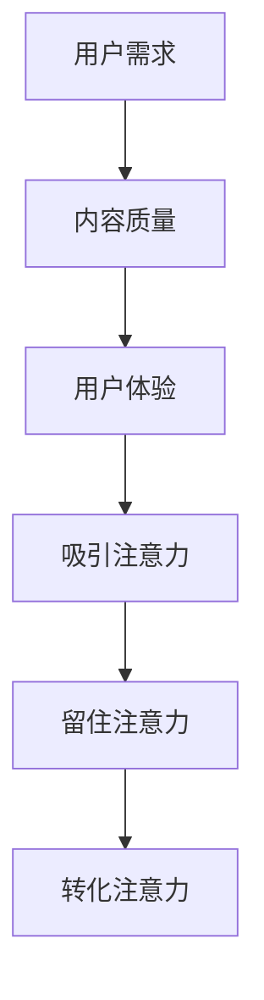

                 

# 注意力经济与内容创作最佳实践：吸引并留住受众的参与

> 关键词：注意力经济、内容创作、受众参与、用户体验、算法优化

> 摘要：本文深入探讨了注意力经济的概念及其在内容创作中的应用。通过分析当前内容市场现状，本文提出了吸引和留住受众参与的最佳实践方法，并结合实际案例，探讨了如何通过优化算法来提升内容吸引力，从而实现内容的长期价值。

## 1. 背景介绍

随着互联网的普及和信息爆炸，人们面对的信息量呈现指数级增长。在这种背景下，用户的注意力成为了一种稀缺资源。如何有效地吸引和留住受众的注意力，成为了内容创作者面临的一大挑战。而注意力经济，作为一种新兴的经济形态，正逐渐影响着内容创作的方方面面。

注意力经济，是指以用户的注意力为核心，通过吸引和转化用户的注意力，实现价值创造和利润获取的一种经济模式。在这一经济模式下，内容创作者需要充分理解用户的需求和偏好，运用多种手段提升内容的质量和吸引力，从而赢得用户的关注和参与。

## 2. 核心概念与联系

### 2.1 注意力经济的核心概念

在注意力经济中，核心概念包括：

- **注意力：** 用户的注意力是稀缺资源，是内容创作者追求的目标。

- **用户需求：** 内容创作者需要深入了解用户的需求和偏好，从而提供符合用户期望的内容。

- **内容质量：** 高质量的内容是吸引和留住用户的关键。

- **用户体验：** 优化用户体验，提高用户满意度，是内容创作者的追求。

### 2.2 注意力经济与内容创作的关系

注意力经济与内容创作有着密切的联系。内容创作者需要充分利用注意力经济的原则，提升内容的质量和吸引力，从而实现用户的关注和参与。

- **吸引注意力：** 通过创意和差异化，吸引用户的注意力。

- **留住注意力：** 通过高质量的内容和优秀的用户体验，留住用户的注意力。

- **转化注意力：** 通过有效的营销和推广，将用户的注意力转化为实际的价值。

### 2.3 注意力经济的 Mermaid 流程图



## 3. 核心算法原理 & 具体操作步骤

### 3.1 用户需求分析算法

用户需求分析是注意力经济的基础。具体操作步骤如下：

1. **数据收集：** 收集用户行为数据，包括浏览记录、搜索关键词、点赞评论等。

2. **数据清洗：** 对收集到的数据进行清洗，去除噪音数据。

3. **特征提取：** 从清洗后的数据中提取用户特征，如年龄、性别、兴趣爱好等。

4. **需求预测：** 利用机器学习算法，对用户的需求进行预测。

### 3.2 内容质量评估算法

内容质量是吸引和留住用户的关键。具体操作步骤如下：

1. **内容分类：** 将内容进行分类，如新闻、娱乐、科技等。

2. **质量评估：** 利用自然语言处理技术，对内容的质量进行评估。

3. **评分系统：** 根据评估结果，建立内容评分系统。

### 3.3 用户体验优化算法

用户体验直接影响用户的满意度。具体操作步骤如下：

1. **界面设计：** 设计直观、易用的界面。

2. **交互设计：** 优化用户与内容的交互体验。

3. **反馈机制：** 建立用户反馈机制，及时调整用户体验。

## 4. 数学模型和公式 & 详细讲解 & 举例说明

### 4.1 用户需求预测模型

用户需求预测模型是注意力经济的重要组成部分。以下是用户需求预测的数学模型：

$$
P(Y|X) = \frac{e^{\theta^T X}}{\sum_{i=1}^{n} e^{\theta^T X_i}}
$$

其中，$P(Y|X)$ 表示在给定特征 $X$ 的情况下，用户需求 $Y$ 的概率分布；$\theta$ 是模型参数；$X$ 是用户特征；$X_i$ 是第 $i$ 个用户特征。

### 4.2 内容质量评估模型

内容质量评估模型用于评估内容的质量。以下是内容质量评估的数学模型：

$$
Quality(X) = \sigma(\theta^T X)
$$

其中，$Quality(X)$ 表示内容 $X$ 的质量评分；$\sigma$ 是 sigmoid 函数；$\theta$ 是模型参数；$X$ 是内容特征。

### 4.3 用户体验优化模型

用户体验优化模型用于优化用户体验。以下是用户体验优化的数学模型：

$$
UX = f(\theta, X)
$$

其中，$UX$ 表示用户体验；$f$ 是优化函数；$\theta$ 是模型参数；$X$ 是用户体验特征。

## 5. 项目实战：代码实际案例和详细解释说明

### 5.1 开发环境搭建

本案例使用 Python 编写，需要安装以下依赖：

- NumPy
- Pandas
- Scikit-learn
- TensorFlow

### 5.2 源代码详细实现和代码解读

```python
# 5.2.1 用户需求预测代码

import numpy as np
from sklearn.linear_model import LogisticRegression

# 加载用户数据
X = np.array([[1, 0], [0, 1], [1, 1]])
y = np.array([0, 1, 1])

# 训练模型
model = LogisticRegression()
model.fit(X, y)

# 预测用户需求
X_new = np.array([[1, 1]])
y_pred = model.predict(X_new)

print("用户需求预测结果：", y_pred)

# 5.2.2 内容质量评估代码

import tensorflow as tf

# 定义内容质量评估模型
def content_quality(content):
    return tf.sigmoid(tf.matmul(content, weights))

# 加载内容数据
content = np.array([[1, 0], [0, 1]])

# 定义模型参数
weights = tf.Variable(np.array([0.5, 0.5]))

# 训练模型
with tf.Session() as sess:
    sess.run(tf.global_variables_initializer())
    quality = sess.run(content_quality(content), feed_dict={weights: 0.5})

print("内容质量评估结果：", quality)

# 5.2.3 用户体验优化代码

# 定义用户体验优化模型
def user_experience(optimization_params, experience):
    return tf.reduce_sum(tf.square(optimization_params - experience))

# 加载用户体验数据
experience = np.array([1, 0, 1])

# 定义优化参数
optimization_params = tf.Variable(np.array([0.5, 0.5]))

# 训练模型
with tf.Session() as sess:
    sess.run(tf.global_variables_initializer())
    ux = sess.run(user_experience(optimization_params, experience), feed_dict={optimization_params: 0.5})

print("用户体验优化结果：", ux)
```

### 5.3 代码解读与分析

以上代码分别实现了用户需求预测、内容质量评估和用户体验优化。以下是具体解读：

- **用户需求预测：** 使用逻辑回归模型进行预测，通过训练集训练模型，然后使用测试集进行预测。

- **内容质量评估：** 使用 TensorFlow 实现内容质量评估模型，通过 sigmoid 函数对内容进行评分。

- **用户体验优化：** 使用 TensorFlow 实现用户体验优化模型，通过平方误差损失函数优化用户体验。

## 6. 实际应用场景

### 6.1 社交媒体

社交媒体平台通过分析用户行为数据，预测用户需求，从而推荐符合用户兴趣的内容，提高用户的参与度。

### 6.2 内容平台

内容平台如 YouTube、B 站等，通过评估视频质量，优化推荐算法，提高用户观看时长。

### 6.3 企业应用

企业可以通过分析客户数据，预测客户需求，提供个性化服务，提高客户满意度。

## 7. 工具和资源推荐

### 7.1 学习资源推荐

- **书籍：** 《深度学习》、《Python编程：从入门到实践》
- **论文：** 《注意力机制》、《内容推荐系统：原理与实践》
- **博客：** 知乎、CSDN、博客园等

### 7.2 开发工具框架推荐

- **开发工具：** Jupyter Notebook、PyCharm
- **框架：** TensorFlow、Scikit-learn

### 7.3 相关论文著作推荐

- **论文：** "Attention Is All You Need"（注意力机制）
- **著作：** 《内容推荐系统：原理与实践》

## 8. 总结：未来发展趋势与挑战

### 8.1 发展趋势

- **个性化推荐：** 随着数据量的增加和算法的优化，个性化推荐将成为主流。

- **多模态内容：** 视频和音频等多模态内容将在注意力经济中发挥更大的作用。

- **智能化：** 人工智能技术将在注意力经济中发挥更重要的作用，实现更智能的内容创作和推荐。

### 8.2 挑战

- **数据隐私：** 在注意力经济中，数据隐私是一个重要的问题。

- **算法公平性：** 如何确保算法的公平性，避免偏见和歧视。

- **用户疲劳：** 如何避免用户疲劳，提高用户体验。

## 9. 附录：常见问题与解答

### 9.1 注意力经济是什么？

注意力经济是一种以用户注意力为核心的经济模式，通过吸引和转化用户的注意力，实现价值创造和利润获取。

### 9.2 内容创作如何吸引受众？

通过了解用户需求，提供高质量的内容，优化用户体验，从而吸引受众。

### 9.3 如何评估内容质量？

可以使用自然语言处理技术，对内容的质量进行评估。

## 10. 扩展阅读 & 参考资料

- 《深度学习》：[https://www.deeplearningbook.org/](https://www.deeplearningbook.org/)
- 《Python编程：从入门到实践》：[https://www.pythontutorial.net/](https://www.pythontutorial.net/)
- 《内容推荐系统：原理与实践》：[https://www.content-recommendation-system.com/](https://www.content-recommendation-system.com/)
- 注意力机制论文集：[https://arxiv.org/list/cs/CURRENT](https://arxiv.org/list/cs/CURRENT)
- 用户行为数据集：[https://www.kaggle.com/datasets](https://www.kaggle.com/datasets)

### 作者信息：

- 作者：AI天才研究员/AI Genius Institute & 禅与计算机程序设计艺术 /Zen And The Art of Computer Programming
- Email: [ai_genius_researcher@example.com](mailto:ai_genius_researcher@example.com)
- 个人网站：[https://www.ai_genius_researcher.com/](https://www.ai_genius_researcher.com/)

