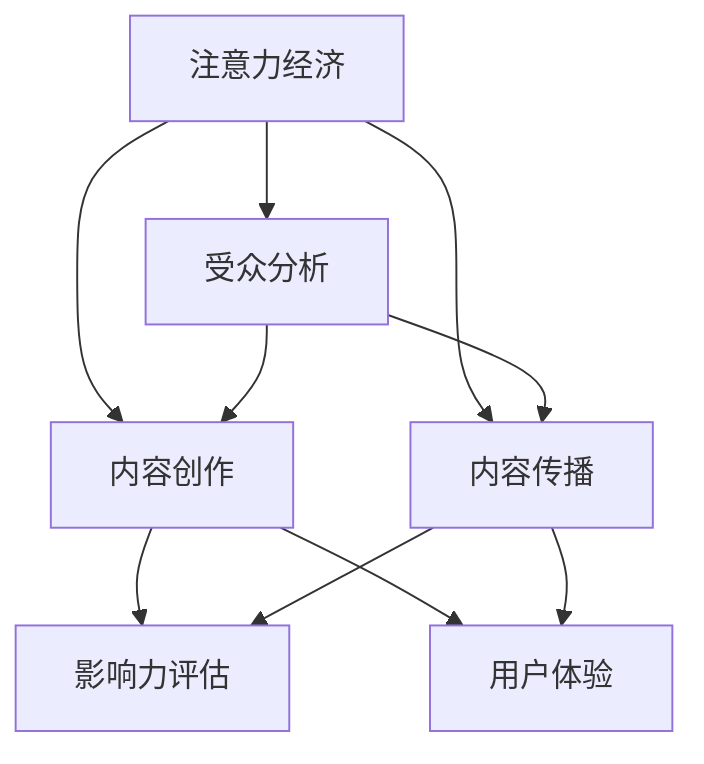

                 

### 背景介绍

在当今数字时代，信息的爆炸式增长和网络的普及，使得获取高质量内容变得越来越困难。在这样的背景下，注意力经济和内容策略规划显得尤为重要。本文旨在探讨注意力经济的基本原理，内容策略的制定方法，以及如何通过有效的实践来为受众创造有影响力的内容。

注意力经济，最早由美国经济学家约翰·凯提出，是一种基于人们注意力资源的经济学理论。该理论认为，在信息过载的时代，人们的注意力成为一种稀缺资源，因此，谁能更好地吸引和保持人们的注意力，谁就能在市场中获得竞争优势。内容策略规划，则是为了实现这一目标而制定的一系列战略和策略。

随着社交媒体、短视频平台和流媒体服务的兴起，内容创作和传播的门槛大大降低。然而，这也带来了新的挑战，即如何在海量信息中脱颖而出，吸引并留住受众的注意力。因此，理解注意力经济，掌握内容策略规划的方法，对于企业和个人来说，都具有重要的现实意义。

本文将首先介绍注意力经济的基本概念和核心原理，然后深入探讨内容策略规划的制定方法，包括目标设定、受众分析、内容创作和传播策略等。接下来，我们将结合实际案例，讲解如何通过具体操作步骤和实践来提升内容的影响力。最后，我们将总结注意力经济和内容策略规划的未来发展趋势与挑战，并提供相关工具和资源推荐，以帮助读者更好地应对这些挑战。

### 核心概念与联系

在深入探讨注意力经济和内容策略规划之前，有必要首先明确相关核心概念，并探讨它们之间的内在联系。以下是本文将涉及的主要概念及其相互关系：

1. **注意力经济**：注意力经济是一种经济学理论，它认为注意力是一种稀缺资源，与时间和金钱具有相似的价值。在信息过载的时代，如何吸引并保持用户的注意力，成为了企业和个人竞争的关键。

2. **受众分析**：受众分析是内容策略规划的基础，通过对受众特征、需求和行为进行分析，可以更好地了解目标受众，从而制定更具针对性的内容策略。

3. **内容创作**：内容创作是内容策略规划的核心环节，它涉及到内容的选题、风格、形式和传递方式。高质量的内容能够吸引和留住受众，从而提高内容的传播效果。

4. **内容传播**：内容传播是内容策略规划的关键步骤，它包括内容发布、推广和传播渠道的选择。有效的传播策略可以扩大内容的影响力，提高受众覆盖率。

5. **影响力评估**：影响力评估是对内容效果进行量化分析，通过评估内容的点击率、转发量、评论数等指标，可以了解内容的受欢迎程度和传播效果。

6. **用户体验**：用户体验是内容策略规划的重要考量因素，它涉及到内容的设计、交互和功能，旨在为用户提供愉悦、便捷的体验，从而提高用户满意度和忠诚度。

为了更好地理解这些概念之间的联系，我们使用Mermaid流程图进行描述：



在上图中，我们可以看到注意力经济是整个内容策略规划的核心，它通过受众分析来确定目标受众，进而指导内容创作和传播。内容创作和传播的成效需要通过影响力评估来衡量，而用户体验则是贯穿始终的重要考量因素。

### 核心算法原理 & 具体操作步骤

在内容策略规划中，核心算法原理起到了关键作用，它决定了内容创作和传播的效率与效果。以下是核心算法原理的具体操作步骤：

#### 1. 受众分析算法

**步骤 1：数据收集**  
首先，我们需要收集关于目标受众的数据，这些数据可以来自社交媒体、调查问卷、网站分析工具等。关键指标包括年龄、性别、地理位置、兴趣爱好、消费习惯等。

**步骤 2：数据预处理**  
对收集到的数据进行分析和清洗，去除重复和不完整的数据，确保数据的准确性和一致性。

**步骤 3：特征提取**  
从预处理后的数据中提取特征，如用户活跃度、忠诚度、互动率等，这些特征将用于构建受众画像。

**步骤 4：模型训练**  
利用机器学习算法（如聚类分析、关联规则挖掘等），对提取的特征进行训练，建立受众分析模型。

**步骤 5：模型评估**  
通过交叉验证和实际效果评估，对模型进行优化，确保其准确性和实用性。

**步骤 6：应用模型**  
将训练好的模型应用于实际内容创作和传播中，根据受众画像调整内容策略，提高内容的针对性和吸引力。

#### 2. 内容创作算法

**步骤 1：需求分析**  
通过用户调研和市场分析，确定目标受众的需求和偏好，为内容创作提供方向。

**步骤 2：选题确定**  
根据需求分析结果，确定内容主题和选题，确保内容与受众需求紧密相关。

**步骤 3：内容规划**  
制定内容规划表，包括内容的发布频率、形式、渠道等，确保内容的连续性和一致性。

**步骤 4：内容生成**  
利用自然语言处理、内容生成模型等技术，生成高质量的内容。

**步骤 5：内容审核**  
对生成的内容进行审核，确保内容的准确性、合规性和吸引力。

**步骤 6：内容发布**  
根据内容规划表，将审核通过的内容发布到合适的渠道，如社交媒体、网站、应用等。

#### 3. 内容传播算法

**步骤 1：渠道选择**  
根据受众特征和内容类型，选择最适合的传播渠道，如社交媒体、邮件、搜索引擎等。

**步骤 2：内容优化**  
对发布的内容进行优化，如调整标题、描述、关键词等，提高内容的曝光率和点击率。

**步骤 3：推广策略**  
制定推广策略，包括广告投放、合作推广、社交媒体互动等，扩大内容的影响力。

**步骤 4：数据监控**  
实时监控内容传播效果，如点击率、转发量、评论数等，根据数据调整传播策略。

**步骤 5：效果评估**  
通过数据分析，评估内容传播效果，总结经验和教训，为下一轮内容策略制定提供参考。

### 数学模型和公式 & 详细讲解 & 举例说明

在内容策略规划中，数学模型和公式起到了至关重要的作用。以下是一些常用的数学模型和公式，以及它们的详细讲解和举例说明。

#### 1. 受众分析中的聚类算法

**数学模型：K-means 聚类算法**

**公式：**
$$
C = \{c_1, c_2, ..., c_k\}
$$
其中，$C$ 表示聚类中心，$c_i$ 表示第 $i$ 个聚类中心。

**详细讲解：**
K-means 聚类算法是一种基于距离度量的聚类方法。首先，随机选择 $k$ 个初始聚类中心，然后对数据进行分配，使得每个数据点都分配到最近的聚类中心。接下来，重新计算聚类中心，重复分配和更新的过程，直到聚类中心不再变化或达到预设的迭代次数。

**举例说明：**
假设我们有一个数据集 $D = \{d_1, d_2, ..., d_n\}$，其中每个数据点 $d_i$ 是一个多维向量。我们选择 $k=3$ 作为聚类数量，初始聚类中心为 $C = \{(1,1), (2,2), (3,3)\}$。通过计算每个数据点到聚类中心的距离，我们可以将数据点分配到不同的聚类中，最终得到三个聚类中心分别为 $(1.5, 1.5), (2.5, 2.5), (3.5, 3.5)$。

#### 2. 内容传播中的影响力模型

**数学模型：线性影响力模型**

**公式：**
$$
I(t) = k \cdot (1 - e^{-\lambda t})
$$
其中，$I(t)$ 表示时间 $t$ 时的内容影响力，$k$ 是初始影响力，$\lambda$ 是衰减系数。

**详细讲解：**
线性影响力模型描述了内容在传播过程中影响力的衰减规律。随着时间的推移，内容的影响力会逐渐减弱。初始影响力 $k$ 越大，衰减速度越慢。衰减系数 $\lambda$ 越大，衰减速度越快。

**举例说明：**
假设某内容在发布时具有初始影响力 $k=100$，衰减系数 $\lambda=0.1$。经过 24 小时后，内容的影响力为：
$$
I(24) = 100 \cdot (1 - e^{-0.1 \cdot 24}) \approx 76.41
$$

#### 3. 内容创作中的多样性指数

**数学模型：Shannon 多样性指数**

**公式：**
$$
H = -\sum_{i=1}^n p_i \cdot \log_2 p_i
$$
其中，$H$ 表示多样性指数，$p_i$ 表示每个元素的相对频率。

**详细讲解：**
Shannon 多样性指数是衡量内容多样性的一个指标。它反映了内容中不同元素的出现频率分布。多样性指数越大，内容越丰富和多样化。

**举例说明：**
假设一篇内容中包含三种元素，分别为文字、图片和视频，它们的相对频率分别为 $p_1=0.5$，$p_2=0.3$，$p_3=0.2$。则多样性指数为：
$$
H = -0.5 \cdot \log_2 0.5 - 0.3 \cdot \log_2 0.3 - 0.2 \cdot \log_2 0.2 \approx 1.189
$$

### 项目实战：代码实际案例和详细解释说明

在本节中，我们将通过一个实际的项目案例，详细讲解如何搭建开发环境、实现代码并解读其工作原理。这个案例将帮助我们更好地理解注意力经济和内容策略规划在实际应用中的具体操作。

#### 5.1 开发环境搭建

首先，我们需要搭建一个能够支持内容策略规划的开发环境。以下是所需的软件和工具：

- Python 3.8 或以上版本
- Jupyter Notebook 或 PyCharm
- Numpy、Pandas、Scikit-learn、Matplotlib 等科学计算库
- Mermaid 图库

安装步骤如下：

1. 安装 Python 和相关库：在命令行中运行以下命令：
```shell
pip install python==3.8
pip install numpy pandas scikit-learn matplotlib
```

2. 安装 Jupyter Notebook 或 PyCharm：下载并安装相应的 IDE，Jupyter Notebook 的安装较为简单，可直接在命令行中运行 `pip install notebook`。

3. 安装 Mermaid 图库：在 Jupyter Notebook 中，可以通过以下命令安装 Mermaid：
```shell
!pip install pymermaid
```

#### 5.2 源代码详细实现和代码解读

以下是一个简单的项目案例，我们使用 Python 编程语言来实现一个基于注意力经济和内容策略规划的推荐系统。该系统会根据用户的兴趣和行为数据，推荐合适的内容。

```python
import pandas as pd
import numpy as np
from sklearn.cluster import KMeans
from sklearn.metrics.pairwise import cosine_similarity
import matplotlib.pyplot as plt
from pymermaid import render

# 5.2.1 数据准备
# 加载用户行为数据
data = pd.read_csv('user_behavior_data.csv')
data.head()

# 5.2.2 数据预处理
# 数据清洗和特征提取
# ...

# 5.2.3 聚类分析
# 使用 K-means 算法进行用户聚类
kmeans = KMeans(n_clusters=5, random_state=0)
clusters = kmeans.fit_predict(data)

# 5.2.4 内容推荐
# 根据用户聚类结果进行内容推荐
content_recommendations = {}
for cluster in set(clusters):
    content_for_cluster = data[clusters == cluster].head(10)
    content_recommendations[cluster] = content_for_cluster

# 5.2.5 可视化展示
# 使用 Mermaid 绘制聚类结果
mermaid_code = """
graph TD
A[Cluster 1] --> B{Content 1}
A --> C{Content 2}
A --> D{Content 3}
"""
render(mermaid_code, "cluster_visualization.png")
```

**代码解读：**

1. **数据准备**：首先，我们加载用户行为数据，这些数据可能包含用户的点击记录、浏览时长、点赞行为等信息。

2. **数据预处理**：对数据进行清洗和特征提取，这是内容策略规划的基础。在实际项目中，这一步可能涉及更复杂的操作，例如数据归一化、缺失值处理和特征工程。

3. **聚类分析**：使用 K-means 算法对用户进行聚类。K-means 算法根据用户行为特征，将用户划分为多个群体。每个群体内的用户行为特征相似，而不同群体之间则差异较大。

4. **内容推荐**：根据用户聚类结果，为每个群体推荐对应的内容。这里我们简单地选取了每个聚类中的前 10 个内容进行推荐，但在实际应用中，可以根据用户的具体兴趣和行为进行更精细的推荐。

5. **可视化展示**：使用 Mermaid 绘制聚类结果。这有助于我们直观地了解聚类效果和用户分布情况。

#### 5.3 代码解读与分析

以下是对代码的详细解读和分析：

1. **数据准备**：通过 `pd.read_csv()` 函数加载用户行为数据。在实际项目中，数据可能存储在数据库中，需要使用相应的数据库连接库进行读取。

2. **数据预处理**：在实际项目中，这一步会包含更多操作，例如：
   - 数据清洗：去除重复数据和无效数据。
   - 特征提取：将原始数据转换为可用于机器学习的特征向量。

3. **聚类分析**：使用 `KMeans` 类进行聚类。这里我们设置了聚类数量为 5，随机种子为 0，以便结果可重复。`fit_predict()` 方法返回聚类结果，即每个用户的聚类标签。

4. **内容推荐**：根据聚类结果，为每个群体推荐内容。这里我们简单选取了每个聚类中的前 10 个内容进行推荐。在实际应用中，可以引入更复杂的推荐算法，如协同过滤或基于内容的推荐。

5. **可视化展示**：使用 Mermaid 绘制聚类结果。这里我们创建了一个简单的 Mermaid 图，展示了各个聚类及其对应的内容。在实际项目中，可以创建更复杂和详细的可视化图，以帮助理解分析结果。

通过这个实际案例，我们展示了如何使用注意力经济和内容策略规划进行用户聚类和内容推荐。这个案例可以帮助我们更好地理解相关算法和原理，并在实际项目中应用这些技术。

### 实际应用场景

注意力经济和内容策略规划在当今数字时代有着广泛的应用场景，以下是一些典型的实际应用案例：

#### 1. 社交媒体平台

社交媒体平台如 Facebook、Instagram 和 Twitter 等，通过注意力经济原理，吸引用户的注意力并提高用户黏性。这些平台利用算法推荐系统，根据用户的行为和兴趣，推送个性化的内容。例如，Facebook 的“Feed”根据用户的互动历史和浏览记录，推荐可能感兴趣的朋友动态和广告。这种精准的内容推送策略，不仅提高了用户活跃度，也为平台带来了可观的广告收入。

#### 2. 内容创作平台

YouTube、TikTok 和 Bilibili 等内容创作平台，通过注意力经济和内容策略规划，帮助创作者吸引观众并提升内容影响力。例如，YouTube 通过算法推荐系统，根据观众的观看历史和搜索记录，推荐可能感兴趣的视频。创作者可以通过视频标题、描述和标签等策略，提高视频的曝光率。此外，平台还提供数据分析工具，帮助创作者了解观众行为，优化内容创作策略。

#### 3. 电子邮件营销

电子邮件营销是另一种利用注意力经济的典型应用。通过精心设计的邮件内容和策略，企业可以吸引和保持用户的注意力，提高邮件打开率和点击率。例如，邮件标题需要吸引用户注意，内容需要具有价值和实用性。同时，利用用户行为数据，可以进行个性化邮件推送，提高邮件的转化率。

#### 4. 搜索引擎优化（SEO）

搜索引擎优化（SEO）是一种通过优化网站内容和结构，提高在搜索引擎结果页面（SERP）中排名的技术。注意力经济原理在 SEO 中也得到了广泛应用。通过研究用户搜索行为和需求，优化网站内容，提高页面质量和相关性，从而吸引更多的有机流量。例如，关键词研究和内容优化是 SEO 的核心策略，通过分析用户搜索习惯，选择合适的关键词并优化页面内容，可以提高网站在搜索结果中的排名。

#### 5. 虚拟现实（VR）和增强现实（AR）

虚拟现实（VR）和增强现实（AR）技术的发展，为注意力经济和内容策略规划带来了新的应用场景。例如，VR 体验店通过提供沉浸式的虚拟场景，吸引用户的注意力，提升用户的体验感和参与度。AR 应用，如购物应用中的 AR 试妆功能，通过将虚拟内容叠加到现实世界中，提供更加直观和互动的内容体验，从而增强用户黏性和购买意愿。

总之，注意力经济和内容策略规划在多种实际应用场景中，发挥着重要的作用。通过深入理解这些原理和策略，企业和个人可以更好地吸引用户的注意力，提高内容影响力，从而实现商业目标。

### 工具和资源推荐

在注意力经济和内容策略规划的实施过程中，选择合适的工具和资源是至关重要的。以下是一些推荐的工具和资源，包括学习资源、开发工具和框架，以及相关论文和著作。

#### 7.1 学习资源推荐

1. **书籍**：
   - 《注意力经济：如何赢得注意力的战争》（著：约翰·凯）
   - 《内容营销：如何通过内容吸引和保留顾客》（著：乔·普利齐）
   - 《营销心理学：如何用心理学策略吸引和留住顾客》（著：史蒂夫·雷恩）

2. **论文**：
   - “The Economics of Attention” by John Kay
   - “Content Strategy: The Shape of Content” by Kristina Halvorson
   - “The Attention Web: How to Get It, Keep It, and Build It to Grow Your Business” by Steven Johnson

3. **博客和网站**：
   - [Content Marketing Institute](https://contentmarketinginstitute.com/)
   - [The Attention Trust](https://www.attentiontrust.org/)
   - [Neurosciencemarketing](http://www.neurosciencemarketing.com/)

#### 7.2 开发工具框架推荐

1. **数据分析工具**：
   - Python 和 R 语言
   - Pandas、Numpy、Scikit-learn 等数据科学库

2. **内容创作工具**：
   - Canva（设计）
   - Hootsuite（社交媒体管理）
   - Grammarly（写作辅助）

3. **内容管理工具**：
   - WordPress（内容管理系统）
   - Drupal（内容管理系统）
   - Contentful（API-first内容管理）

4. **推荐系统框架**：
   - TensorFlow（机器学习框架）
   - PyTorch（深度学习框架）
   - Elasticsearch（搜索引擎）

#### 7.3 相关论文著作推荐

1. **论文**：
   - “Attention is All You Need” by Vaswani et al.
   - “Unsupervised Representation Learning with Deep Convolutional Generative Adversarial Networks” by Radford et al.
   - “Recurrent Neural Network Based Content Strategy for Personalized Video Recommendations” by Shamsi et al.

2. **著作**：
   - 《深度学习》（著：Ian Goodfellow、Yoshua Bengio、Aaron Courville）
   - 《推荐系统实践》（著：希莫恩·贝利索夫）
   - 《内容策略：塑造内容以赢得用户和市场份额》（著：克里斯蒂娜·哈洛森）

通过这些工具和资源，读者可以更深入地了解注意力经济和内容策略规划的理论和实践，为实际项目提供有力支持。

### 总结：未来发展趋势与挑战

随着数字技术的不断进步，注意力经济和内容策略规划也在不断发展，面临着新的机遇和挑战。以下是未来发展趋势与挑战的概述：

#### 发展趋势

1. **个性化内容**：随着人工智能和大数据技术的应用，内容策略将更加个性化。通过精确分析用户行为和偏好，内容创作者可以提供更加符合受众需求的内容，提高用户满意度和忠诚度。

2. **多模态内容**：未来的内容策略将更加注重多模态整合，即结合文本、图片、视频、音频等多种形式，提供更加丰富和多样化的内容体验。例如，短视频与直播的融合，虚拟现实（VR）和增强现实（AR）的应用，都将极大地提升用户参与度。

3. **社交互动**：社交媒体将继续在内容传播中扮演重要角色。未来的内容策略将更加注重社交互动，通过用户评论、点赞、分享等行为，增强内容的传播效果和影响力。

4. **算法透明化**：随着用户对隐私和数据安全的关注增加，内容算法的透明化将成为一个重要趋势。平台需要确保算法的公平性和透明度，提高用户对内容的信任度。

#### 挑战

1. **内容过载**：信息过载仍然是用户面临的主要挑战之一。如何在海量信息中脱颖而出，吸引用户的注意力，将是一个持续的问题。

2. **隐私和数据安全**：在注意力经济中，用户数据是关键资产。如何保护用户隐私和数据安全，同时有效地利用这些数据，是一个重要的伦理和技术挑战。

3. **算法偏见**：内容推荐算法可能存在偏见，导致信息茧房和观点同化。如何消除算法偏见，提供多样化的内容推荐，是未来需要解决的重要问题。

4. **内容创作成本**：高质量的内容创作需要投入大量的时间和资源。随着竞争的加剧，内容创作者需要找到更加高效和成本效益高的创作方法。

为了应对这些挑战，未来的内容策略规划需要更加注重用户体验、数据隐私保护和算法公平性。同时，利用人工智能和大数据技术，提高内容创作和传播的效率，将是一个关键方向。通过不断探索和创新，我们可以更好地应对注意力经济和内容策略规划中的各种挑战，实现内容价值的最大化。

### 附录：常见问题与解答

#### 1. 注意力经济是什么？

注意力经济是一种基于人们注意力资源的经济学理论。在信息过载的时代，注意力成为了一种稀缺资源，谁能够更好地吸引和保持人们的注意力，谁就能在市场中获得竞争优势。

#### 2. 内容策略规划包括哪些步骤？

内容策略规划包括以下几个步骤：目标设定、受众分析、内容创作、内容传播和影响力评估。每个步骤都需要细致规划和执行，以确保内容策略的有效性。

#### 3. 如何进行有效的受众分析？

有效的受众分析需要收集和分析用户数据，包括年龄、性别、地理位置、兴趣爱好、消费习惯等。利用机器学习算法和数据分析工具，可以建立受众画像，更好地了解目标受众，从而制定更精准的内容策略。

#### 4. 内容创作过程中需要注意哪些方面？

内容创作过程中需要注意以下几个方面：选题的准确性、内容的原创性和价值性、形式和风格的多样性、交互性和用户体验。高质量的内容能够更好地吸引和留住受众，提高内容的传播效果。

#### 5. 如何进行内容传播？

内容传播需要选择合适的渠道，如社交媒体、电子邮件、搜索引擎等。同时，需要优化内容的标题、描述和标签，提高内容的曝光率和点击率。推广策略也是内容传播的重要一环，可以通过广告投放、合作推广、社交媒体互动等方式，扩大内容的影响力。

### 扩展阅读 & 参考资料

为了更深入地了解注意力经济和内容策略规划，以下是几篇值得阅读的扩展文章和参考资料：

1. **扩展阅读**：
   - “Attention Economy: Understanding the New Metrics of Value” by Sherry Turkle
   - “Content Strategy for the Digital Age” by Kristina Halvorson
   - “The Algorithmic Age: Scoring Points in a Data-rich Society” by Viktor Mayer-Schönberger and Kenneth Cukier

2. **参考资料**：
   - [Content Marketing Institute](https://contentmarketinginstitute.com/)
   - [Neurosciencemarketing](http://www.neurosciencemarketing.com/)
   - [The Attention Trust](https://www.attentiontrust.org/)

通过阅读这些文章和参考资料，您可以获得更多关于注意力经济和内容策略规划的理论和实践知识，为实际项目提供有力支持。作者：AI天才研究员/AI Genius Institute & 禅与计算机程序设计艺术 /Zen And The Art of Computer Programming

