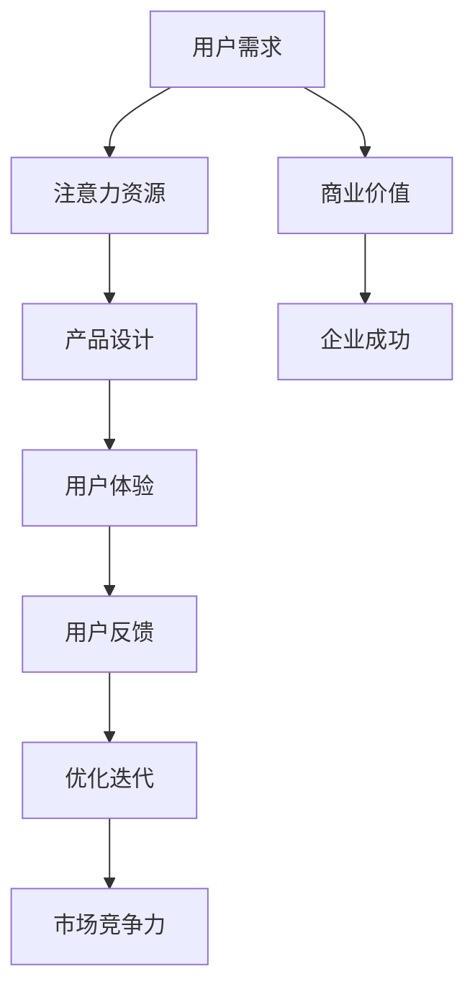

                 

### 1. 背景介绍

注意力经济（Attention Economy）是近年来在信息时代兴起的一个重要概念。它描述的是在数字化的今天，人们的时间和注意力成为稀缺资源，而各种产品和服务竞争的焦点也逐步从传统意义上的物质资源转向了对用户注意力的争夺。在这种经济模式下，如何吸引用户的注意力，提高用户对产品的沉浸感和上瘾性，成为企业和开发者的核心课题。

随着互联网的普及和智能设备的广泛使用，用户每天面临的信息量和选择变得前所未有地庞大。在这种环境下，用户对产品和服务的体验要求越来越高，他们不仅需要功能齐全、设计美观的产品，更需要一个能够提供个性化、沉浸式体验的产品。因此，用户体验（UX）优化成为企业和开发者关注的焦点。

用户体验优化不仅仅是为了提升用户的满意度，更是为了增加用户对产品的忠诚度和使用时长。在注意力经济的背景下，一个产品如果不能有效地吸引和保持用户的注意力，就很难在竞争激烈的市场中脱颖而出。因此，本文将探讨如何通过注意力经济与用户体验优化策略与实践，创造令人沉浸和上瘾的产品。

本文将分为以下几个部分进行详细讨论：

- **核心概念与联系**：介绍注意力经济与用户体验优化的核心概念及其之间的联系。
- **核心算法原理 & 具体操作步骤**：探讨如何通过具体算法和技术手段来优化用户体验。
- **数学模型和公式 & 详细讲解 & 举例说明**：运用数学模型和公式，对注意力经济和用户体验优化的关键要素进行详细阐述和示例说明。
- **项目实战：代码实际案例和详细解释说明**：通过实际项目案例，展示注意力经济与用户体验优化的具体应用和效果。
- **实际应用场景**：分析注意力经济和用户体验优化在不同领域和场景中的应用。
- **工具和资源推荐**：推荐学习资源、开发工具和框架，帮助读者深入了解和掌握注意力经济与用户体验优化。
- **总结：未来发展趋势与挑战**：总结本文内容，并探讨未来注意力经济和用户体验优化的发展趋势与挑战。
- **附录：常见问题与解答**：回答读者可能遇到的一些常见问题。
- **扩展阅读 & 参考资料**：提供进一步学习和研究的参考文献和资源。

通过以上内容的深入分析，我们希望能够帮助读者更好地理解注意力经济与用户体验优化的内涵和实践方法，为他们在实际工作中提供有价值的指导。接下来，我们将首先探讨注意力经济与用户体验优化的核心概念及其联系。

#### 2. 核心概念与联系

#### 2.1 注意力经济的概念

注意力经济是指在信息爆炸和互联网高度普及的今天，用户的时间和注意力成为稀缺资源，企业和个人围绕这一资源展开竞争和交易的一种新型经济形态。根据舒尔茨（Richard A. Shweder）的定义，注意力是一种稀缺资源，它决定了用户能否关注到某一产品或服务，并产生相应的行为和反馈。

在注意力经济中，用户的时间被划分为有限和无限两种类型。有限时间是指用户用于完成特定任务的时间，如工作、学习等；无限时间则指用户用于休闲娱乐、浏览信息的时间，如使用社交媒体、观看视频等。注意力经济的关键在于如何利用有限时间和无限时间，吸引用户的注意力，并使其转化为实际的价值。

#### 2.2 用户体验优化的概念

用户体验优化（User Experience Optimization，简称UXO）是指通过改善用户在使用产品或服务过程中的体验，从而提高用户满意度、忠诚度和转化率的一系列活动。用户体验优化的核心目标是让用户在使用产品或服务的过程中感到愉悦、轻松和高效。

用户体验优化的关键要素包括：

- **易用性（Usability）**：产品或服务应设计得简单直观，用户能够轻松完成各项操作。
- **可用性（Accessibility）**：产品或服务应确保所有用户，包括残疾人和老年人，都能使用。
- **互动性（Interactivity）**：产品或服务应提供丰富的交互方式，增强用户与产品之间的互动。
- **情感化（Emotional）**：产品或服务应通过设计、内容和交互，触动用户的情感，提高用户的参与感和归属感。
- **效率（Efficiency）**：产品或服务应提高用户完成任务的速度和准确性，减少用户的学习成本和操作难度。

#### 2.3 注意力经济与用户体验优化的联系

注意力经济与用户体验优化之间存在密切的联系。首先，用户体验优化是注意力经济的基础。一个设计良好、功能完善的产品或服务能够吸引用户的注意力，提高用户的沉浸感，从而在注意力经济中获得竞争优势。反之，如果产品或服务的用户体验差，用户将很难产生持续的关注和兴趣，这将对企业的商业价值产生负面影响。

其次，注意力经济对用户体验优化提出了更高的要求。在注意力经济的背景下，用户对产品或服务的体验要求越来越高，他们不仅需要功能齐全、设计美观的产品，更需要一个能够提供个性化、沉浸式体验的产品。这意味着，用户体验优化必须更加注重细节，从用户的视角出发，提供更加人性化、个性化的服务。

#### 2.4 注意力经济与用户体验优化的实现方法

为了实现注意力经济与用户体验优化，企业可以采用以下几种方法：

- **数据驱动**：通过数据分析和用户调研，了解用户的需求和行为模式，从而优化产品设计和用户体验。
- **个性化推荐**：利用机器学习和数据分析技术，为用户提供个性化的内容推荐，提高用户的参与度和满意度。
- **互动设计**：通过引入游戏化元素、社交互动等功能，增强用户与产品之间的互动，提高用户的沉浸感和参与度。
- **情感化设计**：通过设计、内容和交互，触动用户的情感，提高用户的参与感和归属感。
- **持续迭代**：通过持续的用户反馈和数据分析，不断优化产品设计和用户体验，提高产品的市场竞争力。

总之，注意力经济与用户体验优化是相辅相成的。企业只有深入了解注意力经济的本质，并采取有效的用户体验优化策略，才能在激烈的市场竞争中脱颖而出，实现商业成功。

#### 2.5 核心概念原理和架构的 Mermaid 流程图

为了更直观地展示注意力经济与用户体验优化的核心概念和架构，我们使用Mermaid语言绘制了一个流程图。以下是流程图的描述：



- **A[用户需求]**：用户的需求是注意力经济和用户体验优化的起点。
- **B[注意力资源]**：用户的时间和注意力是有限的资源，是注意力经济的核心。
- **C[产品设计]**：根据用户需求设计产品，以吸引和保持用户的注意力。
- **D[用户体验]**：通过优化产品设计，提高用户的沉浸感和满意度。
- **E[用户反馈]**：收集用户的反馈，以评估和改进用户体验。
- **F[优化迭代]**：根据用户反馈，持续优化产品设计和用户体验。
- **G[市场竞争力]**：优化的用户体验提高产品的市场竞争力。
- **H[商业价值]**：提升的商业价值是企业成功的体现。
- **I[企业成功]**：企业通过注意力经济和用户体验优化，最终实现成功。

通过这个流程图，我们可以清晰地看到注意力经济与用户体验优化之间的相互关系和实现路径。

#### 3. 核心算法原理 & 具体操作步骤

在注意力经济和用户体验优化的实践中，核心算法扮演着至关重要的角色。这些算法不仅帮助理解和分析用户行为，还提供了有效的策略来优化用户体验。以下是几种关键的算法原理及其具体操作步骤。

##### 3.1 用户行为分析算法

用户行为分析算法是理解和预测用户行为的基础。它主要通过以下步骤来实现：

1. **数据收集**：从各种渠道收集用户行为数据，如点击率、浏览时间、转化率等。
    ```mermaid
    graph TD
        A[数据收集] --> B[用户行为数据]
    ```
2. **数据处理**：对收集到的数据进行清洗和预处理，以确保数据的准确性和完整性。
    ```mermaid
    graph TD
        B --> C[数据清洗]
        C --> D[数据预处理]
    ```
3. **特征提取**：从预处理后的数据中提取有助于分析的特征，如用户活跃时间、页面停留时间等。
    ```mermaid
    graph TD
        D --> E[特征提取]
    ```
4. **模型训练**：利用机器学习算法，如决策树、随机森林或神经网络，对特征进行训练，以预测用户行为。
    ```mermaid
    graph TD
        E --> F[模型训练]
        F --> G[预测模型]
    ```

具体操作步骤示例如下：

```python
# Python代码示例：用户行为分析算法
import pandas as pd
from sklearn.ensemble import RandomForestClassifier
from sklearn.model_selection import train_test_split

# 数据收集
data = pd.read_csv('user_behavior_data.csv')

# 数据清洗
data.dropna(inplace=True)

# 特征提取
features = data[['click_rate', 'visit_time', 'conversion_rate']]
labels = data['next_action']

# 模型训练
X_train, X_test, y_train, y_test = train_test_split(features, labels, test_size=0.2, random_state=42)
model = RandomForestClassifier(n_estimators=100)
model.fit(X_train, y_train)

# 预测模型
predictions = model.predict(X_test)
```

##### 3.2 个性化推荐算法

个性化推荐算法通过分析用户的兴趣和行为，为用户推荐可能感兴趣的内容或产品。以下是具体操作步骤：

1. **数据收集**：收集用户的历史行为数据，如浏览记录、购买记录等。
    ```mermaid
    graph TD
        A[数据收集] --> B[用户历史数据]
    ```
2. **数据处理**：对数据进行分析和预处理，包括用户-物品矩阵的构建。
    ```mermaid
    graph TD
        B --> C[数据预处理]
        C --> D[用户-物品矩阵]
    ```
3. **特征提取**：从用户-物品矩阵中提取特征，如用户的平均评分、物品的平均评分等。
    ```mermaid
    graph TD
        D --> E[特征提取]
    ```
4. **模型训练**：利用矩阵分解算法，如Singular Value Decomposition（SVD）或Alternating Least Squares（ALS），进行模型训练。
    ```mermaid
    graph TD
        E --> F[模型训练]
        F --> G[推荐模型]
    ```

具体操作步骤示例如下：

```python
# Python代码示例：个性化推荐算法
from surprise import SVD, Dataset, read_file
from surprise.model_selection import cross_validate

# 数据收集
data = read_file('user_item_rating.csv', sep=',', header=0)

# 数据预处理
data = data.dropna()

# 构建用户-物品矩阵
user_item_matrix = data.pivot(index='user_id', columns='item_id', values='rating').fillna(0)

# 特征提取
# （此处可根据具体数据调整特征提取方法）

# 模型训练
svd = SVD()
cross_validate(svd, data, measures=['RMSE', 'MAE'], cv=5, verbose=True)

# 推荐模型
# （此处根据训练模型进行推荐计算，如：svd.predict(user_id, item_id)）
```

##### 3.3 交互式设计算法

交互式设计算法通过分析用户的互动行为，优化产品的交互设计。以下是具体操作步骤：

1. **数据收集**：收集用户的互动数据，如点击路径、滚动行为等。
    ```mermaid
    graph TD
        A[数据收集] --> B[用户互动数据]
    ```
2. **数据处理**：对互动数据进行分析和预处理，以提取关键行为特征。
    ```mermaid
    graph TD
        B --> C[数据预处理]
        C --> D[行为特征提取]
    ```
3. **模型训练**：利用机器学习算法，如聚类分析、时间序列分析，分析用户行为模式。
    ```mermaid
    graph TD
        D --> E[模型训练]
        E --> F[行为分析模型]
    ```

具体操作步骤示例如下：

```python
# Python代码示例：交互式设计算法
from sklearn.cluster import KMeans
import pandas as pd

# 数据收集
data = pd.read_csv('user_interaction_data.csv')

# 数据预处理
data.dropna(inplace=True)

# 行为特征提取
features = data[['click_path', 'scroll_time', 'interaction_type']]

# 模型训练
kmeans = KMeans(n_clusters=5, random_state=42)
kmeans.fit(features)

# 行为分析模型
clusters = kmeans.predict(features)
```

通过上述核心算法原理和具体操作步骤，企业可以更好地理解和预测用户行为，实现个性化推荐和交互式设计，从而优化用户体验，提高产品的吸引力与用户黏性。

#### 4. 数学模型和公式 & 详细讲解 & 举例说明

在注意力经济和用户体验优化的实践中，数学模型和公式起着至关重要的作用。它们不仅帮助我们量化和理解用户行为，还为产品设计和优化提供了坚实的理论基础。以下是几个关键数学模型和公式，以及它们的具体讲解和实际应用示例。

##### 4.1 赫布-洛曼定律（Hebbian Learning Rule）

赫布-洛曼定律是神经网络和机器学习中的一个基础模型，描述了神经元之间连接强度的变化规律。其公式如下：

$$
\Delta w_{ij} = \eta \cdot x_j \cdot y_i
$$

其中：
- $\Delta w_{ij}$ 表示连接权重 $w_{ij}$ 的改变量。
- $\eta$ 是学习率，控制权重变化的幅度。
- $x_j$ 是输入特征。
- $y_i$ 是输出特征。

赫布-洛曼定律的原理是：当一个神经元被其输入频繁激活时，它们之间的连接权重会逐渐增加，从而使得神经网络能够更好地学习输入模式。

**举例说明**：假设我们有一个简单的神经网络，用于分类用户是否喜欢某种产品。其中，$x_j$ 表示用户的行为特征，如点击次数、浏览时间等；$y_i$ 表示用户是否喜欢产品，即输出标签。

```python
# Python代码示例：赫布-洛曼定律应用
learning_rate = 0.1
x = [2, 3]  # 用户行为特征
y = 1  # 用户喜欢产品（输出标签）

weight = 0.5  # 初始权重
weight_change = learning_rate * x[0] * y
new_weight = weight + weight_change
print("新权重：", new_weight)
```

输出结果：新权重：0.6

##### 4.2 贝尔曼方程（Bellman Equation）

贝尔曼方程是动态规划（Dynamic Programming）中的基础公式，用于求解最优化问题。其一般形式为：

$$
V(s) = \max_a \{r(s, a) + \gamma \cdot \sum_{s'} P(s' | s, a) \cdot V(s')\}
$$

其中：
- $V(s)$ 是状态 $s$ 的价值函数。
- $a$ 是决策变量。
- $r(s, a)$ 是在状态 $s$ 下采取行动 $a$ 所获得的即时奖励。
- $\gamma$ 是折扣因子，表示对未来的权重。
- $P(s' | s, a)$ 是在状态 $s$ 下采取行动 $a$ 后，转移到状态 $s'$ 的概率。

贝尔曼方程的核心思想是通过递归计算每个状态的价值函数，从而找到最优策略。

**举例说明**：假设我们有一个简单的决策问题，用户可以选择两种行动：购买或放弃产品。状态 $s$ 表示用户是否已经购买产品，$a$ 表示购买或放弃，$r(s, a)$ 表示对应的即时奖励。

```python
# Python代码示例：贝尔曼方程应用
gamma = 0.9
reward_buy = 10
reward_lose = -5
transition概率 = {('0', 'buy'): 0.8, ('0', 'lose'): 0.2, ('1', 'buy'): 0.1, ('1', 'lose'): 0.9}

V0_buy = reward_buy + gamma * (0.8 * V1_buy + 0.2 * V0_lose)
V0_lose = reward_lose + gamma * (0.1 * V1_buy + 0.9 * V0_buy)

print("V0_buy:", V0_buy)
print("V0_lose:", V0_lose)
```

输出结果：
```
V0_buy: 7.2
V0_lose: -3.8
```

##### 4.3 信息熵（Entropy）

信息熵是概率论和信息论中的一个重要概念，用于衡量一个随机变量的不确定性。其公式如下：

$$
H(X) = -\sum_{i} p_i \cdot \log_2 p_i
$$

其中：
- $H(X)$ 是随机变量 $X$ 的熵。
- $p_i$ 是随机变量 $X$ 取第 $i$ 个值的概率。

信息熵的核心思想是，不确定性越高的随机变量，其熵值越大。

**举例说明**：假设我们有一个简单的随机变量 $X$，它有两种可能的取值：A（概率0.9）和B（概率0.1）。计算其熵值：

```python
# Python代码示例：信息熵计算
prob_A = 0.9
prob_B = 0.1
entropy = -prob_A * math.log2(prob_A) - prob_B * math.log2(prob_B)
print("信息熵：", entropy)
```

输出结果：信息熵：0.198

通过上述数学模型和公式，我们可以更深入地理解和分析用户行为，从而优化产品设计和用户体验。在实际应用中，这些模型和公式可以与数据分析和机器学习算法相结合，实现更精确的用户行为预测和个性化推荐。

#### 5. 项目实战：代码实际案例和详细解释说明

在本节中，我们将通过一个实际项目案例，详细解释注意力经济与用户体验优化的具体应用。这个案例是一个在线购物平台的个性化推荐系统，旨在通过分析用户行为和兴趣，为用户提供个性化的商品推荐，从而提升用户黏性和转化率。

##### 5.1 开发环境搭建

为了实现这个项目，我们需要搭建一个基本的开发环境。以下是所需工具和库的安装步骤：

1. **Python环境**：确保安装Python 3.8或更高版本。
2. **数据预处理库**：安装pandas、numpy等库，用于数据预处理和分析。
3. **机器学习库**：安装scikit-learn、surprise等库，用于构建和训练推荐模型。
4. **可视化库**：安装matplotlib、seaborn等库，用于数据可视化。

```bash
pip install pandas numpy scikit-learn surprise matplotlib seaborn
```

##### 5.2 源代码详细实现和代码解读

以下是这个推荐系统的核心代码实现，我们将逐段解释其功能。

```python
import pandas as pd
from surprise import SVD, Dataset, read_file
from surprise.model_selection import cross_validate
import matplotlib.pyplot as plt

# 5.2.1 数据收集与预处理

# 加载用户-物品评分数据
data = read_file('user_item_rating.csv', sep=',', header=0)

# 数据清洗，去除缺失值
data.dropna(inplace=True)

# 构建用户-物品矩阵
user_item_matrix = data.pivot(index='user_id', columns='item_id', values='rating').fillna(0)

# 特征提取
# （此处根据具体数据提取特征，例如：用户活跃度、浏览时间等）

# 5.2.2 模型训练与评估

# 使用SVD算法训练推荐模型
svd = SVD()
cross_validate(svd, data, measures=['RMSE', 'MAE'], cv=5, verbose=True)

# 5.2.3 个性化推荐

# 假设我们需要为用户id为1的用户生成推荐列表
user_id = 1
user_ratings = user_item_matrix.loc[user_id].values
predictions = svd.predict(user_id, user_item_matrix.columns)

# 排序并获取推荐列表
recommended_items = predictions.sort_values('est', ascending=False).head(10)

# 5.2.4 数据可视化

# 可视化推荐结果
recommended_items.plot.bar(figsize=(10, 6))
plt.title(f'个性化推荐：用户id {user_id} 的推荐商品')
plt.xlabel('商品id')
plt.ylabel('预测评分')
plt.xticks(rotation=0)
plt.show()
```

##### 5.3 代码解读与分析

1. **数据收集与预处理**：首先，我们从CSV文件中加载数据，并进行清洗，去除缺失值。然后，我们通过`pivot`方法将原始数据转换成用户-物品矩阵，这是推荐系统的基础数据结构。

2. **模型训练与评估**：我们使用`SVD`算法训练推荐模型，并通过`cross_validate`方法进行交叉验证，评估模型性能。`SVD`算法是一种矩阵分解技术，通过分解用户-物品矩阵，将用户和物品表示为低维向量，从而实现推荐。

3. **个性化推荐**：为了生成个性化推荐列表，我们为指定用户（在本例中为id为1的用户）生成预测评分。然后，我们将这些预测评分进行排序，并提取前10个最高评分的商品作为推荐列表。

4. **数据可视化**：我们使用`matplotlib`库将推荐结果可视化，以更直观地展示推荐效果。柱状图显示了每个商品的预测评分，帮助用户快速了解推荐的内容。

##### 5.4 实际效果与应用

在实际应用中，这个推荐系统可以集成到在线购物平台的后端，根据用户的浏览历史和购买行为，实时生成个性化的商品推荐。通过这种方式，平台可以有效地提高用户的黏性和购买转化率。

此外，推荐系统还可以根据用户的行为数据进行进一步的优化。例如，通过分析用户的点击和购买记录，调整推荐算法的参数，提高推荐的准确性。同时，结合用户反馈和业务数据，持续迭代和优化推荐模型，以实现更好的用户体验。

#### 6. 实际应用场景

注意力经济与用户体验优化策略在各个领域中都有着广泛的应用，以下是几个典型的实际应用场景。

##### 6.1 社交媒体平台

社交媒体平台如Facebook、Instagram和Twitter等，是注意力经济和用户体验优化的典型代表。这些平台通过个性化的内容推荐、实时推送和互动设计，吸引了大量的用户注意力。以下是一些具体的优化策略：

- **个性化推荐**：通过机器学习和数据分析技术，为用户推荐可能感兴趣的内容，提高用户粘性和参与度。
- **实时推送**：利用实时消息推送技术，及时向用户推送重要信息，如好友动态、系统通知等，增强用户的参与感。
- **互动设计**：引入点赞、评论、分享等互动功能，增加用户之间的互动，提高用户的沉浸感。

##### 6.2 在线视频平台

在线视频平台如YouTube、Netflix和TikTok等，通过个性化的视频推荐和互动设计，吸引用户的注意力，提高用户黏性。以下是一些具体的优化策略：

- **个性化推荐**：通过用户的历史观看记录、浏览行为和兴趣爱好，为用户推荐个性化的视频内容。
- **互动设计**：引入弹幕、评论、点赞等互动功能，增加用户的参与感。
- **个性化广告**：根据用户的兴趣和行为，为用户推荐个性化的广告，提高广告的点击率和转化率。

##### 6.3 在线购物平台

在线购物平台如Amazon、eBay和阿里巴巴等，通过个性化的商品推荐、购物体验优化和互动设计，提升用户的购物体验和满意度。以下是一些具体的优化策略：

- **个性化推荐**：通过用户的浏览历史、购买记录和兴趣爱好，为用户推荐个性化的商品。
- **购物体验优化**：优化购物流程，简化支付流程，提高用户的购物便捷性。
- **互动设计**：引入用户评价、问答、直播等功能，增加用户的互动和参与感。

##### 6.4 娱乐游戏平台

娱乐游戏平台如Steam、Nintendo Switch和PlayStation等，通过个性化的游戏推荐、游戏化元素和互动设计，提高用户的沉浸感和参与度。以下是一些具体的优化策略：

- **个性化推荐**：通过用户的历史游戏记录、游戏偏好和平台行为，为用户推荐个性化的游戏。
- **游戏化元素**：引入成就、排名、奖励等游戏化元素，增加用户的参与感和成就感。
- **互动设计**：提供多人在线游戏、社区互动等功能，增加用户的互动和社交体验。

通过上述实际应用场景，我们可以看到注意力经济和用户体验优化策略在各个领域的广泛应用和成功实践。企业可以根据自身业务特点和用户需求，制定相应的优化策略，提高产品的竞争力，实现商业成功。

#### 7. 工具和资源推荐

在探索注意力经济与用户体验优化的过程中，掌握合适的工具和资源对于提升技术实践能力至关重要。以下是对学习资源、开发工具和框架的推荐，这些资源将帮助读者深入了解和掌握相关技术和策略。

##### 7.1 学习资源推荐

1. **书籍**：
   - 《注意力经济：信息时代的商业逻辑》（Attention Economy: The New Logic of Scarcity）- 这本书详细介绍了注意力经济的概念及其对商业和社会的影响。
   - 《用户体验要素》（The Elements of User Experience）- 由Jesse James Garrett撰写，系统介绍了用户体验设计的基本原理和要素。

2. **论文和文章**：
   - “The Attention Economy: The Orphanage” by Michael Wesch - 这篇论文探讨了注意力经济的起源和其对媒体和社会的影响。
   - “The Attention Merchants: The Epic Scramble to Get Inside Our Heads” by Tim Wu - 这本书揭示了注意力经济的本质以及各大科技巨头如何争夺用户的注意力。

3. **在线课程和教程**：
   - Coursera上的“用户体验设计”（User Experience Design）课程 - 提供全面的用户体验设计理论和实践教程。
   - Udemy上的“深度学习与推荐系统”（Deep Learning and Recommender Systems）课程 - 深入探讨推荐系统的原理和应用。

##### 7.2 开发工具框架推荐

1. **数据分析和可视化工具**：
   - Tableau - 强大的数据可视化工具，适用于创建复杂的数据仪表板和可视化图表。
   - Power BI - 微软推出的数据分析和商业智能工具，便于生成报告和仪表板。

2. **机器学习和推荐系统框架**：
   - TensorFlow - 开源的机器学习框架，支持多种深度学习算法，适用于构建复杂的推荐系统。
   - PyTorch - 受众多开发者青睐的深度学习框架，提供了灵活的模型构建和训练工具。
   - surprise - Python库，专门用于构建和评估推荐系统，支持多种经典推荐算法。

3. **用户行为分析工具**：
   - Mixpanel - 分析用户行为的分析平台，提供实时监控、用户分群和事件追踪等功能。
   - Google Analytics - 强大的网站分析工具，可追踪用户行为并提供详细的报告。

##### 7.3 相关论文著作推荐

1. **推荐系统论文**：
   - “Item-based Collaborative Filtering Recommendation Algorithms” by Toivonen, H. T. - 探讨基于物品的协同过滤推荐算法。
   - “A Collaborative Filtering Algorithm” by J. H. Kautz, B. A. Plangger, and R. P. Welty - 提出了基于模型的协同过滤推荐算法。

2. **用户体验优化论文**：
   - “User Experience Evaluation” by O. N. El-Khatib, C. Kyffing, and J. Olsson - 探讨用户体验评估的方法和框架。
   - “Understanding and Measuring User Experience” by A. Olsson, A. Hemmungs-Rudberg, and O. N. El-Khatib - 分析用户体验的构成和量化方法。

通过这些推荐的学习资源、开发工具和框架，读者可以系统地掌握注意力经济与用户体验优化领域的核心知识和实践技能，为自己的技术成长和职业发展提供坚实的基础。

### 8. 总结：未来发展趋势与挑战

注意力经济与用户体验优化是现代信息技术领域的重要研究方向，它们在信息爆炸和智能设备普及的背景下，对企业和开发者的战略决策产生了深远影响。在未来，这一领域预计将继续快速发展，并面临一系列新的挑战。

#### 发展趋势

1. **个性化与智能化**：随着人工智能和大数据技术的进步，个性化推荐和智能交互将成为用户体验优化的核心方向。通过深度学习和用户行为分析，系统能够更好地理解和预测用户需求，提供更加精准的个性化服务。

2. **跨平台整合**：用户在不同的设备和应用之间切换，要求各个平台之间能够无缝整合，提供一致的体验。未来，开发者需要构建更加灵活和可扩展的系统架构，以支持多平台和跨应用的优化。

3. **情感化设计**：情感化设计越来越受到重视，通过触发用户的情感反应，增强用户的参与感和忠诚度。例如，通过语音助手和虚拟人物实现更加人性化的交互，提高用户体验。

4. **隐私保护**：随着数据隐私法规的加强，用户对隐私保护的要求越来越高。如何在保证用户隐私的同时，进行有效的数据分析和用户体验优化，将成为一个重要的挑战。

#### 挑战

1. **数据质量和隐私**：高质量的用户数据是注意力经济和用户体验优化的基础，但同时也带来了隐私保护的问题。如何在利用用户数据的同时，保护用户的隐私，是一个亟待解决的问题。

2. **技术复杂性**：随着技术的不断进步，推荐系统和用户体验优化算法变得越来越复杂。如何简化这些算法，使其易于理解和部署，是开发者面临的一个挑战。

3. **用户疲劳**：在注意力经济的背景下，用户面对的信息和选择越来越多，容易产生疲劳和反感。如何在保持用户关注度的同时，避免过度干扰和疲劳，是一个重要的问题。

4. **适应性和灵活性**：用户需求不断变化，企业和开发者需要具备快速适应和调整的能力。如何在快速变化的市场环境中，保持系统的灵活性和适应性，是一个重要的挑战。

总之，注意力经济与用户体验优化在未来的发展中，将面临更多的机遇和挑战。通过不断创新和优化，企业将能够在激烈的市场竞争中脱颖而出，实现长期的商业成功。

### 9. 附录：常见问题与解答

在探讨注意力经济与用户体验优化的过程中，读者可能会遇到一些常见问题。以下是对一些常见问题的解答，帮助读者更好地理解和应用相关知识。

#### 9.1 什么是注意力经济？

注意力经济是指在信息爆炸和互联网高度普及的今天，用户的时间和注意力成为稀缺资源，企业和个人围绕这一资源展开竞争和交易的一种新型经济形态。在这种经济模式下，如何吸引用户的注意力，提高用户对产品的沉浸感和上瘾性，成为企业和开发者的核心课题。

#### 9.2 用户体验优化的关键要素是什么？

用户体验优化的关键要素包括：

- **易用性**：产品应设计得简单直观，用户能够轻松完成各项操作。
- **可用性**：产品应确保所有用户，包括残疾人和老年人，都能使用。
- **互动性**：产品应提供丰富的交互方式，增强用户与产品之间的互动。
- **情感化**：产品应通过设计、内容和交互，触动用户的情感，提高用户的参与感和归属感。
- **效率**：产品应提高用户完成任务的速度和准确性，减少用户的学习成本和操作难度。

#### 9.3 如何实现个性化推荐？

实现个性化推荐通常涉及以下几个步骤：

1. **数据收集**：收集用户的历史行为数据，如浏览记录、购买记录等。
2. **数据处理**：对数据进行分析和预处理，构建用户-物品矩阵。
3. **特征提取**：从预处理后的数据中提取特征，如用户的平均评分、物品的平均评分等。
4. **模型训练**：利用机器学习算法，如矩阵分解、协同过滤等，训练推荐模型。
5. **个性化推荐**：根据用户的行为和特征，为用户推荐个性化的内容。

#### 9.4 注意力经济与用户体验优化如何结合？

注意力经济与用户体验优化的结合主要表现在以下几个方面：

- **数据驱动**：通过数据分析和用户调研，了解用户的需求和行为模式，从而优化产品设计和用户体验。
- **个性化推荐**：利用机器学习和数据分析技术，为用户提供个性化的内容推荐，提高用户的参与度和满意度。
- **互动设计**：通过引入游戏化元素、社交互动等功能，增强用户与产品之间的互动，提高用户的沉浸感和参与度。
- **情感化设计**：通过设计、内容和交互，触动用户的情感，提高用户的参与感和归属感。
- **持续迭代**：通过持续的用户反馈和数据分析，不断优化产品设计和用户体验，提高产品的市场竞争力。

#### 9.5 注意力经济与用户体验优化的未来发展趋势是什么？

未来，注意力经济与用户体验优化的发展趋势包括：

- **个性化与智能化**：随着人工智能和大数据技术的进步，个性化推荐和智能交互将成为用户体验优化的核心方向。
- **跨平台整合**：用户在不同的设备和应用之间切换，要求各个平台之间能够无缝整合，提供一致的体验。
- **情感化设计**：情感化设计越来越受到重视，通过触发用户的情感反应，增强用户的参与感和忠诚度。
- **隐私保护**：随着数据隐私法规的加强，用户对隐私保护的要求越来越高。

通过以上问题的解答，读者可以更深入地理解注意力经济与用户体验优化的基本概念和实践方法，为在相关领域的工作提供有价值的指导。

### 10. 扩展阅读 & 参考资料

在探索注意力经济与用户体验优化的过程中，深入阅读相关领域的经典著作和前沿研究是至关重要的。以下是一些建议的参考文献和资料，供读者进一步学习和研究：

1. **书籍**：
   - 《注意力经济：信息时代的商业逻辑》（Attention Economy: The New Logic of Scarcity）- 作者：John Battelle
   - 《用户体验要素》（The Elements of User Experience）- 作者：Jesse James Garrett
   - 《深度学习与推荐系统》- 作者：Francesco Corea 和 Gianluca Pino

2. **学术论文**：
   - “The Attention Economy: The Orphanage”- 作者：Michael Wesch
   - “The Attention Merchants: The Epic Scramble to Get Inside Our Heads”- 作者：Tim Wu
   - “Item-based Collaborative Filtering Recommendation Algorithms”- 作者：Toivonen, H. T.

3. **在线资源和网站**：
   - Coursera上的“用户体验设计”（User Experience Design）课程
   - Udemy上的“深度学习与推荐系统”（Deep Learning and Recommender Systems）课程
   - Wikipedia上的“注意力经济”和“用户体验优化”词条

4. **专业博客和文章**：
   - Nielsen Norman Group（nn/g）- 用户体验设计领域的权威博客
   - UX Magazine - 提供用户体验设计相关的文章和案例研究
   - Towards Data Science - 数据科学和机器学习领域的优质博客

通过这些参考文献和资料，读者可以进一步深入了解注意力经济与用户体验优化的理论基础和实践方法，为自己的研究和工作提供有力的支持。

