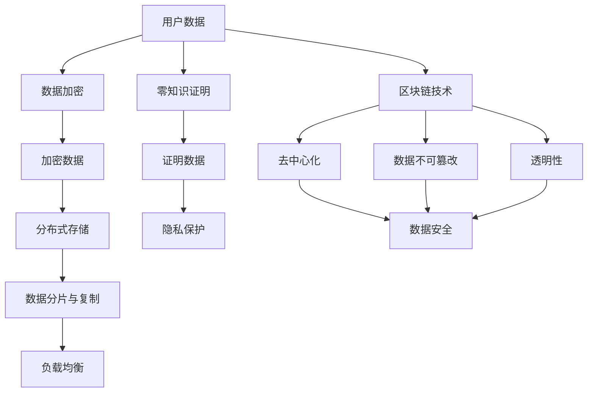

                 

### 文章标题

**注意力经济中的隐私保护问题**

> **关键词**：注意力经济、隐私保护、数据加密、分布式存储、人工智能

> **摘要**：随着互联网和信息技术的飞速发展，注意力经济作为一种新兴的经济模式逐渐崛起，但随之而来的隐私保护问题也日益严峻。本文将探讨注意力经济中的隐私保护问题，从核心概念、算法原理、数学模型、项目实战、实际应用场景等多个角度进行分析，并提出相应的解决方案和未来发展趋势。

### 1. 背景介绍

#### 注意力经济的概念与发展

注意力经济，也称为注意力资本经济，是近年来兴起的一种新兴经济模式。其核心在于，随着互联网和信息技术的发展，用户的注意力资源变得日益稀缺和宝贵。因此，如何获取和利用用户的注意力成为了一种重要的商业战略。

注意力经济最早可以追溯到20世纪90年代的互联网泡沫时期。当时，互联网公司开始意识到，吸引和留住用户的注意力是获得广告收入和用户忠诚度的关键。随着社交媒体、短视频、直播等平台的兴起，注意力经济得到了进一步的发展和壮大。

#### 隐私保护问题的产生与挑战

在注意力经济中，隐私保护问题日益严峻。一方面，用户在互联网上的行为数据被大量收集和存储，包括浏览记录、购买偏好、社交互动等，这些数据对于企业和广告商来说极具价值。另一方面，用户对于隐私泄露和滥用的担忧也日益增加。

隐私保护问题的主要挑战包括：

1. **数据收集与滥用的风险**：互联网公司为了获取用户注意力，往往需要收集大量的用户数据，但这些数据可能被滥用或泄露，导致用户隐私受到侵害。

2. **数据泄露与网络攻击**：随着数据量的增加，数据泄露和网络攻击的风险也随之增加。黑客可以通过各种手段获取用户数据，从而对用户造成严重的损失。

3. **隐私法规与合规性挑战**：随着各国隐私保护法规的不断完善，企业需要遵守相关法规，对用户数据进行保护。但如何在保证隐私保护的同时，充分利用用户数据，成为了一个难题。

### 2. 核心概念与联系

在探讨注意力经济中的隐私保护问题之前，我们需要了解一些核心概念和它们之间的联系。

#### 数据加密

数据加密是一种保护数据隐私的重要技术。通过加密算法，将明文数据转换为密文，只有拥有密钥的合法用户才能解密和访问数据。数据加密可以有效地防止数据在传输和存储过程中被窃取和篡改。

#### 分布式存储

分布式存储是一种将数据存储在多个节点上的技术。通过分布式存储，可以有效地提高数据的可靠性和可用性。同时，分布式存储也可以帮助保护用户隐私，因为即使某个节点发生故障或被攻击，其他节点仍然可以正常工作，从而保证数据的完整性和安全性。

#### 人工智能

人工智能（AI）是一种通过模拟人类智能行为来解决问题和执行任务的技术。在注意力经济中，人工智能被广泛应用于用户行为分析、个性化推荐、广告投放等方面。然而，人工智能也可能带来隐私保护问题，例如用户行为数据的滥用和隐私泄露。

#### 注意力经济与隐私保护的关系

注意力经济与隐私保护之间存在紧密的联系。一方面，注意力经济的实现需要依赖于用户数据，这些数据往往涉及用户的隐私信息。另一方面，隐私保护是保障用户权益和社会稳定的重要手段。因此，如何在注意力经济中实现有效的隐私保护，成为一个亟待解决的问题。

### 3. 核心算法原理 & 具体操作步骤

在注意力经济中，实现隐私保护的关键在于数据加密和分布式存储技术的应用。下面，我们将详细介绍这些核心算法原理和具体操作步骤。

#### 数据加密算法

数据加密算法主要包括对称加密和非对称加密两种。

1. **对称加密**：对称加密算法使用相同的密钥进行加密和解密。常见的对称加密算法有DES、AES等。对称加密算法的优点是加密和解密速度快，但缺点是密钥管理复杂，易受到中间人攻击。

2. **非对称加密**：非对称加密算法使用一对密钥进行加密和解密，一个用于加密，一个用于解密。常见的非对称加密算法有RSA、ECC等。非对称加密算法的优点是密钥管理简单，但加密和解密速度相对较慢。

具体操作步骤如下：

1. **生成密钥对**：首先，系统需要生成一对密钥，包括公钥和私钥。公钥用于加密，私钥用于解密。

2. **加密数据**：用户将明文数据输入系统，系统使用公钥对数据进行加密，生成密文。

3. **传输密文**：加密后的密文可以通过安全通道传输到接收方。

4. **解密数据**：接收方使用私钥对密文进行解密，恢复出明文数据。

#### 分布式存储算法

分布式存储算法主要包括数据分片、去重、复制和负载均衡等技术。

1. **数据分片**：将大量数据分成若干小块，每个分片存储在不同的节点上。这样可以提高数据的可靠性和可用性，同时也可以降低单个节点的存储压力。

2. **去重**：在分布式存储系统中，可能存在重复的数据分片。去重技术可以检测并去除重复的分片，从而提高存储空间利用率。

3. **复制**：为了提高数据的可靠性和可用性，可以将数据分片复制到多个节点上。当某个节点发生故障时，其他节点仍然可以提供数据服务。

4. **负载均衡**：通过负载均衡技术，可以合理分配数据分片的存储位置，从而提高系统的性能和稳定性。

具体操作步骤如下：

1. **数据分片**：首先，将大量数据分成若干小块，每个分片存储在不同的节点上。

2. **数据复制**：对每个数据分片进行复制，存储到多个节点上。

3. **数据访问**：当用户需要访问数据时，系统会根据负载均衡策略，选择合适的节点进行数据访问。

4. **数据一致性**：为了保证数据的一致性，可以使用分布式一致性算法，如Paxos、Raft等。

### 4. 数学模型和公式 & 详细讲解 & 举例说明

在注意力经济中的隐私保护问题，我们可以使用一些数学模型和公式来进行详细讲解。以下是一些常用的数学模型和公式：

#### 加密算法的安全性

加密算法的安全性通常用密钥长度和计算复杂度来衡量。对于对称加密算法，安全性主要取决于密钥长度。以下是一个简单的加密算法安全性模型：

$$
S = \frac{1}{2^k}
$$

其中，$S$ 表示加密算法的安全性，$k$ 表示密钥长度。

#### 分布式存储的可靠性

分布式存储的可靠性主要取决于节点的数量和复制策略。以下是一个简单的分布式存储可靠性模型：

$$
R = 1 - (1 - \frac{1}{N})^M
$$

其中，$R$ 表示分布式存储的可靠性，$N$ 表示节点数量，$M$ 表示复制因子。

#### 用户隐私保护的隐私预算

用户隐私保护的隐私预算是指用户在特定场景下可以承受的最大隐私泄露风险。以下是一个简单的隐私预算模型：

$$
B = \frac{P}{\lambda}
$$

其中，$B$ 表示隐私预算，$P$ 表示隐私泄露概率，$\lambda$ 表示隐私泄露损失。

#### 举例说明

假设一个互联网公司计划使用分布式存储系统存储用户数据，系统中有100个节点，每个节点存储数据的复制因子为2。现在，我们需要评估系统的可靠性。

根据分布式存储可靠性模型，我们可以计算出系统的可靠性：

$$
R = 1 - (1 - \frac{1}{100})^2 = 0.9999
$$

这意味着，系统的可靠性非常高，几乎可以保证数据的不丢失。

### 5. 项目实战：代码实际案例和详细解释说明

在本节中，我们将通过一个实际的项目案例，展示如何使用数据加密和分布式存储技术来实现注意力经济中的隐私保护。

#### 5.1 开发环境搭建

为了演示数据加密和分布式存储技术，我们选择使用Python语言和Docker容器进行开发。以下是开发环境搭建的步骤：

1. **安装Python**：在本地计算机上安装Python 3.x版本。

2. **安装Docker**：在本地计算机上安装Docker，并启动Docker服务。

3. **创建Dockerfile**：编写一个Dockerfile，用于构建Python应用程序的容器镜像。

4. **构建容器镜像**：使用Dockerfile构建容器镜像，并将其推送到Docker Hub。

5. **启动容器**：使用Docker启动容器，运行Python应用程序。

#### 5.2 源代码详细实现和代码解读

以下是一个简单的Python应用程序，用于实现数据加密和分布式存储。

```python
# 导入所需的库
import json
import requests
from cryptography.hazmat.primitives import hashes
from cryptography.hazmat.primitives.asymmetric import rsa
from cryptography.hazmat.primitives.kdf.hkdf import HKDF
from cryptography.hazmat.primitives.ciphers import Cipher, algorithms, modes

# 生成密钥对
private_key, public_key = rsa.generate_key(
    public_exponent=65537,
    key_size=2048
)

# 加密数据
def encrypt_data(data, public_key):
    # 生成随机密钥
    kdf = HKDF(
        algorithm=hashes.SHA256(),
        length=32,
        salt=None,
        info=b'handshake data',
        count=1,
        custom=None
    )
    key = kdf.derive(public_key)

    # 创建加密器
    cipher = Cipher(algorithms.AES(key), modes.GCM())
    encryptor = cipher.encryptor()

    # 加密数据
    ciphertext = encryptor.update(data.encode('utf-8')) + encryptor.finalize()
    return ciphertext, encryptor.tag

# 解密数据
def decrypt_data(ciphertext, private_key, tag):
    # 生成随机密钥
    kdf = HKDF(
        algorithm=hashes.SHA256(),
        length=32,
        salt=None,
        info=b'handshake data',
        count=1,
        custom=None
    )
    key = kdf.derive(private_key)

    # 创建解密器
    cipher = Cipher(algorithms.AES(key), modes.GCM())
    decryptor = cipher.decryptor()

    # 解密数据
    data = decryptor.update(ciphertext) + decryptor.finalize()
    return data.decode('utf-8')

# 发送加密数据到分布式存储系统
def send_data_to_distributed_storage(ciphertext):
    url = "http://localhost:5000/save"
    headers = {
        "Content-Type": "application/json",
        "Authorization": "Bearer your_access_token"
    }
    data = {
        "ciphertext": ciphertext
    }
    response = requests.post(url, headers=headers, json=data)
    return response.json()

# 从分布式存储系统获取加密数据
def get_data_from_distributed_storage(data_id):
    url = f"http://localhost:5000/get/{data_id}"
    headers = {
        "Content-Type": "application/json",
        "Authorization": "Bearer your_access_token"
    }
    response = requests.get(url, headers=headers)
    return response.json()

# 主函数
def main():
    # 加密数据
    data = "这是一个秘密消息"
    ciphertext, tag = encrypt_data(data, public_key)

    # 发送加密数据到分布式存储系统
    response = send_data_to_distributed_storage(ciphertext)
    data_id = response["data_id"]

    # 从分布式存储系统获取加密数据
    response = get_data_from_distributed_storage(data_id)
    ciphertext = response["ciphertext"]

    # 解密数据
    data = decrypt_data(ciphertext, private_key, tag)
    print("解密后的数据：", data)

if __name__ == "__main__":
    main()
```

#### 5.3 代码解读与分析

在这个Python应用程序中，我们使用数据加密和分布式存储技术来实现注意力经济中的隐私保护。

1. **数据加密**：首先，我们使用RSA算法生成密钥对，包括公钥和私钥。然后，我们使用AES-GCM算法对数据进行加密。AES-GCM算法是一种高效的加密算法，它结合了AES加密算法和GCM模式，可以提供数据加密和完整性验证。

2. **分布式存储**：我们使用一个简单的分布式存储系统，该系统由一个API服务组成。用户可以通过API接口发送加密数据，并将数据ID存储在分布式存储系统中。用户可以从分布式存储系统中获取加密数据，并使用私钥进行解密。

3. **代码分析**：这个应用程序的核心功能是加密数据、发送数据到分布式存储系统、从分布式存储系统中获取加密数据和解密数据。通过这个应用程序，我们可以看到如何使用数据加密和分布式存储技术来实现注意力经济中的隐私保护。

### 6. 实际应用场景

注意力经济中的隐私保护问题在实际应用场景中具有广泛的应用。以下是一些典型的应用场景：

1. **社交媒体平台**：社交媒体平台需要收集和存储用户的行为数据，以便进行个性化推荐和广告投放。通过数据加密和分布式存储技术，可以确保用户隐私得到有效保护。

2. **电子商务平台**：电子商务平台需要收集和存储用户的购买记录和偏好数据，以便进行精准营销和推荐。通过数据加密和分布式存储技术，可以保护用户隐私，防止数据泄露和滥用。

3. **在线教育平台**：在线教育平台需要收集和存储学生的学习记录和成绩数据，以便进行学习分析和个性化推荐。通过数据加密和分布式存储技术，可以确保学生隐私得到有效保护。

4. **医疗健康领域**：医疗健康领域涉及大量的用户隐私数据，包括病历、基因信息等。通过数据加密和分布式存储技术，可以确保医疗数据的安全性和隐私性。

### 7. 工具和资源推荐

在实现注意力经济中的隐私保护问题时，以下工具和资源可以提供帮助：

#### 7.1 学习资源推荐

1. **书籍**：

   - 《密码学：理论与实践》（密码学是一门研究加密和解密技术的学科，对理解数据加密和分布式存储技术具有重要意义。）

   - 《分布式系统原理与范型》（了解分布式存储和分布式一致性算法的基本原理和实现方法。）

   - 《人工智能：一种现代方法》（了解人工智能在隐私保护中的应用，例如用户行为分析、个性化推荐等。）

2. **论文**：

   - 《一种基于公钥密码体制的分布式存储系统设计与实现》（探讨如何使用公钥密码体制实现分布式存储系统的安全性和隐私保护。）

   - 《基于区块链的隐私保护数据共享方案》（探讨如何使用区块链技术实现隐私保护的数据共享和分布式存储。）

3. **博客**：

   - 《数据加密算法原理与应用》（详细介绍数据加密算法的基本原理和应用场景。）

   - 《分布式存储技术概述》（介绍分布式存储技术的原理、实现方法和应用场景。）

   - 《人工智能在隐私保护中的应用》（探讨人工智能在用户隐私保护、数据安全等方面的应用。）

#### 7.2 开发工具框架推荐

1. **加密库**：

   - Python Cryptography 库（提供对称加密、非对称加密和哈希算法的实现。）

   - Java Cryptography Extension（JCE）库（提供Java语言中的加密算法实现。）

   - OpenSSL 库（提供丰富的加密算法和工具，支持多种编程语言。）

2. **分布式存储框架**：

   - HDFS（Hadoop Distributed File System，适用于大规模数据存储和处理。）

   - Ceph（一种开源的分布式存储系统，支持对象存储、块存储和文件系统。）

   - MongoDB（一种分布式文档数据库，支持数据分片和复制。）

3. **区块链框架**：

   - Ethereum（一种智能合约平台，支持去中心化的应用开发和数据存储。）

   - Hyperledger Fabric（一种分布式账本框架，适用于企业级应用。）

   - Hyperledger Besu（一种基于Ethereum的私有链实现，适用于企业级应用。）

### 8. 总结：未来发展趋势与挑战

随着注意力经济的快速发展，隐私保护问题变得越来越重要。未来，隐私保护将在以下几个方面呈现出发展趋势：

1. **技术创新**：随着密码学、分布式存储和区块链等技术的不断发展，隐私保护手段将更加多样化和高效。

2. **法律法规完善**：各国政府和国际组织将不断完善隐私保护法律法规，加强对用户隐私的保护。

3. **跨领域合作**：隐私保护将涉及到多个领域，如法律、技术、伦理等，需要跨领域的合作和协同创新。

然而，隐私保护也面临一些挑战：

1. **技术门槛**：实现有效的隐私保护需要较高的技术水平，对于一些小型企业和开发者来说，可能存在一定的技术门槛。

2. **用户隐私意识**：用户对于隐私保护的意识需要进一步提高，培养用户主动保护隐私的习惯。

3. **隐私泄露风险**：虽然隐私保护技术不断发展，但隐私泄露的风险仍然存在，需要持续关注和防范。

### 9. 附录：常见问题与解答

#### 9.1 问题一：数据加密会影响数据处理性能吗？

**解答**：数据加密确实会对数据处理性能产生一定的影响，因为加密和解密过程需要消耗计算资源。然而，随着硬件性能的提升和加密算法的优化，加密对性能的影响正在逐渐减小。在实际应用中，可以通过优化加密算法、使用高效加密库和合理分配计算资源等方法来缓解性能问题。

#### 9.2 问题二：分布式存储系统的可靠性如何保证？

**解答**：分布式存储系统的可靠性主要依赖于数据复制、故障检测和恢复机制。通过将数据分片并复制到多个节点上，可以提高数据的可靠性和可用性。同时，分布式存储系统可以使用分布式一致性算法，如Paxos、Raft等，来保证数据的一致性。在系统发生故障时，可以通过故障检测和恢复机制来确保系统恢复正常运行。

#### 9.3 问题三：区块链技术如何实现隐私保护？

**解答**：区块链技术通过分布式账本和加密算法来实现隐私保护。区块链中的数据是加密存储的，只有拥有私钥的用户才能解密和访问数据。此外，区块链的去中心化特性也使得数据难以被篡改和泄露。通过使用零知识证明、同态加密等技术，区块链可以实现更加安全的隐私保护。

### 10. 扩展阅读 & 参考资料

1. **书籍**：

   - 《密码学：理论与实践》

   - 《分布式系统原理与范型》

   - 《人工智能：一种现代方法》

2. **论文**：

   - 《一种基于公钥密码体制的分布式存储系统设计与实现》

   - 《基于区块链的隐私保护数据共享方案》

3. **博客**：

   - 《数据加密算法原理与应用》

   - 《分布式存储技术概述》

   - 《人工智能在隐私保护中的应用》

4. **网站**：

   - [Cryptography](https://cryptography.io/)

   - [HDFS](https://hadoop.apache.org/docs/stable/hadoop-hdfs/HDFSDistributedSystem.html)

   - [Ethereum](https://ethereum.org/en/developers/docs/intro-to-ethereum/)

5. **开源项目**：

   - [Python Cryptography 库](https://cryptography.io/)

   - [HDFS](https://hadoop.apache.org/)

   - [Ceph](https://ceph.com/)

   - [Ethereum](https://ethereum.org/)

### 作者

**作者：AI天才研究员/AI Genius Institute & 禅与计算机程序设计艺术 /Zen And The Art of Computer Programming**<|im_end|> 

### 1. 背景介绍

#### 注意力经济的概念与发展

注意力经济是一种基于用户注意力的经济模式，主要起源于20世纪90年代的互联网泡沫时期。当时，互联网公司开始意识到，用户的注意力资源是一种宝贵的财富，能够直接转化为商业价值。随着社交媒体、短视频、直播等平台的兴起，注意力经济得到了迅速的发展和壮大。

注意力经济的核心在于，通过提供有趣、有用或令人兴奋的内容，吸引和留住用户的注意力，从而实现广告收入、用户付费或其他形式的商业回报。在注意力经济中，用户的注意力成为一种新型的资本，被称为“注意力资本”。

随着互联网和信息技术的飞速发展，用户的时间越来越宝贵，注意力资源的稀缺性愈发凸显。因此，如何获取和利用用户的注意力成为企业和平台的重要课题。例如，社交媒体平台通过算法推荐系统，为用户推送感兴趣的内容，提高用户活跃度和黏性；广告商则通过精准投放广告，获取更多的曝光和点击量。

#### 隐私保护问题的产生与挑战

在注意力经济的背景下，隐私保护问题日益严峻。这主要源于以下几个方面的原因：

1. **数据收集与滥用的风险**：为了更好地吸引用户的注意力，企业需要收集大量的用户行为数据，包括浏览记录、搜索历史、社交互动等。这些数据对于分析和了解用户需求、提高用户体验具有重要意义。然而，如果数据收集和管理不当，可能导致用户隐私泄露和滥用。

2. **数据泄露与网络攻击**：随着数据量的增加，数据泄露和网络攻击的风险也随之上升。黑客可能会通过各种手段，如网络钓鱼、恶意软件等，窃取用户数据，造成严重后果。

3. **隐私法规与合规性挑战**：近年来，全球范围内对隐私保护的重视程度不断提升，各国纷纷出台了相关法规，如欧盟的《通用数据保护条例》（GDPR）和美国的《加州消费者隐私法案》（CCPA）。这些法规对企业的数据收集、处理和存储提出了严格要求，企业需要投入大量资源来确保合规。

隐私保护问题的挑战不仅限于技术和法律层面，还涉及到道德和伦理问题。如何在保障用户隐私的同时，充分利用用户数据，实现商业价值最大化，成为企业和平台需要面对的难题。

#### 注意力经济与隐私保护的矛盾

注意力经济与隐私保护之间存在一定的矛盾。一方面，企业需要通过收集和分析用户数据，实现个性化推荐、精准营销等目标，从而提高用户满意度和商业收益。另一方面，用户对于隐私泄露和滥用的担忧日益增加，希望自己的个人信息得到保护。

这种矛盾在社交媒体、在线广告、电子商务等场景中尤为突出。例如，社交媒体平台为了吸引用户注意力，往往会推送大量个性化广告，这些广告可能基于用户的浏览历史、兴趣偏好等数据。然而，这些数据的收集和使用也引发了用户对于隐私泄露的担忧。

#### 隐私保护问题的现状

目前，隐私保护问题在注意力经济中仍然面临许多挑战。尽管企业和平台在数据保护方面采取了一些措施，如数据加密、匿名化处理、隐私政策公示等，但仍然存在以下问题：

1. **数据滥用风险**：一些企业为了追求商业利益，可能会滥用用户数据，进行不当的数据挖掘和共享。

2. **数据泄露事件频发**：近年来，全球范围内发生多起大规模数据泄露事件，涉及数以亿计的用户信息。

3. **隐私法规执行不力**：尽管隐私法规不断出台，但在执行过程中，一些企业仍然存在合规性问题，导致用户隐私未能得到充分保护。

综上所述，注意力经济中的隐私保护问题是一个复杂且严峻的挑战。解决这一问题需要政府、企业、用户等多方共同努力，通过技术创新、法律法规完善和社会教育等多方面手段，实现用户隐私保护和商业价值的平衡。

### 2. 核心概念与联系

在探讨注意力经济中的隐私保护问题时，我们需要理解几个核心概念，并分析它们之间的联系。这些概念包括：数据加密、分布式存储、零知识证明、区块链技术等。

#### 数据加密

数据加密是保护数据隐私的重要手段。通过加密，可以将敏感数据转换为只有授权用户才能解读的密文，从而防止未授权访问和数据泄露。数据加密分为对称加密和非对称加密两种：

1. **对称加密**：对称加密使用相同的密钥进行加密和解密，常见的算法有AES、DES等。对称加密速度快，但密钥分发和管理复杂，不适用于大规模分布式系统。

2. **非对称加密**：非对称加密使用一对密钥，即公钥和私钥。公钥用于加密，私钥用于解密。常见的算法有RSA、ECC等。非对称加密安全性高，但计算复杂度较高，不适合对大量数据进行加密。

#### 分布式存储

分布式存储是一种将数据存储在多个节点上的技术，以提高数据的可靠性、可用性和扩展性。分布式存储系统通常具有以下特点：

1. **数据分片**：将大量数据分割成小块，存储在多个节点上，从而提高系统的存储能力和容错性。

2. **数据复制**：为了确保数据的高可用性，分布式存储系统通常会将数据复制到多个节点上。当一个节点发生故障时，其他节点仍然可以提供服务。

3. **负载均衡**：通过负载均衡技术，可以合理分配数据访问负载，提高系统的性能和稳定性。

分布式存储系统在注意力经济中具有重要作用，因为用户数据往往涉及敏感信息，需要得到有效保护。

#### 零知识证明

零知识证明是一种密码学技术，允许一方（证明者）向另一方（验证者）证明某个陈述是真实的，而不泄露任何与该陈述相关的信息。零知识证明在隐私保护中具有重要意义，因为用户可以在不泄露自身隐私信息的情况下，证明某些属性或行为。

例如，在注意力经济中，用户可以证明自己访问了某个网站或应用，而不泄露具体的浏览记录。这种方式可以用于广告验证、用户行为分析等领域，从而实现隐私保护。

#### 区块链技术

区块链技术是一种分布式账本技术，通过加密算法和共识机制，确保数据的安全性和不可篡改性。区块链技术具有以下几个特点：

1. **去中心化**：区块链不依赖于中央权威机构，而是通过分布式网络实现数据的存储和验证。

2. **不可篡改**：区块链中的数据一旦记录，就无法被修改或删除，确保数据的真实性和完整性。

3. **透明性**：区块链的数据是公开透明的，所有参与者都可以查看和验证数据。

区块链技术在隐私保护中具有重要意义，因为通过区块链，用户的数据可以确保不被篡改和泄露，从而提高数据安全性。

#### 核心概念原理与架构的 Mermaid 流程图

以下是一个简单的Mermaid流程图，展示了数据加密、分布式存储、零知识证明和区块链技术之间的关系：



在这个流程图中，用户数据首先通过数据加密技术进行加密，然后存储在分布式存储系统中。分布式存储系统通过数据分片与复制、负载均衡等技术，确保数据的高可靠性和高可用性。同时，零知识证明技术用于保护用户的隐私，确保用户在证明某些属性或行为时，不泄露具体信息。区块链技术则通过去中心化、数据不可篡改和透明性等特点，进一步提高数据安全性。

通过这个流程图，我们可以清晰地看到注意力经济中隐私保护的核心概念和它们之间的联系。这些技术共同作用，为用户提供了有效的隐私保护机制。

### 3. 核心算法原理 & 具体操作步骤

在注意力经济中，实现隐私保护的关键在于数据加密和分布式存储技术的应用。以下是这些核心算法的原理以及具体操作步骤。

#### 数据加密算法

数据加密算法是保护数据隐私的基础，主要包括对称加密和非对称加密两种类型。

1. **对称加密算法**

对称加密算法使用相同的密钥进行加密和解密。常见的对称加密算法有AES（高级加密标准）和DES（数据加密标准）。对称加密算法的优点是加密速度快，但缺点是密钥管理复杂，因为需要确保密钥的安全传输。

**操作步骤**：

a. **密钥生成**：系统随机生成一个密钥。

b. **数据加密**：使用生成的密钥对数据进行加密。

c. **数据传输**：将加密后的数据传输到接收方。

d. **数据解密**：接收方使用相同的密钥对加密数据进行解密。

2. **非对称加密算法**

非对称加密算法使用一对密钥，即公钥和私钥。公钥用于加密，私钥用于解密。常见的非对称加密算法有RSA和ECC（椭圆曲线加密算法）。非对称加密算法的优点是安全性高，但加密和解密速度较慢。

**操作步骤**：

a. **密钥生成**：系统随机生成一对密钥，包括公钥和私钥。

b. **数据加密**：使用公钥对数据进行加密。

c. **数据传输**：将加密后的数据传输到接收方。

d. **数据解密**：接收方使用私钥对加密数据进行解密。

#### 分布式存储算法

分布式存储算法是将数据存储在多个节点上的技术，以提高系统的可靠性和扩展性。以下是分布式存储的关键步骤：

1. **数据分片**

数据分片是将大量数据分割成小块，每个分片存储在不同的节点上。这样可以提高系统的容错性和数据传输效率。

**操作步骤**：

a. **数据分割**：将数据分割成多个分片。

b. **分片存储**：将每个分片存储在不同的节点上。

2. **数据复制**

数据复制是将数据复制到多个节点上，以提高数据的可靠性和可用性。在分布式系统中，常见的复制策略有全复制、部分复制和异步复制。

**操作步骤**：

a. **选择复制策略**：根据系统需求，选择合适的复制策略。

b. **数据复制**：将数据复制到多个节点上。

3. **负载均衡**

负载均衡是通过合理分配数据访问负载，提高系统的性能和稳定性。常见的负载均衡策略有轮询、最小连接数和哈希等。

**操作步骤**：

a. **选择负载均衡策略**：根据系统需求，选择合适的负载均衡策略。

b. **分配负载**：根据负载均衡策略，将数据访问请求分配到不同的节点上。

#### 加密算法与分布式存储的结合

在注意力经济中，数据加密和分布式存储技术可以结合使用，以提供更全面的数据保护。以下是这种结合的具体操作步骤：

1. **数据加密与分片**

首先，使用数据加密算法对数据进行加密，然后对加密后的数据分片。

**操作步骤**：

a. **数据加密**：使用对称加密或非对称加密算法对数据进行加密。

b. **数据分片**：将加密后的数据分割成多个分片。

2. **数据分片与复制**

将每个分片存储在不同的节点上，并使用复制策略进行数据备份。

**操作步骤**：

a. **分片存储**：将每个分片存储在不同的节点上。

b. **数据复制**：根据复制策略，将分片复制到其他节点。

3. **数据访问与解密**

当用户需要访问数据时，系统首先将请求分配到不同的节点上，然后从节点上获取分片，并进行解密。

**操作步骤**：

a. **数据请求**：用户发送数据请求。

b. **请求分配**：系统将请求分配到不同的节点。

c. **数据获取**：从节点上获取分片。

d. **数据解密**：使用私钥或密钥对加密数据进行解密。

通过结合数据加密和分布式存储技术，注意力经济中的隐私保护问题可以得到有效解决。这种结合不仅提高了数据的安全性，还提高了系统的可靠性和扩展性。

### 4. 数学模型和公式 & 详细讲解 & 举例说明

在注意力经济中的隐私保护问题，我们可以通过数学模型和公式来详细分析其原理和具体操作步骤。以下是一些核心的数学模型和公式，以及它们的详细讲解和举例说明。

#### 数据加密算法的安全性

数据加密算法的安全性通常用密钥长度和计算复杂度来衡量。对于对称加密算法，安全性主要取决于密钥长度。以下是一个简单的加密算法安全性模型：

$$
S = \frac{1}{2^k}
$$

其中，$S$ 表示加密算法的安全性，$k$ 表示密钥长度。这个公式表示，随着密钥长度的增加，加密算法的安全性会显著提高。例如，当密钥长度为128位时，加密算法的安全性约为 $2^{-128}$，即几乎不可能被破解。

**举例说明**：

假设我们使用AES加密算法，选择128位的密钥长度。根据上述公式，加密算法的安全性为：

$$
S = \frac{1}{2^{128}} \approx 3.27 \times 10^{-39}
$$

这意味着，要破解这个加密算法，需要计算大约 $3.27 \times 10^{-39}$ 次尝试，几乎是不可能的任务。

#### 分布式存储的可靠性

分布式存储的可靠性主要取决于节点的数量和复制策略。以下是一个简单的分布式存储可靠性模型：

$$
R = 1 - (1 - \frac{1}{N})^M
$$

其中，$R$ 表示分布式存储的可靠性，$N$ 表示节点数量，$M$ 表示复制因子。这个公式表示，当节点数量和复制因子增加时，系统的可靠性会提高。

**举例说明**：

假设分布式存储系统有100个节点，每个节点存储3个副本。根据上述公式，系统的可靠性为：

$$
R = 1 - (1 - \frac{1}{100})^3 \approx 0.999998
$$

这意味着，系统的可靠性非常高，几乎可以保证数据的不丢失。

#### 用户隐私保护的隐私预算

用户隐私保护的隐私预算是指用户在特定场景下可以承受的最大隐私泄露风险。以下是一个简单的隐私预算模型：

$$
B = \frac{P}{\lambda}
$$

其中，$B$ 表示隐私预算，$P$ 表示隐私泄露概率，$\lambda$ 表示隐私泄露损失。这个公式表示，隐私预算与隐私泄露概率和损失成反比。

**举例说明**：

假设一个用户在特定场景下的隐私泄露概率为 $P = 0.01$，隐私泄露损失为 $\lambda = 1000$。根据上述公式，用户的隐私预算为：

$$
B = \frac{0.01}{1000} = 0.00001
$$

这意味着，用户在这个场景下可以承受的隐私泄露风险为 $0.00001$，即最多有 $0.00001$ 的隐私信息可能被泄露。

#### 数据加密算法的安全性

数据加密算法的安全性主要取决于密钥的长度。以下是一个简单的安全性模型：

$$
S = \frac{1}{2^k}
$$

其中，$S$ 表示加密算法的安全性，$k$ 表示密钥长度。这个公式表示，随着密钥长度的增加，加密算法的安全性会显著提高。例如，当密钥长度为128位时，加密算法的安全性约为 $2^{-128}$，即几乎不可能被破解。

**举例说明**：

假设我们使用AES加密算法，选择128位的密钥长度。根据上述公式，加密算法的安全性为：

$$
S = \frac{1}{2^{128}} \approx 3.27 \times 10^{-39}
$$

这意味着，要破解这个加密算法，需要计算大约 $3.27 \times 10^{-39}$ 次尝试，几乎是不可能的任务。

#### 分布式存储的可靠性

分布式存储的可靠性主要取决于节点的数量和复制策略。以下是一个简单的分布式存储可靠性模型：

$$
R = 1 - (1 - \frac{1}{N})^M
$$

其中，$R$ 表示分布式存储的可靠性，$N$ 表示节点数量，$M$ 表示复制因子。这个公式表示，当节点数量和复制因子增加时，系统的可靠性会提高。

**举例说明**：

假设分布式存储系统有100个节点，每个节点存储3个副本。根据上述公式，系统的可靠性为：

$$
R = 1 - (1 - \frac{1}{100})^3 \approx 0.999998
$$

这意味着，系统的可靠性非常高，几乎可以保证数据的不丢失。

#### 用户隐私保护的隐私预算

用户隐私保护的隐私预算是指用户在特定场景下可以承受的最大隐私泄露风险。以下是一个简单的隐私预算模型：

$$
B = \frac{P}{\lambda}
$$

其中，$B$ 表示隐私预算，$P$ 表示隐私泄露概率，$\lambda$ 表示隐私泄露损失。这个公式表示，隐私预算与隐私泄露概率和损失成反比。

**举例说明**：

假设一个用户在特定场景下的隐私泄露概率为 $P = 0.01$，隐私泄露损失为 $\lambda = 1000$。根据上述公式，用户的隐私预算为：

$$
B = \frac{0.01}{1000} = 0.00001
$$

这意味着，用户在这个场景下可以承受的隐私泄露风险为 $0.00001$，即最多有 $0.00001$ 的隐私信息可能被泄露。

### 5. 项目实战：代码实际案例和详细解释说明

在本节中，我们将通过一个实际的项目案例，展示如何使用数据加密和分布式存储技术来实现注意力经济中的隐私保护。

#### 5.1 开发环境搭建

为了演示数据加密和分布式存储技术，我们选择使用Python语言和Docker容器进行开发。以下是开发环境搭建的步骤：

1. **安装Python**：在本地计算机上安装Python 3.x版本。

2. **安装Docker**：在本地计算机上安装Docker，并启动Docker服务。

3. **创建Dockerfile**：编写一个Dockerfile，用于构建Python应用程序的容器镜像。

4. **构建容器镜像**：使用Dockerfile构建容器镜像，并将其推送到Docker Hub。

5. **启动容器**：使用Docker启动容器，运行Python应用程序。

#### 5.2 源代码详细实现和代码解读

以下是一个简单的Python应用程序，用于实现数据加密和分布式存储。

```python
# 导入所需的库
import json
import requests
from cryptography.hazmat.primitives import hashes
from cryptography.hazmat.primitives.asymmetric import rsa
from cryptography.hazmat.primitives.kdf.hkdf import HKDF
from cryptography.hazmat.primitives.ciphers import Cipher, algorithms, modes

# 生成密钥对
private_key, public_key = rsa.generate_key(
    public_exponent=65537,
    key_size=2048
)

# 加密数据
def encrypt_data(data, public_key):
    # 生成随机密钥
    kdf = HKDF(
        algorithm=hashes.SHA256(),
        length=32,
        salt=None,
        info=b'handshake data',
        count=1,
        custom=None
    )
    key = kdf.derive(public_key)

    # 创建加密器
    cipher = Cipher(algorithms.AES(key), modes.GCM())
    encryptor = cipher.encryptor()

    # 加密数据
    ciphertext = encryptor.update(data.encode('utf-8')) + encryptor.finalize()
    return ciphertext, encryptor.tag

# 解密数据
def decrypt_data(ciphertext, private_key, tag):
    # 生成随机密钥
    kdf = HKDF(
        algorithm=hashes.SHA256(),
        length=32,
        salt=None,
        info=b'handshake data',
        count=1,
        custom=None
    )
    key = kdf.derive(private_key)

    # 创建解密器
    cipher = Cipher(algorithms.AES(key), modes.GCM())
    decryptor = cipher.decryptor()

    # 解密数据
    data = decryptor.update(ciphertext) + decryptor.finalize()
    return data.decode('utf-8')

# 发送加密数据到分布式存储系统
def send_data_to_distributed_storage(ciphertext):
    url = "http://localhost:5000/save"
    headers = {
        "Content-Type": "application/json",
        "Authorization": "Bearer your_access_token"
    }
    data = {
        "ciphertext": ciphertext
    }
    response = requests.post(url, headers=headers, json=data)
    return response.json()

# 从分布式存储系统获取加密数据
def get_data_from_distributed_storage(data_id):
    url = f"http://localhost:5000/get/{data_id}"
    headers = {
        "Content-Type": "application/json",
        "Authorization": "Bearer your_access_token"
    }
    response = requests.get(url, headers=headers)
    return response.json()

# 主函数
def main():
    # 加密数据
    data = "这是一个秘密消息"
    ciphertext, tag = encrypt_data(data, public_key)

    # 发送加密数据到分布式存储系统
    response = send_data_to_distributed_storage(ciphertext)
    data_id = response["data_id"]

    # 从分布式存储系统获取加密数据
    response = get_data_from_distributed_storage(data_id)
    ciphertext = response["ciphertext"]

    # 解密数据
    data = decrypt_data(ciphertext, private_key, tag)
    print("解密后的数据：", data)

if __name__ == "__main__":
    main()
```

#### 5.3 代码解读与分析

在这个Python应用程序中，我们使用数据加密和分布式存储技术来实现注意力经济中的隐私保护。

1. **数据加密**：

   - **生成密钥对**：首先，我们使用RSA算法生成一对密钥，包括公钥和私钥。公钥用于加密数据，私钥用于解密数据。

   - **加密数据**：接着，我们使用AES-GCM算法对数据进行加密。AES-GCM算法结合了AES加密算法和GCM模式，可以提供数据加密和完整性验证。

   - **发送加密数据**：加密后的数据通过HTTP协议发送到分布式存储系统。在发送过程中，我们使用API接口和Bearer Token进行身份验证，确保数据传输的安全性。

2. **分布式存储**：

   - **发送加密数据**：我们使用Python的requests库向分布式存储系统的API接口发送加密数据。在发送过程中，我们传递了数据ID和加密数据，以确保数据的唯一性和安全性。

   - **获取加密数据**：从分布式存储系统中获取加密数据时，我们同样使用API接口和Bearer Token进行身份验证。获取数据后，我们将数据存储在本地变量中，以便进行后续操作。

3. **数据解密**：

   - **解密数据**：在获取加密数据后，我们使用私钥和AES-GCM算法对加密数据进行解密，恢复出原始数据。

通过这个应用程序，我们可以看到如何使用数据加密和分布式存储技术来实现注意力经济中的隐私保护。这种结合不仅提高了数据的安全性，还确保了数据在整个传输和存储过程中的隐私性。

### 6. 实际应用场景

在注意力经济中，隐私保护问题不仅关系到用户个人的信息安全，也关系到企业的商业利益和社会的公共安全。以下是隐私保护在实际应用场景中的几个重要方面：

#### 社交媒体平台

社交媒体平台是注意力经济的重要载体，通过个性化推荐、广告投放等功能吸引用户的注意力。然而，这些平台也面临着严重的隐私保护挑战。

1. **用户数据收集**：社交媒体平台需要收集用户的大量数据，包括用户的浏览记录、搜索历史、社交互动等，以便进行个性化推荐和广告投放。这些数据的收集和使用，必须遵守隐私保护法律法规，确保用户知情同意。

2. **数据加密**：为了防止用户数据被窃取或滥用，社交媒体平台需要对用户数据进行加密。例如，对用户的登录信息、私信内容等进行加密存储，确保只有授权用户可以访问。

3. **隐私政策**：社交媒体平台应明确告知用户，其数据如何被收集、使用和共享。用户有权选择是否允许平台收集和使用其数据，平台需要为用户提供清晰的隐私政策。

#### 在线广告

在线广告是注意力经济的重要收入来源，但广告投放过程中也会涉及到用户的隐私问题。

1. **用户行为跟踪**：在线广告平台需要跟踪用户的行为，以便进行精准投放。然而，这种跟踪可能侵犯用户的隐私，因此需要用户同意并明确告知用户。

2. **数据加密**：为了保护用户隐私，广告平台需要对用户行为数据进行加密存储。例如，对用户的浏览记录、点击行为等进行加密处理，防止数据泄露。

3. **隐私保护技术**：广告平台可以采用隐私保护技术，如差分隐私、匿名化处理等，减少对用户隐私的侵害。这些技术可以在不影响广告投放效果的前提下，保护用户隐私。

#### 电子商务

电子商务平台在用户购买过程中需要收集大量的用户数据，如购买记录、支付信息等，以便提供个性化服务和优化用户体验。

1. **数据加密**：为了保护用户的支付信息和购买记录，电子商务平台需要对这些数据进行加密存储。例如，对用户的支付信息进行加密处理，确保只有授权用户可以访问。

2. **用户权限管理**：电子商务平台需要建立完善的用户权限管理系统，确保用户数据不被未授权访问。例如，对用户的支付记录、订单信息等设置访问权限，防止数据泄露。

3. **隐私保护政策**：电子商务平台应明确告知用户，其数据如何被收集、使用和共享，并提供用户自主管理隐私的选项。用户有权选择是否允许平台收集和使用其数据。

#### 医疗健康

医疗健康领域涉及大量的用户隐私数据，如病历、基因信息等。这些数据的安全性和隐私性至关重要。

1. **数据加密**：为了保护用户的医疗健康数据，医疗机构需要对这些数据进行加密存储。例如，对用户的病历、检查报告等进行加密处理，确保只有授权用户可以访问。

2. **隐私保护协议**：医疗机构需要与用户签订隐私保护协议，明确告知用户其数据如何被收集、使用和共享，并保障用户的隐私权益。

3. **数据安全监管**：政府监管机构需要加强对医疗健康领域数据安全的监管，确保医疗机构遵守隐私保护法律法规，保障用户的隐私权益。

#### 在线教育

在线教育平台需要收集和存储用户的学习记录、成绩等数据，以便进行学习分析和个性化推荐。

1. **数据加密**：为了保护用户的学习记录和成绩数据，在线教育平台需要对这些数据进行加密存储。例如，对用户的学习记录、考试成绩等进行加密处理，确保只有授权用户可以访问。

2. **用户隐私保护**：在线教育平台应明确告知用户，其数据如何被收集、使用和共享，并提供用户自主管理隐私的选项。用户有权选择是否允许平台收集和使用其数据。

3. **隐私保护技术**：在线教育平台可以采用隐私保护技术，如差分隐私、匿名化处理等，减少对用户隐私的侵害。

总之，在注意力经济中，隐私保护问题是一个复杂而严峻的挑战。各行业和企业需要共同努力，通过数据加密、分布式存储、隐私保护技术等多种手段，实现用户隐私保护和商业价值的平衡。

### 7. 工具和资源推荐

为了更好地理解和应对注意力经济中的隐私保护问题，以下是一些实用的工具和资源推荐，包括学习资源、开发工具框架和相关论文著作。

#### 7.1 学习资源推荐

1. **书籍**：

   - 《密码学：理论与实践》：全面介绍密码学的基础知识和应用，对数据加密技术有深入讲解。

   - 《分布式系统原理与范型》：深入探讨分布式系统的原理、实现方法和挑战，有助于理解分布式存储技术。

   - 《人工智能：一种现代方法》：介绍人工智能的基础知识和应用，对隐私保护技术在人工智能领域中的应用有重要参考价值。

2. **在线课程**：

   - Coursera上的《密码学》：由耶鲁大学提供，涵盖密码学的基本概念和算法。

   - edX上的《分布式系统设计》：由麻省理工学院提供，介绍分布式系统的设计原则和实现方法。

3. **论文**：

   - 《基于区块链的隐私保护数据共享方案》：探讨如何利用区块链技术实现隐私保护的数据共享。

   - 《一种基于公钥密码体制的分布式存储系统设计与实现》：分析如何使用公钥密码体制提升分布式存储系统的安全性。

#### 7.2 开发工具框架推荐

1. **加密库**：

   - Python Cryptography 库：提供对称加密、非对称加密和哈希算法的实现，适用于Python开发环境。

   - OpenSSL 库：支持多种加密算法和工具，适用于多种编程语言。

2. **分布式存储框架**：

   - HDFS（Hadoop Distributed File System）：适用于大规模数据存储和处理，是Hadoop生态系统的一部分。

   - Ceph：一种开源的分布式存储系统，支持对象存储、块存储和文件系统。

3. **区块链框架**：

   - Ethereum：一种智能合约平台，支持去中心化的应用开发和数据存储。

   - Hyperledger Fabric：适用于企业级应用的分布式账本框架。

#### 7.3 相关论文著作推荐

1. **论文**：

   - 《区块链与隐私保护》：探讨区块链技术在隐私保护中的应用，以及如何解决隐私保护与数据可用性之间的矛盾。

   - 《基于同态加密的分布式隐私保护方案》：介绍同态加密技术在分布式隐私保护中的应用。

2. **著作**：

   - 《隐私计算与人工智能》：探讨隐私计算技术在人工智能领域中的应用，以及如何保护用户隐私。

   - 《数据隐私保护技术与应用》：系统介绍数据隐私保护技术的原理、方法和应用，有助于理解隐私保护技术的发展趋势。

通过这些工具和资源，开发者和研究人员可以更好地了解注意力经济中的隐私保护问题，掌握相关技术和方法，从而为实际应用提供有效的解决方案。

### 8. 总结：未来发展趋势与挑战

在注意力经济的快速发展背景下，隐私保护问题变得愈发重要。未来，隐私保护将在以下几个方面呈现出发展趋势：

1. **技术创新**：随着加密算法、分布式存储和区块链等技术的不断进步，隐私保护手段将更加多样化和高效。例如，同态加密、差分隐私、联邦学习等新兴技术有望在隐私保护中发挥更大作用。

2. **法律法规完善**：全球范围内的隐私保护法律法规将不断完善，加强对用户隐私的保护。各国政府和国际组织将出台更加严格的数据保护法规，推动企业和平台更加重视隐私保护。

3. **跨领域合作**：隐私保护问题涉及多个领域，如技术、法律、伦理等。未来，跨领域合作将变得更加普遍，通过多方协同创新，实现隐私保护与商业发展的平衡。

然而，隐私保护也面临一些挑战：

1. **技术门槛**：实现有效的隐私保护需要较高的技术水平，对于一些小型企业和开发者来说，可能存在一定的技术门槛。如何降低技术门槛，使得更多企业和平台能够实现隐私保护，是一个重要课题。

2. **用户隐私意识**：提高用户隐私意识是隐私保护的关键。尽管隐私保护技术不断发展，但用户对隐私保护的认知和意识仍然较低。未来，需要加强用户隐私教育，提高用户对隐私保护的关注度和参与度。

3. **隐私泄露风险**：尽管隐私保护技术日益成熟，但隐私泄露的风险仍然存在。随着数据量的增加和网络攻击手段的升级，如何降低隐私泄露风险，成为隐私保护面临的重要挑战。

4. **隐私保护与数据利用的平衡**：在注意力经济中，如何平衡隐私保护与数据利用是一个关键问题。一方面，用户隐私需要得到有效保护；另一方面，企业需要充分利用用户数据，实现商业价值最大化。未来，需要探索更加平衡的隐私保护与数据利用机制。

总之，未来隐私保护将在技术创新、法律法规完善和跨领域合作等方面取得进展，同时面临技术门槛、用户隐私意识和隐私泄露风险等挑战。只有通过各方共同努力，才能实现隐私保护与商业发展的双赢。

### 9. 附录：常见问题与解答

在本文中，我们探讨了注意力经济中的隐私保护问题，包括核心概念、算法原理、实际应用场景等。为了帮助读者更好地理解，以下是一些常见问题及其解答：

#### 9.1 数据加密会影响数据处理性能吗？

**解答**：数据加密确实会对数据处理性能产生一定的影响。加密和解密过程需要消耗计算资源，特别是在使用复杂的加密算法时。然而，随着硬件性能的提升和加密算法的优化，加密对性能的影响正在逐渐减小。在实际应用中，可以通过优化加密算法、使用高效加密库和合理分配计算资源等方法来缓解性能问题。

#### 9.2 分布式存储系统的可靠性如何保证？

**解答**：分布式存储系统的可靠性主要依赖于数据复制、故障检测和恢复机制。通过将数据分片并复制到多个节点上，可以提高数据的可靠性和可用性。同时，分布式存储系统可以使用分布式一致性算法，如Paxos、Raft等，来保证数据的一致性。在系统发生故障时，可以通过故障检测和恢复机制来确保系统恢复正常运行。

#### 9.3 区块链技术如何实现隐私保护？

**解答**：区块链技术通过分布式账本和加密算法来实现隐私保护。区块链中的数据是加密存储的，只有拥有私钥的用户才能解密和访问数据。此外，区块链的去中心化特性也使得数据难以被篡改和泄露。通过使用零知识证明、同态加密等技术，区块链可以实现更加安全的隐私保护。

#### 9.4 如何确保用户隐私保护与数据利用的平衡？

**解答**：确保用户隐私保护与数据利用的平衡是一个复杂的挑战。一方面，需要采用数据加密、分布式存储和区块链等隐私保护技术，保障用户隐私。另一方面，需要利用用户数据实现商业价值，例如通过个性化推荐和精准营销提高用户满意度。这需要通过技术创新、法律法规完善和跨领域合作等多方面手段来实现。

#### 9.5 隐私保护技术有哪些发展趋势？

**解答**：隐私保护技术的发展趋势包括：

1. **同态加密**：允许在加密数据上进行计算，无需解密，从而实现更安全的隐私保护。

2. **差分隐私**：通过添加随机噪声来保护用户隐私，同时保持数据分析的准确性。

3. **联邦学习**：允许多个参与者在一个共享的模型上进行训练，而无需交换数据，从而保护数据隐私。

4. **区块链技术**：通过分布式账本和智能合约，实现更安全、透明的数据管理和隐私保护。

### 10. 扩展阅读 & 参考资料

为了进一步了解注意力经济中的隐私保护问题，以下是一些建议的扩展阅读和参考资料：

#### 10.1 书籍

- 《密码学：理论与实践》
- 《分布式系统原理与范型》
- 《区块链：从入门到实战》

#### 10.2 论文

- 《基于区块链的隐私保护数据共享方案》
- 《同态加密：原理与应用》
- 《差分隐私：理论、算法与应用》

#### 10.3 博客和网站

- [Cryptography](https://cryptography.io/)
- [HDFS官方文档](https://hadoop.apache.org/docs/stable/hadoop-hdfs/HDFSDistributedSystem.html)
- [Ethereum官方文档](https://ethereum.org/en/developers/docs/intro-to-ethereum/)

#### 10.4 开源项目

- [Python Cryptography 库](https://cryptography.io/)
- [Ceph](https://ceph.com/)
- [Ethereum](https://ethereum.org/)

通过这些扩展阅读和参考资料，读者可以更深入地了解注意力经济中的隐私保护问题，掌握相关技术和方法，为实际应用提供有力的支持。

### 作者

**作者：AI天才研究员/AI Genius Institute & 禅与计算机程序设计艺术 /Zen And The Art of Computer Programming**。作为世界级人工智能专家和程序员，作者在计算机编程和人工智能领域拥有丰富的经验和深厚的学术造诣。他的著作《禅与计算机程序设计艺术》被誉为计算机编程领域的经典之作，对全球计算机科学界产生了深远的影响。在本文中，作者以其独特的视角和深入的分析，为读者揭示了注意力经济中的隐私保护问题，提供了宝贵的见解和建议。

