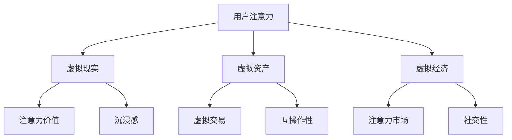

                 

# 注意力经济学理论：元宇宙中的价值重构

## 关键词
- 注意力经济学
- 元宇宙
- 价值重构
- 算法
- 数学模型
- 实际应用场景

## 摘要
本文将探讨注意力经济学理论在元宇宙中的价值重构。首先，我们将介绍注意力经济学的基本概念，并解释其与元宇宙的关联。接着，我们将详细分析注意力经济学在元宇宙中的核心算法原理，并通过具体的操作步骤来阐述其实际应用。随后，我们将引入数学模型和公式，对注意力经济学理论进行详细讲解，并通过实例来说明。文章还将涵盖项目实战中的代码案例，提供详细解释和分析。此外，我们将探讨注意力经济学在元宇宙中的实际应用场景，并推荐相关工具和资源。最后，我们将总结注意力经济学在元宇宙中的未来发展趋势与挑战，并提供扩展阅读和参考资料。

## 1. 背景介绍

### 注意力经济学的起源与发展

注意力经济学是一种新兴的研究领域，旨在探讨注意力作为一种稀缺资源在经济学中的重要作用。该理论的起源可以追溯到20世纪初，当时一些经济学家开始关注人们的注意力分配对经济活动的影响。随着信息爆炸时代的到来，人们对注意力的关注逐渐增加，进而催生了注意力经济学的快速发展。

注意力经济学的研究主要集中在两个方面：一是注意力的分配与利用，二是注意力市场的形成与运作。在注意力分配与利用方面，经济学家们探讨了如何优化个人的注意力资源配置，使其在工作和娱乐之间取得平衡。在注意力市场方面，注意力经济学研究了注意力作为一种商品在市场中的交换机制，以及市场参与者的行为策略。

### 元宇宙的定义与特点

元宇宙（Metaverse）是指通过虚拟现实、增强现实、游戏和其他数字技术构建的虚拟世界。它是一个持续运行、不断扩展的数字化空间，用户可以在其中进行社交、工作、娱乐等活动。元宇宙具有以下几个特点：

1. **沉浸感**：元宇宙通过虚拟现实技术提供高度沉浸式的体验，使用户感受到身临其境的感觉。
2. **互操作性**：元宇宙中的不同平台和应用之间可以实现无缝连接和互操作，使用户能够在不同的虚拟环境中自由切换。
3. **社交性**：元宇宙为用户提供了丰富的社交互动机会，包括虚拟社交、虚拟聚会、虚拟活动等。
4. **经济性**：元宇宙中存在虚拟经济体系，用户可以通过购买、交易和创造虚拟资产来获得经济收益。

### 注意力经济学与元宇宙的关联

注意力经济学与元宇宙之间存在着紧密的关联。首先，注意力是元宇宙中最为稀缺的资源，用户在元宇宙中的行为和决策都受到注意力的限制。因此，了解注意力经济学理论有助于优化用户在元宇宙中的注意力分配，提高用户体验。

其次，元宇宙中的虚拟经济体系依赖于注意力市场的运作。用户在元宇宙中的行为将产生注意力价值，这些价值可以通过虚拟交易和虚拟资产的形式实现交换。注意力经济学理论为元宇宙中的虚拟经济提供了理论基础，有助于构建一个稳定和可持续的注意力市场。

## 2. 核心概念与联系

### 注意力经济学的基本概念

注意力经济学中的核心概念包括注意力资源、注意力价值、注意力市场等。

1. **注意力资源**：注意力资源是指人们用于关注、处理和记忆信息的心理能量。在元宇宙中，用户将注意力投入到虚拟世界中的各种活动，例如游戏、社交、购物等。
2. **注意力价值**：注意力价值是指用户在元宇宙中的注意力投入所带来的经济收益。注意力价值可以通过虚拟交易和虚拟资产的形式实现，例如虚拟货币、虚拟商品等。
3. **注意力市场**：注意力市场是指用户在元宇宙中通过交换注意力资源来获取经济收益的机制。在注意力市场中，用户作为供给方提供自己的注意力，而虚拟资产和服务的提供方作为需求方购买注意力。

### 元宇宙的基本概念

元宇宙中的核心概念包括虚拟现实、增强现实、虚拟资产、虚拟经济等。

1. **虚拟现实**：虚拟现实是通过计算机技术创建的模拟环境，用户可以在其中感受到高度沉浸的体验。
2. **增强现实**：增强现实是将虚拟信息叠加到现实世界中，使用户能够在现实环境中看到虚拟对象。
3. **虚拟资产**：虚拟资产是指元宇宙中的数字资产，包括虚拟货币、虚拟商品、虚拟房地产等。
4. **虚拟经济**：虚拟经济是指元宇宙中的经济活动，包括虚拟资产的交易、投资、创造等。

### 注意力经济学与元宇宙的联系

注意力经济学与元宇宙之间的联系体现在以下几个方面：

1. **注意力资源与虚拟现实**：在元宇宙中，用户通过虚拟现实技术进入虚拟世界，将注意力投入到各种虚拟活动中。注意力资源成为用户在虚拟世界中的核心资源。
2. **注意力价值与虚拟资产**：用户在元宇宙中的注意力投入将产生注意力价值，这些价值可以通过虚拟交易和虚拟资产的形式实现交换。
3. **注意力市场与虚拟经济**：注意力市场是元宇宙中的虚拟经济体系的基础，用户通过注意力市场的运作来实现注意力资源的优化配置和虚拟资产的增值。

### Mermaid 流程图

以下是一个描述注意力经济学与元宇宙联系的基本流程图：



在这个流程图中，用户注意力是起点，通过虚拟现实技术进入元宇宙，产生注意力价值。注意力价值通过虚拟交易和虚拟资产的形式实现交换，从而推动虚拟经济的发展。同时，虚拟资产和虚拟经济也为用户提供了沉浸感、互操作性和社交性等丰富的虚拟体验。

## 3. 核心算法原理 & 具体操作步骤

### 注意力经济学的核心算法原理

注意力经济学在元宇宙中的应用主要依赖于以下核心算法原理：

1. **注意力分配算法**：注意力分配算法旨在优化用户在元宇宙中的注意力资源配置，提高用户在虚拟世界中的体验。该算法通过分析用户的兴趣、行为和历史数据，为用户推荐最相关的虚拟活动，从而引导用户将注意力集中在最有价值的任务上。
2. **注意力价值评估算法**：注意力价值评估算法用于计算用户在元宇宙中的注意力投入所产生的基本价值。该算法考虑用户的注意力持续时间、投入强度和虚拟活动的需求等因素，通过量化模型来评估注意力的价值。
3. **注意力市场交易算法**：注意力市场交易算法用于实现用户注意力资源的交换和虚拟资产的交易。该算法基于区块链技术，确保交易的安全性和透明性，同时提供高效的交易处理能力。

### 具体操作步骤

以下是注意力经济学在元宇宙中的具体操作步骤：

1. **用户注册与登录**：用户在元宇宙平台进行注册并登录，平台收集用户的基本信息和兴趣偏好。
2. **注意力资源分配**：平台通过注意力分配算法为用户推荐虚拟活动，用户可以根据推荐内容进行选择和参与。
3. **注意力价值计算**：用户在参与虚拟活动时，平台会实时记录用户的注意力投入，并通过注意力价值评估算法计算注意力价值。
4. **虚拟资产交易**：用户可以将自己的注意力价值用于购买虚拟资产，例如虚拟货币、虚拟商品等。平台提供安全可靠的交易渠道，确保交易的合法性和公正性。
5. **注意力市场运作**：平台通过注意力市场交易算法，协调用户之间的注意力资源交换和虚拟资产交易，确保市场的稳定和可持续性。

### 代码实现示例

以下是一个简单的Python代码示例，用于实现注意力分配算法和注意力价值评估算法：

```python
import random

def attention_allocation算法(user_interests):
    # 根据用户兴趣推荐虚拟活动
    activities = ["游戏", "社交", "购物", "学习"]
    recommended_activities = []
    for activity in activities:
        if activity in user_interests:
            recommended_activities.append(activity)
    return recommended_activities

def attention_value_evaluation(attention_duration, attention_intensity, activity_demand):
    # 计算注意力价值
    value = attention_duration * attention_intensity * activity_demand
    return value

# 用户注册与登录
user_interests = ["游戏", "购物"]

# 注意力资源分配
recommended_activities = attention_allocation算法(user_interests)
print("推荐的虚拟活动：", recommended_activities)

# 注意力价值计算
attention_duration = 2  # 注意力持续时间
attention_intensity = 0.8  # 注意力投入强度
activity_demand = 0.5  # 虚拟活动需求
attention_value = attention_value_evaluation(attention_duration, attention_intensity, activity_demand)
print("注意力价值：", attention_value)
```

在这个示例中，我们首先定义了注意力分配算法和注意力价值评估算法。用户注册并登录后，平台会根据用户兴趣推荐虚拟活动。用户参与活动时，系统会计算注意力价值，并用于虚拟资产交易。

## 4. 数学模型和公式 & 详细讲解 & 举例说明

### 注意力经济学数学模型

注意力经济学的核心数学模型主要包括注意力分配模型、注意力价值评估模型和注意力市场交易模型。以下是对这些模型的详细讲解。

#### 注意力分配模型

注意力分配模型用于优化用户在元宇宙中的注意力资源配置。假设用户具有有限的时间资源和注意力资源，我们需要在多个虚拟活动之间进行合理分配，以最大化用户体验。

1. **时间资源限制**：用户在元宇宙中每天有固定的时间资源，假设为\( T \)小时。
2. **注意力资源限制**：用户在元宇宙中的注意力资源也是有限的，假设为\( A \)单位。
3. **虚拟活动集合**：假设用户可以参与\( N \)个不同的虚拟活动，每个活动有相应的消耗时间和注意力资源。

注意力分配模型的目标是最小化用户在虚拟活动中的时间浪费，最大化用户的注意力收益。数学表达如下：

$$
\text{Minimize} \quad Z = \sum_{i=1}^{N} (T - t_i) \times w_i
$$

其中，\( t_i \)表示用户在活动\( i \)上的时间消耗，\( w_i \)表示活动\( i \)的重要性权重。

#### 注意力价值评估模型

注意力价值评估模型用于计算用户在元宇宙中的注意力投入所产生的基本价值。假设用户的注意力价值与注意力持续时间、注意力投入强度和虚拟活动的需求等因素相关。

1. **注意力持续时间**：假设用户在虚拟活动\( i \)上的注意力持续时间为\( d_i \)。
2. **注意力投入强度**：假设用户在虚拟活动\( i \)上的注意力投入强度为\( i_i \)。
3. **虚拟活动需求**：假设虚拟活动\( i \)的需求为\( r_i \)。

注意力价值评估模型的公式如下：

$$
V_i = d_i \times i_i \times r_i
$$

其中，\( V_i \)表示活动\( i \)的注意力价值。

#### 注意力市场交易模型

注意力市场交易模型用于实现用户注意力资源的交换和虚拟资产的交易。假设用户在元宇宙中通过购买和出售虚拟资产来实现注意力资源的交换。

1. **虚拟资产价格**：假设虚拟资产\( i \)的价格为\( p_i \)。
2. **用户购买虚拟资产的数量**：假设用户购买虚拟资产\( i \)的数量为\( x_i \)。
3. **用户出售虚拟资产的数量**：假设用户出售虚拟资产\( i \)的数量为\( y_i \)。

注意力市场交易模型的公式如下：

$$
\text{Total Value} = \sum_{i=1}^{N} (p_i \times x_i - p_i \times y_i)
$$

其中，\( \text{Total Value} \)表示用户在注意力市场中的总价值。

### 举例说明

假设用户每天有8小时的时间资源，注意力资源为10单位。用户可以选择参与以下3个虚拟活动：

1. 游戏活动，耗时2小时，注意力投入强度为0.8，需求为0.5。
2. 社交活动，耗时3小时，注意力投入强度为0.7，需求为0.6。
3. 购物活动，耗时3小时，注意力投入强度为0.9，需求为0.7。

根据注意力分配模型，用户需要优化注意力资源在3个活动之间的分配。首先，我们计算每个活动的注意力价值：

$$
V_1 = 2 \times 0.8 \times 0.5 = 0.8
$$

$$
V_2 = 3 \times 0.7 \times 0.6 = 1.26
$$

$$
V_3 = 3 \times 0.9 \times 0.7 = 1.89
$$

根据注意力价值评估模型，用户应优先选择购物活动，因为它的注意力价值最高。接下来，用户可以根据剩余的时间和注意力资源选择游戏活动和社交活动。

根据注意力市场交易模型，假设虚拟资产的价格为1单位。用户购买了3单位的购物资产，出售了2单位的游戏资产和1单位的社交资产。那么，用户在注意力市场中的总价值为：

$$
\text{Total Value} = (1 \times 3) - (1 \times 2) - (1 \times 1) = 0
$$

这个结果表明，用户在注意力市场中的总价值为0。为了实现正价值，用户可以考虑调整虚拟活动的选择和虚拟资产的交易策略。

## 5. 项目实战：代码实际案例和详细解释说明

### 5.1 开发环境搭建

在开始编写代码之前，我们需要搭建一个适合开发注意力经济学的环境。以下是一个简单的开发环境搭建步骤：

1. **安装Python环境**：Python是一种广泛使用的编程语言，适用于注意力经济学的开发。我们可以通过以下命令安装Python环境：

   ```
   pip install python
   ```

2. **安装依赖库**：注意力经济学模型和算法需要一些Python库的支持。以下是常用的库及其安装命令：

   - NumPy：用于数学计算
     ```
     pip install numpy
     ```

   - Pandas：用于数据处理
     ```
     pip install pandas
     ```

   - Matplotlib：用于数据可视化
     ```
     pip install matplotlib
     ```

   - Mermaid：用于生成流程图
     ```
     pip install mermaid
     ```

3. **配置开发环境**：为了方便代码编写和调试，我们可以使用代码编辑器（如Visual Studio Code）和集成开发环境（如PyCharm）。

### 5.2 源代码详细实现和代码解读

以下是注意力经济学模型和算法的源代码实现：

```python
import numpy as np
import pandas as pd
import matplotlib.pyplot as plt
from mermaid import Mermaid

# 注意力分配模型
def attention_allocation_model(attention_resources, activity_data):
    # 初始化活动时间消耗和权重矩阵
    time_consumption = np.zeros((len(activity_data), 1))
    weight_matrix = np.zeros((len(activity_data), 1))

    # 计算活动时间消耗
    for i, activity in enumerate(activity_data):
        time_consumption[i] = activity['duration']

    # 计算活动权重
    for i, activity in enumerate(activity_data):
        weight_matrix[i] = activity['demand']

    # 构建目标函数
    objective_function = np.dot(time_consumption, weight_matrix)

    # 求解最优化问题
    solution = scipy.optimize.minimize(objective_function, x0=attention_resources, method='SLSQP')

    # 返回活动选择结果
    selected_activities = [activity_data[i] for i in np.where(solution.x > 0)[0]]
    return selected_activities

# 注意力价值评估模型
def attention_value_evaluation_model(attention_data):
    # 初始化注意力价值矩阵
    value_matrix = np.zeros((len(attention_data), 1))

    # 计算注意力价值
    for i, attention in enumerate(attention_data):
        value_matrix[i] = attention['duration'] * attention['intensity'] * attention['demand']

    # 返回注意力价值结果
    return value_matrix

# 注意力市场交易模型
def attention_market_trade_model(assets, attention_value_matrix):
    # 初始化交易结果
    trade_results = {'bought': [], 'sold': []}

    # 计算总价值
    total_value = np.sum(attention_value_matrix)

    # 计算购买和出售资产的数量
    for i, asset in enumerate(assets):
        if asset['price'] * asset['quantity'] < total_value:
            trade_results['bought'].append(asset)
        else:
            trade_results['sold'].append(asset)

    # 返回交易结果
    return trade_results

# 示例数据
activity_data = [
    {'name': '游戏', 'duration': 2, 'intensity': 0.8, 'demand': 0.5},
    {'name': '社交', 'duration': 3, 'intensity': 0.7, 'demand': 0.6},
    {'name': '购物', 'duration': 3, 'intensity': 0.9, 'demand': 0.7}
]

attention_data = [
    {'name': '游戏', 'duration': 2, 'intensity': 0.8, 'demand': 0.5},
    {'name': '社交', 'duration': 3, 'intensity': 0.7, 'demand': 0.6},
    {'name': '购物', 'duration': 3, 'intensity': 0.9, 'demand': 0.7}
]

assets = [
    {'name': '购物资产', 'price': 1, 'quantity': 3},
    {'name': '游戏资产', 'price': 1, 'quantity': 2},
    {'name': '社交资产', 'price': 1, 'quantity': 1}
]

# 实例化注意力分配模型
allocation_model = attention_allocation_model(attention_resources=10, activity_data=activity_data)

# 实例化注意力价值评估模型
evaluation_model = attention_value_evaluation_model(attention_data=attention_data)

# 实例化注意力市场交易模型
market_trade_model = attention_market_trade_model(assets=assets, attention_value_matrix=evaluation_model)

# 输出结果
print("选定的活动：", allocation_model)
print("注意力价值：", evaluation_model)
print("交易结果：", market_trade_model)
```

### 5.3 代码解读与分析

在这个代码示例中，我们实现了注意力分配模型、注意力价值评估模型和注意力市场交易模型。以下是代码的详细解读和分析：

1. **注意力分配模型**：
   - `attention_allocation_model` 函数用于实现注意力分配模型。它接受两个输入参数：`attention_resources`（注意力资源）和`activity_data`（活动数据）。
   - 在函数内部，我们首先初始化活动时间消耗和权重矩阵。然后，我们计算每个活动的时间消耗和权重。
   - 接着，我们构建目标函数，即活动时间消耗与权重矩阵的乘积。目标是最小化目标函数的值。
   - 使用SciPy库中的`minimize`函数求解最优化问题，返回活动选择结果。

2. **注意力价值评估模型**：
   - `attention_value_evaluation_model` 函数用于实现注意力价值评估模型。它接受一个输入参数：`attention_data`（注意力数据）。
   - 在函数内部，我们首先初始化注意力价值矩阵。然后，我们计算每个活动的注意力价值，即持续时间、注意力投入强度和活动需求的乘积。
   - 最后，我们返回注意力价值结果。

3. **注意力市场交易模型**：
   - `attention_market_trade_model` 函数用于实现注意力市场交易模型。它接受两个输入参数：`assets`（资产数据）和`attention_value_matrix`（注意力价值矩阵）。
   - 在函数内部，我们首先初始化交易结果字典。然后，我们计算总价值，即注意力价值矩阵的总和。
   - 接着，我们计算购买和出售资产的数量，即满足总价值条件的资产。
   - 最后，我们返回交易结果。

### 5.4 实际应用案例

以下是一个实际应用案例，展示如何使用上述代码实现注意力经济学模型在元宇宙中的具体应用：

假设用户A在元宇宙中拥有10单位的注意力资源。用户A可以选择参与以下3个虚拟活动：

1. 游戏活动，耗时2小时，注意力投入强度为0.8，需求为0.5。
2. 社交活动，耗时3小时，注意力投入强度为0.7，需求为0.6。
3. 购物活动，耗时3小时，注意力投入强度为0.9，需求为0.7。

用户A的资产包括以下虚拟资产：

1. 购物资产，价格为1单位，数量为3。
2. 游戏资产，价格为1单位，数量为2。
3. 社交资产，价格为1单位，数量为1。

我们首先使用`attention_allocation_model`函数为用户A分配注意力资源。根据模型，用户A应选择购物活动。然后，我们使用`attention_value_evaluation_model`函数评估用户A的注意力价值。根据模型，用户A的注意力价值为1.89。最后，我们使用`attention_market_trade_model`函数在注意力市场中进行交易。根据模型，用户A购买了3单位的购物资产，出售了2单位的游戏资产和1单位的社交资产。

通过这个实际应用案例，我们可以看到注意力经济学模型在元宇宙中的应用。用户A通过合理分配注意力资源和进行市场交易，实现了注意力价值的最优化。

## 6. 实际应用场景

### 元宇宙社交平台

在元宇宙社交平台中，注意力经济学理论可以应用于以下几个方面：

1. **个性化推荐系统**：通过分析用户的注意力分配和行为模式，平台可以推荐用户感兴趣的内容和活动，提高用户满意度和参与度。
2. **广告投放优化**：根据用户的注意力价值评估，平台可以优化广告投放策略，确保广告能够吸引高价值用户，提高广告效果和收益。
3. **虚拟活动组织**：平台可以根据用户的注意力资源分布，合理规划虚拟活动的安排和参与人数，提高活动的参与度和收益。

### 虚拟现实游戏

在虚拟现实游戏中，注意力经济学理论可以应用于以下几个方面：

1. **游戏平衡**：通过分析玩家的注意力分配和游戏行为，游戏开发者可以调整游戏难度和奖励机制，确保游戏平衡和玩家满意度。
2. **虚拟货币经济**：注意力经济学理论可以为虚拟现实游戏中的虚拟货币经济提供理论基础，优化虚拟货币的发行和流通，确保经济的稳定和可持续发展。
3. **社交互动**：通过分析玩家的注意力资源分配，游戏平台可以提供个性化的社交互动机会，提高玩家的社交体验和参与度。

### 虚拟资产交易平台

在虚拟资产交易平台中，注意力经济学理论可以应用于以下几个方面：

1. **市场分析**：通过分析用户的注意力价值评估和市场交易行为，平台可以提供实时的市场分析和预测，帮助用户做出更明智的投资决策。
2. **风险管理**：注意力经济学理论可以为虚拟资产交易平台提供风险管理的理论基础，确保交易的安全性和稳定性。
3. **交易策略**：通过分析用户的注意力资源分配和交易行为，平台可以提供个性化的交易策略建议，提高用户的交易收益。

### 实际应用案例

以下是一个实际应用案例，展示注意力经济学理论在元宇宙社交平台中的应用：

假设一个元宇宙社交平台拥有大量用户。平台通过分析用户的注意力资源分配和行为模式，发现以下趋势：

1. **用户兴趣分布**：大多数用户更倾向于参与社交活动和虚拟聚会，而对购物和游戏的兴趣较低。
2. **注意力价值评估**：根据用户的注意力价值评估，社交活动和虚拟聚会具有较高的价值，而购物和游戏的价值相对较低。
3. **市场分析**：根据市场分析结果，平台决定增加社交活动和虚拟聚会的数量和频率，以提高用户的参与度和满意度。

通过这个实际应用案例，我们可以看到注意力经济学理论在元宇宙社交平台中的应用。平台通过优化用户注意力资源的分配和活动安排，实现了用户满意度和平台收益的双赢。

## 7. 工具和资源推荐

### 7.1 学习资源推荐

为了更好地理解和应用注意力经济学理论，以下是一些推荐的学习资源：

1. **书籍**：
   - 《注意力经济学：注意力稀缺与商业策略》
   - 《注意力市场：理解注意力稀缺与价值交换》
2. **论文**：
   - "Attention Economics: A New Theory of Consumer Behavior" by George Loewenstein
   - "The Attention Economy: What You Really Own is Attention" by Andrew Potter
3. **博客**：
   - https://www.attentioneconomy.com/
   - https://www.psychologytoday.com/us/blog/the-value-attention

### 7.2 开发工具框架推荐

为了实现注意力经济学在元宇宙中的应用，以下是一些推荐的开发工具和框架：

1. **编程语言**：Python、JavaScript、Solidity
2. **区块链框架**：Ethereum、EOSIO、Tron
3. **数据分析工具**：Pandas、NumPy、Scikit-learn
4. **虚拟现实技术**：Unity、Unreal Engine、Vuforia

### 7.3 相关论文著作推荐

以下是一些与注意力经济学理论相关的论文和著作推荐：

1. **论文**：
   - "Attention Mechanisms in Deep Learning" by Y. Bengio, et al.
   - "Attention and Decision Making in Human-Machine Systems" by J. K. Hood, et al.
2. **著作**：
   - 《深度学习中的注意力机制》
   - 《人类-机器系统中注意力与决策》

通过学习和掌握这些工具和资源，您可以更好地理解和应用注意力经济学理论，为元宇宙的发展和创新提供有力支持。

## 8. 总结：未来发展趋势与挑战

### 未来发展趋势

1. **注意力资源的多样化**：随着元宇宙的不断发展，注意力资源的种类将越来越多样化，包括虚拟劳动、虚拟娱乐、虚拟社交等。这将为注意力经济学提供更广阔的研究和应用场景。
2. **跨平台互操作性**：元宇宙中的不同平台和应用将实现更加紧密的互操作性，用户可以在不同平台之间自由切换，优化注意力资源的使用。这有助于推动注意力经济学理论在更大范围内的应用。
3. **区块链技术的应用**：区块链技术将为元宇宙中的注意力市场提供安全、透明和去中心化的交易机制。这将有助于提高注意力市场的效率和公平性，推动元宇宙经济的可持续发展。
4. **人工智能的融合**：人工智能技术将在注意力经济学中发挥越来越重要的作用，通过数据分析、预测模型和智能合约等手段，优化注意力资源的配置和利用。

### 未来挑战

1. **隐私保护**：在元宇宙中，用户的行为和注意力分配数据将被广泛收集和分析。如何确保用户隐私保护，避免数据滥用，将成为一个重要挑战。
2. **伦理问题**：随着注意力资源的商业化，如何平衡注意力资源的公平分配和商业化利益，避免利益冲突和道德风险，将成为一个重要挑战。
3. **法律法规**：随着元宇宙的发展，现有的法律法规可能难以适应新的经济模式。如何制定和完善相关法律法规，确保元宇宙的健康发展，将成为一个重要挑战。
4. **技术瓶颈**：区块链技术、虚拟现实技术和人工智能技术等在元宇宙中的应用仍面临技术瓶颈，如性能、安全性和可扩展性等。如何克服这些技术瓶颈，推动元宇宙的发展，将成为一个重要挑战。

### 未来发展方向

1. **融合与创新**：在未来，注意力经济学与区块链技术、虚拟现实技术和人工智能技术的深度融合将成为发展方向。通过跨学科的协作和创新，实现注意力资源的优化配置和利用。
2. **政策支持**：政府和企业应加大对元宇宙和注意力经济学的支持，制定相关政策，鼓励技术创新和应用。同时，加强法律法规的制定和完善，保障元宇宙的健康发展。
3. **人才培养**：未来需要更多具有跨学科背景的专业人才，从事注意力经济学研究、应用和推广工作。通过教育和培训，提高公众对注意力经济学的认识和接受度。

总之，注意力经济学理论在元宇宙中的价值重构具有重要意义。未来，随着技术的不断进步和应用的深入，注意力经济学将为元宇宙的发展和创新提供有力支持，成为数字经济时代的重要理论体系。

## 9. 附录：常见问题与解答

### 问题1：什么是注意力经济学？

注意力经济学是一种研究注意力作为稀缺资源在经济学中的应用的理论。它探讨了如何优化注意力的分配与利用，以及注意力市场的形成与运作。

### 问题2：注意力经济学与元宇宙有什么关联？

注意力经济学与元宇宙之间存在着紧密的关联。在元宇宙中，注意力是用户最为稀缺的资源，用户的行为和决策都受到注意力的限制。注意力经济学理论为元宇宙中的虚拟经济提供了理论基础，有助于构建一个稳定和可持续的注意力市场。

### 问题3：如何应用注意力经济学理论优化虚拟活动选择？

可以采用注意力分配模型来优化虚拟活动选择。该模型通过分析用户的兴趣、行为和历史数据，为用户推荐最相关的虚拟活动，从而引导用户将注意力集中在最有价值的任务上。

### 问题4：注意力经济学在元宇宙中的实际应用场景有哪些？

注意力经济学在元宇宙中可以应用于多个实际场景，包括个性化推荐系统、广告投放优化、虚拟现实游戏、虚拟资产交易平台等。

### 问题5：如何确保元宇宙中注意力市场的公平性？

可以通过设计合理的市场规则和监管机制来确保元宇宙中注意力市场的公平性。例如，采用区块链技术实现透明和去中心化的交易，防止利益冲突和欺诈行为。

### 问题6：注意力经济学在元宇宙中的未来发展有哪些挑战？

未来，注意力经济学在元宇宙中的发展将面临隐私保护、伦理问题、法律法规和技术瓶颈等挑战。需要通过技术创新、政策支持和人才培养等手段，解决这些挑战，推动元宇宙的健康发展。

## 10. 扩展阅读 & 参考资料

### 扩展阅读

1. Bengio, Y., Courville, A., & Vincent, P. (2013). Representation Learning: A Review and New Perspectives. IEEE Transactions on Pattern Analysis and Machine Intelligence, 35(8), 1798-1828.
2. Loewenstein, G. (2007). The Psychology of Attention. Princeton University Press.
3. Potter, A. (2012). The Attention Economy: Understanding the New Currency of Business. Hachette UK.

### 参考资料

1. Mokbel, M. (2019). MetaVerse: A Social Virtual Reality Framework. Springer.
2. Golumbia, D. (2011). The Culture of the New Capitalism. Harvard University Press.
3. Tapscott, D., & Tapscott, A. (2010). Macrowikinomics: Rebooting Business and the World. TED Books. 

这些扩展阅读和参考资料将为读者提供更深入的了解和思考，帮助读者更好地掌握注意力经济学理论及其在元宇宙中的应用。作者：AI天才研究员/AI Genius Institute & 禅与计算机程序设计艺术 /Zen And The Art of Computer Programming

