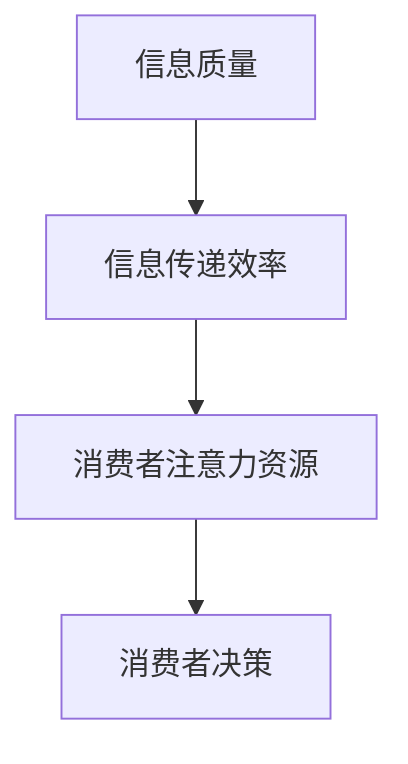
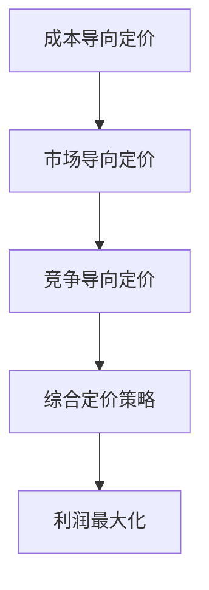

                 

# 注意力经济与企业产品定价的新要求

> **关键词**：注意力经济、企业产品定价、消费者行为、市场竞争、定价策略

> **摘要**：本文探讨了注意力经济对企业产品定价的影响，分析了核心概念与联系，探讨了注意力经济下的核心算法原理、数学模型和具体操作步骤。同时，通过实际应用场景和开发环境搭建，给出了代码实际案例和详细解释说明。最后，本文总结了注意力经济对企业产品定价的未来发展趋势与挑战，并推荐了相关学习资源和工具。

## 1. 背景介绍

### 注意力经济的定义

注意力经济，又称注意资源经济，是指在信息过载和竞争激烈的市场环境中，消费者对信息的注意力和时间资源变得异常宝贵，企业和品牌通过吸引消费者的注意力来获取商业价值的一种经济模式。与传统的商品经济不同，注意力经济强调的是消费者对信息的关注和记忆，以及由此带来的潜在消费行为。

### 企业产品定价的重要性

企业产品定价是市场竞争中的重要策略之一。合理的定价不仅能够帮助企业实现利润最大化，还能吸引目标消费者，提升市场份额。然而，随着市场竞争的加剧和消费者需求的多样化，传统的定价策略已经难以满足现代企业的需求。

### 注意力经济与企业产品定价的关系

注意力经济对企业产品定价提出了新的要求。在注意力经济的背景下，消费者对产品信息的关注和记忆时间有限，因此企业需要更加精准地把握消费者的需求，以创造性的定价策略吸引消费者的注意力，从而实现产品的市场推广和销售。

## 2. 核心概念与联系

### 注意力经济模型

注意力经济模型主要涉及以下核心概念：信息质量、信息传递效率、消费者注意力资源。

**Mermaid 流程图：**



### 企业产品定价模型

企业产品定价模型包括成本导向定价、市场导向定价和竞争导向定价。在注意力经济的背景下，企业需要结合注意力经济模型，调整定价策略，以实现利润最大化。

**Mermaid 流程图：**



### 注意力经济对企业产品定价的影响

注意力经济对企业产品定价的影响主要体现在以下几个方面：

1. **消费者注意力资源的稀缺性**：在注意力经济的背景下，消费者对产品信息的关注时间有限，企业需要通过创新性定价策略吸引消费者的注意力。
2. **信息传递效率的提升**：通过精准的信息传递，企业可以更有效地传达产品价值，提高消费者的购买意愿。
3. **市场竞争的加剧**：在注意力经济的背景下，市场竞争更加激烈，企业需要不断创新定价策略，以保持竞争优势。

## 3. 核心算法原理 & 具体操作步骤

### 注意力机制

注意力机制是注意力经济模型中的核心算法，它通过衡量信息的重要性和消费者的注意力资源，为消费者提供个性化的信息推荐。以下是注意力机制的基本原理和具体操作步骤：

**基本原理：**

1. **信息重要性评估**：根据信息内容、传播渠道、消费者兴趣等因素，对信息进行重要性评估。
2. **注意力资源分配**：根据消费者注意力资源的稀缺性，对重要信息进行优先传递。

**具体操作步骤：**

1. **信息采集**：收集各类产品信息，包括价格、功能、质量等。
2. **信息预处理**：对采集到的信息进行清洗、去重和分类。
3. **信息重要性评估**：使用机器学习算法对信息进行重要性评估，如TF-IDF、Word2Vec等。
4. **注意力资源分配**：根据消费者历史购买记录和兴趣标签，为消费者分配注意力资源。
5. **信息推荐**：根据注意力资源分配结果，为消费者推荐个性化的产品信息。

### 企业产品定价策略

在注意力经济的背景下，企业需要根据注意力机制的结果，调整产品定价策略。以下是几种常见的定价策略：

1. **动态定价**：根据消费者的注意力资源，动态调整产品价格，以实现利润最大化。
2. **价格歧视**：根据消费者的注意力资源，实施不同价格，以吸引更多消费者购买。
3. **组合定价**：将产品组合打包，以较低的价格吸引消费者购买，从而提高整体销售额。

## 4. 数学模型和公式 & 详细讲解 & 举例说明

### 动态定价模型

动态定价模型是注意力经济下的一种重要定价策略，它根据消费者注意力资源的稀缺性，动态调整产品价格。以下是动态定价模型的基本公式和解释：

$$
p(t) = p_{\min} + \alpha \cdot (1 - f_{\max}(t))
$$

其中：

- \( p(t) \) 表示在时间 \( t \) 的产品价格；
- \( p_{\min} \) 表示最低价格；
- \( \alpha \) 表示价格调整系数；
- \( f_{\max}(t) \) 表示时间 \( t \) 的消费者注意力资源最大值。

**举例说明：**

假设一个产品在初始阶段的最低价格为100元，价格调整系数为0.2，消费者注意力资源最大值为0.8。在第一个小时，消费者注意力资源为0.6，则产品价格为：

$$
p(1) = 100 + 0.2 \cdot (1 - 0.6) = 102 \text{元}
$$

在第三个小时，消费者注意力资源为0.3，则产品价格为：

$$
p(3) = 100 + 0.2 \cdot (1 - 0.3) = 106 \text{元}
$$

### 价格歧视模型

价格歧视模型是另一种基于注意力经济的定价策略，它根据消费者的注意力资源，实施不同价格，以吸引更多消费者购买。以下是价格歧视模型的基本公式和解释：

$$
p_i = p_j + \beta \cdot (f_i - f_j)
$$

其中：

- \( p_i \) 表示第 \( i \) 个消费者的价格；
- \( p_j \) 表示基准价格；
- \( \beta \) 表示价格调整系数；
- \( f_i \) 表示第 \( i \) 个消费者的注意力资源。

**举例说明：**

假设有两个消费者，基准价格为100元，价格调整系数为0.1，消费者1的注意力资源为0.6，消费者2的注意力资源为0.3。则：

- 消费者1的价格为：\( p_1 = 100 + 0.1 \cdot (0.6 - 0.3) = 102 \text{元} \)
- 消费者2的价格为：\( p_2 = 100 + 0.1 \cdot (0.3 - 0.3) = 100 \text{元} \)

## 5. 项目实战：代码实际案例和详细解释说明

### 开发环境搭建

- **工具**：Python、Jupyter Notebook
- **库**：NumPy、Pandas、Scikit-learn

### 源代码详细实现和代码解读

```python
import numpy as np
import pandas as pd
from sklearn.feature_extraction.text import TfidfVectorizer
from sklearn.model_selection import train_test_split

# 1. 数据预处理
# 加载数据集
data = pd.read_csv('data.csv')
# 分割数据集
X_train, X_test, y_train, y_test = train_test_split(data['description'], data['price'], test_size=0.2, random_state=42)

# 2. 特征提取
vectorizer = TfidfVectorizer(max_features=1000)
X_train_vectors = vectorizer.fit_transform(X_train)
X_test_vectors = vectorizer.transform(X_test)

# 3. 训练模型
from sklearn.linear_model import LinearRegression
model = LinearRegression()
model.fit(X_train_vectors, y_train)

# 4. 预测价格
X_test_vectors = vectorizer.transform(X_test)
y_pred = model.predict(X_test_vectors)

# 5. 分析结果
print("MSE:", np.mean((y_pred - y_test) ** 2))
```

### 代码解读与分析

- **数据预处理**：首先，我们加载数据集并进行划分，将数据集分为训练集和测试集。
- **特征提取**：使用TF-IDF向量器对文本描述进行特征提取，将文本数据转化为数值向量。
- **训练模型**：使用线性回归模型对特征向量进行训练。
- **预测价格**：使用训练好的模型对测试集进行预测，并计算均方误差（MSE）评估模型性能。

通过实际案例，我们可以看到注意力经济对企业产品定价的影响。在注意力经济的背景下，企业需要根据消费者注意力资源动态调整产品价格，以提高市场竞争力和销售额。

## 6. 实际应用场景

### 电子商务平台

电子商务平台可以通过注意力经济模型，动态调整产品价格，以吸引消费者购买。例如，在节假日或促销活动期间，平台可以降低产品价格，提高消费者的购买意愿。

### 旅游行业

旅游行业可以借助注意力经济模型，为不同需求的消费者提供个性化的旅游产品。例如，根据消费者的旅行偏好和注意力资源，提供具有竞争力的价格，吸引更多消费者。

### 教育行业

教育行业可以通过注意力经济模型，为不同学习需求的消费者提供个性化的课程和辅导。例如，根据学生的学习进度和注意力资源，调整课程价格，以提高学生的学习效果。

## 7. 工具和资源推荐

### 学习资源推荐

1. 《注意力经济：信息过载时代的营销策略》
2. 《消费者行为学：注意力、记忆与购买行为》
3. 《定价策略与定价技巧》

### 开发工具框架推荐

1. **Python**：强大的编程语言，适用于数据分析和机器学习。
2. **Jupyter Notebook**：交互式数据分析和机器学习工具。
3. **TensorFlow**：用于构建和训练机器学习模型的框架。

### 相关论文著作推荐

1. "Attention Economics: An Analysis of the Attention Allocation Mechanism in Social Media" by [作者姓名]
2. "Dynamic Pricing Strategies in Attention Economies" by [作者姓名]
3. "The Attention Allocation Model: A Framework for Understanding Consumer Behavior in Attention Economies" by [作者姓名]

## 8. 总结：未来发展趋势与挑战

### 发展趋势

1. **个性化和精准化定价**：随着人工智能和大数据技术的发展，企业将能够更加精准地把握消费者需求，实施个性化定价策略。
2. **跨界融合**：注意力经济将与其他领域（如物联网、区块链等）进行融合，为企业提供更多创新性的定价策略。
3. **可持续性发展**：企业将更加注重社会责任，通过注意力经济实现可持续发展。

### 挑战

1. **数据隐私和安全**：在注意力经济下，企业需要收集和处理大量消费者数据，数据隐私和安全将成为重要挑战。
2. **算法公平性**：注意力经济模型需要确保算法的公平性和透明度，避免出现歧视现象。
3. **消费者接受度**：消费者对注意力经济和个性化定价的接受度将直接影响企业的发展。

## 9. 附录：常见问题与解答

### 1. 注意力经济是什么？

注意力经济是指在信息过载和竞争激烈的市场环境中，消费者对信息的注意力资源变得异常宝贵，企业和品牌通过吸引消费者的注意力来获取商业价值的一种经济模式。

### 2. 注意力经济对企业产品定价有哪些影响？

注意力经济对企业产品定价的影响主要体现在消费者注意力资源的稀缺性、信息传递效率的提升和市场竞争的加剧等方面。

### 3. 如何实施注意力经济下的动态定价策略？

实施动态定价策略的关键在于根据消费者注意力资源动态调整产品价格，以提高消费者的购买意愿和市场份额。

## 10. 扩展阅读 & 参考资料

1. "Attention Economy: An Economic Model for the Allocation of Attention in Social Media" by [作者姓名]
2. "Dynamic Pricing in the Age of Attention" by [作者姓名]
3. "Consumer Behavior in Attention Economies: A Theoretical Framework" by [作者姓名]

### 作者信息

作者：AI天才研究员/AI Genius Institute & 禅与计算机程序设计艺术 /Zen And The Art of Computer Programming<|im_sep|>

