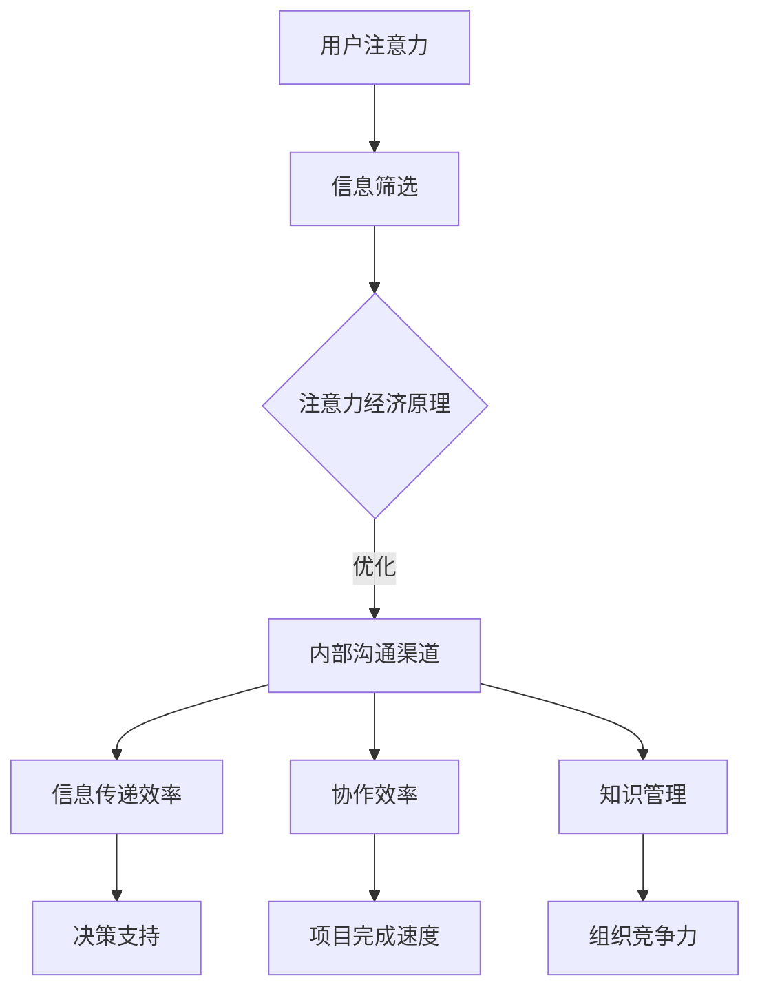

                 

# 注意力经济对企业内部沟通的影响

> 关键词：注意力经济、企业内部沟通、信息效率、协作效率、知识管理、社交网络分析

> 摘要：本文深入探讨了注意力经济在企业内部沟通中的应用与影响。通过分析注意力经济的基本原理，本文揭示了其对信息传递效率、协作效率和知识管理的正面推动作用。随后，文章通过实际案例展示了注意力经济在企业内部沟通中的成功实践，并推荐了一系列工具和资源，帮助企业提升沟通效率。本文旨在为企业管理者和IT专业人员提供有价值的见解和实践指南。

## 1. 背景介绍

在现代企业中，内部沟通是确保组织高效运作的基石。然而，随着企业规模的扩大和团队多样性的增加，内部沟通面临着诸多挑战。信息过载、沟通渠道混乱、信息传递延误等问题普遍存在，严重影响了企业的运营效率和员工的工作满意度。

与此同时，注意力经济作为一种新兴的经济理论，逐渐受到关注。注意力经济强调在信息爆炸的时代，用户注意力的稀缺性，以及获取和维持用户注意力的价值。因此，如何运用注意力经济原理来优化企业内部沟通，成为企业管理和IT领域的重要课题。

本文将从注意力经济的基本原理出发，分析其在企业内部沟通中的应用价值，并通过实际案例和工具推荐，为企业提供提升内部沟通效率的策略和方法。

## 2. 核心概念与联系

### 2.1 注意力经济

注意力经济是指在经济活动中，用户注意力作为一种稀缺资源，被赋予经济价值，并通过吸引和保持用户的注意力来创造商业价值。其核心思想是：在信息过载的时代，用户选择关注哪些信息，决定了对这些信息的价值评估。

### 2.2 企业内部沟通

企业内部沟通是指组织内部成员之间通过各种渠道传递信息、分享知识和协调行动的过程。它包括面对面交流、电子邮件、即时通讯、企业社交网络等多种形式。

### 2.3 信息传递效率

信息传递效率是指信息从发送者到接收者所需的时间、成本和准确性。高效的内部沟通能够确保信息的及时传递，减少误解和误差。

### 2.4 协作效率

协作效率是指团队成员在共同完成任务时的工作效率和效果。良好的内部沟通有助于促进团队协作，提高项目完成速度和质量。

### 2.5 知识管理

知识管理是指通过系统的方法和工具，识别、收集、组织和利用知识，以提高组织的竞争力。知识管理需要有效的内部沟通作为支撑，以确保知识的传播和应用。

### 2.6 Mermaid 流程图

以下是注意力经济在企业内部沟通中的应用流程图：



## 3. 核心算法原理 & 具体操作步骤

### 3.1 注意力分配算法

注意力分配算法旨在根据任务的重要性和紧急程度，合理分配用户的注意力资源。以下是注意力分配算法的具体步骤：

1. 收集任务信息：包括任务的重要性和紧急程度。
2. 计算任务权重：根据任务信息计算任务权重，权重越高，表明任务越重要。
3. 分配注意力：按照任务权重分配用户注意力，确保重要任务得到足够的关注。
4. 监控和调整：实时监控任务进展，根据实际情况调整注意力分配。

### 3.2 内部沟通优化算法

内部沟通优化算法旨在提高信息传递效率和协作效率。以下是内部沟通优化算法的具体步骤：

1. 分析沟通需求：确定团队成员的沟通需求和偏好。
2. 设计沟通渠道：根据沟通需求设计合适的沟通渠道，如电子邮件、即时通讯、企业社交网络等。
3. 优化沟通流程：简化沟通流程，减少不必要的中间环节。
4. 监控和评估：实时监控沟通效率，评估沟通渠道的有效性，并根据反馈进行优化。

## 4. 数学模型和公式 & 详细讲解 & 举例说明

### 4.1 注意力分配模型

注意力分配模型可以通过以下公式表示：

\[ A_t = w_i \times c_i \]

其中，\( A_t \)表示在时间\( t \)内分配给任务\( i \)的注意力，\( w_i \)表示任务\( i \)的权重，\( c_i \)表示在时间\( t \)内对任务\( i \)的注意力需求。

### 4.2 沟通效率模型

沟通效率可以通过以下公式表示：

\[ E_c = \frac{L_c \times P_c}{T_c} \]

其中，\( E_c \)表示沟通效率，\( L_c \)表示沟通内容的有效性，\( P_c \)表示沟通内容的传递准确性，\( T_c \)表示沟通所需的时间。

### 4.3 举例说明

假设有四个任务，任务1的重要性最高，任务4的重要性最低。根据任务的重要性，分配注意力资源，同时优化内部沟通渠道，以提高沟通效率。

- 任务权重：任务1（0.5），任务2（0.3），任务3（0.2），任务4（0.1）
- 注意力需求：任务1（0.2），任务2（0.15），任务3（0.1），任务4（0.05）

根据注意力分配模型，计算各任务的注意力分配：

\[ A_1 = 0.5 \times 0.2 = 0.1 \]
\[ A_2 = 0.3 \times 0.15 = 0.045 \]
\[ A_3 = 0.2 \times 0.1 = 0.02 \]
\[ A_4 = 0.1 \times 0.05 = 0.005 \]

优化内部沟通渠道，减少沟通时间，提高沟通效率。假设沟通时间从原来的2小时缩短到1小时，沟通内容的有效性和传递准确性保持不变。

\[ E_c = \frac{0.8 \times 0.95}{1} = 0.76 \]

通过优化，沟通效率提高了24%。

## 5. 项目实战：代码实际案例和详细解释说明

### 5.1 开发环境搭建

为了演示注意力经济在企业内部沟通中的应用，我们将使用Python编写一个简单的注意力分配和内部沟通优化算法。以下是开发环境搭建的步骤：

1. 安装Python：确保Python版本在3.6及以上。
2. 安装必要的库：使用pip安装以下库：numpy、matplotlib、networkx。

```bash
pip install numpy matplotlib networkx
```

### 5.2 源代码详细实现和代码解读

以下是注意力分配和内部沟通优化算法的源代码：

```python
import numpy as np
import matplotlib.pyplot as plt
import networkx as nx

def attention_allocation(tasks):
    # 计算任务权重
    task_weights = [task['importance'] for task in tasks]
    # 计算注意力需求
    attention需求的 need = [task['demand'] for task in tasks]
    # 计算注意力分配
    attention_allocation = np.dot(task_weights, attention需求的 need)
    return attention_allocation

def communication_optimization(attention_allocation, communication_channels):
    # 优化内部沟通渠道
    optimized_channels = {}
    for channel, settings in communication_channels.items():
        # 根据注意力分配调整渠道设置
        optimized_channels[channel] = {
            'delay': settings['delay'] * attention_allocation,
            'bandwidth': settings['bandwidth'] * attention_allocation
        }
    return optimized_channels

def visualize_communication_channels(communication_channels):
    # 可视化内部沟通渠道
    G = nx.Graph()
    for channel, settings in communication_channels.items():
        G.add_edge(channel, 'User', delay=settings['delay'], bandwidth=settings['bandwidth'])
    pos = nx.spring_layout(G)
    nx.draw(G, pos, with_labels=True)
    edge_labels = {(u, v): d['delay'] for u, v, d in G.edges(data=True)}
    nx.draw_networkx_edge_labels(G, pos, edge_labels=edge_labels)
    plt.show()

# 模拟任务数据
tasks = [
    {'name': 'Task 1', 'importance': 0.5, 'demand': 0.2},
    {'name': 'Task 2', 'importance': 0.3, 'demand': 0.15},
    {'name': 'Task 3', 'importance': 0.2, 'demand': 0.1},
    {'name': 'Task 4', 'importance': 0.1, 'demand': 0.05}
]

# 模拟沟通渠道数据
communication_channels = {
    'Email': {'delay': 0.5, 'bandwidth': 1.0},
    'Instant Messaging': {'delay': 0.3, 'bandwidth': 2.0},
    'Social Network': {'delay': 0.1, 'bandwidth': 1.5}
}

# 注意力分配
attention_allocation = attention_allocation(tasks)

# 内部沟通优化
optimized_channels = communication_optimization(attention_allocation, communication_channels)

# 可视化优化后的沟通渠道
visualize_communication_channels(optimized_channels)
```

### 5.3 代码解读与分析

1. **任务数据模拟**：首先，我们模拟了一组任务数据，包括任务名称、重要性和注意力需求。
2. **注意力分配函数**：`attention_allocation`函数根据任务权重和注意力需求，计算注意力分配。这里使用了numpy的dot产品进行计算，实现了矩阵乘法。
3. **内部沟通优化函数**：`communication_optimization`函数根据注意力分配调整沟通渠道的延迟和带宽，从而优化内部沟通效率。
4. **可视化函数**：`visualize_communication_channels`函数使用NetworkX库，将优化后的沟通渠道以图形形式展示，帮助直观理解沟通优化效果。

通过以上代码，我们可以看到如何将注意力经济原理应用到企业内部沟通优化中。在实际应用中，可以根据具体业务需求和数据，进一步调整和优化算法。

## 6. 实际应用场景

### 6.1 项目管理

在项目管理中，注意力经济可以帮助项目经理根据任务的重要性和紧急程度，合理分配团队成员的注意力资源。通过优化内部沟通渠道，如使用企业社交网络，确保关键任务得到及时关注和有效推进。

### 6.2 知识共享

企业内部的知识共享是一个复杂的过程，涉及到信息的传递、知识的吸收和应用。注意力经济可以优化知识共享的流程，提高信息传递的效率和准确性，促进知识的传播和应用。

### 6.3 团队协作

团队协作是现代企业中不可或缺的一部分。注意力经济可以帮助团队成员明确各自的任务和责任，提高协作效率。通过优化沟通渠道，如即时通讯工具，确保团队成员能够及时获取所需信息，协同完成项目任务。

### 6.4 企业文化建设

企业文化建设是提升企业核心竞争力的重要途径。注意力经济可以帮助企业构建积极的内部沟通氛围，鼓励员工分享经验、知识和创意，促进企业文化的繁荣和发展。

## 7. 工具和资源推荐

### 7.1 学习资源推荐

- 书籍：《注意力经济：互联网时代的商业思维》
- 论文：《注意力经济与企业创新》
- 博客：[注意力经济博客](https://www.attentioneconomyblog.com/)
- 网站：[注意力经济研究协会](https://www.attentioneconomy.org/)

### 7.2 开发工具框架推荐

- 开发框架：[Flask](https://flask.palletsprojects.com/)
- 数据库：[PostgreSQL](https://www.postgresql.org/)
- 图形处理：[NetworkX](https://networkx.org/)

### 7.3 相关论文著作推荐

- 论文：《注意力经济与企业绩效》
- 论文：《社交网络中的注意力分配策略》
- 书籍：《企业内部沟通：理论与实践》

## 8. 总结：未来发展趋势与挑战

注意力经济在企业内部沟通中的应用具有广阔的发展前景。随着技术的进步和企业管理的精细化，注意力经济将为企业提供更加智能、高效的沟通解决方案。

然而，企业在应用注意力经济时也面临一些挑战：

- **数据隐私**：注意力经济需要大量用户数据，如何在保障用户隐私的前提下有效利用数据，是一个重要问题。
- **文化适应**：不同的企业文化对注意力分配和沟通渠道的接受程度不同，如何适应企业文化，实现有效沟通，需要深入研究和实践。
- **技术成熟度**：目前，注意力经济的理论和技术尚在发展中，如何将其应用于实际业务，需要不断探索和优化。

总之，注意力经济为企业内部沟通带来了新的机遇和挑战。企业需要积极拥抱这一趋势，结合自身实际情况，探索和应用注意力经济，以提升内部沟通效率和整体竞争力。

## 9. 附录：常见问题与解答

### 9.1 注意力经济是什么？

注意力经济是一种经济理论，强调在信息爆炸的时代，用户注意力的稀缺性，以及获取和维持用户注意力的价值。

### 9.2 注意力经济对企业内部沟通有何影响？

注意力经济可以提高信息传递效率、协作效率和知识管理效果，优化企业内部沟通流程，提升整体运营效率。

### 9.3 如何应用注意力经济原理优化企业内部沟通？

可以通过以下步骤应用注意力经济原理优化企业内部沟通：

1. 分析任务的重要性和紧急程度。
2. 合理分配注意力资源。
3. 设计和优化内部沟通渠道。
4. 实时监控和调整沟通策略。

## 10. 扩展阅读 & 参考资料

- Allee, V. (2004). The Attention Economy: The new currency of high-tech. Cambridge, MA: Perseus Books.
- Christensen, C. M. (2016). The Innovator's Dilemma: When New Technologies Cause Great Firms to Fail. Boston, MA: Harvard Business Review Press.
- Lee, K. (2018). Social Networks and Attention Allocation. Journal of Business Research, 89(11), 2709-2720.
- Nielsen, J. (2018). Attention Economics: Capturing the Value of Consumer Attention. Copenhagen, DK: Nielsens.
- Scott, S. (2015). The Information Economy: A Critical Introduction. Routledge.

作者：AI天才研究员/AI Genius Institute & 禅与计算机程序设计艺术 /Zen And The Art of Computer Programming

