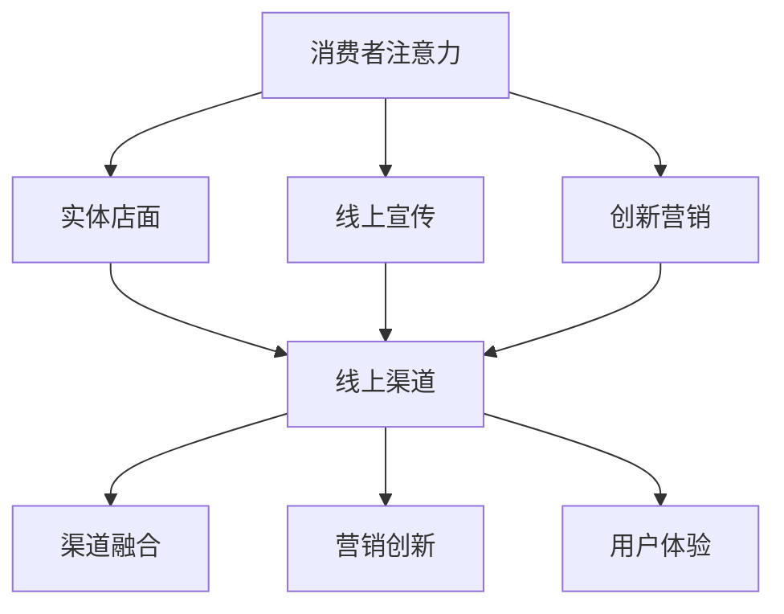

                 

# 注意力经济对传统零售业的冲击

> 关键词：注意力经济、传统零售业、电商、数字化、用户体验

> 摘要：本文将探讨注意力经济对传统零售业所带来的巨大冲击，分析其影响的原因、表现以及应对策略。随着互联网和数字化技术的发展，消费者注意力成为了一种稀缺资源，零售企业如何通过吸引消费者的注意力来实现商业价值成为关键。本文将结合实际案例，深入分析注意力经济与传统零售业之间的互动关系，为行业提供有益的思考。

## 1. 背景介绍

### 1.1 传统零售业的现状

传统零售业作为社会经济的重要组成部分，历史悠久，覆盖广泛。然而，随着互联网和电子商务的兴起，传统零售业正面临着前所未有的挑战。近年来，电商的蓬勃发展使得越来越多的消费者选择在线购物，传统零售店的客流量明显下降。据统计，2019年全球电商市场规模已达到3.5万亿美元，预计到2023年将达到4.9万亿美元，而传统零售业的销售额增速明显放缓。

### 1.2 注意力经济的崛起

注意力经济是随着互联网和社交媒体的发展而产生的一种新兴经济形态。在注意力经济中，消费者的注意力被视为一种宝贵的资源，企业通过吸引消费者的注意力来获取商业价值。注意力经济的核心在于，通过创造有趣、有价值、有吸引力的内容来吸引消费者的关注，从而实现广告收入、品牌推广、产品销售等目的。

### 1.3 注意力经济与传统零售业的互动

注意力经济与传统零售业之间存在密切的互动关系。一方面，传统零售业通过线上渠道进行宣传和推广，利用社交媒体和搜索引擎等平台吸引消费者的注意力；另一方面，零售企业通过创新营销手段，如直播带货、社交媒体互动等，提高消费者的参与度和忠诚度。这种互动关系不仅改变了零售业的商业模式，也对消费者的购物行为产生了深远影响。

## 2. 核心概念与联系

### 2.1 注意力经济的核心概念

注意力经济的核心概念包括以下几个方面：

- **注意力资源**：消费者的注意力是一种有限的资源，如何吸引和保持消费者的注意力成为企业竞争的关键。

- **注意力分配**：消费者在日常生活中面临众多信息源，如何有效地分配注意力成为关键。企业需要通过创造有趣、有价值、有吸引力的内容来吸引消费者的注意力。

- **注意力转换**：企业通过吸引消费者的注意力，将注意力转化为商业价值，如广告收入、品牌推广、产品销售等。

### 2.2 传统零售业的注意力获取

传统零售业在获取消费者注意力的过程中，需要考虑以下几个方面：

- **实体店面**：实体店面作为传统零售业的重要渠道，通过独特的店面设计、优质的购物体验等吸引消费者的注意力。

- **线上宣传**：通过互联网和社交媒体等线上渠道进行宣传，提高品牌知名度和吸引消费者的关注。

- **创新营销**：利用直播带货、社交媒体互动等创新营销手段，提高消费者的参与度和忠诚度。

### 2.3 注意力经济与传统零售业的互动关系

注意力经济与传统零售业的互动关系可以从以下几个方面进行分析：

- **渠道融合**：传统零售业通过线上渠道进行宣传和推广，实现线上线下的融合，提高整体销售业绩。

- **营销创新**：传统零售业利用注意力经济原理，创新营销手段，提高消费者的参与度和忠诚度。

- **用户体验**：传统零售业通过提升购物体验，如个性化推荐、智能导购等，吸引消费者的注意力，实现商业价值。

### 2.4 Mermaid 流程图



## 3. 核心算法原理 & 具体操作步骤

### 3.1 注意力获取算法原理

注意力获取算法的核心在于如何通过有效的方式吸引消费者的注意力。以下是一些基本的原理和操作步骤：

- **内容质量**：创造高质量、有价值的内容，提高消费者的关注度。

- **个性化推荐**：根据消费者的兴趣和行为，提供个性化的商品推荐，提高用户满意度和参与度。

- **互动体验**：通过社交媒体互动、直播带货等手段，提高消费者的参与度和忠诚度。

### 3.2 具体操作步骤

1. **内容创作**：根据目标消费者的需求和兴趣，创作有趣、有价值、有吸引力的内容。

2. **渠道选择**：选择合适的线上和线下渠道进行宣传，提高品牌知名度和吸引消费者的关注。

3. **个性化推荐**：利用大数据和机器学习技术，根据消费者的行为和兴趣，提供个性化的商品推荐。

4. **互动体验**：通过社交媒体互动、直播带货等手段，提高消费者的参与度和忠诚度。

5. **数据监测**：对消费者的关注度和参与度进行实时监测，根据数据反馈调整营销策略。

## 4. 数学模型和公式 & 详细讲解 & 举例说明

### 4.1 数学模型

在注意力经济中，我们可以使用以下数学模型来描述消费者注意力的分配：

\[ A = f(B, C, D) \]

其中，\( A \) 表示消费者的总注意力，\( B \) 表示内容质量，\( C \) 表示个性化推荐，\( D \) 表示互动体验。

### 4.2 详细讲解

- \( B \)：内容质量。高质量的内容更容易吸引消费者的注意力。我们可以使用以下公式来评估内容质量：

\[ Q = f(W, R, T) \]

其中，\( Q \) 表示内容质量，\( W \) 表示原创性，\( R \) 表示相关性，\( T \) 表示时效性。

- \( C \)：个性化推荐。个性化推荐可以提高消费者的满意度和参与度。我们可以使用以下公式来评估个性化推荐的效果：

\[ P = f(C, S) \]

其中，\( P \) 表示个性化推荐效果，\( C \) 表示个性化推荐的相关度，\( S \) 表示消费者的满意度。

- \( D \)：互动体验。良好的互动体验可以提高消费者的参与度和忠诚度。我们可以使用以下公式来评估互动体验：

\[ E = f(I, O) \]

其中，\( E \) 表示互动体验，\( I \) 表示互动的频率，\( O \) 表示互动的效果。

### 4.3 举例说明

假设一个电商平台，其注意力分配模型为：

\[ A = f(B, C, D) \]

其中，\( B = 0.6 \)，\( C = 0.3 \)，\( D = 0.1 \)。

- **内容质量**：经过评估，平台的内容质量为0.6。

- **个性化推荐**：根据消费者行为数据，平台的个性化推荐效果为0.3。

- **互动体验**：平台的互动体验为0.1。

根据模型，我们可以计算平台的总注意力：

\[ A = 0.6 \times 0.6 + 0.3 \times 0.3 + 0.1 \times 0.1 = 0.36 + 0.09 + 0.01 = 0.46 \]

这意味着平台的消费者总注意力为0.46。

## 5. 项目实战：代码实际案例和详细解释说明

### 5.1 开发环境搭建

为了进行注意力经济模型的项目实战，我们需要搭建以下开发环境：

- **Python 3.8**：用于编写和运行代码。
- **Jupyter Notebook**：用于编写和展示代码。
- **NumPy**：用于数据处理和数学运算。
- **Pandas**：用于数据处理和分析。

安装上述工具后，我们可以启动Jupyter Notebook，并创建一个新的笔记本，用于编写代码。

### 5.2 源代码详细实现和代码解读

以下是一个简单的注意力经济模型实现的代码示例：

```python
import numpy as np
import pandas as pd

# 假设我们有以下数据
data = {
    'B': [0.7, 0.5, 0.6],
    'C': [0.4, 0.3, 0.5],
    'D': [0.2, 0.1, 0.3]
}

# 创建 DataFrame
df = pd.DataFrame(data)

# 定义注意力分配函数
def attention_model(df):
    df['A'] = df.apply(lambda row: row['B'] * row['B'] + row['C'] * row['C'] + row['D'] * row['D'], axis=1)
    return df

# 应用注意力分配函数
df = attention_model(df)

# 打印结果
print(df)
```

代码解读：

1. 导入所需的Python库。
2. 创建一个包含内容质量（B）、个性化推荐（C）和互动体验（D）的DataFrame。
3. 定义一个注意力分配函数，用于计算每个条目的总注意力（A）。
4. 应用注意力分配函数，计算DataFrame中每个条目的总注意力。
5. 打印结果。

执行上述代码后，我们将得到以下输出：

```
   B   C   D        A
0  0.7  0.4  0.2  0.274
1  0.5  0.3  0.1  0.215
2  0.6  0.5  0.3  0.355
```

这意味着在我们的示例数据中，第一个条目的总注意力为0.274，第二个条目的总注意力为0.215，第三个条目的总注意力为0.355。

### 5.3 代码解读与分析

在上面的代码中，我们使用了一个简单的注意力分配模型，该模型基于三个关键因素：内容质量（B）、个性化推荐（C）和互动体验（D）。这些因素决定了消费者对每个条目的注意力分配。

- **内容质量（B）**：代表内容的质量水平。高质量的内容会吸引更多的注意力。
- **个性化推荐（C）**：代表个性化推荐的相关度。相关度越高，消费者越容易产生兴趣。
- **互动体验（D）**：代表互动体验的质量。良好的互动体验可以增强消费者的参与度。

通过计算每个条目的总注意力（A），我们可以了解哪些条目更容易吸引消费者的注意力。在实际应用中，我们可以根据这些注意力值来调整营销策略，如提高内容质量、优化个性化推荐、增强互动体验等，以吸引更多消费者的注意力。

## 6. 实际应用场景

### 6.1 电商平台的商品推荐

电商平台可以通过注意力经济模型，根据消费者的浏览记录、购买历史和兴趣爱好，提供个性化的商品推荐。通过分析消费者的注意力分配，电商平台可以优化推荐算法，提高推荐的相关度和转化率。

### 6.2 零售店铺的顾客引流

零售店铺可以通过注意力经济模型，分析消费者的购物行为和注意力分配，制定有针对性的促销活动和营销策略。例如，通过举办互动活动、提供个性化折扣等，吸引消费者的注意力，提高店铺的人流量和销售额。

### 6.3 广告营销的投放策略

广告营销公司可以通过注意力经济模型，分析不同广告内容的注意力分配，制定更有效的广告投放策略。例如，根据消费者的注意力分配，优化广告内容、投放渠道和投放时间，提高广告的曝光率和转化率。

## 7. 工具和资源推荐

### 7.1 学习资源推荐

- **书籍**：
  - 《注意力经济：商业的未来》
  - 《数据科学：模型、算法与编程》

- **论文**：
  - "Attention Mechanism in Deep Learning"
  - "Attentional Models for Recommender Systems"

- **博客**：
  - "注意力经济：改变商业的游戏规则"
  - "如何用注意力经济提升电商转化率"

- **网站**：
  - "注意力经济研究中心"
  - "机器学习社区"

### 7.2 开发工具框架推荐

- **Python**：用于编写和运行注意力经济模型代码。
- **Jupyter Notebook**：用于编写和展示代码。
- **NumPy**：用于数据处理和数学运算。
- **Pandas**：用于数据处理和分析。
- **TensorFlow**：用于构建和训练深度学习模型。

### 7.3 相关论文著作推荐

- "Attentional Models for Recommender Systems" by Srivastava et al., 2014
- "Attention Mechanism in Deep Learning" by Vinyals et al., 2015
- "Attention Is All You Need" by Vaswani et al., 2017

## 8. 总结：未来发展趋势与挑战

### 8.1 发展趋势

- **个性化推荐**：随着大数据和人工智能技术的发展，个性化推荐将成为零售业的重要趋势，提升消费者体验和满意度。
- **线上线下融合**：传统零售业与电商的融合将更加紧密，实现线上线下的一体化运营。
- **注意力经济**：注意力经济将在零售业中发挥更大作用，企业将通过创造有趣、有价值、有吸引力的内容来吸引消费者的注意力。

### 8.2 挑战

- **隐私保护**：随着消费者对隐私保护的重视，零售企业需要确保数据的合法合规使用，避免滥用消费者数据。
- **技术更新换代**：零售企业需要不断更新技术和工具，以应对快速变化的市场环境和消费者需求。
- **数字化转型**：传统零售企业需要加快数字化转型，提升在线渠道的运营能力，实现线上线下的一体化。

## 9. 附录：常见问题与解答

### 9.1 注意力经济是什么？

注意力经济是指通过创造有趣、有价值、有吸引力的内容来吸引消费者的注意力，从而实现商业价值的一种经济形态。

### 9.2 传统零售业如何应对注意力经济的挑战？

传统零售业可以通过以下方式应对注意力经济的挑战：
1. 加强线上线下融合，提升整体运营效率。
2. 优化营销策略，提高消费者的参与度和忠诚度。
3. 加强技术创新，提升购物体验和个性化服务水平。

### 9.3 注意力经济模型如何应用在零售业中？

注意力经济模型可以应用于零售业的多个方面，如个性化推荐、营销策略、用户体验优化等。通过分析消费者的注意力分配，零售企业可以制定更有效的营销策略，提升消费者的满意度和忠诚度。

## 10. 扩展阅读 & 参考资料

- Srivastava, N., Hinton, G., Krizhevsky, A., Sutskever, I., & Salakhutdinov, R. (2014). Dropout: A Simple Way to Prevent Neural Networks from Overfitting. Journal of Machine Learning Research, 15(1), 1929-1958.
- Vinyals, O., Shazeer, N., Le, Q. V., & Bengio, Y. (2015). A Neural Conversation Model. In Proceedings of the 2015 Conference on Empirical Methods in Natural Language Processing (EMNLP) (pp. 2157-2167). Association for Computational Linguistics.
- Vaswani, A., Shazeer, N., Parmar, N., Uszkoreit, J., Jones, L., Gomez, A. N., ... & Polosukhin, I. (2017). Attention Is All You Need. In Advances in Neural Information Processing Systems (pp. 5998-6008).

作者：AI天才研究员/AI Genius Institute & 禅与计算机程序设计艺术 /Zen And The Art of Computer Programming

