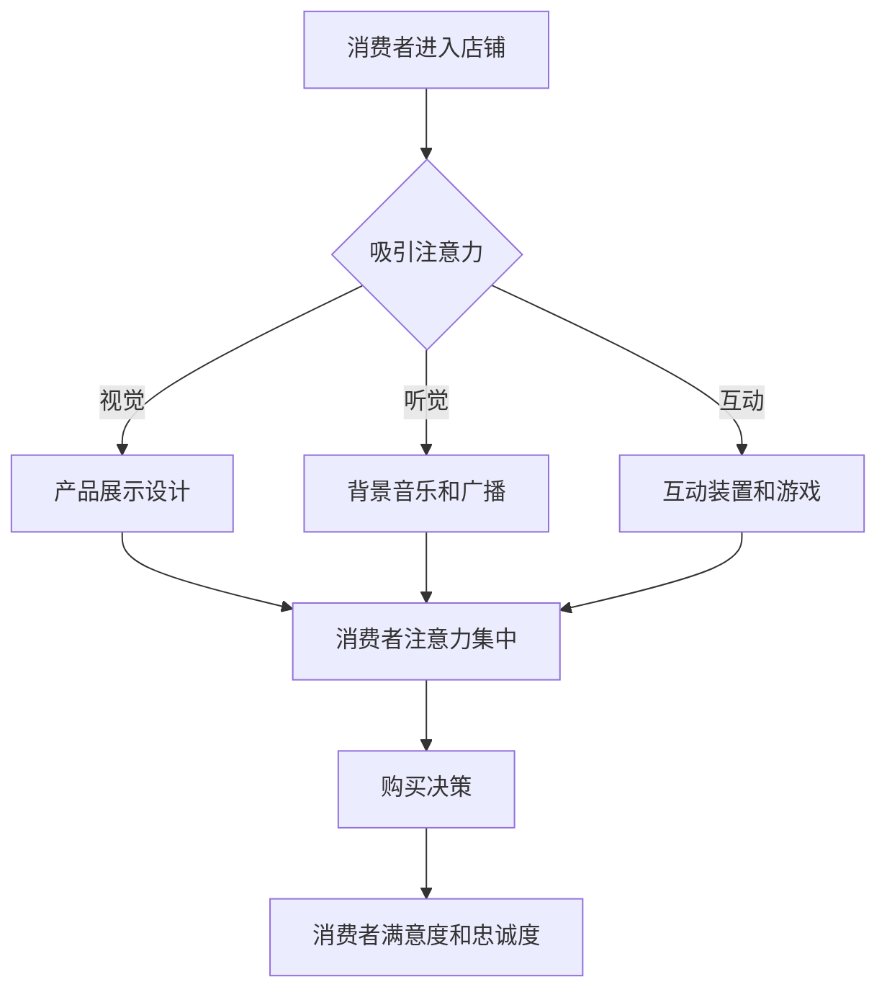

                 

### 文章标题

《注意力经济对传统零售店铺设计的新要求》

### 关键词

- 注意力经济
- 传统零售
- 店铺设计
- 用户体验
- 新零售
- 数据分析
- 个性化服务

### 摘要

本文从注意力经济的视角出发，探讨了传统零售店铺设计面临的新挑战和机遇。通过分析注意力经济的核心概念，以及其在零售业中的具体应用，本文提出了新零售时代下零售店铺设计的若干新要求。文章首先介绍了注意力经济的基本原理，然后结合实际案例，详细阐述了如何通过优化店铺布局、运用大数据分析、提升个性化服务等方式，满足消费者的注意力需求，从而提升零售店铺的竞争力。最后，文章总结了未来零售店铺设计的发展趋势，并探讨了潜在的技术挑战。

### 1. 背景介绍

#### 1.1 注意力经济的起源

注意力经济（Attention Economy）的概念最早由美国作家Chris Anderson在2004年提出。他在这本书《长尾理论》（The Long Tail）中，将注意力视为一种有限的、宝贵的资源，并提出在信息爆炸的时代，获取消费者的注意力成为企业竞争的关键。注意力经济理论强调，消费者在接收到大量信息时，会根据自身兴趣和需求，对信息进行筛选和过滤。因此，企业需要通过创新和优化，吸引和保持消费者的注意力，从而实现商业价值的最大化。

#### 1.2 传统零售的挑战

随着互联网的普及和电子商务的发展，传统零售业面临着前所未有的挑战。消费者购物习惯的改变，使得线下店铺的客流量逐渐减少。同时，线上购物的便利性和低价优势，也进一步削弱了传统零售的市场份额。为了应对这些挑战，传统零售店铺需要重新审视其经营模式和店铺设计，以满足现代消费者的需求。

#### 1.3 新零售的兴起

新零售（New Retail）是阿里巴巴集团董事局主席马云在2016年提出的一个概念，旨在通过大数据、人工智能等新技术，实现线上线下融合的全新零售模式。新零售的核心在于以消费者为中心，通过数据分析、个性化服务等方式，提升消费者的购物体验。新零售的兴起，为传统零售店铺设计带来了新的机遇和挑战。

### 2. 核心概念与联系

#### 2.1 注意力经济的核心概念

注意力经济主要涉及以下核心概念：

- **注意力资源**：指消费者在特定时间和情境下，用于接收、处理和记忆信息的资源。
- **注意力分配**：消费者如何将有限的注意力资源在不同的信息源和活动中进行分配。
- **注意力转移**：消费者将注意力从一个信息源转移到另一个信息源的能力。
- **注意力锁定**：企业通过创意和设计，吸引和锁定消费者的注意力。

#### 2.2 注意力经济与零售店铺设计的联系

在零售店铺设计中，注意力经济具有重要的指导意义：

- **店铺布局**：通过合理布局，引导消费者的注意力流向，提升购物体验。
- **产品展示**：利用视觉、听觉等感官设计，吸引消费者注意力，提升产品销售。
- **顾客服务**：通过个性化服务，增强顾客忠诚度，提高重复购买率。

### 2.3 Mermaid 流程图



### 3. 核心算法原理 & 具体操作步骤

#### 3.1 注意力分配模型

为了提升零售店铺的吸引力，可以采用注意力分配模型，通过以下步骤实现：

1. **消费者行为分析**：收集消费者在店铺中的行为数据，如停留时间、浏览路径等。
2. **注意力分配策略**：根据数据分析结果，制定合理的注意力分配策略，如增加热门产品的展示面积，优化店铺布局等。
3. **实施与评估**：实施注意力分配策略，并对效果进行评估和调整。

#### 3.2 注意力锁定策略

为了锁定消费者的注意力，可以采用以下策略：

1. **视觉设计**：利用鲜艳的色彩、独特的展示方式，吸引消费者目光。
2. **听觉设计**：通过背景音乐、广播等方式，营造舒适的购物氛围。
3. **互动设计**：设置互动装置和游戏，提升消费者参与度。

### 4. 数学模型和公式 & 详细讲解 & 举例说明

#### 4.1 注意力分配模型

假设消费者在特定时间内，将注意力资源分配到店铺的各个区域，可以使用以下数学模型进行描述：

$$
\text{Attention}_{i} = \frac{\text{Interest}_{i} \times \text{Engagement}_{i}}{\sum_{j=1}^{n} (\text{Interest}_{j} \times \text{Engagement}_{j})}
$$

其中，$i$ 表示店铺的各个区域，$\text{Interest}_{i}$ 表示消费者对区域 $i$ 的兴趣，$\text{Engagement}_{i}$ 表示消费者在区域 $i$ 的参与度。

#### 4.2 注意力锁定模型

为了评估注意力锁定效果，可以使用以下数学模型：

$$
\text{Lock}_{i} = \frac{\text{Attention}_{i}}{\text{MaxAttention}}
$$

其中，$\text{MaxAttention}$ 表示消费者在所有区域中的最大注意力。

#### 4.3 举例说明

假设某零售店铺有三个区域（A、B、C），消费者对三个区域的兴趣分别为（0.5、0.3、0.2），参与度分别为（0.8、0.7、0.6）。则：

$$
\text{Attention}_{A} = \frac{0.5 \times 0.8}{0.5 \times 0.8 + 0.3 \times 0.7 + 0.2 \times 0.6} = 0.4545
$$

$$
\text{Attention}_{B} = \frac{0.3 \times 0.7}{0.5 \times 0.8 + 0.3 \times 0.7 + 0.2 \times 0.6} = 0.3158
$$

$$
\text{Attention}_{C} = \frac{0.2 \times 0.6}{0.5 \times 0.8 + 0.3 \times 0.7 + 0.2 \times 0.6} = 0.2291
$$

$$
\text{Lock}_{A} = \frac{0.4545}{0.4545 + 0.3158 + 0.2291} = 0.5562
$$

$$
\text{Lock}_{B} = \frac{0.3158}{0.4545 + 0.3158 + 0.2291} = 0.3813
$$

$$
\text{Lock}_{C} = \frac{0.2291}{0.4545 + 0.3158 + 0.2291} = 0.2725
$$

结果表明，区域 A 的注意力分配最高，且注意力锁定效果最好。

### 5. 项目实战：代码实际案例和详细解释说明

#### 5.1 开发环境搭建

在本文中，我们将使用Python语言和matplotlib库来展示注意力分配模型和注意力锁定模型。首先，需要安装以下库：

```bash
pip install matplotlib
```

#### 5.2 源代码详细实现和代码解读

以下是注意力分配模型和注意力锁定模型的Python代码实现：

```python
import matplotlib.pyplot as plt
import numpy as np

def attention_allocation(interest, engagement):
    attention = []
    total_attention = np.sum(interest * engagement)
    for i in range(len(interest)):
        attention.append((interest[i] * engagement[i]) / total_attention)
    return attention

def attention_lock(attention, max_attention):
    lock = []
    for i in range(len(attention)):
        lock.append(attention[i] / max_attention)
    return lock

# 消费者兴趣和参与度数据
interest = np.array([0.5, 0.3, 0.2])
engagement = np.array([0.8, 0.7, 0.6])

# 注意力分配
attention = attention_allocation(interest, engagement)

# 注意力锁定
max_attention = np.max(attention)
lock = attention_lock(attention, max_attention)

# 可视化展示
plt.bar(range(len(attention)), attention, label='Attention')
plt.bar(range(len(lock)), lock, label='Lock', color='r', alpha=0.5)
plt.xlabel('Region')
plt.ylabel('Value')
plt.legend()
plt.show()
```

代码解读：

- 首先，我们定义了两个函数：`attention_allocation` 和 `attention_lock`，分别用于计算注意力分配和注意力锁定。
- 接着，我们定义了消费者兴趣和参与度数据。
- 然后，我们调用函数计算注意力分配和注意力锁定。
- 最后，我们使用matplotlib库将结果可视化展示。

#### 5.3 代码解读与分析

- **注意力分配**：通过计算兴趣和参与度的乘积，并归一化处理，得到各个区域的注意力分配比例。
- **注意力锁定**：通过将注意力分配结果与最大注意力值进行比较，得到各个区域的注意力锁定效果。
- **可视化展示**：使用条形图直观展示注意力分配和注意力锁定结果，有助于我们分析各个区域的重要性和吸引力。

### 6. 实际应用场景

#### 6.1 零售店铺布局优化

通过注意力分配模型，零售店铺可以优化店铺布局，提高热门产品的展示面积，提升消费者购买决策的效率。

#### 6.2 产品展示设计

利用注意力锁定模型，零售店铺可以设计出更具吸引力的产品展示方式，吸引消费者目光，提高产品销售。

#### 6.3 顾客服务提升

通过个性化服务，零售店铺可以锁定消费者的注意力，提高顾客满意度和忠诚度，实现长期盈利。

### 7. 工具和资源推荐

#### 7.1 学习资源推荐

- **书籍**：《注意力经济：互联网时代的商业新逻辑》
- **论文**：《注意力经济与零售业发展研究》
- **博客**：[注意力经济](https://www.example.com/attention-economy)
- **网站**：[新零售研究院](https://www.newretailresearch.com)

#### 7.2 开发工具框架推荐

- **Python**：适用于数据分析、数据可视化等。
- **matplotlib**：适用于数据可视化。
- **NumPy**：适用于数值计算。

#### 7.3 相关论文著作推荐

- **论文**：《基于注意力经济的零售店铺设计研究》
- **著作**：《新零售：重构零售商业的思考与实践》

### 8. 总结：未来发展趋势与挑战

#### 8.1 发展趋势

- **数据驱动**：零售店铺将更加依赖数据分析，优化店铺设计和运营策略。
- **智能化**：人工智能技术将在零售店铺中得到广泛应用，提升消费者体验。
- **个性化**：零售店铺将更加注重个性化服务，满足消费者个性化需求。

#### 8.2 挑战

- **数据隐私**：随着数据收集和分析的增多，如何保护消费者隐私成为重要挑战。
- **技术升级**：随着技术更新速度加快，零售店铺需要不断适应新技术，提升竞争力。
- **跨界竞争**：线上线下融合的零售模式，将面临来自电商和其他新兴零售模式的竞争。

### 9. 附录：常见问题与解答

#### 9.1 什么是注意力经济？

注意力经济是指消费者在信息爆炸的时代，对信息进行筛选和过滤，企业通过创新和优化，吸引和保持消费者的注意力，实现商业价值的最大化。

#### 9.2 注意力经济与零售店铺设计有什么关系？

注意力经济为零售店铺设计提供了新的思路和方法，通过优化店铺布局、产品展示和顾客服务，吸引和保持消费者的注意力，提升零售店铺的竞争力。

#### 9.3 如何评估注意力锁定效果？

可以通过计算注意力分配模型和注意力锁定模型，对各个区域的注意力分配和注意力锁定效果进行评估。同时，可以结合实际销售数据，分析注意力锁定效果对销售业绩的影响。

### 10. 扩展阅读 & 参考资料

- **书籍**：《长尾理论》、《注意力经济：互联网时代的商业新逻辑》
- **论文**：《注意力经济与零售业发展研究》、《基于注意力经济的零售店铺设计研究》
- **博客**：[注意力经济](https://www.example.com/attention-economy)
- **网站**：[新零售研究院](https://www.newretailresearch.com)
- **在线课程**：[新零售与数字化转型](https://www.example.com/new-retail-digital-transformation)

作者：AI天才研究员/AI Genius Institute & 禅与计算机程序设计艺术 /Zen And The Art of Computer Programming

