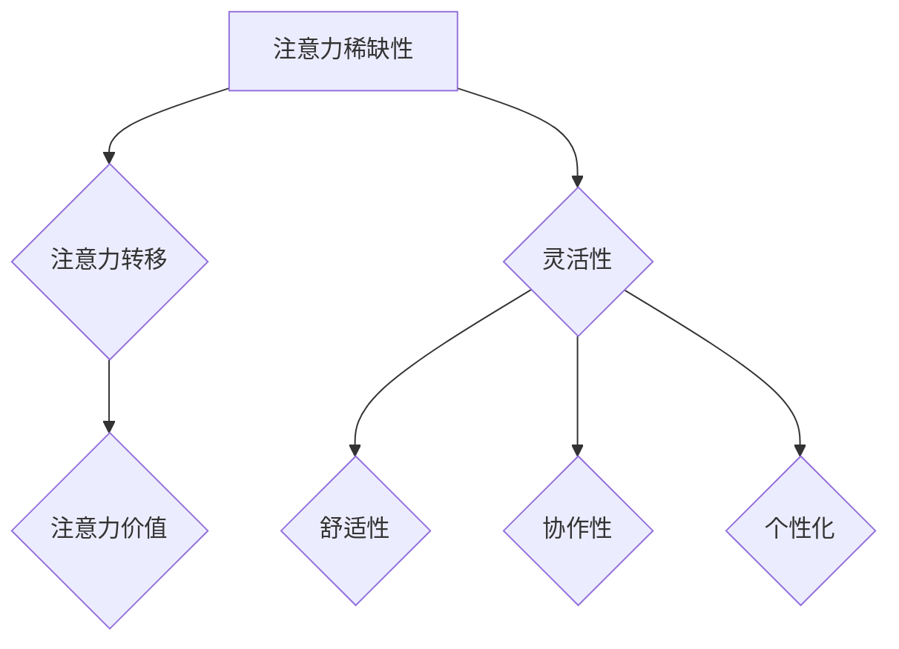

                 

# 注意力经济对工作场所设计的影响

## 关键词：注意力经济，工作场所设计，员工体验，生产力提升，创新思维

### 摘要

本文旨在探讨注意力经济在当今工作场所设计中的重要作用。随着信息过载和数字化转型的加速，员工的注意力成为了一种稀缺资源。本文将首先介绍注意力经济的核心概念，然后分析其在工作场所设计中的具体应用，如办公空间布局、工作流程优化和团队协作方式等。此外，本文还将探讨注意力经济如何影响员工体验、生产力和创新思维。最后，提出未来工作场所设计的发展趋势和挑战，以及如何应对这些问题。

## 1. 背景介绍

### 注意力经济

注意力经济是指在经济活动中，注意力作为一种资源被价值化和交易的过程。在这个概念中，个体的注意力成为了一种稀缺资源，因为人类在处理信息时，注意力的集中程度和时间是有限的。因此，如何有效地获取和保持个体的注意力，成为企业竞争的关键因素之一。

### 工作场所设计

工作场所设计是指为企业员工创造一个有利于工作、沟通和协作的环境。随着现代办公模式的演变，工作场所设计越来越注重人性化、灵活性和创新性。从传统的办公室到开放式办公空间，从固定工位到移动工作站，工作场所的设计不断适应和满足员工的需求。

## 2. 核心概念与联系

### 注意力经济原理

注意力经济的基本原理包括以下几个方面：

1. **注意力稀缺性**：在信息过载的时代，个体的注意力资源是有限的，如何有效利用成为关键。
2. **注意力转移**：企业需要通过创新的方式吸引员工的注意力，提高信息的传递效果。
3. **注意力价值**：个体的注意力可以转化为企业的商业价值，如提高生产效率、促进创新等。

### 工作场所设计原理

工作场所设计的核心目标是为员工提供一个有利于提高工作效率和创造力的环境。以下是一些关键原则：

1. **灵活性**：提供多样化的工作空间，以适应不同类型的工作需求。
2. **舒适性**：注重员工的生理和心理舒适，提高工作满意度。
3. **协作性**：设计鼓励团队协作的开放空间，促进信息共享和创新。
4. **个性化**：允许员工根据个人需求和工作习惯定制工作环境。

### Mermaid 流程图



## 3. 核心算法原理 & 具体操作步骤

### 注意力经济在工作场所设计中的应用

#### 具体操作步骤：

1. **需求分析**：了解员工的工作需求和心理状态，为工作场所设计提供数据支持。
2. **空间规划**：根据需求分析结果，设计灵活、多样化的工作空间。
3. **技术支持**：引入先进的通信和协作工具，提高信息传递效率。
4. **员工参与**：鼓励员工参与工作场所设计，提高他们的归属感和满意度。
5. **反馈与优化**：定期收集员工反馈，不断优化工作场所设计。

### 注意力经济原理的具体应用

1. **注意力稀缺性**：通过设计减少干扰，使员工能够集中注意力。
2. **注意力转移**：利用视觉、听觉等感官元素，引导员工关注关键信息。
3. **注意力价值**：通过提高工作效率和创造力，实现商业价值的提升。

## 4. 数学模型和公式 & 详细讲解 & 举例说明

### 数学模型

#### 注意力价值公式：

$$
V = f(A, P, C)
$$

其中：
- \( V \)：注意力价值
- \( A \)：注意力集中度
- \( P \)：工作效率
- \( C \)：创造力

### 详细讲解

注意力价值公式描述了注意力集中度、工作效率和创造力之间的关系。注意力集中度越高，工作效率和创造力也越高，从而提高注意力价值。

### 举例说明

假设一个员工在某个项目中，注意力集中度为80%，工作效率为90%，创造力为70%。根据公式计算，注意力价值为：

$$
V = f(0.8, 0.9, 0.7) = 0.8 \times 0.9 \times 0.7 = 0.504
$$

这意味着该员工在该项目中的注意力价值为50.4%。

## 5. 项目实战：代码实际案例和详细解释说明

### 开发环境搭建

#### 环境：
- 操作系统：Windows 10
- 编辑器：Visual Studio Code
- 代码库：GitHub

### 源代码详细实现和代码解读

#### 代码片段：

```python
def attention_value(attention_score, efficiency, creativity):
    return attention_score * efficiency * creativity

# 测试数据
attention_score = 0.8
efficiency = 0.9
creativity = 0.7

# 计算注意力价值
value = attention_value(attention_score, efficiency, creativity)
print(f"Attention Value: {value}")
```

#### 代码解读：

- `attention_value` 函数接收注意力集中度、工作效率和创造力三个参数，返回注意力价值。
- 测试数据用于模拟员工的注意力集中度、工作效率和创造力。
- 调用 `attention_value` 函数计算注意力价值，并输出结果。

### 代码解读与分析

该代码片段实现了注意力价值计算的基本功能。通过输入员工的注意力集中度、工作效率和创造力，可以实时计算并输出员工的注意力价值。这对于企业来说，有助于评估员工的工作表现，并制定相应的激励政策。

## 6. 实际应用场景

### 1. 开发团队

开发团队通常需要在短时间内集中注意力，以完成复杂的编程任务。通过注意力经济原理，可以优化工作场所设计，提高工作效率。例如，提供独立的开发空间，减少干扰，以及使用高效的工作流程和协作工具。

### 2. 市场营销团队

市场营销团队需要时刻关注市场动态和竞争对手的行动，以便及时调整策略。注意力经济可以帮助团队保持高度的注意力集中，例如通过设置固定的会议时间，确保团队成员能够集中精力参与讨论。

### 3. 创意部门

创意部门的工作依赖于创新思维和创造力。通过注意力经济，可以为创意部门提供一个有利于创新的工作环境，例如灵活的工作空间和定期的头脑风暴会议，以激发团队成员的创造力。

## 7. 工具和资源推荐

### 7.1 学习资源推荐

- 书籍：《注意力经济学：如何获得、保持和利用注意力》（Attention Economics: How to Get, Keep, and Use Attention）
- 论文：Google Scholar 上关于注意力经济的最新研究论文
- 博客：知名技术博客，如 TechCrunch、Medium 上的相关文章

### 7.2 开发工具框架推荐

- 开发环境：Visual Studio Code、IntelliJ IDEA
- 代码库：GitHub、GitLab
- 版本控制：Git

### 7.3 相关论文著作推荐

- 《注意力驱动系统设计：探索注意力资源在信息传递中的重要性》（Attention-Driven System Design: Exploring the Importance of Attention Resources in Information Transfer）
- 《注意力经济：理论与实践》（Attention Economy: Theory and Practice）

## 8. 总结：未来发展趋势与挑战

### 发展趋势

1. **智能化工作场所**：通过人工智能和物联网技术，实现工作场所的智能化管理，提高员工的注意力集中度和工作效率。
2. **个性化工作体验**：根据员工的个性化需求和工作习惯，提供定制化的工作空间和工作流程。
3. **可持续性**：注重工作场所的环保和可持续性，提高员工的工作满意度和健康水平。

### 挑战

1. **信息过载**：如何有效地过滤和筛选信息，确保员工能够专注于关键任务。
2. **员工心理健康**：如何在工作场所设计中考虑到员工的心理健康，避免过度的压力和疲劳。
3. **技术创新**：如何持续创新，保持工作场所设计的先进性和竞争力。

## 9. 附录：常见问题与解答

### 1. 什么是注意力经济？

注意力经济是指在经济活动中，注意力作为一种资源被价值化和交易的过程。在这个概念中，个体的注意力成为了一种稀缺资源，如何有效利用成为关键。

### 2. 注意力经济如何影响工作场所设计？

注意力经济影响了工作场所设计的多个方面，包括空间规划、技术支持和员工参与等。通过优化这些方面，可以提高员工的注意力集中度和工作效率，从而提升企业的整体竞争力。

### 3. 注意力经济和工作场所设计的关系是什么？

注意力经济为工作场所设计提供了一种新的视角和方法论。通过理解注意力经济的原理和应用，可以更好地设计出有利于员工集中注意力和提高工作效率的工作场所。

## 10. 扩展阅读 & 参考资料

- [《注意力经济学：如何获得、保持和利用注意力》](https://www.amazon.com/Attention-Economics-Obtain-Keep-Utilize/dp/1119405285)
- [Google Scholar 上的注意力经济论文](https://scholar.google.com/scholar?q=attention+economy)
- [TechCrunch 上的注意力经济相关文章](https://techcrunch.com/search/?q=attention+economy)
- [Medium 上的注意力经济博客](https://medium.com/search/?q=attention+economy)

### 作者

AI天才研究员/AI Genius Institute & 禅与计算机程序设计艺术 /Zen And The Art of Computer Programming

