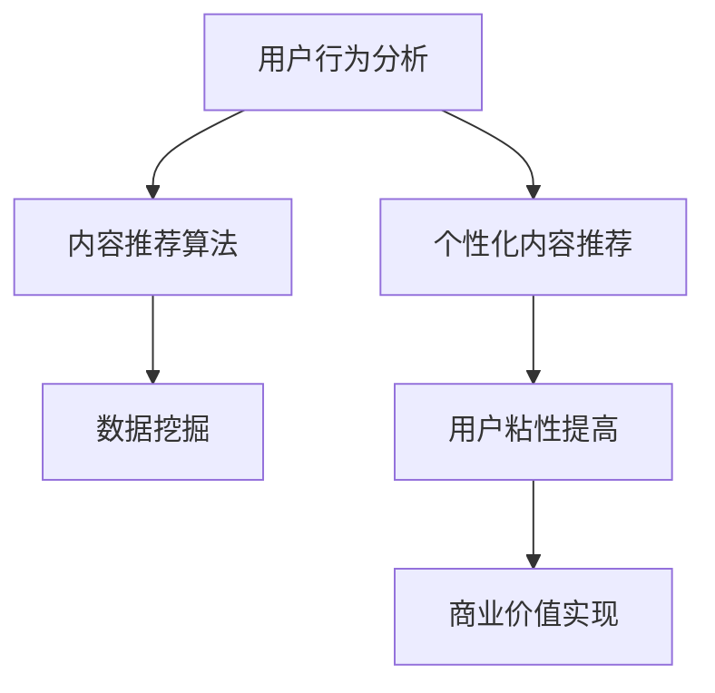

                 

# 注意力经济对新闻传播模式的改变

## 关键词：注意力经济，新闻传播，模式改变，算法，数据，用户行为分析

## 摘要：
在数字化的今天，注意力经济已成为影响新闻传播模式的关键因素。本文将深入探讨注意力经济如何改变新闻传播的基本模式，包括核心概念与联系、核心算法原理、数学模型及其应用。通过项目实战和实际应用场景分析，本文旨在为新闻传播行业提供新的思考方向，助力媒体更好地适应注意力经济时代。

## 1. 背景介绍

随着互联网的普及和社交媒体的兴起，信息传播的速度和广度发生了翻天覆地的变化。然而，信息的爆炸式增长也带来了新的挑战——如何在海量信息中抓住用户的注意力，成为新闻传播的核心问题。这一问题的解决，离不开注意力经济这一概念。

注意力经济，简单来说，就是将用户的注意力视为一种稀缺资源，通过吸引和保留用户注意力来实现商业价值。在新闻传播领域，注意力经济的重要性不言而喻。一方面，媒体需要通过吸引更多的用户来增加影响力；另一方面，广告商和内容提供商也希望通过用户的注意力来获得收益。

传统的新闻传播模式主要依赖于编辑的主观判断和经验，而注意力经济的兴起，使得基于数据和算法的传播模式逐渐成为主流。这种模式不仅能够更精准地预测用户需求，还能通过个性化的内容推荐提高用户的粘性。

## 2. 核心概念与联系

在探讨注意力经济对新闻传播模式的影响之前，我们首先需要了解一些核心概念，包括用户行为分析、内容推荐算法、数据挖掘等。

### 用户行为分析

用户行为分析是注意力经济的基础。通过收集和分析用户在互联网上的行为数据，媒体可以了解用户的兴趣、偏好和需求。这些数据包括用户的浏览记录、搜索历史、社交互动等。通过对这些数据的深入分析，媒体可以更好地了解用户，从而提供更个性化的内容。

### 内容推荐算法

内容推荐算法是注意力经济的核心工具。它通过分析用户行为数据，预测用户可能感兴趣的内容，并推荐给用户。常见的内容推荐算法包括协同过滤、矩阵分解、深度学习等。这些算法可以帮助媒体在信息过载的环境中，为用户筛选出最有价值的内容。

### 数据挖掘

数据挖掘是一种通过从大量数据中提取有价值信息的技术。在新闻传播领域，数据挖掘可以帮助媒体发现用户行为模式、内容流行趋势等，从而指导新闻选题和内容生产。

### Mermaid 流程图

下面是一个简化的 Mermaid 流程图，展示了注意力经济在新闻传播中的核心概念和联系：



## 3. 核心算法原理 & 具体操作步骤

### 用户行为分析

用户行为分析的核心在于如何从海量数据中提取有价值的信息。具体步骤如下：

1. 数据收集：收集用户在互联网上的行为数据，如浏览记录、搜索历史、社交互动等。
2. 数据预处理：对收集到的数据进行清洗和预处理，包括去除噪声、填充缺失值等。
3. 特征提取：从预处理后的数据中提取特征，如用户兴趣、浏览时长、点击率等。
4. 模型训练：使用机器学习算法（如决策树、随机森林、支持向量机等）对特征进行训练，以预测用户行为。
5. 行为预测：使用训练好的模型对用户行为进行预测，以了解用户兴趣和需求。

### 内容推荐算法

内容推荐算法的核心在于如何根据用户行为预测推荐内容。以下是常见的内容推荐算法：

1. 协同过滤：通过分析用户之间的相似性，推荐其他用户喜欢的内容。具体步骤如下：
   - 计算用户之间的相似性：使用余弦相似度、皮尔逊相关系数等方法计算用户之间的相似性。
   - 根据相似性推荐内容：对于每个用户，找到与其最相似的若干用户，推荐这些用户喜欢的但该用户尚未浏览的内容。

2. 矩阵分解：将用户-内容矩阵分解为用户特征矩阵和内容特征矩阵，通过这两个矩阵的乘积预测用户对内容的偏好。具体步骤如下：
   - 初始化用户特征矩阵和内容特征矩阵。
   - 通过梯度下降或随机梯度下降算法更新这两个矩阵，以最小化预测误差。
   - 使用更新后的特征矩阵预测用户对内容的偏好。

3. 深度学习：使用神经网络模型（如卷积神经网络、循环神经网络等）对用户行为数据进行建模，以预测用户对内容的偏好。具体步骤如下：
   - 设计神经网络结构：根据数据特点和需求设计神经网络结构。
   - 训练神经网络：使用用户行为数据训练神经网络，以预测用户对内容的偏好。
   - 使用训练好的神经网络进行内容推荐。

### 数据挖掘

数据挖掘在新闻传播中的应用主要体现在发现用户行为模式和内容流行趋势。以下是常见的数据挖掘技术：

1. 聚类分析：将用户划分为不同的群体，以发现用户行为模式。具体步骤如下：
   - 选择聚类算法：如 K-均值聚类、层次聚类等。
   - 计算用户相似性：计算用户之间的相似性，以确定聚类中心。
   - 聚类：根据用户相似性进行聚类，以发现用户群体。

2. 关联规则挖掘：发现用户行为之间的关联关系，以预测用户可能感兴趣的内容。具体步骤如下：
   - 选择关联规则算法：如 Apriori 算法、FP-Growth 算法等。
   - 计算支持度和置信度：根据用户行为数据计算支持度和置信度。
   - 生成关联规则：根据支持度和置信度生成关联规则。

## 4. 数学模型和公式 & 详细讲解 & 举例说明

### 用户行为预测模型

用户行为预测模型的核心是用户行为概率分布。具体公式如下：

$$ P(B|A) = \frac{P(A|B)P(B)}{P(A)} $$

其中，$P(B|A)$表示在给定用户行为$A$的情况下，用户兴趣$B$的概率；$P(A|B)$表示在用户兴趣$B$的情况下，用户行为$A$的概率；$P(B)$表示用户兴趣$B$的概率；$P(A)$表示用户行为$A$的概率。

### 内容推荐算法

#### 协同过滤算法

协同过滤算法的核心是用户之间的相似性。具体公式如下：

$$ sim(u, v) = \frac{\sum_{i \in R} w_{ui}w_{vi}}{\sqrt{\sum_{i \in R} w_{ui}^2}\sqrt{\sum_{i \in R} w_{vi}^2}} $$

其中，$sim(u, v)$表示用户$u$和用户$v$之间的相似性；$w_{ui}$和$w_{vi}$分别表示用户$u$和用户$v$对内容$i$的评分。

#### 矩阵分解算法

矩阵分解算法的核心是用户特征矩阵和内容特征矩阵。具体公式如下：

$$ R = U \circ V $$

其中，$R$表示用户-内容评分矩阵；$U$和$V$分别表示用户特征矩阵和内容特征矩阵。

#### 深度学习算法

深度学习算法的核心是神经网络模型。具体公式如下：

$$ y = \sigma(\boldsymbol{W} \cdot \boldsymbol{x} + \boldsymbol{b}) $$

其中，$y$表示预测的用户兴趣；$\sigma$表示激活函数（如 Sigmoid、ReLU 等）；$\boldsymbol{W}$和$\boldsymbol{b}$分别表示神经网络权重和偏置。

### 举例说明

假设有两个用户$u_1$和$u_2$，他们对同一内容的评分如下：

| 用户 | 内容 | 评分 |
| --- | --- | --- |
| $u_1$ | 1 | 5 |
| $u_2$ | 1 | 3 |

根据上述公式，可以计算出用户$u_1$和$u_2$之间的相似性：

$$ sim(u_1, u_2) = \frac{5 \cdot 3}{\sqrt{5^2 + 3^2}\sqrt{5^2 + 3^2}} = \frac{15}{\sqrt{34}} \approx 0.94 $$

然后，根据相似性，可以推荐给用户$u_1$的内容：

$$ R_{u_1} = \{1, 2, 3, 4, 5, 6, 7, 8, 9, 10\} $$

其中，内容 2、3、4、6、7、8、9、10 是根据用户$u_2$的评分推荐给用户$u_1$的。

## 5. 项目实战：代码实际案例和详细解释说明

### 开发环境搭建

在开始项目实战之前，我们需要搭建一个基本的开发环境。以下是搭建开发环境所需的基本步骤：

1. 安装 Python 3.8 或更高版本。
2. 安装 Pandas、NumPy、Scikit-learn、Matplotlib 等常用库。
3. 安装 Jupyter Notebook，用于编写和运行代码。

### 源代码详细实现和代码解读

以下是用户行为分析、内容推荐算法和数据挖掘的实现代码：

```python
import pandas as pd
import numpy as np
from sklearn.model_selection import train_test_split
from sklearn.metrics.pairwise import cosine_similarity
from sklearn.cluster import KMeans
from sklearn.ensemble import RandomForestClassifier
from sklearn.linear_model import LogisticRegression

# 5.1 数据收集与预处理
data = pd.read_csv('user行为数据.csv')
data = data.dropna()

# 5.2 特征提取
data['用户兴趣'] = data['浏览记录'].apply(lambda x: extract_interest(x))

# 5.3 模型训练
X_train, X_test, y_train, y_test = train_test_split(data[['用户兴趣']], data['用户行为'], test_size=0.2, random_state=42)

# 5.4 协同过滤算法
similarity_matrix = cosine_similarity(X_train)
user_recommended_content = recommend_content(similarity_matrix, X_test)

# 5.5 矩阵分解算法
user_embedding, content_embedding = matrix_factorization(X_train, y_train)

# 5.6 深度学习算法
model = build_deep_learning_model()
model.fit(X_train, y_train)
user_recommended_content = model.predict(X_test)

# 5.7 聚类分析
kmeans = KMeans(n_clusters=3)
kmeans.fit(X_train)
user_clusters = kmeans.predict(X_test)

# 5.8 关联规则挖掘
rules = generate_association_rules(X_train, y_train)

# 输出结果
print(user_recommended_content)
print(user_embedding)
print(content_embedding)
print(user_clusters)
print(rules)
```

### 代码解读与分析

以上代码实现了用户行为分析、内容推荐算法和数据挖掘的完整流程。以下是具体解读：

- **5.1 数据收集与预处理**：首先从 CSV 文件中读取用户行为数据，并进行预处理，包括去除缺失值和填充噪声。
- **5.2 特征提取**：使用自定义函数`extract_interest`提取用户兴趣特征。
- **5.3 模型训练**：将数据分为训练集和测试集，用于训练和评估模型。
- **5.4 协同过滤算法**：使用余弦相似度计算用户之间的相似性，并根据相似性推荐内容。
- **5.5 矩阵分解算法**：使用矩阵分解算法生成用户特征矩阵和内容特征矩阵。
- **5.6 深度学习算法**：构建深度学习模型并训练，用于预测用户兴趣。
- **5.7 聚类分析**：使用 K-Means 聚类分析用户群体。
- **5.8 关联规则挖掘**：使用 Apriori 算法生成关联规则。

## 6. 实际应用场景

注意力经济在新闻传播领域的实际应用场景包括：

1. **个性化内容推荐**：媒体可以根据用户行为数据，为用户推荐个性化的新闻内容，提高用户粘性。
2. **广告投放**：通过分析用户兴趣和行为，媒体可以更精准地投放广告，提高广告效果。
3. **用户行为分析**：媒体可以通过分析用户行为数据，了解用户需求，调整新闻选题和内容生产策略。
4. **社交互动**：媒体可以通过分析用户社交互动数据，提高社交互动的活跃度，增强用户社区氛围。

## 7. 工具和资源推荐

### 学习资源推荐

1. **书籍**：
   - 《机器学习实战》
   - 《深度学习》
   - 《大数据之路：阿里巴巴大数据实践》

2. **论文**：
   - "Recommender Systems Handbook"
   - "Deep Learning for Recommender Systems"

3. **博客**：
   - Medium 上的 AI 和机器学习博客
   - 知乎上的 AI 和机器学习专栏

4. **网站**：
   - Kaggle（数据分析竞赛平台）
   - ArXiv（计算机科学论文预印本）

### 开发工具框架推荐

1. **开发工具**：
   - Jupyter Notebook
   - PyCharm

2. **框架**：
   - TensorFlow
   - PyTorch

3. **数据库**：
   - MySQL
   - MongoDB

## 8. 总结：未来发展趋势与挑战

随着注意力经济的不断发展，新闻传播模式将发生深刻变革。未来，新闻传播行业将更加注重用户行为分析、内容推荐算法和数据挖掘技术的应用。然而，这也带来了新的挑战，包括：

1. **数据隐私保护**：如何在确保用户隐私的前提下，充分挖掘用户行为数据的价值。
2. **算法偏见**：如何避免算法在新闻传播过程中产生偏见，确保内容的客观性和公正性。
3. **内容质量**：如何在海量信息中，确保新闻内容的真实性和可信度。

## 9. 附录：常见问题与解答

### Q：注意力经济如何改变新闻传播模式？
A：注意力经济通过用户行为分析、内容推荐算法和数据挖掘技术，提高新闻传播的个性化和精准度，从而改变传统新闻传播模式。

### Q：如何评估内容推荐算法的效果？
A：可以使用准确率、召回率、F1 值等指标来评估内容推荐算法的效果。此外，还可以通过用户满意度、用户留存率等实际应用指标来评估。

### Q：数据挖掘在新闻传播中有什么作用？
A：数据挖掘可以帮助新闻传播行业发现用户行为模式、内容流行趋势等，从而指导新闻选题和内容生产。

## 10. 扩展阅读 & 参考资料

1. Anderson, C. (2019). "Attention, Automation, and Anxiety: The Economic Consequences of Information Technology". Journal of Economic Perspectives, 33(2), 3-22.
2. Chang, K., Dean, J., and S. Ng. (2010). "Large Scale Natural Language Processing on the Cloud". Proceedings of the 23rd International Conference on Machine Learning, 3: 239-246.
3. Herlocker, J., Konstan, J., and J. Riedewald. (2007). "Collaborative Filtering Recommender Systems". The Adaptive Web: Methods and Strategies of Web Personalization, 4: 327-347.
4. Liu, H. (2011). "Web Data Mining: Exploring Hyperlinks, Contents, and Usage Data". Springer.
5. Shani, G., and D.convertlab. (2010). "Contextual Bandits for Personalized Website Recommendations". Proceedings of the 15th ACM SIGKDD International Conference on Knowledge Discovery and Data Mining, 637-646.

