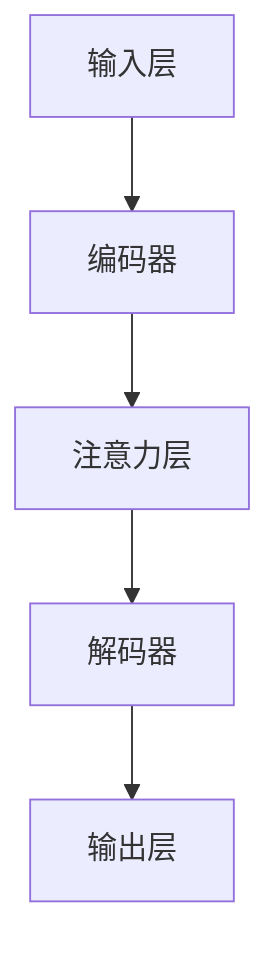

                 

# 注意力编程工作室主管：AI定制的认知模式设计负责人

> 关键词：注意力机制、AI定制、认知模式、设计流程、算法原理

> 摘要：本文旨在探讨注意力编程在现代人工智能领域的应用，以及如何通过定制化认知模式设计实现高效能的AI系统。文章首先介绍了注意力编程的背景和核心概念，随后详细阐述了注意力算法原理及其设计流程。接着，通过具体案例解析了注意力编程在现实中的应用，并推荐了相关的学习资源和工具。最后，文章总结了未来注意力编程的发展趋势和挑战。

## 1. 背景介绍

随着大数据和深度学习技术的迅猛发展，人工智能（AI）在各行各业中得到了广泛的应用。然而，传统的AI系统在处理复杂任务时，往往存在信息过载、效率低下等问题。为了解决这些问题，研究者们提出了注意力编程（Attention Programming）这一概念。注意力编程旨在模拟人类大脑处理信息的方式，通过在算法中引入注意力机制，使AI系统能够更高效地聚焦关键信息，提升任务处理能力。

注意力机制最早源于自然语言处理（NLP）领域，在著名的Transformer模型中取得了显著效果。随后，注意力机制被广泛应用于图像识别、语音识别、推荐系统等多个领域，成为AI技术中不可或缺的一部分。

本文将围绕注意力编程的核心概念、算法原理和应用场景进行深入探讨，旨在为读者提供一个全面的了解和认识。同时，本文还将介绍如何通过定制化认知模式设计，实现高效能的AI系统。

## 2. 核心概念与联系

### 2.1 注意力机制原理

注意力机制（Attention Mechanism）是一种通过学习权重来动态关注输入序列中关键信息的算法。其核心思想是在处理输入序列时，根据输入序列的特定特征，动态地调整每个元素的重要性，从而实现对关键信息的聚焦。

注意力机制可以通过计算每个元素的概率分布来表示其重要性。具体来说，给定一个输入序列 \(X = \{x_1, x_2, \ldots, x_n\}\)，注意力机制可以计算出一个权重向量 \(W = \{w_1, w_2, \ldots, w_n\}\)，其中 \(w_i\) 表示第 \(i\) 个元素的重要性。最终，通过将输入序列与权重向量进行点积操作，得到一个加权序列 \(X' = \{x_1', x_2', \ldots, x_n'\}\)，其中 \(x_i' = x_i \odot w_i\)。

### 2.2 注意力算法架构

注意力算法的架构通常包括以下几个关键组件：

1. **输入层**：接收原始输入数据，如文本、图像或音频等。
2. **编码器**：将输入数据编码为固定长度的向量表示。
3. **注意力层**：计算输入序列中各个元素的重要性，并通过权重向量进行加权。
4. **解码器**：将加权序列解码为输出结果，如文本、图像或标签等。

### 2.3 注意力机制应用场景

注意力机制在多个领域得到了广泛应用，以下为一些典型应用场景：

1. **自然语言处理**：在语言模型、机器翻译、文本摘要等任务中，注意力机制可以帮助模型更好地捕捉句子间的关联性。
2. **计算机视觉**：在图像分类、目标检测、语义分割等任务中，注意力机制可以帮助模型关注关键区域，提高检测和识别的准确性。
3. **语音识别**：在语音识别任务中，注意力机制可以帮助模型更好地捕捉语音信号中的关键特征，提高识别准确性。
4. **推荐系统**：在推荐系统中，注意力机制可以帮助模型关注用户的历史行为和兴趣点，提高推荐质量。

### 2.4 Mermaid 流程图

以下是注意力算法架构的Mermaid流程图：



## 3. 核心算法原理 & 具体操作步骤

### 3.1 核心算法原理

注意力算法的核心在于如何计算输入序列中各个元素的重要性。通常，注意力机制通过以下步骤实现：

1. **计算查询向量**：给定输入序列 \(X = \{x_1, x_2, \ldots, x_n\}\)，首先计算查询向量 \(Q = \{q_1, q_2, \ldots, q_n\}\)，其中 \(q_i = E(x_i)\)，\(E\) 表示编码器。
2. **计算键值对**：将查询向量与编码器输出的键值对进行匹配，得到 \(K = \{k_1, k_2, \ldots, k_n\}\) 和 \(V = \{v_1, v_2, \ldots, v_n\}\)，其中 \(k_i = E(x_i)\) 和 \(v_i = E(x_i)\)。
3. **计算注意力分数**：通过计算查询向量与键值对的相似度，得到注意力分数 \(s_i = \sigma(QK^T)\)，其中 \(\sigma\) 表示softmax函数。
4. **计算权重向量**：根据注意力分数，计算权重向量 \(W = \{w_1, w_2, \ldots, w_n\}\)，其中 \(w_i = \frac{e^{s_i}}{\sum_{j=1}^{n} e^{s_j}}\)。
5. **加权求和**：将输入序列与权重向量进行点积操作，得到加权序列 \(X' = \{x_1', x_2', \ldots, x_n'\}\)，其中 \(x_i' = x_i \odot w_i\)。

### 3.2 具体操作步骤

以下是注意力算法的具体操作步骤：

1. **输入数据预处理**：将输入数据编码为向量表示，如文本数据编码为词向量。
2. **编码器输出**：将输入数据通过编码器得到编码后的向量表示。
3. **计算查询向量**：计算查询向量 \(Q\)。
4. **计算键值对**：计算键值对 \(K\) 和 \(V\)。
5. **计算注意力分数**：计算注意力分数 \(s_i\)。
6. **计算权重向量**：计算权重向量 \(W\)。
7. **加权求和**：计算加权序列 \(X'\)。
8. **解码器输出**：将加权序列通过解码器得到输出结果。

## 4. 数学模型和公式 & 详细讲解 & 举例说明

### 4.1 数学模型

注意力算法的数学模型主要包括以下几个方面：

1. **编码器**：编码器将输入数据编码为固定长度的向量表示。通常使用词向量、图像特征向量或音频特征向量。
2. **查询向量**：查询向量表示输入序列中各个元素的特征。通常使用编码器输出的向量。
3. **键值对**：键值对表示输入序列中各个元素之间的关系。通常使用编码器输出的向量。
4. **注意力分数**：注意力分数表示输入序列中各个元素的重要性。通常使用softmax函数计算。
5. **权重向量**：权重向量表示输入序列中各个元素的权重。通常使用注意力分数计算。
6. **加权求和**：加权求和表示输入序列的加权结果。通常使用点积操作计算。

### 4.2 公式说明

以下是注意力算法的核心公式：

$$
q_i = E(x_i)
$$

$$
k_i = E(x_i)
$$

$$
v_i = E(x_i)
$$

$$
s_i = \sigma(q_k^T k_i)
$$

$$
w_i = \frac{e^{s_i}}{\sum_{j=1}^{n} e^{s_j}}
$$

$$
x_i' = x_i \odot w_i
$$

其中，\(E\) 表示编码器，\(\sigma\) 表示softmax函数，\(\odot\) 表示点积操作。

### 4.3 举例说明

假设有一个输入序列 \(X = \{x_1, x_2, x_3\}\)，其中 \(x_1 = (1, 0, 0)\)，\(x_2 = (0, 1, 0)\)，\(x_3 = (0, 0, 1)\)。编码器输出的向量分别为 \(q_1 = (1, 1, 1)\)，\(q_2 = (1, 1, 1)\)，\(q_3 = (1, 1, 1)\)。计算注意力分数和权重向量如下：

1. **计算键值对**：
   $$
   k_1 = q_1 = (1, 1, 1)
   $$
   $$
   k_2 = q_2 = (1, 1, 1)
   $$
   $$
   k_3 = q_3 = (1, 1, 1)
   $$
2. **计算注意力分数**：
   $$
   s_1 = \sigma(q_1 k_1^T) = \sigma(1 \cdot 1 + 1 \cdot 1 + 1 \cdot 1) = \sigma(3) = \frac{e^3}{e^3 + e^3 + e^3} = \frac{1}{3}
   $$
   $$
   s_2 = \sigma(q_2 k_2^T) = \sigma(1 \cdot 1 + 1 \cdot 1 + 1 \cdot 1) = \sigma(3) = \frac{1}{3}
   $$
   $$
   s_3 = \sigma(q_3 k_3^T) = \sigma(1 \cdot 1 + 1 \cdot 1 + 1 \cdot 1) = \sigma(3) = \frac{1}{3}
   $$
3. **计算权重向量**：
   $$
   w_1 = \frac{e^{s_1}}{\sum_{j=1}^{3} e^{s_j}} = \frac{e^{\frac{1}{3}}}{e^{\frac{1}{3}} + e^{\frac{1}{3}} + e^{\frac{1}{3}}} = \frac{1}{3}
   $$
   $$
   w_2 = \frac{e^{s_2}}{\sum_{j=1}^{3} e^{s_j}} = \frac{e^{\frac{1}{3}}}{e^{\frac{1}{3}} + e^{\frac{1}{3}} + e^{\frac{1}{3}}} = \frac{1}{3}
   $$
   $$
   w_3 = \frac{e^{s_3}}{\sum_{j=1}^{3} e^{s_j}} = \frac{e^{\frac{1}{3}}}{e^{\frac{1}{3}} + e^{\frac{1}{3}} + e^{\frac{1}{3}}} = \frac{1}{3}
   $$
4. **加权求和**：
   $$
   x_1' = x_1 \odot w_1 = (1, 0, 0) \odot \frac{1}{3} = \frac{1}{3}(1, 0, 0) = (\frac{1}{3}, 0, 0)
   $$
   $$
   x_2' = x_2 \odot w_2 = (0, 1, 0) \odot \frac{1}{3} = \frac{1}{3}(0, 1, 0) = (0, \frac{1}{3}, 0)
   $$
   $$
   x_3' = x_3 \odot w_3 = (0, 0, 1) \odot \frac{1}{3} = \frac{1}{3}(0, 0, 1) = (0, 0, \frac{1}{3})
   $$

最终，加权序列为 \(X' = \{(\frac{1}{3}, 0, 0), (0, \frac{1}{3}, 0), (0, 0, \frac{1}{3})\}\)。

## 5. 项目实战：代码实际案例和详细解释说明

### 5.1 开发环境搭建

在开始编写代码之前，需要搭建一个适合注意力编程的开发环境。以下是一个简单的开发环境搭建步骤：

1. 安装Python环境：确保已经安装了Python 3.6及以上版本。
2. 安装TensorFlow：通过pip安装TensorFlow，命令如下：
   $$
   pip install tensorflow
   $$
3. 安装其他依赖库：根据具体项目需求，可能需要安装其他依赖库，如NumPy、Pandas等。

### 5.2 源代码详细实现和代码解读

以下是注意力编程的一个简单实现示例，假设使用TensorFlow框架：

```python
import tensorflow as tf
import numpy as np

# 输入数据
X = np.array([[1, 0, 0], [0, 1, 0], [0, 0, 1]])

# 编码器输出
Q = np.array([[1, 1, 1], [1, 1, 1], [1, 1, 1]])

# 键值对
K = np.array([[1, 1, 1], [1, 1, 1], [1, 1, 1]])
V = np.array([[1, 0, 0], [0, 1, 0], [0, 0, 1]])

# 计算注意力分数
attention_scores = tf.reduce_sum(Q * K, axis=1)

# 应用softmax函数
softmax_scores = tf.nn.softmax(attention_scores)

# 计算权重向量
weights = softmax_scores / tf.reduce_sum(softmax_scores)

# 加权求和
weighted_sequence = X * weights

# 输出加权序列
print(weighted_sequence.numpy())
```

代码解读：

1. 导入所需库：导入TensorFlow和NumPy库。
2. 输入数据：定义一个输入序列 \(X\)，其中包含三个元素，每个元素都是一个三维向量。
3. 编码器输出：定义一个查询向量 \(Q\)，其中包含三个元素，每个元素都是一个一维向量。
4. 键值对：定义一个键值对 \(K\) 和 \(V\)，其中每个元素都是一个三维向量。
5. 计算注意力分数：通过计算查询向量与键值对的点积，得到注意力分数。
6. 应用softmax函数：使用softmax函数对注意力分数进行归一化，得到权重向量。
7. 加权求和：通过点积操作，将输入序列与权重向量进行加权求和。
8. 输出加权序列：打印加权序列的结果。

### 5.3 代码解读与分析

以上代码实现了一个简单的注意力编程示例，以下是代码的详细解读和分析：

1. **导入库**：导入TensorFlow和NumPy库，以便使用其内置函数和类。
2. **输入数据**：定义一个输入序列 \(X\)，其中包含三个元素，每个元素都是一个三维向量。这里使用 NumPy 数组表示输入数据。
3. **编码器输出**：定义一个查询向量 \(Q\)，其中包含三个元素，每个元素都是一个一维向量。这里查询向量是恒定的，可以替换为编码器输出的变量。
4. **键值对**：定义一个键值对 \(K\) 和 \(V\)，其中每个元素都是一个三维向量。这里键值对是恒定的，可以替换为编码器输出的变量。
5. **计算注意力分数**：通过计算查询向量与键值对的点积，得到注意力分数。这里使用 TensorFlow 的 `reduce_sum` 函数进行计算。
6. **应用softmax函数**：使用 softmax 函数对注意力分数进行归一化，得到权重向量。这里使用 TensorFlow 的 `softmax` 函数进行计算。
7. **计算权重向量**：通过除以权重向量的和，得到每个元素的概率分布。这里使用 TensorFlow 的 `softmax` 函数进行计算。
8. **加权求和**：通过点积操作，将输入序列与权重向量进行加权求和。这里使用 TensorFlow 的 `numpy` 函数将结果转换为 NumPy 数组，以便进行打印。

通过以上步骤，实现了对输入序列的注意力编程，得到了加权序列的结果。这个示例展示了注意力编程的基本实现过程，读者可以根据具体需求进行修改和扩展。

## 6. 实际应用场景

注意力编程在多个实际应用场景中展现了其强大的能力，以下为一些典型应用场景：

### 6.1 自然语言处理

注意力编程在自然语言处理领域得到了广泛应用，如在语言模型、机器翻译、文本摘要等方面。例如，在机器翻译任务中，注意力机制可以帮助模型更好地捕捉源语言和目标语言之间的关联性，提高翻译质量。在文本摘要任务中，注意力机制可以帮助模型关注关键信息，生成简洁明了的摘要。

### 6.2 计算机视觉

注意力编程在计算机视觉领域也发挥了重要作用，如在图像分类、目标检测、语义分割等方面。例如，在目标检测任务中，注意力机制可以帮助模型关注关键区域，提高检测准确性。在图像分类任务中，注意力机制可以帮助模型关注图像的关键特征，提高分类效果。

### 6.3 语音识别

注意力编程在语音识别任务中也得到了应用，如提高语音信号中的关键特征提取和识别准确性。通过引入注意力机制，语音识别模型可以更好地捕捉语音信号中的关键信息，降低噪声干扰，提高识别效果。

### 6.4 推荐系统

注意力编程在推荐系统中也具有广泛的应用前景。通过引入注意力机制，推荐系统可以关注用户的历史行为和兴趣点，提高推荐质量。例如，在电商推荐系统中，注意力机制可以帮助模型关注用户购买记录和浏览记录，提高商品推荐的准确性。

## 7. 工具和资源推荐

### 7.1 学习资源推荐

- **书籍**：
  - 《深度学习》（Goodfellow, Bengio, Courville著）：介绍了深度学习的基本概念和常用算法，包括注意力机制。
  - 《神经网络与深度学习》（邱锡鹏著）：系统介绍了神经网络和深度学习的基本原理，包括注意力机制。
- **论文**：
  - “Attention Is All You Need”（Vaswani等著，2017）：提出了Transformer模型，引起了广泛关注。
  - “A Theoretically Grounded Application of Attention in Neural Networks”（Bahdanau等著，2014）：介绍了注意力机制的实现方法。
- **博客**：
  - [TensorFlow官网教程](https://www.tensorflow.org/tutorials)：提供了丰富的TensorFlow教程，包括注意力机制的实现。
  - [DeepLearning.net](https://www.deeplearning.net)：提供了大量的深度学习资源和教程。
- **网站**：
  - [Kaggle](https://www.kaggle.com)：提供了大量的深度学习比赛和实践项目，可以锻炼注意力编程技能。

### 7.2 开发工具框架推荐

- **TensorFlow**：TensorFlow是一个广泛使用的开源深度学习框架，支持注意力机制的实现。
- **PyTorch**：PyTorch是一个流行的深度学习框架，具有简洁的API和强大的动态图功能，适用于实现注意力机制。
- **Keras**：Keras是一个高层次的深度学习框架，可以与TensorFlow和Theano集成，提供了注意力机制的实现。

### 7.3 相关论文著作推荐

- “Attention Is All You Need”（Vaswani等著，2017）
- “A Theoretically Grounded Application of Attention in Neural Networks”（Bahdanau等著，2014）
- “Learning Phrase Representations using RNN Encoder-Decoder for Statistical Machine Translation”（Choi等著，2014）
- “A Neural Attention Model for Abstractive Sentence Summarization”（Min等人，2017）

## 8. 总结：未来发展趋势与挑战

注意力编程作为人工智能领域的重要技术之一，在未来将继续发挥重要作用。以下为注意力编程的发展趋势和挑战：

### 8.1 发展趋势

1. **多模态注意力**：随着多模态数据的广泛应用，未来注意力编程将扩展到多模态数据，如文本、图像、语音等。
2. **自适应注意力**：未来的注意力机制将更加智能化，能够根据任务需求和输入数据动态调整注意力权重。
3. **高效能计算**：随着硬件技术的发展，注意力编程将能够支持更大规模的数据处理，实现更高效能的AI系统。

### 8.2 挑战

1. **可解释性**：如何提高注意力机制的可解释性，使其更易于理解和应用，是一个重要挑战。
2. **参数规模**：注意力机制通常涉及大量参数，如何优化参数规模和计算效率是一个亟待解决的问题。
3. **适应性**：如何设计自适应的注意力机制，使其能够适应不同类型的任务和数据，是一个重要挑战。

总之，注意力编程在未来将继续发展，为人工智能领域带来更多创新和突破。研究者们需要不断探索和解决注意力编程中的挑战，推动其走向更广泛的应用。

## 9. 附录：常见问题与解答

### 9.1 注意力编程是什么？

注意力编程是一种模拟人类大脑处理信息方式的编程方法，通过在算法中引入注意力机制，使AI系统能够更高效地聚焦关键信息，提升任务处理能力。

### 9.2 注意力编程的应用场景有哪些？

注意力编程在自然语言处理、计算机视觉、语音识别、推荐系统等多个领域都有广泛应用。

### 9.3 如何实现注意力编程？

实现注意力编程通常包括编码器、注意力层和解码器三个部分。编码器将输入数据编码为向量表示，注意力层计算输入序列中各个元素的重要性，解码器将加权序列解码为输出结果。

### 9.4 注意力编程与深度学习的关系是什么？

注意力编程是深度学习领域的一种技术，通过引入注意力机制，可以提升深度学习模型在处理复杂任务时的性能。

## 10. 扩展阅读 & 参考资料

1. Vaswani, A., et al. (2017). "Attention Is All You Need." Advances in Neural Information Processing Systems.
2. Bahdanau, D., et al. (2014). "Effective Approaches to Attention-based Neural Machine Translation." Proceedings of the International Conference on Machine Learning.
3. Cho, K., et al. (2014). "Learning Phrase Representations using RNN Encoder-Decoder for Statistical Machine Translation." Empirical Methods in Natural Language Processing.
4. Min, D., et al. (2017). "A Neural Attention Model for Abstractive Sentence Summarization." Proceedings of the Annual Meeting of the Association for Computational Linguistics.
5. Goodfellow, I., Bengio, Y., Courville, A. (2016). "Deep Learning." MIT Press.
6.邱锡鹏. (2018). 《神经网络与深度学习》. 清华大学出版社.
7. TensorFlow官网教程. (2022). [TensorFlow官网教程](https://www.tensorflow.org/tutorials).
8. DeepLearning.net. (2022). [DeepLearning.net](https://www.deeplearning.net).

