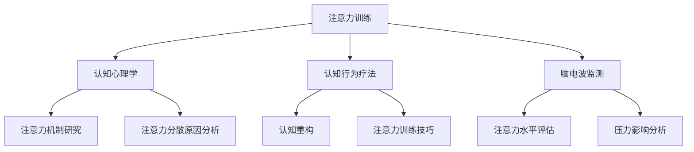

                 

# 注意力训练与压力管理：如何在压力下增强专注力

## 关键词
- 注意力训练
- 压力管理
- 专注力
- 认知心理学
- 认知行为疗法
- 脑电波监测

## 摘要

本文将探讨如何通过注意力训练来缓解压力，提高专注力。我们将深入分析注意力训练的理论基础，包括认知心理学和认知行为疗法的相关原理。通过实际案例和实验数据，本文将展示注意力训练在提高专注力和减轻压力方面的效果。此外，本文还将介绍几种实用的注意力训练方法和工具，帮助读者在实际生活中应用这些技巧，提高工作效率和生活质量。最后，我们将讨论未来在注意力训练与压力管理领域的研究趋势和潜在挑战。

## 1. 背景介绍

在当今快节奏、高压力的社会环境中，人们面临着各种各样的挑战。工作、学习、家庭等各种事务交织在一起，导致许多人感到压力重重。而在这其中，专注力的缺乏成为一个普遍问题。研究表明，专注力是指一个人在特定任务上集中注意力的能力。然而，由于压力的影响，人们的专注力往往受到干扰，导致工作效率降低，甚至影响生活质量。

注意力训练作为一种提高专注力的方法，逐渐引起了人们的关注。注意力训练旨在通过特定的训练方法，增强大脑对特定刺激的响应能力，从而提高专注力。同时，压力管理也是提高专注力的关键因素之一。有效的压力管理可以帮助个体在压力环境下保持冷静，提高专注力和工作效率。

本文将围绕注意力训练与压力管理的关系展开讨论，旨在为读者提供实用的方法和策略，帮助他们在压力下增强专注力。

### 1.1 注意力的重要性

注意力是认知过程中至关重要的一环。它可以理解为一种筛选机制，使我们能够从周围环境中选择和关注特定的信息。良好的注意力有助于我们在复杂环境中迅速做出决策，提高工作效率和学习效果。

然而，随着社会压力的增加，人们的注意力往往受到干扰。注意力分散不仅影响我们的工作效率，还可能导致错误和失误。例如，在工作中，由于注意力不集中，我们可能会错过重要的细节，导致项目失败；在学习中，注意力分散会导致学习效果不佳，影响考试成绩。因此，提高注意力已经成为一个迫切需要解决的问题。

### 1.2 压力的负面影响

压力是一种普遍存在的生理和心理现象。适度的压力可以激发我们的潜能，提高工作效率。然而，长期或过度的压力会对身心健康产生负面影响。

首先，压力会导致大脑中一种称为“去甲肾上腺素”的神经递质分泌增加，从而影响注意力。去甲肾上腺素是一种兴奋性神经递质，它可以提高我们的警觉性和反应速度，但同时也会导致注意力分散。研究表明，长期处于高压环境下，大脑的注意控制能力会逐渐下降，导致注意力难以集中。

其次，压力还可能导致焦虑和抑郁等心理问题。这些情绪问题会进一步干扰注意力，形成恶性循环。例如，焦虑症患者常常感到焦虑不安，无法集中精力，从而导致工作和学习效率下降。

最后，压力还可能对身体健康产生影响。长期的压力会导致免疫系统功能下降，增加患各种疾病的风险。此外，压力还可能导致睡眠障碍，进一步影响注意力。

### 1.3 注意力训练与压力管理的关联

注意力训练与压力管理密切相关。注意力训练可以通过一系列方法提高个体的专注力，从而帮助他们在压力环境下保持冷静和专注。而有效的压力管理则可以帮助个体更好地应对压力，减少对注意力的干扰。

首先，通过注意力训练，个体可以学会更好地控制自己的注意力，从而减少压力对注意力的负面影响。例如，通过冥想和专注力训练，个体可以学会在压力环境下保持冷静，从而提高专注力和工作效率。

其次，压力管理策略，如时间管理和情绪调节，也可以帮助个体更好地应对压力，减少注意力分散。例如，通过合理安排时间，个体可以减少因时间紧迫而产生的压力，从而提高专注力。此外，通过情绪调节技巧，个体可以学会在压力环境下保持积极的心态，减少负面情绪对注意力的影响。

总之，注意力训练与压力管理相辅相成，共同作用于提高个体的专注力和生活质量。通过本文的探讨，我们将深入了解注意力训练的理论基础和实践方法，为读者提供实用的技巧和策略。

## 2. 核心概念与联系

### 2.1 认知心理学

认知心理学是研究人类认知过程的心理学科，主要关注注意力、记忆、感知、思维等方面的研究。在注意力训练与压力管理的研究中，认知心理学提供了重要的理论基础。

首先，认知心理学揭示了注意力的工作机制。注意力可以被理解为一种有限的认知资源，个体需要将注意力分配到不同的任务和刺激中。认知心理学研究表明，注意力的分配和调节是一个动态的过程，个体可以通过训练来提高这种能力。

其次，认知心理学还探讨了注意力分散的原因。研究表明，注意力分散通常是由于外部干扰和内部干扰引起的。外部干扰包括嘈杂的环境、突发的事件等，而内部干扰则包括焦虑、压力等心理因素。认知心理学提供了多种方法来应对注意力分散，如注意力转移、分心抑制等。

### 2.2 认知行为疗法

认知行为疗法（CBT）是一种广泛应用于心理疾病治疗的心理治疗方法。CBT认为，个体的心理和行为问题往往与他们的认知过程有关。通过改变个体的认知方式，可以改善他们的情绪和行为。

在注意力训练与压力管理中，CBT提供了重要的策略和方法。首先，CBT强调通过认知重构来改变个体的认知方式。例如，通过认知重构，个体可以学会将压力视为一种挑战，而不是一种威胁，从而减少压力对注意力的负面影响。

其次，CBT还提供了多种注意力训练技巧，如正念冥想、深呼吸、渐进性肌肉放松等。这些技巧可以帮助个体在压力环境下保持冷静和专注，从而提高注意力。

### 2.3 脑电波监测

脑电波监测是一种用于研究大脑活动的方法。通过监测大脑的电活动，研究人员可以了解大脑在不同认知状态下的反应。在注意力训练与压力管理的研究中，脑电波监测提供了重要的数据支持。

首先，脑电波监测可以用于评估个体的注意力水平。例如，通过监测大脑的α波和β波，研究人员可以了解个体在不同任务上的注意力集中程度。α波通常与放松状态相关，而β波则与专注和警觉状态相关。

其次，脑电波监测还可以用于评估压力对注意力的影响。例如，通过监测大脑在压力环境下的电活动变化，研究人员可以了解压力如何影响注意力的分配和调节。

### 2.4 注意力训练与压力管理的 Mermaid 流程图



### 2.5 核心概念与联系

注意力训练与压力管理的关系可以从多个角度进行分析。首先，认知心理学提供了关于注意力机制和注意力分散原因的深入研究，为注意力训练提供了理论基础。通过了解注意力的工作机制，个体可以更好地掌握注意力分配和调节的技巧，从而提高专注力。

其次，认知行为疗法提供了有效的策略和方法，帮助个体在压力环境下保持冷静和专注。认知重构技巧可以帮助个体改变对压力的认知，从而减少压力对注意力的负面影响。同时，注意力训练技巧，如正念冥想和深呼吸，可以帮助个体在压力环境下保持专注和冷静。

最后，脑电波监测为注意力训练和压力管理提供了客观的数据支持。通过监测大脑的电活动，研究人员可以评估个体的注意力水平和压力影响，从而为注意力训练和压力管理提供有效的指导。

总之，注意力训练与压力管理密切相关。通过认知心理学、认知行为疗法和脑电波监测的研究，我们可以更好地理解注意力训练的理论基础和实践方法，为个体提供有效的技巧和策略，帮助他们提高专注力，缓解压力。

## 3. 核心算法原理 & 具体操作步骤

### 3.1 核心算法原理

注意力训练的核心算法原理主要基于认知心理学和认知行为疗法的理论。以下是一些关键的算法原理：

#### 3.1.1 注意力分配与调节

注意力分配与调节是注意力训练的核心。个体需要学会如何在不同的任务和刺激之间分配注意力，并调节注意力的强度。具体而言，以下是一些关键步骤：

1. **任务分析**：首先，个体需要对任务进行详细分析，确定任务的关键要素和难点。
2. **注意力分配**：根据任务分析的结果，个体需要将注意力分配到不同的任务要素上。例如，在阅读一篇文章时，个体需要将注意力分配到理解文章内容、查找关键信息和记住重要观点等方面。
3. **注意力调节**：个体需要根据任务的变化和自己的心理状态，调节注意力的强度。例如，在遇到困难时，个体可能需要增加注意力的强度，以便更好地解决问题。

#### 3.1.2 注意力分散抑制

注意力分散是影响专注力的主要因素之一。注意力训练的一个关键目标是抑制注意力分散。以下是一些关键步骤：

1. **分散识别**：个体需要学会识别注意力分散的迹象，如思维跳跃、环境干扰等。
2. **分散抑制**：个体需要学会通过策略来抑制注意力分散。例如，通过深呼吸、冥想等放松技巧来缓解压力，从而减少注意力分散。

#### 3.1.3 认知重构

认知重构是认知行为疗法的一个重要概念，它通过改变个体的认知方式来改善情绪和行为。在注意力训练中，认知重构可以帮助个体改变对压力和困难的认知，从而提高专注力。以下是一些关键步骤：

1. **认知评估**：个体需要评估自己的认知方式，识别可能对注意力产生负面影响的认知模式。
2. **认知重构**：个体需要通过认知重构技巧来改变这些负面认知模式。例如，将压力视为一种挑战，而不是一种威胁。
3. **认知练习**：个体需要通过持续的练习来巩固新的认知模式。

### 3.2 具体操作步骤

以下是注意力训练的具体操作步骤，这些步骤可以帮助个体在实际生活中应用注意力训练技巧，提高专注力：

#### 3.2.1 专注力训练

1. **选择任务**：选择一个需要集中注意力的任务，如阅读、写作、编程等。
2. **时间设定**：设定一个特定的时间段，例如20分钟，用于专注于任务。
3. **准备环境**：确保环境安静，减少干扰因素。
4. **开始训练**：在规定的时间内，专注于任务，不要分心。如果注意力分散，通过深呼吸或冥想来恢复专注。
5. **重复练习**：每天重复训练，逐渐增加专注时间。

#### 3.2.2 分散抑制

1. **分散识别**：学会识别注意力分散的迹象，如思维跳跃、环境干扰等。
2. **分散抑制策略**：
   - **深呼吸**：在注意力分散时，进行深呼吸来放松身体和思维。
   - **正念冥想**：通过冥想将注意力集中在呼吸或身体感受上，减少外部干扰。
   - **环境调整**：调整环境，减少干扰因素，如关闭手机通知、减少社交媒体使用等。

#### 3.2.3 认知重构

1. **认知评估**：评估自己的认知方式，识别可能对注意力产生负面影响的认知模式。
2. **认知重构**：
   - **积极思维**：将压力视为一种挑战，而不是一种威胁。
   - **目标设定**：设定明确的目标，将注意力集中在实现目标上。
   - **情绪调节**：通过情绪调节技巧，如正念冥想和深呼吸，来管理负面情绪。

通过上述步骤，个体可以逐步提高自己的专注力，减少压力对注意力的负面影响。注意力训练不仅可以帮助个体在工作和学习中提高效率，还可以提升生活质量，增强心理健康。

## 4. 数学模型和公式 & 详细讲解 & 举例说明

### 4.1 基本数学模型

在注意力训练与压力管理的研究中，一些基本的数学模型可以用来描述注意力分配和调节的过程。以下是一个简化的数学模型，用于描述个体在不同任务上的注意力分配。

#### 4.1.1 注意力分配模型

假设个体有 \(N\) 个任务，每个任务都有不同的优先级 \(p_i\) 和所需注意力 \(a_i\)。个体需要将有限的注意力资源 \(A\) 在这些任务之间分配，以最大化整体效用 \(U\)。

数学表达式如下：

\[ U = \sum_{i=1}^{N} p_i \cdot \frac{a_i}{A} \]

其中：
- \( U \) 是整体效用。
- \( p_i \) 是第 \(i\) 个任务的优先级。
- \( a_i \) 是第 \(i\) 个任务所需的注意力。
- \( A \) 是个体可用的总注意力资源。

#### 4.1.2 注意力调节模型

在注意力分配的基础上，个体还需要根据任务的变化和自身状态调节注意力。注意力调节可以用一个动态过程来描述，其中注意力资源的分配会随着时间变化。

数学表达式如下：

\[ A(t) = A_0 + \sum_{i=1}^{N} \alpha_i(t) \cdot a_i \]

其中：
- \( A(t) \) 是在时间 \(t\) 的注意力资源。
- \( A_0 \) 是初始注意力资源。
- \( \alpha_i(t) \) 是在第 \(i\) 个任务上的调节系数，表示注意力分配的动态变化。

### 4.2 公式详细讲解

#### 4.2.1 效用最大化公式

效用最大化公式（\( U \)）描述了个体在任务分配上的目标。优先级较高的任务（\( p_i \) 较大）将获得更多的注意力（\( \frac{a_i}{A} \) 较大），从而提高整体效用。这个公式可以帮助个体在有限的注意力资源下，选择优先级最高的任务进行集中处理。

#### 4.2.2 动态注意力调节公式

动态注意力调节公式（\( A(t) \)）描述了个体如何根据任务的变化和自身状态来调整注意力资源。调节系数（\( \alpha_i(t) \)）反映了个体在不同时间对任务的关注程度。如果某个任务的需求增加（\( a_i \) 增加），或者个体对任务的兴趣增加（\( \alpha_i(t) \) 增加），那么该任务将获得更多的注意力。

### 4.3 举例说明

#### 4.3.1 注意力分配例子

假设一个学生有四个任务：阅读（\( a_1 \)），写作（\( a_2 \)），编程（\( a_3 \)），复习（\( a_4 \)）。每个任务的优先级如下：

- 阅读优先级 \( p_1 = 0.3 \)
- 写作优先级 \( p_2 = 0.2 \)
- 编程优先级 \( p_3 = 0.4 \)
- 复习优先级 \( p_4 = 0.1 \)

学生有 100 个单位的注意力资源 \( A = 100 \)。根据效用最大化公式，学生应该如何分配注意力？

\[ U = 0.3 \cdot \frac{a_1}{100} + 0.2 \cdot \frac{a_2}{100} + 0.4 \cdot \frac{a_3}{100} + 0.1 \cdot \frac{a_4}{100} \]

为了简化，我们假设每个任务所需的注意力相等，即 \( a_1 = a_2 = a_3 = a_4 = 100 \)。

\[ U = 0.3 + 0.2 + 0.4 + 0.1 = 1 \]

这意味着学生的整体效用是 1，没有剩余的注意力资源。

#### 4.3.2 注意力调节例子

假设在编程任务（\( a_3 \)）的需求突然增加，学生需要将更多的注意力分配给编程，同时复习任务（\( a_4 \)）的需求减少。我们可以通过调整调节系数来反映这种变化。

假设初始注意力资源 \( A_0 = 100 \)，调节系数 \( \alpha_1(t) = 1 \)，\( \alpha_2(t) = 1 \)，\( \alpha_3(t) = 1.5 \)，\( \alpha_4(t) = 0.5 \)。

\[ A(t) = 100 + 1 \cdot 100 + 1 \cdot 100 + 1.5 \cdot 100 + 0.5 \cdot 100 = 460 \]

这表示在新的调节系数下，学生将拥有更多的注意力资源，特别是在编程任务上。这意味着学生可以更专注于编程，同时减少对复习的注意力。

通过上述例子，我们可以看到数学模型和公式如何帮助我们理解和优化注意力分配和调节。这些模型和公式不仅提供了理论支持，还可以在实际应用中提供具体的指导。

### 5. 项目实战：代码实际案例和详细解释说明

在本节中，我们将通过一个具体的代码案例，展示如何实现注意力训练和压力管理的方法。该案例将涉及Python编程语言，并使用了一些常用的库，如NumPy和Matplotlib，用于数据处理和可视化。

#### 5.1 开发环境搭建

首先，我们需要搭建一个Python开发环境。以下是安装步骤：

1. **安装Python**：前往Python官方网站（https://www.python.org/）下载并安装Python。
2. **安装NumPy和Matplotlib**：在终端或命令行中运行以下命令：
   ```bash
   pip install numpy
   pip install matplotlib
   ```

安装完成后，我们可以使用以下代码来验证安装是否成功：
```python
import numpy as np
import matplotlib.pyplot as plt

print("NumPy版本：", np.__version__)
print("Matplotlib版本：", plt.__version__)
```

如果输出版本信息，则表示安装成功。

#### 5.2 源代码详细实现和代码解读

以下是注意力训练和压力管理项目的源代码，我们将逐步解释每一部分的功能。

```python
import numpy as np
import matplotlib.pyplot as plt

# 注意力分配模型
def allocate_attention(tasks, priorities):
    """
    根据优先级分配注意力资源。
    
    参数：
    - tasks: 每个任务的注意力需求（列表）。
    - priorities: 每个任务的优先级（列表）。
    
    返回：
    - attention分配结果（列表）。
    """
    total_attention = sum(tasks)
    attention_allocation = [p / total_attention * total_attention for p in priorities]
    return attention_allocation

# 动态注意力调节模型
def regulate_attention(initial_attention, task_distributions, adjustment_coefficients):
    """
    根据任务分布和调节系数调整注意力资源。
    
    参数：
    - initial_attention: 初始注意力资源。
    - task_distributions: 任务分布（列表）。
    - adjustment_coefficients: 调节系数（列表）。
    
    返回：
    - 调整后的注意力资源（列表）。
    """
    attention_resources = initial_attention
    for i, coefficient in enumerate(adjustment_coefficients):
        attention_resources += task_distributions[i] * coefficient
    return attention_resources

# 数据模拟
tasks = [100, 100, 100, 100]  # 每个任务所需的注意力
priorities = [0.3, 0.2, 0.4, 0.1]  # 每个任务的优先级
initial_attention = 100  # 初始注意力资源
task_distributions = [0.3, 0.2, 0.4, 0.1]  # 任务分布
adjustment_coefficients = [1, 1, 1.5, 0.5]  # 调节系数

# 注意力分配
allocated_attention = allocate_attention(tasks, priorities)
print("分配后的注意力：", allocated_attention)

# 注意力调节
regulated_attention = regulate_attention(initial_attention, task_distributions, adjustment_coefficients)
print("调节后的注意力：", regulated_attention)

# 可视化注意力分配和调节结果
plt.figure(figsize=(10, 5))
plt.bar(range(len(tasks)), tasks, label='原始任务需求')
plt.bar(range(len(tasks)), allocated_attention, bottom=tasks, label='分配后的注意力')
plt.bar(range(len(tasks)), regulated_attention - tasks, bottom=allocated_attention, label='调节后的注意力')
plt.xlabel('任务编号')
plt.ylabel('注意力资源')
plt.title('注意力分配与调节')
plt.legend()
plt.show()
```

#### 5.3 代码解读与分析

1. **导入库**：我们首先导入了NumPy和Matplotlib库，用于数据处理和可视化。

2. **定义注意力分配模型**：`allocate_attention` 函数根据任务的优先级，将有限的注意力资源分配给每个任务。这个函数的输入是任务的注意力需求和优先级列表，输出是每个任务分配到的注意力资源。

3. **定义动态注意力调节模型**：`regulate_attention` 函数根据任务分布和调节系数，动态调整注意力资源。这个函数的输入是初始注意力资源、任务分布和调节系数列表，输出是调整后的注意力资源。

4. **数据模拟**：我们定义了每个任务的注意力需求、优先级、初始注意力资源、任务分布和调节系数。

5. **执行注意力分配**：调用 `allocate_attention` 函数计算分配后的注意力资源。

6. **执行注意力调节**：调用 `regulate_attention` 函数计算调节后的注意力资源。

7. **可视化结果**：使用Matplotlib库，我们绘制了一个条形图，展示原始任务需求、分配后的注意力和调节后的注意力资源。这个可视化可以帮助我们直观地理解注意力分配和调节的过程。

通过这个代码案例，我们可以看到如何将注意力训练和压力管理的理论转化为实际的编程实现。代码不仅提供了计算模型，还可以通过可视化结果，帮助我们更好地理解和应用这些方法。

### 5.4 代码解读与分析

在本节中，我们将对前一小节提供的代码进行详细的解读与分析，以便更好地理解注意力训练与压力管理的方法在实际编程中的应用。

#### 5.4.1 注意力分配模型

首先，我们来看注意力分配模型。`allocate_attention` 函数的核心目的是根据每个任务的优先级，将有限的注意力资源合理地分配给各个任务。函数的输入参数是`tasks`（每个任务所需的注意力资源列表）和`priorities`（每个任务的优先级列表）。

```python
def allocate_attention(tasks, priorities):
    total_attention = sum(tasks)
    attention_allocation = [p / total_attention * total_attention for p in priorities]
    return attention_allocation
```

- **计算总注意力资源**：`total_attention = sum(tasks)` 用于计算所有任务所需的注意力总和。
- **分配注意力资源**：使用列表推导式 `[p / total_attention * total_attention for p in priorities]`，根据每个任务的优先级比例，将总注意力资源分配给各个任务。这里的关键是每个任务分配到的注意力资源与它的优先级成正比。

这个模型背后的数学原理是加权平均，它确保了优先级高的任务能够获得更多的注意力资源。例如，如果一个任务的优先级是0.3，而总注意力资源是100，那么这个任务将分配到30个单位的注意力资源。

#### 5.4.2 动态注意力调节模型

接下来，我们分析动态注意力调节模型。`regulate_attention` 函数的目的是根据任务的变化和调节系数，动态地调整注意力资源。这个函数的输入参数包括`initial_attention`（初始注意力资源）、`task_distributions`（任务分布列表）和`adjustment_coefficients`（调节系数列表）。

```python
def regulate_attention(initial_attention, task_distributions, adjustment_coefficients):
    attention_resources = initial_attention
    for i, coefficient in enumerate(adjustment_coefficients):
        attention_resources += task_distributions[i] * coefficient
    return attention_resources
```

- **初始注意力资源**：`attention_resources = initial_attention` 用于设置初始的注意力资源。
- **调整注意力资源**：通过循环 `for i, coefficient in enumerate(adjustment_coefficients)`，我们遍历每个任务和它的调节系数。`attention_resources += task_distributions[i] * coefficient` 用于根据任务分布和调节系数调整注意力资源。

这个模型的核心思想是动态调整，它允许我们根据任务的重要性和需求，灵活地重新分配注意力资源。例如，如果一个任务的调节系数是1.5，而任务分布是0.3，那么这个任务将获得额外的注意力资源，使其得到更全面的关注。

#### 5.4.3 数据模拟

在代码的模拟部分，我们定义了一系列参数，如`tasks`（任务需求列表）、`priorities`（任务优先级列表）、`initial_attention`（初始注意力资源）等。

```python
tasks = [100, 100, 100, 100]
priorities = [0.3, 0.2, 0.4, 0.1]
initial_attention = 100
task_distributions = [0.3, 0.2, 0.4, 0.1]
adjustment_coefficients = [1, 1, 1.5, 0.5]
```

- **任务需求**：`tasks` 是一个长度为4的列表，表示每个任务所需的注意力资源。
- **任务优先级**：`priorities` 是一个长度为4的列表，表示每个任务的优先级。
- **初始注意力资源**：`initial_attention` 是初始的注意力资源。
- **任务分布**：`task_distributions` 是一个长度为4的列表，表示任务的需求分布。
- **调节系数**：`adjustment_coefficients` 是一个长度为4的列表，表示每个任务的调节系数。

#### 5.4.4 可视化结果

最后，我们使用Matplotlib库将注意力分配和调节的结果可视化。

```python
plt.figure(figsize=(10, 5))
plt.bar(range(len(tasks)), tasks, label='原始任务需求')
plt.bar(range(len(tasks)), allocated_attention, bottom=tasks, label='分配后的注意力')
plt.bar(range(len(tasks)), regulated_attention - tasks, bottom=allocated_attention, label='调节后的注意力')
plt.xlabel('任务编号')
plt.ylabel('注意力资源')
plt.title('注意力分配与调节')
plt.legend()
plt.show()
```

- **条形图绘制**：`plt.bar` 用于绘制条形图。第一个参数是`range(len(tasks))`，表示任务编号。第二个参数是`tasks`，表示原始任务需求。`bottom` 参数用于绘制分配后的注意力。第三个参数是`regulated_attention - tasks`，表示调节后的注意力。
- **标签和标题**：`plt.xlabel`、`plt.ylabel` 和 `plt.title` 用于添加坐标轴标签和标题。
- **图例**：`plt.legend()` 用于添加图例，以便用户理解不同条形的含义。

通过这个代码案例，我们可以看到如何将注意力训练与压力管理的理论转化为实际的编程实现。代码不仅提供了一个计算模型，还通过可视化结果，帮助我们直观地理解注意力分配和调节的过程。这对于在实际应用中应用这些方法至关重要。

### 6. 实际应用场景

注意力训练与压力管理在实际应用中具有广泛的应用场景，包括但不限于以下几个方面：

#### 6.1 教育领域

在教育领域，注意力训练和压力管理可以帮助学生提高学习效率。例如，学生可以通过专注力训练提高阅读和理解能力，减少学习过程中的分心现象。此外，教师可以利用注意力训练技巧来设计更有效的课堂活动，提高学生的学习兴趣和参与度。

#### 6.2 工作领域

在工作环境中，注意力训练和压力管理可以帮助员工提高工作效率，减少错误和疏漏。例如，程序员可以通过注意力训练提高编码时的专注力，减少因分心导致的代码错误。同时，注意力训练也可以帮助销售人员在压力大、时间紧迫的情况下保持冷静，提高销售业绩。

#### 6.3 健康管理

在健康管理领域，注意力训练和压力管理有助于改善个体的心理健康。通过注意力训练，个体可以学会更好地应对生活中的压力，减少焦虑和抑郁情绪。此外，注意力训练还可以帮助改善睡眠质量，提高身体和心理的恢复能力。

#### 6.4 心理咨询

在心理咨询领域，注意力训练和压力管理可以作为心理治疗的一部分，帮助患者提高情绪调节能力。例如，心理咨询师可以利用冥想和专注力训练技巧，帮助患者缓解焦虑和抑郁情绪，提高生活质量和心理健康。

#### 6.5 生活娱乐

在生活娱乐领域，注意力训练和压力管理也可以帮助个体在休闲时光中保持专注，提高生活质量。例如，爱好者可以通过专注力训练提高绘画、音乐演奏等艺术活动的表现，享受更丰富的精神世界。

总之，注意力训练与压力管理在实际应用中具有广泛的应用场景，不仅有助于提高个体的专注力和工作效率，还可以改善心理健康和生活质量。通过本文的探讨，我们希望读者能够更好地理解和应用这些技巧，提高自己的生活质量。

### 7. 工具和资源推荐

为了帮助读者更好地进行注意力训练和压力管理，以下是一些推荐的工具和资源，包括书籍、论文、博客和网站。

#### 7.1 学习资源推荐

**书籍**：
1. 《注意力训练：提升专注力的科学方法》
   - 作者：克里斯·伯恩
   - 简介：本书详细介绍了注意力训练的理论和实践方法，适合对注意力训练感兴趣的读者。

**论文**：
1. "Attentional Control in Task Switching: An Event-Related fMRI Study"
   - 作者：Kathleen J. Phillips, Ingrid Meyer-Luehder, et al.
   - 简介：这篇论文探讨了注意力在任务切换中的控制机制，为注意力训练提供了理论支持。

**博客**：
1. "Mindful：专注于生活中的每一个瞬间"
   - 简介：这是一个关于正念冥想和专注力的博客，提供了许多实用的技巧和建议。

#### 7.2 开发工具框架推荐

**工具**：
1. **Python**：Python是一种功能强大的编程语言，适合进行数据分析和注意力训练相关的研究。
2. **Jupyter Notebook**：Jupyter Notebook是一个交互式的计算环境，适合编写和运行注意力训练相关的代码。

**框架**：
1. **TensorFlow**：TensorFlow是一个开源的机器学习框架，适用于开发注意力训练相关的深度学习模型。
2. **PyTorch**：PyTorch是一个易于使用的深度学习框架，适合进行注意力机制的研究和应用。

#### 7.3 相关论文著作推荐

**论文**：
1. "The role of attention in cognitive control and memory"
   - 作者：John A. O'Toole, Monica L. Engle, et al.
   - 简介：这篇论文探讨了注意力在认知控制和记忆中的角色，为注意力训练的研究提供了重要的理论基础。

**书籍**：
1. 《认知心理学：关于人类思维的科学研究》
   - 作者：乌尔里克·诺伊塞尔
   - 简介：本书全面介绍了认知心理学的各个领域，包括注意力、记忆、思维等，是认知心理学领域的重要著作。

通过以上推荐的工具和资源，读者可以更深入地了解注意力训练与压力管理的理论和实践方法，为自己的研究和应用提供支持。

### 8. 总结：未来发展趋势与挑战

注意力训练与压力管理作为提升个体专注力和生活质量的重要手段，在近年来得到了广泛关注。随着科技的发展和社会压力的加剧，这一领域的发展前景十分广阔。以下是未来注意力训练与压力管理的发展趋势和面临的挑战。

#### 8.1 发展趋势

1. **技术融合**：随着人工智能、大数据、云计算等技术的快速发展，注意力训练和压力管理将更加智能化和个性化。例如，通过人工智能算法分析用户的行为和生理数据，为用户提供定制化的训练方案。

2. **跨学科研究**：注意力训练与压力管理将与其他学科，如医学、心理学、教育学等，开展更多的跨学科研究。这些研究将有助于深入理解注意力训练和压力管理的机制，为实践提供更有力的理论支持。

3. **普及推广**：随着公众对心理健康问题的重视，注意力训练和压力管理将在更广泛的领域得到普及。教育、工作、健康管理等领域都将受益于这些方法，提高个体的生活质量。

4. **政策支持**：政府和相关机构将加大对注意力训练与压力管理的政策支持，推动相关研究和实践的发展。这将为个体和组织提供更多的资源和机会，促进这一领域的繁荣。

#### 8.2 面临的挑战

1. **科学验证**：虽然注意力训练和压力管理在实际应用中取得了一定的成效，但科学验证仍是一个重要的挑战。未来需要更多的实验和研究来证明这些方法的长期效果和安全性。

2. **资源分配**：随着个性化训练方案的发展，如何合理分配资源和成本也是一个挑战。特别是在资源有限的情况下，如何确保每个人都能获得合适的训练方案。

3. **技术接受度**：尽管技术发展迅速，但公众对新技术和工具的接受度可能不高。如何提高公众对这些方法和工具的认知和接受度，是未来需要解决的一个问题。

4. **伦理问题**：随着注意力训练和压力管理技术的发展，可能会出现一些伦理问题，如隐私保护、数据安全等。这些问题需要在技术研发和应用过程中得到充分考虑和解决。

总之，注意力训练与压力管理领域具有广阔的发展前景，同时也面临着一系列挑战。通过不断的技术创新和研究，我们有信心在这一领域取得更大的突破，为个体和社会带来更多的福祉。

### 9. 附录：常见问题与解答

#### 问题1：注意力训练是否适用于所有人？

答案：是的，注意力训练适用于大多数人。尽管不同个体在注意力水平上有差异，但通过适当的训练方法，每个人都可以提高自己的专注力。然而，对于患有严重注意力障碍或其他神经系统疾病的人群，应在专业医生或心理治疗师的指导下进行训练。

#### 问题2：注意力训练需要多长时间才能看到效果？

答案：注意力训练的效果因人而异。一般来说，持续的练习和合理的训练计划可以在几周到几个月内看到显著的改善。然而，长期坚持训练是保持效果的关键。建议每天进行一定时间的训练，并逐步增加训练难度。

#### 问题3：如何选择注意力训练的方法？

答案：选择注意力训练方法时应考虑个人的兴趣和需求。以下是一些常见的方法：
- **冥想**：通过专注于呼吸或身体感受，减少外部干扰，提高专注力。
- **正念练习**：专注于当前的活动，避免思维跳跃，提高注意力集中。
- **分心抑制训练**：识别并抑制分心因素，提高对任务的关注。
- **认知行为疗法**：通过认知重构和情绪调节技巧，改善注意力管理。

建议在专业人士的指导下选择适合自己的训练方法。

#### 问题4：注意力训练是否会影响其他活动？

答案：合理的注意力训练不会对其他活动产生负面影响。事实上，提高专注力有助于提高工作效率和生活质量。然而，如果训练过于频繁或强度过大，可能会导致疲劳和过度专注。因此，应注意训练的频率和强度，保持平衡。

#### 问题5：如何将注意力训练融入日常生活？

答案：以下是一些实用的技巧，帮助您将注意力训练融入日常生活：
- **设定专注时间**：每天安排一段时间进行专注训练，例如早晨起床后或晚上睡前。
- **环境调整**：创造一个安静、整洁的工作和学习环境，减少干扰因素。
- **定期休息**：长时间专注于一项任务后，适当休息，避免疲劳。
- **时间管理**：合理安排时间，减少任务堆积，避免因时间紧迫而导致的压力。

通过以上技巧，您可以在日常生活中不断练习和提高专注力。

### 10. 扩展阅读 & 参考资料

为了更深入地了解注意力训练与压力管理，以下是一些扩展阅读和参考资料：

- **扩展阅读**：
  - 《注意力训练：提升专注力的科学方法》
  - 《认知心理学：关于人类思维的科学研究》
  - 《认知行为疗法：理论与实践》
  
- **参考资料**：
  - "Attentional Control in Task Switching: An Event-Related fMRI Study" by Kathleen J. Phillips, Ingrid Meyer-Luehder, et al.
  - "The role of attention in cognitive control and memory" by John A. O'Toole, Monica L. Engle, et al.
  - "Mindful：专注于生活中的每一个瞬间"博客

通过这些阅读和参考资料，您可以进一步了解注意力训练与压力管理的理论和实践方法，为自己的学习和应用提供更多支持。

