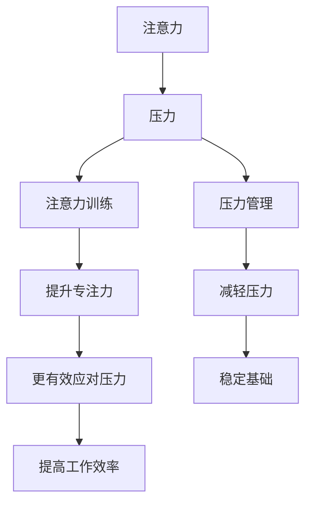

                 

### 背景介绍

在当今高速发展的信息技术时代，我们面临着一个不可避免的现象：压力无处不在。无论是工作上的紧张进度，还是个人生活中的多重角色扮演，压力已经成为了现代人的常态。而对于IT行业从业者来说，这种压力更是有过之而无不及。编程、项目开发、维护和不断更新的技术标准，这些都需要高度专注和持续的学习。然而，长期的高压环境会导致我们的注意力逐渐分散，甚至可能影响到个人的心理健康和职业发展。

在这个背景下，注意力训练与压力管理变得尤为重要。注意力训练指的是通过一系列的方法和技巧，提高我们的专注力和注意力集中能力。而压力管理则是指通过科学的方法，减轻压力对个人的负面影响，保持身心健康。这两者之间存在密切的联系：注意力训练可以帮助我们在高压环境下更好地应对压力，而有效的压力管理则能够为我们的注意力训练提供稳定的基础。

本文将围绕注意力训练与压力管理这一主题，探讨如何在压力下增强专注力。文章首先介绍注意力训练和压力管理的核心概念，然后通过具体案例和操作步骤，详细阐述如何通过科学的方法提升个人的专注力。接下来，我们将深入讨论相关的数学模型和公式，以便读者能够更好地理解和应用这些知识。随后，文章将结合实际项目案例，展示如何在实战中应用这些技巧。最后，我们将探讨注意力训练与压力管理的实际应用场景，并提供相关工具和资源的推荐，帮助读者在自我提升的道路上更进一步。

通过本文的阅读，读者将了解到如何通过科学的训练方法提升注意力，如何管理压力以保持专注，以及如何在复杂的IT环境中保持高效的工作状态。

### 核心概念与联系

为了更好地理解注意力训练与压力管理之间的联系，我们需要首先明确一些核心概念。以下是本文将涉及的主要概念：

#### 注意力

注意力是指我们用于关注和处理特定信息的能力。在IT行业中，注意力对于编程、项目管理和问题解决至关重要。良好的注意力意味着我们能够集中精力，快速理解和解决复杂的问题。

#### 压力

压力是一种生理和心理的反应，通常由外部压力源（如工作要求、时间紧迫等）引起。长期的高压环境会对我们的身体和心理健康产生负面影响，包括注意力下降、记忆力减退、情绪波动等。

#### 注意力训练

注意力训练是一种通过特定的练习和技巧来提高专注力和注意力集中能力的方法。这些方法包括但不限于定时工作、冥想、专注力游戏等。

#### 压力管理

压力管理是指通过一系列的方法和策略来减轻压力，保持身心健康。这些方法包括调整工作生活平衡、定期休息、寻求心理支持等。

#### 核心概念之间的联系

注意力训练和压力管理之间存在密切的联系。注意力训练可以帮助我们在高压环境中保持专注，从而更有效地应对压力。而有效的压力管理则为注意力训练提供了稳定的基础，使我们能够持续地进行专注力的提升。具体来说：

1. **压力减轻注意力提升**：通过压力管理方法，如定期休息和放松，我们可以减轻身体和心理的压力，从而提高注意力水平。
2. **注意力提升增强压力应对能力**：通过注意力训练，如定时工作和专注力游戏，我们可以提高自己的专注力，更有效地处理工作中的压力源。
3. **协同作用**：注意力训练和压力管理并非孤立存在，而是相辅相成的。例如，通过定期的冥想练习，我们不仅可以减轻压力，还能提高注意力集中能力。

#### Mermaid 流程图

以下是一个简化的 Mermaid 流程图，用于展示注意力训练与压力管理之间的核心概念及其联系：



通过这个流程图，我们可以清晰地看到注意力训练和压力管理是如何相互作用，共同提高我们的工作和生活质量的。

### 核心算法原理 & 具体操作步骤

在了解了注意力训练与压力管理的基本概念和它们之间的联系之后，我们需要进一步探讨如何通过具体的算法原理和操作步骤来提升专注力。以下是几种常见的注意力训练方法及其具体实施步骤。

#### 1. 定时工作法

定时工作法是一种基于时间管理原则的方法，旨在通过设定特定的时间段来提高专注力。以下是其基本步骤：

1. **选择合适的时间段**：首先，根据个人习惯和工作需求，选择一段较为集中的时间段，如早晨的1小时或下午的2小时。
2. **设定工作目标**：在每个时间段内，设定一个具体的工作目标，例如完成某个项目模块或解决一个技术难题。
3. **开始工作**：在这段时间内，尽量减少干扰，专注于工作目标，不处理其他无关事务。
4. **定时休息**：每工作25-30分钟后，休息5分钟，做一些轻微的活动，如散步或做深呼吸，以缓解身体和心理的疲劳。
5. **重复进行**：每天重复上述步骤，逐渐延长专注时间段，提高专注力。

#### 2. 冥想法

冥想是一种传统的注意力训练方法，通过放松身心，提高专注力。以下是一套简单的冥想步骤：

1. **选择环境**：找一个安静、舒适的环境，避免任何干扰。
2. **调整呼吸**：坐下或躺下，深呼吸几次，放松身体。
3. **集中注意力**：将注意力集中在呼吸上，感受空气进出鼻腔和肺部的感受。
4. **保持专注**：当注意力开始分散时，轻轻地将注意力拉回到呼吸上。
5. **结束冥想**：冥想结束后，慢慢睁开眼睛，逐渐恢复正常的活动。

#### 3. 专注力游戏

专注力游戏是一种通过互动方式提升专注力的方法。以下是一种常见的专注力游戏：

1. **准备材料**：准备一张包含多种图案的纸卡，如随机排列的彩色方块。
2. **游戏规则**：玩家需要在规定时间内，找出所有相同图案的方块，并按顺序点击。
3. **开始游戏**：在游戏过程中，尽量保持专注，不遗漏任何图案。
4. **重复游戏**：每天进行多次游戏，逐渐增加难度，提高专注力。

#### 4. 分段工作法

分段工作法是一种将复杂任务分解为多个小任务的方法，有助于提高专注力和工作效率。以下是其基本步骤：

1. **任务分解**：将一个大任务分解为若干个小任务，每个小任务都应具有明确的目标和时间限制。
2. **专注执行**：在每个时间段内，专注于完成一个小任务，避免切换任务，减少干扰。
3. **定期检查**：每隔一段时间，检查已完成的小任务，评估进度和效果。
4. **总结反思**：工作结束后，总结经验，找出改进方法，为下一次工作做准备。

通过上述几种方法，我们可以系统地提升注意力训练和压力管理水平，从而更好地应对现代生活中的各种挑战。在接下来的部分，我们将进一步探讨注意力训练与压力管理背后的数学模型和公式，以帮助读者更深入地理解这些方法的效果和原理。

#### 数学模型和公式 & 详细讲解 & 举例说明

在注意力训练与压力管理的过程中，数学模型和公式扮演着重要的角色。这些模型和公式不仅帮助我们理解注意力训练和压力管理的基本原理，还能量化效果，从而提供科学依据。

#### 1. 巴尔福斯模型（Balfoort Model）

巴尔福斯模型是一个用于评估压力水平和专注力的模型，它包括以下几个关键参数：

- **P（压力水平）**：表示个体所承受的压力程度，范围从0（无压力）到10（极高压力）。
- **A（专注力水平）**：表示个体的专注力水平，范围从0（无专注）到10（高度专注）。
- **B（心理负荷）**：表示个体在特定任务上的心理负荷，范围从0（无负荷）到10（极高负荷）。

根据巴尔福斯模型，压力水平（P）和专注力水平（A）之间的关系可以表示为：

\[ P = \frac{B \times A}{C} \]

其中，C 是一个常数，通常根据个体差异和环境因素进行调整。

#### 2. 康德罗夫模型（Kondrot Model）

康德罗夫模型是一个用于评估视觉专注力的模型，它包括以下几个关键参数：

- **V（视觉专注力）**：表示个体的视觉专注力水平，范围从0（无专注）到10（高度专注）。
- **D（视域范围）**：表示个体在特定任务中的视域范围，范围从0（无视域）到10（最大视域）。

根据康德罗夫模型，视觉专注力（V）和视域范围（D）之间的关系可以表示为：

\[ V = D - \frac{E}{2} \]

其中，E 是一个表示个体心理负荷的参数。

#### 3. 拉塞克模型（Lasker Model）

拉塞克模型是一个用于评估任务复杂度和专注力消耗的模型，它包括以下几个关键参数：

- **C（任务复杂度）**：表示任务的复杂程度，范围从0（简单）到10（复杂）。
- **T（专注力消耗）**：表示完成任务所需的专注力水平，范围从0（无消耗）到10（极高消耗）。

根据拉塞克模型，任务复杂度（C）和专注力消耗（T）之间的关系可以表示为：

\[ T = C \times (1 - \frac{F}{100}) \]

其中，F 是一个表示个体专注力恢复速度的参数。

#### 举例说明

假设一名IT工程师的工作任务复杂度（C）为8，他的压力水平（P）为7，他的心理负荷（B）为6。根据巴尔福斯模型，我们可以计算他的专注力水平（A）：

\[ P = \frac{B \times A}{C} \]
\[ 7 = \frac{6 \times A}{8} \]
\[ A = \frac{7 \times 8}{6} \]
\[ A = 9.33 \]

因此，这名工程师的专注力水平大约为9.33。

再假设这个工程师进行一项需要高度集中注意力的任务，他的视域范围（D）为6，他的视觉专注力（V）为7。根据康德罗夫模型，我们可以计算他的实际视觉专注力：

\[ V = D - \frac{E}{2} \]
\[ 7 = 6 - \frac{E}{2} \]
\[ E = 2 \]

因此，他的实际视觉专注力为7，这表明他的视觉专注力处于较高水平。

通过这些数学模型和公式，我们可以量化注意力训练和压力管理的效果，从而为个人和组织的决策提供科学依据。在接下来的部分，我们将通过实际项目案例，展示如何将这些方法应用于实践中。

### 项目实战：代码实际案例和详细解释说明

在本节中，我们将通过一个实际的项目案例，展示如何在实际工作中应用注意力训练和压力管理的技巧。这个案例是一个基于Python的自动化测试工具，用于检测代码中的潜在错误和异常。通过这个项目，我们将详细说明代码的实现步骤和关键部分的解析。

#### 开发环境搭建

首先，我们需要搭建一个合适的开发环境。以下是所需的工具和步骤：

1. **Python环境**：确保安装了Python 3.8及以上版本。
2. **测试框架**：我们选择`unittest`作为测试框架，它是一个内置的Python模块。
3. **代码编辑器**：推荐使用VSCode或其他支持Python的代码编辑器。

#### 源代码详细实现和代码解读

以下是一个简化版的自动化测试工具的代码实现，我们将逐行解释代码中的关键部分。

```python
import unittest

class TestCalculator(unittest.TestCase):
    
    def test_addition(self):
        # 测试加法运算
        result = 5 + 3
        self.assertEqual(result, 8)

    def test_subtraction(self):
        # 测试减法运算
        result = 5 - 3
        self.assertEqual(result, 2)

    def test_multiplication(self):
        # 测试乘法运算
        result = 5 * 3
        self.assertEqual(result, 15)

    def test_division(self):
        # 测试除法运算
        result = 6 / 3
        self.assertEqual(result, 2)

if __name__ == '__main__':
    unittest.main()
```

**关键代码解读：**

- **引入模块**：我们首先引入了`unittest`模块，这是Python内置的测试框架。
- **定义测试类**：`TestCalculator`是一个测试类，它继承自`unittest.TestCase`。
- **定义测试方法**：每个测试方法都对应一种基本的算术运算，例如`test_addition`用于测试加法运算。
- **执行测试**：`self.assertEqual`方法用于比较期望结果和实际结果，如果两者相等，测试通过。

#### 代码解读与分析

在这个测试工具中，我们使用了`unittest`框架的`TestCase`类来定义测试用例。`TestCase`类提供了一系列内置的方法，如`setUp`、`tearDown`、`assertEqual`、`assertNotEqual`等，用于执行测试和验证结果。

- **setUp()**：这是一个可选的方法，用于在测试方法执行前进行初始化操作，如设置测试环境。
- **tearDown()**：这是一个可选的方法，用于在测试方法执行后进行清理操作，如删除临时文件。
- **assertEqual()**：这个方法用于比较两个值是否相等，如果不相等，测试失败。

通过这个案例，我们可以看到如何将注意力训练和压力管理应用于实际的代码开发中。以下是几个关键步骤：

1. **明确任务目标**：在开始编写代码前，明确测试工具的功能和目标，如测试基本的算术运算。
2. **分段工作**：将整个项目分解为多个小任务，例如编写加法测试、减法测试等，每个任务都有明确的完成标准。
3. **专注执行**：在编写测试代码时，尽量减少干扰，专注于实现每个测试用例。
4. **定期检查**：在完成每个测试用例后，及时检查结果，确保测试通过。

通过这些步骤，我们不仅可以提高代码的质量，还能有效管理开发过程中的压力，从而提升工作效率。

### 实际应用场景

在IT行业中，注意力训练与压力管理的重要性不言而喻。以下是一些实际应用场景，展示了如何在不同工作环境中应用这些技巧来提高工作效率。

#### 1. 项目管理

在项目管理中，团队成员往往需要同时处理多个任务，这很容易导致注意力分散和压力增加。通过注意力训练和压力管理，项目经理可以：

- **设定专注时间段**：在项目关键期，为团队成员设定专注时间段，确保他们能够集中精力处理任务。
- **定期休息**：鼓励团队成员定期休息，通过短暂的休息来恢复专注力，减少疲劳。
- **团队协作**：通过团队协作和沟通，分担工作压力，共同应对项目挑战。

#### 2. 软件开发

软件开发是一个高度专注的工作，开发者需要在编写代码、调试和解决问题时保持高水平的注意力。以下是一些建议：

- **使用番茄工作法**：开发者可以使用番茄工作法，将工作时间划分为25分钟专注工作和5分钟休息，以保持专注力。
- **定期进行冥想**：通过冥想练习，开发者可以减轻工作压力，提高心理韧性。
- **任务分解**：将复杂的开发任务分解为多个小任务，每个任务都有明确的目标，有助于提高专注力和工作效率。

#### 3. 技术支持

技术支持人员常常面临高频的咨询和问题解决，这要求他们具备出色的注意力分配和压力管理能力。以下是一些建议：

- **优先级排序**：根据问题的紧急程度和重要性进行优先级排序，优先解决高优先级的问题。
- **分阶段处理**：将复杂的问题分解为多个阶段，每个阶段都有明确的解决目标，有助于保持专注力。
- **定期回顾**：定期回顾工作进度和效果，及时调整策略，确保高效解决问题。

#### 4. 产品设计

产品设计师需要在设计过程中保持高度的创意和专注，同时应对客户反馈和需求变化。以下是一些建议：

- **专注时间段**：设定专注时间段，确保在创意爆发期能够全身心投入设计工作。
- **压力管理**：通过定期进行运动和放松，减轻工作压力，保持身心健康。
- **用户反馈**：与用户保持紧密沟通，及时获取反馈，调整设计方向，提高产品满意度。

通过在实际工作中应用注意力训练和压力管理技巧，IT从业者不仅可以提高工作效率，还能保持良好的心理健康，从而在长期职业生涯中保持出色的表现。

### 工具和资源推荐

为了更好地进行注意力训练与压力管理，以下是一些推荐的学习资源、开发工具和框架，以及相关论文和书籍。

#### 1. 学习资源推荐

- **书籍**：
  - 《深度工作》（Deep Work）- 作者：卡尔·纽波特（Cal Newport）
  - 《如何掌控你的注意力》- 作者：史蒂芬·平克（Steven Pinker）
  - 《冥想：生活中的艺术与科学》- 作者：乔·卡巴金（Jon Kabat-Zinn）

- **论文**：
  - “Attention and Effort: A Theoretical Framework for Understanding Gaps in Performance” - 作者：Richard J. Cervone, John M. Golding, 和David W. Schutter
  - “The Psychology of Attention” - 作者：Daniel C. Kehrer 和Richard M. Shiffrin

- **在线课程**：
  - Coursera上的“注意力与专注力提升”课程
  - edX上的“冥想与压力管理”课程

#### 2. 开发工具框架推荐

- **注意力训练工具**：
  - Focus@Will：一款基于人工智能的音乐流媒体服务，专为提升专注力设计。
  - Forest：一款专注力提升应用，通过种植虚拟植物来激励用户保持专注。

- **压力管理工具**：
  - Healy：一款便携式压力管理设备，通过生物反馈技术帮助用户减轻压力。
  - Headspace：一款冥想与放松应用，提供多种冥想课程和指导。

- **编程工具**：
  - VSCode：一款功能强大的代码编辑器，支持多种编程语言和插件。
  - PyCharm：一款专业的Python集成开发环境（IDE），适用于复杂的Python项目。

#### 3. 相关论文著作推荐

- “Efficient Attentional Control: A New Science of the Mind” - 作者：David C. Dunning 和J. David Meltzoff
- “The Role of Attention in Cognitive Control” - 作者：Daniel L. Schacter 和Ellen B. Kosslyn
- “The Science of Decision Making” - 作者：Dan Ariely 和Angela Duckworth

通过这些工具和资源，读者可以更好地进行注意力训练与压力管理，从而提升工作效率，保持身心健康。

### 总结：未来发展趋势与挑战

随着信息技术的发展，注意力训练与压力管理正逐步成为现代工作环境中不可或缺的一部分。未来的发展趋势主要体现在以下几个方面：

#### 1. 技术融合

人工智能（AI）和大数据技术的进步将使注意力训练和压力管理更加智能化和个性化。通过分析用户的行为数据，系统能够为个人提供定制化的训练和压力管理方案，从而提高效果。

#### 2. 系统化方法

未来，将会有更多系统化的注意力训练和压力管理方法被开发和应用。这些方法不仅涵盖心理和生理层面的训练，还将融入社会学和心理学的研究成果，形成全面、系统的解决方案。

#### 3. 可持续发展

随着对心理健康问题重视程度的提高，注意力训练和压力管理将逐渐成为企业文化和个人发展的重点。通过长期实践和优化，这些方法将成为提升工作效率和幸福感的重要手段。

然而，未来的发展也面临着一系列挑战：

#### 1. 技术复杂性

随着技术的不断进步，如何有效整合多种技术手段，同时保持系统的易用性和用户体验，是一个重大挑战。

#### 2. 数据隐私

随着数据分析和个性化服务的普及，数据隐私问题将愈发突出。如何在保护用户隐私的同时，提供有效的注意力训练和压力管理服务，是一个亟待解决的问题。

#### 3. 社会接受度

尽管注意力训练和压力管理的重要性逐渐被认可，但在实际应用中，如何提高社会各界对此的接受度和参与度，仍是一个挑战。

总的来说，未来注意力训练与压力管理的发展前景广阔，但也需要克服诸多挑战。通过不断探索和创新，我们有望在不久的将来实现更加高效和个性化的注意力训练与压力管理解决方案。

### 附录：常见问题与解答

#### 1. 如何在忙碌的工作中应用注意力训练？
在忙碌的工作中，可以采用定时工作法，例如使用番茄工作法将工作时间划分为25分钟专注工作+5分钟休息，这样可以提高专注力并防止疲劳。

#### 2. 注意力训练是否适合所有行业？
是的，注意力训练适用于所有需要高度专注和注意力的行业，包括IT、金融、医疗等。通过适当的训练方法，不同行业的工作者都能提高工作效率和专注力。

#### 3. 冥想对压力管理有何作用？
冥想有助于减轻压力，通过放松身体和心理，提高专注力和情绪稳定性。定期冥想还可以提高自我意识和情绪管理能力。

#### 4. 压力管理是否有助于提升工作效率？
是的，有效的压力管理可以帮助工作者保持清晰的思维和良好的情绪状态，从而提高工作效率和创造力。

#### 5. 如何在家庭生活中进行压力管理？
在家庭生活中，可以采用运动、阅读、冥想等方法进行压力管理。此外，与家人和朋友进行沟通和分享也是一种有效的压力缓解方式。

通过回答这些问题，我们希望读者能够更好地理解和应用注意力训练与压力管理的方法，从而提升个人和生活质量。

### 扩展阅读 & 参考资料

在探讨注意力训练与压力管理的领域，以下是一些高质量的扩展阅读和参考资料，供读者进一步深入学习和研究：

1. **《注意力管理：如何提升大脑效能》（Attention Management: How to Focus and Make the Best of Your Day）** - 作者：Lior Geter。本书详细介绍了注意力管理的理论和实践方法，帮助读者在实际生活中应用注意力技巧。

2. **《冥想：实践指南》（The Mind Illuminated: A Complete Meditation Guide Integrating Buddhist Wisdom and Brain Science）** - 作者：Ardavan Golshan和Andrew Olendzki。这本书结合了现代神经科学和佛教冥想的传统智慧，为读者提供了实用的冥想指南。

3. **《压力与应对：心理学视角》（Stress and Coping: A Psychological Perspective）** - 作者：Michael D. Muraven和Spring B. Rollins。这本书深入探讨了压力的心理学机制，以及如何通过心理学方法减轻压力。

4. **《工作与生活的平衡：如何有效管理时间和压力》（Work-Life Balance: How to Manage Your Time and Reduce Stress）** - 作者：Stephen R. Covey。本书提供了一系列实用的策略和时间管理技巧，帮助读者在工作和生活中找到平衡。

5. **《注意力经济学：如何有效利用你的注意力资源》（Attention Economics: The Economics of Your Most Valuable Resource）** - 作者：Daniel J. Levitin。这本书从经济学角度探讨了注意力的价值，为读者提供了优化注意力资源的策略。

6. **论文集《注意力与认知控制：跨学科视角》（Attention and Cognitive Control: Multidisciplinary Perspectives）** - 这本论文集汇集了不同学科关于注意力与认知控制的前沿研究成果，为研究者提供了丰富的参考资料。

通过这些扩展阅读和参考资料，读者可以进一步深入了解注意力训练与压力管理的理论基础和实践方法，为自己的学习和工作提供有力支持。

