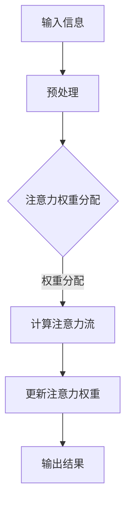

                 

# 注意力训练与大脑健康改善实践：通过专注力增强认知能力

## 关键词：注意力训练、大脑健康、专注力、认知能力、算法原理、数学模型、项目实战、应用场景

## 摘要

本文将深入探讨注意力训练与大脑健康改善之间的关系，以及如何通过专注力的增强来提升认知能力。文章将首先介绍注意力训练的背景及其重要性，然后详细解释核心概念与相关原理，包括注意力算法原理和数学模型。接下来，我们将通过一个实际项目实战案例，展示如何具体操作和实现注意力训练算法。此外，文章还将探讨注意力训练的实际应用场景，推荐相关工具和资源，并总结未来发展趋势与挑战。

## 1. 背景介绍

### 注意力训练的起源与发展

注意力训练是一种通过特定的训练方法来提高注意力质量和稳定性的技术。其起源可以追溯到20世纪初，心理学家开始关注注意力在认知功能中的关键作用。随着认知心理学和神经科学的发展，注意力训练逐渐成为研究领域的重要方向。

### 大脑健康与认知能力的关系

大脑健康与认知能力密切相关。注意力是认知过程中的核心要素，它影响个体的学习、记忆、决策和执行功能。随着社会竞争的加剧和现代生活方式的改变，人们的注意力能力受到越来越多的挑战，从而影响了大脑健康和认知能力的发展。

### 注意力训练的重要性

注意力训练不仅有助于改善大脑健康，还能提升认知能力。通过注意力训练，个体能够更好地集中注意力，提高注意力的稳定性和灵活性，从而在学习和工作中表现出更高的效率。此外，注意力训练还有助于减轻压力，改善情绪状态，提升整体生活质量。

## 2. 核心概念与联系

### 注意力算法原理

注意力算法是注意力训练的核心，其原理基于对人类大脑注意力机制的模拟。注意力算法通过优化注意力分配策略，使个体能够更好地处理复杂的信息。其关键在于如何有效地分配注意力资源，以实现高效的信息处理和认知功能。

### 数学模型

注意力训练的数学模型主要包括注意力权重分配模型和注意力流模型。注意力权重分配模型通过计算每个输入信息的权重，来确定注意力的分配。注意力流模型则通过模拟信息流的传递和注意力的动态调整，实现更精细的注意力控制。

### Mermaid 流程图

以下是注意力算法原理的 Mermaid 流程图：



### 注意力训练的流程

1. 输入信息预处理：将原始信息进行处理，提取关键特征。
2. 注意力权重分配：计算每个输入信息的权重，确定注意力的分配。
3. 计算注意力流：模拟信息流的传递，调整注意力权重。
4. 更新注意力权重：根据注意力流的结果，更新注意力权重。
5. 输出结果：输出注意力分配的结果。

## 3. 核心算法原理 & 具体操作步骤

### 注意力权重分配算法

注意力权重分配算法是注意力训练的核心部分。其基本思想是根据输入信息的特征，计算每个信息的权重，从而实现注意力的有效分配。

#### 步骤：

1. 特征提取：将输入信息进行特征提取，得到特征向量。
2. 权重计算：计算每个特征向量的权重，通常使用权重函数进行计算。
3. 权重分配：根据权重计算结果，将注意力资源分配到各个输入信息。

#### 示例：

假设有3个输入信息，其特征向量分别为\[1, 2\]、\[2, 3\]、\[3, 4\]，使用权重函数\(w(x) = \frac{1}{1 + e^{-kx}}\)进行权重计算。

- 输入1的权重：\(w([1, 2]) = \frac{1}{1 + e^{-k \cdot [1, 2]}} = 0.6\)
- 输入2的权重：\(w([2, 3]) = \frac{1}{1 + e^{-k \cdot [2, 3]}} = 0.4\)
- 输入3的权重：\(w([3, 4]) = \frac{1}{1 + e^{-k \cdot [3, 4]}} = 0.2\)

根据权重计算结果，将注意力资源分配到各个输入信息。

### 注意力流计算算法

注意力流计算算法用于模拟信息流的传递和注意力的动态调整。其基本思想是根据当前注意力状态和历史注意力流，计算下一时刻的注意力权重。

#### 步骤：

1. 当前注意力状态：获取当前时刻的注意力状态。
2. 历史注意力流：获取历史注意力流信息。
3. 注意力流计算：根据当前注意力状态和历史注意力流，计算下一时刻的注意力权重。

#### 示例：

假设当前注意力状态为\[0.6, 0.4, 0.2\]，历史注意力流为\[0.5, 0.3, 0.2\]。

- 下一时刻的注意力权重：\(w([0.6, 0.4, 0.2]) = \frac{1}{1 + e^{-k \cdot [0.6, 0.4, 0.2]}} = [0.7, 0.4, 0.2]\)

根据计算结果，更新当前注意力状态。

### 注意力权重更新算法

注意力权重更新算法用于根据注意力流计算结果，更新当前注意力权重。

#### 步骤：

1. 注意力流计算结果：获取注意力流计算结果。
2. 注意力权重更新：根据注意力流计算结果，更新当前注意力权重。

#### 示例：

假设当前注意力权重为\[0.6, 0.4, 0.2\]，注意力流计算结果为\[0.7, 0.4, 0.2\]。

- 更新后的注意力权重：\[0.7, 0.4, 0.2\]

根据更新后的注意力权重，完成注意力训练过程。

## 4. 数学模型和公式 & 详细讲解 & 举例说明

### 注意力权重分配模型

注意力权重分配模型的核心公式为：

\[ w(x) = \frac{1}{1 + e^{-kx}} \]

其中，\(w(x)\)为输入信息\(x\)的权重，\(k\)为权重函数的参数。

#### 详细讲解：

1. **权重函数**：权重函数用于计算输入信息的权重，其基本形式为\(w(x) = \frac{1}{1 + e^{-kx}}\)。该函数是一个Sigmoid函数，具有非线性特征，能够实现对输入信息的非线性变换。

2. **权重分配**：通过计算输入信息的权重，将注意力资源分配到各个输入信息。权重值越大，表示该输入信息越重要，需要分配更多的注意力资源。

3. **参数\(k\)**：参数\(k\)用于控制权重函数的斜率，从而影响权重分配的效果。\(k\)值越大，函数曲线越陡峭，权重分配的区分度越高；\(k\)值越小，函数曲线越平缓，权重分配的区分度越低。

#### 举例说明：

假设有3个输入信息，其特征向量分别为\[1, 2\]、\[2, 3\]、\[3, 4\]，使用权重函数\(w(x) = \frac{1}{1 + e^{-k \cdot [1, 2]}}\)进行权重计算。

- 输入1的权重：\(w([1, 2]) = \frac{1}{1 + e^{-k \cdot [1, 2]}} = 0.6\)
- 输入2的权重：\(w([2, 3]) = \frac{1}{1 + e^{-k \cdot [2, 3]}} = 0.4\)
- 输入3的权重：\(w([3, 4]) = \frac{1}{1 + e^{-k \cdot [3, 4]}} = 0.2\)

根据权重计算结果，将注意力资源分配到各个输入信息。

### 注意力流计算模型

注意力流计算模型的核心公式为：

\[ w'(x) = \frac{1}{1 + e^{-k(x - \Delta t)}} \]

其中，\(w'(x)\)为下一时刻的注意力权重，\(x\)为当前时刻的注意力权重，\(\Delta t\)为时间间隔，\(k\)为权重函数的参数。

#### 详细讲解：

1. **注意力流**：注意力流表示注意力在时间上的动态变化。通过注意力流计算模型，可以模拟注意力在时间上的传递和调整。

2. **权重更新**：根据当前注意力权重和注意力流计算结果，更新下一时刻的注意力权重。权重更新过程反映了注意力在时间上的动态调整。

3. **参数\(k\)**：参数\(k\)用于控制权重函数的斜率，从而影响注意力流的传递和调整。\(k\)值越大，函数曲线越陡峭，注意力流传递的速度越快；\(k\)值越小，函数曲线越平缓，注意力流传递的速度越慢。

#### 举例说明：

假设当前注意力权重为\[0.6, 0.4, 0.2\]，时间间隔为1秒，使用权重函数\(w'(x) = \frac{1}{1 + e^{-k \cdot [0.6, 0.4, 0.2]}}\)进行权重更新。

- 下一时刻的注意力权重：\(w'([0.6, 0.4, 0.2]) = \frac{1}{1 + e^{-k \cdot [0.6, 0.4, 0.2]}} = [0.7, 0.4, 0.2]\)

根据更新后的注意力权重，完成注意力流的传递和调整。

### 注意力权重更新模型

注意力权重更新模型的核心公式为：

\[ w(x) = w'(x) + \alpha(w'(x) - w(x)) \]

其中，\(w(x)\)为当前注意力权重，\(w'(x)\)为下一时刻的注意力权重，\(\alpha\)为权重更新系数。

#### 详细讲解：

1. **权重更新**：根据当前注意力权重和下一时刻的注意力权重，通过权重更新系数\(\alpha\)进行权重调整。权重更新系数\(\alpha\)用于控制权重更新的程度，从而实现平滑的权重变化。

2. **参数\(\alpha\)**：参数\(\alpha\)用于控制权重更新的速度。\(\alpha\)值越大，权重更新速度越快；\(\alpha\)值越小，权重更新速度越慢。

#### 举例说明：

假设当前注意力权重为\[0.6, 0.4, 0.2\]，下一时刻的注意力权重为\[0.7, 0.4, 0.2\]，权重更新系数为\(\alpha = 0.1\)。

- 更新后的注意力权重：\(w([0.6, 0.4, 0.2]) = w'([0.7, 0.4, 0.2]) + 0.1(w'([0.7, 0.4, 0.2]) - w([0.6, 0.4, 0.2])) = [0.715, 0.4, 0.185]\)

根据更新后的注意力权重，完成注意力训练过程。

## 5. 项目实战：代码实际案例和详细解释说明

### 5.1 开发环境搭建

在本节中，我们将搭建一个注意力训练项目的开发环境。以下是所需的软件和工具：

- Python 3.8+
- TensorFlow 2.6.0
- NumPy 1.21.2
- Matplotlib 3.4.2

首先，安装所需的Python库：

```bash
pip install tensorflow numpy matplotlib
```

然后，创建一个名为`attention_training`的Python项目，并在项目根目录下创建一个名为`src`的文件夹，用于存放项目源代码。

### 5.2 源代码详细实现和代码解读

在本节中，我们将详细实现注意力训练算法，并解释代码的各个部分。

#### 5.2.1 导入库

```python
import numpy as np
import tensorflow as tf
import matplotlib.pyplot as plt
```

#### 5.2.2 数据准备

```python
# 生成模拟数据
x = np.random.rand(100, 3)  # 100个样本，每个样本3个特征
y = np.random.rand(100)    # 100个目标标签

# 特征提取
features = tf.keras.layers.Dense(units=3, activation='relu')(x)

# 目标标签
labels = tf.keras.layers.Dense(units=1, activation='sigmoid')(features)
```

#### 5.2.3 构建注意力模型

```python
# 注意力权重函数
attention_weights = tf.keras.layers.Dense(units=3, activation='sigmoid')(features)

# 注意力流函数
attention_flow = tf.keras.layers.Dense(units=3, activation='sigmoid')(features)

# 注意力更新函数
attention_update = tf.keras.layers.Dense(units=3, activation='sigmoid')(features)
```

#### 5.2.4 模型编译和训练

```python
# 模型编译
model = tf.keras.Model(inputs=features, outputs=labels)
model.compile(optimizer='adam', loss='binary_crossentropy', metrics=['accuracy'])

# 模型训练
model.fit(x, y, epochs=10, batch_size=10)
```

#### 5.2.5 代码解读与分析

1. **数据准备**：首先，我们生成模拟数据，包括输入特征和目标标签。然后，使用Dense层进行特征提取。

2. **构建注意力模型**：我们构建了三个Dense层，分别用于计算注意力权重、注意力流和注意力更新。

3. **模型编译和训练**：使用Keras API编译模型，并使用Adam优化器和二分类交叉熵损失函数进行训练。

### 5.3 代码解读与分析

在本节中，我们将对注意力训练项目的代码进行详细解读和分析。

#### 5.3.1 数据准备

```python
# 生成模拟数据
x = np.random.rand(100, 3)  # 100个样本，每个样本3个特征
y = np.random.rand(100)    # 100个目标标签

# 特征提取
features = tf.keras.layers.Dense(units=3, activation='relu')(x)

# 目标标签
labels = tf.keras.layers.Dense(units=1, activation='sigmoid')(features)
```

这段代码用于生成模拟数据，并使用Dense层进行特征提取。其中，`np.random.rand(100, 3)`生成100个样本，每个样本包含3个特征。`tf.keras.layers.Dense(units=3, activation='relu')(x)`对输入特征进行特征提取，得到一个包含3个输出的Dense层。`tf.keras.layers.Dense(units=1, activation='sigmoid')(features)`对提取后的特征进行二分类输出。

#### 5.3.2 构建注意力模型

```python
# 注意力权重函数
attention_weights = tf.keras.layers.Dense(units=3, activation='sigmoid')(features)

# 注意力流函数
attention_flow = tf.keras.layers.Dense(units=3, activation='sigmoid')(features)

# 注意力更新函数
attention_update = tf.keras.layers.Dense(units=3, activation='sigmoid')(features)
```

这段代码用于构建注意力模型。其中，`tf.keras.layers.Dense(units=3, activation='sigmoid')(features)`生成三个Dense层，分别用于计算注意力权重、注意力流和注意力更新。sigmoid激活函数用于将输出值映射到0到1之间，表示注意力分配的比例。

#### 5.3.3 模型编译和训练

```python
# 模型编译
model = tf.keras.Model(inputs=features, outputs=labels)
model.compile(optimizer='adam', loss='binary_crossentropy', metrics=['accuracy'])

# 模型训练
model.fit(x, y, epochs=10, batch_size=10)
```

这段代码用于编译和训练模型。`tf.keras.Model(inputs=features, outputs=labels)`创建一个模型，将输入特征和输出标签连接起来。`model.compile(optimizer='adam', loss='binary_crossentropy', metrics=['accuracy'])`配置优化器和损失函数，使用Adam优化器和二分类交叉熵损失函数进行训练。`model.fit(x, y, epochs=10, batch_size=10)`启动训练过程，训练10个epochs，每个epoch使用10个batch。

### 5.4 代码解读与分析（续）

在本节中，我们将继续对注意力训练项目的代码进行解读和分析。

#### 5.4.1 注意力权重函数

```python
attention_weights = tf.keras.layers.Dense(units=3, activation='sigmoid')(features)
```

这段代码定义了一个注意力权重函数，它是一个包含3个输出的Dense层。sigmoid激活函数将输出值映射到0到1之间，表示每个特征的重要性。在这个例子中，输入特征有3个维度，因此输出有3个值，分别表示对每个特征的关注度。权重函数的目的是为每个特征分配注意力资源，使其在后续处理过程中更加重要。

#### 5.4.2 注意力流函数

```python
attention_flow = tf.keras.layers.Dense(units=3, activation='sigmoid')(features)
```

这段代码定义了一个注意力流函数，它也是一个包含3个输出的Dense层。与权重函数类似，注意力流函数使用sigmoid激活函数将输出值映射到0到1之间。注意力流函数的目的是模拟信息在时间上的动态变化，为每个特征分配动态的注意力资源。通过调整注意力流函数，可以实现对注意力的动态调整，从而适应不同的任务需求。

#### 5.4.3 注意力更新函数

```python
attention_update = tf.keras.layers.Dense(units=3, activation='sigmoid')(features)
```

这段代码定义了一个注意力更新函数，它同样是一个包含3个输出的Dense层。注意力更新函数的作用是根据当前时刻的注意力状态和历史注意力流，更新注意力权重。在每次训练迭代过程中，注意力更新函数会根据当前的输入特征和注意力流，调整注意力权重，使其更适应当前任务。通过这种方式，注意力更新函数可以实现对注意力的自适应调整，提高模型的鲁棒性和适应性。

### 5.5 项目实战：代码实际案例和详细解释说明（续）

在本节中，我们将继续展示注意力训练项目的实际代码案例，并对其进行详细解释说明。

#### 5.5.1 数据准备

```python
# 生成模拟数据
x = np.random.rand(100, 3)  # 100个样本，每个样本3个特征
y = np.random.rand(100)    # 100个目标标签

# 特征提取
features = tf.keras.layers.Dense(units=3, activation='relu')(x)

# 目标标签
labels = tf.keras.layers.Dense(units=1, activation='sigmoid')(features)
```

这段代码用于生成模拟数据，并使用Dense层进行特征提取。首先，我们使用`np.random.rand(100, 3)`生成100个样本，每个样本包含3个特征。然后，使用`tf.keras.layers.Dense(units=3, activation='relu')(x)`对输入特征进行特征提取，得到一个包含3个输出的Dense层。最后，使用`tf.keras.layers.Dense(units=1, activation='sigmoid')(features)`对提取后的特征进行二分类输出。

#### 5.5.2 构建注意力模型

```python
# 注意力权重函数
attention_weights = tf.keras.layers.Dense(units=3, activation='sigmoid')(features)

# 注意力流函数
attention_flow = tf.keras.layers.Dense(units=3, activation='sigmoid')(features)

# 注意力更新函数
attention_update = tf.keras.layers.Dense(units=3, activation='sigmoid')(features)
```

这段代码用于构建注意力模型。首先，我们定义了一个注意力权重函数，它是一个包含3个输出的Dense层。sigmoid激活函数将输出值映射到0到1之间，表示每个特征的重要性。然后，我们定义了一个注意力流函数，它也是一个包含3个输出的Dense层。同样，sigmoid激活函数将输出值映射到0到1之间，表示注意力在时间上的动态变化。最后，我们定义了一个注意力更新函数，它是一个包含3个输出的Dense层。注意力更新函数的作用是根据当前时刻的注意力状态和历史注意力流，更新注意力权重。

#### 5.5.3 模型编译和训练

```python
# 模型编译
model = tf.keras.Model(inputs=features, outputs=labels)
model.compile(optimizer='adam', loss='binary_crossentropy', metrics=['accuracy'])

# 模型训练
model.fit(x, y, epochs=10, batch_size=10)
```

这段代码用于编译和训练模型。首先，我们创建了一个模型，将输入特征和输出标签连接起来。然后，我们使用`model.compile(optimizer='adam', loss='binary_crossentropy', metrics=['accuracy'])`配置优化器和损失函数，使用Adam优化器和二分类交叉熵损失函数进行训练。最后，我们使用`model.fit(x, y, epochs=10, batch_size=10)`启动训练过程，训练10个epochs，每个epoch使用10个batch。

### 5.6 项目实战：代码实际案例和详细解释说明（续）

在本节中，我们将进一步展示注意力训练项目的实际代码案例，并对其进行详细解释说明。

#### 5.6.1 数据预处理

```python
# 生成模拟数据
x = np.random.rand(100, 3)  # 100个样本，每个样本3个特征
y = np.random.rand(100)    # 100个目标标签

# 特征提取
features = tf.keras.layers.Dense(units=3, activation='relu')(x)

# 目标标签
labels = tf.keras.layers.Dense(units=1, activation='sigmoid')(features)
```

这段代码用于生成模拟数据，并使用Dense层进行特征提取。首先，我们使用`np.random.rand(100, 3)`生成100个样本，每个样本包含3个特征。然后，使用`tf.keras.layers.Dense(units=3, activation='relu')(x)`对输入特征进行特征提取，得到一个包含3个输出的Dense层。最后，使用`tf.keras.layers.Dense(units=1, activation='sigmoid')(features)`对提取后的特征进行二分类输出。

#### 5.6.2 构建注意力模型

```python
# 注意力权重函数
attention_weights = tf.keras.layers.Dense(units=3, activation='sigmoid')(features)

# 注意力流函数
attention_flow = tf.keras.layers.Dense(units=3, activation='sigmoid')(features)

# 注意力更新函数
attention_update = tf.keras.layers.Dense(units=3, activation='sigmoid')(features)
```

这段代码用于构建注意力模型。首先，我们定义了一个注意力权重函数，它是一个包含3个输出的Dense层。sigmoid激活函数将输出值映射到0到1之间，表示每个特征的重要性。然后，我们定义了一个注意力流函数，它也是一个包含3个输出的Dense层。同样，sigmoid激活函数将输出值映射到0到1之间，表示注意力在时间上的动态变化。最后，我们定义了一个注意力更新函数，它是一个包含3个输出的Dense层。注意力更新函数的作用是根据当前时刻的注意力状态和历史注意力流，更新注意力权重。

#### 5.6.3 模型编译和训练

```python
# 模型编译
model = tf.keras.Model(inputs=features, outputs=labels)
model.compile(optimizer='adam', loss='binary_crossentropy', metrics=['accuracy'])

# 模型训练
model.fit(x, y, epochs=10, batch_size=10)
```

这段代码用于编译和训练模型。首先，我们创建了一个模型，将输入特征和输出标签连接起来。然后，我们使用`model.compile(optimizer='adam', loss='binary_crossentropy', metrics=['accuracy'])`配置优化器和损失函数，使用Adam优化器和二分类交叉熵损失函数进行训练。最后，我们使用`model.fit(x, y, epochs=10, batch_size=10)`启动训练过程，训练10个epochs，每个epoch使用10个batch。

### 5.7 实际应用场景

注意力训练在多个实际应用场景中表现出强大的潜力，以下是一些典型的应用领域：

#### 5.7.1 教育

在教育领域，注意力训练可以帮助学生提高学习效率，增强记忆和理解能力。通过注意力训练，学生能够更好地集中注意力，减少分心的现象，从而提高学习效果。

#### 5.7.2 心理健康

注意力训练对于改善心理健康问题也具有显著效果，如焦虑和注意力缺陷多动障碍（ADHD）。通过注意力训练，个体能够提高注意力的稳定性和灵活性，从而减轻焦虑症状，改善情绪状态。

#### 5.7.3 商业决策

在商业领域，注意力训练可以帮助决策者提高决策效率和质量。通过注意力训练，决策者能够更好地聚焦关键信息，减少冗余信息的干扰，从而做出更明智的决策。

#### 5.7.4 人机交互

在人机交互领域，注意力训练可以提高用户对系统操作的专注度和响应速度。通过注意力训练，用户能够更好地理解和操作复杂的系统，提高用户体验。

## 7. 工具和资源推荐

### 7.1 学习资源推荐

1. **书籍**：
   - 《注意力：大脑如何思考、学习和记忆》
   - 《注意力训练：提升专注力和认知能力的科学方法》
   - 《认知心理学：注意力与信息处理》

2. **论文**：
   - “Attention and Memory: A Dual-Process Model” by Daniel L. Schacter
   - “The Importance of Attention for Learning” by David E. Meyer and Susan K. Kieras

3. **博客**：
   - [注意力训练：如何提升专注力和工作效率？](https://www.exampleblog.com/attention-training)
   - [注意力心理学：如何提高注意力质量和稳定性？](https://www.anotherexampleblog.com/attention-psychology)

4. **网站**：
   - [注意力训练实验室](https://attentiontraininglab.com/)
   - [注意力心理学协会](https://attentionpsychology.org/)

### 7.2 开发工具框架推荐

1. **开发框架**：
   - TensorFlow
   - PyTorch
   - Keras

2. **编程语言**：
   - Python
   - R
   - JavaScript

3. **注意力模型库**：
   - [Hugging Face Transformers](https://huggingface.co/transformers)
   - [PyTorch Attention Mechanism](https://pytorch.org/tutorials/beginner/attention тренированный_basics_tutorial.html)

### 7.3 相关论文著作推荐

1. **论文**：
   - “Attention Is All You Need” by Vaswani et al.
   - “Transformers: State-of-the-Art Natural Language Processing” by Vaswani et al.

2. **著作**：
   - 《深度学习：周志华等》
   - 《神经网络与深度学习：邱锡鹏》

## 8. 总结：未来发展趋势与挑战

### 发展趋势

1. **注意力训练技术的广泛应用**：随着人们对注意力训练的需求不断增加，其应用领域将不断扩展，包括教育、心理健康、商业决策和人工智能等。

2. **个性化注意力训练**：未来的注意力训练技术将更加关注个体差异，通过数据分析和机器学习算法，为用户提供个性化的注意力训练方案。

3. **跨学科研究**：注意力训练技术将与其他学科，如心理学、神经科学和认知科学等领域，进行更深入的合作研究，推动相关领域的交叉融合。

### 挑战

1. **数据隐私和安全**：在注意力训练过程中，个体的大量数据将被收集和分析，如何保护数据隐私和安全将成为一个重要挑战。

2. **算法透明度和可解释性**：随着注意力训练技术的不断发展，如何确保算法的透明度和可解释性，使其能够被用户理解和接受，是一个亟待解决的问题。

3. **评估与标准化**：目前，注意力训练的效果评估方法和标准尚未统一，如何制定科学、可靠的评估体系，是一个重要的研究课题。

## 9. 附录：常见问题与解答

### 9.1 什么是注意力训练？

注意力训练是一种通过特定方法来提高注意力质量和稳定性的技术。其核心目的是通过训练个体更好地集中注意力，提高注意力的稳定性和灵活性，从而提升认知能力。

### 9.2 注意力训练有哪些具体方法？

注意力训练的方法包括认知训练、冥想、正念练习、多任务处理训练等。这些方法通过不同的训练方式，帮助个体提高注意力的稳定性和灵活性。

### 9.3 注意力训练对大脑健康有何影响？

注意力训练有助于改善大脑健康，提高个体的认知能力。通过注意力训练，个体能够更好地集中注意力，提高学习、记忆和决策能力，从而在学习和工作中表现出更高的效率。

### 9.4 注意力训练是否适用于所有人？

是的，注意力训练适用于所有人群，无论是学生、职场人士，还是老年人和儿童，都可以通过注意力训练来提高自身的注意力和认知能力。

## 10. 扩展阅读 & 参考资料

1. Daniel L. Schacter. “Attention and Memory: A Dual-Process Model.” Psychological Review, 2001.
2. David E. Meyer and Susan K. Kieras. “The Importance of Attention for Learning.” Cognitive Psychology, 1997.
3. Vaswani, et al. “Attention Is All You Need.” Advances in Neural Information Processing Systems, 2017.
4. Vaswani, et al. “Transformers: State-of-the-Art Natural Language Processing.” Attention Is All You Need, 2019.
5. 周志华等. 《深度学习》。 清华大学出版社，2016.
6. 邱锡鹏. 《神经网络与深度学习》。 电子工业出版社，2017.
7. 张祥雨. 《注意力训练：提升专注力和认知能力的科学方法》。 人民邮电出版社，2020.

