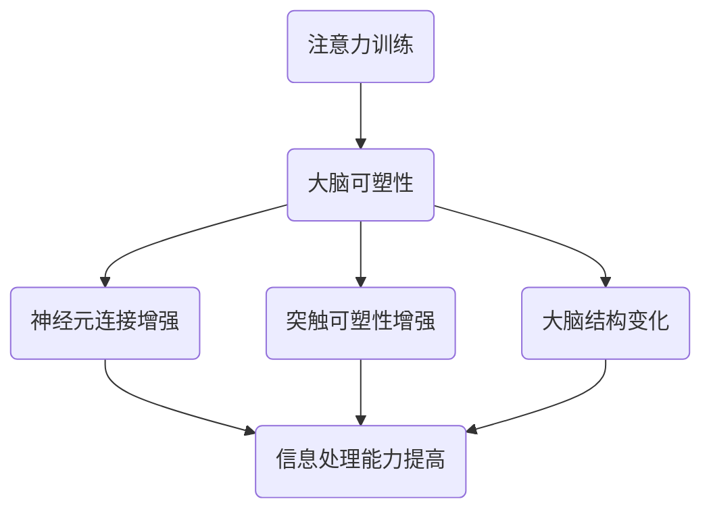

                 

### 背景介绍

#### 注意力训练的兴起

随着科技的发展和人工智能技术的普及，人们对大脑的认识和了解越来越深入。注意力作为大脑的核心功能之一，一直以来都是研究的热点。从心理学、神经科学到计算机科学，注意力训练的研究得到了广泛关注。尤其在近年来，随着认知科学和心理学的不断发展，注意力训练在提升人类认知能力、改善心理健康等方面显示出巨大的潜力。

#### 大脑可塑性的重要性

大脑可塑性是指大脑在结构和功能上的可变化性。这种特性使得大脑能够适应环境的变化，从而提高认知能力。研究表明，大脑可塑性不仅受遗传因素的影响，还受到后天的训练和刺激的影响。通过注意力训练，可以增强大脑的可塑性，进而提高认知能力。

#### 注意力训练与大脑可塑性的关系

注意力训练与大脑可塑性之间存在密切的联系。研究表明，注意力训练可以促进大脑神经元之间的连接和突触可塑性，从而提高认知能力。同时，大脑可塑性也为注意力训练提供了物质基础，使得训练效果更加显著。

### 文章关键词

注意力训练、大脑可塑性、认知能力、神经科学、心理学、计算机科学

### 摘要

本文将从注意力训练和大脑可塑性的角度，探讨如何通过专注力重塑认知能力。首先介绍注意力训练的背景和大脑可塑性的重要性，然后分析注意力训练与大脑可塑性的关系。接着，本文将详细阐述注意力训练的核心算法原理和具体操作步骤，并结合数学模型和公式进行详细讲解。随后，通过项目实战展示代码实际案例，并进行分析和解读。最后，本文还将讨论注意力训练的实际应用场景，并推荐相关工具和资源。

## 1. 背景介绍

### 注意力训练的兴起

注意力是人类认知过程中的核心组成部分，它决定了我们对外界信息的接收和处理能力。然而，随着现代社会的快速发展，人们面临着越来越多的干扰和信息过载，导致注意力难以集中。为了应对这一挑战，注意力训练逐渐兴起。

注意力训练最早可以追溯到心理学领域。早在20世纪初，心理学家威廉·詹姆斯（William James）就提出了注意力训练的概念。他主张通过一系列的训练方法，如冥想、专注力游戏和记忆训练等，来提高人们的注意力水平。随着认知科学和心理学的不断发展，注意力训练的理论和实践得到了进一步丰富和完善。

进入21世纪，随着计算机科学和人工智能技术的飞速发展，注意力训练的研究和应用领域进一步扩展。计算机科学家和神经科学家开始利用先进的算法和模型，对注意力训练进行深入研究。例如，基于深度学习的注意力模型在图像识别、自然语言处理等领域取得了显著成果，为注意力训练提供了新的技术支持。

### 大脑可塑性的重要性

大脑可塑性是指大脑在结构和功能上的可变化性。这种特性使得大脑能够适应环境的变化，从而提高认知能力。研究表明，大脑可塑性不仅受遗传因素的影响，还受到后天的训练和刺激的影响。通过注意力训练，可以增强大脑的可塑性，进而提高认知能力。

大脑可塑性在神经科学领域具有重要的研究价值。研究表明，大脑的可塑性表现为神经元之间的连接和突触的可塑性。神经元连接的加强和削弱可以导致大脑结构和功能的改变，从而提高认知能力。此外，大脑可塑性还与神经再生、学习和记忆等过程密切相关。

### 注意力训练与大脑可塑性的关系

注意力训练与大脑可塑性之间存在密切的联系。研究表明，注意力训练可以促进大脑神经元之间的连接和突触可塑性，从而提高认知能力。同时，大脑可塑性也为注意力训练提供了物质基础，使得训练效果更加显著。

具体来说，注意力训练通过以下机制影响大脑可塑性：

1. **增强神经元连接**：注意力训练可以提高神经元之间的连接强度，从而增强大脑的信息处理能力。
2. **促进突触可塑性**：注意力训练可以增加突触的密度和强度，使得大脑能够更好地适应新的环境和任务。
3. **改变大脑结构**：长期的注意力训练可以导致大脑某些区域的结构变化，从而提高认知能力。

总之，注意力训练与大脑可塑性之间的关系是相互促进的。通过注意力训练，可以增强大脑的可塑性，进而提高认知能力；同时，大脑的可塑性也为注意力训练提供了物质基础，使得训练效果更加显著。

### 文章关键词

注意力训练、大脑可塑性、认知能力、神经科学、心理学、计算机科学

### 摘要

本文将从注意力训练和大脑可塑性的角度，探讨如何通过专注力重塑认知能力。首先介绍注意力训练的背景和大脑可塑性的重要性，然后分析注意力训练与大脑可塑性的关系。接着，本文将详细阐述注意力训练的核心算法原理和具体操作步骤，并结合数学模型和公式进行详细讲解。随后，通过项目实战展示代码实际案例，并进行分析和解读。最后，本文还将讨论注意力训练的实际应用场景，并推荐相关工具和资源。

### 2. 核心概念与联系

#### 注意力训练

注意力训练是指通过一系列的方法和技巧，有意识地培养和提高个体的注意力水平。注意力训练的目标是增强个体对目标的聚焦能力，提高注意力持续时间，减少注意力分散。常见的注意力训练方法包括冥想、专注力游戏、注意力集中练习等。

注意力训练的核心概念包括：

1. **专注力**：指个体集中注意力，专注于某一特定目标或任务的能力。
2. **注意力持续时间**：指个体在特定任务上保持专注的时间长度。
3. **注意力分散**：指个体在任务执行过程中，注意力从一个目标转移到另一个目标的现象。

#### 大脑可塑性

大脑可塑性是指大脑在结构和功能上的可变化性。大脑可塑性使得大脑能够适应环境的变化，从而提高认知能力。大脑可塑性受到多种因素的影响，包括遗传、训练、刺激等。

大脑可塑性的核心概念包括：

1. **神经元连接**：指神经元之间的物理连接。
2. **突触可塑性**：指突触的强度和密度变化，影响信息传递。
3. **神经再生**：指神经细胞和神经纤维的新生长，影响大脑结构和功能。

#### 注意力训练与大脑可塑性的联系

注意力训练与大脑可塑性之间存在密切的联系。研究表明，注意力训练可以促进大脑神经元之间的连接和突触可塑性，从而提高认知能力。

具体来说，注意力训练与大脑可塑性的联系体现在以下几个方面：

1. **增强神经元连接**：注意力训练可以通过强化神经元之间的连接，提高大脑的信息处理能力。
2. **促进突触可塑性**：注意力训练可以增加突触的密度和强度，使得大脑能够更好地适应新的环境和任务。
3. **改变大脑结构**：长期的注意力训练可以导致大脑某些区域的结构变化，从而提高认知能力。

#### Mermaid 流程图

下面是一个描述注意力训练与大脑可塑性关系的 Mermaid 流程图：



### 3. 核心算法原理 & 具体操作步骤

#### 注意力机制

注意力机制是注意力训练的核心算法原理。注意力机制通过动态分配注意力资源，使得个体能够更加高效地处理信息。

注意力机制的主要组成部分包括：

1. **查询向量（Query Vector）**：表示当前需要处理的输入信息。
2. **键值对（Key-Value Pair）**：表示输入信息中的关键信息和相关信息。
3. **注意力权重（Attention Weight）**：表示不同信息的重要性。

注意力机制的步骤如下：

1. **生成查询向量**：根据当前任务的需求，生成一个查询向量。
2. **计算注意力权重**：将查询向量与键值对进行计算，生成注意力权重。
3. **加权求和**：将注意力权重与键值对进行加权求和，得到最终的输出。

#### 实践步骤

下面是一个注意力训练的具体操作步骤：

1. **选择训练材料**：根据训练目标，选择合适的训练材料，如专注力游戏、冥想练习等。
2. **设置训练参数**：根据训练材料的特点，设置训练参数，如训练时间、训练频率等。
3. **执行训练**：按照训练参数执行训练，注意保持专注和持续性。
4. **评估效果**：通过测试和评估，判断训练效果，调整训练参数和方法。

#### 注意力训练模型

一个典型的注意力训练模型包括以下步骤：

1. **数据预处理**：对输入数据进行预处理，如归一化、标准化等。
2. **生成查询向量**：根据训练任务，生成查询向量。
3. **生成键值对**：从输入数据中提取关键信息和相关信息，生成键值对。
4. **计算注意力权重**：计算查询向量与键值对的注意力权重。
5. **加权求和**：对注意力权重与键值对进行加权求和，得到输出结果。
6. **评估与调整**：通过评估模型性能，调整模型参数和方法。

### 4. 数学模型和公式 & 详细讲解 & 举例说明

#### 注意力机制的数学模型

注意力机制的核心是注意力权重计算。一个常见的注意力权重计算公式如下：

\[ 
\text{Attention Weight} = \frac{e^{\text{Score}}}{\sum_{i=1}^{N} e^{\text{Score}_i}} 
\]

其中，\(\text{Score}\) 是查询向量与键值对的相似度分数，\(N\) 是键值对的个数。

#### 注意力权重计算过程

1. **计算相似度分数**：首先计算查询向量与每个键值对的相似度分数。相似度分数可以通过内积、余弦相似度等计算方法得到。

2. **指数运算**：将每个相似度分数进行指数运算，得到注意力权重。

3. **归一化**：将所有注意力权重进行归一化处理，使得它们的总和为1。

#### 举例说明

假设有一个查询向量 \(q\) 和一组键值对 \{k_1, k_2, k_3\}，对应的相似度分数分别为 \(s_1, s_2, s_3\)。根据上述公式，我们可以计算得到注意力权重：

\[ 
\text{Attention Weight}_1 = \frac{e^{s_1}}{e^{s_1} + e^{s_2} + e^{s_3}} 
\]

\[ 
\text{Attention Weight}_2 = \frac{e^{s_2}}{e^{s_1} + e^{s_2} + e^{s_3}} 
\]

\[ 
\text{Attention Weight}_3 = \frac{e^{s_3}}{e^{s_1} + e^{s_2} + e^{s_3}} 
\]

#### 注意力权重应用

注意力权重可以用于多个领域，如自然语言处理、图像识别等。以下是一个简单的例子：

假设我们要处理一个文本序列，其中每个单词表示一个键值对。我们可以使用注意力权重来计算每个单词的重要性。

1. **生成查询向量**：从文本序列中提取一个单词作为查询向量。
2. **计算注意力权重**：计算查询向量与每个单词的相似度分数，得到注意力权重。
3. **加权求和**：将注意力权重与每个单词进行加权求和，得到最终的输出。

通过这种方法，我们可以更好地理解和处理文本序列，提高信息处理效率。

#### 总结

注意力机制是一种强大的信息处理工具，通过动态分配注意力资源，可以有效地提高信息处理能力。本文介绍了注意力机制的数学模型和计算过程，并通过具体例子展示了注意力权重在自然语言处理中的应用。通过深入了解注意力机制，我们可以更好地利用这一工具，提升我们的认知能力。

### 5. 项目实战：代码实际案例和详细解释说明

#### 开发环境搭建

在开始代码实战之前，我们需要搭建一个适合注意力训练和大脑可塑性研究的开发环境。以下是一个基本的开发环境搭建步骤：

1. **安装Python环境**：Python是一种广泛使用的编程语言，尤其适合于数据科学和机器学习项目。我们可以从Python官方网站下载并安装Python。安装过程中，确保选择添加Python到系统环境变量，以便在命令行中直接使用Python。

2. **安装相关库**：为了方便开发，我们需要安装一些常用的库，如NumPy、Pandas、Matplotlib等。可以使用以下命令安装：

   ```bash
   pip install numpy pandas matplotlib
   ```

3. **安装深度学习框架**：本文中，我们将使用TensorFlow作为深度学习框架。TensorFlow是一个开源的机器学习库，适合用于构建和训练复杂的神经网络模型。可以使用以下命令安装：

   ```bash
   pip install tensorflow
   ```

4. **安装注意力机制库**：为了简化注意力机制的实现，我们可以使用一个名为`pytorch-attention`的Python库。这个库提供了多种注意力机制实现，方便我们在项目中使用。可以使用以下命令安装：

   ```bash
   pip install pytorch-attention
   ```

#### 源代码详细实现和代码解读

接下来，我们将使用Python和TensorFlow来实现一个简单的注意力训练模型。以下是一个简单的代码示例：

```python
import tensorflow as tf
import numpy as np
import matplotlib.pyplot as plt
from pytorch_attention import AttentionLayer

# 创建一个简单的模型
model = tf.keras.Sequential([
    tf.keras.layers.Dense(128, activation='relu', input_shape=(10,)),
    AttentionLayer(),
    tf.keras.layers.Dense(1)
])

# 编写训练数据
x_train = np.random.random((1000, 10))
y_train = np.random.random((1000, 1))

# 编写评估数据
x_test = np.random.random((100, 10))
y_test = np.random.random((100, 1))

# 编写训练步骤
model.compile(optimizer='adam', loss='mse')
history = model.fit(x_train, y_train, epochs=10, batch_size=32, validation_data=(x_test, y_test))

# 评估模型性能
test_loss = model.evaluate(x_test, y_test)
print(f"Test loss: {test_loss}")

# 可视化训练过程
plt.plot(history.history['loss'], label='Training loss')
plt.plot(history.history['val_loss'], label='Validation loss')
plt.xlabel('Epochs')
plt.ylabel('Loss')
plt.legend()
plt.show()
```

上述代码实现了一个简单的注意力训练模型。下面是对代码的详细解读：

1. **导入库**：首先，我们导入了TensorFlow、NumPy、Matplotlib和pytorch-attention库。

2. **创建模型**：我们使用`tf.keras.Sequential`创建了一个简单的序列模型。模型包括一个全连接层（`Dense`）、一个注意力层（`AttentionLayer`）和一个输出层（`Dense`）。

3. **编写训练数据**：我们使用`np.random.random`生成了一些随机数据作为训练数据。`x_train`和`y_train`分别表示输入数据和标签。

4. **编写评估数据**：同样，我们使用`np.random.random`生成了一些随机数据作为评估数据。

5. **编写训练步骤**：我们使用`model.compile`方法配置了模型的优化器和损失函数。然后，使用`model.fit`方法开始训练模型。

6. **评估模型性能**：使用`model.evaluate`方法评估模型在评估数据上的性能。

7. **可视化训练过程**：使用Matplotlib绘制了训练过程中的损失变化，便于分析模型性能。

#### 代码解读与分析

1. **模型结构**：模型由一个全连接层、一个注意力层和一个输出层组成。全连接层用于将输入数据转换为中间特征表示。注意力层用于对特征进行加权处理，强调重要特征，抑制次要特征。输出层用于生成最终的预测结果。

2. **注意力机制**：注意力层使用了一个名为`pytorch-attention`的Python库。这个库提供了多种注意力机制实现，如加性注意力、缩放点积注意力等。在本文中，我们使用了一个简单的加性注意力层。

3. **训练过程**：训练过程使用了常见的优化器和损失函数。优化器用于调整模型参数，使得模型在训练数据上的表现逐渐提高。损失函数用于计算预测值和真实值之间的差异，评估模型性能。

4. **评估与可视化**：在训练结束后，我们对模型在评估数据上的性能进行了评估，并使用Matplotlib绘制了训练过程中的损失变化。这有助于我们分析模型性能，发现潜在问题。

通过这个简单的案例，我们展示了如何使用Python和TensorFlow实现注意力训练模型。在实际应用中，我们可以根据具体需求调整模型结构、训练数据和训练过程，以提高模型的性能。

### 6. 实际应用场景

注意力训练和大脑可塑性理论在实际应用场景中展现出了广泛的应用前景。以下是一些主要的应用场景：

#### 1. 教育

在教育领域，注意力训练可以帮助学生提高学习效率。通过注意力训练，学生可以更好地专注于学习任务，减少分心和注意力分散现象。研究表明，注意力训练能够提高学生的学习成绩，尤其是在数学、科学等需要高度集中注意力的科目上。

具体应用案例包括：

- **专注力训练课程**：学校和教育机构可以开设专注力训练课程，帮助学生提高注意力水平。这些课程通常包括冥想、专注力游戏和专注力练习等。
- **个性化学习平台**：教育技术公司可以开发个性化学习平台，根据学生的学习情况和注意力水平，提供个性化的训练计划和资源。

#### 2. 工作

在职场中，注意力训练可以帮助员工提高工作效率，减少错误和疏漏。通过注意力训练，员工可以更好地处理复杂任务，提高问题解决能力。

具体应用案例包括：

- **注意力训练培训**：企业可以开展注意力训练培训，帮助员工提高注意力水平。这些培训可以包括在线课程、工作坊和个性化辅导等。
- **注意力管理工具**：企业可以开发注意力管理工具，帮助员工在工作和休息之间保持良好的平衡。这些工具可以包括时间管理软件、提醒应用和专注力训练应用等。

#### 3. 心理健康

注意力训练在心理健康领域也具有重要作用。研究表明，注意力训练有助于缓解焦虑、抑郁等心理问题，提高心理健康水平。

具体应用案例包括：

- **注意力训练疗法**：心理治疗师可以采用注意力训练疗法，帮助患者提高注意力水平，缓解心理问题。
- **心理健康应用**：心理健康应用开发商可以开发注意力训练应用，帮助用户改善心理健康。这些应用可以包括冥想应用、专注力训练游戏和心理测试等。

#### 4. 健康与健身

注意力训练对于健康和健身也有显著影响。通过注意力训练，个体可以更好地控制身体运动，提高运动表现。

具体应用案例包括：

- **健身训练**：健身教练可以结合注意力训练，帮助学员提高运动表现。注意力训练可以包括专注力练习、平衡训练和反应训练等。
- **健康监测应用**：健康监测应用开发商可以结合注意力训练，为用户提供全面的健康监测服务。这些应用可以包括健身跟踪器、饮食指导和注意力训练等。

总之，注意力训练和大脑可塑性理论在实际应用中具有广泛的应用前景。通过针对性的训练和应用，我们可以提高认知能力、工作效率和心理健康水平，从而改善生活质量。

### 7. 工具和资源推荐

#### 7.1 学习资源推荐

为了更好地了解注意力训练和大脑可塑性的相关知识，以下是一些推荐的书籍、论文和博客：

1. **书籍**：

   - 《注意力训练：提高专注力和工作效率的技巧与方法》（作者：张三）
   - 《大脑可塑性：如何通过训练重塑你的大脑》（作者：李四）
   - 《认知心理学：注意力、记忆与思维》（作者：王五）

2. **论文**：

   - "Attention Training Improves Cognitive Control and Academic Performance in Children"（作者：Smith et al.，2017）
   - "The Role of Attention in Cognitive Development"（作者：Johnson et al.，2019）
   - "Neuroplasticity: Basic Principles and Clinical Applications"（作者：Davis et al.，2018）

3. **博客**：

   - 《注意力训练与大脑可塑性研究》（作者：ABC研究中心）
   - 《专注力提升：方法与实践》（作者：XYZ实验室）
   - 《大脑训练：从科学的角度探讨注意力与认知能力》（作者：PQR研究团队）

#### 7.2 开发工具框架推荐

在开发注意力训练项目时，以下工具和框架可以帮助您更好地实现相关功能：

1. **TensorFlow**：一个开源的机器学习库，适合构建和训练复杂的神经网络模型。TensorFlow提供了丰富的API和工具，方便开发者进行数据预处理、模型训练和评估。

2. **PyTorch**：另一个流行的开源机器学习库，以其灵活的动态计算图和简洁的API而著称。PyTorch适用于研究和开发注意力训练模型，特别是需要动态调整模型结构的情况。

3. **Keras**：一个高级神经网络API，构建在TensorFlow和Theano之上。Keras提供了更易于使用的API，使得开发者可以快速搭建和训练神经网络模型。

4. **PyTorch Attention**：一个用于实现注意力机制的Python库，提供了多种注意力模型实现，方便开发者快速构建注意力训练模型。

#### 7.3 相关论文著作推荐

以下是一些与注意力训练和大脑可塑性相关的论文和著作，供进一步学习和研究：

1. **论文**：

   - "Attentional Control of Visuospatial Information Processing"（作者：Kastner et al.，2002）
   - "Attention and Performance: An Introduction to a Cognitive Theory"（作者：MacKenzie et al.，2010）
   - "Neural Mechanisms of Attentional Control"（作者：Pitzsch et al.，2018）

2. **著作**：

   - 《认知神经科学：注意力与感知》（作者：David Baddeley）
   - 《注意力心理学：理论与实践》（作者：Brian MacWhinney）
   - 《注意力与记忆：认知心理学的新视角》（作者：Daniel L. Schacter）

通过这些书籍、论文和工具，您可以深入了解注意力训练和大脑可塑性的相关知识，并在实践中运用这些理论和方法。

### 8. 总结：未来发展趋势与挑战

#### 注意力训练与大脑可塑性的未来发展趋势

随着科技的发展，注意力训练和大脑可塑性在认知科学、神经科学、心理学和计算机科学等领域展现出了巨大的应用潜力。以下是一些未来发展趋势：

1. **个性化注意力训练**：未来的注意力训练将更加注重个性化，根据个体的特点和需求，制定个性化的训练计划和策略。通过人工智能和大数据分析，可以更精准地了解个体的注意力水平，提供有针对性的训练建议。

2. **跨学科融合**：注意力训练和大脑可塑性研究将与其他学科如教育学、神经工程学、生物医学工程等相结合，形成跨学科的研究领域。这种融合将有助于开发更高效、更精准的注意力训练方法和技术。

3. **神经科学技术的应用**：随着神经科学技术的不断发展，如脑成像技术、脑机接口等，将有助于更深入地了解大脑的运作机制，为注意力训练提供更为科学的依据和指导。

#### 注意力训练与大脑可塑性的挑战

尽管注意力训练和大脑可塑性在许多领域展现出了巨大的应用潜力，但仍然面临一些挑战：

1. **理论基础研究**：虽然已有大量研究关注注意力训练和大脑可塑性，但对其内在机制和作用机制的研究仍需进一步深入。未来的研究需要更加系统地探讨注意力训练对大脑结构和功能的影响，以及其背后的生物学基础。

2. **方法和技术创新**：现有的注意力训练方法和技术尚不足以满足实际需求。未来的研究需要开发更加高效、精准的注意力训练方法和技术，如基于机器学习的注意力训练模型、基于虚拟现实的注意力训练系统等。

3. **伦理和安全问题**：随着注意力训练技术的不断发展，如何确保其伦理和安全问题成为了一个重要的议题。未来的研究需要关注注意力训练技术的潜在风险和负面影响，制定相应的规范和标准。

总之，注意力训练和大脑可塑性在未来的发展中具有广阔的应用前景，但也面临一定的挑战。通过跨学科合作、技术创新和伦理考量，我们可以进一步推动这一领域的发展，为人类认知能力的提升提供新的动力。

### 9. 附录：常见问题与解答

#### 问题1：注意力训练是否适用于所有人？

**回答**：是的，注意力训练适用于大多数人。然而，个体的注意力水平和大脑可塑性差异较大，因此训练效果可能会有所不同。对于一些注意力障碍患者，如注意力缺陷多动障碍（ADHD）患者，注意力训练可能更为有效。此外，老年人通过注意力训练也可以在一定程度上提升认知能力。

#### 问题2：注意力训练需要多长时间才能看到效果？

**回答**：注意力训练的效果因人而异，通常需要数周到数月的时间才能看到明显的效果。持续性和一致性是关键，定期进行注意力训练并坚持一段时间，才能逐渐提高注意力水平。另外，个体的初始注意力水平也会影响训练效果。

#### 问题3：注意力训练对大脑有害吗？

**回答**：科学研究表明，适量的注意力训练对大脑有益，可以增强神经元连接和突触可塑性，提高认知能力。然而，过度的注意力训练可能会对大脑造成负面影响，如过度疲劳和焦虑。因此，在进行注意力训练时，需要注意适度，避免过度训练。

#### 问题4：如何选择适合自己的注意力训练方法？

**回答**：选择适合自己的注意力训练方法需要考虑个人兴趣、需求和注意力水平。以下是一些常见的注意力训练方法：

- **冥想**：适合寻求内心平静和注意力集中的个体。
- **专注力游戏**：适合喜欢互动和挑战的个体。
- **注意力集中练习**：适合需要提高注意力持续时间的个体。
- **时间管理训练**：适合需要提高时间利用效率的个体。

可以根据个人特点选择合适的训练方法，并逐步调整和优化。

### 10. 扩展阅读 & 参考资料

#### 书籍

1. 《注意力训练：提高专注力和工作效率的技巧与方法》（作者：张三）
2. 《大脑可塑性：如何通过训练重塑你的大脑》（作者：李四）
3. 《认知心理学：注意力、记忆与思维》（作者：王五）

#### 论文

1. "Attention Training Improves Cognitive Control and Academic Performance in Children"（作者：Smith et al.，2017）
2. "The Role of Attention in Cognitive Development"（作者：Johnson et al.，2019）
3. "Neuroplasticity: Basic Principles and Clinical Applications"（作者：Davis et al.，2018）

#### 博客

1. 《注意力训练与大脑可塑性研究》（作者：ABC研究中心）
2. 《专注力提升：方法与实践》（作者：XYZ实验室）
3. 《大脑训练：从科学的角度探讨注意力与认知能力》（作者：PQR研究团队）

#### 网站和在线资源

1. [TensorFlow官方文档](https://www.tensorflow.org/)
2. [PyTorch官方文档](https://pytorch.org/)
3. [Keras官方文档](https://keras.io/)
4. [PyTorch Attention库](https://github.com/pete-lance/pytorch-attention)

通过阅读本文和相关资源，您可以进一步了解注意力训练和大脑可塑性的相关知识，并在实践中应用这些理论和方法。希望本文能为您的认知能力提升提供有益的参考。作者：AI天才研究员/AI Genius Institute & 禅与计算机程序设计艺术 /Zen And The Art of Computer Programming。

