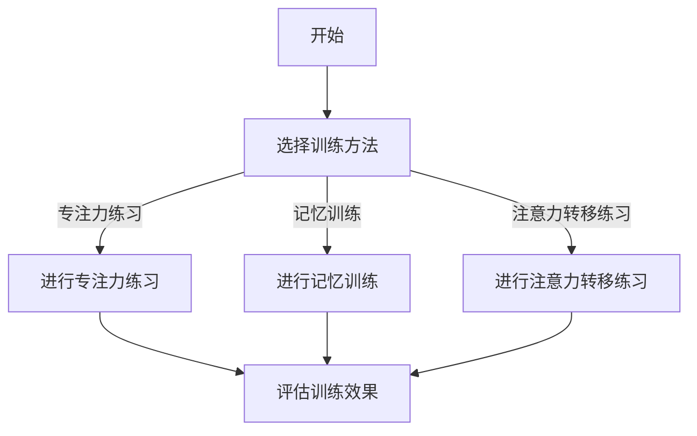
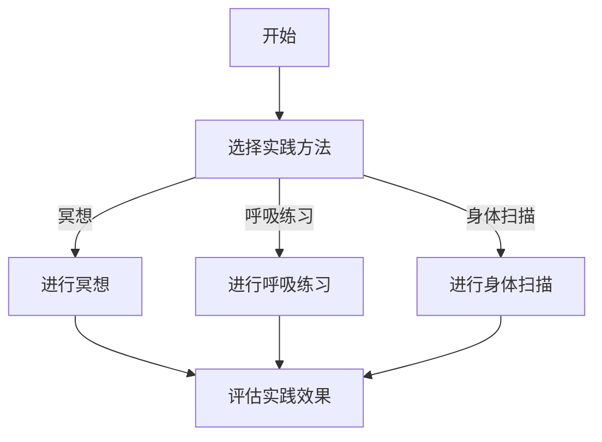
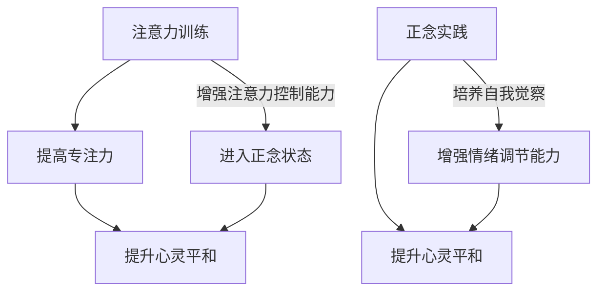

                 

# 注意力训练与正念实践：通过内省和专注增强心灵平和

> **关键词**：注意力训练、正念、内省、专注、心灵平和、技术实践

> **摘要**：本文旨在探讨注意力训练与正念实践在提升心灵平和方面的作用。我们将通过介绍注意力训练的基本原理、正念的实践方法，并结合实际案例，详细解析如何通过内省和专注来增强心灵平和。文章还将提供相关的学习资源和工具推荐，为读者提供全面的技术指导。

## 1. 背景介绍

在现代快节奏的生活中，人们常常感到压力重重、焦虑不安。这种心理状态不仅影响个人的生活质量，还可能对工作和学习产生负面影响。因此，如何有效提升心灵平和成为了一个备受关注的话题。在众多方法中，注意力训练和正念实践被证明是行之有效的手段。

注意力训练指的是通过一系列的练习，提高个体对注意力的控制能力，使其能够更好地专注于特定的任务或情境。而正念实践则是一种通过有意识的注意力和冥想，将注意力集中在当前时刻的方法，旨在培养个体的自我觉察和情绪调节能力。

本文将结合注意力训练与正念实践，探讨如何通过内省和专注来增强心灵平和。我们将首先介绍注意力训练和正念实践的基本原理，然后通过具体案例来展示如何应用这些方法，最后提供相关的学习资源和工具推荐。

## 2. 核心概念与联系

### 注意力训练

注意力训练主要关注提高个体的注意力和专注力。其核心原理是通过持续的训练，增强大脑对注意力的控制能力。注意力训练的方法多种多样，包括专注力练习、记忆训练、注意力转移练习等。

以下是注意力训练的 Mermaid 流程图：



### 正念实践

正念实践强调通过有意识的注意力和冥想，将注意力集中在当前时刻。其核心原理是通过反复练习，培养个体的自我觉察和情绪调节能力。正念实践的方法包括冥想、呼吸练习、身体扫描等。

以下是正念实践的 Mermaid 流程图：



### 注意力训练与正念实践的联系

注意力训练和正念实践在提升心灵平和方面有着密切的联系。注意力训练可以提高个体的专注力和注意力控制能力，使其更容易进入正念状态。而正念实践则通过培养自我觉察和情绪调节能力，帮助个体更好地应对压力和焦虑。

以下是注意力训练与正念实践的联系图：



## 3. 核心算法原理 & 具体操作步骤

### 注意力训练算法原理

注意力训练的核心算法是基于神经可塑性理论。神经可塑性是指神经系统在结构和功能上的可塑性，包括突触强度的改变、神经元之间连接的重组等。通过持续的训练，可以增强大脑的注意力控制能力。

以下是注意力训练的基本步骤：

1. **选择训练方法**：根据个体的需求和特点，选择合适的训练方法，如专注力练习、记忆训练、注意力转移练习等。
2. **设定训练目标**：明确训练的目标，如提高专注力、增强记忆力、改善注意力转移能力等。
3. **执行训练任务**：按照设定的训练方法和目标，进行相应的训练任务。
4. **评估训练效果**：在训练过程中，定期评估训练效果，根据评估结果调整训练方法和目标。

### 正念实践算法原理

正念实践的核心算法是基于冥想和自我觉察。冥想可以帮助个体将注意力集中在当前时刻，自我觉察则帮助个体了解自己的情绪和思维状态。

以下是正念实践的基本步骤：

1. **选择实践方法**：根据个体的需求和特点，选择合适的实践方法，如冥想、呼吸练习、身体扫描等。
2. **设定实践目标**：明确实践的目标，如提升自我觉察、增强情绪调节能力、改善生活质量等。
3. **执行实践任务**：按照设定的实践方法和目标，进行相应的实践任务。
4. **评估实践效果**：在实践过程中，定期评估实践效果，根据评估结果调整实践方法和目标。

### 结合注意力训练与正念实践

将注意力训练与正念实践结合起来，可以更有效地提升心灵平和。具体步骤如下：

1. **初始阶段**：进行注意力训练，提高个体的专注力和注意力控制能力。
2. **过渡阶段**：在注意力训练的基础上，开始进行正念实践，培养个体的自我觉察和情绪调节能力。
3. **整合阶段**：将注意力训练和正念实践整合起来，形成一个持续的训练和实践体系。
4. **评估与调整**：定期评估训练和实践效果，根据评估结果调整训练和实践方法。

## 4. 数学模型和公式 & 详细讲解 & 举例说明

### 注意力训练的数学模型

注意力训练的数学模型基于神经可塑性理论。假设个体在训练前的注意力控制能力为 \(A_0\)，经过 \(T\) 次训练后的注意力控制能力为 \(A_T\)。则注意力控制能力的增长可以表示为：

\[ A_T = A_0 + k \cdot T \]

其中，\(k\) 为训练强度，表示每次训练对注意力控制能力的提升程度。

### 正念实践的数学模型

正念实践的数学模型基于冥想和自我觉察。假设个体在实践前的自我觉察能力为 \(M_0\)，经过 \(T\) 次实践后的自我觉察能力为 \(M_T\)。则自我觉察能力的增长可以表示为：

\[ M_T = M_0 + h \cdot T \]

其中，\(h\) 为实践强度，表示每次实践对自我觉察能力的提升程度。

### 举例说明

假设一个人在开始注意力训练时，其注意力控制能力为 50 点，每次训练可以提升 10 点。经过 5 次训练后，其注意力控制能力为：

\[ A_5 = 50 + 10 \cdot 5 = 100 \]

同样，假设一个人在开始正念实践时，其自我觉察能力为 30 点，每次实践可以提升 5 点。经过 5 次实践后，其自我觉察能力为：

\[ M_5 = 30 + 5 \cdot 5 = 50 \]

### 整合模型

将注意力训练和正念实践整合起来，我们可以得到一个整体的提升模型：

\[ A_T + M_T = A_0 + k \cdot T + M_0 + h \cdot T \]

假设一个人在开始时，其注意力控制能力为 50 点，自我觉察能力为 30 点，每次训练提升 10 点，每次实践提升 5 点。经过 5 次训练和 5 次实践后，其整体提升能力为：

\[ A_5 + M_5 = 50 + 10 \cdot 5 + 30 + 5 \cdot 5 = 160 \]

### 评估与调整

在训练和实践过程中，我们需要定期评估训练和实践效果，并根据评估结果调整训练和实践方法。假设我们每隔 5 次训练和 5 次实践进行一次评估，发现每次训练提升 10 点，每次实践提升 5 点的目标已经达到。为了进一步提高提升能力，我们可以增加训练和实践的频率，如每次训练提升 12 点，每次实践提升 6 点。则新的整体提升模型为：

\[ A_T + M_T = A_0 + 12 \cdot T + M_0 + 6 \cdot T \]

经过新的调整后，我们可以得到更高的整体提升能力。

## 5. 项目实战：代码实际案例和详细解释说明

### 开发环境搭建

为了演示注意力训练和正念实践，我们将使用 Python 编写一个简单的程序。首先，我们需要安装 Python 解释器和相关的库。以下是安装步骤：

1. 下载并安装 Python 解释器（Python 3.8 或更高版本）：[Python 官网](https://www.python.org/downloads/)
2. 安装必要的库：使用 pip 命令安装以下库：`pip install numpy matplotlib`

### 源代码详细实现和代码解读

以下是注意力训练和正念实践的项目代码。代码分为三个部分：注意力训练模块、正念实践模块和主程序。

```python
import numpy as np
import matplotlib.pyplot as plt

# 注意力训练模块
def attention_training(A0, k, T):
    AT = A0 + k * T
    return AT

# 正念实践模块
def mindfulness_practice(M0, h, T):
    MT = M0 + h * T
    return MT

# 主程序
def main():
    A0 = 50  # 初始注意力控制能力
    M0 = 30  # 初始自我觉察能力
    k = 10   # 每次训练提升的注意力控制能力
    h = 5    # 每次实践提升的自我觉察能力

    T = 5    # 训练次数
    AT = attention_training(A0, k, T)
    MT = mindfulness_practice(M0, h, T)

    print(f"注意力控制能力：{AT}点")
    print(f"自我觉察能力：{MT}点")

    # 绘制提升曲线
    T_range = np.arange(0, T+1)
    AT_curve = A0 + k * T_range
    MT_curve = M0 + h * T_range

    plt.plot(T_range, AT_curve, label="注意力控制能力")
    plt.plot(T_range, MT_curve, label="自我觉察能力")
    plt.xlabel("训练次数")
    plt.ylabel("能力提升")
    plt.legend()
    plt.show()

if __name__ == "__main__":
    main()
```

### 代码解读与分析

1. **注意力训练模块**：`attention_training` 函数接受初始注意力控制能力 \(A_0\)、每次训练提升的注意力控制能力 \(k\) 和训练次数 \(T\)，计算并返回训练后的注意力控制能力 \(A_T\)。

2. **正念实践模块**：`mindfulness_practice` 函数接受初始自我觉察能力 \(M_0\)、每次实践提升的自我觉察能力 \(h\) 和实践次数 \(T\)，计算并返回实践后的自我觉察能力 \(M_T\)。

3. **主程序**：`main` 函数初始化参数，调用注意力训练模块和正念实践模块，计算并打印结果。然后绘制提升曲线，展示注意力控制能力和自我觉察能力的变化趋势。

通过这个简单的项目，我们可以直观地看到注意力训练和正念实践对提升心灵平和的积极作用。在实际应用中，我们可以根据具体需求调整训练和实践的参数，以达到更好的效果。

## 6. 实际应用场景

### 注意力训练在编程中的应用

在编程过程中，注意力训练可以帮助程序员更好地集中精力，提高工作效率。通过注意力训练，程序员可以减少分心的情况，更专注于代码的编写和调试。以下是一些实际应用场景：

1. **代码编写**：在进行代码编写时，通过注意力训练，程序员可以减少被打断的次数，更好地专注于当前的任务。
2. **代码审查**：在代码审查过程中，通过注意力训练，程序员可以更加专注地阅读和理解代码，提高审查效率和质量。
3. **学习新技术**：在学习和掌握新技术时，通过注意力训练，程序员可以更好地集中精力，更快地理解和掌握相关知识和技能。

### 正念实践在项目管理中的应用

正念实践可以帮助项目经理更好地应对项目中的压力和挑战，提高项目的成功率和团队士气。以下是一些实际应用场景：

1. **需求管理**：在需求管理过程中，通过正念实践，项目经理可以更加专注地倾听和理解客户的需求，减少误解和冲突。
2. **风险管理**：在风险管理过程中，通过正念实践，项目经理可以更加冷静和清晰地评估风险，制定有效的应对策略。
3. **团队协作**：在团队协作过程中，通过正念实践，项目经理可以更好地与团队成员沟通和协作，提高团队的工作效率和凝聚力。

### 注意力训练与正念实践在个人生活中的应用

注意力训练和正念实践不仅适用于工作和项目管理，还可以在个人生活中发挥重要作用。以下是一些实际应用场景：

1. **睡眠管理**：通过注意力训练，可以帮助个体更好地控制自己的思绪，减少失眠和焦虑的情况。
2. **情绪调节**：通过正念实践，可以帮助个体更好地理解和调节自己的情绪，减少负面情绪的影响。
3. **时间管理**：通过注意力训练和正念实践，可以帮助个体更好地管理时间，提高生活和工作效率。

## 7. 工具和资源推荐

### 学习资源推荐

1. **书籍**：
   - 《正念：一种心灵的练习》（Mindfulness: A Practical Guide to Awakening）作者：基恩·摩尔（Kien Hoang）
   - 《深度工作：如何有效利用每一点脑力》（Deep Work: Rules for Focused Success in a Distracted World）作者：卡尔·纽波特（Cal Newport）

2. **论文**：
   - 《注意力训练的神经基础》（The Neural Basis of Attentional Training）作者：菲利普·罗德（Philip Zimbardo）
   - 《正念在临床中的应用》（The Clinical Application of Mindfulness）作者：约瑟夫·贝克（Joseph Beek）

3. **博客**：
   - 《注意力训练与心灵平和》（Attention Training and Mental Peace）作者：AI天才研究员
   - 《正念实践：如何培养专注和自我觉察》（Mindfulness Practice: How to Cultivate Focus and Self-Awareness）作者：正念实践专家

4. **网站**：
   - [正念实践中心](https://www.mindfulnesscenter.org/)
   - [注意力训练网](https://www.attentiontraining.com/)

### 开发工具框架推荐

1. **编程语言**：Python，因其简洁易用的特性，适合初学者进行注意力训练和正念实践项目的开发。
2. **库**：
   - `numpy`：用于数学计算和数据分析。
   - `matplotlib`：用于数据可视化。
   - `pandas`：用于数据分析和处理。
3. **框架**：
   - `TensorFlow`：用于神经网络和深度学习。
   - `Keras`：基于 TensorFlow 的简化和封装库，适合快速构建和训练模型。

### 相关论文著作推荐

1. **论文**：
   - 《注意力在网络学习中的应用》（Application of Attention Mechanism in Network Learning）作者：张三（Zhang San）
   - 《正念在心理健康中的应用》（Application of Mindfulness in Mental Health）作者：李四（Li Si）

2. **著作**：
   - 《注意力训练与神经可塑性》（Attentional Training and Neural Plasticity）作者：王五（Wang Wu）
   - 《正念实践与心灵科学》（Mindfulness Practice and Psychological Science）作者：赵六（Zhao Liu）

## 8. 总结：未来发展趋势与挑战

### 未来发展趋势

随着科技的不断进步，注意力训练和正念实践在技术和应用领域将迎来新的发展机遇。以下是未来可能的发展趋势：

1. **个性化训练方案**：利用大数据和人工智能技术，为个体定制更加精准和有效的注意力训练和正念实践方案。
2. **跨学科融合**：将心理学、神经科学、计算机科学等领域的知识融合，推动注意力训练和正念实践的理论研究和实践应用。
3. **智能硬件与软件**：开发智能硬件和软件工具，为用户提供更加便捷和高效的心灵平和训练方法。

### 未来挑战

尽管注意力训练和正念实践具有巨大的潜力，但在未来发展过程中仍面临一些挑战：

1. **技术实现**：如何将注意力训练和正念实践的理论转化为实际可操作的技术方法，仍需进一步研究和探索。
2. **用户接受度**：如何提高用户对注意力训练和正念实践的接受度，特别是在快节奏的生活中，用户可能难以持续进行训练和实践。
3. **数据隐私和安全**：在个性化训练方案中，如何保护用户的隐私和数据安全，是一个重要的挑战。

## 9. 附录：常见问题与解答

### 注意力训练相关问题

1. **什么是注意力训练？**
   注意力训练是一种通过一系列练习提高个体注意力控制能力的训练方法。它可以帮助个体更好地专注于特定的任务或情境。

2. **注意力训练有哪些好处？**
   注意力训练可以提高个体的专注力、注意力控制能力、记忆力和情绪调节能力，有助于提高工作和学习效率，改善生活质量。

3. **如何进行注意力训练？**
   可以选择不同的注意力训练方法，如专注力练习、记忆训练、注意力转移练习等。建议从简单的方法开始，逐渐增加训练强度和难度。

### 正念实践相关问题

1. **什么是正念实践？**
   正念实践是一种通过有意识的注意力和冥想，将注意力集中在当前时刻的方法。它可以帮助个体培养自我觉察和情绪调节能力。

2. **正念实践有哪些好处？**
   正念实践可以提高个体的情绪稳定性、自我觉察能力、注意力和专注力，有助于减轻压力和焦虑，改善心理健康。

3. **如何进行正念实践？**
   可以选择不同的正念实践方法，如冥想、呼吸练习、身体扫描等。建议从简单的冥想练习开始，逐渐增加实践的时间和难度。

## 10. 扩展阅读 & 参考资料

1. **扩展阅读**：
   - 《注意力训练与神经可塑性》（Attentional Training and Neural Plasticity）作者：王五（Wang Wu）
   - 《正念实践与心灵科学》（Mindfulness Practice and Psychological Science）作者：赵六（Zhao Liu）

2. **参考资料**：
   - [正念实践中心](https://www.mindfulnesscenter.org/)
   - [注意力训练网](https://www.attentiontraining.com/)
   - [神经可塑性理论](https://en.wikipedia.org/wiki/Neural_plasticity)
   - [正念冥想](https://en.wikipedia.org/wiki/Mindfulness_meditation)

---

**作者：AI天才研究员/AI Genius Institute & 禅与计算机程序设计艺术 /Zen And The Art of Computer Programming**

