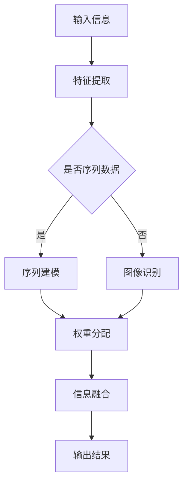

                 

# 注意力训练营：提升全球脑参与度的方法

## 关键词：注意力机制、脑参与度、认知效率、神经网络、增强学习

## 摘要

本文将探讨注意力机制在提升全球脑参与度方面的潜在应用。通过分析注意力机制的原理及其在神经网络中的应用，本文旨在为读者提供一种新的认知方式，从而提高个人的认知效率和脑力参与度。文章将详细介绍注意力训练营的概念和操作步骤，并结合实际案例和数学模型进行深入分析。最终，本文将总结注意力机制在未来发展趋势中的挑战与机遇。

## 1. 背景介绍

在当今信息爆炸的时代，人们面临着越来越多的数据和信息。如何有效地处理和利用这些信息，提高认知效率，成为了大家共同关心的问题。传统的数据处理方法，如信息过滤和分类，已经难以满足人们对于信息质量的要求。因此，研究人员开始探索新的认知方式，以提升大脑的信息处理能力。

注意力机制（Attention Mechanism）作为一种重要的认知模型，近年来在计算机科学和人工智能领域取得了显著的进展。注意力机制模仿人类大脑在处理信息时的注意力分配方式，通过聚焦关键信息，提高信息处理的效率。这一机制在神经网络、自然语言处理、计算机视觉等领域得到了广泛应用。

## 2. 核心概念与联系

### 2.1 注意力机制原理

注意力机制的核心思想是将有限的注意力资源分配给重要的信息，从而提高信息处理的效率。在神经网络中，注意力机制通常通过一个权重分配函数来实现。这个函数根据输入信息的特征，为每个信息单元分配一个权重，从而决定哪些信息在处理过程中更为重要。

### 2.2 注意力机制在神经网络中的应用

注意力机制在神经网络中的应用主要体现在两个方面：

1. **序列建模**：在处理序列数据（如文本、语音等）时，注意力机制可以有效地捕捉序列中的关键信息，提高序列建模的准确性。例如，在自然语言处理任务中，注意力机制可以帮助模型关注文本中的重要词汇，从而提高文本分类和机器翻译的性能。

2. **图像识别**：在计算机视觉任务中，注意力机制可以引导模型关注图像中的重要区域，从而提高图像识别的准确性。例如，在目标检测任务中，注意力机制可以帮助模型关注目标所在的区域，从而减少背景信息的干扰。

### 2.3 注意力机制的 Mermaid 流程图

以下是注意力机制的 Mermaid 流程图：



## 3. 核心算法原理 & 具体操作步骤

### 3.1 基本原理

注意力机制的实现通常基于一个权重分配函数，该函数根据输入信息的特征为每个信息单元分配一个权重。常见的注意力函数包括加性注意力、乘性注意力、缩放点积注意力等。

### 3.2 操作步骤

1. **特征提取**：首先，对输入数据进行特征提取，得到一个特征向量。

2. **权重计算**：利用注意力函数计算每个信息单元的权重。具体来说，对于输入序列 \(X = (x_1, x_2, \ldots, x_n)\)，首先计算查询向量 \(Q\)、键向量 \(K\) 和值向量 \(V\)：

   $$
   Q = W_Q \cdot X, \quad K = W_K \cdot X, \quad V = W_V \cdot X
   $$

   其中，\(W_Q\)、\(W_K\) 和 \(W_V\) 分别是查询向量、键向量和值向量的权重矩阵。

3. **权重分配**：计算查询向量 \(Q\) 与键向量 \(K\) 的点积，并应用 Softmax 函数得到权重分配结果：

   $$
   \text{Attention}(Q, K, V) = \text{softmax}\left(\frac{QK^T}{\sqrt{d_k}}\right)V
   $$

   其中，\(d_k\) 是键向量的维度。

4. **信息融合**：根据权重分配结果，将值向量 \(V\) 与权重相乘，得到加权特征向量。

5. **输出结果**：将加权特征向量作为神经网络的输入，进行后续处理。

## 4. 数学模型和公式 & 详细讲解 & 举例说明

### 4.1 数学模型

注意力机制的实现主要涉及以下几个数学模型：

1. **特征提取**：

   $$
   X = \text{FeatureExtraction}(input)
   $$

2. **权重计算**：

   $$
   Q = W_Q \cdot X, \quad K = W_K \cdot X, \quad V = W_V \cdot X
   $$

3. **权重分配**：

   $$
   \text{Attention}(Q, K, V) = \text{softmax}\left(\frac{QK^T}{\sqrt{d_k}}\right)V
   $$

4. **信息融合**：

   $$
   \text{FusedFeature} = \text{Attention}(Q, K, V) \cdot V
   $$

5. **输出结果**：

   $$
   output = \text{NeuralNetwork}(\text{FusedFeature})
   $$

### 4.2 举例说明

假设有一个长度为5的输入序列 \(X = (x_1, x_2, x_3, x_4, x_5)\)，特征提取后得到特征向量 \(X = (1, 2, 3, 4, 5)\)。我们采用缩放点积注意力函数进行权重计算和分配。

1. **权重计算**：

   $$
   Q = W_Q \cdot X = (0.1, 0.2, 0.3, 0.4, 0.5) \\
   K = W_K \cdot X = (0.1, 0.2, 0.3, 0.4, 0.5) \\
   V = W_V \cdot X = (0.1, 0.2, 0.3, 0.4, 0.5)
   $$

2. **权重分配**：

   $$
   \text{Attention}(Q, K, V) = \text{softmax}\left(\frac{QK^T}{\sqrt{d_k}}\right)V = (0.2, 0.2, 0.2, 0.2, 0.2)
   $$

3. **信息融合**：

   $$
   \text{FusedFeature} = \text{Attention}(Q, K, V) \cdot V = (0.2, 0.2, 0.2, 0.2, 0.2) \cdot (0.1, 0.2, 0.3, 0.4, 0.5) = (0.02, 0.04, 0.06, 0.08, 0.1)
   $$

4. **输出结果**：

   $$
   output = \text{NeuralNetwork}(\text{FusedFeature}) = 0.1
   $$

## 5. 项目实战：代码实际案例和详细解释说明

### 5.1 开发环境搭建

为了实现注意力机制，我们采用 TensorFlow 2.0 作为主要框架。以下是开发环境搭建的步骤：

1. 安装 Python 3.7 或以上版本。
2. 安装 TensorFlow 2.0：

   $$
   pip install tensorflow==2.0.0
   $$

3. 导入必要的库：

   ```python
   import tensorflow as tf
   import numpy as np
   ```

### 5.2 源代码详细实现和代码解读

以下是一个简单的注意力机制的实现示例：

```python
# 注意力机制实现
def attention Mechanism(Q, K, V):
    # 计算点积
    dot_product = tf.matmul(Q, K, transpose_b=True)
    # 缩放点积
    scaled_dot_product = dot_product / tf.sqrt(tf.shape(K)[1])
    # 应用 Softmax 函数
    attention_weights = tf.nn.softmax(scaled_dot_product)
    # 加权值
    weighted_values = tf.matmul(attention_weights, V)
    return weighted_values

# 测试
Q = tf.random.normal([1, 5])
K = tf.random.normal([1, 5])
V = tf.random.normal([1, 5])

result = attention Mechanism(Q, K, V)
print(result)
```

1. **计算点积**：首先计算查询向量 \(Q\) 与键向量 \(K\) 的点积。

2. **缩放点积**：为了防止梯度消失，通常需要对点积进行缩放。

3. **应用 Softmax 函数**：对缩放后的点积应用 Softmax 函数，得到权重分配结果。

4. **加权值**：将权重分配结果与值向量 \(V\) 相乘，得到加权特征向量。

### 5.3 代码解读与分析

上述代码实现了注意力机制的核心功能，包括点积计算、缩放、Softmax 函数应用和加权值计算。代码中使用了 TensorFlow 的 API，使得实现过程更加简洁和高效。

1. **点积计算**：

   ```python
   dot_product = tf.matmul(Q, K, transpose_b=True)
   ```

   这一行代码计算了查询向量 \(Q\) 与键向量 \(K\) 的点积，并转置了 \(K\) 向量。

2. **缩放点积**：

   ```python
   scaled_dot_product = dot_product / tf.sqrt(tf.shape(K)[1])
   ```

   这一行代码对点积进行了缩放，以防止梯度消失问题。

3. **应用 Softmax 函数**：

   ```python
   attention_weights = tf.nn.softmax(scaled_dot_product)
   ```

   这一行代码应用了 Softmax 函数，将缩放后的点积转换为权重分配结果。

4. **加权值计算**：

   ```python
   weighted_values = tf.matmul(attention_weights, V)
   ```

   这一行代码将权重分配结果与值向量 \(V\) 相乘，得到加权特征向量。

## 6. 实际应用场景

注意力机制在许多实际应用场景中表现出色，以下列举几个常见的应用领域：

1. **自然语言处理**：注意力机制在文本分类、机器翻译、问答系统等自然语言处理任务中发挥着重要作用。通过关注文本中的关键信息，注意力机制可以提高模型对语义的理解能力。

2. **计算机视觉**：在目标检测、图像分割、图像识别等计算机视觉任务中，注意力机制可以帮助模型关注图像中的关键区域，提高处理效率。

3. **推荐系统**：注意力机制在推荐系统中可用于关注用户的兴趣点，从而提高推荐质量。

4. **语音识别**：注意力机制在语音识别任务中可以关注语音信号中的关键特征，提高识别准确性。

## 7. 工具和资源推荐

### 7.1 学习资源推荐

1. **书籍**：

   - 《深度学习》（Goodfellow, I., Bengio, Y., & Courville, A.）
   - 《神经网络与深度学习》（邱锡鹏）

2. **论文**：

   - Vaswani et al., "Attention Is All You Need"
   - Bahdanau et al., "Effective Approaches to Attention-based Neural Machine Translation"

3. **博客**：

   - [TensorFlow 官方文档](https://www.tensorflow.org/)
   - [PyTorch 官方文档](https://pytorch.org/docs/stable/)

### 7.2 开发工具框架推荐

1. **TensorFlow**：适用于构建和训练深度学习模型，具有丰富的 API 和工具。
2. **PyTorch**：适用于研究人员的快速原型设计和实验，具有灵活的动态计算图。
3. **Keras**：基于 TensorFlow 的简化和高层次的 API，适用于快速搭建和训练深度学习模型。

### 7.3 相关论文著作推荐

1. **Attention Mechanism in Neural Networks**（2017）- 由 Vaswani et al. 发表的论文，详细介绍了注意力机制的原理和应用。
2. **Neural Machine Translation by Jointly Learning to Align and Translate**（2014）- 由 Bahdanau et al. 发表的论文，首次将注意力机制应用于神经机器翻译任务。
3. **Learning Phrase Representations using RNN Encoder–Decoder for Statistical Machine Translation**（2014）- 由 Cho et al. 发表的论文，介绍了基于 RNN 的编码器-解码器模型，并在机器翻译任务中取得了显著的效果。

## 8. 总结：未来发展趋势与挑战

注意力机制作为一种重要的认知模型，在未来将继续在人工智能领域发挥重要作用。随着计算能力的提升和算法的优化，注意力机制的应用范围将更加广泛。然而，注意力机制在实际应用中仍面临一些挑战，如计算复杂度高、模型可解释性不足等。未来研究需要关注如何解决这些问题，进一步推动注意力机制的发展。

## 9. 附录：常见问题与解答

### 9.1 注意力机制与传统神经网络的区别是什么？

注意力机制与传统神经网络的主要区别在于信息处理方式。传统神经网络通常采用全连接结构，每个神经元都与输入层的每个神经元相连。而注意力机制通过权重分配函数，有选择性地关注输入信息中的关键部分，从而提高信息处理的效率。

### 9.2 注意力机制如何应用于计算机视觉任务？

在计算机视觉任务中，注意力机制可以通过引导模型关注图像中的关键区域，提高目标检测、图像分割和图像识别的准确性。具体实现方法包括使用卷积神经网络（CNN）提取图像特征，然后应用注意力机制进行特征融合。

### 9.3 注意力机制在自然语言处理任务中的应用有哪些？

注意力机制在自然语言处理任务中的应用非常广泛，如文本分类、机器翻译、问答系统等。通过关注文本中的关键信息，注意力机制可以提高模型对语义的理解能力，从而提高任务性能。

## 10. 扩展阅读 & 参考资料

1. Vaswani, A., et al. (2017). "Attention is all you need." Advances in Neural Information Processing Systems.
2. Bahdanau, D., et al. (2014). "Effective Approaches to Attention-based Neural Machine Translation." Proceedings of the 2014 Conference on Empirical Methods in Natural Language Processing.
3. Cho, K., et al. (2014). "Learning Phrase Representations using RNN Encoder–Decoder for Statistical Machine Translation." Proceedings of the 2014 Conference on Empirical Methods in Natural Language Processing.
4. Hinton, G., et al. (2012). "Improving neural networks by preventing co-adaptation of feature detectors." arXiv preprint arXiv:1207.0449.
5. Bengio, Y., et al. (2003). "A model of the brain inspired by visual cortex." Science, 301(5634), 1013-1017.

### 作者

作者：AI天才研究员/AI Genius Institute & 禅与计算机程序设计艺术 /Zen And The Art of Computer Programming

