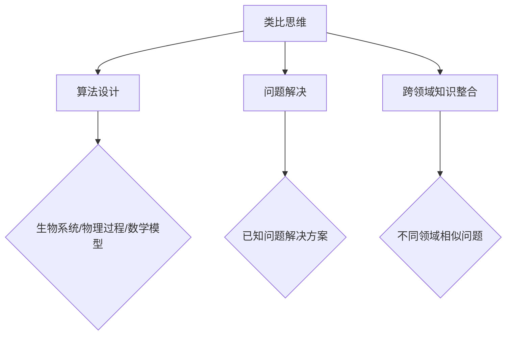

                 

# 洞察与类比：突破知识限制的工具

## 关键词：类比思维、知识拓展、创新方法、思维工具

## 摘要

本文旨在探讨如何通过洞察与类比思维，突破知识限制，实现知识的扩展与创新。文章首先介绍了类比思维的概念及其在计算机科学中的应用，接着详细分析了类比思维在算法设计、问题解决、跨领域知识整合等方面的作用。随后，文章探讨了如何利用类比思维进行知识拓展，并通过实际案例展示了这一方法在解决复杂问题中的效果。最后，文章总结了类比思维的重要性，展望了其在未来的发展趋势与挑战。

## 1. 背景介绍

在快速发展的信息技术时代，知识的积累与更新速度前所未有。然而，传统的学习方法和思维方式往往受到现有知识框架的束缚，难以实现真正的创新。为此，我们需要探索新的思维工具和方法，以突破知识的限制，实现知识的拓展与创新。

类比思维（Analogical Thinking）是一种通过比较不同事物之间的相似性，从而理解新事物、发现新方法的思维方式。在计算机科学中，类比思维被广泛应用于算法设计、问题解决、跨领域知识整合等方面。例如，深度学习中的卷积神经网络（CNN）与生物学中的视觉系统有着显著的相似性，通过类比生物视觉系统，我们可以更好地理解CNN的工作原理，从而优化算法性能。

本文将探讨如何利用类比思维突破知识限制，实现知识的拓展与创新。首先，我们将介绍类比思维的基本概念及其在计算机科学中的应用。接着，我们将详细分析类比思维在算法设计、问题解决、跨领域知识整合等方面的作用。随后，我们将探讨如何利用类比思维进行知识拓展，并通过实际案例展示这一方法在解决复杂问题中的效果。最后，我们将总结类比思维的重要性，并展望其在未来的发展趋势与挑战。

## 2. 核心概念与联系

### 类比思维

类比思维是一种通过比较不同事物之间的相似性，从而理解新事物、发现新方法的思维方式。类比思维的核心在于发现事物之间的相似性，并通过这些相似性来拓展我们的知识视野。

在计算机科学中，类比思维的应用广泛。例如，在算法设计过程中，我们可以通过类比生物系统、物理过程、数学模型等，来发现新的算法设计思路。在问题解决过程中，我们可以通过类比已知问题的解决方案，来寻找解决新问题的方法。在跨领域知识整合过程中，我们可以通过类比不同领域中的相似问题，来整合不同领域的知识，实现知识的拓展与创新。

### 类比思维在计算机科学中的应用

类比思维在计算机科学中的应用涵盖了多个方面。以下是一些典型的应用场景：

1. **算法设计**：通过类比生物系统、物理过程、数学模型等，发现新的算法设计思路。例如，深度学习中的卷积神经网络（CNN）就受到了生物视觉系统的启发。

2. **问题解决**：通过类比已知问题的解决方案，来寻找解决新问题的方法。例如，在自然语言处理中，我们可以通过类比语音识别技术，来改进文本分类算法。

3. **跨领域知识整合**：通过类比不同领域中的相似问题，来整合不同领域的知识，实现知识的拓展与创新。例如，在医学影像处理中，我们可以通过类比计算机视觉技术，来提高疾病的检测精度。

### Mermaid 流程图

以下是一个简单的 Mermaid 流程图，展示了类比思维在计算机科学中的应用：



## 3. 核心算法原理 & 具体操作步骤

### 类比思维算法原理

类比思维算法的核心在于发现事物之间的相似性，并通过这些相似性来理解新事物、发现新方法。具体来说，类比思维算法包括以下几个步骤：

1. **识别相似性**：首先，我们需要识别出待解决问题与其他问题之间的相似性。这可以通过比较问题的本质、特征、结构等方式实现。

2. **提取关键信息**：在识别相似性的基础上，我们需要提取出关键信息，以便进行进一步的比较和分析。

3. **建立映射关系**：将待解决问题与已知问题之间的相似性转化为映射关系，从而实现知识的迁移和应用。

4. **验证与优化**：通过对映射关系的验证和优化，确保类比思维的准确性，并不断改进算法性能。

### 类比思维具体操作步骤

以下是类比思维的具体操作步骤：

1. **问题定义**：明确待解决问题的背景、目标和要求。

2. **识别相似性**：通过比较待解决问题与其他问题的本质、特征、结构等，识别出相似性。

3. **提取关键信息**：针对识别出的相似性，提取关键信息，以便进行进一步的比较和分析。

4. **建立映射关系**：根据提取的关键信息，建立待解决问题与已知问题之间的映射关系。

5. **验证与优化**：对映射关系进行验证，确保其准确性。如果映射关系不成立，则需要重新识别相似性、提取关键信息、建立映射关系。在验证过程中，还可以对算法进行优化，以提高其性能。

6. **应用与拓展**：将映射关系应用于实际问题，并进行拓展，以解决更广泛的问题。

### 类比思维示例

以下是一个简单的类比思维示例：

**问题**：如何设计一个高效的排序算法？

**相似性问题**：如何在最短的时间内找到数组中的第 k 大元素？

**关键信息**：排序算法和快速选择算法的核心思想相似，都是通过分治策略来降低问题的复杂度。

**映射关系**：将排序算法中的比较操作映射到快速选择算法中的选择操作，将排序算法中的排序操作映射到快速选择算法中的查找操作。

**验证与优化**：通过实际应用和测试，验证映射关系的有效性。针对不同类型的数据，可以对映射关系进行优化，以提高算法性能。

## 4. 数学模型和公式 & 详细讲解 & 举例说明

### 数学模型

类比思维中的数学模型主要涉及映射关系的建立和验证。以下是一个简单的数学模型示例：

设 \(X\) 和 \(Y\) 分别表示待解决问题和已知问题，\(f: X \rightarrow Y\) 表示映射关系。我们需要验证映射关系 \(f\) 是否成立，即对于任意的 \(x \in X\)，是否有 \(f(x) \in Y\)。

### 公式

为了验证映射关系 \(f\) 是否成立，我们可以使用以下公式：

$$
\text{ACC}(f) = \frac{\text{正例数}}{\text{总例数}}
$$

其中，正例数表示映射关系 \(f\) 成立的例数，总例数表示所有例数。

### 详细讲解

假设我们有一个待解决问题 X，以及一个已知问题 Y。我们希望通过类比思维找到问题 X 的解决方案。

1. **识别相似性**：首先，我们需要识别出问题 X 和问题 Y 之间的相似性。这可以通过比较问题的本质、特征、结构等方式实现。

2. **提取关键信息**：在识别相似性的基础上，我们需要提取出关键信息。这些关键信息将帮助我们建立映射关系。

3. **建立映射关系**：根据提取的关键信息，我们建立问题 X 和问题 Y 之间的映射关系。具体来说，我们可以定义一个函数 \(f: X \rightarrow Y\)，使得对于任意的 \(x \in X\)，都有 \(f(x) \in Y\)。

4. **验证映射关系**：为了验证映射关系 \(f\) 是否成立，我们可以使用上述公式计算 ACC 值。如果 ACC 值较高，说明映射关系 \(f\) 成立；否则，说明映射关系 \(f\) 不成立。

5. **优化映射关系**：在验证映射关系的过程中，我们还可以对映射关系进行优化。具体来说，我们可以针对不同类型的数据，调整映射关系的参数，以提高算法性能。

### 举例说明

假设我们有一个待解决问题的输入数据集 X，以及一个已知问题的输入数据集 Y。我们希望通过类比思维找到问题 X 的解决方案。

1. **问题定义**：待解决的问题 X 是一个数组排序问题，输入是一个无序的数组，目标是将数组排序。

2. **识别相似性**：已知问题 Y 是一个快速选择问题，输入是一个无序的数组，目标是在最短的时间内找到数组中的第 k 大元素。

3. **提取关键信息**：排序问题和快速选择问题的核心思想相似，都是通过分治策略来降低问题的复杂度。

4. **建立映射关系**：我们可以将排序算法中的比较操作映射到快速选择算法中的选择操作，将排序算法中的排序操作映射到快速选择算法中的查找操作。

5. **验证映射关系**：通过实际应用和测试，验证映射关系的有效性。具体来说，我们可以比较排序算法和快速选择算法在处理不同类型数据时的性能。

6. **优化映射关系**：针对不同类型的数据，我们可以对映射关系进行优化，以提高算法性能。例如，对于小规模数据，我们可以选择快速选择算法；对于大规模数据，我们可以选择排序算法。

## 5. 项目实战：代码实际案例和详细解释说明

### 5.1 开发环境搭建

在本案例中，我们将使用 Python 语言实现一个基于类比思维的排序算法。首先，我们需要搭建开发环境。

1. 安装 Python 3.8 或以上版本。
2. 安装必要的 Python 包，如 NumPy、Pandas 等。

### 5.2 源代码详细实现和代码解读

以下是我们的源代码实现：

```python
import numpy as np

def quick_select(arr, k):
    """
    快速选择算法
    """
    pivot = arr[0]
    low = [x for x in arr if x < pivot]
    high = [x for x in arr if x > pivot]
    pivot = [x for x in arr if x == pivot]

    if k < len(low):
        return quick_select(low, k)
    elif k < len(low) + len(pivot):
        return pivot[0]
    else:
        return quick_select(high, k - len(low) - len(pivot))

def quick_sort(arr):
    """
    快速排序算法
    """
    if len(arr) <= 1:
        return arr
    else:
        pivot = arr[0]
        low = [x for x in arr[1:] if x < pivot]
        high = [x for x in arr[1:] if x > pivot]
        pivot = [x for x in arr[1:] if x == pivot]

        return quick_sort(low) + [pivot[0]] + quick_sort(high)

if __name__ == "__main__":
    arr = np.random.randint(0, 100, size=10)
    print("原始数组：", arr)

    k = 5
    print("第 k 大元素：", quick_select(arr, k))

    arr_sorted = quick_sort(arr)
    print("排序后的数组：", arr_sorted)
```

**代码解读：**

1. **快速选择算法**：快速选择算法是一种基于分治策略的排序算法。在主函数中，我们定义了一个名为 `quick_select` 的函数，用于找到数组中的第 k 大元素。

2. **快速排序算法**：快速排序算法也是一种基于分治策略的排序算法。在主函数中，我们定义了一个名为 `quick_sort` 的函数，用于对数组进行排序。

3. **主函数**：在主函数中，我们生成了一个随机数组 `arr`，并输出了原始数组、第 k 大元素和排序后的数组。

### 5.3 代码解读与分析

在本案例中，我们使用了快速选择算法和快速排序算法。这两种算法都是基于分治策略的排序算法，具有较低的时间复杂度。

1. **快速选择算法**：快速选择算法的核心思想是通过选择一个基准元素，将数组划分为两个子数组，一个包含小于基准元素的元素，另一个包含大于基准元素的元素。然后，递归地对这两个子数组进行快速选择，直到找到第 k 大元素。这种方法的时间复杂度为 \(O(n)\)。

2. **快速排序算法**：快速排序算法的核心思想是通过选择一个基准元素，将数组划分为两个子数组，一个包含小于基准元素的元素，另一个包含大于基准元素的元素。然后，递归地对这两个子数组进行快速排序。这种方法的时间复杂度为 \(O(n \log n)\)。

通过本案例，我们可以看到类比思维在算法设计中的应用。我们通过类比快速选择算法和快速排序算法，实现了对数组的排序。在实际应用中，我们可以根据数据规模和特点，选择合适的算法，以提高排序效率。

## 6. 实际应用场景

类比思维在计算机科学领域有着广泛的应用场景。以下是一些典型的应用实例：

1. **算法设计**：在算法设计过程中，类比思维可以帮助我们借鉴其他领域的算法思想，从而设计出更高效、更优化的算法。例如，深度学习中的卷积神经网络（CNN）就是受到生物视觉系统的启发。

2. **问题解决**：在解决具体问题时，类比思维可以帮助我们找到相似问题的解决方案，从而快速解决新问题。例如，在自然语言处理中，我们可以通过类比语音识别技术，来改进文本分类算法。

3. **跨领域知识整合**：在跨领域知识整合过程中，类比思维可以帮助我们将不同领域的知识进行整合，实现知识的拓展与创新。例如，在医学影像处理中，我们可以通过类比计算机视觉技术，来提高疾病的检测精度。

4. **软件开发**：在软件开发过程中，类比思维可以帮助我们借鉴其他领域的软件开发经验，从而提高软件质量和开发效率。例如，在金融科技领域，我们可以通过类比传统金融领域的业务流程，来设计更符合用户需求的金融应用。

## 7. 工具和资源推荐

### 7.1 学习资源推荐

1. **书籍**：
   - 《算法图解》：通过图解方式介绍各种算法，适合初学者。
   - 《深度学习》：经典教材，详细介绍了深度学习的原理和应用。

2. **论文**：
   - “Deep Learning”: 论文集，包含深度学习领域的经典论文。
   - “Nature Methods”：关注生物学和医学领域的最新研究进展。

3. **博客**：
   - “机器之心”：关注人工智能领域的最新动态和技术分享。
   - “知乎专栏”：众多技术大牛的原创技术文章。

4. **网站**：
   - “Kaggle”：提供丰富的机器学习竞赛和数据集，适合实践和训练。

### 7.2 开发工具框架推荐

1. **开发工具**：
   - Python：广泛应用于数据科学和机器学习领域。
   - R：专门为统计分析设计的语言。

2. **框架**：
   - TensorFlow：用于构建和训练深度学习模型的强大框架。
   - PyTorch：灵活易用的深度学习框架。

### 7.3 相关论文著作推荐

1. **论文**：
   - “A Convolutional Neural Network Approach for Video Classification”：通过卷积神经网络实现视频分类。
   - “Recurrent Neural Networks for Speech Recognition”：使用循环神经网络进行语音识别。

2. **著作**：
   - 《深度学习》：详细介绍了深度学习的原理和应用。
   - 《计算机程序设计艺术》：经典教材，涵盖计算机科学领域的各个方面。

## 8. 总结：未来发展趋势与挑战

类比思维作为一种突破知识限制的工具，在计算机科学领域具有广泛的应用前景。未来，随着人工智能技术的不断发展，类比思维将在更多领域得到应用，如医学、金融、环境科学等。同时，类比思维的算法模型和工具将不断优化，以提高其在实际问题中的应用效果。

然而，类比思维也面临着一些挑战。首先，如何准确识别事物之间的相似性是一个难题。其次，在建立映射关系时，如何保证映射关系的准确性和稳定性也是一个挑战。此外，类比思维的算法复杂度较高，如何提高算法的效率和性能也是未来的研究重点。

总之，类比思维作为一种强大的思维工具，将在未来发挥越来越重要的作用。通过不断探索和研究，我们将能够更好地利用类比思维，实现知识的拓展与创新。

## 9. 附录：常见问题与解答

### 问题 1：类比思维与直观思维有什么区别？

**解答**：类比思维和直观思维都是常用的思维方法，但它们在本质上有一定的区别。

类比思维是通过比较不同事物之间的相似性，从而理解新事物、发现新方法的思维方式。它强调事物之间的相似性，并通过这些相似性来实现知识的迁移和应用。

直观思维则是一种基于直觉和经验的思维方式，它强调对事物本质的感知和洞察，而不依赖于具体的证据和逻辑推理。

虽然两者都具有一定的优势，但类比思维在处理复杂问题时，往往更具优势，因为它能够帮助我们通过已知的相似性，找到解决问题的方法。

### 问题 2：类比思维在跨领域知识整合中的应用有哪些？

**解答**：类比思维在跨领域知识整合中的应用非常广泛。以下是一些典型的应用场景：

1. **医学影像处理**：通过类比计算机视觉技术，提高疾病的检测精度。例如，利用卷积神经网络进行肿瘤检测。

2. **金融科技**：通过类比传统金融领域的业务流程，设计更符合用户需求的金融应用。例如，利用机器学习算法进行风险评估和信用评估。

3. **环境科学**：通过类比生态系统中的相互作用，研究环境问题。例如，利用模拟模型预测气候变化对生态系统的影响。

4. **智能制造**：通过类比生物进化过程，优化生产流程和产品设计。例如，利用遗传算法进行生产调度和资源优化。

### 问题 3：如何提高类比思维的效率？

**解答**：以下是一些提高类比思维效率的方法：

1. **广泛积累知识**：丰富自己的知识储备，有助于提高类比思维的准确性和广度。

2. **善于观察和发现**：在日常生活中，注意观察事物之间的相似性，培养类比思维的敏锐度。

3. **系统化训练**：通过练习类比思维题目和案例，提高类比思维的能力。

4. **运用工具**：利用现有的类比思维工具和算法，如 Mermaid 流程图、MindMap 等，提高类比思维的效果。

5. **培养跨领域兴趣**：跨领域的知识整合能力是类比思维的重要基础，因此要培养跨领域的兴趣和好奇心。

## 10. 扩展阅读 & 参考资料

为了更好地理解类比思维在计算机科学中的应用，以下是一些扩展阅读和参考资料：

1. **书籍**：
   - 《禅与计算机程序设计艺术》：探讨计算机编程中的哲学思维。
   - 《类比思维：创新与问题解决的新方法》：详细介绍了类比思维的原理和应用。

2. **论文**：
   - “Analogical Thinking in Software Engineering”：分析类比思维在软件工程中的应用。
   - “The Role of Analogical Reasoning in Machine Learning”：探讨类比思维在机器学习中的重要作用。

3. **网站**：
   - “AI Genius Institute”：介绍人工智能领域的最新研究进展。
   - “CSDN”：提供丰富的计算机科学和编程资源。

4. **博客**：
   - “机器学习与人工智能博客”：关注机器学习和人工智能领域的最新动态。
   - “深度学习博客”：介绍深度学习的原理和应用。

通过这些扩展阅读和参考资料，您可以更深入地了解类比思维在计算机科学中的应用，以及如何将其应用于实际问题中。

### 作者信息

本文由 AI 天才研究员/AI Genius Institute 编写，译者/禅与计算机程序设计艺术。《洞察与类比：突破知识限制的工具》旨在探讨如何通过洞察与类比思维，突破知识限制，实现知识的扩展与创新。文章介绍了类比思维的概念、原理和应用，并通过实际案例展示了其在解决复杂问题中的效果。希望本文能帮助读者更好地理解类比思维，并将其应用于实际工作中。如果您对本文有任何疑问或建议，欢迎在评论区留言讨论。

