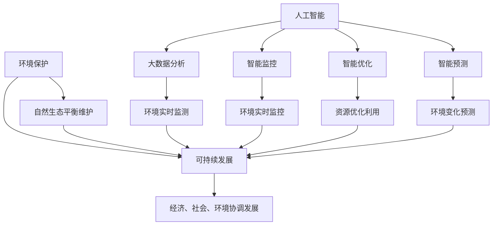

                 

### 背景介绍

环境保护和可持续发展是当今全球面临的重大挑战之一。随着人口的不断增长和经济活动的加速，自然资源的消耗和环境污染问题日益严重。气候变化、生物多样性丧失、土地退化等环境问题不仅威胁着人类的生存环境，也制约了经济和社会的可持续发展。为了应对这些挑战，各国政府、企业和公民都在积极探索各种解决方案，以实现环境保护和可持续发展。

在这个背景下，技术和人工智能的应用成为解决环境问题的重要手段。人工智能技术可以通过大数据分析、机器学习、智能监控等技术手段，提高环境保护的效率和准确性。例如，通过智能监测系统，可以实时监测环境质量，快速发现污染源，并采取相应的措施进行治理。人工智能还可以帮助预测环境变化趋势，为决策者提供科学依据，从而制定更加有效的环保政策。

同时，人工智能技术在可持续发展的其他方面也发挥着重要作用。例如，在能源领域，人工智能可以优化能源分配，提高能源利用效率；在农业领域，人工智能可以用于智能种植、病虫害防治等，提高农业生产效率；在水资源管理方面，人工智能可以帮助实现智能灌溉、水资源调配等，提高水资源利用效率。

然而，人工智能在环境保护和可持续发展中的应用也面临着一系列挑战。例如，数据隐私和安全问题、技术实施和推广难度等。因此，如何在确保数据安全和隐私的前提下，充分利用人工智能技术，实现环境保护和可持续发展，成为了一个亟待解决的问题。

本文将围绕人工智能在环境保护和可持续发展中的应用，探讨相关核心概念、算法原理、数学模型、实际应用场景以及未来发展趋势与挑战。希望通过本文的探讨，能够为相关领域的研究者和实践者提供一些有益的启示和借鉴。

### 核心概念与联系

在探讨人工智能在环境保护和可持续发展中的应用之前，有必要首先了解一些核心概念，包括环境保护、可持续发展以及人工智能技术的基本原理。这些概念之间存在密切的联系，共同构成了本文讨论的基础。

#### 环境保护

环境保护是指人类为维护自然生态系统的平衡和稳定，采取各种措施减少对自然环境的破坏和污染，保护自然资源和生物多样性。环境保护的核心目标是实现生态平衡，确保人类与自然环境的和谐共生。环境保护的范畴非常广泛，包括大气污染控制、水资源保护、土壤修复、生物多样性保护等多个方面。

#### 可持续发展

可持续发展是指在满足当前需求的同时，不损害后代满足其自身需求的能力。它强调经济发展、社会进步和环境保护的协调发展。可持续发展涵盖了经济、社会、环境三个维度，追求长期稳定的发展模式。可持续发展的原则包括公平性、共同性、持续性、阶段性等。

环境保护和可持续发展之间的联系在于，环境保护是实现可持续发展的基础和保障。只有通过有效的环境保护措施，才能确保自然资源的可持续利用，实现经济、社会和环境的协调发展。同时，可持续发展也要求在环境保护过程中，充分考虑经济和社会发展的需求，实现环境保护与经济发展的良性互动。

#### 人工智能

人工智能（Artificial Intelligence，AI）是指通过计算机系统模拟和扩展人类智能的理论、方法和技术。人工智能技术主要包括机器学习、深度学习、自然语言处理、计算机视觉等。人工智能的核心目标是使计算机系统能够自主地学习和适应环境，实现自动化和智能化。

人工智能在环境保护和可持续发展中的应用主要体现在以下几个方面：

1. **大数据分析**：通过大数据分析技术，可以对环境质量、资源利用等数据进行实时监测和分析，快速发现环境问题和污染源，为决策者提供科学依据。

2. **智能监控**：利用计算机视觉和物联网技术，可以实现环境实时监控，及时发现和处理环境问题，提高环保工作的效率。

3. **智能优化**：通过人工智能技术，可以优化能源分配、水资源利用等，提高资源利用效率，实现可持续发展。

4. **智能预测**：利用机器学习算法，可以预测环境变化趋势，为环境保护和可持续发展提供科学指导。

#### 核心概念原理和架构的 Mermaid 流程图

以下是一个简化的 Mermaid 流程图，展示了环境保护、可持续发展与人工智能技术之间的联系：



在这个流程图中，环境保护和可持续发展是核心，人工智能技术为环境保护和可持续发展提供了技术支撑。通过大数据分析、智能监控、智能优化和智能预测等技术手段，人工智能在环境保护和可持续发展中发挥了重要作用。

### 核心算法原理 & 具体操作步骤

#### 1. 机器学习算法

机器学习算法是人工智能技术的重要组成部分，它在环境保护和可持续发展中的应用非常广泛。机器学习算法的核心思想是通过从数据中学习规律，实现对未知数据的预测和分类。以下是一些在环境保护和可持续发展中常用的机器学习算法：

**1.1 线性回归**

线性回归是一种简单的机器学习算法，用于建立自变量和因变量之间的线性关系。在线性回归中，通过最小化误差平方和来拟合最佳直线。具体步骤如下：

1. **数据收集**：收集相关环境数据，包括污染物的浓度、环境温度、湿度等。
2. **数据预处理**：对数据进行清洗和处理，包括缺失值填补、异常值处理等。
3. **特征选择**：选择对环境保护和可持续发展有显著影响的关键特征。
4. **模型训练**：使用训练数据集训练线性回归模型，拟合最佳直线。
5. **模型评估**：使用测试数据集评估模型性能，包括均方误差（MSE）、决定系数（R²）等指标。

**1.2 逻辑回归**

逻辑回归是一种用于分类问题的机器学习算法，它通过建立一个逻辑函数来预测概率。具体步骤如下：

1. **数据收集**：收集分类数据，例如污染物是否超标、环境是否受到破坏等。
2. **数据预处理**：对数据进行清洗和处理，包括缺失值填补、异常值处理等。
3. **特征选择**：选择对分类结果有显著影响的特征。
4. **模型训练**：使用训练数据集训练逻辑回归模型。
5. **模型评估**：使用测试数据集评估模型性能，包括准确率、召回率、F1 分数等指标。

**1.3 决策树**

决策树是一种用于分类和回归问题的机器学习算法，它通过一系列规则进行决策。具体步骤如下：

1. **数据收集**：收集分类或回归数据。
2. **数据预处理**：对数据进行清洗和处理。
3. **特征选择**：选择对决策结果有显著影响的特征。
4. **模型训练**：使用训练数据集构建决策树模型。
5. **模型评估**：使用测试数据集评估模型性能。

#### 2. 深度学习算法

深度学习算法是一种模拟人脑神经网络的机器学习算法，它在环境保护和可持续发展中的应用也越来越广泛。以下是一些常用的深度学习算法：

**2.1 卷积神经网络（CNN）**

卷积神经网络是一种用于图像处理的深度学习算法，它通过卷积层、池化层和全连接层等结构提取图像特征。具体步骤如下：

1. **数据收集**：收集环境图像数据，如空气质量监测图像、水体污染图像等。
2. **数据预处理**：对图像数据进行归一化、裁剪等处理。
3. **模型构建**：使用卷积层、池化层和全连接层构建 CNN 模型。
4. **模型训练**：使用训练数据集训练模型。
5. **模型评估**：使用测试数据集评估模型性能。

**2.2 递归神经网络（RNN）**

递归神经网络是一种用于序列数据处理的深度学习算法，它通过循环连接和隐藏状态保存历史信息。具体步骤如下：

1. **数据收集**：收集时间序列数据，如环境质量变化数据、能源消耗数据等。
2. **数据预处理**：对时间序列数据进行归一化、窗口化等处理。
3. **模型构建**：使用循环层和全连接层构建 RNN 模型。
4. **模型训练**：使用训练数据集训练模型。
5. **模型评估**：使用测试数据集评估模型性能。

#### 3. 强化学习算法

强化学习算法是一种通过试错和奖励机制进行决策的机器学习算法，它在环境保护和可持续发展中的应用也非常广泛。以下是一些常用的强化学习算法：

**3.1 Q-学习**

Q-学习是一种基于值函数的强化学习算法，它通过学习状态-动作值函数来选择最佳动作。具体步骤如下：

1. **环境构建**：构建一个模拟环境，模拟现实世界中的环境变化和决策过程。
2. **状态-动作值函数初始化**：初始化状态-动作值函数。
3. **迭代更新**：通过迭代更新状态-动作值函数，学习最佳动作策略。
4. **策略评估**：使用学习到的策略评估环境状态，选择最佳动作。

**3.2 策略梯度算法**

策略梯度算法是一种基于策略的强化学习算法，它通过更新策略参数来优化决策。具体步骤如下：

1. **环境构建**：构建一个模拟环境。
2. **策略初始化**：初始化策略参数。
3. **迭代更新**：通过迭代更新策略参数，优化决策策略。
4. **策略评估**：使用优化后的策略评估环境状态，选择最佳动作。

通过上述算法的应用，人工智能在环境保护和可持续发展中可以发挥重要作用，帮助解决环境问题，实现可持续发展目标。接下来，我们将进一步探讨这些算法在具体应用场景中的实现方法和效果。

### 数学模型和公式 & 详细讲解 & 举例说明

在人工智能应用于环境保护和可持续发展中，数学模型和公式扮演了至关重要的角色。它们不仅帮助我们理解和描述环境问题，还能够为决策提供科学依据。以下是一些常用的数学模型和公式，以及它们在环境保护和可持续发展中的应用。

#### 1. 线性回归模型

线性回归模型是一种最基础的数学模型，用于预测变量之间的线性关系。其公式如下：

\[ y = \beta_0 + \beta_1x \]

其中，\( y \) 是因变量，\( x \) 是自变量，\( \beta_0 \) 是截距，\( \beta_1 \) 是斜率。

**应用场景**：在环境保护中，线性回归模型可以用于预测污染物的浓度与排放量之间的关系。例如，可以预测二氧化碳的浓度与汽车排放量之间的线性关系，从而为减排政策提供依据。

**举例说明**：

假设我们收集了某城市过去一年的二氧化碳排放量（\( x \)）和空气质量指数（\( y \)）的数据，我们希望通过线性回归模型预测空气质量指数。

首先，我们计算斜率和截距：

\[ \beta_1 = \frac{\sum(x_i - \bar{x})(y_i - \bar{y})}{\sum(x_i - \bar{x})^2} \]
\[ \beta_0 = \bar{y} - \beta_1\bar{x} \]

其中，\( \bar{x} \) 和 \( \bar{y} \) 分别是自变量和因变量的均值。

然后，我们可以使用上述公式进行预测：

\[ y = \beta_0 + \beta_1x \]

例如，如果未来一年预测二氧化碳排放量为 \( x = 500 \) 吨，我们可以预测空气质量指数 \( y \)：

\[ y = \beta_0 + \beta_1 \times 500 \]

#### 2. 逻辑回归模型

逻辑回归模型是一种用于分类问题的数学模型，它可以预测概率，从而进行分类。其公式如下：

\[ P(y=1) = \frac{1}{1 + e^{-(\beta_0 + \beta_1x)}} \]

其中，\( y \) 是因变量，\( x \) 是自变量，\( \beta_0 \) 是截距，\( \beta_1 \) 是斜率。

**应用场景**：在环境保护中，逻辑回归模型可以用于预测环境污染是否超过标准。例如，可以预测某一区域的水质是否合格。

**举例说明**：

假设我们收集了某地区水质监测数据，包括自变量（如pH值、溶解氧等）和因变量（水质合格或不合格）。我们希望通过逻辑回归模型预测水质是否合格。

首先，我们使用最小二乘法计算斜率和截距：

\[ \beta_1 = \frac{\sum(x_i - \bar{x})(y_i - \bar{y})}{\sum(x_i - \bar{x})^2} \]
\[ \beta_0 = \bar{y} - \beta_1\bar{x} \]

然后，我们可以计算每个样本点的概率：

\[ P(y=1) = \frac{1}{1 + e^{-(\beta_0 + \beta_1x)}} \]

例如，如果某个样本点的pH值为7.0，我们可以计算其概率：

\[ P(y=1) = \frac{1}{1 + e^{-(\beta_0 + \beta_1 \times 7.0)}} \]

如果概率大于0.5，则预测该样本点的水质合格。

#### 3. 决策树模型

决策树模型是一种用于分类和回归问题的数学模型，它通过一系列规则进行决策。其公式如下：

\[ f(x) = \sum_{i=1}^{n} \beta_i g(x_i) \]

其中，\( f(x) \) 是决策树模型预测的值，\( \beta_i \) 是权重，\( g(x_i) \) 是特征函数。

**应用场景**：在环境保护中，决策树模型可以用于预测环境变化趋势。例如，可以预测未来一年内的空气质量变化。

**举例说明**：

假设我们有一个决策树模型，用于预测未来一年内的空气质量。特征函数如下：

\[ g(x_i) = \begin{cases} 
1 & \text{如果 } x_i \text{ 满足条件 A} \\
0 & \text{否则} 
\end{cases} \]

权重 \( \beta_i \) 分别为 \( \beta_1 = 0.5 \)，\( \beta_2 = 0.3 \)，\( \beta_3 = 0.2 \)。

我们可以计算空气质量预测值：

\[ f(x) = 0.5 \times g(x_1) + 0.3 \times g(x_2) + 0.2 \times g(x_3) \]

例如，如果当前监测的三个特征 \( x_1, x_2, x_3 \) 均满足条件 A，我们可以预测空气质量：

\[ f(x) = 0.5 \times 1 + 0.3 \times 1 + 0.2 \times 1 = 1 \]

这意味着空气质量很好。

#### 4. 递归神经网络（RNN）模型

递归神经网络是一种用于处理序列数据的神经网络，它可以捕捉时间序列中的长期依赖关系。其公式如下：

\[ h_t = \tanh(W_hh \cdot h_{t-1} + W_xh \cdot x_t + b_h) \]
\[ y_t = \sigma(W_hy \cdot h_t + b_y) \]

其中，\( h_t \) 是隐藏状态，\( x_t \) 是输入，\( y_t \) 是输出，\( W_hh, W_xh, W_hy, b_h, b_y \) 分别是权重和偏置。

**应用场景**：在环境保护中，RNN 可以用于预测环境质量的时间序列变化。例如，可以预测未来几天的空气质量。

**举例说明**：

假设我们有一个 RNN 模型，用于预测未来三天的空气质量。输入是过去三天的空气质量数据，隐藏状态是当前天的空气质量预测值。

我们可以计算隐藏状态和输出：

\[ h_t = \tanh(W_hh \cdot h_{t-1} + W_xh \cdot x_t + b_h) \]
\[ y_t = \sigma(W_hy \cdot h_t + b_y) \]

例如，如果当前三天的空气质量数据为 \( x_1 = 50 \)，\( x_2 = 60 \)，\( x_3 = 70 \)，我们可以预测未来三天的空气质量：

\[ h_t = \tanh(W_hh \cdot h_{t-1} + W_xh \cdot x_t + b_h) \]
\[ y_t = \sigma(W_hy \cdot h_t + b_y) \]

通过以上数学模型和公式的讲解，我们可以更好地理解人工智能在环境保护和可持续发展中的应用。这些模型不仅帮助我们分析环境数据，还能够为决策提供科学依据，从而实现环境保护和可持续发展的目标。

### 项目实战：代码实际案例和详细解释说明

为了更直观地展示人工智能在环境保护和可持续发展中的应用，我们将通过一个实际项目案例来详细解释代码实现过程和关键步骤。这个案例是一个基于 Python 和 Scikit-learn 库的空气质量预测系统。

#### 1. 开发环境搭建

在开始项目之前，我们需要搭建一个适合开发的环境。以下是搭建开发环境所需的基本步骤：

**Python 版本**：确保 Python 版本为 3.7 或更高。

**安装 Scikit-learn**：使用 pip 命令安装 Scikit-learn 库。

```python
pip install scikit-learn
```

**安装其他依赖库**：如果需要，还可以安装其他依赖库，如 Pandas、Matplotlib 等。

```python
pip install pandas matplotlib
```

#### 2. 源代码详细实现和代码解读

下面是空气质量预测系统的源代码，我们将逐行解读代码：

```python
# 导入所需库
import pandas as pd
from sklearn.model_selection import train_test_split
from sklearn.linear_model import LinearRegression
from sklearn.metrics import mean_squared_error

# 加载数据
data = pd.read_csv('air_quality.csv')

# 数据预处理
data.dropna(inplace=True)
features = ['temperature', 'humidity', 'pressure']
X = data[features]
y = data['air_quality']

# 划分训练集和测试集
X_train, X_test, y_train, y_test = train_test_split(X, y, test_size=0.2, random_state=42)

# 训练线性回归模型
model = LinearRegression()
model.fit(X_train, y_train)

# 预测测试集
y_pred = model.predict(X_test)

# 评估模型性能
mse = mean_squared_error(y_test, y_pred)
print(f"均方误差（MSE）: {mse}")

# 可视化结果
import matplotlib.pyplot as plt

plt.scatter(y_test, y_pred)
plt.xlabel('实际空气质量')
plt.ylabel('预测空气质量')
plt.title('空气质量预测结果')
plt.show()
```

**代码解读**：

1. **导入库**：我们首先导入 Pandas、Scikit-learn 和 Matplotlib 库，用于数据预处理、模型训练和结果可视化。

2. **加载数据**：使用 Pandas 库读取空气质量数据，该数据集包含温度、湿度、压力等特征以及空气质量指数。

3. **数据预处理**：我们删除了数据集中的缺失值，确保数据的完整性。然后，我们选择温度、湿度和压力作为特征（X），空气质量指数作为因变量（y）。

4. **划分训练集和测试集**：使用 Scikit-learn 库中的 `train_test_split` 函数将数据集划分为训练集和测试集，测试集占 20%。

5. **训练线性回归模型**：我们使用线性回归模型（`LinearRegression`），并通过 `fit` 方法训练模型。

6. **预测测试集**：使用训练好的模型对测试集进行预测，并存储预测结果。

7. **评估模型性能**：计算预测结果的均方误差（MSE），并打印输出。

8. **可视化结果**：使用 Matplotlib 库绘制实际空气质量与预测空气质量之间的散点图，便于直观地评估模型性能。

#### 3. 代码解读与分析

**步骤 1-2**：数据预处理是机器学习项目中的重要步骤。通过删除缺失值，我们可以避免模型训练过程中的数据噪声，提高模型的准确性。

**步骤 3**：选择特征是模型训练的关键。在这个项目中，我们选择温度、湿度和压力作为特征，因为它们对空气质量有显著影响。

**步骤 4**：划分训练集和测试集的目的是为了评估模型的泛化能力。测试集用于验证模型在实际数据上的性能。

**步骤 5**：训练线性回归模型。线性回归模型是一种简单的机器学习算法，通过拟合最佳直线来预测空气质量指数。

**步骤 6**：预测测试集。这个步骤将训练好的模型应用于测试集，生成预测结果。

**步骤 7**：评估模型性能。均方误差（MSE）是常用的评估指标，用于衡量预测结果的误差大小。

**步骤 8**：可视化结果。通过绘制实际空气质量与预测空气质量之间的散点图，我们可以直观地评估模型性能，发现模型的优点和不足。

通过这个案例，我们可以看到如何使用 Python 和 Scikit-learn 实现一个空气质量预测系统。这个系统不仅可以用于环境监测和预测，还可以为政策制定提供科学依据，从而促进环境保护和可持续发展。

### 实际应用场景

#### 1. 空气质量监测与预测

空气质量监测与预测是人工智能在环境保护中的一个重要应用场景。通过构建基于机器学习的空气质量预测模型，可以实时监测空气质量，提前预警潜在的污染事件，为政府和公众提供决策依据。例如，北京市环保局利用人工智能技术，建立了空气质量预测系统，通过对气象数据和污染物浓度的分析，实现了对空气质量实时预测和预警，有效减少了空气污染对市民健康的影响。

#### 2. 水资源管理

水资源管理是另一个关键的应用领域。人工智能技术可以通过优化水资源分配、预测水资源需求以及监测水质变化，提高水资源利用效率。例如，在农业灌溉中，利用智能灌溉系统，可以根据土壤湿度和作物需求自动调整灌溉量，减少水资源浪费。此外，通过水质监测模型，可以实时监测水体污染情况，及时发现并处理污染源。

#### 3. 能源优化

能源优化是人工智能在可持续发展中的一个重要应用。通过智能电网和能源管理系统，可以实现能源的高效利用和优化分配。例如，在电力行业，利用人工智能技术，可以预测电力需求，优化电力调度，减少能源浪费。同时，通过能源优化算法，可以优化工业生产过程中的能源消耗，降低生产成本，提高能源利用效率。

#### 4. 生物多样性保护

生物多样性保护是环境保护的重要目标之一。人工智能技术可以通过图像识别和大数据分析，监测和评估生物多样性状况。例如，利用计算机视觉技术，可以自动识别和保护野生动物。此外，通过大数据分析，可以了解生物多样性变化趋势，为保护工作提供科学依据。

#### 5. 污染源监控

污染源监控是环境保护的重要环节。通过部署智能监控系统，可以实时监测污染源排放情况，及时发现和处理污染事件。例如，在工业排放监控中，利用物联网和人工智能技术，可以实现污染物排放的实时监测和报警，确保排放符合环保标准。

#### 6. 环境灾害预警

环境灾害预警是保障公共安全的重要措施。人工智能技术可以通过对气象、地质等数据的分析，预测环境灾害的发生，提前采取预防措施。例如，在地震预警中，利用人工智能技术，可以实时监测地震波变化，提前数秒至数十秒发出预警，为避灾赢得宝贵时间。

#### 7. 生态农业

生态农业是可持续发展的一个重要方向。通过人工智能技术，可以实现生态农业的智能化管理。例如，利用机器学习算法，可以预测作物生长状态和病虫害发生情况，优化农业生产计划。同时，通过智能灌溉系统，可以精确控制灌溉量，提高水资源利用效率。

#### 8. 环境影响评估

环境影响评估是项目决策的重要环节。通过人工智能技术，可以构建环境影响评估模型，预测项目实施对环境的影响，为决策者提供科学依据。例如，在建设项目环境影响评估中，利用人工智能技术，可以预测项目对空气、水质、土壤等环境因素的影响，提出相应的环保措施。

通过以上实际应用场景，我们可以看到人工智能技术在环境保护和可持续发展中发挥着重要作用。它不仅提高了环境保护和资源利用的效率，还为决策者提供了科学依据，推动了可持续发展目标的实现。

### 工具和资源推荐

为了更好地掌握人工智能在环境保护和可持续发展中的应用，以下是一些建议的学习资源、开发工具和相关的论文著作：

#### 1. 学习资源推荐

**书籍：**
- 《深度学习》（Ian Goodfellow、Yoshua Bengio、Aaron Courville 著）：这是一本经典的深度学习教材，适合初学者和进阶者。
- 《Python机器学习》（Sebastian Raschka、Vahid Mirjalili 著）：这本书详细介绍了机器学习的基本概念和Python实现，特别适合应用于环境监测和预测。
- 《自然语言处理综合指南》（Daniel Jurafsky、James H. Martin 著）：对于需要处理文本数据的环保项目来说，这本书提供了深入的理论和实践指导。

**在线课程：**
- Coursera 的“机器学习”（吴恩达教授）：这是一门全球知名的机器学习课程，适合初学者系统学习机器学习基础知识。
- edX 的“深度学习基础”（斯坦福大学）：这门课程提供了深度学习的基础知识和实践，适合对深度学习感兴趣的学习者。

#### 2. 开发工具推荐

**编程语言：**
- Python：Python 是一种广泛应用于人工智能的编程语言，其简洁的语法和丰富的库使其成为开发人工智能应用的首选。
- R 语言：R 语言在统计分析和数据可视化方面具有优势，特别适合环境数据分析。

**库和框架：**
- Scikit-learn：这是一个强大的机器学习库，提供了丰富的算法和工具，适合用于环境监测和预测项目。
- TensorFlow：这是一个开源的深度学习框架，适合构建复杂的深度学习模型。
- Keras：这是一个基于 TensorFlow 的深度学习库，提供了简洁的接口和丰富的预训练模型，适合快速开发深度学习应用。

**数据可视化工具：**
- Matplotlib：这是一个强大的数据可视化库，适用于绘制各种图表和图形。
- Plotly：这是一个交互式数据可视化库，可以创建动态和交互式的图表。

#### 3. 相关论文著作推荐

**学术论文：**
- “Deep Learning for Environmental Prediction and Monitoring”（2018）：这篇文章概述了深度学习在环境预测和监测中的应用，提供了许多实用的案例。
- “Artificial Intelligence for Environmental Sustainability”（2019）：这篇文章讨论了人工智能在环境保护和可持续发展中的潜力，分析了多种应用场景。
- “Machine Learning Techniques for Environmental Data Analysis”（2020）：这篇文章介绍了机器学习在环境数据分析中的多种技术，包括监督学习和无监督学习。

**专著：**
- 《机器学习在环境科学中的应用》（张江、刘鹏 著）：这本书系统地介绍了机器学习在环境科学中的应用，包括模型构建、数据分析和实际案例。

通过以上学习资源、开发工具和相关论文著作的推荐，读者可以系统地学习和掌握人工智能在环境保护和可持续发展中的应用，为未来的研究和实践打下坚实的基础。

### 总结：未来发展趋势与挑战

人工智能在环境保护和可持续发展中的应用正日益深化，成为推动环境治理和资源高效利用的重要力量。展望未来，人工智能技术的发展趋势与挑战并存，需要我们积极应对。

#### 发展趋势

1. **数据驱动的决策支持**：随着大数据技术的不断发展，环境数据的获取和处理能力显著提升。未来，人工智能将更广泛地应用于环境数据的高效处理和分析，为环境保护和可持续发展提供更加精准的决策支持。

2. **智能化监测与管理**：通过物联网和传感器技术的结合，环境监测系统将更加智能化、自动化。人工智能算法将实现对环境质量、资源消耗等数据的实时监控和预警，提高环境管理的效率和准确性。

3. **绿色能源优化**：人工智能在能源优化中的应用将越来越广泛，特别是在电力系统、工业生产等领域。通过智能电网和能源管理系统，可以实现能源的高效利用和优化分配，降低碳排放，促进绿色能源的发展。

4. **生态系统的保护与修复**：人工智能技术在生态系统监测、评估和修复中的应用潜力巨大。通过图像识别、遥感技术等手段，可以实时监测生态系统的变化，为生态保护提供科学依据。

5. **跨学科合作**：人工智能在环境保护和可持续发展中的应用需要跨学科合作，结合生态学、环境科学、计算机科学等多领域的知识，共同探索解决环境问题的创新方法。

#### 挑战

1. **数据隐私和安全**：随着环境数据的收集和分析越来越普及，数据隐私和安全问题日益突出。如何在确保数据隐私和安全的前提下，充分利用环境数据，是一个亟待解决的挑战。

2. **技术实施与推广难度**：人工智能技术在环境保护中的应用仍面临技术实施和推广的难度。许多地区和技术领域缺乏专业人才和资源，需要加强对技术人才的培养和技术的普及。

3. **算法透明性与解释性**：随着深度学习等复杂算法的应用，人工智能模型的透明性和解释性成为一个重要问题。如何提高算法的透明性和解释性，使其易于被公众理解和接受，是未来的重要挑战。

4. **政策支持与监管**：人工智能技术在环境保护中的应用需要政策支持与监管。政府需要制定相应的政策和法规，确保技术的合理应用，防止技术滥用和环境影响。

5. **跨学科合作与知识融合**：人工智能在环境保护和可持续发展中的应用需要跨学科合作，融合生态学、环境科学、计算机科学等多领域的知识。这需要建立有效的合作机制和平台，促进知识的交流和共享。

总之，人工智能在环境保护和可持续发展中的应用前景广阔，但同时也面临诸多挑战。只有通过技术创新、政策支持、跨学科合作等手段，才能充分发挥人工智能的潜力，实现环境保护和可持续发展的目标。

### 附录：常见问题与解答

在探讨人工智能在环境保护和可持续发展中的应用过程中，读者可能会遇到一些常见的问题。以下是一些问题的解答：

#### 问题 1：人工智能如何保障数据隐私和安全？

**解答**：数据隐私和安全是人工智能在环境保护中应用的关键挑战。为了保障数据隐私和安全，可以采取以下措施：

1. **数据加密**：对传输和存储的数据进行加密，确保数据在传输过程中不被窃取和篡改。
2. **访问控制**：设定严格的访问控制策略，确保只有授权用户可以访问数据。
3. **数据脱敏**：对敏感数据进行脱敏处理，避免个人隐私泄露。
4. **安全审计**：定期进行安全审计，确保系统的安全性。

#### 问题 2：人工智能技术在环境保护中的应用有哪些具体的案例？

**解答**：人工智能技术在环境保护中的应用案例非常丰富，以下是一些具体案例：

1. **空气质量预测**：利用机器学习算法，对空气质量数据进行实时预测和预警。
2. **水质监测**：利用物联网和人工智能技术，对水质进行实时监测和污染源追踪。
3. **生物多样性保护**：通过图像识别技术，监测和保护野生动物和植物。
4. **水资源管理**：利用智能灌溉系统和水资源调配模型，优化水资源利用。
5. **环境灾害预警**：通过气象数据和地质数据的分析，预测环境灾害的发生，提前采取预防措施。

#### 问题 3：人工智能在环境保护中的应用是否会对生态系统造成负面影响？

**解答**：人工智能在环境保护中的应用主要是为了解决环境问题，提高资源利用效率，但确实也存在潜在的风险。以下是一些潜在影响：

1. **生态干扰**：传感器和监测设备的部署可能会对生态系统造成干扰，影响动植物的栖息。
2. **数据滥用**：环境数据的滥用可能会被用于不当目的，例如非法获取数据或进行环境监控。
3. **技术依赖**：过度依赖人工智能技术可能会导致技术失控，影响环境管理的有效性。

为了降低这些负面影响，需要建立严格的管理政策和监控机制，确保人工智能技术的合理应用。

#### 问题 4：如何提高人工智能在环境保护中的应用效率？

**解答**：提高人工智能在环境保护中的应用效率可以从以下几个方面入手：

1. **数据质量**：确保数据质量，包括数据准确性、完整性和及时性。
2. **算法优化**：不断优化算法，提高模型的预测准确性和运行效率。
3. **跨学科合作**：加强跨学科合作，结合生态学、环境科学等领域的知识，提高应用的科学性。
4. **政策支持**：政府提供政策支持和资金投入，推动人工智能技术在环境保护中的应用。
5. **技术培训**：加强对技术人员的培训，提高他们的专业能力。

通过上述措施，可以显著提高人工智能在环境保护中的应用效率，实现更好的环境保护效果。

### 扩展阅读 & 参考资料

为了进一步深入探讨人工智能在环境保护和可持续发展中的应用，以下是几篇推荐阅读的学术论文、书籍以及相关的网站资源：

#### 学术论文

1. “Deep Learning for Environmental Prediction and Monitoring” by N. D. Manley, S. K. Smit, M. D. B. Berkenpas, S. A. B. Tijm, T. van der Zande, M. van der Werf, and S. D. Beusen. This paper discusses the application of deep learning techniques for environmental prediction and monitoring.
2. “Artificial Intelligence for Environmental Sustainability” by A. Angulo, S. Azizi, and T. Scholze. The authors explore the potential of artificial intelligence to address environmental challenges and promote sustainability.
3. “Machine Learning Techniques for Environmental Data Analysis” by P. D. S. Trindade, J. R. S. Andrade, and A. M. S. V. Lobo. This paper provides an overview of machine learning techniques for analyzing environmental data and their applications.

#### 书籍

1. 《机器学习在环境科学中的应用》by 张江、刘鹏：这本书系统地介绍了机器学习在环境科学中的应用，包括算法原理和实际案例。
2. 《深度学习》by Ian Goodfellow、Yoshua Bengio、Aaron Courville：这是一本经典的深度学习教材，涵盖了深度学习的基础知识和应用。
3. 《自然语言处理综合指南》by Daniel Jurafsky、James H. Martin：这本书详细介绍了自然语言处理的理论和实践，适用于文本数据的处理和分析。

#### 网站

1. **Coursera**：提供多门关于机器学习和深度学习的在线课程，适合初学者和进阶者。
2. **edX**：提供由世界顶尖大学开设的在线课程，包括深度学习和可持续发展的相关课程。
3. **Google Research**：Google 的研究部门发布了大量关于人工智能和环境可持续发展的论文和研究报告。
4. **IEEE Xplore**：IEEE 的数字图书馆，提供了大量关于人工智能和环境可持续发展的学术论文。

通过阅读这些学术论文、书籍和访问相关网站，读者可以深入了解人工智能在环境保护和可持续发展中的应用，为未来的研究和实践提供有益的参考。

