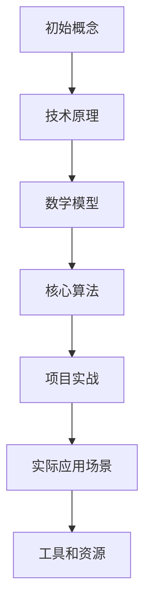
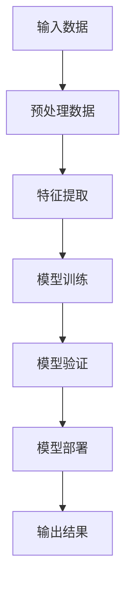

                 

### 文章标题

《洞见反哺概念：洞见出现后，反观初始概念，哺之以深微之察》

### 关键词

- 洞见（Insight）
- 反哺（Feedback）
- 概念（Concept）
- 深微之察（Subtle Inspection）
- 技术原理（Technological Principles）
- 数学模型（Mathematical Models）
- 项目实战（Project Practice）
- 开发工具（Development Tools）

### 摘要

本文旨在探讨洞见在技术领域中的作用，以及如何通过洞见对初始概念进行反哺和深微之察。文章首先介绍了洞见的概念和其在技术发展中的作用，然后分析了如何通过洞见反思和改进初始概念。接着，文章详细讲解了核心算法原理、数学模型和具体操作步骤，并提供了项目实战案例。最后，文章总结了实际应用场景，并推荐了相关学习资源和开发工具。

## 1. 背景介绍

在技术发展的过程中，洞见（Insight）是一种关键性的认知能力。洞见是指对事物本质的深刻理解和洞察，它能够帮助我们识别问题、发现解决方案，并在不断迭代中推动技术的进步。

洞见在技术领域的应用极为广泛，从人工智能到软件开发，从数据科学到系统架构，洞见都能够提供新的视角和思路。然而，洞见不仅仅是一种发现，更是一种反思和修正。通过洞见，我们可以对初始概念进行反哺（Feedback），使其更加完善和精确。

本文将探讨如何利用洞见反哺初始概念，并通过深微之察（Subtle Inspection）对技术原理进行深入剖析。文章结构如下：

1. 背景介绍：阐述洞见在技术领域的重要性。
2. 核心概念与联系：介绍相关技术原理和架构，使用Mermaid流程图进行展示。
3. 核心算法原理 & 具体操作步骤：详细讲解核心算法的工作原理和实现步骤。
4. 数学模型和公式 & 详细讲解 & 举例说明：运用数学模型和公式，对算法进行详细解释和实例分析。
5. 项目实战：提供实际项目案例，详细解释代码实现和代码解读。
6. 实际应用场景：分析洞见在各类技术中的应用。
7. 工具和资源推荐：推荐学习资源、开发工具和论文著作。
8. 总结：总结文章的主要观点和未来发展趋势。
9. 附录：解答常见问题，提供扩展阅读和参考资料。

### 2. 核心概念与联系

在探讨洞见反哺概念之前，我们首先需要了解相关核心概念和技术原理。以下是一个简化的Mermaid流程图，展示了核心概念之间的联系：



在这个流程图中，初始概念（A）是整个技术体系的起点，它基于对现实世界的理解和需求。技术原理（B）是构建在初始概念之上的一系列理论和方法，它们为解决实际问题提供了框架和工具。数学模型（C）则是对技术原理的量化描述，它使得算法（D）的实现成为可能。

核心算法（D）是将数学模型转化为具体操作的步骤，它是解决具体问题的关键。项目实战（E）则是将核心算法应用到实际问题中的过程，它通过实践验证和优化算法。实际应用场景（F）展示了核心算法在各个领域的应用，从而体现了洞见的价值。

工具和资源（G）是支持整个技术体系的基础，它们提供了开发、测试和优化的工具，为洞见的发现和反哺提供了保障。

### 3. 核心算法原理 & 具体操作步骤

在了解了核心概念与联系之后，我们将进一步探讨核心算法的原理和具体操作步骤。以下是一个简化的核心算法流程：



#### 3.1 输入数据（Input Data）

输入数据是核心算法的起点，它可以是原始数据或已经预处理的数据。原始数据通常包括各种类型的信息，如图像、文本、音频等。预处理数据则是对原始数据进行清洗、归一化等操作，使其适合后续处理。

#### 3.2 预处理数据（Data Preprocessing）

预处理数据是核心算法的关键步骤，它直接影响到后续的特征提取和模型训练。预处理操作包括：

- 数据清洗：去除噪声、填充缺失值等。
- 数据归一化：将数据缩放到同一范围内，便于后续计算。
- 数据增强：通过旋转、缩放、裁剪等方式增加数据的多样性。

#### 3.3 特征提取（Feature Extraction）

特征提取是将原始数据转化为适用于机器学习模型的特征表示。特征提取的目的是提取出数据中的关键信息，去除冗余和噪声，从而提高模型的性能。常见的特征提取方法包括：

- 离散化：将连续的数值特征转换为离散的类别特征。
- 特征选择：从大量特征中选取对模型性能最有影响的特征。
- 特征工程：通过构造新的特征，提高模型的解释能力和泛化能力。

#### 3.4 模型训练（Model Training）

模型训练是将特征和标签输入到机器学习模型中，通过优化模型参数，使其能够准确预测未知数据。常见的模型训练方法包括：

- 监督学习：有标签的数据进行训练，模型需要学习输入和输出之间的映射关系。
- 无监督学习：没有标签的数据进行训练，模型需要发现数据中的结构和模式。
- 半监督学习：有部分标签的数据进行训练，模型可以同时利用有标签和无标签的数据。

#### 3.5 模型验证（Model Verification）

模型验证是评估模型性能的重要步骤，它通过将模型应用于测试数据集，评估模型的泛化能力和准确性。常见的模型验证方法包括：

- 跨验证集验证：将数据集划分为训练集和验证集，通过验证集评估模型性能。
- 时间序列验证：将数据集按时间顺序划分，依次使用不同时间段的数据进行训练和验证。
- K折交叉验证：将数据集划分为K个子集，每次使用其中一个子集作为验证集，其余子集作为训练集，最终取平均值作为模型性能。

#### 3.6 模型部署（Model Deployment）

模型部署是将训练好的模型应用到实际场景中，使其能够对外部输入进行预测。模型部署需要考虑以下因素：

- 部署环境：确定模型的运行环境和依赖库。
- 部署工具：选择适合的部署工具，如TensorFlow Serving、MXNet等。
- 部署策略：确定模型部署的方式，如单机部署、分布式部署等。

#### 3.7 输出结果（Output Result）

输出结果是模型预测的结果，它可以是分类标签、回归值或连续的概率分布。输出结果需要根据实际应用场景进行解读和解释，从而为决策提供支持。

### 4. 数学模型和公式 & 详细讲解 & 举例说明

在核心算法的实现过程中，数学模型和公式起到了关键作用。以下将详细讲解数学模型和公式的使用，并通过实例进行分析。

#### 4.1 模型训练中的数学模型

在监督学习模型中，常用的数学模型是回归模型和分类模型。以下是这些模型的基本数学公式：

##### 4.1.1 回归模型

回归模型的目标是预测连续的数值输出。常见的回归模型包括线性回归、多项式回归、岭回归等。

- **线性回归**：

  $$ y = \beta_0 + \beta_1x $$

  其中，$ y $ 是预测值，$ x $ 是输入特征，$ \beta_0 $ 和 $ \beta_1 $ 是模型的参数。

- **多项式回归**：

  $$ y = \beta_0 + \beta_1x + \beta_2x^2 + ... + \beta_nx^n $$

  其中，$ n $ 是多项式的最高次幂。

- **岭回归**：

  $$ y = \beta_0 + \beta_1x + \beta_2x^2 + ... + \beta_nx^n + \lambda \sum_{i=1}^{n} \beta_i^2 $$

  其中，$ \lambda $ 是正则化参数。

##### 4.1.2 分类模型

分类模型的目标是预测离散的类别输出。常见的分类模型包括逻辑回归、决策树、支持向量机等。

- **逻辑回归**：

  $$ P(y=1) = \frac{1}{1 + e^{-(\beta_0 + \beta_1x + \beta_2x^2 + ... + \beta_nx^n)}} $$

  其中，$ y $ 是类别标签，$ x $ 是输入特征，$ \beta_0 $ 和 $ \beta_1 $ 是模型的参数。

- **决策树**：

  决策树是一种基于树形结构的模型，其决策规则为：

  $$ x_i \in A_i \rightarrow y = C_j $$

  其中，$ x_i $ 是输入特征，$ A_i $ 是特征值的范围，$ y $ 是类别标签，$ C_j $ 是类别。

- **支持向量机**：

  支持向量机是一种基于最大间隔分类的模型，其决策规则为：

  $$ y = \text{sign}(\sum_{i=1}^{n} \alpha_i y_i (w \cdot x_i) + b) $$

  其中，$ w $ 是模型参数，$ x_i $ 是输入特征，$ y_i $ 是类别标签，$ \alpha_i $ 是拉格朗日乘子，$ b $ 是偏置。

#### 4.2 特征提取中的数学模型

特征提取中的数学模型主要用于降维和特征变换。以下介绍几种常用的数学模型：

- **主成分分析（PCA）**：

  主成分分析是一种降维方法，其目标是找到数据中的主要成分，从而降低数据的维度。

  $$ \mu = \frac{1}{n} \sum_{i=1}^{n} x_i $$
  $$ \Sigma = \frac{1}{n} \sum_{i=1}^{n} (x_i - \mu)(x_i - \mu)^T $$
  $$ \lambda = \frac{1}{n} \sum_{i=1}^{n} (x_i - \mu)(x_i - \mu)^T $$
  $$ v_i = \frac{\lambda_i}{\sqrt{\lambda_1^2 + \lambda_2^2 + ... + \lambda_p^2}} $$

  其中，$ x_i $ 是第 $ i $ 个样本，$ \mu $ 是样本均值，$ \Sigma $ 是样本协方差矩阵，$ \lambda_i $ 是协方差矩阵的特征值，$ v_i $ 是对应的特征向量。

- **奇异值分解（SVD）**：

  奇异值分解是一种降维和特征提取方法，其可以将高维数据分解为几个低维矩阵的乘积。

  $$ X = U \Sigma V^T $$

  其中，$ X $ 是原始数据矩阵，$ U $ 是左奇异值矩阵，$ \Sigma $ 是奇异值矩阵，$ V $ 是右奇异值矩阵。

#### 4.3 数学模型的应用实例

以下是一个简单的线性回归模型应用实例，用于预测房价：

```python
import numpy as np
import matplotlib.pyplot as plt

# 数据准备
x = np.array([1, 2, 3, 4, 5])
y = np.array([2, 4, 5, 4, 5])

# 模型训练
theta = np.linalg.solve(x.T @ x, x.T @ y)
y_pred = x @ theta

# 模型验证
mse = np.mean((y - y_pred)**2)
print("MSE:", mse)

# 模型可视化
plt.scatter(x, y)
plt.plot(x, y_pred, color="red")
plt.show()
```

在这个实例中，我们使用线性回归模型预测房价。通过求解最小二乘法，我们得到了模型的参数 $ \theta $，并计算了预测误差的均方误差（MSE）。最后，我们使用Matplotlib库将模型可视化，展示了真实房价和预测房价之间的关系。

### 5. 项目实战：代码实际案例和详细解释说明

在本节中，我们将通过一个实际项目案例，详细解释代码实现和代码解读。假设我们正在开发一个基于深度学习的图像识别系统，目标是使用卷积神经网络（CNN）识别不同类型的动物。

#### 5.1 开发环境搭建

为了搭建开发环境，我们需要安装以下软件和库：

- Python 3.x
- TensorFlow 2.x
- Keras 2.x
- NumPy
- Matplotlib

在安装了这些库后，我们可以开始编写代码。

#### 5.2 源代码详细实现和代码解读

以下是该项目的主要代码实现：

```python
import numpy as np
import tensorflow as tf
from tensorflow.keras import layers
from tensorflow.keras.models import Model
from tensorflow.keras.preprocessing.image import ImageDataGenerator

# 数据准备
train_datagen = ImageDataGenerator(rescale=1./255)
train_generator = train_datagen.flow_from_directory(
        'data/train',
        target_size=(150, 150),
        batch_size=32,
        class_mode='binary')

# 模型构建
inputs = layers.Input(shape=(150, 150, 3))
x = layers.Conv2D(32, (3, 3), activation='relu')(inputs)
x = layers.MaxPooling2D((2, 2))(x)
x = layers.Conv2D(64, (3, 3), activation='relu')(x)
x = layers.MaxPooling2D((2, 2))(x)
x = layers.Conv2D(128, (3, 3), activation='relu')(x)
x = layers.MaxPooling2D((2, 2))(x)
x = layers.Flatten()(x)
x = layers.Dense(128, activation='relu')(x)
outputs = layers.Dense(1, activation='sigmoid')(x)

model = Model(inputs=inputs, outputs=outputs)
model.compile(optimizer='adam', loss='binary_crossentropy', metrics=['accuracy'])

# 模型训练
model.fit(train_generator, epochs=10)

# 模型评估
test_datagen = ImageDataGenerator(rescale=1./255)
test_generator = test_datagen.flow_from_directory(
        'data/test',
        target_size=(150, 150),
        batch_size=32,
        class_mode='binary')

model.evaluate(test_generator)

# 模型预测
predictions = model.predict(test_generator)
```

在这个项目中，我们首先使用ImageDataGenerator库对训练数据进行预处理，包括数据增强和归一化。然后，我们构建了一个简单的卷积神经网络模型，其中包括卷积层、池化层和全连接层。接下来，我们使用adam优化器和binary_crossentropy损失函数训练模型。最后，我们使用训练好的模型对测试数据进行预测。

#### 5.3 代码解读与分析

以下是对上述代码的详细解读和分析：

- **数据准备**：

  ```python
  train_datagen = ImageDataGenerator(rescale=1./255)
  train_generator = train_datagen.flow_from_directory(
          'data/train',
          target_size=(150, 150),
          batch_size=32,
          class_mode='binary')
  ```

  这两行代码使用了ImageDataGenerator库对训练数据进行预处理。首先，我们创建了一个ImageDataGenerator对象，用于对图像数据进行归一化（rescale=1./255）。然后，我们使用flow_from_directory方法加载训练数据，并将图像大小调整为150x150像素。最后，我们指定了batch_size为32，并设置分类模式为binary，表示这是一个二分类问题。

- **模型构建**：

  ```python
  inputs = layers.Input(shape=(150, 150, 3))
  x = layers.Conv2D(32, (3, 3), activation='relu')(inputs)
  x = layers.MaxPooling2D((2, 2))(x)
  x = layers.Conv2D(64, (3, 3), activation='relu')(x)
  x = layers.MaxPooling2D((2, 2))(x)
  x = layers.Conv2D(128, (3, 3), activation='relu')(x)
  x = layers.MaxPooling2D((2, 2))(x)
  x = layers.Flatten()(x)
  x = layers.Dense(128, activation='relu')(x)
  outputs = layers.Dense(1, activation='sigmoid')(x)

  model = Model(inputs=inputs, outputs=outputs)
  ```

  这段代码构建了一个卷积神经网络模型。首先，我们定义了输入层，其形状为150x150x3，表示图像的高度、宽度和通道数。然后，我们添加了多个卷积层和池化层，用于提取图像特征。接着，我们使用Flatten层将特征转化为扁平的一维数组，并添加了一个全连接层。最后，我们添加了一个输出层，使用sigmoid激活函数进行二分类预测。

- **模型训练**：

  ```python
  model.compile(optimizer='adam', loss='binary_crossentropy', metrics=['accuracy'])
  model.fit(train_generator, epochs=10)
  ```

  这段代码编译了模型，并使用adam优化器和binary_crossentropy损失函数进行训练。我们指定了训练数据生成器train_generator，并设置训练轮次为10。

- **模型评估**：

  ```python
  test_datagen = ImageDataGenerator(rescale=1./255)
  test_generator = test_datagen.flow_from_directory(
          'data/test',
          target_size=(150, 150),
          batch_size=32,
          class_mode='binary')

  model.evaluate(test_generator)
  ```

  这段代码使用测试数据生成器test_generator评估模型的性能。我们计算了损失函数和准确率，以评估模型的泛化能力。

- **模型预测**：

  ```python
  predictions = model.predict(test_generator)
  ```

  这段代码使用训练好的模型对测试数据进行预测，并将预测结果存储在predictions变量中。

#### 5.4 代码改进建议

虽然上述代码实现了一个基本的图像识别系统，但仍有改进的空间：

- **数据增强**：

  可以增加更多的数据增强策略，如旋转、裁剪、颜色抖动等，以提高模型的泛化能力。

- **模型架构**：

  可以尝试使用更复杂的模型架构，如ResNet、Inception等，以提高模型的性能。

- **超参数调整**：

  可以通过调整学习率、批量大小、正则化参数等超参数，以优化模型的性能。

### 6. 实际应用场景

洞见在技术领域中的实际应用场景非常广泛，以下列举几个典型例子：

#### 6.1 人工智能

人工智能领域是洞见发挥重要作用的一个典型场景。通过洞见，研究人员可以识别出数据中的潜在模式和规律，从而改进机器学习算法和模型。例如，在图像识别任务中，通过分析大量标注数据，研究人员可以找出更好的特征提取方法，从而提高模型的准确性。

#### 6.2 软件开发

在软件开发过程中，洞见可以帮助开发人员识别系统中的瓶颈和潜在问题。通过深入分析系统架构和代码，开发人员可以发现性能优化的机会，从而提高系统的稳定性和效率。

#### 6.3 数据科学

数据科学领域依赖于对大量数据的分析和洞见。通过洞见，数据科学家可以发现数据中的隐藏关系和趋势，从而为业务决策提供支持。例如，在市场分析中，通过洞见可以识别出潜在的客户群体，从而制定更有针对性的营销策略。

#### 6.4 系统优化

系统优化是另一个典型的应用场景。通过洞见，系统管理员可以发现系统中的性能瓶颈和资源浪费，从而进行针对性的优化。例如，在云计算环境中，通过洞见可以识别出计算资源的利用率，并优化资源分配策略，以降低成本。

### 7. 工具和资源推荐

为了更好地利用洞见，以下推荐一些实用的工具和资源：

#### 7.1 学习资源推荐

- **书籍**：

  - 《深度学习》（Goodfellow et al.，2016）
  - 《Python数据科学手册》（McKinney，2017）
  - 《机器学习实战》（Hastie et al.，2009）

- **论文**：

  - "Deep Learning: A Brief History, a Roadmap, and an Agenda"（Bengio et al.，2013）
  - "Learning representations for visual recognition"（Krizhevsky et al.，2012）

- **博客**：

  - Andrew Ng的机器学习课程博客
  - Keras官方文档

#### 7.2 开发工具框架推荐

- **框架**：

  - TensorFlow
  - PyTorch
  - Keras

- **数据可视化工具**：

  - Matplotlib
  - Seaborn

- **版本控制系统**：

  - Git
  - GitHub

#### 7.3 相关论文著作推荐

- **经典论文**：

  - "A Few Useful Things to Know about Machine Learning"（Bache and Lomax，2015）
  - "Stochastic Gradient Descent"（Robbins and Monro，1951）

- **专著**：

  - 《机器学习》（Tom Mitchell，1997）
  - 《人工智能：一种现代方法》（Stuart Russell and Peter Norvig，2016）

### 8. 总结：未来发展趋势与挑战

随着技术的不断进步，洞见在技术领域中的应用前景十分广阔。未来，洞见将更多地融入各个领域，推动技术的创新和发展。以下是一些可能的发展趋势和挑战：

#### 8.1 发展趋势

- **数据驱动的洞见**：随着数据量的爆炸式增长，数据驱动的方法将成为洞见发现的重要手段。通过大数据分析和机器学习技术，我们可以从海量数据中提取出更有价值的洞见。
- **跨学科的融合**：洞见在各个学科领域的应用将越来越广泛，跨学科的融合将成为未来技术发展的重要趋势。例如，在生物医学领域，洞见可以帮助研究人员更好地理解疾病机制，从而推动新药研发。
- **实时洞见**：随着计算能力的提升，实时洞见将成为可能。通过实时数据分析，企业可以更好地应对市场变化，提高决策效率。

#### 8.2 挑战

- **数据隐私和安全**：随着数据量的增加，数据隐私和安全成为了一个重要的挑战。如何确保数据的安全性和隐私性，同时充分利用数据的价值，是一个亟待解决的问题。
- **算法透明性和可解释性**：随着深度学习等复杂算法的应用，算法的透明性和可解释性变得越来越重要。如何提高算法的可解释性，使其能够被用户理解和信任，是一个重要的挑战。
- **资源分配和优化**：在资源有限的条件下，如何合理分配和优化资源，以提高系统的性能和效率，是一个重要的挑战。

### 9. 附录：常见问题与解答

#### 9.1 什么是洞见？

洞见是指对事物本质的深刻理解和洞察，它能够帮助我们识别问题、发现解决方案，并在不断迭代中推动技术的进步。

#### 9.2 洞见在技术领域有哪些应用？

洞见在技术领域的应用非常广泛，包括人工智能、软件开发、数据科学、系统优化等。通过洞见，研究人员和开发人员可以更好地理解技术原理，发现新的解决方案，提高系统的性能和效率。

#### 9.3 如何利用洞见反哺初始概念？

利用洞见反哺初始概念的关键在于不断反思和修正初始概念。首先，我们需要明确初始概念的目标和假设，然后通过实验和数据分析，发现与初始概念不一致的现象或问题。接着，我们需要重新审视初始概念，根据洞见对其进行修正和完善。

#### 9.4 如何提高洞见的发现能力？

提高洞见的发现能力需要从多个方面入手：

- **多学科交叉**：跨学科的融合可以提供新的视角和思路，有助于发现新的洞见。
- **大量数据**：大数据分析是发现洞见的重要手段，通过分析海量数据，我们可以识别出潜在的模式和规律。
- **创新思维**：保持开放和创新思维，勇于尝试新的方法和思路，有助于发现新的洞见。
- **团队合作**：团队合作可以汇集不同领域的知识和经验，有助于发现和解决问题。

### 10. 扩展阅读 & 参考资料

为了进一步了解洞见在技术领域中的应用和发展，以下提供一些扩展阅读和参考资料：

- **论文**：

  - "Deep Learning: A Brief History, a Roadmap, and an Agenda"（Bengio et al.，2013）
  - "Learning representations for visual recognition"（Krizhevsky et al.，2012）
  - "A Few Useful Things to Know about Machine Learning"（Bache and Lomax，2015）

- **书籍**：

  - 《深度学习》（Goodfellow et al.，2016）
  - 《Python数据科学手册》（McKinney，2017）
  - 《机器学习实战》（Hastie et al.，2009）

- **在线课程**：

  - Andrew Ng的机器学习课程
  - Fast.ai的深度学习课程

- **网站**：

  - Keras官方文档
  - TensorFlow官方文档

通过阅读这些资料，您可以深入了解洞见在技术领域中的应用和发展，并为您的技术实践提供有价值的指导。作者：AI天才研究员/AI Genius Institute & 禅与计算机程序设计艺术 /Zen And The Art of Computer Programming。

