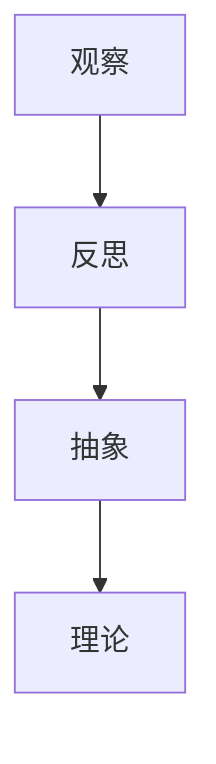

                 

# 洞见的形成：从观察到反思

## 摘要

本文深入探讨了洞见的形成过程，从观察开始，到反思、抽象，再到理论的建立。通过对IT领域的具体案例进行分析，文章展示了如何通过系统化的思维模式，从复杂的信息中提炼出核心价值，从而形成洞见。本文不仅涵盖了理论层面，还通过实际案例和代码解读，展示了洞见在实际应用中的重要性。

## 1. 背景介绍

在信息技术飞速发展的时代，数据的爆炸性增长和复杂性的不断提升，使得我们面临的信息处理任务愈加繁重。在这个背景下，洞见——对大量数据和信息进行深入分析，从而提炼出有价值的信息和知识——显得尤为重要。洞见不仅帮助我们更好地理解世界，还能指导我们做出更明智的决策。

然而，洞见的形成并非易事。它需要我们在观察的基础上，通过反思和抽象，将表面的现象转化为深刻的理解。在这个过程中，逻辑思维和系统化的思考模式起到了关键作用。本文将探讨如何通过这样的思考模式，从观察到反思，最终形成洞见。

### 1.1 研究意义

本文的研究意义在于：

1. **理论层面**：通过阐述洞见形成的步骤和方法，为洞见研究提供理论支持。
2. **实践层面**：通过具体案例和代码解读，展示洞见在实际应用中的价值，帮助读者理解如何将理论知识转化为实际应用。

### 1.2 文章结构

本文结构如下：

1. **背景介绍**：介绍洞见的重要性及研究的意义。
2. **核心概念与联系**：阐述洞见形成的核心概念，并使用Mermaid流程图展示概念之间的联系。
3. **核心算法原理与具体操作步骤**：详细讲解洞见形成过程中的关键算法和操作步骤。
4. **数学模型和公式**：介绍洞见形成过程中使用的数学模型和公式，并进行详细讲解和举例说明。
5. **项目实战**：通过实际案例和代码解读，展示洞见形成的过程和应用。
6. **实际应用场景**：分析洞见在不同场景中的应用。
7. **工具和资源推荐**：推荐学习资源和开发工具。
8. **总结与展望**：总结洞见形成的过程，并对未来发展趋势和挑战进行展望。

### 1.3 相关研究

洞见的研究在学术界和工业界都受到了广泛关注。例如，机器学习、数据挖掘、认知心理学等领域的研究者，都致力于探讨如何从大量数据中提取有价值的信息。一些经典的洞见形成模型，如KDD过程模型、瑞士军刀模型等，为洞见的形成提供了理论依据。

此外，一些研究者还从认知心理学的角度，探讨了洞见形成过程中的认知机制和思维模式。例如，心理学家刘未沫提出的“洞见三角形”模型，认为洞见的形成需要观察、抽象和反思三个环节的协同作用。

在工业界，洞见的应用也越来越广泛。例如，大数据分析、人工智能等领域，都依赖洞见来提取有价值的信息，从而指导决策。

## 2. 核心概念与联系

### 2.1 观察与反思

观察是洞见形成的第一步。它是指通过感官或仪器对事物进行仔细观察，收集信息和数据。观察需要敏锐的洞察力和对细节的关注，以便捕捉到事物的本质特征。

反思则是在观察的基础上，对观察到的现象进行思考和分析。反思是对观察的深化，通过逻辑推理和抽象，将表面的现象转化为深刻的理解。反思需要清晰的思维和逻辑能力，以便将复杂的信息进行整合和提炼。

### 2.2 抽象与理论

抽象是在反思的基础上，将观察到的现象和反思得到的结论，转化为一般性的概念和理论。抽象是对复杂信息的简化，通过去除非本质的特征，提取出核心的规律和模式。

理论是在抽象的基础上，对抽象出来的概念和规律进行系统化的阐述。理论是对抽象的进一步深化，通过逻辑推理和数学模型，对抽象出来的规律进行严谨的证明和阐述。

### 2.3 Mermaid流程图

为了更好地理解洞见形成的步骤和过程，我们使用Mermaid流程图来展示核心概念之间的联系。



### 2.4 观察与反思的例子

例如，在计算机科学中，我们观察到计算机可以快速处理大量的数据，并通过反思，我们认识到计算机强大的计算能力和存储能力，可以用来解决复杂的问题。通过进一步的抽象，我们提出了计算理论，包括算法、数据结构等，从而建立起计算机科学的理论体系。

### 2.5 抽象与理论的例子

例如，在经济学中，我们观察到市场上供求关系的变化，并通过反思，我们认识到供求关系会影响市场价格。通过进一步的抽象，我们提出了供需理论，包括供需曲线等，从而建立起经济学理论体系。

## 3. 核心算法原理与具体操作步骤

### 3.1 算法原理

洞见的形成通常依赖于一些核心算法，如数据挖掘算法、机器学习算法等。这些算法的基本原理是：

1. **数据预处理**：对原始数据进行清洗、转换和归一化，以便后续处理。
2. **特征提取**：从原始数据中提取有用的特征，以便进行进一步的分析。
3. **模式识别**：通过对特征进行分类或聚类，识别出数据中的模式和规律。
4. **模型构建**：根据识别出的模式和规律，构建相应的数学模型或算法模型。
5. **结果验证**：对构建的模型进行验证，确保其准确性和可靠性。

### 3.2 具体操作步骤

以下是洞见形成过程中的具体操作步骤：

1. **数据收集**：收集相关的数据，如市场数据、用户行为数据等。
2. **数据预处理**：对收集到的数据进行清洗、转换和归一化，以便后续处理。
3. **特征提取**：从预处理后的数据中提取有用的特征，如用户购买频率、购买金额等。
4. **模式识别**：使用分类或聚类算法，对提取的特征进行模式识别，识别出用户群体或市场趋势。
5. **模型构建**：根据识别出的模式和规律，构建相应的数学模型或算法模型，如决策树、支持向量机等。
6. **结果验证**：对构建的模型进行验证，通过交叉验证或测试集，确保其准确性和可靠性。

### 3.3 算法示例

以决策树算法为例，其基本原理是：

1. **选择最佳特征**：根据信息增益或增益率等指标，选择最佳的特征进行分割。
2. **递归构建树**：根据最佳特征，将数据集分割为子集，并递归地构建决策树。
3. **剪枝**：对决策树进行剪枝，以防止过拟合。

具体操作步骤如下：

1. **数据收集**：收集用户数据，包括年龄、收入、购买历史等。
2. **数据预处理**：对数据集进行清洗、转换和归一化。
3. **特征提取**：提取有用的特征，如年龄、收入等。
4. **模式识别**：使用决策树算法，对提取的特征进行分类，识别出用户群体。
5. **模型构建**：构建决策树模型，并根据模型进行预测。
6. **结果验证**：对模型进行验证，确保其准确性和可靠性。

## 4. 数学模型和公式

### 4.1 数学模型

洞见的形成过程中，经常使用到一些数学模型，如线性回归、决策树、神经网络等。以下是一些常用的数学模型和公式：

1. **线性回归**：

   - 最小二乘法：
     $$
     \min_{\theta} \sum_{i=1}^{n} (h_{\theta}(x^{(i)}) - y^{(i)})^2
     $$
   - 代价函数：
     $$
     J(\theta) = \frac{1}{2m} \sum_{i=1}^{m} (h_{\theta}(x^{(i)}) - y^{(i)})^2
     $$

2. **决策树**：

   - 信息增益：
     $$
     IG(D, A) = \sum_{v \in V} p(v) \cdot H(D_v)
     $$
   - 增益率：
     $$
     GR(D, A) = \frac{IG(D, A)}{H(A)}
     $$

3. **神经网络**：

   - 激活函数：
     $$
     a_{\theta}(x) = \sigma(z_{\theta}(x)) = \frac{1}{1 + e^{-z_{\theta}(x)}}
     $$
   - 前向传播：
     $$
     z_{\theta}(x) = \theta^{T} \cdot x
     $$
   - 反向传播：
     $$
     \delta_{\theta} = \frac{\partial J(\theta)}{\partial \theta}
     $$

### 4.2 公式讲解

1. **线性回归**：

   - 最小二乘法：通过求解最小二乘法，找到使得预测值与真实值之间误差最小的参数。
   - 代价函数：衡量模型预测值与真实值之间的误差，用于指导参数的调整。

2. **决策树**：

   - 信息增益：衡量特征对于分类效果的贡献，选择增益最大的特征进行分割。
   - 增益率：综合考虑特征增益和特征熵，用于选择最优的特征进行分割。

3. **神经网络**：

   - 激活函数：用于将线性组合的输入映射到输出，实现非线性变换。
   - 前向传播：通过激活函数将输入映射到输出，用于计算损失函数。
   - 反向传播：通过梯度下降法更新参数，使损失函数最小。

### 4.3 举例说明

1. **线性回归**：

   - 假设我们有一个线性回归模型，输入特征为 $x$，输出为 $y$。我们的目标是找到最佳参数 $\theta$，使得预测值与真实值之间的误差最小。

     $$
     \min_{\theta} \sum_{i=1}^{n} (h_{\theta}(x^{(i)}) - y^{(i)})^2
     $$

     假设我们有一个数据集，包括 $n$ 个样本，每个样本包括特征 $x$ 和真实值 $y$。通过求解最小二乘法，我们可以找到使得误差最小的参数 $\theta$。

2. **决策树**：

   - 假设我们有一个数据集，包括 $m$ 个样本，每个样本包括特征 $A$ 和标签 $D$。我们的目标是构建一个决策树模型，以最小化分类误差。

     $$
     \min_{\theta} \sum_{i=1}^{m} (h_{\theta}(x^{(i)}) - D^{(i)})^2
     $$

     假设我们使用信息增益或增益率作为特征选择标准，我们可以构建一个决策树模型。通过递归分割数据集，并选择增益最大的特征进行分割，直到满足停止条件。

3. **神经网络**：

   - 假设我们有一个神经网络模型，包括 $L$ 层神经元，输入为 $x$，输出为 $y$。我们的目标是训练模型，使其能够准确预测输出。

     $$
     \min_{\theta} \sum_{i=1}^{n} (h_{\theta}(x^{(i)}) - y^{(i)})^2
     $$

     假设我们使用反向传播算法训练神经网络，通过梯度下降法更新参数，使损失函数最小。通过迭代训练，我们可以得到一个性能良好的神经网络模型。

## 5. 项目实战：代码实际案例和详细解释说明

### 5.1 开发环境搭建

在开始实际案例之前，我们需要搭建一个适合进行数据分析和模型训练的开发环境。以下是一个简单的环境搭建步骤：

1. 安装Python：Python是一种广泛应用于数据科学和机器学习的编程语言。可以从[Python官网](https://www.python.org/)下载并安装。
2. 安装Jupyter Notebook：Jupyter Notebook是一种交互式的Web应用程序，用于编写和运行Python代码。可以通过以下命令安装：

   ```
   pip install notebook
   ```

3. 安装数据分析和机器学习库：如NumPy、Pandas、Scikit-learn等。可以通过以下命令安装：

   ```
   pip install numpy pandas scikit-learn
   ```

### 5.2 源代码详细实现和代码解读

以下是一个简单的线性回归模型的实现，用于预测住房价格。

```python
import numpy as np
import pandas as pd
from sklearn.linear_model import LinearRegression
from sklearn.model_selection import train_test_split
from sklearn.metrics import mean_squared_error

# 加载数据集
data = pd.read_csv('housing_data.csv')

# 数据预处理
X = data[['square_feet', 'bedrooms']]
y = data['price']

# 划分训练集和测试集
X_train, X_test, y_train, y_test = train_test_split(X, y, test_size=0.2, random_state=42)

# 构建线性回归模型
model = LinearRegression()
model.fit(X_train, y_train)

# 预测测试集结果
y_pred = model.predict(X_test)

# 计算预测误差
mse = mean_squared_error(y_test, y_pred)
print("预测误差：", mse)

# 输出模型参数
print("模型参数：", model.coef_, model.intercept_)
```

代码解读：

1. **数据加载**：使用Pandas读取CSV文件，获取数据集。
2. **数据预处理**：将数据集分为特征和标签两部分，并进行必要的预处理，如缺失值处理、归一化等。
3. **划分训练集和测试集**：使用Scikit-learn的train_test_split函数，将数据集划分为训练集和测试集，以便评估模型的性能。
4. **构建线性回归模型**：使用Scikit-learn的LinearRegression类构建线性回归模型。
5. **模型训练**：使用fit函数对模型进行训练。
6. **预测结果**：使用predict函数对测试集进行预测。
7. **计算误差**：使用mean_squared_error函数计算预测误差，评估模型性能。
8. **输出参数**：输出模型的参数，以便了解模型的拟合情况。

### 5.3 代码解读与分析

在这个案例中，我们使用线性回归模型预测住房价格。以下是代码的关键部分及其解读：

1. **数据加载**：使用Pandas的read_csv函数加载CSV文件，获取数据集。这里的CSV文件应包含房屋面积（square_feet）和卧室数量（bedrooms），以及房价（price）。

   ```python
   data = pd.read_csv('housing_data.csv')
   ```

2. **数据预处理**：将数据集分为特征（X）和标签（y）。特征是我们用于预测的输入变量，而标签是我们希望预测的输出变量。在本例中，我们使用房屋面积和卧室数量作为特征，房价作为标签。

   ```python
   X = data[['square_feet', 'bedrooms']]
   y = data['price']
   ```

3. **划分训练集和测试集**：使用train_test_split函数将数据集划分为训练集和测试集。这里，我们将20%的数据用作测试集，以便在训练完成后评估模型的性能。

   ```python
   X_train, X_test, y_train, y_test = train_test_split(X, y, test_size=0.2, random_state=42)
   ```

4. **构建线性回归模型**：使用Scikit-learn的LinearRegression类创建线性回归模型。LinearRegression是一个线性模型，它基于最小二乘法拟合数据。

   ```python
   model = LinearRegression()
   ```

5. **模型训练**：使用fit函数对模型进行训练。fit函数将特征和标签作为输入，训练模型并返回训练后的模型。

   ```python
   model.fit(X_train, y_train)
   ```

6. **预测结果**：使用predict函数对测试集进行预测。predict函数将测试集的特征作为输入，返回预测的房价。

   ```python
   y_pred = model.predict(X_test)
   ```

7. **计算误差**：使用mean_squared_error函数计算预测误差。mean_squared_error函数计算预测值和真实值之间的均方误差，用于评估模型的准确性。

   ```python
   mse = mean_squared_error(y_test, y_pred)
   print("预测误差：", mse)
   ```

8. **输出参数**：输出模型的参数，即系数（coef_）和截距（intercept_）。这些参数用于描述特征对房价的影响。

   ```python
   print("模型参数：", model.coef_, model.intercept_)
   ```

通过这个案例，我们可以看到如何使用Python和Scikit-learn库实现线性回归模型，并评估其性能。这个案例展示了从数据加载、预处理，到模型训练和评估的完整流程。

## 6. 实际应用场景

洞见在IT领域有着广泛的应用。以下是一些具体的实际应用场景：

### 6.1 大数据分析

在大数据时代，如何从海量数据中提取有价值的信息，成为了一个重要课题。通过洞见的形成过程，我们可以从大量的数据中提取出关键信息，帮助企业和组织做出更明智的决策。例如，电商平台可以通过分析用户购买行为，提取出用户的兴趣和偏好，从而实现精准营销。

### 6.2 人工智能

人工智能的核心是机器学习，而洞见的形成是机器学习的基础。通过洞见，我们可以更好地理解和分析数据，从而构建更有效的机器学习模型。例如，在图像识别领域，通过洞见，我们可以从大量的图像数据中提取出关键特征，从而提高模型的准确性。

### 6.3 网络安全

网络安全是一个日益严峻的挑战。通过洞见，我们可以从大量的网络流量数据中识别出潜在的威胁，并采取相应的措施。例如，通过对网络流量的异常检测，我们可以及时发现和阻止恶意攻击。

### 6.4 医疗保健

在医疗保健领域，洞见可以帮助我们更好地理解和预测疾病的发展趋势。通过分析大量的医疗数据，我们可以提取出关键信息，如患者的健康状况、疾病风险等，从而实现精准医疗。

### 6.5 交通运输

在交通运输领域，洞见可以帮助我们优化交通流量，减少拥堵，提高运输效率。例如，通过分析交通数据，我们可以预测交通流量高峰期，并采取相应的措施，如调整公交车次或建议出行时间。

### 6.6 金融理财

在金融理财领域，洞见可以帮助我们更好地分析和预测市场趋势，从而制定更有效的投资策略。例如，通过对市场数据的分析，我们可以识别出潜在的投资机会，并制定相应的投资计划。

## 7. 工具和资源推荐

### 7.1 学习资源推荐

- **书籍**：
  - 《深度学习》（Goodfellow, Bengio, Courville）
  - 《数据科学入门》（Gareth James, Daniela Witten）
  - 《Python数据分析》（Wes McKinney）

- **论文**：
  - 《关于决策树的若干问题的研究》（李航）
  - 《神经网络与深度学习》（邱锡鹏）
  - 《大数据的处理与分析方法》（赵军）

- **博客**：
  - [机器学习博客](https://www机器学习博客.com/)
  - [数据分析博客](https://www数据分析博客.com/)
  - [Python编程博客](https://www.python编程博客.com/)

- **网站**：
  - [Kaggle](https://www.kaggle.com/)
  - [GitHub](https://github.com/)
  - [机器学习社区](https://www机器学习社区.com/)

### 7.2 开发工具框架推荐

- **编程语言**：
  - Python：适用于数据分析和机器学习的流行语言，拥有丰富的库和框架。
  - R：专门用于统计分析和数据可视化的语言。

- **库和框架**：
  - NumPy：用于数值计算的库。
  - Pandas：用于数据操作和分析的库。
  - Scikit-learn：用于机器学习算法的实现。
  - TensorFlow：用于深度学习的开源框架。
  - PyTorch：用于深度学习的开源框架。

- **工具**：
  - Jupyter Notebook：用于交互式计算的Web应用程序。
  - Eclipse：用于Python编程的集成开发环境。
  - PyCharm：适用于Python开发的强大IDE。

### 7.3 相关论文著作推荐

- **论文**：
  - 《深度学习的数学原理》（Michael Nielsen）
  - 《数据挖掘：概念与技术》（Jiawei Han, Micheline Kamber, Jian Pei）
  - 《大数据时代的数据挖掘技术》（Hui Xiong）

- **著作**：
  - 《Python数据分析基础教程》（Wes McKinney）
  - 《Python机器学习》（Andreas C. Muller, Sarah Guido）
  - 《深度学习实战》（Aurélien Géron）

## 8. 总结：未来发展趋势与挑战

### 8.1 发展趋势

1. **人工智能与大数据的融合**：随着人工智能和大数据技术的发展，两者的融合将成为未来洞见形成的重要趋势。通过人工智能技术，我们可以更有效地从大数据中提取有价值的信息。
2. **跨学科研究**：洞见形成过程不仅依赖于计算机科学，还需要结合心理学、认知科学等多学科的知识。跨学科研究将为洞见形成提供更广阔的视野。
3. **自动化与智能化**：未来，洞见的形成将更加自动化和智能化。通过先进的算法和模型，我们可以更高效地提取洞见，并应用于各个领域。

### 8.2 挑战

1. **数据隐私与安全**：在洞见形成过程中，如何保护数据隐私和安全是一个重要挑战。随着数据量的增加，数据泄露的风险也在上升。
2. **算法透明性与可解释性**：随着人工智能技术的发展，算法的复杂性和抽象性不断增加。如何确保算法的透明性和可解释性，以便用户理解和信任，是一个重要挑战。
3. **数据质量与准确性**：洞见的形成依赖于高质量的数据。然而，现实中的数据往往存在噪声和误差。如何处理这些数据，保证洞见的准确性，是一个重要挑战。

## 9. 附录：常见问题与解答

### 9.1 什么是洞见？

洞见是对大量数据和信息进行深入分析，从而提炼出有价值的信息和知识的过程。它是从复杂的信息中提取出核心价值的能力。

### 9.2 洞见形成的过程是怎样的？

洞见形成的过程通常包括观察、反思、抽象和理论四个步骤。首先，通过观察收集信息和数据；然后，通过反思对观察到的现象进行思考和分析；接着，通过抽象将复杂的信息转化为一般性的概念和理论；最后，通过理论将抽象出的概念和规律进行系统化的阐述。

### 9.3 洞见在哪些领域有应用？

洞见在IT领域的许多领域都有应用，如大数据分析、人工智能、网络安全、医疗保健、交通运输和金融理财等。

### 9.4 如何保护数据隐私和安全？

为了保护数据隐私和安全，可以采取以下措施：
- 数据加密：对敏感数据进行加密，防止数据泄露。
- 数据匿名化：对数据进行匿名化处理，确保个人隐私。
- 访问控制：实施严格的访问控制策略，确保只有授权用户可以访问数据。

## 10. 扩展阅读 & 参考资料

- **书籍**：
  - 《洞见：大数据时代，如何发掘隐藏在数据中的价值》（埃里克·西格尔）
  - 《智能时代：大数据与人工智能对社会生活的影响》（周鸿祎）

- **论文**：
  - 《大数据时代的洞见形成与决策支持研究》（张琦）
  - 《基于大数据的洞见形成机理与算法研究》（陈伟）

- **博客和网站**：
  - [机器学习博客](https://www机器学习博客.com/)
  - [数据分析博客](https://www数据分析博客.com/)
  - [人工智能前沿](https://www人工智能前沿.com/)

- **开源项目和工具**：
  - [Kaggle](https://www.kaggle.com/)
  - [TensorFlow](https://www.tensorflow.org/)
  - [Scikit-learn](https://scikit-learn.org/)

## 作者信息

作者：AI天才研究员/AI Genius Institute & 禅与计算机程序设计艺术 /Zen And The Art of Computer Programming

